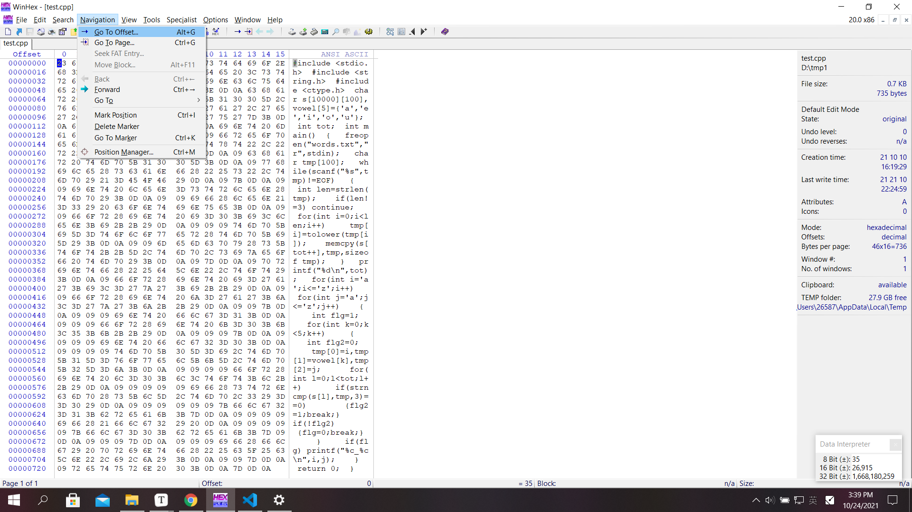
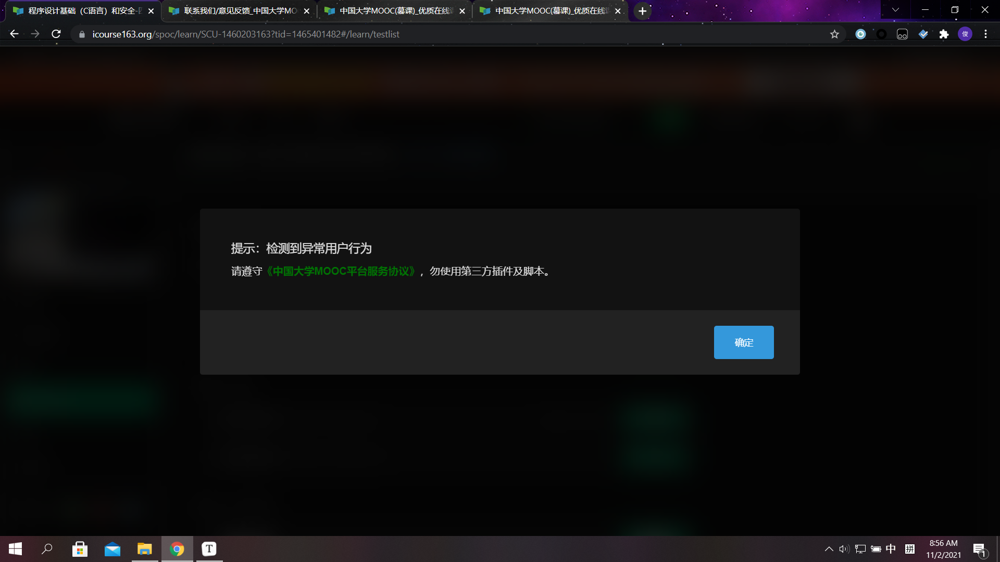

layout: post

title: 二一——再见，鼠标

author: junyu33

tags: 

categories: 

- 随笔

date: 2021-10-24 10:00:00

---

# introduction

为了提高工作效率，以及出于对手腕健康的考虑（现在已经有一定程度的肿胀磨损）。在这个**特殊的日子**，我鼠标的最后一点电耗尽之际，我决心抛弃鼠标，将**几乎**所有的操作全部转移到键盘上。

<!-- more -->

其实相对于普通的电脑使用者来说，我使用鼠标的频率还是比较低的（大概20%的时间，其中大部分都贡献在浏览网页上），然而时不时花个两三秒的时间去点击一个链接还是让我很不爽。

如果有朝一日我能真正摆脱对鼠标与触控板的依赖，并熟练使用vim，效率甚至比使用鼠标的人高，那便是再好不过的事情了。

# shortcuts

使用快捷键来代替鼠标的几次点击是最常用，也最重要的键盘操作方式。

除了Ctrl-C，Ctrl-V，Win+E，Win+R，Ctrl+Alt+Del这类**妇孺皆知**的快捷键以外，还有系统的各种快捷键、应用快捷键等成百上千种快捷键，在等待着我们的学习。

## system (Win)

下面说一下我最常用的（上面写的除外）：

Tab——没这个你怎么移动光标

↑↓←→——没这个你怎么移动光标

Ctrl+Shift+Esc——任务管理器

Ctrl+Shirt+N——新建文件夹

Win+number——打开在任务栏的程序

Win+Shift+number——重新打开一个

Win+X——一些比较常用的功能

Win+I——设置

Win+L——注销（防机惨）

Win+Q——搜索

Win+Shift+S——截图

Alt+Tab——在窗口间切换

Alt+Shift——切换输入法语言

Alt+F4——关闭窗口

Alt+Space+X——最大化

Alt+Space+N——最小化

Alt+Space+R——还原

>tips:
>①如果你安装了everything/火萤酱/listary之类的工具（别安火萤视频桌面，有证据表明它不安全），你可以双击Ctrl来快速搜索应用，效率大增。
>
>②Win+R的一些常用的程序名也得记住，如cmd、winver、control、taskmgr、netplwiz、appwiz.cpl、inetcpl.cpl、services.msc、compmgmt.msc等等（这里边程序名基本是英文或者英文缩写，所以大家英语必须要学好才行）

其实系统方面的快捷键还是比较好掌握的，尤其是有了工具的加成，用键盘玩转Win难度其实不大。

## browser (Chrome)

浏览器这边就相对来说麻烦一点，因为随便一个网页都有可能有几十上百个超链接，单纯利用Tab键来找到自己想要的页面太费时了。对于chrome来说，有一个好用的插件叫*vimium*（英文含义是像Vim编辑器一样操作），可以将这些繁琐的操作进行一些简化。

>对于vimium，我最常用的快捷键很少，只有以下几个：
>①f键，可以将页面的超链接与字母进行对应，输入字母就可以跳转到链接。
>②j键向下滚动，k键向上滚动。（其实PgUp与PgDn也不错）

至于浏览器本身的操作，常用的有以下几个：

Tab——虽然找超链接不好用，但是填表用这个还是很香的

F12——懂的都懂

Ctrl+T——新建标签页

Ctrl+Shirt+T——恢复关闭的标签页

Ctrl+W——关闭标签页

Ctrl+number——切换标签页

Alt+D/F6——切换到地址栏

Alt+←/→——后退/前进页面

Ctrl+D——收藏页面

Ctrl+F——搜索文本

Ctrl+H——历史记录

Ctrl+J——显示下载（自从用IDM后就弃坑了）

Ctrl+Shift+O——显示收藏夹（这个有点麻烦，找了一会儿才找到）

？？？——显示设置（只能在地址里输chrome://settings?）

？？？——显示扩展程序（只能在地址里输chrome://extensions?）

## applications

（这里只讨论非uwp应用。）

Alt——光标跳到菜单栏（然后你可以使用方向键定位，也可以按首字母直接跳转对应的菜单）

Esc——返回

Ctrl+A——全选

Ctrl+F——搜索

Ctrl+N——新建

Ctrl+O——打开

Ctrl+S——保存

Shift+Ctrl+S——另存为

Ctrl+X——剪切

>对devcpp选手：
>
>F11：编译运行
>
>F4：断点
>
>F5：调试/继续
>
>F7：下一步
>
>F8：单步进入
>
>Ctrl+/：添加注释
>
>
>
>对vs/vsc选手：
>
>Alt+num：切换标签（跟chrome的Ctrl+num相同）
>
>Ctrl+Alt+N：编译运行
>
>F9：断点
>
>F5：调试/继续
>
>F10：下一步
>
>F11：单步进入
>
>Ctrl+/：添加注释
>
>
>
>对vim选手：
>
>（等学会了再更）

只要不是垃圾的国产软件，大多快捷键会在软件的菜单栏标出来（如图）。每一个软件都会有些自己独特的快捷键，大量记忆就是摆脱鼠标要过的最难一关。当然，善用Alt键与Tab键还是能解决大多数问题，只不过速度要慢一点。

（但是我现在还不知道如何只用键盘截图只截一部分，这是键盘操作的一个痛点）

## console

↑/↓——上/下一条命令

Ctrl+C——中断命令

Ctrl+V——Win粘贴文本

Ctrl+Shift+V——linux粘贴文本

Ctrl+A——Win全选、linux光标移到首位

Ctrl+E——linux光标移到最后

# alternative

如果迫不得已要使用键盘无法操作的功能，如crop the screenshot，~~play games~~等。需要键盘临时模拟鼠标的话，可以按Alt+Shirt+Numlock来启动鼠标键功能。

“5”是左键，“+”是右键。

“5”周围的8个键代表8个方向。

“0"代表按住，"."代表释放。

>"-"代表右键，”\*“代表左右双键，“/”为恢复"5"单击鼠标左键的功能（感觉没啥用）。

因为鼠标键移动的速度很慢，所以这项功能并不是很实用。

# summary

要想摆脱对鼠标的依赖，就尽早转linux吧。祝各位1024程序员节快乐！

# Updated on 11,2

不得不说网易就\*\*离谱，我用IDM插件白嫖mooc的视频，网易没有检测到。但凡我想用个vimium插件，用键盘点个超链接，就给我弹出这个：

说白了，想做安全，却连最基本的知识产权保护都做不到，开发人员是否得反思一下呢？