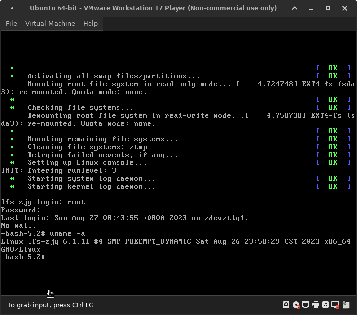

layout: post 
title: LFS on a VM
author: junyu33
categories: 

  - develop

tags:

  - linux

date: 2023-8-27 9:10:00

---



Just without `vmware-guest-additions` support, so there is no Internet.

<!-- more -->

# FAQs & tips

## I'm lazy, I don't want to create any other partition including `/home`, `/boot` or create `swap`.

Yes, you can expand your VM disk by 20 GB and allocate it to your LFS root directory. Using the `/boot` directory from your host distro is acceptable (even it's not in a seperate partition).

## sed: can't read gcc/config/i386/t-linux64: No such file or directory

https://www.linuxquestions.org/questions/linux-from-scratch-13/sed-can%27t-read-gcc-config-i386-t-linux64-no-such-file-or-directory-4175694927/

You didn't extract the tarball and enter the gcc directory, the LFS guide omitted these first two steps every page.

## VMware Workstation has paused this virtual machine because the disk on which the virtual machine is stored is almost full

Read the warning carefully, it says:

> VMware Workstation has paused this virtual machine because **the disk on which the virtual machine is stored** is almost full.

So it's the time to clean your **host** disk space, instead of insufficient space of your VM, especially you've taken too many snapshots.

## The system has no more ptys.  Ask your system administrator to create more.

Make sure if you've done [chapter 7.3](https://www.linuxfromscratch.org/lfs/view/stable/chapter07/kernfs.html) and [chapter 7.4](https://www.linuxfromscratch.org/lfs/view/stable/chapter07/chroot.html) correctly. You can save the script below in your VM, reboot and run it **with root privilege**.

```prepare.sh
mkdir -pv $LFS/{dev,proc,sys,run}
mount -v --bind /dev $LFS/dev
mount -v --bind /dev/pts $LFS/dev/pts
mount -vt proc proc $LFS/proc
mount -vt sysfs sysfs $LFS/sys
mount -vt tmpfs tmpfs $LFS/run
if [ -h $LFS/dev/shm ]; then
  mkdir -pv $LFS/$(readlink $LFS/dev/shm)
else
  mount -t tmpfs -o nosuid,nodev tmpfs $LFS/dev/shm
fi
```

```chroot.sh
chroot "$LFS" /usr/bin/env -i   \
    HOME=/root                  \
    TERM="$TERM"                \
    PS1='(lfs chroot) \u:\w\$ ' \
    PATH=/usr/bin:/usr/sbin     \
    /bin/bash --login
```

## The terminal looks frozen when running `make check` in gcc of chroot environ

That's normal. The guide says it takes around 43 SBU to finish the whole process. For me it cost about 10 hours without pipelining, some of checks like `asan.exp` in g++ tests, `comformance.exp` in libstdc++ tests cost 2 to 3 hours (yes, for one check file).

You can type `su tester -c "PATH=$PATH make -k check -j4"` to speed up a bit.

## Make failure in gcc of chroot environ

Try `make` again (without -B).

## Too many make check failures (thousands of) in gcc of chroot environ

It's maybe caused by the source, download again in [All Packages](https://www.linuxfromscratch.org/lfs/view/stable/chapter03/packages.html) and redo the process if you want to wait another couple of hours. 

If you didn't see any error in `make`, ignore the `make check` process is also an option.

## Can I use `grub-mkconfig` in my host distro to generate boot config

Yes, it works. The only flaw is that the grub boot menu entry will be `unknown Linux distribution on /dev/sdaX` instead of our favorite `Linux From Scratch`.

## Can't boot into LFS, saying something including `available partitions: 0b00 1048575 sr0 driver: sr`

The Linux kernel you built doesn't include the VMware disk driver. You can search options in `make menuconfig` which contains string `VMWARE` and add them manually in `.config` in kernel source root.

Here are the search results of my machine:

```
INFINIBAND_VMWARE_PVRDMA
drivers/infiniband/hw/vmw_pvrdma/Kconfig
VMWARE_BALLOON
drivers/misc/Kconfig
VMWARE_PVSCSI
drivers/scsi/Kconfig
VMWARE_VMCI
drivers/misc/vmw_vmci/Kconfig
VMWARE_VMCI_VSOCKETS
net/vmw_vsock/Kconfig
```

[This blog](https://www.cnblogs.com/alphainf/p/16720497.html
) may also help (additional options you need to check): 

```
Device Drivers --->
   Generic Driver Options --->
      [*] Maintain a devtmpfs filesystem to mount at /dev
   [*]Network device support --->
      [*]Ethernet Driver support --->
         [*] AMD PCnet32 PCI support
   [*]Fusion MPT device support --->
      <*> Fusion MPT ScsiHost drivers for SAS
      <*> Fusion MPT misc device (ioctl) driver  
      [*] Fusion MPT logging facility 
   SCSI device support --->
      [*] SCSI low-level drivers
File Systems --->
    [*] Ext3 Journaling file system support
```

# Summary

It tooks me about 9 days, the kernel config is not as hard as I thought before. The most difficult part is the patience.

BTW, the [technical guide](https://www.linuxfromscratch.org/lfs/view/stable/partintro/toolchaintechnotes.html) explained before looks still kind of abstract even though I've finished the whole process. Maybe that's the most educational part in the whole LFS journey.

In the future, maybe I'll go to the BLFS part, such as installing `vmware-guest-additions` and configuring the network, ssh, programming, DE, etc. Of course this is time-cosuming, ~~so maybe I'll give up here.~~
