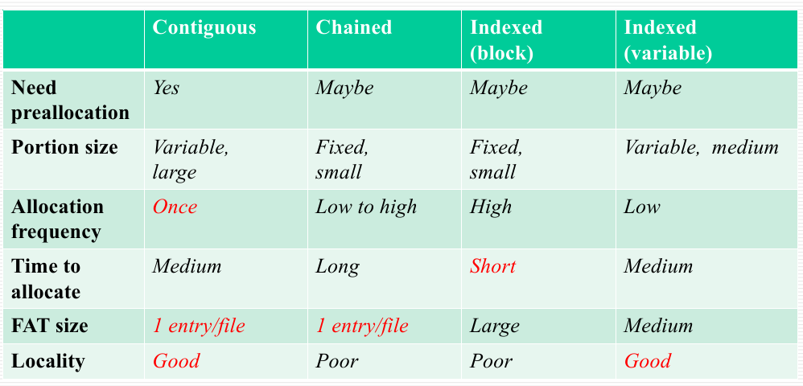
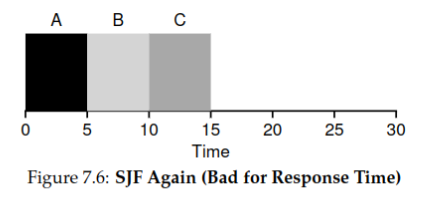
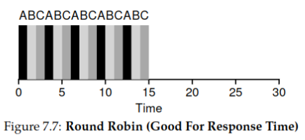
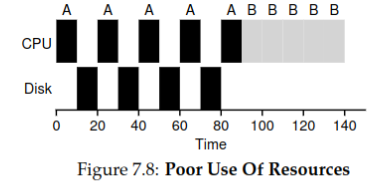
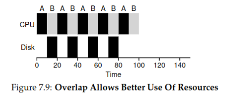
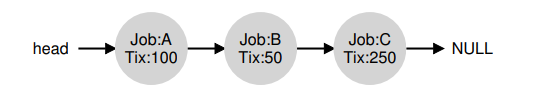
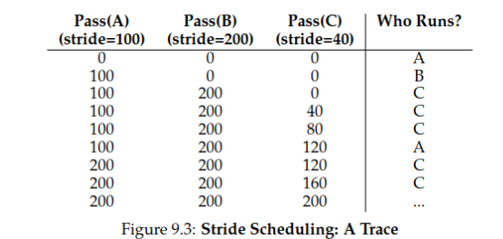

layout: post
title: （已完结）OS笔记
author: junyu33
mathjax: true
categories: 

  - 笔记

date: 2023-3-5 0:30:00

---

只提供理论部分，供期末复习用。

<!-- more -->

# Computer System Overview

> 偏计组，考试不考。

- Fetch-Execute.
- Interruption: program flow chart, ISR (Interrupt Handler) level. 

# Operating System Overview

OS: a program that controls the execution of application programs, and acts as an interface between applications and the computer hardware.

Interrupts: Early computer models did not have this capability. This featuregives the OS more flexibility in relinquishing control to, and regaining control from, user programs.

# Process Description and Control

## process

> 交替执行(interleave)、策略(stategy)、死锁(deadlock).

definition: 

- 一个正在执行(running, executing)的程序。
- 一个正在计算机上执行的程序实例
- 能分配给处理器并由处理器执行的实体
- 由一组执行的指令、一个当前状态和一组相关的系统资源表征的活动单元。

component:

- ID
- State

# Threads

Thread: lightweighted process.

Linux has no kernel threads while Windows does, the advantanges of no threads are lightweighted and easy to manage.

# Concurrency

## terminology

- atomic operation
- critical section
- deadlock
- livelock
- mutual exclusion
- race condition
- starvation

单道程序的特点：

- 封闭性
- 连续性
- 可再现性

多道程序的特点：

- 失去封闭性
- 间断性
- 不可再现性

## algorithm

### dekker


- 存在活锁。
- 规定了进程执行的顺序，不灵活。
- 程序实现复杂，难以验证。

### peterson


### hardware disabling

disadvantage:

- Processor is limited in its ability to interleave programs.
- disabling interrupts on one processor will not guarantee mutual exclusion in multi-processors environment。

### special instruction

优点：进程数目不限、简单易证、支持多临界区。

缺点：忙时等待、饥饿、死锁。

## Semaphores

### terminology

- 二元信号量
- 计数信号量
- 互斥量
- 强信号量
- 弱信号量

### operation

- semwait: 申请一个资源/等待一个条件
- semsignal: 释放一个资源/产生一个条件
- 如果前两者在一个进程出现，称为互斥；如果不在一个进程出现，称为同步
- 对于semwait，先处理同步，再处理互斥

### step

- determine the number of processes
- analysis of the nature of the problem
- define the semaphore and initialize the value of the semaphore
- calling semwait and semsignal in the process

```c
Semaphore(a,b,c)
{
  a = 1;
  b = 2;
  c = 3;
}

void p_1...p_n()
{
  // do sth
}

void main()
{
  Parbegin(p(1),p(2), p3(3), ... p(n));
}
```

### problems

生产者消费者问题：

```c
void producer() {
  while (1) {
    produce();
    semwait(empty);
    semwait(mutex);
    // put item in store
    semsignal(mutex);
    semsignal(product);
  }
}
void consumer() {
  while(1) {
    semwait(product);
    semwait(mutex);
    // take item from store
    semsignal(mutex);
    semsignal(empty);
    use();
  }
}
```

读者写者问题：

> rw，ww之间互斥
>
> rr之间互斥（条件竞争）

读者优先：

```c
Semphore mutex = 1; //文件互斥量
Semphore read_mutex = 1; //读进程计数互斥量

int counter = 0；

void reader() {
  int m;
  semwait(read_mutex);
  counter++;
  semsignal(read_mutex);
  if (counter == 1) semwait(mutex); // the first to read, compete with write
  read();
  semwait(read_mutex);
  counter--;
  semsignal(read_mutex);
  if (counter == 0) semsignal(mutex);
}

void writer() {
  semwait(mutex);
  write();
  semsignal(mutex);
}

```

读写平等：

```c
Semphore mutex = 1; //文件互斥量
Semphore read_mutex = 1; //读进程计数互斥量
Semphore queue = 1; //读进程与写进程排队互斥量

int readcount = 0;

void reader()
{
  int m = 0;
  semwait(queue);
  semwait(read_mutex);
  readcount++;
  semsignal(read_mutex);
  if (readcount == 1) semwait(mutex)
  semsignal(queue)
  read();
  semwait(read_mutex)
  readcount--;
  semsigal(read_mutex)
  if (readcount == 0) semsignal(mutex)
}
void writer()
{
  semwait(queue);
  semwait(mutex);
  write();
  semsignal(mutex);
  semsignal(queue);
}
```

## Monitors

### composition

- local data
- cond variables
- waiting area (queue) `cwait(cond)` `csignal(cond)`
- procedures
- init code

天生互斥。（同一时间最多只有一个活跃的procedure）

## message passing

`send(dest, msg)`

`receive(src, msg)`

天生具有同步关系

> 同步阻塞：你饿了，叫你妈妈做饭，然后你一直等。
> 
> 同步非阻塞：你饿了，叫你妈妈做饭，你去打游戏，时不时问妈妈饭做好没。
>
> 异步阻塞：你饿了，叫你妈妈做饭，你去打游戏，妈妈说饭做好了，你去吃饭。
>
> 异步非阻塞：你饿了，叫你妈妈做饭，你去打游戏，妈妈说饭做好了，把饭端给你。

优势：跨主机，可在网络编程使用。

# Deadlock & starvation

没有通用有效解决方案。

## why deadlock

- 资源有限
- 资源的请求和释放的顺序不恰当

### recourses

- 可重用资源（CPU、内存、数据库、信号量等）
- 可消费资源（中断、信号等）

### requirement

- 互斥
- 占有且等待
- 非抢占
- 循环等待（前三种是必要条件，加上这一种是充分条件）

## resolve

### allow deadlock

- 鸵鸟算法（无视）
- **死锁检测**

> 死锁检测具体算法：
>
> 例：
>
> 
>
> 1. 在`Allocation`中找零向量。
> 2. 设`w=v`
> 3. 在`Request`中找小于`w`的行向量，标识时清零`A`并更新`w`向量。
> 4. 重复第三步，直到不能再比较（死锁）或者消除完为止（无死锁）。

- 死锁消除（杀死CPU时间最少的、输出最少、等待时间最长或优先级最低的）

### don't allow

- 死锁预防（静态）
  - no mutual exclusion （成本问题）
  - no hold and wait, requesting all resources at one （可行，但无法判断进程需要哪些资源）
  - preemption （可行，需保证被抢占进程易保存恢复）
  - define a linear ordering of circular wait （可行，没有考虑进程的实际需求）
- 死锁避免（动态）
  - process initiation denial: for all j, $R_j \ge C_{(n+1)j}+\sum_{i=1}^nC_{ij}$ .
  - **banker's algorithm**（缺点：最大资源、孤立考虑、分配资源数目固定、子进程不能退出、时空复杂度高）

> banker's algorithm details:
>
> 例：
>
> 
>
> - a) $6+2+0+4+1+1+1=15, 3+0+1+1+0+1+0=6$ 将ABCD都验证一遍就行。
> - b) $need = C - A$
> - c) （安全检测算法）用$V$向量比较$C-A$的某一行，如果大于，$V=V+A$，直到不能再比较（不安全）或者消除完为止（安全）。
> - d) （银行家算法）把新的请求加到$A$矩阵里（本题中加到`P5`变成$[4,2,4,4]$），然后$V$向量变成$[3,1,2,1]$，再执行步骤c$


## dining philosopher's problem

initial solution (incorrect)

problem: possible deadlock (all five philosophers take one fork)

```c
sem p[i] = 1 from 0 to 4
void philosopher(int i) {
  think();
  wait(p[i]);
  wait(p[(i+1)%5]);
  eat();
  signal(p[(i+1)%5]); // routine
  signal(p[i]);
}
```

solution1:

```c
sem p[i] = 1 from 0 to 4;
sem root = 4; // only four hilosophers won't have deadlock
void philosopher(int i) {
  think();
  wait(room);
  wait(p[i]);
  wait(p[(i+1)%5]);
  eat();
  signal(p[(i+1)%5]); // routine
  signal(p[i]);
  signal(room);
}
```

solution2:
```c
sem p[i] = 1 from 0 to 4;
void philosopher(int i) {
  think();
  min = min(i, (i+1)%5); // confines philosopher 0 and 4 (won't eat together)
  max = max(i, (i+1)%5); // so at most 4 procs
  wait(p[min]);
  wait(p[max]);
  eat();
  signal(p[max]); 
  signal(p[min]);
}
```

> Q: What about 2 dynamic algorithms?
>
> (TODO)


设共有$m$个进程，每个进程最大请求为$x_i$，则最少$\sum_{i=1}^m (x_i-1) +1$个资源不会导致死锁。

# memory management

- 固定分区，动态分区：全部加载，不分区。
- 简单分页，简单分段：全部加载，分区。
- 虚存分页，虚存分段：部分加载，分区。

## 固定分区

- pros: 简单，很少的操作系统开销。
- cons: 限制了活动进程的数量，小作业不能有效利用分区空间（内部碎片）。

## 动态分区

- pros: 更充分利用内存，没有内部碎片
- cons: 需要压缩外部碎片，处理器利用率低

> 产生外部碎片（使用压缩算法解决）
> 
> 放置算法（最佳适配、首次适配、下次适配）

一个进程在生命周期内占的内存位置可能不相同（压缩和交换技术）

## 伙伴系统

类似于二叉树

优于固定和动态分区，存在内部碎片

## 简单分页

> def: 页框、页、段

每个进程都有一个页表，页表给出了该进程的每页（逻辑，page）所对应页框（物理，frame）的位置。

逻辑地址包括一个页号和该页中的偏移量。通过页表查询页号的页框号（前6位），与偏移相拼接（10位）得到物理地址。

存在少量内部碎片。

## 简单分段

与进程页表只维护页框号不同，进程段表维护了长度与基地址。

逻辑地址包括一个段号和偏移量。通过段表查询段号对应基地址（16位），将其与偏移相加（12位）得到物理地址。

存在外部碎片。

## 内存管理需求

- 重定位（物理地址、逻辑地址、相对地址、基址寄存器、界限寄存器）
- 保护（由硬件满足）
- 共享（允许多个进程访问内存的同一部分）
- 逻辑组织（程序使用模块编写的，模块可以单独编译，提供不同保护）
- 物理组织（程序员不知道客户的内存限制）

> homework:
>
> 
>
> 
>
> 更正：由于存在一种机制叫重定位（如果 X 曾经就在原来那个位置，之后被 free 掉，之后重新 malloc 会仍然在该位置，而不会靠左），所以 `7.6.a` 仍然是 `8MB`，第二题则应更正为`[3M, 8M]`.

# Virtual Memory

> - 固定分区，动态分区：全部加载，不分区。
> - 简单分页，简单分段：全部加载，分区。
> - 虚存分页，虚存分段：部分加载，分区。

## 虚存分页

简单来说就是把一部分内存放到硬盘里，等到需要的时候再加载到内存。

如果读取的页位于磁盘，则产生一个缺页中断阻塞进程，等从磁盘加载到内存后再产生一个中断恢复执行。（因此一次缺页会产生两次中断，如果中断时间大于执行指令的时间就会产生“抖动”）

对于32位4GB内存的分页，操作系统在内存保存一个4KB根页表（每项4字节，共有1024个页表项），该根页表中的每一项对应一个4KB的页表（每项4字节，共有1024个页表项，因此一共有1048576个页表项，共计4MB，可以保留在虚存），这4MB的虚存空间每一项对应一个长度12位的虚存（因此这1048576项就可以映射到4GB的虚存中）。

> for pwners: 这就是为什么地址ASLR的后三位不变，ASLR只会按页随机，不会随机页内部的偏移。

将虚拟地址转化为物理地址的方法如下：首先用前10位作为根页表的偏移，查到对应的根页表项，接着判断该根页表项对应的用户页表（4MB那个）是否在内存。如果在，就用接下来10位查找对应的对应的用户页表项，并用该项的页框号和偏移得到物理地址；如果不在，就产生缺页中断。


转换检测缓冲区可以可以缓存部分页号对应的页框号，从而减少中断，提高内存访问速度。

页尺寸与缺页率的关系是先增后减（局部性原理；整个进程都在页当中），页框数和缺页率的关系是单调递减（如果页和页框都一一对应就没有缺页了）

## 虚存分段

虚拟地址由页号和偏移量组成。转化为物理地址的方式是，页号作为偏移在段表内寻找对应的段号，将该段的基地址与虚拟地址的偏移相加得到物理地址。


## OS层面

### 读取策略

- 请求分页式：要才给。（启动时一堆缺页）
- 预约分页式：启动时就给一堆。（大部分要的可能不会访问）

### 放置策略（同前文放置算法）

决定一个进程块驻留的物理位置。

### 置换策略

> 页框锁定：不会被换出（如内核等）

- OPT：替换未来访问时间最远的那个页（理想方式，缺页中断最少，需预测未来访问）
- LRU：最近最少使用（开销大，每页都需要打时间戳）
- FIFO：停留时间最多的先出去（最简单）
- CLK：带`used`标记的`FIFO`（折中与`LRU`与`FIFO`）
- PB：减少I/O操作时间

CLK 实现代码：

```python
pageSize = 3
pagePointer = 0
pages = [[0, 0] for i in range(pageSize)] # [page, used]

accessSeq = [2, 3, 2, 1, 5, 2, 4, 5, 3, 2, 5, 2]

def printPages():
    print('pagePointer:', pagePointer)
    for i in range(pageSize):
        print(pages[i][0], pages[i][1])

for newPage in accessSeq:
    hasPage = False
    for i in range(pageSize):
        if pages[i][0] == newPage:
            pages[i][1] = 1
            hasPage = True
            break

    if hasPage == True:
        printPages()
        continue
    
    times = 0
    for i in range(pageSize):
        times += 1
        if pages[pagePointer][1] == 0:
            pages[pagePointer][0] = newPage
            pages[pagePointer][1] = 1
            pagePointer += 1
            pagePointer %= pageSize
            break

        else:
            pages[pagePointer][1] = 0
            pagePointer += 1
            pagePointer %= pageSize

    if times == pageSize:
        pages[pagePointer][0] = newPage
        pages[pagePointer][1] = 1
        pagePointer += 1
        pagePointer %= pageSize

    printPages()
```

### 驻留集管理

- 固定分配：给进程的页框数固定。
- 可变分配：缺页率高多分配，缺页率低少分配。
- 局部置换：置换缺页进程的驻留页。
- 全局置换：置换整个内存中未锁定的页。

### 清除策略

- 请求式清除：被置换才放回辅存。
- 预约式清除：提前放回辅存。

### 加载控制

影响到驻留在内存中的进程数量（系统并发度）与处理器利用率。

随着并发数量的增加，处理器利用率增加。达到一定程度后，平均驻留集大小不够，中断增加，处理器利用率降低。

# processor scheduling

## types

- Longterm scheduling (job scheduling，长程调度)
- Medium-term scheduling (swaping out processes，中程调度)
- Short-term scheduling (syscall, I/O，短程调度)
- I/O scheduling: deciding which process can use an available I/O device.

## algo design

### requirements

(non)preemptive: a process can be dispatched when the executing process is not finished.

performance:
- turnaround time & response time
- throughput & deadline
- utilization

fairness & starvation

### algos

- non-preemptive
  - FCFS: first come first serve 
    - not average turnaround time, throughput
    - no starvation but biased toward long processes
  - SPN: shortest process next
    - scheduling repetitive tasks (OS don't know how long a process will execute)
    - optimized turnaround time, throughput
    - long process may starve, biased toward short processes
  - HRRN: highest response ratio next
    - $R = \frac{w + \overline t}{\overline t}$
    - equally treat performance and fairness
    - avoid starvation of long processes at some extent
- preemptive
  - RR: round robin
    - depended on slice thinkness
    - short means quick response but long turnaround, vise versa.
  - SRT: shortest remaining time
    - scheduling repetitive tasks (OS don't know how long a process will execute)
    - more optimized turnaround time, throughput
    - long process may starve, biased toward short processes
  - MLFQ: multi-level feedback queue
    - one queue for each priority level, new process priority is 0 (maximum)
    - if release before inturrupted, stay same priority
    - if preempted/interrupted, move to the next priority  

# Real-time scheduling

## EDF

earlist deadline first

for non-scheduled

## RM

rate monotonic (higher rate/frequency first)

for scheduled

# I/O

**ALL OPERATIONS ARE NON-PREEMPTIVE!!**

## buffering

aim: reduce process stuck time to improve efficiency $\rightarrow$ smooth I/O performance.

### type 

- single buffer: suitable sequential data access, concurrent read/write not allowed.
- double buffer: enables concurrect read/write, still stuck if $v_{write} \ge v_{read}$ & a new I/O requrest happened.
- circular buffer: circular queue ($\gt 2$).

## disk scheduling

$T = T_{seek} + T_{rotation} + T_{transfer}$

### transfer (fixed)

$T_r = \frac{1}{2r}$

### rotation (fixed)

$b$ stands for number of bytes in a sector

$N_s$ stands for number of sectors in a track

$B = N_sb$ stands for number of bytes in a track

$T_d = \frac{b}{Br} = \frac{1}{N_sr}$

### seek

policies:

- priority (starvation for low-priority processes)
- FIFO (not optimized performance)
- LIFO (not optimized, but good for transaction processing)
- SSTF (shortest service time first, faster than FIFO)
- Scan (move the arm in one direction, choose the closest request in the same direction, reverse the direction until it reaches the end)

# file

## what

abstration to *manage* and *access* data.

### components

**field**: 

- basic data element
- contains a single value
- of fixed or variable length

**record**: 

- collection of related fields
- basic unit of application data
- of fixed or variable length

**file**:

- collection of related records
- managed as a single entity
- identified and refereced by a name

**block**:

- a continuous collection of data
- contains part of a file
- of fixed or variable length
- basic unit of file storage allocation
- basic unit of I/O buffering

### requirements

- persistent
- shareable
- structure

### file operation

basic: create, delete, open, close, read, write

## directory

abstraction to organize files

### single level

- file of all users placed under a single root directory
- users must handle name conflicts (a malicious user deliberate overwrite etc.)
  
### two-level

- first layer is users' folders, second layer users' files under their folders
- users must handle their own name conflicts

### hierachical

- used till now

## access control

typical levels: 
- none
- knowledge
- execution
- reading
- appending
- updating
- changing protection
- deletion

access rights: 

- owner or previleged user (root): full rights, grant rights to others
- specific user: individual user (associated with user ID)
- user group: set of users
- public

> in \*nix system
>
> - access modes: Read Write eXecute (RWX)
> - access rights: ower, group, public
> - access control grant: `rwxrwxrwx`

## file organization

criteria: 

- short access time
- ease of update
- economy of storage
- simple maintenance
- reliability (x)

### pile file

- files are organized as not-fixed records

easy to insert, difficult to search

### sequential file 

- files are organized as fixed, ordered records 
- has a key field 
- new records are placed in a log file

performance is still low

### index sequential

- add indexes to entries in a sequential file to search quickly
- two step search: index & record
- overflow file

### indexed

- sequential file builds indexes for one key field
- index file build indexes for multiple key field
- no contraints of records position, no overflow file

after an operation, all records need modification

### direct file or hashed file

- **indexed by a hash table, NOT sorted**
- update and search a single record is easy

## storage management

goal: manage the disk space to support a stream of file operations

two basic tasks:

### file allocation

FAT: file allocation table

- contiguous
  - good locality
  - external fragmentation (improve by compression)
- chained
  - each block has the pointer to the next block
  - poor locality (improve by consolidation)
  - high utilization and flexibility
- indexed (varible/block)
  - FAT has a separate one-level index for each file
  - the index contains an entry for each variable portion/block allocated to the file
  - FAT contains block number for index block



### free space management

- DAT: disk allocation table
  - $S = \frac{N}{8} = \frac{C}{8s}$
  - bit table size (S), number of blocks (N), diskcapacity (C), block size (s): 
- chained:
  - no DAT needed
  - fragmentation
  - long allocation/recycle time
- indexed
- free block list
  - store the list of available blocks in the disk
  - consume small portion of disk space
  - some part can be in memory to speed up

# 复习提纲

## 2

操作系统的概念，与应用程序的区别
操作系统的功能、目标
操作系统的构成模块，简述功能
操作系统的发展（批处理、分时、实时）
分时系统和批处理系统的概念，差异
中断和异常在分时系统和批处理系统的作用
如何理解操作系统是一个虚拟机

## 3

为了实现进程，CPU需要提供哪些硬件支持（中断和异常）
什么叫进程，和程序的关系和区别
PCB的概念及功能，描述其构成
从程序生命周期的角度描述程序怎么变成进程
跟进程控制相关的原语有哪些
进程的五状态图（图相关）
从三个角度回答进程的运行（研讨题）
进程的创建流程，并结合Linux的`fork`（一次调用两次返回）
进程切换的流程和时机（`wait`）

## 4

线程的概念，进程和线程的区别
线程的三种实现方法
ULT和KLT的优缺点

## 5

并发需要解决的四个问题（同步、互斥、饥饿、死锁）
为什么引入同步互斥机制（race condition）
有哪些解决方案（软件类、硬件类、系统类（管程和信号量））
硬件解决的缺点
信号量的概念、本质和实现
管程是什么，引入的原因是什么

## 6

死锁的概念和产生背景
死锁的条件（三个充分，四个充要）
死锁的解决方法（预防、避免、检测、不解决）
死锁和饥饿的关系

## 7

存储管理的7个方法
固定分区分页、动态分区分段的异同
段表和页表的构造和使用

## 8

实现虚拟存储要考虑的三个问题
实现虚拟存储的三个方法（虚拟分段，虚拟分页，段页式）
虚拟存储器 Page Fault 的处理流程
地址转化的计算
请简述缺页率和页尺寸和页框数的关系

## 9

长中短三个调度的描述（图相关）

## 10

IObuffer的产生背景和IObuffer的运行方式

## 12

文件系统的实现方式
逻辑层上有五种实现方式
物理层有三种实现方式

# DIY笔记（第9章）

> DIY教材：Operating Systems: Three Easy Pieces 的链接：https://pages.cs.wisc.edu/~remzi/OSTEP/

## chapter 7: introduction

### 反应时间——一种新的度量方式

>  `STCF` 算法主要从周转时间（turnaround time）方面进行优化，这种方法主要针对于早期批处理系统。但对于当今的分时系统（time-shared）来说，响应时间（response time）才是决定即时性能的重要因素。

响应时间的计算公式如下：

$$T_{response}=T_{firstrun}-T_{arrival}$$

> 假设有三个进程`A,B,C`同时在$t=0$时刻进入队列，且每个进程的执行时间均为 5，则使用`STCF/SJF`的调度情况如下图：
> 
> 
>
> 故平均响应时间为：
>
> $$\overline{T}_{response} = \frac{0+5+3}{3} = 5$$

### Round Robin

`Round-Robin` 算法是**抢占式**（preemptive）算法，可以显著提高各个进程的响应时间。RR不是运行作业完成，而是运行时间片（有时称为调度量子）。值得注意的是，时间片的长度必须是计时器中断周期的倍数，因此，如果计时器每10毫秒中断一次，则时间片可以是10、20或任何其他10ms的倍数。

> 还是以上一个为例，使用`Round-Robin`调度的情况如下（单位时间片为1）：
> 
> 
> 
> 故平均响应时间为：
> 
> $$\overline{T}_{response} = \frac{0+1+2}{3} = 1$$
> 
> 效果显著。

优点：
- 显著减少响应时间
- 对进程公平

缺点：
- 周转时间太慢

### 考虑 I/O 的情况

结论：如果使用非抢占的调度算法（如`STCF`），应当将频繁使用I/O的进程的时间块分割开来，以提高资源利用率。

> 例，`A`和`B`都是需要 50ms 的进程，但`A`每 10ms 就要调用一次 I/O，花费 10ms 的时间。
>
> 不分割时间块的情况，总用时 140ms：
>
> 
>
> 分割时间块的情况，总用时 100ms：
>
> 

通过将每个CPU突发作为一个作业来处理，调度程序可以确保“交互式”的进程频繁运行。当这些交互式作业执行I/O时，其他cpu密集型作业会运行，从而更好地利用处理器。

### 如果不能预知未来又该怎么办

`STCF/SJF` 算法在真实的操作系统作用有限，因为 OS 对每个进程的先验知识很少，改进方法可能有：

- 尝试从无需先验知识的 `Round-Robin` 算法中改进，比如尝试改变时间片的长度以平衡反应时间与周转时间。
- 尝试对预测进程耗费的时间。

### 总结

本章我们学习了：

- 对反应时间的优化：`Round-Robin`
- 如何应对调度中的 I/O 行为

## chapter 8：Multi-Level Feedback Queue

### MLFQ试图优化的问题

- 在不知道一个作业需要运行多久的前提下优化周转时间

- 在优化周转时间的前提下减少交互式用户的响应时间

### MLFQ的基本概念

MLFQ有许多不同的队列，每个队列分配了不同的优先级。在任何给定的时间，一个准备好的工作运行的作业都在一个队列中，MLFQ使用优先级来决定哪个工作 。

### MLFQ的基本规则

- **规则一：**如果A作业的优先级高于B作业的优先级，则运行A作业
- **规则二：**如果A作业的优先级与B作业的优先级相等，则A作业与B作业交替运行
- **规则三：**当一项作业进入系统时，该作业将会被置于最高的优先级（最上面的队列）
- **规则四：**一旦某项工作耗完了当前优先级的时间片，则它的优先级将会被下降
- **规则五：**经过特定长时间***S***后，所有的任务都将会被移到最高优先级的队列

### MLFQ的具体实现

#### 第一步

作业一进来，会被放置在最高优先级的队列进行运行

#### 第二步

每个队列都设置了一个特定长度的时间片，当该作业耗尽该时间片时，该作业将会被置于下一级队列中

- 时间片的长度从最高优先级队列到最低优先级队列逐渐变长
- 作业主动中断CPU处理后，再次连接仍然位于之前的优先级，并使用未用完的时间片

#### 第三步

经过特定的时间后，所有作业都将会被重新放置到最高优先级的队列之中

### MLFQ存在问题
- 存在饥饿的问题：如果系统中有“太多”的交互式作业，它们将结合起来消耗所有的CPU时间。
- 通过游戏调度程序来骗取更多的资源
- 程序可能会随着时间的推移改变其行为
### MLFQ的总结

- MLFQ不需要先验知识，它通过观察执行情况来确定优先级
- 在整体性能上接近于SJF/STCF
- 对与短时运作的交互式作业有着很好的优化
- 对长时运作的作业也是公平的

## chapter 9: proportional share

目的： 保证每个进程能获得一定的百分比的 CPU 时间。

### 彩票调度

每个进程拥有一些票据（ticket），系统**随机**选择所有票据中的一个，拥有该票据的进程执行命令。

根据大数定律，随着执行时间的增长，每个进程执行时间的百分比，最终会收敛于拥有票据占总票据的百分比。

#### 基本概念

- 汇率（currency）：每个用户可以设定自己的票据单位，并按照汇率分配给各个子进程。
- 转让（transfer）：进程可以将汇率交给其它进程来暂时放弃它的执行权。
- 通货膨胀（inflation）：对于一个**进程间互相信任**的环境，一个进程可以提高票据价格来获得更多 CPU 时间，而不需告知其它进程。

#### 实现
利用随机数生成器来选择中奖彩票、记录系统中所有进程的数据结构（一个列表）、所有彩票的总数

假定我们用列表记录进程。有 A、B、C 这 3 个进程，在做出调度决策之前，首先要从彩票总数400中选择一个随机数（中奖号码）。假设选择了300。然后遍历链表，用一个简单的计数器帮助我们找到中奖者。

从前向后遍历进程列表，将每张票的值加到 counter 上，直到值超过 winner。 这时，当前的列表元素所对应的进程就是中奖者。例如，中奖彩票是300。首先，计A的票后，counter 增加到 100。因为100小于300，继续遍历。然后 counter 会增加到150（B的彩票），仍然小于300，继续遍历。最后，当counter增加到400（大于300）时，退出遍历，当前指针指向C就是中奖者。



- 优点：轻量化，几乎不需要记录任何状态；速度快
- 缺点：在工作运行时间很短的情况下，无法保证产生正确的比例

### 步长调度

取消了随机性，以固定步长代替，是一个确定性的公平分配算法。

#### 步骤

1. 例如`A,B,C`的票据分别为`100,50,250`，这里设其步长为票据的反比（简单的做法是用一个大数分别除以它们），如果这个大数是 `10000`，那么最后`A,B,C`的步长分别为`100,200,40`.
2. 设`A,B,C`的总步数均为0.
3. 选取这三者中最小的，并加上它的步长。
4. 重复步骤3.

最后的调度结果如下图：



- 优点：进程执行时间的百分比**恰好**就是票据的占比（而不是慢慢收敛到这个值）
- 缺点：不便于新进程的加入。

#### Linux CFS （选讲）

- 对于每个进程，通过调整`sched_latency`和`min_granularity`和来兼顾效率与公平性（联想一下`Round-Robin`时间片太小和太大的危害）
- 通过`nice`这个 shell 命令调整进程的权重，具体而言，可以通过以下公式来求得每个进程的时间片大小：

$$time\_slice_k = \frac{weight_k}{\sum_{i=0}^{n-1}weight_i} \cdot sched\_latency$$

具体的权重常数参见以下定义：

```c
// the map between nice param to weight
static const int prio_to_weight[40] = {
/* -20 */ 88761, 71755, 56483, 46273, 36291,
/* -15 */ 29154, 23254, 18705, 14949, 11916,
/* -10 */  9548,  7620,  6100,  4904,  3906,
/* -5 */   3121,  2501,  1991,  1586,  1277,
/* 0 */    1024,   820,   655,   526,   423,
/* 5 */     335,   272,   215,   172,   137,
/* 10 */    110,    87,    70,    56,    45,
/* 15 */     36,    29,    23,    18,    15,
};
```

- 通过`vruntime`记录程序当前运行时间（不一定是真实的时间，可以理解为上文的步长），选择值最小进程的进行下一次运行。具体每运行`runtime`这么多时间，`vruntime`的更新公式如下：

$$vruntime_i = vruntime_i + \frac{weight_0}{weight_i} \cdot runtime_i$$

其中$weight_0$的值可以通过查询上述代码得到，为$1024$.

- 使用红黑树进行进程的管理。具体而言，使用红黑树这个数据结构可以使进程的插入、查询（找`vruntime`最小的那个）、修改和删除的时间复杂度统一为$O(\log n)$，而不是使用普通列表的$O(n)$.
- 对于进行 I/O 操作或者睡眠进程的处理，系统将该进程的`vruntime`设定为其余`vruntime`的最小值。

### 总结

本章我们学习了：

- 比例调度的两种方式： 彩票调度和步长调度。
- Linux CFS： 动态时间片、权重、红黑树与 I/O 处理。
