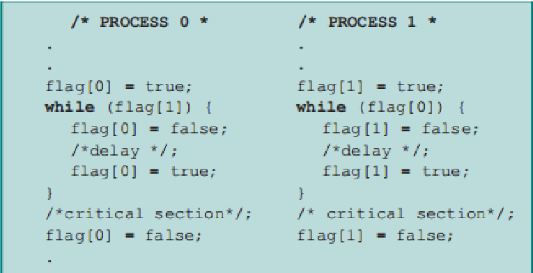
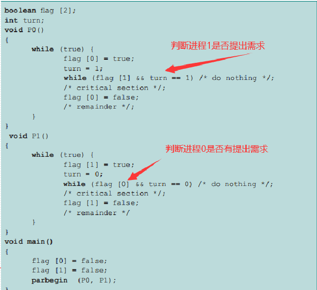
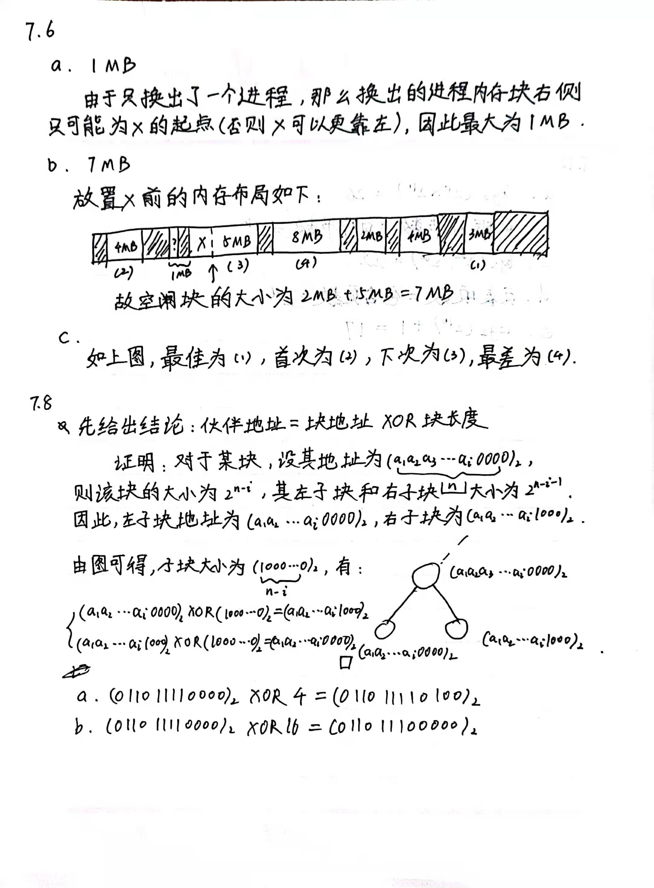
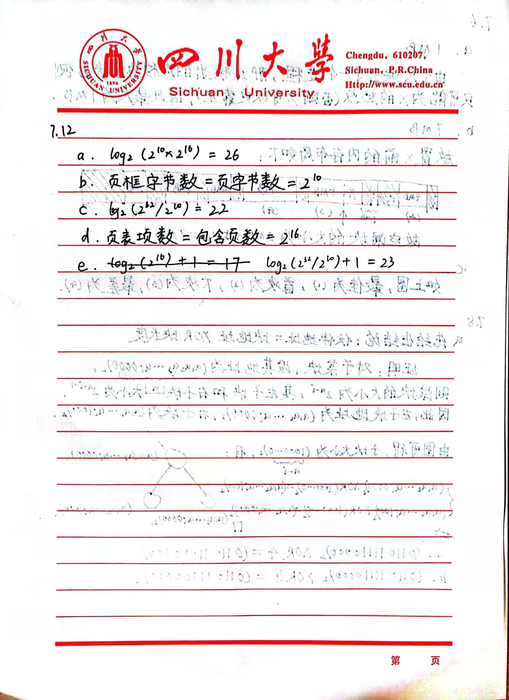
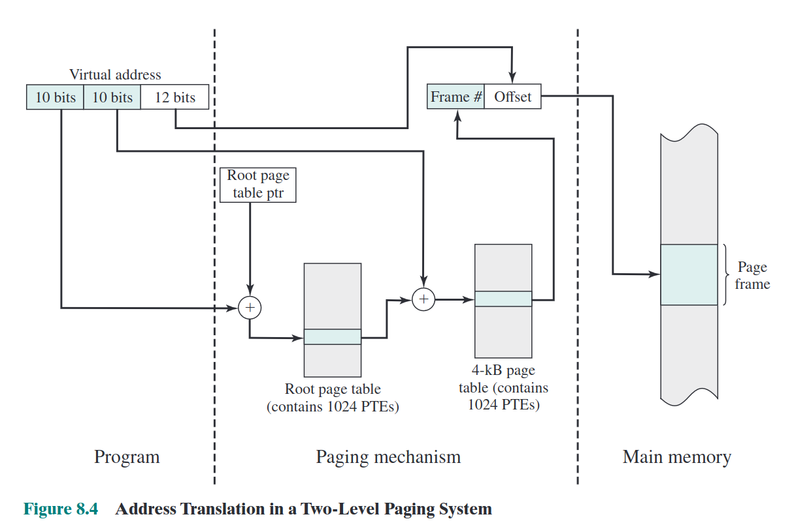
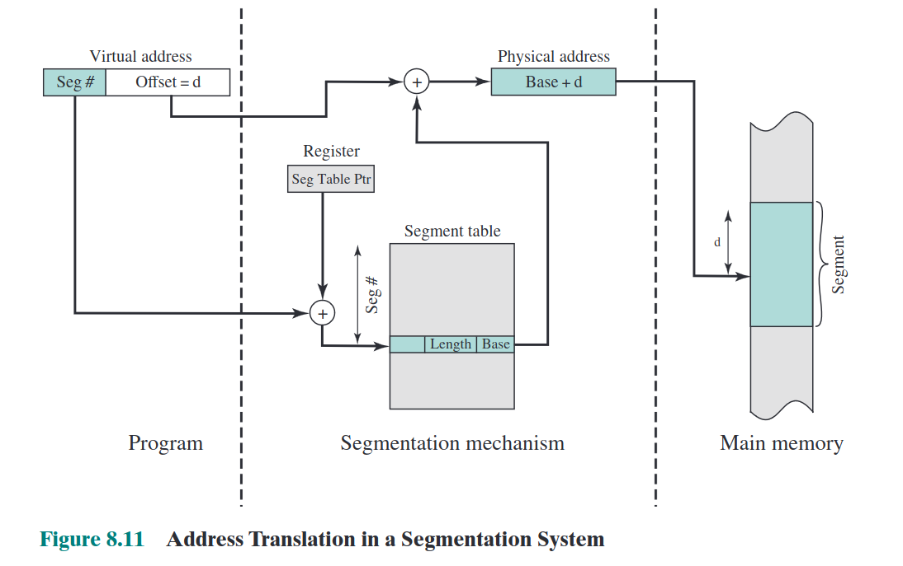

layout: post
title: （不定期更新）OS笔记
author: junyu33
mathjax: true
categories: 

  - 笔记

date: 2023-3-5 0:30:00

---

只提供理论部分，供期末复习用。

<!-- more -->

# Computer System Overview

> 偏计组，考试不考。

- Fetch-Execute.
- Interruption: program flow chart, ISR (Interrupt Handler) level. 

# Operating System Overview

OS: a program that controls the execution of application programs, and acts as an interface between applications and the computer hardware.

Interrupts: Early computer models did not have this capability. This featuregives the OS more flexibility in relinquishing control to, and regaining control from, user programs.

# Process Description and Control

## process

> 交替执行(interleave)、策略(stategy)、死锁(deadlock).

definition: 

- 一个正在执行(running, executing)的程序。
- 一个正在计算机上执行的程序实例
- 能分配给处理器并由处理器执行的实体
- 由一组执行的指令、一个当前状态和一组相关的系统资源表征的活动单元。

component:

- ID
- State

# Threads

Thread: lightweighted process.

Linux has no kernel threads while Windows does, the advantanges of no threads are lightweighted and easy to manage.

# Concurrency

## terminology

- atomic operation
- critical section
- deadlock
- livelock
- mutual exclusion
- race condition
- starvation

单道程序的特点：

- 封闭性
- 连续性
- 可再现性

多道程序的特点：

- 失去封闭性
- 间断性
- 不可再现性

## algorithm

### dekker



- 存在活锁。
- 规定了进程执行的顺序，不灵活。
- 程序实现复杂，难以验证。

### peterson



### hardware disabling

disadvantage:

- Processor is limited in its ability to interleave programs.
- disabling interrupts on one processor will not guarantee mutual exclusion in multi-processors environment。

### special instruction

优点：进程数目不限、简单易证、支持多临界区。

缺点：忙时等待、饥饿、死锁。

## Semaphores

### terminology

- 二元信号量
- 计数信号量
- 互斥量
- 强信号量
- 弱信号量

### operation

- semwait: 申请一个资源/等待一个条件
- semsignal: 释放一个资源/产生一个条件
- 如果前两者在一个进程出现，称为互斥；如果不在一个进程出现，称为同步
- 对于semwait，先处理同步，再处理互斥

### step

- determine the number of processes
- analysis of the nature of the problem
- define the semaphore and initialize the value of the semaphore
- calling semwait and semsignal in the process

```c
Semaphore(a,b,c)
{
  a = 1;
  b = 2;
  c = 3;
}

void p_1...p_n()
{
  // do sth
}

void main()
{
  Parbegin(p(1),p(2), p3(3), ... p(n));
}
```

### problems

生产者消费者问题：

```c
void producer() {
  while (1) {
    produce();
    semwait(empty);
    semwait(mutex);
    // put item in store
    semsignal(mutex);
    semsignal(product);
  }
}
void consumer() {
  while(1) {
    semwait(product);
    semwait(mutex);
    // take item from store
    semsignal(mutex);
    semsignal(empty);
    use();
  }
}
```

读者写者问题：

> rw，ww之间互斥
>
> rr之间互斥（条件竞争）

读者优先：

```c
Semphore mutex = 1; //文件互斥量
Semphore read_mutex = 1; //读进程计数互斥量

int counter = 0；

void reader() {
  int m;
  semwait(read_mutex);
  counter++;
  m = counter; // because counter maybe updated
  semsignal(read_mutex);
  if (m == 1) semwait(mutex); // the first to read, compete with write
  read();
  semwait(read_mutex);
  counter--;
  m = counter;
  semsignal(read_mutex);
  if (m == 0) semsignal(mutex);
}

void writer() {
  semwait(mutex);
  write();
  semsignal(mutex);
}

```

读写平等：

```c
Semphore mutex = 1; //文件互斥量
Semphore read_mutex = 1; //读进程计数互斥量
Semphore queue = 1; //读进程与写进程排队互斥量

int readcount = 0;

void reader()
{
  int m = 0;
  semwait(queue);
  semwait(read_mutex);
  readcount++;
  m = readcount;
  semsignal(read_mutex);
  if (m == 1) semwait(mutex)
  semsignal(queue)
  read();
  semwait(read_mutex)
  readcount--;
  m = readcount;
  semsigal(read_mutex)
  if (m == 0) semsignal(mutex)
}
void writer()
{
  semwait(queue);
  semwait(mutex);
  write();
  semsignal(mutex);
  semsignal(queue);
}
```

## Monitors

### composition

- local data
- cond variables
- waiting area (queue) `cwait(cond)` `csignal(cond)`
- procedures
- init code

天生互斥。（同一时间最多只有一个活跃的procedure）

## message passing

`send(dest, msg)`

`receive(src, msg)`

天生具有同步关系

> 同步阻塞：你饿了，叫你妈妈做饭，然后你一直等。
> 
> 同步非阻塞：你饿了，叫你妈妈做饭，你去打游戏，时不时问妈妈饭做好没。
>
> 异步阻塞：你饿了，叫你妈妈做饭，你去打游戏，妈妈说饭做好了，你去吃饭。
>
> 异步非阻塞：你饿了，叫你妈妈做饭，你去打游戏，妈妈说饭做好了，把饭端给你。

优势：跨主机，可在网络编程使用。

# Deadlock & starvation

没有通用有效解决方案。

## why deadlock

- 资源有限
- 资源的请求和释放的顺序不恰当

### recourses

- 可重用资源（CPU、内存、数据库、信号量等）
- 可消费资源（中断、信号等）

### requirement

- 互斥
- 占有且等待
- 非抢占
- 循环等待（前三种是必要条件，加上这一种是充分条件）

## resolve

### allow deadlock

- 鸵鸟算法（无视）
- **死锁检测**

> 死锁检测具体算法：
>
> 例：
>
> 
>
> 1. 在`Allocation`中找零向量。
> 2. 设`w=v`
> 3. 在`Request`中找小于`w`的行向量，标识时清零`A`并更新`w`向量。
> 4. 重复第三步，直到不能再比较（死锁）或者消除完为止（无死锁）。

- 死锁消除（杀死CPU时间最少的、输出最少、等待时间最长或优先级最低的）

### don't allow

- 死锁预防（静态）
  - no mutual exclusion （成本问题）
  - no hold and wait, requesting all resources at one （可行，但无法判断进程需要哪些资源）
  - preemption （可行，需保证被抢占进程易保存恢复）
  - define a linear ordering of circular wait （可行，没有考虑进程的实际需求）
- 死锁避免（动态）
  - process initiation denial: for all j, $R_j \ge C_{(n+1)j}+\sum_{i=1}^nC_{ij}$ .
  - **banker's algorithm**（缺点：最大资源、孤立考虑、分配资源数目固定、子进程不能退出、时空复杂度高）

> banker's algorithm details:
>
> 例：
>
> 
>
> - a) $6+2+0+4+1+1+1=15, 3+0+1+1+0+1+0=6$ 将ABCD都验证一遍就行。
> - b) $need = C - A$
> - c) （安全检测算法）用$V$向量比较$C-A$的某一行，如果大于，$V=V+A$，直到不能再比较（不安全）或者消除完为止（安全）。
> - d) （银行家算法）把新的请求加到$A$矩阵里（本题中加到`P5`变成$[4,2,4,4]$），然后$V$向量变成$[3,1,2,1]$，再执行步骤c$


## dining philosopher's problem

initial solution (incorrect)

problem: possible deadlock (all five philosophers take one fork)

```c
sem p[i] = 1 from 0 to 4
void philosopher(int i) {
  think();
  wait(p[i]);
  wait(p[(i+1)%5]);
  eat();
  signal(p[(i+1)%5]); // routine
  signal(p[i]);
}
```

solution1:

```c
sem p[i] = 1 from 0 to 4;
sem root = 4; // only four hilosophers won't have deadlock
void philosopher(int i) {
  think();
  wait(room);
  wait(p[i]);
  wait(p[(i+1)%5]);
  eat();
  signal(p[(i+1)%5]); // routine
  signal(p[i]);
  signal(room);
}
```

solution2:
```c
sem p[i] = 1 from 0 to 4;
void philosopher(int i) {
  think();
  min = min(i, (i+1)%5); // confines philosopher 0 and 4 (won't eat together)
  max = max(i, (i+1)%5); // so at most 4 procs
  wait(p[min]);
  wait(p[max]);
  eat();
  signal(p[max]); 
  signal(p[min]);
}
```

> Q: What about 2 dynamic algorithms?
>
> (TODO)


设共有$m$个进程，每个进程最大请求为$x_i$，则最少$\sum_{i=1}^m (x_i-1) +1$个资源不会导致死锁。

# memory management

- 固定分区，动态分区：全部加载，不分区。
- 简单分页，简单分段：全部加载，分区。
- 虚存分页，虚存分段：部分加载，分区。

## 固定分区

- pros: 简单，很少的操作系统开销。
- cons: 限制了活动进程的数量，小作业不能有效利用分区空间（内部碎片）。

## 动态分区

- pros: 更充分利用内存，没有内部碎片
- cons: 需要压缩外部碎片，处理器利用率低

> 产生外部碎片（使用压缩算法解决）
> 
> 放置算法（最佳适配、首次适配、下次适配）

一个进程在生命周期内占的内存位置可能不相同（压缩和交换技术）

## 伙伴系统

类似于二叉树

优于固定和动态分区，存在内部碎片

## 简单分页

> def: 页框、页、段

每个进程都有一个页表，页表给出了该进程的每页（逻辑，page）所对应页框（物理，frame）的位置。

逻辑地址包括一个页号和该页中的偏移量。通过页表查询页号的页框号（前6位），与偏移相拼接（10位）得到物理地址。

存在少量内部碎片。

## 简单分段

与进程页表只维护页框号不同，进程段表维护了长度与基地址。

逻辑地址包括一个段号和偏移量。通过段表查询段号对应基地址（16位），将其与偏移相加（12位）得到物理地址。

存在外部碎片。

## 内存管理需求

- 重定位（物理地址、逻辑地址、相对地址、基址寄存器、界限寄存器）
- 保护（由硬件满足）
- 共享（允许多个进程访问内存的同一部分）
- 逻辑组织（程序使用模块编写的，模块可以单独编译，提供不同保护）
- 物理组织（程序员不知道客户的内存限制）

> homework:
>
> 
>
> 
>
> 更正：由于存在一种机制叫重定位（如果 X 曾经就在原来那个位置，之后被 free 掉，之后重新 malloc 会仍然在该位置，而不会靠左），所以 `7.6.a` 仍然是 `8MB`，第二题则应更正为`[3M, 8M]`.

# Virtual Memory

> - 固定分区，动态分区：全部加载，不分区。
> - 简单分页，简单分段：全部加载，分区。
> - 虚存分页，虚存分段：部分加载，分区。

## 虚存分页

简单来说就是把一部分内存放到硬盘里，等到需要的时候再加载到内存。

如果读取的页位于磁盘，则产生一个缺页中断阻塞进程，等从磁盘加载到内存后再产生一个中断恢复执行。（因此一次缺页会产生两次中断，如果中断时间大于执行指令的时间就会产生“抖动”）

对于32位4GB内存的分页，操作系统在内存保存一个4KB根页表（每项4字节，共有1024个页表项），该根页表中的每一项对应一个4KB的页表（每项4字节，共有1024个页表项，因此一共有1048576个页表项，共计4MB，可以保留在虚存），这4MB的虚存空间每一项对应一个长度12位的虚存（因此这1048576项就可以映射到4GB的虚存中）。

> for pwners: 这就是为什么地址ASLR的后三位不变，ASLR只会按页随机，不会随机页内部的偏移。

将虚拟地址转化为物理地址的方法如下：首先用前10位作为根页表的偏移，查到对应的根页表项，接着判断该根页表项对应的用户页表（4MB那个）是否在内存。如果在，就用接下来10位查找对应的对应的用户页表项，并用该项的页框号和偏移得到物理地址；如果不在，就产生缺页中断。



转换检测缓冲区可以可以缓存部分页号对应的页框号，从而减少中断，提高内存访问速度。

页尺寸与缺页率的关系是先增后减（局部性原理；整个进程都在页当中），页框数和缺页率的关系是单调递减（如果页和页框都一一对应就没有缺页了）

## 虚存分段

虚拟地址由页号和偏移量组成。转化为物理地址的方式是，页号作为偏移在段表内寻找对应的段号，将该段的基地址与虚拟地址的偏移相加得到物理地址。



## OS层面

### 读取策略

- 请求分页式：要才给。（启动时一堆缺页）
- 预约分页式：启动时就给一堆。（大部分要的可能不会访问）

### 放置策略（同前文放置算法）

决定一个进程块驻留的物理位置。

### 置换策略

> 页框锁定：不会被换出（如内核等）

- OPT：替换未来访问时间最远的那个页（理想方式，缺页中断最少，需预测未来访问）
- LRU：最近最少使用（开销大，每页都需要打时间戳）
- FIFO：停留时间最多的先出去（最简单）
- CLK：带`used`标记的`FIFO`（折中与`LRU`与`FIFO`）
- PB：减少I/O操作时间

### 驻留集管理

- 固定分配：给进程的页框数固定。
- 可变分配：缺页率高多分配，缺页率低少分配。
- 局部置换：置换缺页进程的驻留页。
- 全局置换：置换整个内存中未锁定的页。

### 清除策略

- 请求式清除：被置换才放回辅存。
- 预约式清除：提前放回辅存。

### 加载控制

影响到驻留在内存中的进程数量（系统并发度）与处理器利用率。

随着并发数量的增加，处理器利用率增加。达到一定程度后，平均驻留集大小不够，中断增加，处理器利用率降低。
