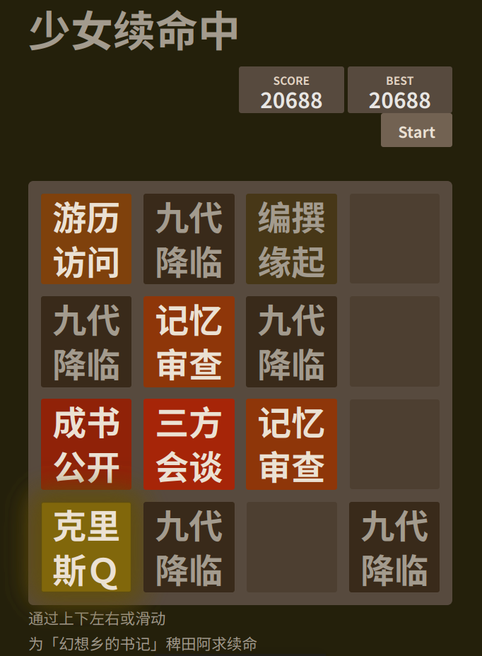
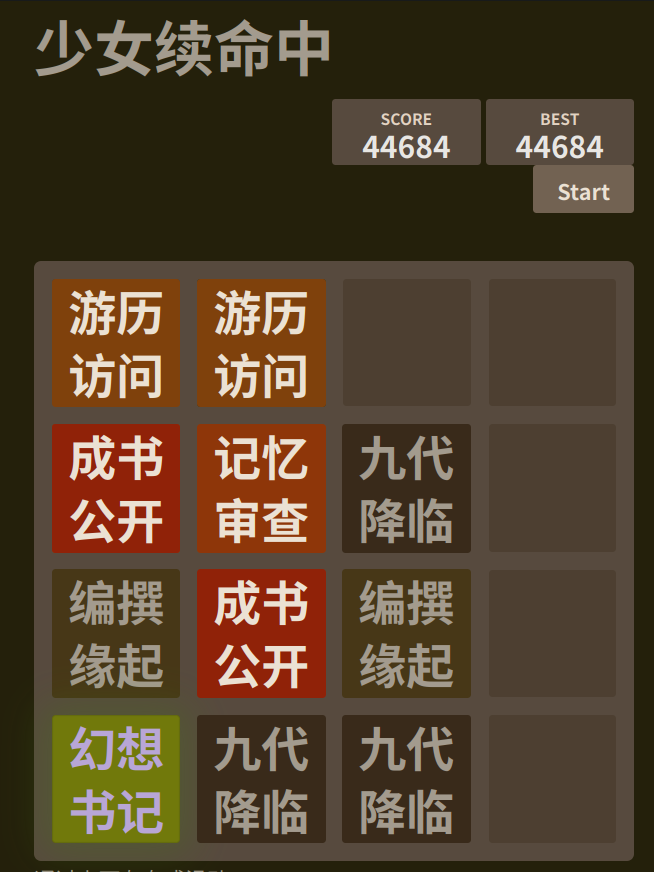

layout: post

title: 稗田阿求30岁诞辰专题 - 博客内嵌音频测试 

author: junyu33

tags: 

- touhou
- javascript
- linux
- games

categories: 

- test

date: 2024-8-7 00:00:00

---

天若有情天亦老 我为~~牢~~阿求续一秒

> SagumeKishin https://thbwiki.cc/稗田阿求

<!-- more -->

<link rel="stylesheet" href="https://cdn.jsdelivr.net/npm/aplayer@1.10/dist/APlayer.min.css">

<script src="https://cdn.jsdelivr.net/npm/aplayer@1.10/dist/APlayer.min.js"></script>
<script src="https://cdn.jsdelivr.net/npm/meting@1.2/dist/Meting.min.js"></script>



## 网上的各种整活：

首先这是二设：https://thbwiki.cc/稗田阿求/二次设定#稗田阿求30岁诞辰

2048 版本：https://akyuu.touhou.moe/

牢大和续一秒版本：https://akyuu.rip/

Bilibili: https://www.bilibili.com/video/av112915076088666/

## 然后我玩了一下 2048

我首先玩到了2048：



然后发现没有 "You win" 的提示，于是继续玩，玩到了4096：



然后依然没有提示，我觉得无聊了，于是就查看了一下源代码，发现了这个：

> view-source:https://akyuu.touhou.moe/akyuu.js

```javascript
HTMLActuator.prototype.tileHTML = [
	"九代降临", // 1
	"编撰缘起", // 2
	"游历访问", // 4
	"记忆审查", // 8
	"成书公开", // 16
	"三方会谈", // 32
	"瓜田李下", // 64
	"拳击高手", // 128
	"力能扛鼎", // 256
	"祭石长姬", // 512
	"克里斯Ｑ", // 1024
	"幻想书记", // 2048
	"怪谈祭典", // 4096
	"狸猫著书", // 8192
	"今昔幻想", // 16384
	"阿礼转生", // 32768
	"稗田阿十", // 65536
	"地狱深渊", // 131072
];
```

好家伙，这个 2048 居然是从 1 开始的，理论上你是玩不到“地域深渊”的。

> BTW，网上流行的 2048 实现都有一个通病，就是如果你复制这个标签页，然后在新标签页中继续玩，如果你 game over 了，你可以在原来的标签页中继续玩，这样就可以极大节省冲击高分的成本。这个版本也是如此。
>
> 当然，我是一次性玩到了 4096 的。

## 修改发表时间和修改时间

为了表达对阿求和长者的敬意，我决定同时修改这篇博客的发表时间和修改时间。

众所周知，博客的发表时间是可以修改的，只要修改 markdown 文件的 date 行即可。

但是修改修改时间会麻烦一些，但也不是很难。

首先，在 hexo 根目录中找到`db.json`文件，但是这个文件有 20M 太大了，所以我们可以直接使用`sed`命令：

```bash
sed -i 's/2024-08-20T[0-9]\{2\}:[0-9]\{2\}:[0-9]\{2\}\.[0-9]\{3\}Z/2024-08-16T16:00:00.000Z/g' db.json 
```

最后，修改这个文件的修改时间：

```bash
touch -t 202408170000 akyuup1s.md
```

然后就可以部署了：

```bash
hexo g -d
```


