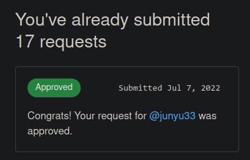

layout: post

title: 博客一周年祭

author: junyu33

categories: 

- test

date: 2022-7-6 00:00:00

---

其实是github学生包申请的经历。

<!-- more -->

# 起因

最近`colipot`内测结束开始收费了，广告甚至打到了github的首页上。从yyx方面得知，如果你通过了github学生认证，就可以白嫖每月10刀的`copilot`。除此之外，对于我来说有用的学生包产品还有`terminus`和`educative`，这些东西就足以让我心动了。听他说，他只申请了两次就成功了，看上去很简单，于是我决定试一试。

# 过程

我从知乎上找到了一篇github申请学生包的教程，关掉了代理，复制了github520上的hosts。打开了申请链接，绑定了自己的学生邮箱，胡乱写了几句使用学生包的原因。接着github让我提供学籍证明材料，我把学信网的证明翻译成英文上传上去提交。

过程行云流水，对不对？

大概半分钟过后，我就收到了认证失败的邮件，说什么`The item you uploaded is insufficient to demonstrate your current academic status. Modifications to your photo proof might have been detected by the system. Please see suggestions.`

于是我决定用手机拍一张学信网的证明，结果仍然失败，还是一模一样的理由。手机拍的照片怎么可能修改得了嘛，这机器审核也是绝了。但我又有什么办法呢，只能一遍一遍试啊，我尝试了人脸、学信网证明、学生证，拍照和上传文件的各种组合，一共16次，都是通通秒拒。我的耐心被用光了。

于是我想知道究竟是yyx欧还是我运气拉胯，就找了我的室友进行申请，结果他两次就成功了。

我按照室友的摆法摆好了**录取通知书、学生证和校园卡**，然后用手机拍照，再通过文件上传。这个时候github提示“与你同校的申请者提供了更可信的材料，请考虑更换自己的材料”，无法上传。后来得知，我无论上传什么图片，都会有这个提示——也就是我相当于再也上传不了了！

没办法，我又开了一个小号继续申请，拍了好几次，上传了好几次，仍旧是秒回`The item you uploaded is insufficient to demonstrate your current academic status. Modifications to your photo proof might have been detected by the system. Please see suggestions.`当时的我真的想重开——

# 转机

我怒了，直接开始怼客服。我辛辛苦苦写了10分钟的ticket竟然无情的被机器人close了，以下是我的申诉：

>Application not approved (student)
>
>Description
>
>I'm a student from China and I use credit from [https://www.chsi.com.cn/](https://support.github.com/ticket/personal/0/url) to prove my identity and get the student pack.
> Unfortunately I've tried 8 times, the bot always returns `you uploaded is insufficient to demonstrate your current academic status` and asks me to upload `School issued photo ID with current enrollment date`. However my proof clearly shows my photo, school name and my admission time. I've tried several hours and I'm really confused.
> This is a screen shot.
>（学信网截图）
> And this is a photo.
>（手机拍的截图）
> Could you please tell me the other reason besides repetitive `uploaded is insufficient` ?

之后又补了一句`pls`来reopen ticket，这下终于没被关了。

几天之后，我又加了一句：

> Now I've tried 16 times, providing materials including my face, school curriculum, student ID card and credit from . I believe that's enough to prove my identity.

就在7月7日，github终于有了回复：

> Hello,
>
> Thanks for contacting GitHub support.
>
> Please reapply using your school issued email address;
>
> https://education.github.com/discount_requests/student_application
>
> If you can, let me know once that is done.
>
> Kind regards,
>  Topaz

我按照它的链接点进去后，重新交了一遍带有**录取通知书、学生证和校园卡**的照片，大概过了两分钟，终于通过了。

真的心累......

# 使用

首先我尝试了一下`copilot`，对于OI的c++代码来说，除了平衡树、树剖、FFT、后缀数组等又臭又长的模板跟印象中相差很大，需要适应之外，基本上80%的代码都不用写了。java方面写后端香得不要不要的，基本上写一个注释，几行代码就出来了，都不带修改的。python写pwn的exp时有点妨碍思维（毕竟创造性的东西还是难以替代的）。

然后手机上的`terminus`的UI挺好看，还自带code snippets，以后打算装在电脑上，可以跟Xshell说再见了。

至于`educative`，我手贱点了6个月的免费试用。结果点开一看，大多数都是编程语言、前端开发与机器学习相关的课程，一时半会儿用不上，有点后悔。为了不暴殄天物，我把帐户共享给了高中同学，至少心里感觉没那么浪费......

还有`azure`,`name.com`之类的，就等以后有需求再说吧。
