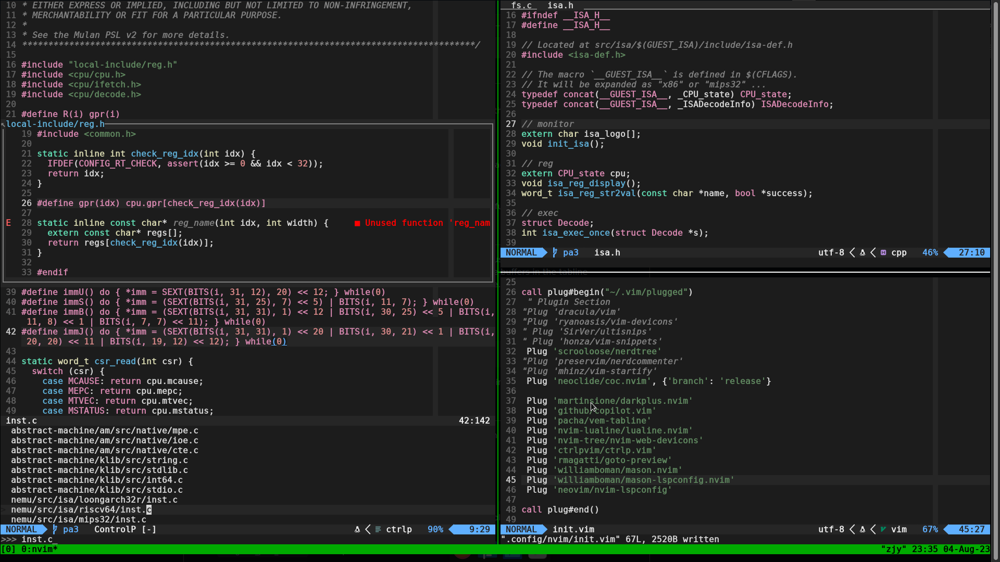

layout: post 
title: 记第二次 workflow 大换血——ubuntu2arch
author: junyu33
categories: 

  - develop

tags:

  - linux

date: 2023-8-5 15:15:00

---

前一次是去年4月份从 win11 + VS + vscode 迁移到 ubuntu 22.04 + vscode + neoVim，现在换到了 arch linux + neoVim

之后大创结题可能还得重配 windows 驱动开发的环境，可能会够我喝一壶了。

<!-- more -->

# 前言

由于在数月之前，由于dpkg的依赖问题（主要是qt的各种库）导致某些软件包无法更新，大概有20个左右。再加上`sudo apt upgrade`会默认更新linux内核，导致vmware的驱动需要重新编译，因此我便懒于更新。

几天之前我尝试与某同学使用`pgp`进行安全通信，生成了一个自签名PGP key，从而使得`sudo apt upgrade`时出现大量签名错误，即使删除这个key也无济于事。经过stfw后决定重装`gpg`，然而并未奏效，甚至导致无法安装任何新的包，也就是——只能降级为LFS玩家的日常安装方式——编译安装。

上文说过我是个懒人，编译安装这种get hands dirty的方法我是不想做的，于是我选择了包管理更为简单pacman，也就是arch系。

# 安装

## 分区

在机械硬盘上安完 ubuntu 大概几个月后，我发现 firefox 的速度不尽人意，并且先前给 ubuntu 分的 100G 空间捉襟见肘，于是我决定扬掉 win11，把 root 扔给固态，而把剩下的机械空间留给 home，从而形成了现在的分区状态：

```bash
> lsblk
NAME   MAJ:MIN RM   SIZE RO TYPE MOUNTPOINTS
sda      8:0    0 111.8G  0 disk 
├─sda1   8:1    0   300M  0 part /boot                       # ESP
├─sda2   8:2    0   128M  0 part                             # MSI
└─sda3   8:3    0 111.4G  0 part /                           # 原来的C盘
sdb      8:16   0 931.5G  0 disk 
├─sdb1   8:17   0   300G  0 part                             # 原来的D盘
├─sdb2   8:18   0   300G  0 part /run/media/junyu33/software # 原来的E盘
├─sdb3   8:19   0 200.2G  0 part                             # F盘割给ubuntu后剩下的部分
└─sdb6   8:22   0 131.3G  0 part /home
```

因此安arch时只需要格一下`/dev/sda1`和`/dev/sda3`即可，`home`则保留

## RTFM

https://wiki.archlinuxcn.org/wiki/%E5%AE%89%E8%A3%85%E6%8C%87%E5%8D%97

https://wiki.archlinuxcn.org/wiki/%E5%BB%BA%E8%AE%AE%E9%98%85%E8%AF%BB

记得重启之前一定要记得装好`iwctl`（非intel系请寻找alternative）和`dhcpcd`，不然每次返工重启U盘，电脑的蜂鸣器声音还是有点吓人

然后`systemctl enable iwd dhcpcd`应该就可以上网了，之后安装常用软件乃至GUI应该都很轻松了。

## nvidia

archlinux 是实用主义，因此即使 Linus 骂过 nvidia，安装驱动还是一句`sudo pacman -S nvidia`了事

只不过 nvidia 的耗电问题还是值得考虑的，于是我参照了[这个文档](https://wiki.archlinuxcn.org/wiki/NVIDIA_Optimus)，打算使用`optimus-manager`切换使用的显卡

> 由于之前一直是从终端键入`startxfce4`来进入GUI的，因此还得安个`lightdm`才能使得切换命令正常执行

# 开发环境配置

之前在 ubuntu 上用的还是 vscode 1.67，没想到现在安上已经ver 1.80了，有以下几点让我放弃了vscode：

- 这个UI变化还是不太能让我接受，尤其是窗口顶部那个search bar，巨丑无比（虽然可以关）
- 代码字体大小和shell相差太大，这让习惯左代码右shell布局（gdb调试养成的习惯）的我感觉很不协调，neovim + tmux 不存在此问题
- 使用 Copilot ，登录巨硬账户时出现 key exchange error 弹窗，且无法忽略，neovim 的 Copilot 插件不需要重新登录也可直接使用
- vscode 的 C/Cpp 插件在用户目录下产生了将近 10G 的缓存文件，并且效果并不拔群

于是我先改造了`~/.config/nvim/init.vim`，其中有部分来自jyy的[nju-pa](https://nju-projectn.github.io/ics-pa-gitbook/ics2022/0.4.html)对vim的配置，一部分来源于MIT的[vim作业](https://missing-semester-cn.github.io/2020/editors/)，一部分来源于插件本身的安装配置：

```nvim
set nocompatible            " disable compatibility to old-time vi
set showmatch               " show matching 
set ignorecase              " case insensitive 
set mouse=v                 " middle-click paste with 
set hlsearch                " highlight search 
set incsearch               " incremental search
set tabstop=4               " number of columns occupied by a tab 
set softtabstop=4           " see multiple spaces as tabstops so <BS> does the right thing
set expandtab               " converts tabs to white space
set shiftwidth=2            " width for autoindents
set autoindent              " indent a new line the same amount as the line just typed
set number                  " add line numbers
set wildmode=longest,list   " get bash-like tab completions
set cc=80                  " set an 80 column border for good coding style
filetype plugin indent on   "allow auto-indenting depending on file type
syntax on                   " syntax highlighting
set mouse=a                 " enable mouse click
set clipboard=unnamedplus   " using system clipboard
filetype plugin on
set cursorline              " highlight current cursorline
set ttyfast                 " Speed up scrolling in Vim
" set spell                 " enable spell check (may need to download language package)
" set noswapfile            " disable creating swap file
" set backupdir=~/.cache/vim " Directory to store backup files.

call plug#begin("~/.vim/plugged")
 " Plugin Section
"Plug 'dracula/vim'
"Plug 'ryanoasis/vim-devicons'
"Plug 'SirVer/ultisnips'
"Plug 'honza/vim-snippets'
 Plug 'scrooloose/nerdtree'
"Plug 'preservim/nerdcommenter'
"Plug 'mhinz/vim-startify'
 Plug 'neoclide/coc.nvim', {'branch': 'release'}
 
 Plug 'martinsione/darkplus.nvim'
 Plug 'github/copilot.vim'
 Plug 'pacha/vem-tabline'
 Plug 'nvim-lualine/lualine.nvim'
 Plug 'nvim-tree/nvim-web-devicons'
 Plug 'ctrlpvim/ctrlp.vim'
 Plug 'rmagatti/goto-preview'
 Plug 'williamboman/mason.nvim'
 Plug 'williamboman/mason-lspconfig.nvim'
 Plug 'neovim/nvim-lspconfig'
 Plug 'iamcco/markdown-preview.nvim', { 'do': 'cd app && yarn install' }

call plug#end()

colorscheme darkplus
let g:coc_global_extensions = ['coc-pyright', 'coc-snippets']
let g:ctrlp_map = '<c-p>'

inoremap <expr> <Tab> pumvisible() ? "\<C-y>" : "\<Tab>"
inoremap <expr> <S-Tab> pumvisible() ? "\<C-n>" : "\<S-Tab>"


lua << END
require('lualine').setup()
require("mason").setup()
require('goto-preview').setup {
  default_mappings = true;
};
require("mason-lspconfig").setup()
require("lspconfig").clangd.setup {}
require("lspconfig").pyright.setup {}
END
```

其中，对于LSP（language server protocol）的配置，也就是最后几行，应该是 neovim 取代 vscode 的关键部分

## LSP + clangd + goto-preview

这里使用了[mason](https://github.com/williamboman/mason.nvim) 和 [mason-lspconfig](https://github.com/williamboman/mason-lspconfig.nvim) 来构建LSP。由于本人目前只会经常用到`C`和`python3`，因此只安装了`clangd`和`pyright`两个语言服务器

目前只打算使用查看定义和引用的功能，因此只安装了[goto-preview](https://github.com/rmagatti/goto-preview)插件，至于自动补全，由于有了Copilot的补全，反而显得不是那么重要了

## configure a larger C project

对于一个大点的C项目，比如说[nju-pa](https://nju-projectn.github.io/ics-pa-gitbook/ics2022)，里面的函数定义、头文件的依赖关系比较复杂，如果直接打开会报一大堆错。vscode的解决方式就是使用`includepath`，这样做的缺陷一是比较难以列举所有的包含路径（也就是还会有零星错误，强迫症患者的灾难），二是搜索出来的definition可能与原文件没有任何关系

`clangd`可以比较好的解决这个问题，他通过自下而上的寻找`compile_commands.json`来确定各个文件的依赖情况，从而可以覆盖到所有的`includepath`，与此同时寻找的definition准确性也会更高

那么如何根据`make`来生成`compile_commands.json`呢，可以使用[bear](https://github.com/rizsotto/Bear)来完成这个任务。注意bear程序本身的运行指令似乎存在问题，正确的运行指令为：

```bash
bear -- <your-build-command>
```

比如说对riscv32-nemu的编译，指令就是：

```bash
bear -- make ARCH=riscv32-nemu
```

运行之后就会在当前目录生成`compile_commands.json`，这个时候再用 neovim 打开源码就应该不会有“错误”的错误，也能实现定义和引用的查询了

> 对于`cmake`项目，可以参考这个链接：https://cmake.org/cmake/help/latest/variable/CMAKE_EXPORT_COMPILE_COMMANDS.html

成果截图：


