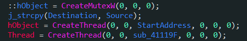
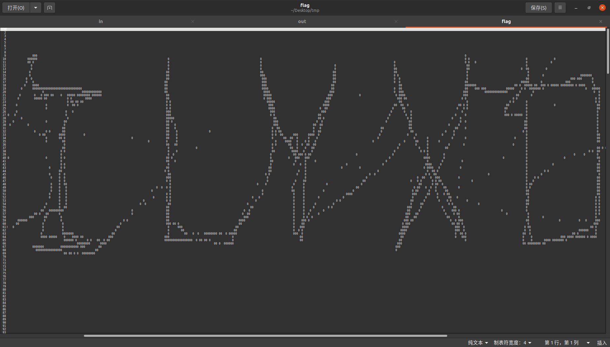

layout: post
title: ctf练习（杂）
author: junyu33
mathjax: true
tags: 

- reverse
- crypto
- misc

categories:

  - ctf

date: 2022-2-7 22:00:00

---

分为re、crypto、misc三部分，用作记录思路和用得上的gadget。

以下二级标题不带网站的默认为buuoj对应分区题目。

<!-- more -->

# re/mobile

## xctf-50: catch-me

getenv函数用来获取环境变量，python中手动设置环境变量的脚本如下：

```python
# if ASIS == CTF == 0x4ff2da0a, then
export ASIS="$(printf "\x0a\xda\xf2\x4f")"
export CTF="$(printf "\x0a\xda\xf2\x4f")"
```

~~我那几十行的浮点指令白看了~~

## buu-n1book: babyalgo

常见算法识别，容易看见密文和密钥，就猜是什么加密算法呗。

（30min后......）

cyberchef一个个都试完了，全都解不出来...

查看题解，发现是RC4，然后发现cyberchef的base64加密和RC4的解密结果都是错的，真无语。

RC4算法识别：


从网上嫖来的解密脚本：

```python
import base64
def rc4_main(key = "init_key", message = "init_message"):
    print("RC4解密主函数调用成功")
    print('\n')
    s_box = rc4_init_sbox(key)
    crypt = rc4_excrypt(message, s_box)
    return crypt
def rc4_init_sbox(key):
    s_box = list(range(256))
    print("原来的 s 盒：%s" % s_box)
    print('\n')
    j = 0
    for i in range(256):
        j = (j + s_box[i] + ord(key[i % len(key)])) % 256
        s_box[i], s_box[j] = s_box[j], s_box[i]
    print("混乱后的 s 盒：%s"% s_box)
    print('\n')
    return s_box
def rc4_excrypt(plain, box):
    print("调用解密程序成功。")
    print('\n')
    plain = base64.b64decode(plain.encode('utf-8'))
    plain = bytes.decode(plain)
    res = []
    i = j = 0
    for s in plain:
        i = (i + 1) % 256
        j = (j + box[i]) % 256
        box[i], box[j] = box[j], box[i]
        t = (box[i] + box[j]) % 256
        k = box[t]
        res.append(chr(ord(s) ^ k))
    print("res用于解密字符串，解密后是：%res" %res)
    print('\n')
    cipher = "".join(res)
    print("解密后的字符串是：%s" %cipher)
    print('\n')
    print("解密后的输出(没经过任何编码):")
    print('\n')
    return cipher
a=[0xc6,0x21,0xca,0xbf,0x51,0x43,0x37,0x31,0x75,0xe4,0x8e,0xc0,0x54,0x6f,0x8f,0xee,0xf8,0x5a,0xa2,0xc1,0xeb,0xa5,0x34,0x6d,0x71,0x55,0x8,0x7,0xb2,0xa8,0x2f,0xf4,0x51,0x8e,0xc,0xcc,0x33,0x53,0x31,0x0,0x40,0xd6,0xca,0xec,0xd4]
s=""
for i in a:
    s+=chr(i)
s=str(base64.b64encode(s.encode('utf-8')), 'utf-8')
rc4_main("Nu1Lctf233", s)

```

## susctf: DigitalCircuits

给出了一个python打包的exe。我们使用`PyInstaller Extractor`解包。

得到了一堆pyc、pyd、dll文件，我们找到`DigitalCircuits`文件和`struct`文件，将后者的前16个字节append到前者的文件头，使用`uncompyle6`或者`pycdc`反编译为源码。

~~通过数电知识~~，我们可以分析前九个函数对应的含义，得到以下代码:

```python
import time

def AND(a, b):
    if a == '1':
        if b == '1':
            return '1'
    return '0'


def OR(a, b):
    if a == '0':
        if b == '0':
            return '0'
    return '1'


def NOT(a):
    if a == '1':
        return '0'
    if a == '0':
        return '1'


def XOR(a, b):
    return OR(AND(a, NOT(b)), AND(NOT(a), b))


def ADD(x, y, z): #low -> high
    s = XOR(XOR(x, y), z)
    c = OR(AND(x, y), AND(z, OR(x, y)))
    return (s, c)


def str_ADD(a, b):
    ans = ''
    z = '0'
    a = a[::-1]
    b = b[::-1]
    for i in range(32):
        ans += ADD(a[i], b[i], z)[0]
        z = ADD(a[i], b[i], z)[1]

    return ans[::-1]


def SHL(a, n):
    return a[n:] + '0' * n


def SHR(a, n):
    return n * '0' + a[:-n]


def str_XOR(a, b):
    ans = ''
    for i in range(32):
        ans += XOR(a[i], b[i])

    return ans


def f10(v0, v1, k0, k1, k2, k3):
    s = '00000000000000000000000000000000'
    d = '10011110001101110111100110111001'
    for i in range(32):
        s = str_ADD(s, d)
        v0 = str_ADD(v0, str_XOR(str_XOR(str_ADD(SHL(v1, 4), k0), str_ADD(v1, s)), str_ADD(SHR(v1, 5), k1)))
        v1 = str_ADD(v1, str_XOR(str_XOR(str_ADD(SHL(v0, 4), k2), str_ADD(v0, s)), str_ADD(SHR(v0, 5), k3)))

    return v0 + v1

k0 = '0100010001000101'.zfill(32)
k1 = '0100000101000100'.zfill(32)
k2 = '0100001001000101'.zfill(32)
k3 = '0100010101000110'.zfill(32)
flag = input('please input flag:')
if flag[0:7] != 'SUSCTF{' or flag[(-1)] != '}':
    print('Error!!!The formate of flag is SUSCTF{XXX}')
    time.sleep(5)
    exit(0)
flagstr = flag[7:-1]
if len(flagstr) != 24:
    print('Error!!!The length of flag 24')
    time.sleep(5)
    exit(0)
else:
    res = ''
    for i in range(0, len(flagstr), 8):
        v0 = flagstr[i:i + 4]
        v0 = bin(ord(flagstr[i]))[2:].zfill(8) + bin(ord(flagstr[(i + 1)]))[2:].zfill(8) + bin(ord(flagstr[(i + 2)]))[2:].zfill(8) + bin(ord(flagstr[(i + 3)]))[2:].zfill(8)
        v1 = bin(ord(flagstr[(i + 4)]))[2:].zfill(8) + bin(ord(flagstr[(i + 5)]))[2:].zfill(8) + bin(ord(flagstr[(i + 6)]))[2:].zfill(8) + bin(ord(flagstr[(i + 7)]))[2:].zfill(8)
        res += f10(v0, v1, k0, k1, k2, k3)

    if res == '001111101000100101000111110010111100110010010100010001100011100100110001001101011000001110001000001110110000101101101000100100111101101001100010011100110110000100111011001011100110010000100111':
        print('True')
    else:
        print('False')
time.sleep(5)

```

将f10中的`10011110001101110111100110111001`转为16进制结果为`0x9e3779b9`，上网查询是TEA/XTEA/XXTEA的一种特殊常数，再进一步分析源码可知是TEA。

附上C解密脚本：

```c
#include <stdio.h>
#include <stdint.h>
#define DELTA 0x9e3779b9
#define MX (((z>>5^y<<2) + (y>>3^z<<4)) ^ ((sum^y) + (key[(p&3)^e] ^ z)))

void btea (uint32_t* v,int n, uint32_t* k) {
	uint32_t v0=v[0], v1=v[1], sum=0xC6EF3720, i;  /* set up */
	uint32_t delta=0x9e3779b9;                     /* a key schedule constant */
	uint32_t k0=k[0], k1=k[1], k2=k[2], k3=k[3];   /* cache key */
	for (i=0; i<32; i++) {                         /* basic cycle start */
		v1 -= ((v0<<4) + k2) ^ (v0 + sum) ^ ((v0>>5) + k3);
		v0 -= ((v1<<4) + k0) ^ (v1 + sum) ^ ((v1>>5) + k1);
		sum -= delta;
	}                                              /* end cycle */
	v[0]=v0; v[1]=v1;
}


int main()
{
	uint32_t v[2]= {0x3e8947cb,0xcc944639};
	uint32_t w[2]= {0x31358388,0x3b0b6893};
	uint32_t x[2]= {0xda627361,0x3b2e6427};

	uint32_t const k[4]= {17477,16708,16965,17734};
	int n = 2; //n的绝对值表示v的长度，取正表示加密，取负表示解密
	// v为要加密的数据是两个32位无符号整数
	// k为加密解密密钥，为4个32位无符号整数，即密钥长度为128位
	btea(v, -n, k);
	printf("%x %x ",v[0],v[1]);
	btea(w, -n, k);
	printf("%x %x ",w[0],w[1]);
	btea(x, -n, k);
	printf("%x %x",x[0],x[1]);
	return 0;
}
```

## starctf: Simple File System

沿用了新生赛时PVZ的做法，先尝试将flag改成一个全0串，然后导出bury的flag。

发现导出的加密值是固定不变的，比PVZ还简单一些。

于是将flag改成所有的可见字符串，再导出，可以形成一个明文到密文的映射。

输入：

```Plain%20Text
!"#$%&'()*+,-./0123456789:;<=>?@ABCDEFGHIJKLMNOPQRSTUVWXYZ[\]^_`abcdefghijklmnopqrstuvwxyz{|}!"#$%&'()*+,-./0123456789:;<=>?@ABCDEFGHIJKLMNOPQRSTUVWXYZ[\]^_`abcdefghijklmnopqrstuvwxyz{|}
```

输出：


因为*CTF对应的密文是`00 d2 fc d8`，在`image.flag`中找到这串16进制数后，再解密回来即可。

```c++
#include<bits/stdc++.h>
using namespace std;
int A[100], bs[100] = {0x14, 0x16, 0x10, 0x12, 0x1c, 0x1e, 0x18, 0x1a, 0x04, 0x06, 0x00, 0x02, 0x0c, 0x0e, 0x08, 0x0a};
int B[100];
map <int,int> mp;
map <int,int>inv;
int dat[50] = {0x0, 0xd2, 0xfc, 0xd8, 0xa2, 0xda, 0xba, 0x9e, 0x9c, 0x26, 0xf8, 0xf6, 0xb4, 0xce, 0x3c, 0xcc, 0x96, 0x88, 0x98, 0x34, 0x82, 0xde, 0x80, 0x36, 0x8a, 0xd8, 0xc0, 0xf0, 0x38, 0xae, 0x40};
int main() {
   for(int i = 32; i < 126; i++)
      A[i - 32] = i;
   int x;
   for(x = 1; x < 16; x++)
      B[x] = bs[x];
   for(x = 16; x < 32; x++)
      B[x] = bs[x-16]+0x20;
   for(x = 32; x < 48; x++)
      B[x] = bs[x-32]+0xc0;
   for(x = 48; x < 64; x++)
      B[x] = bs[x-48]+0xe0;
   for(x = 64; x < 80; x++)
      B[x] = bs[x-64]+0x80;
   for(x = 80; x < 96; x++)
      B[x] = bs[x-80]+0xa0;      
   for(int i = 1; i < 96; i++) {
      mp[A[i]] = B[i];
      inv[B[i]] = A[i];
   }
   //printf("%x %x %x %x",mp['*'],mp['C'],mp['T'],mp['F']);
   for(int i = 0; i < 31; i++)
      printf("%c", inv[dat[i]]);
   return 0;
}
```

## Youngter-drive

一道多线程的题目：



注意这个程序创建了两个线程，其中前面一个线程会对输入字节进行处理，并将位置指针`dword_418008`减1，后面那个只是把`dword_418008`减一，指针的值直到`-1`为止。

注意到`dword_418008`的初始值是29，因此程序只会对奇数位的值进行变换（其实奇数位试一次，偶数位再试一次也可以），另外也可以得知输入长30位。

由于加密后只对比前29位（0~28），因此最后一位需要手动爆破。

```c++
#include <bits/stdc++.h>
using namespace std;
char ipt[100] = "TOiZiZtOrYaToUwPnToBsOaOapsyS";
char QWERTY[100] = "QWERTYUIOPASDFGHJKLZXCVBNMqwertyuiopasdfghjklzxcvbnm";
int main(){
	for(int i = 0; i < 29; i++) {
		if(i % 2 == 0) {
			cout << ipt[i];
			continue;
		}
		for(int j = 'A'; j <= 'z'; j++) { // brute force directly
			char tmp = 0;
			if(j >= 'A' && j <= 'Z')
				tmp = QWERTY[j - 38];
			else if(j >= 'a' && j <= 'z')
				tmp = QWERTY[j - 96];
			if(tmp == ipt[i])
				cout << char(j);
		}
	}
	return 0;
}// only pre_29 bytes
```

## Universe_final_answer

z3模板题，这里只贴z3部分的代码便以后参阅。

```python
from z3 import *
v1, v2, v3, v4, v5, v6, v7, v8, v9, v11 = Ints('v1 v2 v3 v4 v5 v6 v7 v8 v9 v11')
solver = Solver()
solver.add( -85 * v9 + 58 * v8 + 97 * v6 + v7 + -45 * v5 + 84 * v4 + 95 * v2 - 20 * v1 + 12 * v3 == 12613 )
solver.add(30 * v11 + -70 * v9 + -122 * v6 + -81 * v7 + -66 * v5 + -115 * v4 + -41 * v3 + -86 * v1 - 15 * v2 - 30 * v8 == -54400)
solver.add(-103 * v11 + 120 * v8 + 108 * v7 + 48 * v4 + -89 * v3 + 78 * v1 - 41 * v2 + 31 * v5 - (v6 * 64) - 120 * v9 == -10283)
solver.add(71 * v6 + (v7 * 128) + 99 * v5 + -111 * v3 + 85 * v1 + 79 * v2 - 30 * v4 - 119 * v8 + 48 * v9 - 16 * v11 == 22855)
solver.add(5 * v11 + 23 * v9 + 122 * v8 + -19 * v6 + 99 * v7 + -117 * v5 + -69 * v3 + 22 * v1 - 98 * v2 + 10 * v4 == -2944)
solver.add(-54 * v11 + -23 * v8 + -82 * v3 + -85 * v2 + 124 * v1 - 11 * v4 - 8 * v5 - 60 * v7 + 95 * v6 + 100 * v9 == -2222)
solver.add(-83 * v11 + -111 * v7 + -57 * v2 + 41 * v1 + 73 * v3 - 18 * v4 + 26 * v5 + 16 * v6 + 77 * v8 - 63 * v9 == -13258)
solver.add(81 * v11 + -48 * v9 + 66 * v8 + -104 * v6 + -121 * v7 + 95 * v5 + 85 * v4 + 60 * v3 + -85 * v2 + 80 * v1 == -1559)
solver.add(101 * v11 + -85 * v9 + 7 * v6 + 117 * v7 + -83 * v5 + -101 * v4 + 90 * v3 + -28 * v1 + 18 * v2 - v8 == 6308 )
solver.add(99 * v11 + -28 * v9 + 5 * v8 + 93 * v6 + -18 * v7 + -127 * v5 + 6 * v4 + -9 * v3 + -93 * v1 + 58 * v2 == -1697)

if solver.check() == sat:
    result = solver.model()
print(result)

```

## equation

js解密jsfuck脚本：

正则匹配是个好东西，可惜我不会。

```html
<script>
function deEquation(str) {
  for (let i = 0; i <= 1; i++) {
  str = str.replace(/l\[(\D*?)](\+l|-l|==)/g, (m, a, b) => 'l[' + eval(a) + ']' + b);
  }
  str = str.replace(/==(\D*?)&&/g, (m, a) => '==' + eval(a) + '&&');
  return str;
}
s = 'your jsfuck string'
ss=deEquation(s);
document.write(ss);
</script>
```

解出来一堆等式，用正则表达式替换，将`&&`替换成`\n`，方便多行编辑。

然后使用z3解方程：

```python
from z3 import *
s = Solver()
l = [Int("x_%s" % i) for i in range(42)]
s.add(l[40]+l[35]+l[34]-l[0]-l[15]-l[37]+l[7]+l[6]-l[26]+l[20]+l[19]+l[8]-l[17]-l[14]-l[38]+l[1]-l[9]+l[22]+l[41]+l[3]-l[29]-l[36]-l[25]+l[5]+l[32]-l[16]+l[12]-l[24]+l[30]+l[39]+l[10]+l[2]+l[27]+l[28]+l[21]+l[33]-l[18]+l[4]==861)
s.add(l[31]+l[26]+l[11]-l[33]+l[27]-l[3]+l[12]+l[30]+l[1]+l[32]-l[16]+l[7]+l[10]-l[25]+l[38]-l[41]-l[14]-l[19]+l[29]+l[36]-l[9]-l[28]-l[6]-l[0]-l[22]-l[18]+l[20]-l[37]+l[4]-l[24]+l[34]-l[21]-l[39]-l[23]-l[8]-l[40]+l[15]-l[35]==-448)
s.add(l[26]+l[14]+l[15]+l[9]+l[13]+l[30]-l[11]+l[18]+l[23]+l[7]+l[3]+l[12]+l[25]-l[24]-l[39]-l[35]-l[20]+l[40]-l[8]+l[10]-l[5]-l[33]-l[31]+l[32]+l[19]+l[21]-l[6]+l[1]+l[16]+l[17]+l[29]+l[22]-l[4]-l[36]+l[41]+l[38]+l[2]+l[0]==1244)
s.add(l[5]+l[22]+l[15]+l[2]-l[28]-l[10]-l[3]-l[13]-l[18]+l[30]-l[9]+l[32]+l[19]+l[34]+l[23]-l[17]+l[16]-l[7]+l[24]-l[39]+l[8]-l[12]-l[40]-l[25]+l[37]-l[35]+l[11]-l[14]+l[20]-l[27]+l[4]-l[33]-l[21]+l[31]-l[6]+l[1]+l[38]-l[29]==-39)
s.add(l[41]-l[29]+l[23]-l[4]+l[20]-l[33]+l[35]+l[3]-l[19]-l[21]+l[11]+l[26]-l[24]-l[17]+l[37]+l[1]+l[16]-l[0]-l[13]+l[7]+l[10]+l[14]+l[22]+l[39]-l[40]+l[34]-l[38]+l[32]+l[25]-l[2]+l[15]+l[6]+l[28]-l[8]-l[5]-l[31]-l[30]-l[27]==485)
s.add(l[13]+l[19]+l[21]-l[2]-l[33]-l[0]+l[39]+l[31]-l[23]-l[41]+l[38]-l[29]+l[36]+l[24]-l[20]-l[9]-l[32]+l[37]-l[35]+l[40]+l[7]-l[26]+l[15]-l[10]-l[6]-l[16]-l[4]-l[5]-l[30]-l[14]-l[22]-l[25]-l[34]-l[17]-l[11]-l[27]+l[1]-l[28]==-1068)
s.add(l[32]+l[0]+l[9]+l[14]+l[11]+l[18]-l[13]+l[24]-l[2]-l[15]+l[19]-l[21]+l[1]+l[39]-l[8]-l[3]+l[33]+l[6]-l[5]-l[35]-l[28]+l[25]-l[41]+l[22]-l[17]+l[10]+l[40]+l[34]+l[27]-l[20]+l[23]+l[31]-l[16]+l[7]+l[12]-l[30]+l[29]-l[4]==939)
s.add(l[19]+l[11]+l[20]-l[16]+l[40]+l[25]+l[1]-l[31]+l[28]-l[23]+l[14]-l[9]-l[27]+l[35]+l[39]-l[37]-l[8]-l[22]+l[5]-l[6]+l[0]-l[32]+l[24]+l[33]+l[29]+l[38]+l[15]-l[2]+l[30]+l[7]+l[12]-l[3]-l[17]+l[34]+l[41]-l[4]-l[13]-l[26]==413)
s.add(l[22]+l[4]-l[9]+l[34]+l[35]+l[17]+l[3]-l[24]+l[38]-l[5]-l[41]-l[31]-l[0]-l[25]+l[33]+l[15]-l[1]-l[10]+l[16]-l[29]-l[12]+l[26]-l[39]-l[21]-l[18]-l[6]-l[40]-l[13]+l[8]+l[37]+l[19]+l[14]+l[32]+l[28]-l[11]+l[23]+l[36]+l[7]==117)
s.add(l[32]+l[16]+l[3]+l[11]+l[34]-l[31]+l[14]+l[25]+l[1]-l[30]-l[33]-l[40]-l[4]-l[29]+l[18]-l[27]+l[13]-l[19]-l[12]+l[23]-l[39]-l[41]-l[8]+l[22]-l[5]-l[38]-l[9]-l[37]+l[17]-l[36]+l[24]-l[21]+l[2]-l[26]+l[20]-l[7]+l[35]-l[0]==-313)
s.add(l[40]-l[1]+l[5]+l[7]+l[33]+l[29]+l[12]+l[38]-l[31]+l[2]+l[14]-l[35]-l[8]-l[24]-l[39]-l[9]-l[28]+l[23]-l[17]-l[22]-l[26]+l[32]-l[11]+l[4]-l[36]+l[10]+l[20]-l[18]-l[16]+l[6]-l[0]+l[3]-l[30]+l[37]-l[19]+l[21]+l[25]-l[15]==-42)
s.add(l[21]+l[26]-l[17]-l[25]+l[27]-l[22]-l[39]-l[23]-l[15]-l[20]-l[32]+l[12]+l[3]-l[6]+l[28]+l[31]+l[13]-l[16]-l[37]-l[30]-l[5]+l[41]+l[29]+l[36]+l[1]+l[11]+l[24]+l[18]-l[40]+l[19]-l[35]+l[2]-l[38]+l[14]-l[9]+l[4]+l[0]-l[33]==289)
s.add(l[29]+l[31]+l[32]-l[17]-l[7]+l[34]+l[2]+l[14]+l[23]-l[4]+l[3]+l[35]-l[33]-l[9]-l[20]-l[37]+l[24]-l[27]+l[36]+l[15]-l[18]-l[0]+l[12]+l[11]-l[38]+l[6]+l[22]+l[39]-l[25]-l[10]-l[19]-l[1]+l[13]-l[41]+l[30]-l[16]+l[28]-l[26]==-117)
s.add(l[5]+l[37]-l[39]+l[0]-l[27]+l[12]+l[41]-l[22]+l[8]-l[16]-l[38]+l[9]+l[15]-l[35]-l[29]+l[18]+l[6]-l[25]-l[28]+l[36]+l[34]+l[32]-l[14]-l[1]+l[20]+l[40]-l[19]-l[4]-l[7]+l[26]+l[30]-l[10]+l[13]-l[21]+l[2]-l[23]-l[3]-l[33]==-252)
s.add(l[29]+l[10]-l[41]-l[9]+l[12]-l[28]+l[11]+l[40]-l[27]-l[8]+l[32]-l[25]-l[23]+l[39]-l[1]-l[36]-l[15]+l[33]-l[20]+l[18]+l[22]-l[3]+l[6]-l[34]-l[21]+l[19]+l[26]+l[13]-l[4]+l[7]-l[37]+l[38]-l[2]-l[30]-l[0]-l[35]+l[5]+l[17]==-183)
s.add(l[6]-l[8]-l[20]+l[34]-l[33]-l[25]-l[4]+l[3]+l[17]-l[13]-l[15]-l[40]+l[1]-l[30]-l[14]-l[28]-l[35]+l[38]-l[22]+l[2]+l[24]-l[29]+l[5]+l[9]+l[37]+l[23]-l[18]+l[19]-l[21]+l[11]+l[36]+l[41]-l[7]-l[32]+l[10]+l[26]-l[0]+l[31]==188)
s.add(l[3]+l[6]-l[41]+l[10]+l[39]+l[37]+l[1]+l[8]+l[21]+l[24]+l[29]+l[12]+l[27]-l[38]+l[11]+l[23]+l[28]+l[33]-l[31]+l[14]-l[5]+l[32]-l[17]+l[40]-l[34]+l[20]-l[22]-l[16]+l[19]+l[2]-l[36]-l[7]+l[18]+l[15]+l[26]-l[0]-l[4]+l[35]==1036)
s.add(l[28]-l[33]+l[2]+l[37]-l[12]-l[9]-l[39]+l[16]-l[32]+l[8]-l[36]+l[31]+l[10]-l[4]+l[21]-l[25]+l[18]+l[24]-l[0]+l[29]-l[26]+l[35]-l[22]-l[41]-l[6]+l[15]+l[19]+l[40]+l[7]+l[34]+l[17]-l[3]-l[13]+l[5]+l[23]+l[11]-l[27]+l[1]==328)
s.add(l[22]-l[32]+l[17]-l[9]+l[20]-l[18]-l[34]+l[23]+l[36]-l[35]-l[38]+l[27]+l[4]-l[5]-l[41]+l[29]+l[33]+l[0]-l[37]+l[28]-l[40]-l[11]-l[12]+l[7]+l[1]+l[2]-l[26]-l[16]-l[8]+l[24]-l[25]+l[3]-l[6]-l[19]-l[39]-l[14]-l[31]+l[10]==-196)
s.add(l[11]+l[13]+l[14]-l[15]-l[29]-l[2]+l[7]+l[20]+l[30]-l[36]-l[33]-l[19]+l[31]+l[0]-l[39]-l[4]-l[6]+l[38]+l[35]-l[28]+l[34]-l[9]-l[23]-l[26]+l[37]-l[8]-l[27]+l[5]-l[41]+l[3]+l[17]+l[40]-l[10]+l[25]+l[12]-l[24]+l[18]+l[32]==7)
s.add(l[34]-l[37]-l[40]+l[4]-l[22]-l[31]-l[6]+l[38]+l[13]-l[28]+l[8]+l[30]-l[20]-l[7]-l[32]+l[26]+l[1]-l[18]+l[5]+l[35]-l[24]-l[41]+l[9]-l[0]-l[2]-l[15]-l[10]+l[12]-l[36]+l[33]-l[16]-l[14]-l[25]-l[29]-l[21]+l[27]+l[3]-l[17]==-945)
s.add(l[12]-l[30]-l[8]+l[20]-l[2]-l[36]-l[25]-l[0]-l[19]-l[28]-l[7]-l[11]-l[33]+l[4]-l[23]+l[10]-l[41]+l[39]-l[32]+l[27]+l[18]+l[15]+l[34]+l[13]-l[40]+l[29]-l[6]+l[37]-l[14]-l[16]+l[38]-l[26]+l[17]+l[31]-l[22]-l[35]+l[5]-l[1]==-480)
s.add(l[36]-l[11]-l[34]+l[8]+l[0]+l[15]+l[28]-l[39]-l[32]-l[2]-l[27]+l[22]+l[16]-l[30]-l[3]+l[31]-l[26]+l[20]+l[17]-l[29]-l[18]+l[19]-l[10]+l[6]-l[5]-l[38]-l[25]-l[24]+l[4]+l[23]+l[9]+l[14]+l[21]-l[37]+l[13]-l[41]-l[12]+l[35]==-213)
s.add(l[19]-l[36]-l[12]+l[33]-l[27]-l[37]-l[25]+l[38]+l[16]-l[18]+l[22]-l[39]+l[13]-l[7]-l[31]-l[26]+l[15]-l[10]-l[9]-l[2]-l[30]-l[11]+l[41]-l[4]+l[24]+l[34]+l[5]+l[17]+l[14]+l[6]+l[8]-l[21]-l[23]+l[32]-l[1]-l[29]-l[0]+l[3]==-386)
s.add(l[0]+l[7]-l[28]-l[38]+l[19]+l[31]-l[5]+l[24]-l[3]+l[33]-l[12]-l[29]+l[32]+l[1]-l[34]-l[9]-l[25]+l[26]-l[8]+l[4]-l[10]+l[40]-l[15]-l[11]-l[27]+l[36]+l[14]+l[41]-l[35]-l[13]-l[17]-l[21]-l[18]+l[39]-l[2]+l[20]-l[23]-l[22]==-349)
s.add(l[10]+l[22]+l[21]-l[0]+l[15]-l[6]+l[20]-l[29]-l[30]-l[33]+l[19]+l[23]-l[28]+l[41]-l[27]-l[12]-l[37]-l[32]+l[34]-l[36]+l[3]+l[1]-l[13]+l[18]+l[14]+l[9]+l[7]-l[39]+l[8]+l[2]-l[31]-l[5]-l[40]+l[38]-l[26]-l[4]+l[16]-l[25]==98)
s.add(l[28]+l[38]+l[20]+l[0]-l[5]-l[34]-l[41]+l[22]-l[26]+l[11]+l[29]+l[31]-l[3]-l[16]+l[23]+l[17]-l[18]+l[9]-l[4]-l[12]-l[19]-l[40]-l[27]+l[33]+l[8]-l[37]+l[2]+l[15]-l[24]-l[39]+l[10]+l[35]-l[1]+l[30]-l[36]-l[25]-l[14]-l[32]==-412)
s.add(l[1]-l[24]-l[29]+l[39]+l[41]+l[0]+l[9]-l[19]+l[6]-l[37]-l[22]+l[32]+l[21]+l[28]+l[36]+l[4]-l[17]+l[20]-l[13]-l[35]-l[5]+l[33]-l[27]-l[30]+l[40]+l[25]-l[18]+l[34]-l[3]-l[10]-l[16]-l[23]-l[38]+l[8]-l[14]-l[11]-l[7]+l[12]==-95)
s.add(l[2]-l[24]+l[31]+l[0]+l[9]-l[6]+l[7]-l[1]-l[22]+l[8]-l[23]+l[40]+l[20]-l[38]-l[11]-l[14]+l[18]-l[36]+l[15]-l[4]-l[41]-l[12]-l[34]+l[32]-l[35]+l[17]-l[21]-l[10]-l[29]+l[39]-l[16]+l[27]+l[26]-l[3]-l[5]+l[13]+l[25]-l[28]==-379)
s.add(l[19]-l[17]+l[31]+l[14]+l[6]-l[12]+l[16]-l[8]+l[27]-l[13]+l[41]+l[2]-l[7]+l[32]+l[1]+l[25]-l[9]+l[37]+l[34]-l[18]-l[40]-l[11]-l[10]+l[38]+l[21]+l[3]-l[0]+l[24]+l[15]+l[23]-l[20]+l[26]+l[22]-l[4]-l[28]-l[5]+l[39]+l[35]==861)
s.add(l[35]+l[36]-l[16]-l[26]-l[31]+l[0]+l[21]-l[13]+l[14]+l[39]+l[7]+l[4]+l[34]+l[38]+l[17]+l[22]+l[32]+l[5]+l[15]+l[8]-l[29]+l[40]+l[24]+l[6]+l[30]-l[2]+l[25]+l[23]+l[1]+l[12]+l[9]-l[10]-l[3]-l[19]+l[20]-l[37]-l[33]-l[18]==1169)
s.add(l[13]+l[0]-l[25]-l[32]-l[21]-l[34]-l[14]-l[9]-l[8]-l[15]-l[16]+l[38]-l[35]-l[30]-l[40]-l[12]+l[3]-l[19]+l[4]-l[41]+l[2]-l[36]+l[37]+l[17]-l[1]+l[26]-l[39]-l[10]-l[33]+l[5]-l[27]-l[23]-l[24]-l[7]+l[31]-l[28]-l[18]+l[6]==-1236)
s.add(l[20]+l[27]-l[29]-l[25]-l[3]+l[28]-l[32]-l[11]+l[10]+l[31]+l[16]+l[21]-l[7]+l[4]-l[24]-l[35]+l[26]+l[12]-l[37]+l[6]+l[23]+l[41]-l[39]-l[38]+l[40]-l[36]+l[8]-l[9]-l[5]-l[1]-l[13]-l[14]+l[19]+l[0]-l[34]-l[15]+l[17]+l[22]==-114)
s.add(l[12]-l[28]-l[13]-l[23]-l[33]+l[18]+l[10]+l[11]+l[2]-l[36]+l[41]-l[16]+l[39]+l[34]+l[32]+l[37]-l[38]+l[20]+l[6]+l[7]+l[31]+l[5]+l[22]-l[4]-l[15]-l[24]+l[17]-l[3]+l[1]-l[35]-l[9]+l[30]+l[25]-l[0]-l[8]-l[14]+l[26]+l[21]==659)
s.add(l[21]-l[3]+l[7]-l[27]+l[0]-l[32]-l[24]-l[37]+l[4]-l[22]+l[20]-l[5]-l[30]-l[31]-l[1]+l[15]+l[41]+l[12]+l[40]+l[38]-l[17]-l[39]+l[19]-l[13]+l[23]+l[18]-l[2]+l[6]-l[33]-l[9]+l[28]+l[8]-l[16]-l[10]-l[14]+l[34]+l[35]-l[11]==-430)
s.add(l[11]-l[23]-l[9]-l[19]+l[17]+l[38]-l[36]-l[22]-l[10]+l[27]-l[14]-l[4]+l[5]+l[31]+l[2]+l[0]-l[16]-l[8]-l[28]+l[3]+l[40]+l[25]-l[33]+l[13]-l[32]-l[35]+l[26]-l[20]-l[41]-l[30]-l[12]-l[7]+l[37]-l[39]+l[15]+l[18]-l[29]-l[21]==-513)
s.add(l[32]+l[19]+l[4]-l[13]-l[17]-l[30]+l[5]-l[33]-l[37]-l[15]-l[18]+l[7]+l[25]-l[14]+l[35]+l[40]+l[16]+l[1]+l[2]+l[26]-l[3]-l[39]-l[22]+l[23]-l[36]-l[27]-l[9]+l[6]-l[41]-l[0]-l[31]-l[20]+l[12]-l[8]+l[29]-l[11]-l[34]+l[21]==-502)
s.add(l[30]-l[31]-l[36]+l[3]+l[9]-l[40]-l[33]+l[25]+l[39]-l[26]+l[23]-l[0]-l[29]-l[32]-l[4]+l[37]+l[28]+l[21]+l[17]+l[2]+l[24]+l[6]+l[5]+l[8]+l[16]+l[27]+l[19]+l[12]+l[20]+l[41]-l[22]+l[15]-l[11]+l[34]-l[18]-l[38]+l[1]-l[14]==853)
s.add(l[38]-l[10]+l[16]+l[8]+l[21]-l[25]+l[36]-l[30]+l[31]-l[3]+l[5]-l[15]+l[23]-l[28]+l[7]+l[12]-l[29]+l[22]-l[0]-l[37]-l[14]-l[11]+l[32]+l[33]-l[9]+l[39]+l[41]-l[19]-l[1]+l[18]-l[4]-l[6]+l[13]+l[20]-l[2]-l[35]-l[26]+l[27]==-28)
s.add(l[11]+l[18]-l[26]+l[15]-l[14]-l[33]+l[7]-l[23]-l[25]+l[0]-l[6]-l[21]-l[16]+l[17]-l[19]-l[28]-l[38]-l[37]+l[9]+l[20]-l[8]-l[3]+l[22]-l[35]-l[10]-l[31]-l[2]+l[41]-l[1]-l[4]+l[24]-l[34]+l[39]+l[40]+l[32]-l[5]+l[36]-l[27]==-529)
s.add(l[38]+l[8]+l[36]+l[35]-l[23]-l[34]+l[13]-l[4]-l[27]-l[24]+l[26]+l[31]-l[30]-l[5]-l[40]+l[28]-l[11]-l[2]-l[39]+l[15]+l[10]-l[17]+l[3]+l[19]+l[22]+l[33]+l[0]+l[37]+l[16]-l[9]-l[32]+l[25]-l[21]-l[12]+l[6]-l[41]+l[20]-l[18]==-12)
s.add(l[6]-l[30]-l[20]-l[27]-l[14]-l[39]+l[41]-l[33]-l[0]+l[25]-l[32]-l[3]+l[26]-l[12]+l[8]-l[35]-l[24]+l[15]+l[9]-l[4]+l[13]+l[36]+l[34]+l[1]-l[28]-l[21]+l[18]+l[23]+l[29]-l[10]-l[38]+l[22]+l[37]+l[5]+l[19]+l[7]+l[16]-l[31]==81)

if s.check() == sat:
   result = s.model()
for i in range(42):
   print(chr(int("%s"%result[l[i]])), end='')
```

## [网鼎杯 2020 青龙组]jocker

脑洞题+smc自解密——idc初体验。

```c
#include <idc.idc>
static main() {
    auto i, x;
    for ( i = 0; i <= 0xBA; i++ ) {
        x = Byte(0x401500 + i);
        PatchByte(0x401500 + i, x ^ 0x41);
    }
}
```

按c可以从二进制数据生成代码，按p可以从代码块构造函数。

## n1book: 数字壳的传说

frida-hook

在root的安卓虚拟机或模拟器上的`/data/local/tmp`上拷贝frida-server并启动，在物理机上安一个`frida-dexdump`。

虚拟机启动app，主机执行脱壳命令：

```sh
frida-dexdump -FU
```

输出几个`classes.dex`，选择没有序号的那个打开，定位到`Secret`类，内容如下：

```java
package com.sec.n1book1;

public class Secret {
    static int check(String s) {
        if (AESUtils.encryptString2Base64(s, s.substring(0, 6), "123456").replaceAll("\r|\n", BuildConfig.FLAVOR).equals("u0uYYmh4yRpPIT/zSP7EL/MOCliVoVLt3gHcrXDymLc=")) {
            return 0;
        }
        return -1;
    }
}
```

它调用了`encryptString2Base64(String content, String password, String iv)`这个方法，从而得知这是一个CBC加密，密钥为flag前6位，iv为123456。

然而我并不知道填充怎么处理，参考网上的一些脚本才知道是用空格处理。

```python
from Crypto.Cipher import AES
import base64
password = b'n1book'.ljust(32, b" ") 
b64 = b'u0uYYmh4yRpPIT/zSP7EL/MOCliVoVLt3gHcrXDymLc=' 
en_text = base64.b64decode(b64)
iv = b'123456'.ljust(16,b" ")

aes = AES.new(password,AES.MODE_CBC,iv) 
den_text = aes.decrypt(en_text) 
print(den_text)
```

## corctf2022 Microsoft ❤️ Linux

前半部分直接ida加载32位elf格式，将指定范围的bytes `ror 13`即可。（其实就是`ror 5`）

后半部分ida用二进制模式打开，选择16位，可以发现是dos指令，加密方式是`xor 13`，长度为18，然而加密范围好像有点问题。

密文只可能存在于0x210~0x233之间，整个异或13之后发现后18位像flag，与前面拼接即可。

# crypto

## buu-re: rsa

~~真不知道这道题为什么要放在re里面。~~

已知公钥pub.key和密文flag.enc，而且公钥较小可暴力分解p、q。

1. `openssl rsa -pubin -text -modulus -in pub.pem`获取$e$和$n$.

2. 使用factordb分解$n$，得到$p$与$q$.

3. `python rsatool.py -o private.pem -e <your e> -p <your p> -q <your q>`输出密钥。

   > 适配python3的rsatool的下载地址：https://github.com/ius/rsatool

4. `openssl rsautl -decrypt -in flag.enc -inkey private.pem`获得原文。


## N1book_N1DES

一个稍微魔改了一下的des，循环次数由16位变为32位。

仍然是feistel结构，只需照加密函数写出解密函数即可。

这是加密函数：

```python
def encrypt(self, plaintext):
   if (len(plaintext) % 16 != 0 or isinstance(plaintext, bytes) == False):
      raise Exception("plaintext must be a multiple of 16 in length")
   res = ''
   for i in range(len(plaintext) / 16):
      block = plaintext[i * 16:(i + 1) * 16]
      L = block[:8]
      R = block[8:]
      for round_cnt in range(32):
            L, R = R, str_xor(round_add(R, self.Kn[round_cnt]),L)
            L, R = str_permutate(L,s_box) , str_permutate(R,s_box)
      L, R = R, L
      res += L + R
   return res
```

解密脚本如下：

```python
inv_s = [178, 218, ... 62, 208]

def decrypt(self,cipher):
    res = ''
    for i in range(len(cipher) / 16):
        block = cipher[i * 16:(i + 1) * 16]
        L = block[:8]
        R = block[8:]
        for round_cnt in range(32):
            L, R = str_permutate(L,inv_s) , str_permutate(R,inv_s)
            L, R =  R,str_xor(round_add(R, self.Kn[31 - round_cnt]),L)
        L, R = R, L
        res += L + R
    return res
```

## rsa1

> 已知p、q、dp、dq、c，求原文。

证明链接：https://blog.csdn.net/qq_32350719/article/details/102719279

```python
from gmpy2 import *
from Crypto.Util.number import *

I = invert(q,p)
mp = pow(c,dp,p)
mq = pow(c,dq,q)         
m = (((mp-mq)*I)%p)*q+mq     
print(long_to_bytes(m))         

```

## corctf2022 tadpole

题面：

```python
from Crypto.Util.number import bytes_to_long, isPrime
from secrets import randbelow

p = bytes_to_long(open("flag.txt", "rb").read())
assert isPrime(p)

a = randbelow(p)
b = randbelow(p)

def f(s):
    return (a * s + b) % p

print("a = ", a)
print("b = ", b)
print("f(31337) = ", f(31337))
print("f(f(31337)) = ", f(f(31337)))
```

下减上得：

$a*(f-s) \equiv ff - f \pmod p$

左右相减是p的倍数，分解质因数即可（其实就是质数）。

## corctf2022 luckyguess

```python
#!/usr/local/bin/python
from random import getrandbits

p = 2**521 - 1
a = getrandbits(521)
b = getrandbits(521)
print("a =", a)
print("b =", b)

try:
    x = int(input("enter your starting point: "))
    y = int(input("alright, what's your guess? "))
except:
    print("?")
    exit(-1)

r = getrandbits(20)
for _ in range(r):
    x = (x * a + b) % p

if x == y:
    print("wow, you are truly psychic! here, have a flag:", open("flag.txt").read())
else:
    print("sorry, you are not a true psychic... better luck next time")
```

使用不动点，构造 $x$使$x \equiv x*a+b \pmod p$

故$p-b \equiv x*(a-1) \pmod p$

$ x \equiv (a-1)^{-1} * (p-b) \pmod p$，直接`gmpy2.invert`即可。

## corctf2022 exchanged

```python
from Crypto.Util.number import *
from Crypto.Cipher import AES
from Crypto.Util.Padding import pad
from hashlib import sha256
from secrets import randbelow

p = 142031099029600410074857132245225995042133907174773113428619183542435280521982827908693709967174895346639746117298434598064909317599742674575275028013832939859778024440938714958561951083471842387497181706195805000375824824688304388119038321175358608957437054475286727321806430701729130544065757189542110211847
a = randbelow(p)
b = randbelow(p)
s = randbelow(p)

print("p =", p)
print("a =", a)
print("b =", b)
print("s =", s)

a_priv = randbelow(p)
b_priv = randbelow(p)

def f(s):
    return (a * s + b) % p

def mult(s, n):
    for _ in range(n):
        s = f(s)
    return s

A = mult(s, a_priv)
B = mult(s, b_priv)

print("A =", A)
print("B =", B)

shared = mult(A, b_priv)
assert mult(B, a_priv) == shared

flag = open("flag.txt", "rb").read()
key = sha256(long_to_bytes(shared)).digest()[:16]
iv = long_to_bytes(randint(0, 2**128))
cipher = AES.new(key, AES.MODE_CBC, iv=iv)
print(iv.hex() + cipher.encrypt(pad(flag, 16)).hex())
```

（以下相等默认在模$p$的条件下）

将`mult`展开得：

$$A = a^x s+\sum_{i=0}^{x-1}a^ib$$

$$B = a^y s+\sum_{i=0}^{y-1}a^ib$$

推一下式子可得：

$$shared = a^yA+B-a^ys$$

将B错位相减得：

$$a^{y+1}s-a^y(b-s)-b=B(a-1)$$

$$a^y = (Aa-A+b)(b+as-s)^{-1}$$

故可求得$shared$.

注意aes CBC模式的key与iv都是大端序。

```python
from Crypto.Util.number import *
from Crypto.Cipher import AES
from Crypto.Util.Padding import pad
from hashlib import sha256
from secrets import randbelow
from gmpy2 import *

p = ...
a = ...
b = ...
s = ...
A = ...
B = ...
iv = 0xe0364f9f55fc27fc46f3ab1dc9db48fa
enc = 0x482eae28750eaba12f4f76091b099b01fdb64212f66caa6f366934c3b9929bad37997b3f9d071ce3c74d3e36acb26d6efc9caa2508ed023828583a236400d64e
iv = iv.to_bytes(16, 'big')
enc = enc.to_bytes(64, 'big')

a_y = (B*(a-1)+b) * invert((b+a*s-s), p) % p
shared = (a_y*A+B+(p-a_y)*s) % p

key = sha256(long_to_bytes(shared)).digest()[:16]
cipher = AES.new(key, AES.MODE_CBC, iv=iv)
plain = cipher.decrypt(enc)
print(plain)
```


# misc

## tqlctf2022-misc: wizard

哈希碰撞 + 瞎蒙答案：

```python
from pwn import*

for i in range (100):
        r=remote('120.79.12.160', 32517)
        context.log_level = 'debug'

        fo = open('./1.txt','r')
        r.recvuntil('h ')
        req = bytes(r.recv(6))
        ti = 0
        for j in fo:
                j = bytes(j, 'utf-8')
                if j == req:
                        #print(ti)
                        ti += 1000000
                        r.sendline(str(ti))
                        r.recv()
                        r.recv()
                        #r.recvuntil('\n')
                        r.sendline('G 100') # I chose '100' arbitrarily 
                        r.recvuntil('You are ')
                        #print(r.recv(1))
                        if r.recv(1) == b's':
                                r.interactive()
                        break
                ti += 1
```

## xctf-mobile-(beginner)-6: easy-apk

换表base64，上python脚本

```python
import base64
import string

str1 = "5rFf7E2K6rqN7Hpiyush7E6S5fJg6rsi5NBf6NGT5rs="

string1 = "vwxrstuopq34567ABCDEFGHIJyz012PQRSTKLMNOZabcdUVWXYefghijklmn89+/"
string2 = "ABCDEFGHIJKLMNOPQRSTUVWXYZabcdefghijklmnopqrstuvwxyz0123456789+/"

print(base64.b64decode(str1.translate(str.maketrans(string1,string2))))
```

## NepCTF2022 signin

usb隐写脚本

```python
#!/usr/bin/env python
# -*- coding:utf-8 -*-

normalKeys = {"04":"a", "05":"b", "06":"c", "07":"d", "08":"e", "09":"f", "0a":"g", "0b":"h", "0c":"i", "0d":"j", "0e":"k", "0f":"l", "10":"m", "11":"n", "12":"o", "13":"p", "14":"q", "15":"r", "16":"s", "17":"t", "18":"u", "19":"v", "1a":"w", "1b":"x", "1c":"y", "1d":"z","1e":"1", "1f":"2", "20":"3", "21":"4", "22":"5", "23":"6","24":"7","25":"8","26":"9","27":"0","28":"<RET>","29":"<ESC>","2a":"<DEL>", "2b":"\t","2c":"<SPACE>","2d":"-","2e":"=","2f":"[","30":"]","31":"\\","32":"<NON>","33":";","34":"'","35":"<GA>","36":",","37":".","38":"/","39":"<CAP>","3a":"<F1>","3b":"<F2>", "3c":"<F3>","3d":"<F4>","3e":"<F5>","3f":"<F6>","40":"<F7>","41":"<F8>","42":"<F9>","43":"<F10>","44":"<F11>","45":"<F12>"}
shiftKeys = {"04":"A", "05":"B", "06":"C", "07":"D", "08":"E", "09":"F", "0a":"G", "0b":"H", "0c":"I", "0d":"J", "0e":"K", "0f":"L", "10":"M", "11":"N", "12":"O", "13":"P", "14":"Q", "15":"R", "16":"S", "17":"T", "18":"U", "19":"V", "1a":"W", "1b":"X", "1c":"Y", "1d":"Z","1e":"!", "1f":"@", "20":"#", "21":"$", "22":"%", "23":"^","24":"&","25":"*","26":"(","27":")","28":"<RET>","29":"<ESC>","2a":"<DEL>", "2b":"\t","2c":"<SPACE>","2d":"_","2e":"+","2f":"{","30":"}","31":"|","32":"<NON>","33":"\"","34":":","35":"<GA>","36":"<","37":">","38":"?","39":"<CAP>","3a":"<F1>","3b":"<F2>", "3c":"<F3>","3d":"<F4>","3e":"<F5>","3f":"<F6>","40":"<F7>","41":"<F8>","42":"<F9>","43":"<F10>","44":"<F11>","45":"<F12>"}
output = []
keys = open('./usbdata.txt')
for line in keys:
    try:
        if line[0]!='0' or (line[1]!='0' and line[1]!='2') or line[3]!='0' or line[4]!='0' or line[9]!='0' or line[10]!='0' or line[12]!='0' or line[13]!='0' or line[15]!='0' or line[16]!='0' or line[18]!='0' or line[19]!='0' or line[21]!='0' or line[22]!='0' or line[6:8]=="00":
             continue
        if line[6:8] in normalKeys.keys():
            output += [[normalKeys[line[6:8]]],[shiftKeys[line[6:8]]]][line[1]=='2']
        else:
            output += ['[unknown]']
    except:
        pass
keys.close()

flag=0
print("".join(output))
for i in range(len(output)):
    try:
        a=output.index('<DEL>')
        del output[a]
        del output[a-1]
    except:
        pass
for i in range(len(output)):
    try:
        if output[i]=="<CAP>":
            flag+=1
            output.pop(i)
            if flag==2:
                flag=0
        if flag!=0:
            output[i]=output[i].upper()
    except:
        pass
print ('output :' + "".join(output))
```

## corctf2022 whack-a-frog

拿到一个pcap文件，查看发现有很多get请求。

先提取这些get请求：

```sh
cat whacking-the-froggers.pcap| grep -a 'anticheat?x=' > in
```

其中都含有x坐标和y坐标。使用正则表达式提取：

```python
from pwn import *
import re
io = open('in', 'rb')
out = open('out', 'w')
x = []
y = []
for i in range(10000):
   get = io.readline()
   if len(re.findall(rb'x=\d+', get)) > 0:
      print(int(re.findall(rb'x=\d+', get)[0][2:]), 
            int(re.findall(rb'y=\d+', get)[0][2:]), file=out)
```

然后用c语言转换成字符画，结果之前把x和y搞反了：

```c
#include <stdio.h>
#include <stdlib.h>
int mp[600][600];
int main()
{
  freopen("out", "r", stdin);
  freopen("flag", "w", stdout);
  int x, y;
  for (int i = 0; i < 2204; i++)
  {
    scanf("%d %d", &x, &y);
    // mp[x][y] = 1;
    mp[y][x] = 1;
  }
  for (int i = 0; i < 600; i++) 
  {
    for (int j = 0; j < 600; j++)
      if (mp[i][j])
        printf("0");
      else
        printf(" ");
    printf("\n");
  }
  return 0;
}
```

gedit缩小查看，发现笔画大致是对的，那应该就是flag了：



## [NPUCTF2020\]OI的梦

经典路径计数问题，使用矩阵快速幂即可，copilot2分钟写完。

```c++
#include <bits/stdc++.h>
using namespace std;
const int MOD = 10003;
int n,m,k;

struct mat {
   int m[110][110];
};
mat operator*(mat a,mat b) {
   mat c;
   for(int i=1;i<=n;i++) {
      for(int j=1;j<=n;j++) {
         c.m[i][j]=0;
         for(int k=1;k<=n;k++) {
            c.m[i][j]=(c.m[i][j]+a.m[i][k]*b.m[k][j])%MOD;
         }
      }
   }
   return c;
}
mat qpow(mat a,int b) {
   mat ans;
   for(int i=1;i<=n;i++) {
      for(int j=1;j<=n;j++) {
         ans.m[i][j]=(i==j);
      }
   }
   while(b) {
      if(b&1) ans=ans*a;
      a=a*a;
      b>>=1;
   }
   return ans;
}
mat X;

int main(){
   freopen("yyh.in", "r", stdin);
   cin >> n >> m >> k;
   for (int i = 0; i < m; i++) {
      int x, y;
      cin >> x >> y;
      X.m[x][y] = X.m[y][x] = 1;
   }
   X = qpow(X, k);
   cout << X.m[1][n] << endl;
   return 0;
}
```


