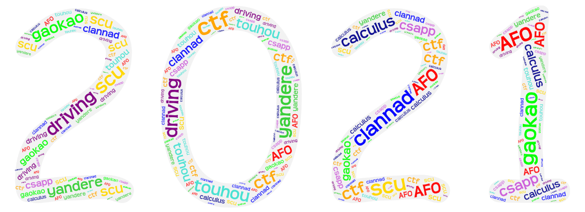

layout: post
title: Twenty-four——my summary of year 2021
author: junyu33
mathjax: false
tags: 

categories:

  - 随笔

date: 2021-12-30 7:00:00

---

The year 2021 is another extraordinary year for me. Many shining and gloomy moments happened. To sum up, I still believe my year of 2021 goes smoothly.

<!-- more --> 

The year of 2021 started with disappointment of AFO and frustration of failing in the monthly examination. I knew this was a crux of my life because there were only 5 months left before gaokao but I still had a bunch of things to master. My goal was to reach 600, and I had to prepare for OI, CTF for self-enrollment exam, attend classes and review those unfamiliar knowledge before simultaneously. It's a very tough work, like walking in the darkness while looking for the correct path myself. The only joyful thing in my "senior 3" was playing table-tennis and taking photos in snowy days after the academic proficiency test ended.

In winter vacation, to help go through courses I've learnt and forgotten in senior 1, I asked my parents to find "one to one" tutoring for my physics and chemistry. Surely I recovered what I learned before and I've got a lot of practical skills for exam, but more importantly, my physics tutor told me the prospect of computer science and asked me to work hard on it. I was motivated by him and put more attention to self-enrollment.

By the end of March, my hard work in CTF has paid off and I succeeded in self-enrollment exam by scu. It's the first and huge progress I've made this year. After the exam, my task became much simpler. I just need to focus on gaokao and got a high score instead.

Time passed quickly and gaokao finally arrived in a glimpse. Although the difficulty of natural science has raised, I still got a fairly high score in math. However, I messed up in physics and chemistry, which made the overall score just a little more than 600. There were some classmates attending gaokao **in senior 2 with me** and the best score was about 670, but I don't care. All in all, 605 is still a highlight for student who only takes classes for about one year. 

> After gaokao, my mother told me that she was diagnosed with lung cancer when I was having a self-enrollment. But luckily, it was an early stage and can be cured by an operation. Also, she had an insurance and got paid a lot of money, which was far more than the fare of operation. Say, this was the unexpected fortune. What depressed my family was she indulged in ~~investment~~ lottery and took no notice of my advice of quitting. When she realized this was a fraud, she had lost all of the "unexpected fortune".

The life in summer vacation wasn't as easy as I thought before. I had to learn calculus, linear algebra and got a driving license in only 2 months. I couldn't imagine how I managed to handle these but I still worked them out. Also, I played *Mystery Lover* recommended by Hash and developed an interest in Touhou (although I don't plan to play the game because it's too time-consuming), yandere (like Yuno) and music games. These games, anime and music took me into another idealized world apart from the cruel reality. Say, another habitat for my heart.

By the time I entered university, I firstly felt all the surroundings are fresh and we have plenty of time to what I want. Then I realized that self-control is impressively significant in campus life now, which can make you distinctive or degenerate. So I continued to learn with the strength of senior high. Then in a CTF competition nationwide, we ranked 4th in 24 participants, winning the glory of our university ~~and high school~~.

However in the mid-term exam, I didn't do a very good job in calculus, just a little more than 60 again. Also, the freshness of campus life has vanished, I gradually found that there are many unnecessary tasks you have to do and boresome courses you have to take. That made me kind of annoyed. Sometimes I even doubted if the path I chose is my dream and lost in thought. 

> To seek the meaning of my campus life and look for way to achieve my dream, I watched *CLANNAD* and also played the game. Although I didn't find the answer to my current situation, I truly felt a different kind of warmth. I was moved by the grand redefinition of "FAMILY" and the growth and maturity of Okazaki couple. Till now, the plots and scenarios still reverberate in my heart.

When the security project comes in late November and December, some classmates asked me questions about pointers, stack overflow and reverse engineering. So, I posted some blogs, trying to explain these knowledge in a friendly way. While teaching others, I also have a deeper understanding of these principle by manipulating over and over again. And step by step I've felt the charm of my major and I'm not as bewildered as before. So I'm starting to learn *CSAPP* and *encryption and decryption* on my own during spare time to enrich my academic ability.

Hoping I will get good grades in calculus and linear algebra, and learn more practical skills in the next year 2022!  

