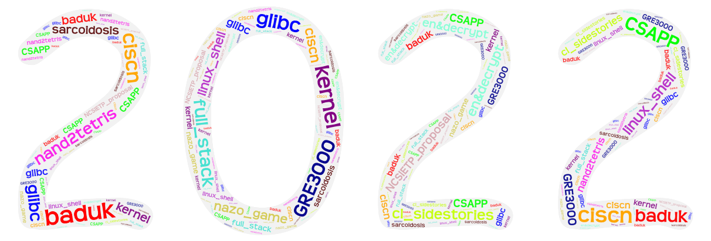

layout: post
title: Thirty——my summary of year 2022
author: junyu33
mathjax: false
tags: 

categories:

  - 随笔

date: 2022-12-28 17:00:00

---

The year 2022 is mainly for accumulating basics. Nothing extraordinary happened.

<!-- more --> 

# Timeline

- Jan. Learn x86 assembly on *CSAPP* (the first two chapters were finished in 2021) and prepare for final exam.
- Feb. Finish the first 6 chapters of *en&decrypt*.
- Mar. Buy a Linux server and install Ubuntu on my local machine, learn the basics of shell commands.
- Apr. Coming of age ceremony in high school. Get sick.
- May. Recovering, build the Linux kernel, following the school curriculum at home.
- Jun. Prepare for final exam. Get 2nd prize of *CISCN sw. division* (CTF ver.).
- Jul. Military training and enterprise training. Learn the basics of heap exploitation.
- Aug. Learn techniques (house of xxx) of heap exploitation with lower glibc version, being repelled from CTF team.
- Sep. Bewilder again, change the focus from CTF to general CS learning.
- Oct. Prepare for *National College Students' innovation and entrepreneurship training program*, write proposal.
- Nov. Regain Baduk/Go as a hobby, abstain from music games. Develop basic frontend&backend skills.
- Dec. Learn basics of kernel exploitation. Finish *GRE3000* and *nand2tetris* course.

# Achievements

- 3.88 GPA (4.0 full)
- 624 in CET4 and 610 in CET6 (non-prepared & one-time)
- 2nd prize of *CISCN sw. division*
- A school project of *National College Students' innovation and entrepreneurship training program* (NCSIETP)
- A personal webpage & a nazo game
- Finished heap&kernel module in [pwn.college](pwn.college)
- Finished *nand2tetris* (part Ⅰ)
- Finished GRE3000
- Baduk level: ? -> 4 kyu

# Long ver.

In the first two months of year 2022, I learned the basic skills of reverse engineering, such as i386 and x64 assembly, usage of static (IDA pro) and dynamic reversing tools (Ollydbg ~~although it's out of date~~). Also, I did some simple crackme challenges as well as learned some encrypt and hashing methods (MD5, RC4, TEA, AES, RSA) and how to identify them.

When the second semester came, I was persuaded by classmates to buy a linux server and started to explore linux shell commands. To make myself quickly accustomed the shell environment, I installed Ubuntu OS on my host computer and tried to use it as main system. Not long after that, I was diagnosed as lung nodules (sarcoidosis) and had an operation. Thanks to the freshman checkup, this was in an early stage and I healed soon.

The whole May I did self-learning at home, the calculus course is kind of tricky and my teacher didn't offer me a live stream. I could only learn from the dull textbook. In the meantime, I was setting up my userland/kernelland pwn environment on Ubuntu and successfully built the `linux-5.4.98` kernel. 

After I came back to school in June, it was the time near the final exam. However, I've dropped a huge amount courses, and some of them were practice-oriented, that means I've to find time making them up. Although I tried my best, there are still 3 courses affected. First is PE, I can't attend badminton matches so I got a rather low score in that part. Second is the experiment course of physics, I was absent from a lot of experiments and it was impossible to do them and write experimental reports in such a short period. Therefore, this course was removed from my curriculum and I had to attend it again the next year. Last is the calculus, due to the lack of calculating practice (although the essence of math is not calculation), I felt bad in the final exam and only got 82 in the overall score. Fortunately, I did a good job in other courses, so my GPA just dropped a little.

Then came the CISCN, during the quiz part I got the highest score of the team. However, in the CTF part, I got stuck on several reverse challenges and made no progress. I even dumbfounded at a simple RSA challenge. The challenge was so easy that I've learnt it on the first day when entering the crypto part. After this match, I felt myself completely a burden of our team.

The beginning of summer vacation was filled with military training and enterprise training. During the military part, I learnt some basics about heap exploitation on [pwn.college](pwn.college) when the training was cancelled due to the hot weather (usually afternoon). The enterprise training contained two parts: developing a website using java for backend (of course JDBC) and CTF tutorial (web, crypto & misc only). One of my teammates chose Vue as frontend framework and Redis for database. Because I knew nothing about webapp development at that time, I could only do some landscaping work and write some simple business logic (15% of work). As a result, the teammate himself stayed up late to 3 or 4 and finished 70% and we got a high score for the advanced (relative) technology. The CTF tutorial was just for starter and boring, so I continued to learn techniques of heap exploitation.

Most of my summer vacation was used for learning the glibc heap and doing pwn challenges. I gradually got used to GDB with pwndbg extension (of course bare GDB was OK for me). In the meantime, my nephew was sent to our home as my sister was busy of work. He wanted to play Minecraft with me (i.e. the multiplayer mode). I tried to set up a Minecraft server using the linux server I bought several months ago, but I failed to connect to it for some unknown reason. The makeshift was intranet penetration, the connection was not stable enough but we still had a good time playing.

Before sophomore started, there was a good news and a bad news. The good news was that I got 610 in CET6 which means I can get an exemption of college English and the overall score will be 95 (the highest level). The bad news was that one of my posts a year ago quoted a accusation to another CTF team sent by my senior. It turned out to be a defamation and the reputation of my team and the senior suffered. As a result, to protect someone's interests, I was repelled from the team. 

September came and I was bewildered again. I communicated with my alumnus in my high school about the unbearable past, he suggested working on NCSIETP and CTF simultaneously. He said I didn't have to be in a team to learn CTF. And one of my junior emphasized the importance of **step out of the comfort zone** and he was self-learning from foreign CS courses. I agreed with his idea and changed the focus from CTF to general CS learning.

> The following are translated from a dialogue, sorry for my indolence.

School starts on September 10
Earthquake was sent at noon that day
my phone alarm is going off
At that time, my parents were skeptical and followed me into the toilet
send -> happen
Then start the first lesson of school: probability and statistics
After a week or two, resume offline
I'm very fortunate to have skipped a bunch of physics experiments
Then it is still online and offline synchronous teaching
In principle, online students take classes online, and offline students come to the classroom
I tried to be a good student at first
Then I found that this number theory and web development are not very interesting.

> (Ah sorry, I forgot you're not in your first year of college, you go on

Just took the step of fishing in the dormitory
Gradually, I found that the university teacher didn't seem to care if you were there or not.
Just find a classmate with a good relationship to sign in, and you can solve it
when it's midterm
Except for the three courses of discrete mathematics, physics and PE, the rest are all online
The reason for discrete mathematics is that the teacher is "smarter" and knows that we are playing in the dormitory.
So physical sign-in required
Physics is because the teacher never uses ppt, just listening to the sound must be very abstract
PE is obvious
After the mid-term, start to engage in NCSIETP
NCSIETP proposal
I knew before that NCSIETP is a ppt contest
not interested
You should know I'm an INFP
Touching fish at this kind of thing
Then I'm a team leader
(Of course I am reluctant
I wrote down the core technology two weeks before the declaration and became a hands-off shopkeeper
So the remaining one or two team members completed 70%~80% of the work of the application form
When it's time to declare, do a ppt

> infrastructure:

I picked up some things in the declaration form, and then directly used the ppt template of the mentor to declare his project
In this way, I am very relaxed, and the instructor is not very satisfied
So the team member made a new template
It is simply a fucking new look
on the day of declaration
I found out that the team member is a social fear, unable to speak in public
Fuck, a dead horse is a living horse doctor, I came forward
Relying on 20%~30% of the known content, I boasted for a while and fooled it
Finally, there is a school level (school level = normal, school level = consolation prize)
After that, I didn’t care about it. Anyway, the mid-term declaration is in April.
there is time
After the declaration of NCSIETP
The epidemic situation suddenly became severe

> \> The epidemic situation suddenly became severe
> i'm interested in details

The situation is critical, I flee quickly
OK, I expand
In the past, the country relaxed the epidemic prevention policy a bit
The nucleic acid test in our school is called "expanded nucleic acid"
(these leaders can really invent new words
My attitude towards nucleic acid is also in a fishing state
Suddenly one night, the word changed back to "full staff nucleic acid"
I have become accustomed to the positive results of Wangjiang and Huaxi before.
This time there is a gossip about Jiang An
Enthusiastic people posted on social platforms the long queue of nucleic acid queues
two kilometers
Of course, I still won't do it, in case of infection
Afterwards, the school seemed to be calm again
in early december
A few days ago, a classmate posted about the fire in Xinjiang in Moments
Then get banned (you should know this)

> (Yes, but I think its historical role is exaggerated
> (Wikipedia is now stable and very informative

Of course it has nothing to do with what's coming next
Another dark and windy day
Some colleges started to spread the gossip
Bah, some classmates
Use "No way, no way" as the headline party
A bunch of words "don't believe in rumors, don't spread rumors" in the comment area
Said that their college is going to start driving people home

> "Tropical Rainforest Shopping Festival"

The next morning, I heard the news that the xx house was closed
The authenticity of this news has increased by a few points
At that time, our dormitory said "friends walk together for a lifetime"
You must stay at school, saying that going home is not efficient for learning
On the morning of the third day, our college issued a notice for students to return home and held a meeting
Say "this is not a holiday, but continue to study online"
but the exam may be postponed
Fuck, then learn a hammer
Originally, the learning of non-professional courses (except mathematics) in universities is exam-oriented learning
continue
One of our imperial roommates was worried that he would not be able to go home during the Chinese New Year, so he bought a plane ticket
But there is a pop-up window for his imperial health treasure
complaints doesn't work

> (It should be gone now

He spent a little to buy a Weibo popularity
Cried a few words, @imperial capital
cry -> scold
Then he popped up and disappeared
Afterwards, he also prepared a mobile phone card, which was placed in an iron box to block the signal.
Just in case
He was the first to leave the dormitory

> "The Faraday Cage"

The second classmate plans to stay in the house of a classmate outside the school for a few days, and if the situation is out of control, he will go to Hangzhou
The third classmate took the physical education test in advance, and saw that half of the people in the dormitory had left. He wanted to touch fish and play games at home, so he also left (translation loses some flavor)
That's when I told you critical
At that time, my PE test was on Monday afternoon. I packed my luggage in advance and prepared to leave after the test.
Unsurprisingly, due to my clumsy posture, the action score is only 40
But since I scored 200 in rope skipping and rode all the runs
I still got a total score of 86

> Good (emoji)

After finishing the physical education test, I know that if I stay in school for one more day, I will be more dangerous
So I'm fast
Back home, the World Cup side is in the knockout round
Brazil vs. Croatia, Livaković is a god
I just cried to death
(I didn't gamble
On Tuesday two weeks ago
my father is ~~sunny~~ positive
The next day my mother was ~~sunny~~ positive
I started to enter the "College Entrance Examination Review Mode"
locked in the house alone
Eat and keep distance from the positive
Even so, I was infected
Started with chills, shaking, I had to give up watching the game
Lying in bed with a slightly elevated temperature
In the middle of the night, my father brewed a bowl of *Lianhua Qingwen*
That mint smell is so unforgettable
I sweated a little in the middle of the night, and my body temperature returned to normal the next day
In the next few days, my head hurts and my nose is bloody.
Some people say that the omicron will attack wherever it is weak
Could it be that I am using my brain too much?

> \> bloody nose
> Antibiotics recommended (when I didn't say

(Although it was really painful to do the heap and kernel of pwn.college a while ago
Symptoms disappear after about five days
class is almost over
start to let myself go

> (I still have symptoms now,

I perfected that web project a bit, and then I'm finishing nand2tetris, and I'm done with GRE3000. Planning to start reviewing next year
That's it
Oh, and after NCSIETP I replaced the music game with Go, it's a nice exchange
I don’t know if *Touhou Mystia's Izakaya* can replace Go (

> Go?
> Baduk (

right

# Postscript

I could only say my writing skills have degenerated and the contents are kind of bland. Maybe there is truly nothing to say anyway. Still, wish having a good time in 2023. Whether I can do a good job or not in NCSIETP is just the fate tells.
