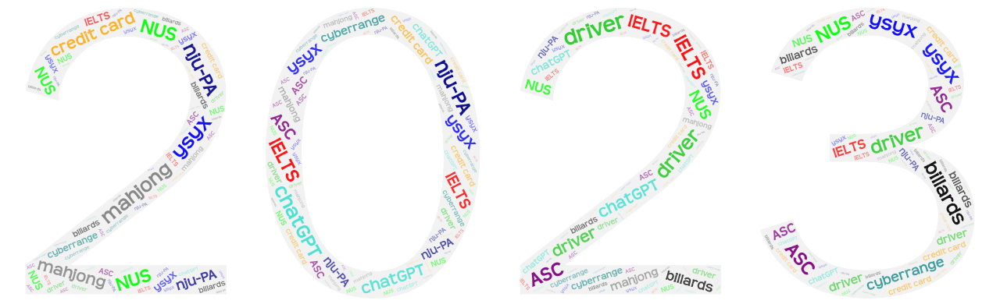

layout: post
title: Thirty-six——my summary of year 2023
author: junyu33
mathjax: false
tags: 

categories:

  - 随笔

date: 2023-12-31 23:30:00

---

I find that I've nearly forgot to write this summary. So, in accordance with IELTS writing requirements, I'll try to write this in 40 minutes.

<!-- more -->

This year, which spans half of my sophomore and junior school life, is another period without any outstanding achievements. Instead, it is a time for me to keep my GPA at a stable level and consolidate the foundation of my interests.

The first 2 months was still a time for exploration on Windows kernel drivers. I spend nearly half of my winter vacation writing the driver to control the access of folders and files according to different user roles. I believe I've written 60 percent of the function I previously estimated, so I left rest of the work to other groupmates. However, I overestimated their ability, and I also needed to finish an experiment course I left last year becuase of my disease. These two factors contribute to no preparation for mid-term defense, which led to a rather failure in "National College Students' innovation and entrepreneurship training program".

In the next semester, I took part in learning [nju-PA](https://nju-projectn.github.io/ics-pa-gitbook/) when I was free. I'd like to say the experiments were actually very challenging for me. The schoolwork in the second semester in sophomore was kind of heavy so I only finished PA3.2 when this semester ended. 

Besides, I atteaded the interview of 0x401 team, but due to the consideration of studying abroad, which may result the unstablility of the team, I decided to quit. But the previous foundation in binary helped me perform well in the OS course. I had a good relationship with one of the teachers, and the communication helped me gain some privilege in cyberrange, becoming the first batch of students to enjoy the facilities in it.

In the summer vacation, I went to National University of Singapore to do some projects. I wanted to do a project related to side channel attacks, however other groupmates thought it too hard. We finnaly chose python code vulnability detection by machine learning and AST. Finally it turned out to be a failure and I got the least score (76) of all the courses I've learnt these years.

In the first semester in junior, I finished PA3 and started paricipating [ysyx project](https://ysyx.oscc.cc/), still I worked on this when I was free.  Also, my relationship with roommates got better, and we often played mahjong or billards when we were both free. In November, my parents thought I played games too long every week and reminded me to take control myself. Therefore, I reduced the playing time, and I accepted an advice from my younger schoolmate - contacting an assoticate professor and trying to make some connections with him or her.

In December, my schoolmate gathered some of skilled (he thought) students to join a competition named ASC (supercomputing). Although it was a bit off from my interests, I still accepted his innovation for mostly learning purpose.

There were still some unsolved questions about the future. For example, whether I should write papers in Beijing, where my contacted AP works, or just at school to prepare for postgraduate recommendation? Should I continue keeping an interest on IC design and computer architecture, or return to system security which both my AP and me fouse on? Time will tell the answer to that question.

All in all, happy New Year 2024!
