layout: post

title: twenty-five——bye, Baidu

author: junyu33

tags: 

categories: 

- 随笔

date: 2022-4-15 12:30:00

---

My English presentation on 4/14/2022.

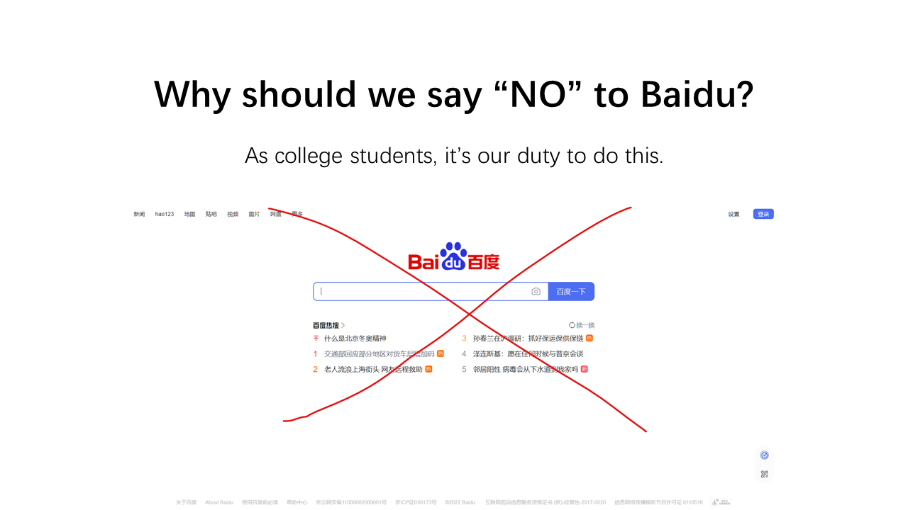

<!-- more -->

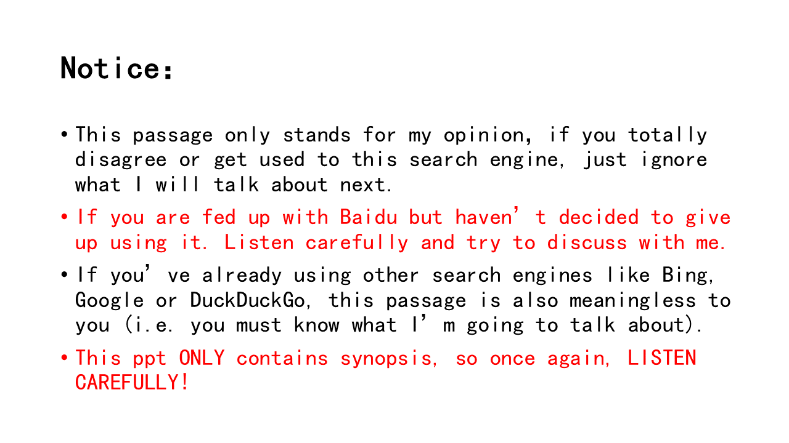

Baidu, the largest search engine provider in China, was found in millennium. Owing to deep understanding of habits from native users, Baidu beat its opponent Google successfully. What's more, deeply integrated with other services, such as Baidu Encyclopedia, Baidu Post Bar, Baidu Knows, Baidu Netdisk, Baidu improved user stickiness. In recent years, with the development of mobile-tech, Baidu created a column named Baijiahao. Through using mobile apps, Baidu gains a lot of user traffic, while making much profit.

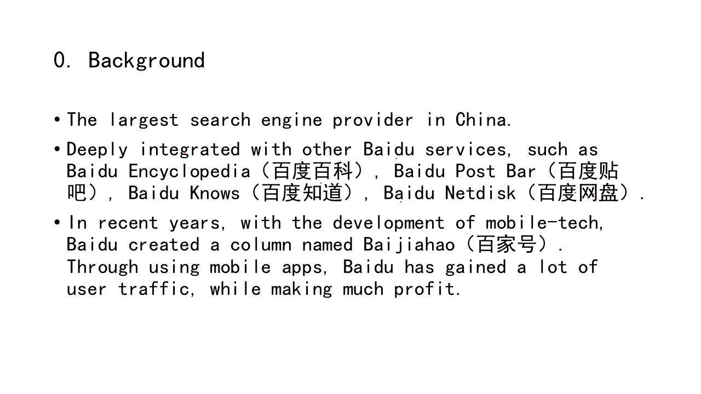

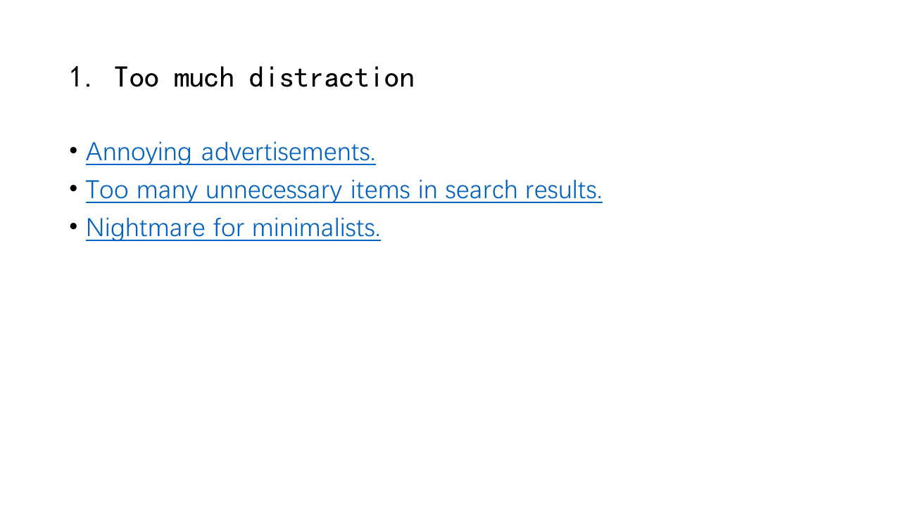

The first reason to refuse Baidu is that there are too much distraction. One of the most obvious factors is the advertisement. Look at this picture, when you input keywords relating to "diseases", "education" or goods", Baidu will return a whole page of noisome ads, which wastes your time. Moreover, some fake ads may mislead you and cause some loss.

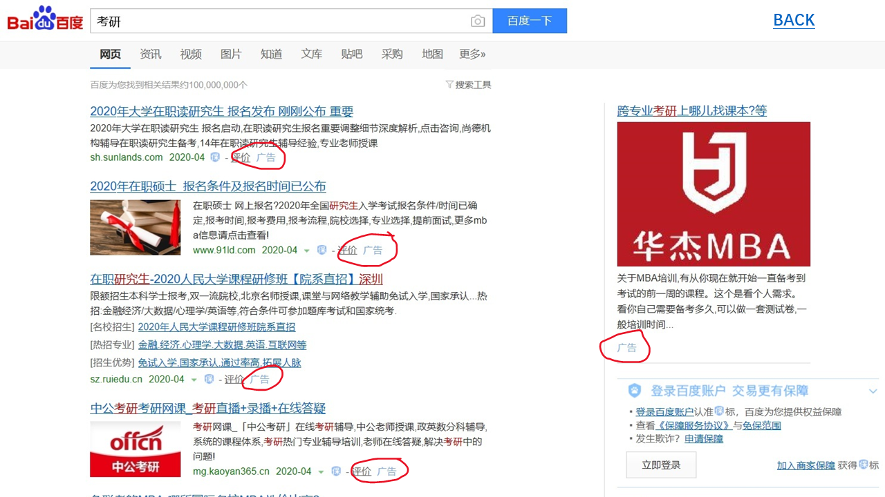

Apart from disgusting ads, the search result pages of Baidu are too complex. There are too many unnecessary items. For example, when you type "games" in Baidu, the recommendation on the right is so vulgar that they can't even be called as "games".

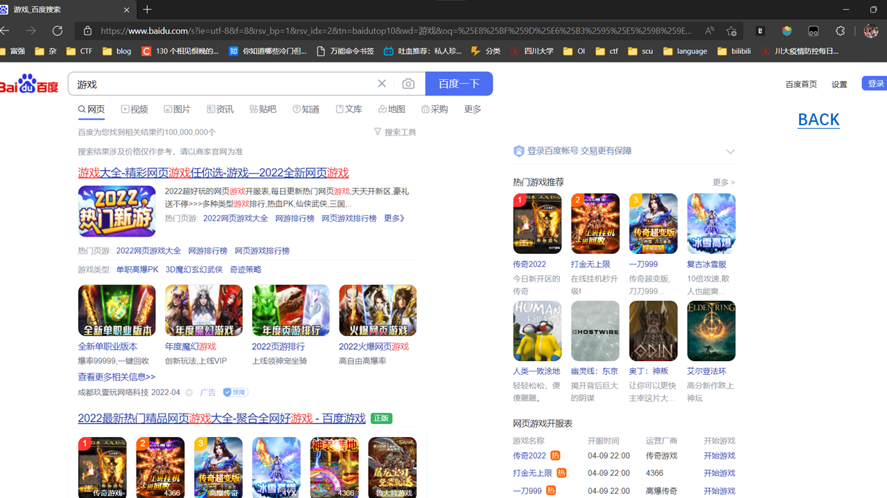

The profusion of webpage is also the nightmare of minimalists. This is a new tab from my browser. Looks very simple, huh?

This is Google. It's also very suitable for minimalists.

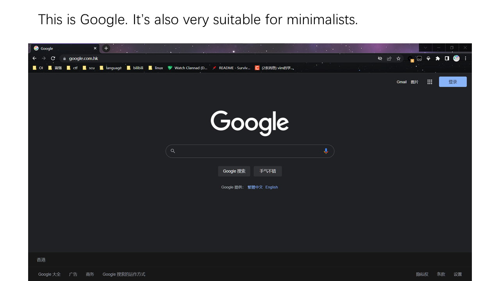

This is Bing. It looks beautiful and even better.

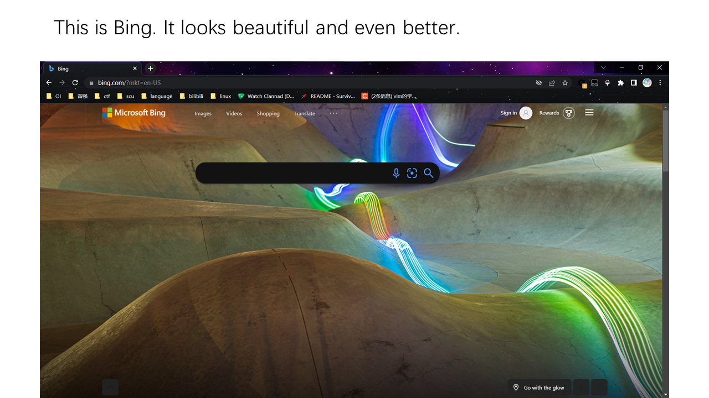

And this is Baidu... Most of the time, if you click one of these links, you'll watch videos or read news one after another——and after half or one hour later, you will return to the start and totally forget what you want to search in the beginning.

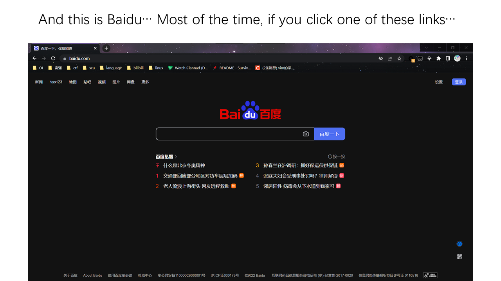

The second reason is useless search result for some keywords. Baidu only takes root in the Chinese market, so it's unsuitable to search items that are heavily associated with English. 

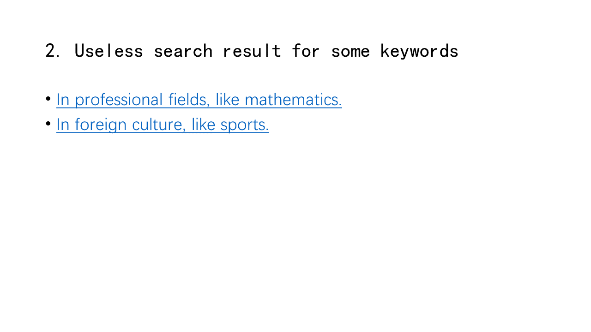

In professional fields, like mathematics, when you type "de rham cohomology", you can get a link to Wikipedia. However in Baidu, the first search result is just the Chinese translation. I believe people who search this are eager to find its definition and explanation, not just the Chinese translation.

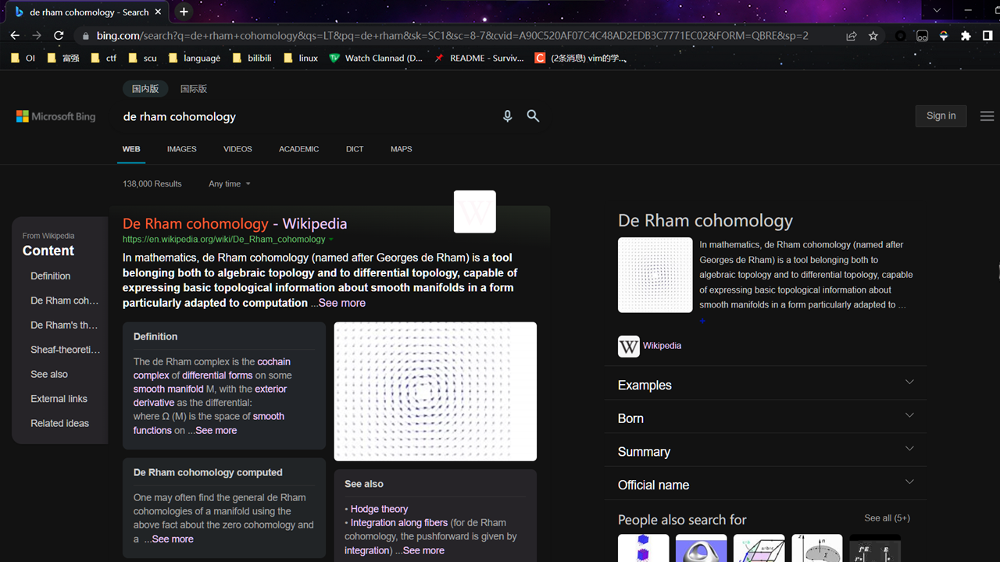

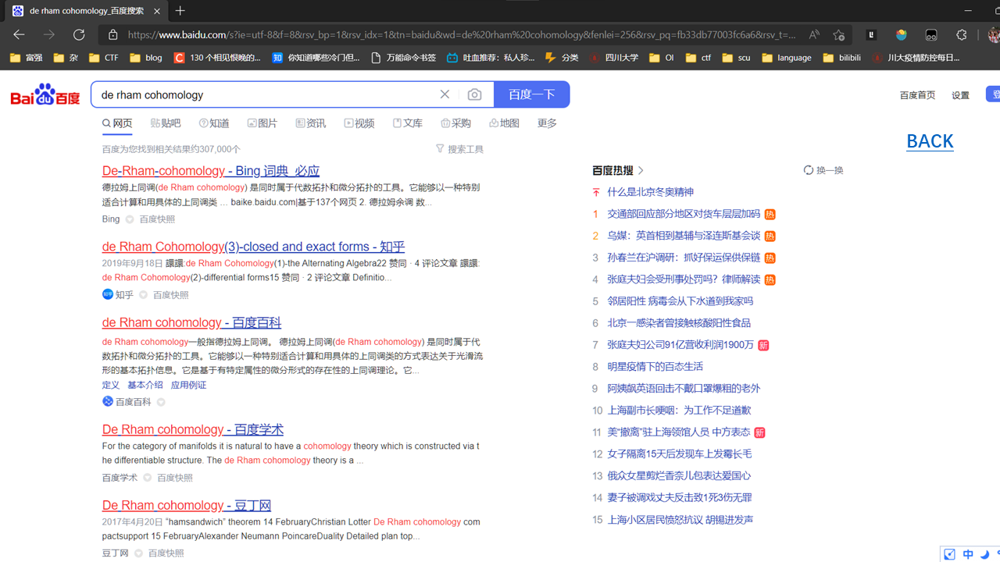

My roommate is a sports fan and he often follows sports stars' activities. Baidu lacks information of foreign culture like sports. When he tried to look up "juju" in Google, it returns his Instagram, wiki and so on. On the other side, he typed the same word in Baidu, he can only receive a female Japanese singer and other unrelated info.

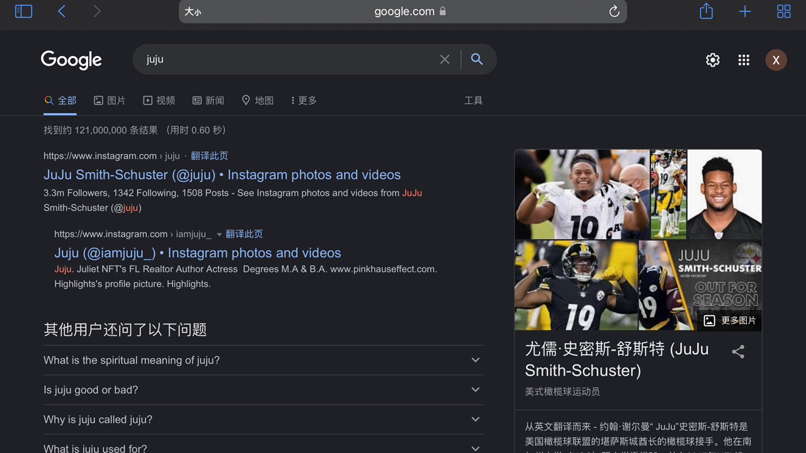

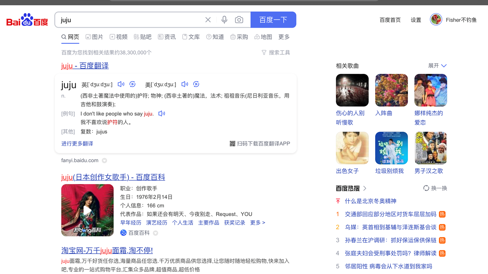

Another reason not to be ignored is its vile business model. If you use your mobile browser to search in Baidu.com, or click other related searches, you'll receive a pop-up which asks to download their app. This action degrades the user experience and makes some mobile users reluctantly install Baidu app——of course not including me.

Another solid proof is the speed restriction policy of Baidu Netdisk. At the beginning when Baidu Netdisk was found, it generously gives users 2048 gigabytes of disk space. Actually this is a good scheme to accumulate users. When there are enough (i.e. pretty much) users, Baidu starts to restrict the download speed and asks users to upgrade VIP in order to speed up. Because users have already store lots of data, they can't find any substitute. As a result, they have to pay for Baidu to retrieve their important data.

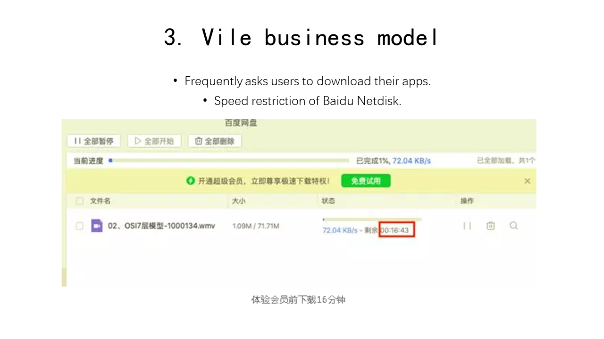

It must be said that Baidu still has some advantages. Due to the lack of copyright awareness in Mainland China, you can still find lots of pirated software in Baidu. By the way, it's also a good choice to look for pornography in Baidu.

All in all, as college students, to save time and find more refined information, let's say "goodbye" to Baidu and user other search engines together. Thanks for your listening!

