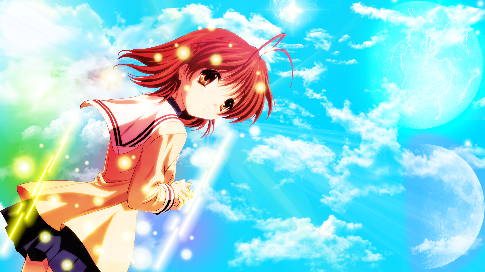
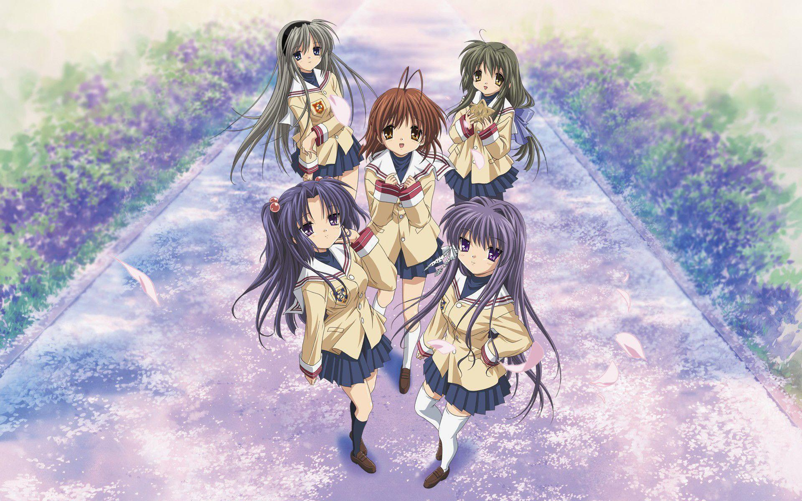

layout: post
title: Twenty-three——review of CLANNAD (anime)
author: junyu33
mathjax: false
tags: 

categories:

  - 随笔

date: 2021-11-17 20:00:00

---

Followed by my last English post "bewilderment", I'm thrilling to find the right path to go on. I suddenly realized that during my high school times, one of my roommates recommended me to watch CLANNAD (short for CL later). I refused for overwhelming pressure several months before college entrance examination. But now I'm free but depressed, I think it's just the time to watch it in order to guide my heart. 

This is the 3rd anime I watched besides *Working Cells* and *Future Diary*. After ten days striving not to weep, I succeeded. Unlike others said that the anime brings you tears, I prefer it gives you warmth and courage during rough times. (Maybe I haven't been struggling in a hard situation so there's no empathy for me to cry.) CL, as is shown in title, tells a story of several families, the transformation through time. It's just a brief summary of life, although kind of idealized.

I'm here to talk about some profound sentences and try to seize the essence of the story, otherwise they would be erode by time again.

<!-- more -->

**The English meaning of word "clannad" is "family"**, so all of these sentences have something to do with the significance of family and companion, which run through all scenarios of the story. 

(SPOILER WARNING!!!)

**What makes you not degenerate is neither talent nor love, but the family, or someone who can control yourself. **

Responsibility is one of the main topic CL wants to convey. It is also responsibility that makes Tomoya changed himself from a bad guy to a great father. For instance, before his encounter with Nagisa, he hated this town and treated everything meaningless. **"Because of her, my life eventually filled with color again."** Therefore he determined to care her as long as he could. From a boy hating school, to a man with high EQ, and finally a wonderful father, the responsibility he took totally transformed himself. 

This is the same for Nagisa. Due to her poor health (a cold is like cancer for her while nothing for Yuno instead uh-huh), she was often absent. What's more she was also introvert and few classmates noticed her. Therefore, she had almost no friends. The appearance of Tomoya encouraged her to be outgoing and to **go and find whatever she wants**. With Tomoya and his friends' help, Nagisa rebuilt the drama club, performed her favorite drama story, and made her and her family's dream come true.

In CLANNAD ~AFTER STORY~ (short for CL-2 later), Nagisa passed away because of dystocia (difficult birth). Losing his beloved wife made Tomoya numb, he refused to raise his daughter Ushio, instead, he resorted to alcohol and cigarettes just for escaping from the unrecoverable wound, the intangible past. After 5 years, Ushio happened to have a trip with Tomoya. An unexpected talk with grandma aroused him as role of a father, which made him finally find out **"the one and only precious thing worthwhile to be care for"** asked by Nagisa. He knew what it means to be a father at last.  

The "confinement" and unbelievable change of Tomoya and Nagisa can move everyone who watched CL by heart. Maybe it is just a kind of feeling —— growth, maturity and family.

**The dream of kids is the dream of family, we didn't give up our dreams, we just find a sustenance on your dream. That's how parents do and how family do.**

Dream is also an important main idea during the story. On the last night of school anniversary, Nagisa found that her parents gave up their dream to raise her up. She was so regretful and nervous that she sobbed in her drama program the next day. At the critical moment, her father rushed up to tell her don't be self-criticized and on the contrary, stick to the drama show in hand, for this is the expectation of the whole family. I believe it is one of the most moving scene because it is awfully true in today's world. Parents have sacrificed a lot for our growth, isn't it?  

The most controversial character is Tomoya's father Naoyuki. He seems to be useless and hampered Tomoya's life. As Tomoya's closest relative, the plot didn't uncover his background for a long time. That's because only Tomoya himself also becomes a father can he experience the difficulty of his father. The situation of two fathers is just the same —— losing the most important half in their life. However, Naoyuki didn't give up raising Tomoya, instead he always bought toys and snacks to bring up his son. When his son grew up, he has already lost money, job, opportunity —— everything. He was so painful that he only had a benevolent smile. In this way, Naoyuki is truly an honorable father.

**There are something awful that happened in our lives, however the fine moments, when time passes, will be sent down and remain in your hand.**

The last main topic of CL is happiness and love. The legend of the town is about the glowing ball. It only appears when someone feels happy and beloved and people who gain the shining thing could make their dream come true. To move a step closer, if the town has its own thoughts, it is people who love this town makes the town happy, and the town loves the people living in it. Therefore, the town realized Tomoya's dream and the miracle happened. 

We all know that when seniors recall their whole lives, they remember their delighted moments clearly. This plot also tells us that only the happy things won't be washed away by time. So don't be blue when life beats you, please think that there are more possibilities in future and lots of uncovered happiness are waiting for us. Also, always be grateful and helpful to others, as one day they may help you realize your dream. 

By the way, how residents treat others expanded the definition of word "family", and this is a symbol of Mo Theory —— to love others equally without distinction. However, this is kind of biased from our topic so I don't want to expand it.

In general, CL has brought me the inner strength that I lacked in the past. I finally know how much my family love me and they're always cheering me up. However, it doesn't tell me how to find my way, it just motivates me to **follow my own heart**. I wonder if I would have some new feelings after several years to watch CL again. I'm looking forward to that day comes.

> PS: 
>
> - only 30% of bilibili users have watched the true ending (Tomoya tells Ushio about his life). That's kind of disappointing. 
> - To practice my listening skills and get more details, I'm watching CL English dubbed version for a second time.

   

