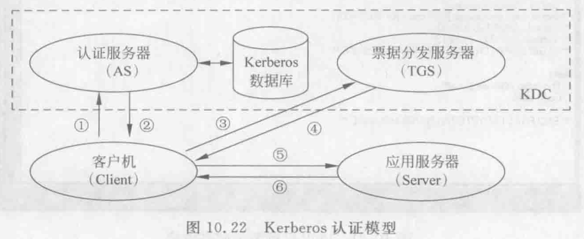
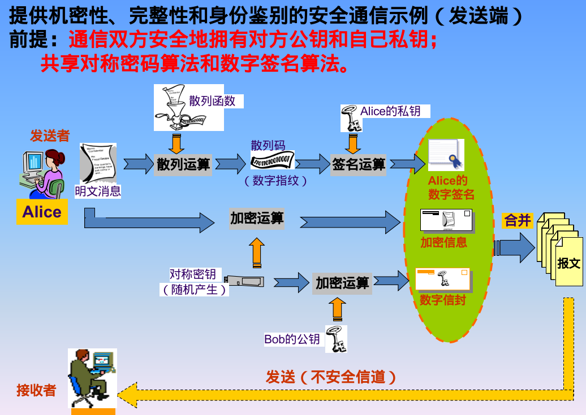
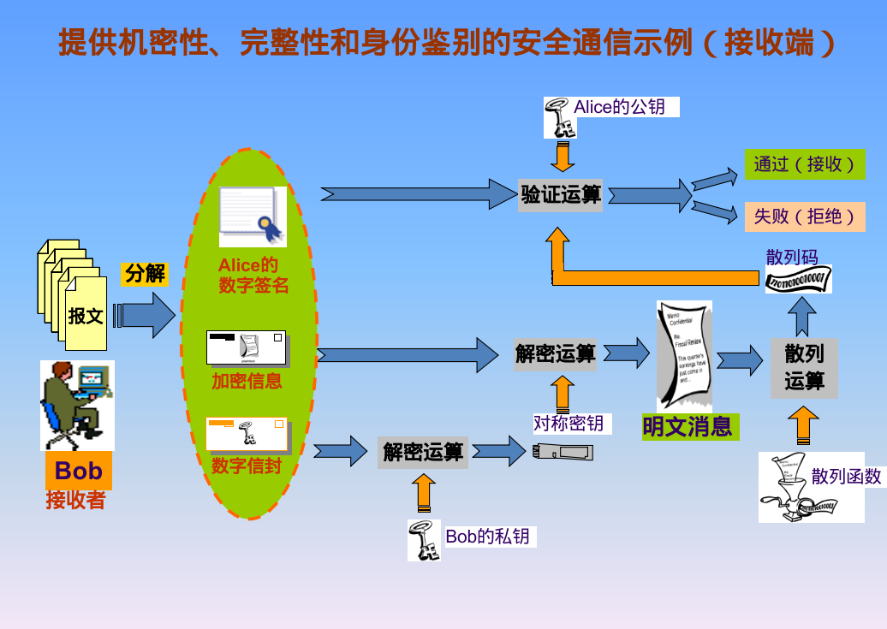
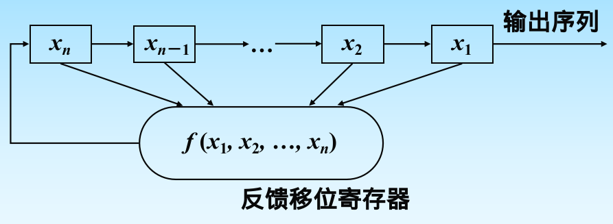

layout: post
title: （已完结）应用密码学笔记
author: junyu33
mathjax: true
categories: 

  - 笔记

date: 2023-2-27 14:30:00

---

简称为“大网安数”。

<!-- more -->

# 密码学概述

现代密码学四性：机密性，完整性，鉴别和不可抵赖性。

三个时期为：古典密码（算法保密），近代密码（密钥保密）和现代密码时期。

对密码系统的攻击：唯密文攻击，已知明文攻击，选择明文攻击，选择密文攻击。

Kerckhoffs原则：安全性只取决于密钥的保密，而不是算法。否则是“受限制的密码算法”。

安全性分类：无条件安全性，计算安全性，可证明安全性。

密码算法的功能：加密，杂凑，数字签名，身份鉴别，密钥协商。

私钥用于签名，公钥用于验证。

> 作业（p14）：
>
> 1-1，1-2，1-4，1-6，1-7

# 古典密码

## 单表替代密码

### Caesar

$c = m + k$

$m = c - k$

### 仿射密码

$k = (k_1, k_2)$

$c = k_1 m + k_2$

$m = (c-k_2)k_1^{-1} \pmod {26}$ 

### 密钥短语密码

 把密钥放在最前面，剩余字母排在密钥后作为替换表。

### 缺点

词频分析。

## 多表替代密码

### Vigenere

$c_i = m_i + k_i$

$m_i = c_i - k_i$

### Hill

$C = K \cdot M$

$M = K^{-1} \cdot C \pmod{26}$

其中$C$与$M$为列向量，$K_n$为加密矩阵。

优缺点：

- 对抗唯密文攻击，密钥空间大。
- 易受已知明文攻击与选择明文攻击。

### OTP (Vernam)

$c_i = m_i \oplus k_i$

$m_i = c_i \oplus k_i$

不能重复使用密钥，理论上不可破译。

### playfair

密钥字母去重，放在前面，剩下字母接上，i/j 一起占一个空，排成5*5的矩阵。

对明文两两分组（记为p1 p2），如果：

- 如果在同一行，那么密文就是明文靠右的字母。（最右的右边就是左边第一个）
- 如果在同一列，那么密文就是明文靠下的字母。（同理）
- 如果都不是，那么取另一个对角线作为密文，原文与对应密文的行相同。
- 如果相同（或剩一个），则在中间（右边）插一个约定的字母x。

## 链式密码算法

利用一个明文加密的结果作为下一个明文加密密钥。

缺点：误码扩散。

## 置换密码

### 周期置换

密钥规定了位置的置换。

属于Hill的特例，即属于线性变换的密码。

### 列置换密码

把明文按行填入矩阵，密钥规定以列读取的顺序。

### 转轮机密码

不考。

> 作业：
>
> 2.1 2.4 2.5 2.7 2.8 2.10 2.11 2.13 2.14 2.15

# 分组密码

## 设计原则

- 扩散原则：明文每一位影响密文尽可能多的位，密文每一位被尽可能多的明文影响。
- 混乱原则：敌手获得明文和密文也无法求出密钥的任意信息。
- 软件设计：使用子块和简单的运算。
- 硬件实现：尽量使用规则的结构。

> 若 $S^2 = S$则是幂等密码体制，如仿射密码、置换密码等。
>
> 迭代密码体制必须是非幂等的。

## 典型结构

- SPN结构：扩散更快速，但是加密和解密不相似。
- Feistel结构：加密解密相似，扩散慢一些（至少需要两轮才能改变输入的每一位）。

$L_{i+1}=R_i$

$R_{i+1}=L_i \oplus F(R_i, K_i)$

## DES（重点）

- 安全性完全依赖于密钥保密。

- 密钥长度 64 位（8 位用于奇偶校验）

步骤：

- 明文IP置换。
- $R_0$的$E$扩展得到$R_0\quad (32 \rightarrow 48)$：把$R_0$分成$8$块，每块记为$B_1$到$B_4$，然后$B_1$前面加上前一块的$B_4$，$B_4$后面加上后一块的$B_1$.
- 对$K_0$加上校验位（8的倍数），通过$\texttt{PC-1}$得到`C[0]`和`D[0]`，左移一位得到`C[1]`和`D[1]`，通过`PC-2`得到$48$位$K_1$.
- $R_0 \oplus K_1$
- $S$盒变换$(48 \rightarrow 32)$：不同的块是不同的$S$盒，取 $B_2$到$B_5$ 作为$S$盒的行，$B_1B_6$作为$S$盒的列（大端序），查表得到的值作为密钥块。（重点）
- $P$盒变换。
- 与$L_0$异或以后得到$R_1$，便完成了一轮迭代。
- 经过 16 次迭代后再经过一次IP逆置换。

优点：

- 加密解密结构相同。
- 强度高。

> 互补对称性证明：
>
> 对于$F$函数，有$F(k, R)=PS(k \oplus E(R))=PS(\overline{k} \oplus E(\overline{R}))=F(\overline{k}, \overline{R})$
>
> 从而轮函数$Q_k(L,R)=(R, L \oplus F(k, R))=(R, L \oplus F(\overline{k}, \overline{R}))$，进而$\overline{Q_k(L,R)}=(\overline{R}, \overline{L} \oplus F(\overline{k}, \overline{R}))=Q_{\overline{k}}(\overline{L}, \overline{R})$
>
> 设$D$为左右块对换，$x=(L,R)$，从而加密函数$E_{\overline{k}}(\overline{x})=D \cdot Q_{k_{16}}Q_{k_{15}}...Q_{k_{1}}(\overline{x})=D \cdot \overline{Q_{k_{16}}Q_{k_{15}}...Q_{k_{1}}(x)} = \overline{D \cdot Q_{k_{16}}Q_{k_{15}}...Q_{k_{1}}(x)}=\overline{E_k(x)}$

改进：三重DES。

## 分组密码的工作模式

- ECB：每块明文加密成相应的密码块，最后不足64 bit的部分用随机串补全。（本身是一种大的单字母替换）
- CBC（常用）：当前明文块在加密之前要与前面的密文块进行异或，需严格保密初始向量。
- CFB：按比分组小得多的单位进行加密，密文依赖于前面所有明文。
- OFB：在块内部进行反馈。（易受篡改）
- CTR：可并行、预处理，可产生较好的伪随机数序列。

如何选择：

- 安全性
- 高效性
- 功能

## AES（重点）

### 数学基础

有限域 $\mathrm{GF}(2^8)$的乘法：略。

x乘：由于 AES 选取的模数为 `0x11b`，即$x^8+x^4+x^3+x+1$，当乘数高位为0时，相当于左移；反之相当于左移并异或`0x1b`.

叉乘：指$\mathrm{GF}(2^8)$中两个四次式相乘，模数为$x^4+1$。可以通过矩阵乘法简化过程，具体而言，对于多项式$\overline{a_3a_2a_1a_0}$与$\overline{b_3b_2b_1b_0}$，乘积$\overline{d_3d_2d_1d_0}$为：

$$\begin{bmatrix} 
  d_0 \\ 
  d_1 \\
  d_2 \\ 
  d_3 
\end{bmatrix} =
\begin{bmatrix} 
  a_0 & a_3 & a_2 & a_1 \\ 
  a_1 & a_0 & a_3 & a_2 \\
  a_2 & a_1 & a_0 & a_3 \\ 
  a_3 & a_2 & a_1 & a_0 
\end{bmatrix} \cdot
\begin{bmatrix} 
  b_0 \\ 
  b_1 \\
  b_2 \\ 
  b_3 
\end{bmatrix}
$$ 

其中项与项的点乘就是$\mathrm{GF}(2^8)$的乘法（使用x乘），加法就是异或。

### 步骤

密钥128位。

- 字节代换：查表。
- 行移位：第$i$行循环左移$i$字节。
- 列混淆（重点）：对每一列进行叉乘，$\overline{a_3a_2a_1a_0}$固定为`3112H`.
- 轮密钥加：按列与轮密钥进行异或。

总过程：
```
AddRoundKey()

for i from 1 to 9:
  SubBytes()
  ShiftRows()
  MixColumns()
  AddRoundKey()

SubBytes()
ShiftRows()
MixColumns()
```

## 其它对称加密

- IDEA (分组64bit, 密钥长度128bit, 非feistel结构)
- RC6 (分组128bit, 密钥长度128,192,256bit, feistel)
- SM4 (分组128bit，密钥长度128bit, 非对称feistel)

# 非对称加密

## 对称的缺点

- 系统开放性差（如何传递密钥）
- 密钥管理困难，$n$个设备有$\frac{n(n-1)}{2}$个密钥。
- 数字签名问题。

## 公钥的特点

- 公钥管理方便，开放性好
- 加解密计算代价较大

## 公钥的作用

- 常规密钥分发与协商
- 数字签名
- 加密解密（效率较低且不宜直接使用）

## RSA

具体过程：略

> 用CRT实现RSA的快速计算
>
> 例：计算$m^d \pmod n$，其中$n = pq$，$p,q$为互异素数，$d$为密钥。
>
> 解：分别用欧拉定理计算$m^d \pmod p$和$m^d \pmod q$的值，然后用CRT计算$m^d \pmod n$即可。

## Miller-Rabin

费马小定理是模数为素数的必要条件。

二次探测定理：若$p$是奇素数，则$x^2 \equiv 1 \pmod p$的解只有$x \equiv 1$或$x \equiv -1$.

伪代码：

```python
# false rate: 1 - 4^(-s)
def WITNESS(a, n):
  if pow(a, n-1, n) != 1:
    return FALSE
  else while n % 2 == 0:
    n /= 2
    if pow(a, n-1, n) != 1 or -1:
      return FALSE
  return TRUE

for i from 1 to s:
  if WITNESS(integers[i], n) == FALSE
    return NOT_PRIME
return PRIME
```

## ElGamal

### description

系统参数：$p, \alpha \in \mathbb{Z}_p^*$.

选取私钥$x_A$，公钥为$y_A = \alpha^{x_A} \pmod p$

加密：

- 选取随机数$k \in [2, p-2]$
- $c_1 = \alpha^k \pmod p$
- $c_2 = m \cdot y_A^k \pmod p$

解密：

- $m = c_2 \cdot (c_1^{x_A})^{-1} \pmod p$


### feature

- 非确定性的（依赖于k）
- 密文空间大于明文空间

## ECC

> SM2也使用了椭圆曲线密码体制

### 实数域上的椭圆曲线

$y^2=x^3+ax+b$ 可记为$E(a,b)$，简称为$E$

若$P,Q,R$共线，则定义加法单位元$O=P+Q+R$，对曲线上任意一点有$P+O=P$

易得加法逆元与本身的$y$轴互为相反数

因此可得加法的定义：做过$P,Q$的直线交$E$于$R$，则$-R$为$P+Q$，由加法可以类比倍加的定义（此处省略）。可以证明，这种加法满足交换律和结合律。

从代数角度而言$P+Q=(x_3,y_3)=(\lambda^2-x_1-x_2, \lambda(x_1-x_3)-y_1)$，$\lambda$为直线斜率，若$P,Q$重合则$\lambda=\frac{3x^2+a}{2y}$

### 有限域上的椭圆曲线

> 重点$\mathrm{GF}(p)$，$\mathrm{GF}(2^n)$不考。

$y^2=x^3+ax+b \pmod p$ 可记为$E_p(a,b)$，简称为$E_p$

可以证明，有限域上的椭圆曲线关于运算 `+` 构成**循环群**。

加法的定义把对应坐标模 $p$ 即可，倍加类似。

> 例：求$E_{11}(1,6)$中点的个数：
>
> 答：一共有13个（不要忘了$O$点！）

### 椭圆曲线上的ElGamal

> 记$\mathrm{ord}(P)$为满足$nP=O$的最小整数$n$.
>
> ECDLP: 已知$\alpha, \beta$，求$k\alpha=\beta$的$k \in [0, \mathrm{ord}(\alpha) - 1]$是困难的。
>
> 类似于离散对数(DLP)问题，可以把点加类比于模乘，倍加类比于方幂。

系统参数：$E(a,b)$，基点$G$（其阶为$n$）。

密钥生成：选取私钥$d_A$，公钥为$P_A = d_AG$

加密：

- 将明文消息$m$映射到点$P_m$
- 选取随机数$k \in [2, n-1]$
- $c_1 = kG$
- $c_2 = P_m + kP_A$

解密：

- $P_m = c_2 - d_A c_1$
- 对$P_m$逆映射得到$m$

### Menezes-Vanstone

> 主要解决将明文$m$映射到$P_m$的问题

系统参数：$E(a,b)$，基点$G$（其阶为$n$）。

密钥生成：选取私钥$d_A$，公钥为$P_A = d_AG$

加密：

- $m = (m_1, m_2)$
- 选取随机数$k \in [2, n-1]$
- $c_1 = kG$
- $Y = (y_1, y_2) = kP_A$
- $c_2 = y_1m_1 \pmod p$
- $c_3 = y_2m_2 \pmod p$

解密：

- $d_Ac_1 = (z_1, z_2)$ （注意到$d_Ac_1=kP_A$，故$y_1=z_1,y_2=z_2$）
- $m_1 = c_2z_1^{-1} \pmod p$
- $m_2 = c_3z_2^{-1} \pmod p$
- 由$(m_1, m_2)$得到$m$

> 例：设$E_{11}(1,6)$中基点$G$为$(2,7)$，密钥$d=7$，明文为$(9,1)$，随机数$k=6$，计算密文。
>
> 解：计算公钥$P_A=dG=7(2,7)=(7,2)$
>
> $c_1 = 6G = (7,9)$
>
> $Y = kP_A = kdG = 42G = 3G = (8,3)$
>
> $c_2 = 8 \times 9 = 6 \pmod p$
>
> $c_3 = 3 \times 1 = 3 \pmod p$
>
> 故密文为$((7,9),6,3)$

代码实现（晚上写作业时搞的）

```python
# ECC en&decrypt in GF(p)
# 4/24/2023 junyu33
import gmpy2
a = 1
b = 6
p = 11
G = [2, 7]
d_A = 5
def Add(A: list, B: list) -> list:
    lamb = 0
    if A == B:
        lamb = (3*A[0]*A[0]+a)*gmpy2.invert(2*A[1], p) % p
    else:
        lamb = (B[1]-A[1])*gmpy2.invert(B[0]-A[0], p) % p
    s = (lamb**2 - A[0] - B[0]) % p
    t = (lamb*(A[0]-s) - A[1]) % p
    return [s,t]

def Mult(X: list, t: int) -> list:
    R = X
    t = t - 1
    while t:
        if t & 1:
            R = Add(R, X)
        X = Add(X, X)
        t >>= 1
    return R

def enc(M: list, G: list, k: int):
    c_1 = Mult(G, k)
    P_A = Mult(G, d_A)
    Y = Mult(P_A, k)
    c_2 = Y[0] * M[0] % p
    c_3 = Y[1] * M[1] % p
    print(c_1, c_2, c_3)

def dec(c_1: list, c_2: int, c_3: int):
    Y = Mult(c_1, d_A)
    z_1 = Y[0]
    z_2 = Y[1]
    m_1 = c_2 * gmpy2.invert(z_1, p) % p
    m_2 = c_3 * gmpy2.invert(z_2, p) % p
    print(m_1, m_2)

enc([7,9],G,3)
```

# 哈希

## SHA-1（已被破解）

big-endian

`2**64-1 -> 160 bit`

### steps

- 填充：origin + `1000...000`(长度`448-len%512`) + `len`
- 初始MD缓存：`A=67452301 B=EFCDAB89 C=98BADCFE D=10325476 E=C3D2E1F0`
- 以512bit为一组处理信息：`A,B,C,D,E←[(A<<5)+ft(B,C,D)+E+Wt+Kt],A,(B<<30),C,D`，共80轮循环，这里：
  - $f_t$是逻辑函数，分别为`(b&c)|(b&d) b^c^d (b&c)|(b&d)|(c&d) b^c^d`;
  - $W_t$为子明文分组`W[t]`，每项32位，前16项就是原文512bit的对应，之后的项为`(W[t-16]^W[t-14]^W[t-8]^W[t-3])<<1`，共80项;
  - $K_t$为固定常数（$1 \le t \le 4$），分别为`5A827999 6ED9EBA1 8F1BBCDC CA62C1D6`
  - 最开始20轮循环$t$取1，然后20轮$t$取2，以此类推。 
- 将原先的`A,B,C,D,E`与最后得到的`A',B',C',D',E'`相加得到新一轮的缓存，处理完所有明文后得到的缓存就是SHA-1值。


## 生日攻击

如果消息空间的大小为$N$，那么大概随机选择$\sqrt{N}$个消息，就有一半的概率产生碰撞。

## SM3

国内商用密码 Hash 函数。

分组 512 bit，输出 256 bit。

智能电表，TPM2.0

## 消息鉴别

消息鉴别码（Message Authentication Code, MAC）的分类：

- 加密技术
- 散列函数
- HMAC算法（带密钥的单向散列函数）

# 数字签名

## RSA

发送者使用$s_A = m^d \pmod n$进行签名。

接收者使用$m = s_A^e \pmod n$进行验证。

## ElGamal

初始化：$e_A = \alpha^{d_A} \pmod p$

签名变换：

- 选取随机数$k$，与$p-1$互素
- 签名：
  - $r = \alpha^k \pmod p$
  - $s = (H(M) - d_Ar)k^{-1} \pmod {p-1}$，其中$H$为单向散列函数。
  - 发送$r,s$
- 验证：
  - 计算$H(M)$
  - 计算$e_A^r r^s \pmod p$与$\alpha^{H(M)} \pmod p$，若相等则签名有效。

> 注意$k$不能被泄露，加密部分同理。

## DSA

$p,q,g$公开，$q$是$p-1$的素因子，$g=h^{(p-1)/q} \pmod p$

随机选取$x$作为私钥，公钥$y=g^x \pmod p$

签名变换：

- 签名：
  - 选取$k \in (0,q)$
  - $r = (g^k \pmod p) \pmod q$
  - $s = k^{-1}(H(m) + xr) \pmod q$
  - 发送$r,s$
- 验证：
  - $w = s^{-1} \pmod q$
  - $u_1 = H(m)w \pmod q$
  - $u_2 = rw \pmod q$
  - $v = (g^{u_1}y^{u_2} \pmod p) \pmod q$，若$v = r$则签名成功。

## ECDSA

$E(F_p),G,n$为系统参数。

随机选取$d \in (1,n)$作为私钥，$Q=dG$作为公钥。

- 签名：
  - 选择随机数$k \in (1, n-1)$
  - $kG = (x_1, y_1)$
  - $r = x_1 \pmod n$
  - $s = k^{-1}(h(M) + dr) \pmod n$
  - 发送$r,s$
- 验证：
  - $u_1 = h(M) s^{-1} \pmod n$
  - $u_2 = rs^{-1} \pmod n$
  - $X(x_2,y_2) = u_1G+u_2Q$
  - $v = x_2 \pmod n$，若$v = r$则接受签名。

## 特殊签名

- 不可否认签名
- 盲数字签名
- 群签名

# 密钥管理技术

## Diffie-Hellman (非对称，只能用于两个用户的密钥交换)

系统参数：$p,\alpha$

- Alice 选取不公开的$r_a$，计算$s_a=\alpha^{r_a} \pmod p$
- Bob 选取不公开的$r_b$，计算$s_b=\alpha^{r_b} \pmod p$
- 双方交换$s_a$，$s_b$
- Alice 计算 $s_b^{r_a} \pmod p$
- Bob 计算 $s_a^{r_b} \pmod p$

显然以上两个值相等，密钥协商完成。

易受中间人攻击。

## Shamir 门限方案

系统参数：$k,n,q$

秘密：$s, a_1, a_2, \dots , a_{k-1}$

因此可构造出秘密多项式：

$$f(x) = s + a_1 x + a_2 x^2 + \dots + a_{k-1} x^{k-1}$$

密钥分发者根据每个人的密钥$x_i$计算出$f(x_i)$的值，各自分发给他们。

由拉格朗日插值，只有任意取$\ge k$个人才能还原出秘密多项式（重构），过程如下：

$$f(x) = \sum_{i=1}^k f(x_i) \prod_{j=1,j\ne i}^k \frac{x-x_j}{x_i-x_j} \pmod q$$

特别的，当$x=0$时，可以计算出秘密$s$的值：

$$s = f(0) = (-1)^{k-1} \sum_{i=1}^k f(x_i) \prod_{j=1,j\ne i}^k \frac{x_j}{x_i-x_j} \pmod q$$

不足：

- 门限值固定
- 秘密分发者知道参与者的shadow 
- 不能防止秘密分发者和参与者的欺诈

# 身份鉴别技术

## 概念，威胁，攻击手段

质询——响应身份鉴别：

- 额外通信代价
- 只能防止声称者的重放，不能防止验证者的重放攻击：双向鉴别、时间戳。

S/Key OTP 身份鉴别：

- 可防止重放攻击
- 不能防止小数攻击（截取服务器的种子和迭代值，修改较小迭代值发给用户，截获用户口令，计算较大迭代值）
- 缺乏完整性保护机制
  

## 零知识证明协议

设$n=p \times q$，假设 Alice 知道 $n$ 的因子，如果 Alice 想告诉 Bob 她知道但不具体告诉 Bob 因子是什么，可以执行以下步骤：

- Bob 随机选取$x$，计算$y = x^4 \pmod n$，并将 $y$ 告诉 Alice
- Alice 计算 $z = \sqrt{y} \pmod n$，并将 $z$ 告诉 Bob
- Bob 验证 $z = x^2 \pmod n$是否成立。
- 重复多次都能成功就代表 Alice 确实知道 $n$ 的因子

理论基础是计算 $\sqrt{y} \pmod n$ 的难度等价于对 $n$ 进行因式分解。

## kerberos 身份鉴别

采用**对称密钥**体制，由可信第三方提供鉴别服务。

通过票据（ticket）给通信双方分发共享密钥。



## 安全通信





伪代码：

发送方：

```python
# send.py
# Example usage:
with open("public_key_B.pem", "rb") as f:
  public_key_B = RSA.import_key(f.read())

with open('data', 'rb') as f:
  data = f.read()

# Party A encrypts the data and signs it
ciphertext = encrypt(data, key)
signature = sign(data, private_key_A)

# Party A encrypts the key using the public key of party B
encrypted_key = encrypt_key(key, public_key_B)

with open('encrypted_key', 'wb') as f:
  f.write(encrypted_key)

with open('ciphertext', 'wb') as f:
  f.write(ciphertext)

with open('signature', 'wb') as f:
  f.write(signature)

with open('public_key_A.pem', 'wb') as f:
  f.write(public_key_A.export_key('PEM'))
```

接收方

```python
# receive.py
with open('public_key_A.pem', 'rb') as f:
  public_key_A = RSA.import_key(f.read())
with open('encrypted_key', 'rb') as f:
  encrypted_key = f.read()

with open('signature', 'rb') as f:
  signature = f.read()

with open('ciphertext', 'rb') as f:
  ciphertext = f.read()

# Party B decrypts the key and uses it to decrypt the data
key = decrypt_key(encrypted_key, private_key_B)
decrypted_data = decrypt(ciphertext, key)
with open('decrypted_data', 'wb') as f:
  f.write(decrypted_data)

# Party B verifies the signature of party A
is_valid = verify_signature(decrypted_data, signature, public_key_A)

if is_valid:
  print("The signature is valid")
else:
  print("The signature is not valid")
```

# 序列密码基础

又称流密码，属于对称密码体制，适合硬件实现。

## 分类

- 同步序列密码：记忆元件状态独立于明文或密文，无错误传播，有同步要求。
- 自同步序列密码：密钥流的产生与密文有关，有限错误传播，自同步。

## LFSR



注意是**高位**移向**低位**，$x_1$就是输出，$f$的值为下一个$x_n$.

性质完全由反馈函数决定。$n$级`LFSR`周期$T \le 2^n-1$.

基于LFSR的序列密码生成器有：

- Geffe生成器
- 钟控生成器
- 交错停走式生成器

## RC4

两个算法：密钥调度算法KSA、伪随机数生成算法PRGA。
