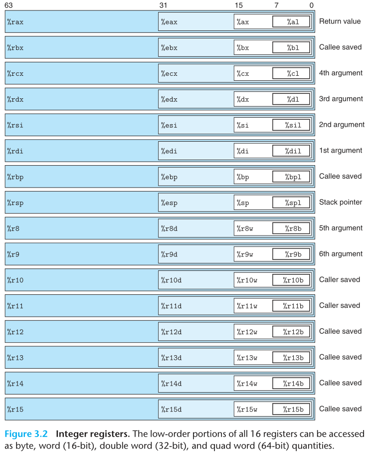
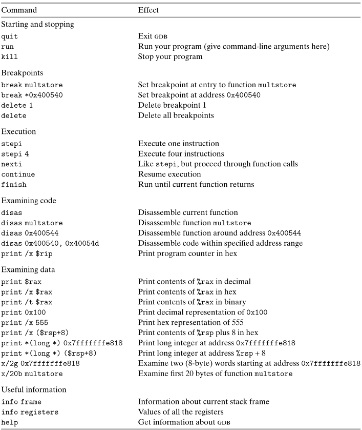

layout: post
title: （近期不更新）csapp学习笔记
author: junyu33
mathjax: false
tags: 

categories:

  - 笔记

date: 2022-1-15 22:30:00

---

（本文汇编代码统一采用AT&T语法）

> 友情提示：
>
> 看这本书，笔记、习题、实验三者缺一不可。
>
> 如果你觉得中文翻译质量欠佳，想选择英文原版阅读，那么千万不要选择Global Edition！因为Global Edition的习题环节错误百出，有许多题答案根本无法与题目相对应，严重影响阅读体验和对知识的理解！（我就是白嫖了github上面的免费资源，虽然不是影印版，而且正文质量很高，但习题这个问题就可以盖过其他所有优点）。我现在不得不边看英文原文边做中文版本上的习题(lll￢ω￢)

<!-- more -->

# 计算机系统漫游

一个接下所有章节的outline，~~可以作为计算机系统导论的复习材料。~~

# 信息的表示和处理

之前草草看过一遍，没做题，现在都搞不清楚浮点数的**最小/最大非规格化数**和**最小/最大规格化数**是怎么算出来的。

有空再填坑。

# 程序的机器级表示

## 历史观点

讲了一下Intel处理器的历史，顺便提了一下SSE和AVX指令集（我觉得自己将来都要学的，又要开始秃头了(lll￢ω￢)

## 程序编码

如何在linux环境下查看gcc编译的AT&T格式的汇编代码。（其实gdb提供了变更格式为intel的操作）

## 数据格式

- char
- short
- int
- long（即long long，下同）
- float
- double
- 指针（本书是64位环境，所有指针均为8字节）

## 访问信息

各种寄存器（rax~rdx，rsi，rdi，rbp，rsp，r8~r15，及对应的32位、16位、8位版本）及**约定俗成的**用法见下图。



mov指令（movq、movl、movw、movb、movzbw、movsbq等，后两者是类型强转）。

## 算术和逻辑操作

lea——取地址，外加简单算术指令，类似于a+b\*c的形式（表示字节数的q、l、w、b字母省略，下同）

sf、zf、pf、cf、af、of——各种标志符(flag)

add、sub、(i)mul、(i)div、shl(sal)、shr、sar——改变flag状态

inc、dec——不改变flag状态

cqto——64位转128位，做128位除法有用

## 控制

if、switch、while、do-while、for的汇编实现，这部分作业错误尤其多。

由于cpu具有分支预测的功能（部分语句准确率可达90%），简单if语句会预先计算两种分支之后寄存器的变化，以提高cpu的运行速度。

对于多分支、取值接近的switch语句，编译器会构造跳表来代替各种jz、jbe等判断语句，以提高代码执行效率，因为跳表的执行速度不受分支个数的影响。

## 过程 

再一次复习堆栈调用的汇编实现，将一个栈帧的各个部分（return address, saved registers, local variables, argument build area）都讲到了，很细致。

64位寄存器传参的顺序为`%rdi`,`%rsi`,`%rdx`,`%rcx`,`%r8`,`%r9`.

## 数组分配和访问

lea指令的作用就是专门为访问数组设计的。

虽然编译器更喜欢使用指针遍历数组，加上一个固定的值。即使是多维数组遍历，也尽量不用我们数据结构课学到的i\*Wid+j这个公式——毕竟乘法太费时间了。

## 异数的数据结构——1/15/2022

讲了struct、union和空间对齐。

**union中的大小是其中最大数据类型的大小。**

使用union可以强转数据类型（比如说把double转成unsigned long）。

结构体中的每一项数据的地址都必须是其类型大小的整数倍。

## 在机器级程序中将控制与数据结合起来——1/16/2022

指针与地址运算的优先级——判断以下程序的输出结果：

```C
#include<stdio.h>
int arr[20]={10,9,8,7,6,5,4,3,2,1,5};
int main()
{
	int *p=&arr;
	*(p+8)+=9;
	int m=*((char*)p+8);
	int n=*((char*)(p+8));
	printf("%d %d",m,n);
	return 0;
}
```

答案是```8 11```.

int (\*p)(int, \*int)——函数指针，用```p = fun```调用，用```res = p(int, &int)```返回int。

int \*p(int, \*int)——指针函数，返回一个int\*指针。

gdb的各种调试命令（对于安了peda的人，就b、si、ni、x/s、x/wx可能有点用，因为peda把寄存器、汇编、堆栈啥都给你显示完了）：



> 习题3.46的**正文**错误：
>
> global edition: ```get_line``` is called with the return address equal to ~~0x400776~~ 0x400076.
>
> Chinese edition: 字符 0~9 的 ASCII 码是 ~~0x3~0x39~~ 0x30~0x39.

在堆栈图中，地址从下到上，从右到左逐渐增大。因此对于一个dword(qword)，数据的储存方式是从左到右（小端序）；而单个字节的储存方式是从右到左。

> 疑问：
>
> D题中，当```get_line```函数返回时，损毁的寄存器应该还有%rip，而不只是答案所说的%rbx.

防止栈溢出的三种主要方式：地址空间随机化（ASLR）、栈保护（canary）和内存不可执行（NX）。

对长度可变栈的汇编支持——栈底指针rbp：

```assembly
pushq %rbp
movq %rsp, %rbp
;procedure in the function
leave 
;movq %rbp, %rsp
;popq %rbp
ret
```

~~书上说最近的编译器取消了使用栈底指针的惯例~~实际上，我用最新的编译器，随便写个hello world都会使用栈底指针，这个惯例依旧保持着。

> 疑问：
>
> 课后习题的B题为什么s2舍入到“最近的8的倍数”，D题为什么“保留s1的偏移量为最近的16的倍数”？

## 浮点代码——1/19/2022

寄存器：

%ymm0~%ymm15是256位的浮点寄存器。

%xmm0~%xmm15是128位的浮点寄存器，处于ymm的低128位。

前8个寄存器可视为函数参数（特别地，%xmm0为**约定俗成**的返回值，类似于%rax），后8个由调用者保存。

在内存与寄存器中移动浮点数：

movss：移动float（从%xmm移动到一段32位的内存区域，或反之）

movsd：移动double（从%xmm移动到一段64位的内存区域，或反之）

在寄存器间移动：

movaps：打包移动float

movapd：打包移动double

**与整型寄存器类似，不能将一个内存的值直接移到另一个内存**。


浮点与整型的转换（src也可以为mem，此处省去）：

| (src type)\\(dst type) | int                  | long                  | float                | double               |
| ---------------------- | -------------------- | --------------------- | -------------------- | -------------------- |
| int                    | \\                   | cltq                  | cvtsi2ssl %eax %xmm0 | cvtsi2sdl %eax %xmm0 |
| long                   | %eax                 | \\                    | cvtsi2ssq %rax %xmm0 | cvtsi2sdq %rax %xmm0 |
| float                  | cvttss2si %xmm0 %eax | cvttss2siq %xmm0 %rax | \\                   | cvtss2sd mem %xmm0   |
| double                 | cvttsd2si %xmm0 %eax | cvttsd2siq %xmm0 %rax | cvtsd2ss mem %xmm0   | \\                   |

> 此处csapp的指令与现行编译器的汇编语法产生了较大分歧，该表以现行标准为准。现列出以下不同点：
>
> 1. csapp中所有的浮点指令前面都加了字母“v”，目前gcc（mingw 10.3）已经弃用。int转float和double指令后面的“l”是以前没有的。
> 2. 与csapp不同，目前带有三个参数的浮点指令已经不复存在。
> 3. 与csapp中**生僻**的float~double自转指令（vunpcklps、vcvtps2pd、vmovddup、vcvtpd2psx）不同，gcc先把寄存器的值拷贝到内存，再使用cvt指令。 

浮点运算符：略，汇编语句肉眼可见。

浮点中的位运算：只针对操作数均位于寄存器内部。

浮点运算中的立即数：预先以IEEE标准存放在内存里，参与运算时再复制到%xmm寄存器。

浮点比较指令：

comiss：float比较。

comisd：double比较。

比较时会设置3种标识符：CF、ZF、PF。其中PF=1当且仅当两个操作数任意一个是NaN，此时结果会为Unordered.

（课后习题虽好，可惜不能对答案，算了不做了。）

## 小结——1/22/2022

**x86汇编终于学完了，✿✿ヽ(ﾟ▽ﾟ)ノ✿完结撒花！**
