layout: post

title: 数据库学习笔记

author: junyu33

tags: 

categories: 

- 笔记

date: 2022-3-25 12:00:00

---

数据库其实不难学，就是头有点凉。

<!-- more -->

# 概念逻辑转化规律——week5~8

重点——**relationship**

## 1.*

### S-S

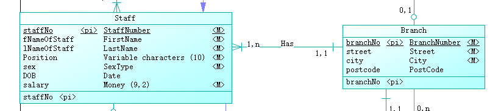

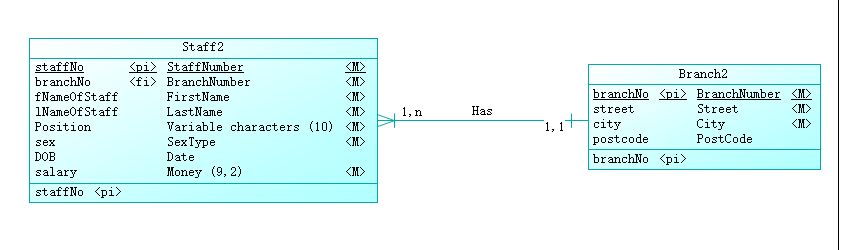

主关键字做了外部关键字

1的主关键字移向了n

#### 有属性

**如果有属性，属性去掉后基数交换，再依照上述规则处理**

> 概念模型建模的时候注意：先画概念模型的1*

### S-W

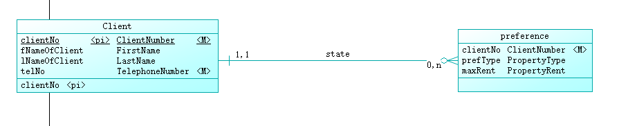

弱实体没有主关键字，不能移向强实体

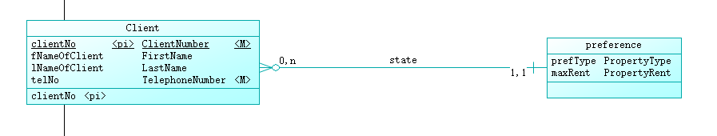

> 1：\* 二元 S——W
> 1——>\* 主关键字——>主关键字+外部关键字
>
> from our teacher

#### 有属性

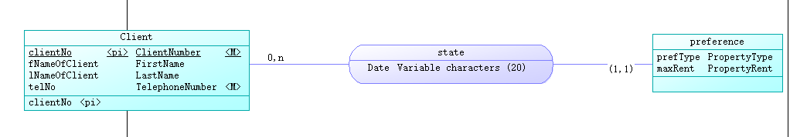

括号表示preference是弱实体。

**此时生成逻辑模型出错**

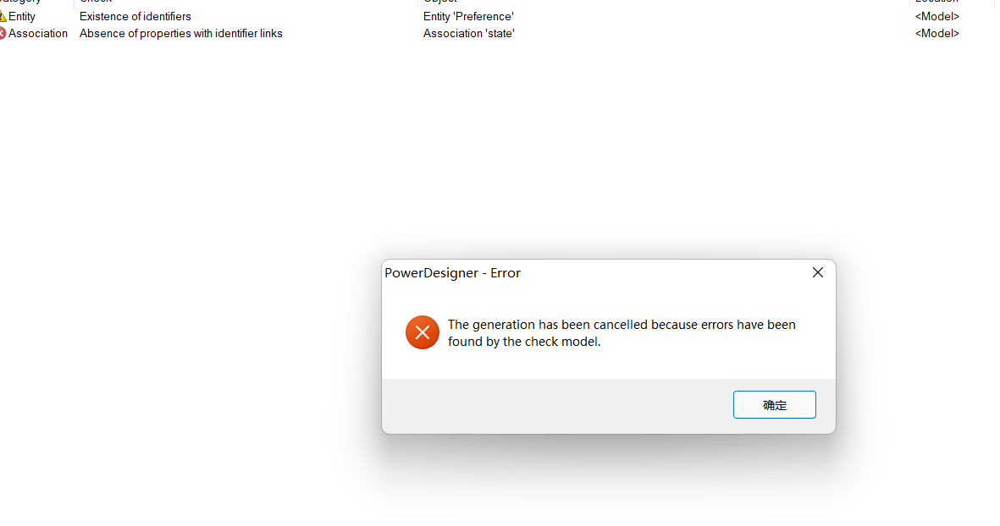

把关系的属性移入依赖的弱实体

(这里的Relationship_2应是state，而preference中的state项应为Date项)

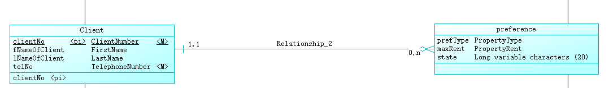

再依照之前的规律转换

## 1.1

### S-S

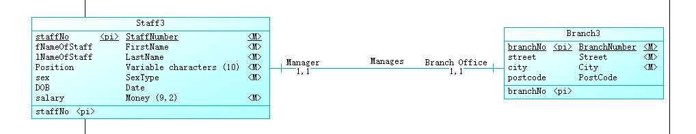

双方强制参与会报警，根据业务将其中一方改为0-1。

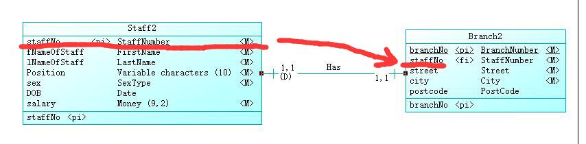

被支配方会出现支配方外部关键字。

此时为了外部关键字移入右边，应该将右边改为0-1。

> 同理，对于1-1和0-1，也等同与将左边设为支配方的情况。

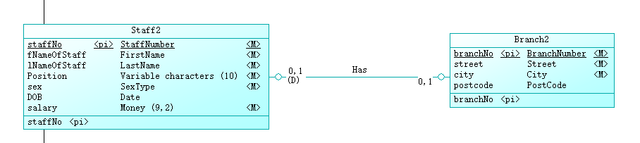

对于双方都是0-1的情况，被支配的对象是人更少的一方。

### S-W

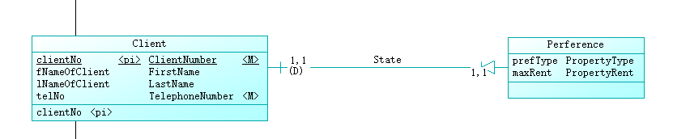

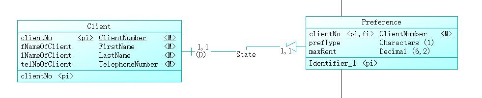

弱实体将强实体作为主关键字和外部关键字。

双方强制参与会报警，有两种解决方式。一是将被支配方改为0-1，二是将弱实体与强实体直接合并。

### 有属性

#### 1-1,0-1：

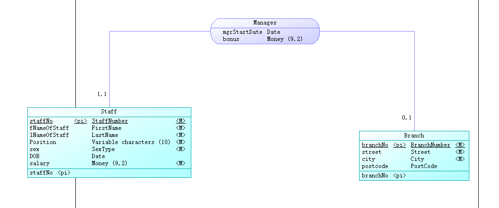

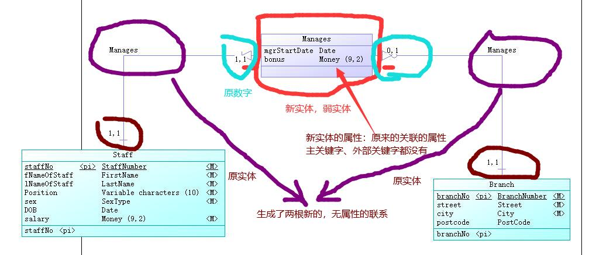

此时可能出现新的双向联系警告，按照无属性的方法处理即可。

我们将Manages和Staff合并，此时支配者在Branch（图略），生成物理模型：

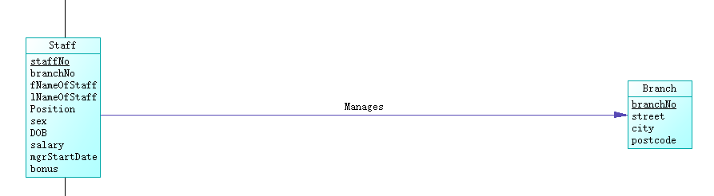

#### 1-1,1-1：

双向关联限制，修改1-1,0-1，等同于此种情况的处理方式。

#### 0-1,0-1：

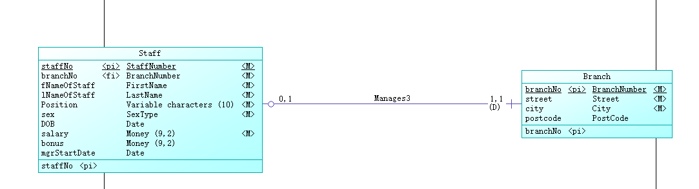

哪边更接近1-1（人少），将那边和新实体合并，原实体作为支配者。

## \*.\*

### 强实体无属性

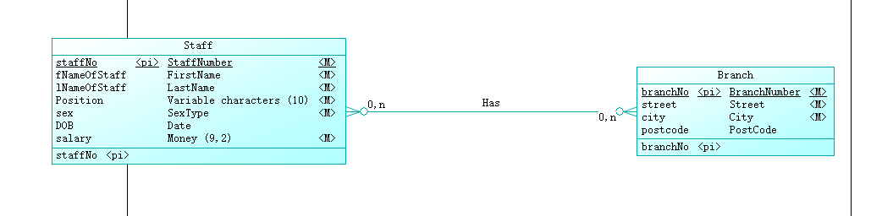

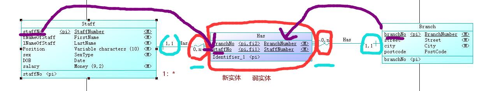

> 一个*:*变成了两个1：*
>
> 生成了新实体，弱实体
>
> 两边原实体的主关键字——>新实体：主关键字+外部关键字（1的主关键字移向了n成为外部关键字）

### 强实体有属性

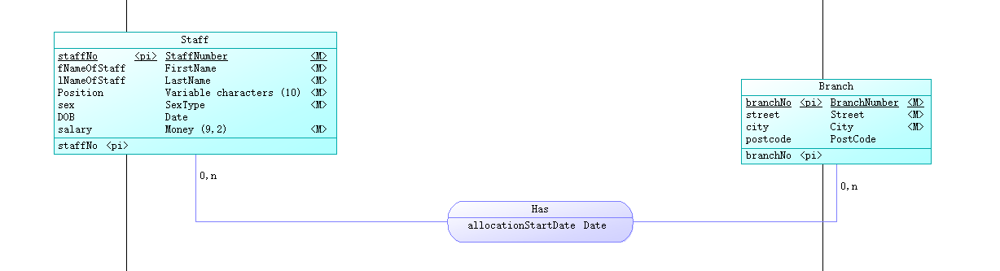

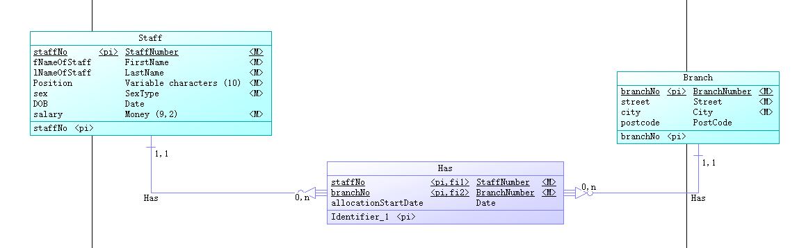

比无属性多了关联本身的属性，其他没什么区别。

### S-W设不起。

解决warning的办法：

1. 无属性，将其中一个\*改成1。
2. 有属性，将一个联系与弱实体合并，变成1.*关系。

## 递归

### 1.*

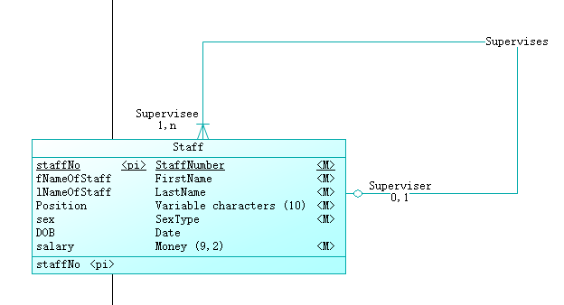

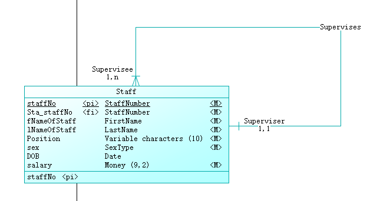

逻辑模型多了实体本身的外部关键字，也可以理解为1移到多。

0-1,1-\*没有问题。0-1,0-\*没有问题。

**1-1,1-*会有自反强制warning。**

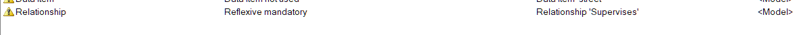

### 1.1

注意设置支配角色，其余规律与1.\*相同。

**只有0-1,0-1不会warning。**

### \*.\*

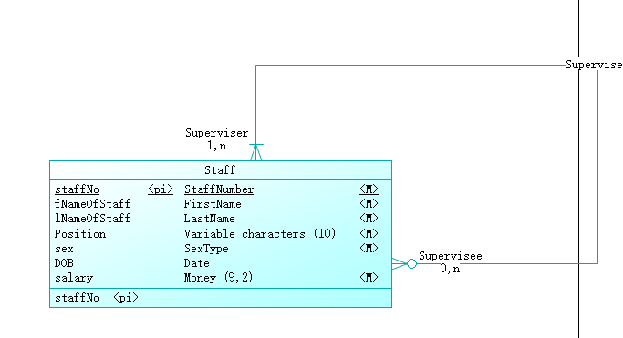

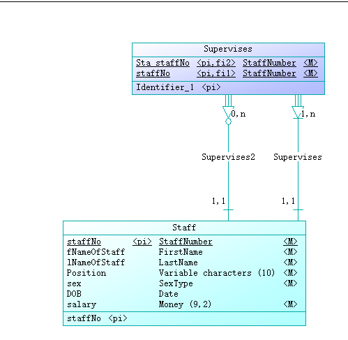

与二元\*.\*情况类似，注意重命名。

各类\*.\*不会warning。

## 多元联系

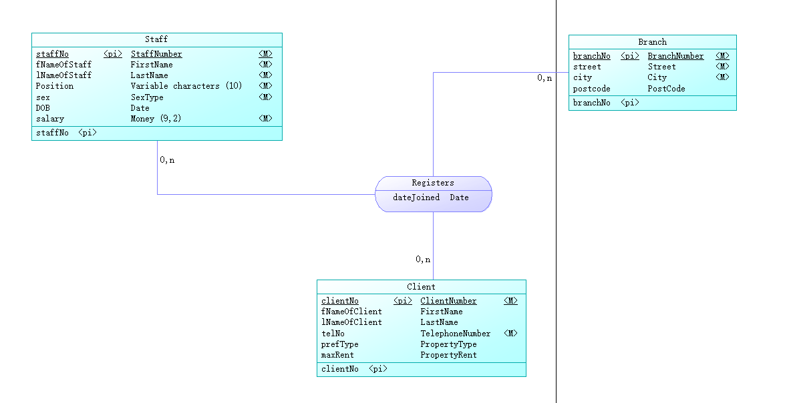

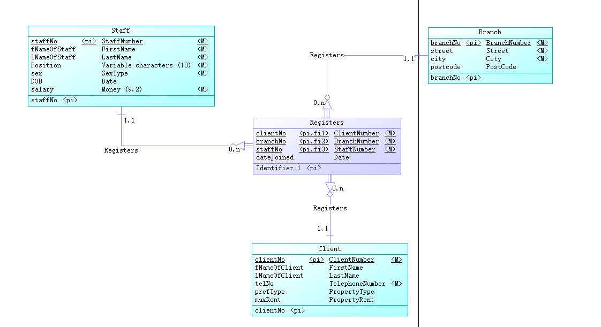

注意基数必须是n，参与性对其没什么影响。

如果基数是1会有warning：

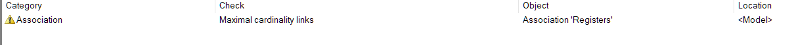

### 子类合并的四种情况


设A是父类，BC是子类。

### 强制不相交

没有必要建立A，将A的属性继承给B和C即可。

### 可选不相交

B和C不能与A建立联系（保留超子类关系）。将A与D建立联系；将B、C和D建立联系，或者各自与其他实体分别建立联系。

### 强制非不相交

将BC合并，再与A合并。

### 可选非不相交

将BC合并，B+C不能和A建立联系（保留超子类关系）。将A与D建立联系，将B+C与D或者与其他实体建立联系。


## 超子类

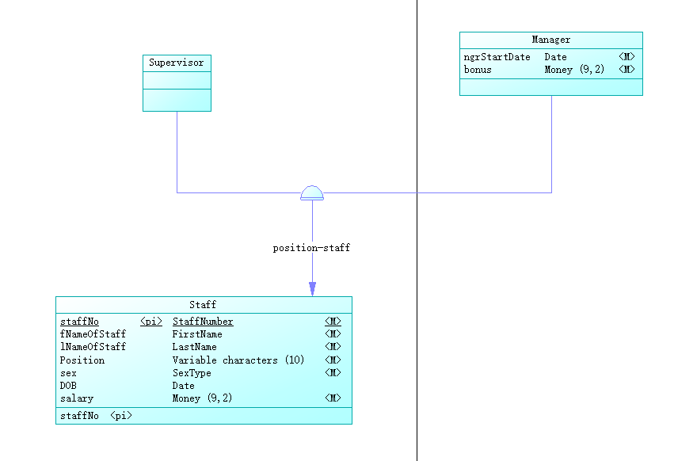

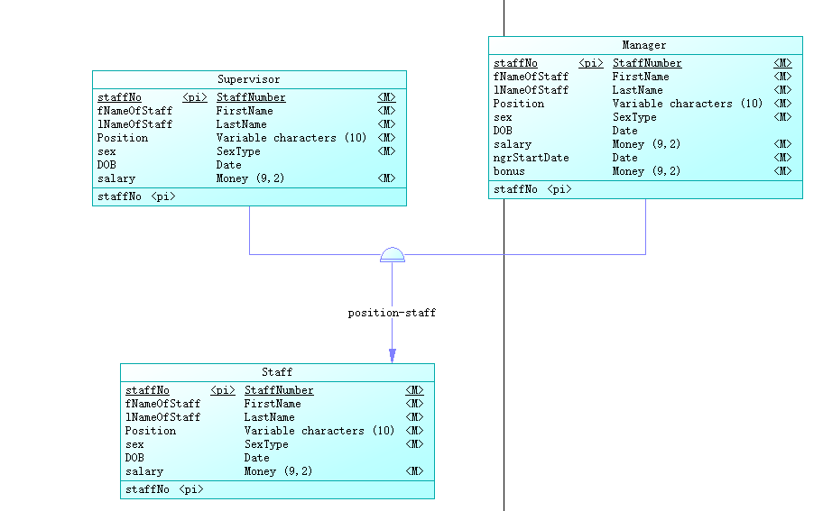

子类继承了父类的属性。四种强制/相交关系均无区别。

## 多值属性

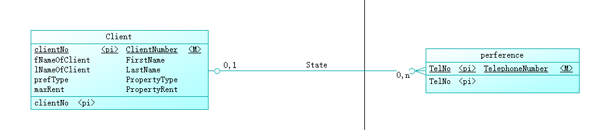

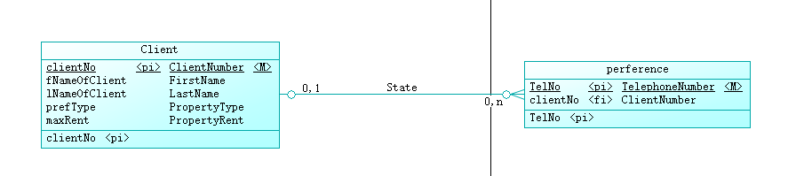

> 建立新实体，强实体，分离出多值属性，和原实体建立1.\*关系。

# 规范化——week9~10

> 云上课太™酸爽了。

以这个表作为例子：

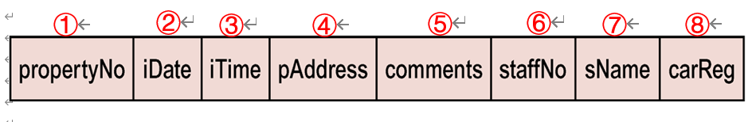

## 首先做一堆假设导出关系

- 员工的编号对应唯一姓名: ⑥ -> ⑦
- 房产编号对应唯一地址: ① -> ④
- 一名员工一天只可用一辆车: ②⑥ -> ⑧
- 一套房子一天只能被看一次: ①② -> ③⑤⑥
- 同日期、时间，一辆车只可被一名员工用: ②③⑧ -> ⑥
- 同日期、时间，一名员工只可看一处房产: ②③⑥ -> ①⑤

## 然后开始组合

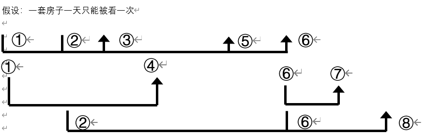

可得①② -> 全部

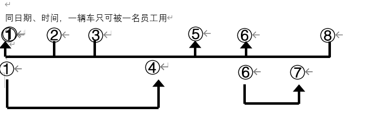

可得②③⑧ -> 全部

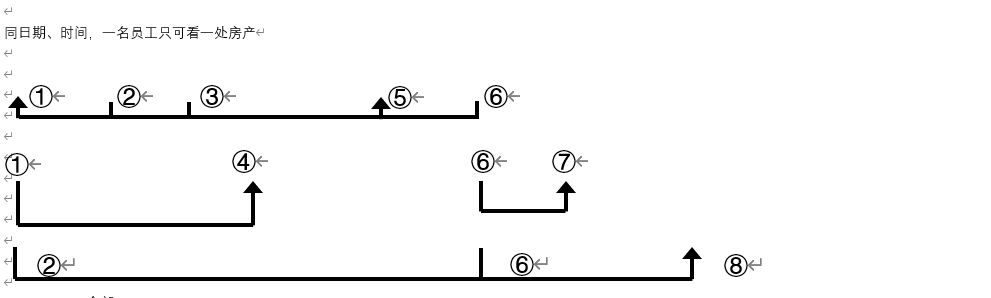

可得②③⑥ -> 全部

综上得到：

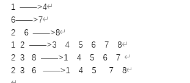

## 去除依赖

后三行可以导出所有信息，因此这三组都是**候选关键字**。同时将①②作为主关键字。

①② -> ④且① -> ④，因此① -> ④是**部分依赖**。

②③⑧ -> ⑥且②③⑧ -> ⑦，因此⑥ -> ⑦，是**传递依赖**（同时也是部分依赖）。

②⑥ -> ⑧是**决定方不是关键字的依赖**（同时也是部分依赖）。

## 导出最终表

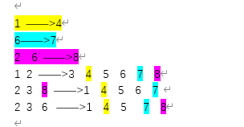

①④为一个表，⑥⑦为一个表，②⑥⑧为一个表，剩下①②③⑤⑥为一个表。


# 数据库系统与sql——week10~13

## 创建

### 创建数据类型

```sql
create type BranchNumber
   from varchar(20)
go
```

### 创建默认值

```sql
create default D_B001
    as 'B001'
go
```

### 将默认值与列绑定

```sql
execute sp_bindefault D_B001, BranchNumber
go
```

### 创建规则

```sql
create rule R_SexType as
      @column in ('F','M')
go
```

### 将规则与列绑定

```sql
execute sp_bindrule R_SexType, SexType
go
```

### 创建表

```sql
create table Staff (
   staffNo              StaffNumber          not null,
   branchNo             BranchNumber         not null,
   Sup_staffNo          varchar(5)           null,
   fNameOfStaff         FirstName            not null,
   lNameOfStaff         LastName             not null,
   Position             varchar(10)          not null,
   sex                  SexType              not null           D_M            R_SexType,
   DOB                  datetime             null,
   salary               money                not null,
   constraint PK_STAFF primary key nonclustered (staffNo)
)# column name          datatype             null/not null      default val    rule  
go
```


## 查询

### 结果去重

```sql
select DISTINCT propertyNo
from Viewing
```

结果去重会影响基数、平均值与总数，对最小最大值无影响。

### 范围问题

 ```sql
 select *
 from Staff
 where salary between 5000 and 9000
 # 值为5000或者9000也会列入查询结果中
 ```

### 通配符查找

```sql
select *
from PrivateOwner
where address like '%St%'
# %类似于正则表达式的通配符'*'，查找包含'St'的字符串
```

### 排序

```sql
select *
from PropertyForRent
order by type, rent desc
```

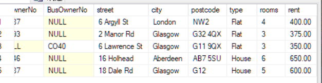

先优先按照字母序对type排序，然后type相同，按从大到小排列rent。

### 分组

```sql
select branchNo,
COUNT(staffNo) as myCount,
SUM(salary) as mySum
from Staff
group by branchNo
order by AVG(salary)
# 求各个分公司的人数和总收入，并按照平均工资排序
```

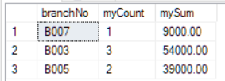

此时删去`group by branchNo`列报错。应作以下修改：

```sql
select 
COUNT(staffNo) as myCount,
SUM(salary) as mySum
from Staff
# 求整个公司的人数和总收入
```

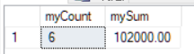

### 相关子查询

```sql
select *
from Staff
where salary>(select AVG(salary) from Staff)
# 查询拉高平均工资的人，不能写成 salary>AVG(salary)
```

```sql
select *
from Staff S1
where salary>(select AVG(salary) from Staff S2 
where S1.branchNo=S2.branchNo)
# 查询每个分公司中，拉高平均工资的人
```


### 内、左、右、全连接 Inner/Left/Right/Full join 

```sql
select *
from Staff,Branch
where Staff.branchNo=Branch.branchNo
and street='163 Main St'
# 两表的数据合并到了一个结果，以相同的分公司信息和特定的街道连接。

select *
from Branch b left join PropertyForRent p
on p.city=b.city
# 保留左表数据，右边对应不上的填null

select *
from Branch b right join PropertyForRent p
on p.city=b.city
# 保留右表数据，左边对应不上的填null

select *
from Branch b full join PropertyForRent p
on p.city=b.city
# 两边都保留，两边对应不上的分别填null
```


### 表间查询

```sql
select *
from Registers
where staffNo in
	(select staffNo
	 from Staff
	 where branchNo = 
		(select branchNo
		 from Branch
		 where street = '163 Main St'))
# 查询分公司在这个街道的所有职员的注册信息

select distinct clientNo
from Viewing v1
where NOT EXISTS
    (select *
 	from PropertyForRent P
 	where rooms=3 and NOT EXISTS
 		(select * 
 		from Viewing v2
		where v2.clientNo=v1.clientNo and v2.propertyNo=p.propertyNo))
# 好家伙 （不存在套3的房子是他没看的，即找看完所有套3的人）
```

```sql
select distinct clientNo
from Viewing v1
where EXISTS
    (select *
 	from PropertyForRent P
 	where rooms=3 and EXISTS
 		(select * 
 		from Viewing v2
		where v2.clientNo=v1.clientNo and v2.propertyNo=p.propertyNo))
# 找看过任何套三的人

select distinct clientNo
from Viewing v1
where propertyNo IN
    (select propertyNo
 	from PropertyForRent
 	where rooms=3)
# 使用IN语句的写法，与上述等同 
```

### 集合操作

```sql
(select * from Branch)
 union
(select * from PropertyForRent)
# 并

(select * from Branch)
 intersect
(select * from PropertyForRent)
# 交

(select * from Branch)
 except
(select * from PropertyForRent)
# 差

select distinct clientNo
from Viewing v1
where NOT EXISTS
    ((select propertyNo
 	from PropertyForRent P
 	where rooms=3)
 	except
 	(select propertyNo
 	from Viewing v2
	where v2.clientNo=v1.clientNo))
# 找看完所有套三的人的另一种写法
```


### some/any/all

```sql
select *
from Staff
where salary > any
	(select salary
	 from Staff
	 where branchNo = 'B003')
# 此处填some/any效果相同，select salary和select MIN(salary)效果也相同

select *
from Staff
where salary > all
	(select max(salary)
	 from Staff
	 where branchNo = 'B003')
# 此处select salary和select MAX(salary)效果也相同
```

## 视图——week13

### 创建视图

```sql
create view StaffPropCnt(branchNo,staffNo,cnt)
as 
select s.branchNo,s.staffNo,COUNT(*)
from Staff s, PropertyForRent p
where s.staffNo = p.staffNo
group by s.branchNo,s.staffNo
```

### 查询视图

```sql
# 视图可以当成一张表进行进一步查询
select staffNo, cnt
From StaffPropCnt
where branchNo='B003'
order by staffNo

# 等同于
select s.staffNo as staffNo, COUNT(*) as cnt
from Staff s, PropertyForRent p
where s.staffNo = p.staffNo and s.branchNo = 'B003'
group by s.branchNo,s.staffNo
```

### 视图修改

```sql
insert into StaffPropCnt
values('B003','SG5',2)
# 报错，更改视图不能更改视图来源的表（信息量过小）。
```

### 创建角色

```sql
create role Manager
```

### 授予权限

```sql
grant select, insert, update, delete, references, alter
on Staff
to Manager
with grant option
```

### 撤回权限

```sql
revoke references 
on Staff
from Manager 
cascade
```

## 事务并发——week14

### 串行化

对不同线程的同一事务的**读写**和**写写**会有冲突。

把每一个线程作为一个点，对同一事务不同线程的**读写**和**写写**进行加**有向**边，如果生成图无环，代表并行调度**冲突**可串行化。

~~对视图的调度属于NP完全问题，不可解。~~

### 加锁

读锁/共享锁/`read_lock`：自己别人可以读，自己别人不能改。

写锁/互斥锁/`write_lock`：自己可以读和改，别人不能读和改。

如果别人加了共享锁，你只能加共享锁；如果别人加了互斥锁，你什么也不能加。

通过二段锁可以避免**丢失更新、未提交依赖、不一致分析**问题。

缺点有：

- **级联回滚**——解决方法有在事务的结尾释放锁，或者在事务的结尾释放互斥锁。
- **死锁**——解决方法有锁超时、wait-die & wound-wait、时间戳排序

> 托马斯写规则：
>
> A先写，然后B再读，A回滚，时间戳移到B之后。
>
> A先写，然后B再写，A的写就废除。

锁释放之前要确保加好所有的锁。

### 乐观检查机制

只对事务结束的时候进行冲突检查，可提高并发性。

### 数据粒度

粒度越细，并发度越高，但是加锁的信息也越多，反之亦然。

### 意向锁？

不管。

# 安全——week16

这个得靠自己。

## 风险原因

- 硬件故障
- DBMS安全机制失效
- 数据库超出授权的范围、修改
- 数据库管理员安全策略或过程不完备
- 程序员制造“陷阱门”，程序变更或者员工安全方面训练不足
- 用户用他人身份访问泄露数据，黑客侵入敲诈勒索，病毒入侵等

## 数据库防护措施

- 授权访问控制
- 视图
- 备份恢复
- 完整性
- 加密（对称、非对称）
- RAID技术

## DBMS和网络安全防护措施

- 代理服务器
- 防火墙
- Kerberos
- 报文摘要算法和数字签名
- 数字证书
- 安全电子交易和安全交易技术
- 安全套接字层和安全HTTP
- Java安全
- ActiveX安全
