layout: post
title: （近期不更新）《加密与解密》学习笔记
author: junyu33
mathjax: true
tags: 

- assembly
- reverse
- pwn

categories:

  - 笔记

date: 2022-1-15 23:30:00

---

与csapp相比，《加密与解密》更偏向于实践一点，内容丰富但比较杂。汇编代码语法与csapp不同，采用intel语法。

<!-- more -->

# 基础知识

诸如API、Unicode、Little-endian之类的介绍，此处略去。

（但是Win32 API和WOW64放到这一段就很劝退，算了还是将来用到再查文档吧——）

# 动态分析技术

- OllyDbg

  （学了硬件断点、消息断点、条件断点、内存断点，还有trace功能）

- x64dbg

- ~~MDebug~~

- ~~WinDbg~~

# 静态分析技术

- PEiD/ExeinfoPE

- ~~ODDisasm、BeaEngine、Udis86、Capstone、AsmJit、Keystone~~

- IDA yyds!

  （IDA提供了一项我以前并不知道的功能，就是在系统API处按下F1键会弹出该API的用法，然而这个功能只支持.hlp文件，所以它并没有什么用）

- WinHex/010editor

# 逆向分析技术

## 32位软件逆向技术

### 启动函数

~~WinAPI集中区域，看不懂直接跳。~~

### 函数

第N次复习栈调用的机会。

常见的调用约定（VARARG指参数的个数不确定）：

| 约定类型       | __cdecl | pascal | stdcall | Fastcall    |
| -------------- | ------- | ------ | ------- | ----------- |
| 参数传递顺序   | ←       | →      | ←       | reg & stack |
| 平衡栈者       | caller  | callee | callee  | callee      |
| 允许使用VARARG | √       | ×      | √(①)    |             |

> ①：仅当平衡栈者为caller时适用。

### 数据结构

局部变量：使用栈存放。

全局变量：.data区段 / cs:xxxx

数组：基址加变址寻址。~~为了看懂数组的汇编代码，狂补csapp的相应章节~~。

### 虚函数——1/15/2022

引用虚函数：先用指针（通常由new或malloc分配）指向虚函数表（VTBL），该表存放着所有虚函数的**地址**，再使用虚函数表指针（VPTR）调用函数。

**根据虚表可以还原这个类的虚函数个数，及虚函数代码。**

> 疑问：汇编代码中0040101B地址，为什么`eax=*VTBL=**Add()`，而不是`eax=*VTBL=&Add()`？

### 控制语句——1/17/2022

（大多数都在csapp讲过了，没什么特别重要的点）

`a & (-b)`且b是2的幂，等价于$\lfloor \frac{a}{b} \rfloor * b$

`sbb A B`指令：`A = A - B - CF`

### 循环语句——1/23/2022

与csapp的讲述相同，本质就是高地址向低地址的跳转。

> 更正：
>
> 1. 两个方案的`i < 5`应改为`i <= 5`。
>
> 2. 未优化代码中0x40102E处的注释应是“由高地址向低地址区域”。

### 数学运算符——1/23/2022

加减法使用lea指令加速运算。

乘法使用位移指令加速。

除法在除数已知的情况下会乘一个常数（类似于逆元），取结果的高位。特别的，如果除数是2的幂，那么直接右移即可。

如果结果是负数，值会+1（可能与负数的向0舍入有关）。

### 文本字符串——1/23/2022

目前惯用的C字符串结尾为`'\0'`。其余字符串为DOS字符串（结尾为`$`）、PASCAL字符串（单字节开头的ANSI字符表示长度）和Delphi字符串（双字节或四字节）。

如果出现`mov ecx, FFFFFFFF`一句，代表程序很有可能获取字符串的长度，汇编代码如下。

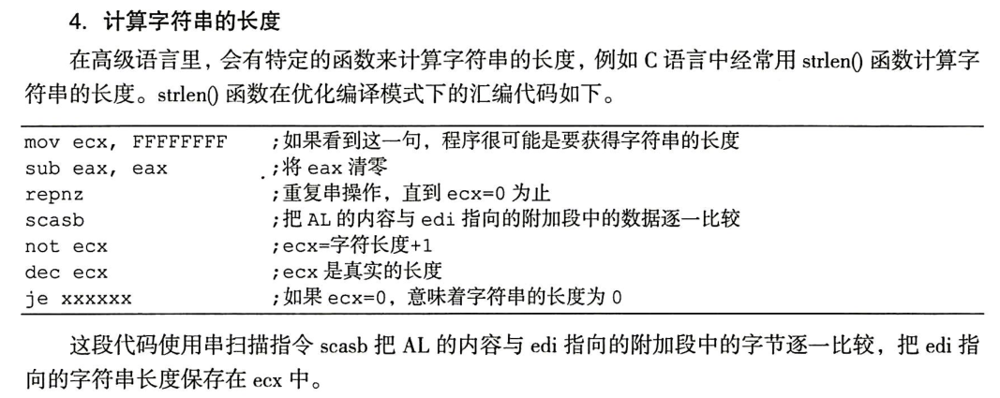

### 指令修改技巧——1/24/2022

感觉没什么好说的，直接贴图总结吧。

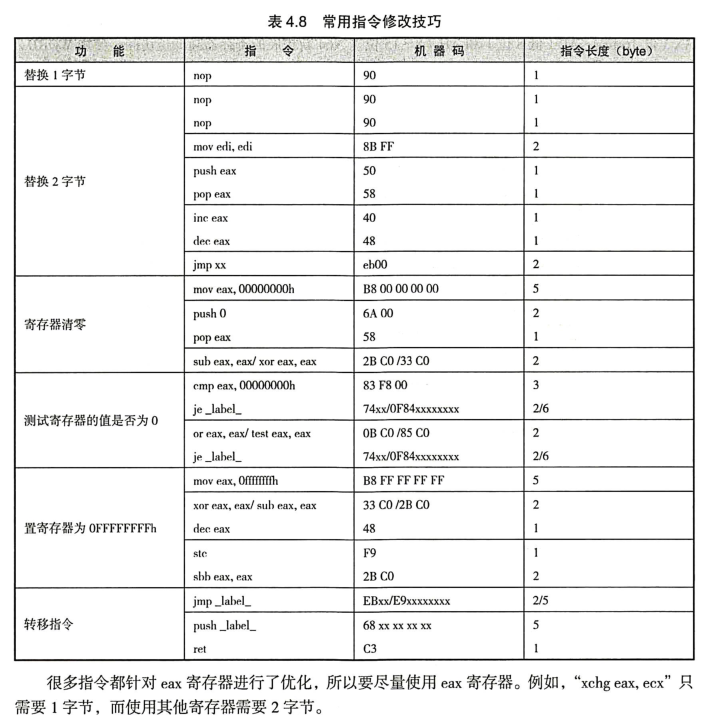

## 64位软件逆向技术——1/24/2022

### 寄存器~循环语句 

- 调用约定只有一种，规则如下（又跟csapp不一样可还行）：
   - 前四个参数用寄存器，剩下入栈。
   - 寄存器使用顺序为rcx、rdx、r8、r9（浮点为xmm0~xmm3）
   - 入栈参数顺序：从右到左。
   - 栈会为这四个参数预留32 byte的占空间，即使只传入了2个参数。
- rep指令：重复后一个参数的指令，同时ecx--，直到ecx--之后值为0结束。（因此当ecx为0时会执行$2^{32}$次）
- stos指令：将eax中的数据放入edi所指的内存地址中，同时edi+=4 byte。常与rep指令连用，用来将栈空间填充为0xcccccccc（烫烫烫）。
- movsb指令：将数据从 esi 指向的内存位置复制到 edi 指向的内存位置，同时这两个寄存器自动+=1 byte（因为后缀为'b'）。常与rep指令连用，用来复制拷贝数组、结构体等。
- 对于结构体传参，若结构体大小 <= 8 byte，那么直接使用寄存器传参。如果大于就传入结构体的地址，通过偏移来访问结构体内容。
- 类的成员调用传参会比普通函数多一个this指针。
>什么是\_\_security\_check\_cookie？
>
>通过在栈中未使用的空间中填入0xcc，并将该值与rsp指针异或，得到的值就是\_\_security\_check\_cookie。因为现在的程序开启了栈随机化的保护，使得cookie的值无法被预测，因此是一种有效防止栈溢出的方式。

> 这句话是什么意思？（P150）
>
> `mov     eax, ds:(jpt_140001060 - 140000000h)[rcx+rax*4]`
>
> 类似于`(a)[b+c*d]`的操作类似于AT&T语法中的`a(b,c,d)`，就是`b+c*d+a`的意思。这里实现了一个进入跳表的操作，为switch语句的分支跳转做准备。

- switch语句的优化除了跳表，还有判定树优化。
- 64位的call指令机器码为`FF 15 xx xx xx xx`，其中后四个byte为**相对偏移**，而不是内存地址。

### 数学运算符

- 除法的各种优化技巧
  - 对于除数为$2^n$的情况，公式为`x >> n`（被除数为正），和`(x + 2**n - 1) >> n`（被除数为负）.

  - 对于除数为$-2^n$的情况，与上述相同，只需结果取反即可。

  - 对于除数不为$2^n$的情况，有两种优化方式，这里以64位为例。
    - 其一是`x * c >> 64 >> n`（被除数为正），和`(x * c >> 64 >> n) + 1`（被除数为负）。其中c为正数，n可能为0。
    
    - 其二是`(x * c >> 64) + x >> n`（被除数为正），和`((x * c >> 64) + x >> n) + 1`（被除数为负）。其中c为负数。
    
    - 除数可以用$ o = \frac{2^{n+64}}{c} $计算，其中$c$为magic_num。
    
  > 对于公式二的略证（设$o$为除数）：
  >
  > $$ \frac{x*c+x*2^{64}}{2^{64+n}} = \frac{x}{o}$$
  >
  > $$ o = \frac{x*2^{64+n}}{x*c+x*2^{64}} $$
  >
  > $$ o = \frac{2^{64+n}}{c+2^{64}} $$
  >
  > 由于溢出，$$ o = \frac{2^{64+n}}{c} $$，即化归为公式一的情况，以下过程略。
  >
  > 
  >
  > Q：为什么要+x？
  >
  > ​        因为+x相当于c加上2^32。之前c是0x92492493，转成signed后是0x92492493-0x100000000，再加上2^32就是它本身了。如果不加这个x，得到的就是一个负数。

  - 对于除数不为$-2^n$的情况，公式与上述基本相同，只是第一个公式c为负数；第二个公式c为正数，且中间的“+”应改为“-”。其中，$$ |o| = \frac{2^{n+64}}{2^{64}-c} $$，$c$为magic_num。

  - 无符号除法时，对于除数为$2^n$的情况，公式为`x >> n`.

  - 无符号除法时，对于除数不为$2^n$，公式有两种：

    - 其一是`x * c >> 64 >> n`，其中$$ o = \frac{2^{64+n}}{c} $$。

    - 其二是`(x - (x * c >> 64) >> n1) + (x * c >> 64) >> n2`，其中，$$ o = \frac{2^{64+n1+n2}}{2^{64}+c} $$，$c$为magic_num。

   > 对于公式二的略证（设$o$为除数）：
   >
   > ~~这辈子都不可能证的。~~
   >
   > $$ \frac{\frac{x-\frac{x*c}{2^{64}}}{2^{n1}}+\frac{x*c}{2^{64}}}{2^{n2}} = \frac{x}{o}$$
   >
   > $$ \frac{x-\frac{x*c}{2^{64}}+2^{n1}*\frac{x*c}{2^{64}}}{2^{n1+n2}} = \frac{x}{o}$$
   >
   > $$ \frac{1-\frac{c}{2^{64}}+2^{n1}*\frac{c}{2^{64}}}{2^{n1+n2}} = \frac{1}{o}$$
   >
   > $$ o = \frac{2^{64+n1+n2}}{2^{64}-c+c*2^{n1}} = \frac{2^{n1+n2+64}}{c*(2^{n1}-1)+2^{64}}$$
   >
   > 所以，书上公式二给出的$$ o = \frac{2^{64+n1+n2}}{2^{64}+c} $$是错误的，它仅仅符合$n1 = 1$的情况。下方的链接也说明我的公式的正确性。 
   >
   > https://zneak.github.io/fcd/2017/02/19/divisions.html

- 取模的一点优化技巧

  >声明：在C语言中，取模结果的符号与被除数符号相同，而且其值与两个参数都为正数的结果相同，这一点与python有所区别。
  >
  >如分别计算` 5 % 3`、`(-5) % 3`、`5 % (-3)`、`(-5) % (-3)`的值，C得到的结果是`2 -2 2 -2`，而python则是`2 1 -1 -2`.

  - 除数为$2^n$的情况，有两种优化方式：

    - 其一是`x & ((1 << n) - 1)`（当被除数为正时）和`((x & ((1 << n) - 1)) - 1 | (~ ((1 << n) - 1))) + 1`（当被除数为负时）。在这里，先减一后加一是为了处理余数为0的特殊情况。

    - 当被除数为负时，还有一种优化公式为`((x + ((1 << n) - 1)) & ((1 << n) - 1)) - ((1 << n) - 1)`。（经编者测试，编译器基本都是使用了这个公式进行优化）

  >对于两个公式的合理性说明：
  >
  >公式一：
  >
  >C处理负数取模跟处理正数取模恰好相反，直接在前$64 - n$位全部置为1即可。
  >
  >因此`| (~ ((1 << n) - 1))`就是做的这件事。
  >
  >其实前面那个`& (~ ((1 << n) - 1))`完全可以舍去，但是为了减少判断，就与正数的情况统一了。
  >
  >当$x$的后$n$位为$0$时，如果仍按照负数处理，在前$64 - n$位全部置为$1$，那么得到的结果就是$-2^n$.
  >
  >通过减$1$，将$x$的后$n$位都置为$1$，之后前$64 - n$位置为$1$后再加一，答案就是$0$了。
  >
  >一般地，设你开始减掉了$a$，那么最后模的范围就是$(-4 + a)$ ~ $(-1 + a)$.
  >
  >公式二：
  >
  >以$ n = 2 $为例：
  >
  >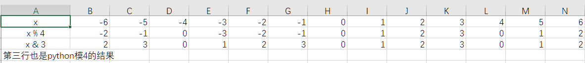
  >
  >观察可知，当`x < 0`时，第二行中的第$c$列元素，是第三行中第$c+3$列元素减$3$的值，故由此推广可得出上述公式。

  - 除数不为$2^n$的情况时，优化方式为`x - x / c * c`，其中$c$为除数。

### 虚函数

- 对析构函数虚拟化，在编译器中会生成一个普通析构函数，和在虚表里带delete的析构函数。

- 为了防止虚析构函数对空间重复释放，VC++的做法是给析构函数增加一个参数（参数为1就释放），而gcc的做法是在虚表里放两个析构函数的地址。

- 单个对象的内存布局：

  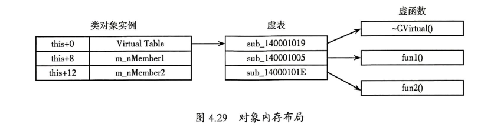

- 构造函数的调用顺序（**可作为还原类继承层次的一个依据**）：

  1. 调用虚基类构造函数（多个按继承顺序调用）。
  2. 调用普通基类构造函数（多个按继承顺序调用）。
  3. 调用对象成员的构造函数（多个按定义顺序调用）。
  4. 调用派生构造函数。

- 析构函数的调用顺序则反之。

- 派生类的虚表填充过程**（可作为还原类继承层次的一个依据）**：

  1. 复制基类的虚表。
  2. 如果派生类虚函数有覆盖基类的虚函数，使用派生类的虚函数地址覆盖对应表项。
  3. 如果派生类有新增的虚函数，将其放在虚表后面。

- 单重继承对象内存布局：

  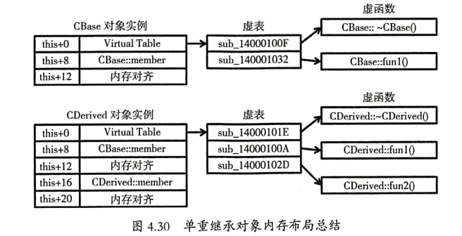

- 多重继承的特点是构造函数会有**两次构造初始化虚表**的操作。

- 多重继承对象内存布局：

  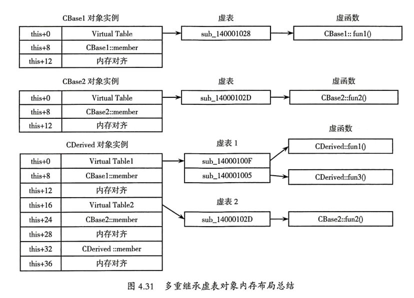

- 菱形继承为了防止base类的内存冗余，会使用虚继承(virtual public: \<class name\>)。具体实现方式是在构造函数中**多传入一个参数**，用来表示是否调用虚基类的构造。

- 为了方便定位虚基类在对象内存中的位置，做了一个8字节的虚基类偏移表（位于全局数据区），后4字节表示虚基类在当前虚基类偏移表中的偏移。

- 判定虚继承的另一种方式是**构造函数是否有初始化虚基类偏移表的操作**。

- 菱形继承对象内存布局~~（内心逐渐崩溃）~~：

  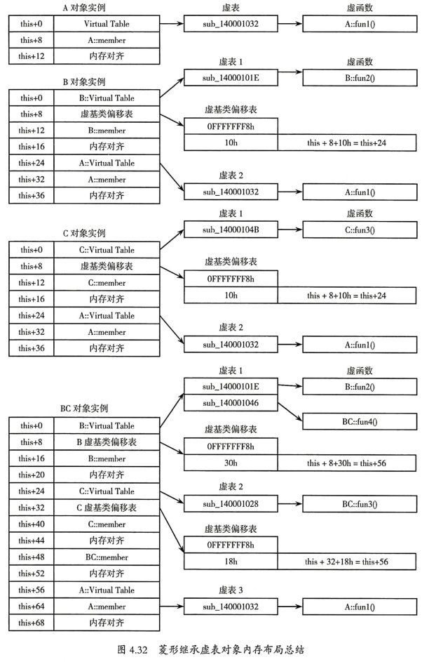

- 在IDA中，`vftable`表示虚表，而`vbtable`表示虚基类偏移表。甚至IDA可以自动指出某个`vftable/vbtable`地址指向了哪一个类，还是很智能的。

- 父类为抽象类虚表与单重继承的唯一区别是， 父类的虚表代码为`_purecall`，其功能是显示错误信息并退出程序。**如果发现某个类有`_purecall`虚表项，就可以怀疑它是抽象类**。

# 演示版保护技术

## 序列号保护方式——2/4/2022

- 读入注册码的API：`GetWindowText`,`GetDlgItemText`,`GetDlgItemInt`等。
- 显示注册码正误的API：`MessageBox`,`MessageBoxEx`,`ShowWindow`,`CreateDialogParam`,`DialogBoxParam`等。
- 对于使用明文比较注册码的保护方式，可以在Ollydbg中打开内存窗口，按Ctrl+B搜索输入的序列号（找到输入的内存地址），多数情况下真正的序列号在该地址±90h字节的地方。
- 可以使用OllyDbg中的Asm2Clipboard插件提取反汇编嵌入C。转换时需注意栈平衡、数据进制、汇编语法格式、字符串引用等。

## 警告窗口——2/7/2022

- 窗口ID提取：exescope或resource hacker。
- `DialogBoxParam`原型如下：

```c
int DialogBoxParam(
    HINSTANCE hInstance,
    LPCTSTR lpTemplateName,
    HWND hWndParent,
    DLGPROC lpDialogFunc,
    LPARAM dwInitParam
);
```

- 去除警告窗口的两种方式：
  - 汇编跳过警告窗口。
  - 将警告窗口的参数替换成正常窗口的参数。

## 时间限制——2/8/2022

- 常见的计时器函数：`SetTimer()`,`KillTimer()`,`timeSetEvent()`,`GetTickCount()`,`timeGetTime()`.
- 常见的用于获取时间的函数：`GetSystemTime()`,`GetLocalTime()`,`GetFileTime()`.
- 去除时间限制的两种方式：
  - 跳过时间函数。
  - 跳过判断超时跳转退出的函数。
- 可以使用变速齿轮辅助调试（尚未成功）。

## 菜单功能限制——2/9/2022

- 相关函数：
  - EnableMenuItem()函数为`BOOL EnableMenuItem(HMENU hMenu, UINT uIDEnableItem, UINT uEnable)`。其中uEnable项有`MF_ENABLED`(0h)，`MF_GRAYED`(1h)，`MF_DISABLED`(2h)，`MF_COMMAND`和`MF_BYPOSITION`.

  - EnableWindow()函数为`BOOL EnableWindow(HWND hWnd, BOOL bEnble)`。函数返回**非0表示成功，0表示失败**。

- 去除限制的方式（只在完整版与试用版文件相同时才可用）：修改调用这两个函数push时的`Enable`参数。

## KeyFile保护——2/10/2022

- 相关函数：

  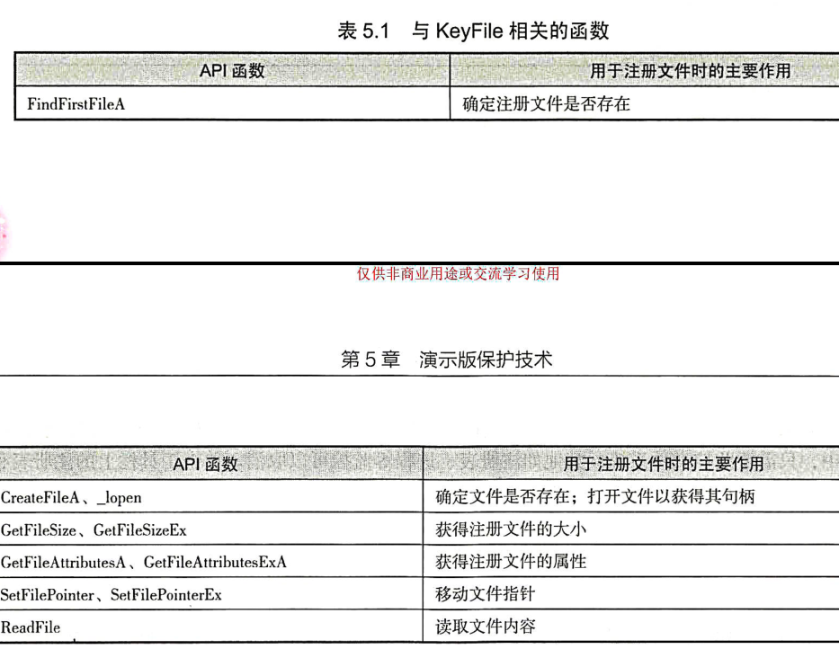

- lods指令：`lods byte ptr [esi]`，将[esi]指向的一字节数据放入eax中，同时esi++。

- 拆解思路：
  1. 使用Process Monitor监视程序对文件的操作，以找到KeyFile的文件名。
  2. 用十六进制编辑器编辑KeyFile。
  3. 在调试器里用CreateFile设断，查看打开的文件名指针，并记下返回句柄。
  4. 用ReadFile函数设断，分析传递给ReadFile函数的文件句柄和**缓冲区地址**。文件句柄一般和第3步返回的相同。对缓冲区存放的字节设内存断点，监视读取的KeyFile内容。

## 网络验证——2/12/2022

- 相关函数：

  - `send()`函数，微软扩展为`WSASend()`

  ```c
  int send(
      SOCKET s,
      const char FAR *buf,
      int len,
      int flags
  );
  ```

  - `recv()`函数，微软扩展为`WSARecv()`

  ```c
  int recv(
  	SOCKET s,
  	char FAR *buf,
  	int len,
  	int flags
  );
  ```

- 拆解思路：

  1. 分析发送和接收的数据包。（关键）
  2. 两种方式：
     - 编写一个服务端用来接收和发送数据。如果客户端使用域名登录，可以修改hosts文件；如果使用IP直连，可以用`inet_addr`或`connect`设断将IP指向本地，也可以使用代理软件做到这一点。
     - 直接修改客户端程序。先将接收的正确数据包粘贴到某个空白地址，然后跳过`send()`、`recv()`函数并替换为处理正确数据包的函数，最后将诸如“连接失败”一类的对话框跳过即可。

> 疑问：getasm.py脚本似乎不与IDA 7.6相兼容，如何重新实现以下代码？
>
> ```python
> #coding=utf-8
> ##《加密与解密》第四版
> ##code by DarkNess0ut
> 
> import os
> import sys
> 
> def Getasm(ea_from, ea_to, range1, range2):
>     fp = open("code.txt","w")
>     ea = ea_from
>     while ea < ea_to:
>         cmd = GetMnem(ea)
>         if cmd == "mov" or cmd == "lea":
>             opcode = Dword(NextNotTail(ea)-4)
>             if opcode < 0: #opcode < 0,处理 mov  edx, [ebp-350]指令，否则处理mov  edx, [ebp+350]
>                 opcode = (~opcode + 1)
>             Message("-> %08X %08X\n" % (ea, opcode))
> 
>             if range1 <= opcode <= range2:
>                 delta = opcode - range1
>                 MakeComm(ea, "// +0x%04X" % delta) # 加注释到IDA中
>                 fp.write("%08X %s\n" % (ea, GetDisasm(ea)))
>         ea = NextNotTail(ea)
>     fp.close()
>     Message("OK!")
> Getasm(0x401000,0x40F951,0x41AE68,0x0041AEC1);
> ```

## 光盘检测——2/11/2022

- 相关函数：

  - `GetDriveType()`,获取磁盘驱动器的类型

  ```c
  UINT GetDriveType(
      LPCTSTR lpRootPathName
  );
  /*
  返回值：
  0：驱动器不能识别。
  1：根目录不存在。
  2：移动储存器。
  3：固定驱动器（硬盘）。
  4：远程驱动器（网络）。
  5：CD-ROM驱动器。
  6：RAM disk。
  */
  ```

  - `GetLogicalDrives()`,获取逻辑驱动器符号,无参数

  ```c
  /*
  返回值：
  如果失败返回0，否则返回由位掩码表示当前可用驱动器，如
  bit 0		drive A
  bit 1		drive B
  bit 2		drive C
  ......
  */
  ```

  - `GetLogicalDriveStrings()`,即获取逻辑驱动器的根驱动器路径

  ```c
  DWORD GetLogicalDriveStrings(
      DWORD nBufferLength,
      LPTSTR lpBuffer
  );
  /*
  返回值:
  如果失败返回0
  成功返回实际的字符数
  */
  ```

  - `GetFileAttributes()`,判断指定文件的属性

  ```c
  DWORD GetFileAttributes(
      LPCTSTR lpFileName
  );
  ```

- 拆解方式：
  - 对于较为简单的光盘检测（先获得所有驱动器列表，再检查每个驱动器的类型，如果是光驱，使用`CreateFile()`或`FindFirstFile()`函数检查文件是否存在，以及属性、大小、内容等），只需利用上述函数设置断点，找到检查光驱的地方，修改判断指令即可。
  - 对于增强类型（程序运行的关键数据被放在了光盘中），可以使用刻录工具复制多份，也可以使用虚拟光驱程序模拟正版光盘（其中Daemon Tools~~不仅免费~~，还能模拟一些加密光盘）。

## 只运行1个实例——2/11/2022

- 实现方法：

  1. 查找窗口法：如果查找到相同窗口类名和标题的窗口，就退出程序。通过`FindWindowA()`,`GetWindowText()`实现。

     ```c
     HWND FindWindowA(
         LPCTSTR lpClassName,
         LPCTSTR lpWindowName
     );
     //若未找到相符的窗口，则返回0
     ```

  2. 使用互斥对象：一般用`CreateMutexA()`实现，作用是创建有名或者无名的互斥对象~~（什么东西）~~。

     ```c
     HANDLE CreateMutexA(
         LPSECURITY_ATTRIBUTES lpMutexAttributes, //安全属性
         BOOL bInitialOwner, //互斥对象初始身份
         LPCTSTR lpName //指向互斥对象名
     );
     //如果函数调用成功，返回互斥对象句柄
     ```

  3. > 使用共享区块（Section）。该区块拥有读取、写入和共享保护属性，可以让多个实例共享同一内存块。将一个变量作为计数器放到该区块中，该应用程序的所有实例可以共享该变量，从而通过该变量得知有没有正在运行的实例。

- 拆解方式：
  - 修改应用程序的窗口标题。
  - 修改`FindWindow()`等函数的返回值（或者修改判断指令）。

## 常用断点设置技巧——2/11/2022

掌握Win32编程技巧还是很重要滴！

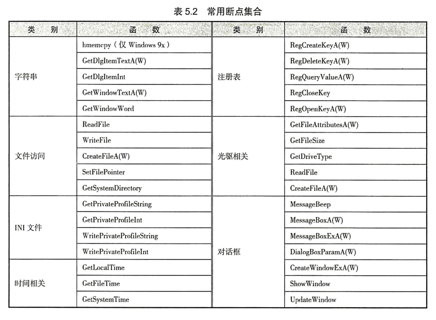

# 加密算法

> 本节笔记的记录主要以算法识别为主，不涉及算法具体过程（公钥除外，因为没有特殊常数），汇编分析与crack操作。
>
> 可以使用IDA的FindCrypt或者PEiD的Krypto ANALyzer来辅助分析算法。

## 单项散列算法——2/27/2022

### MD5

重要常数：

- 初始化消息摘要`67452301h`,`efcdab89h`,`98badcfeh`,`10325476h`.

- `floor(2**32 * abs(sin(i)))`对应的32位值，如`d76aa478h`.

可能的变种方式：

- 修改前面的四个常数。
- 修改原串的填充方式。
- 修改hash变换的处理过程。

### SHA

SHA-1的常数`5a827999h`,`6ed9eba1h`,`8f1bbcdch`,`ca62c1d6h`.

SHA-1的160位的初始化消息摘要`67452301h`,`efcdab89h`,`98badcfeh`,`10325476h`,`c3d2e1f0h`.

SHA-256、SHA384、SHA512的初始化消息摘要：

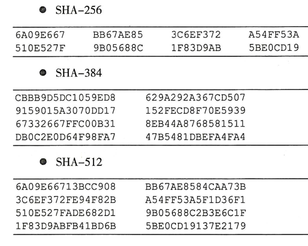

### SM3

公开的国密算法，过程简述：https://zhuanlan.zhihu.com/p/129692191

可能的代码实现：https://blog.csdn.net/a344288106/article/details/80094878

> 常数？`79CC4519h`,`7A879D8Ah`
>
> 初始化消息摘要？
>
> `7380166Fh`,`4914B2B9h`,`172442D7h`,`DA8A0600h`,`A96F30BCh`,`163138AAh`,`E38DEE4Dh`,`B0FB0E4Eh`

## 对称加密算法——2/28/2022

### RC4

RC4算法识别：


从网上嫖来的解密脚本：

```python
import base64
def rc4_main(key = "init_key", message = "init_message"):
    print("RC4解密主函数调用成功")
    print('\n')
    s_box = rc4_init_sbox(key)
    crypt = rc4_excrypt(message, s_box)
    return crypt
def rc4_init_sbox(key):
    s_box = list(range(256))
    print("原来的 s 盒：%s" % s_box)
    print('\n')
    j = 0
    for i in range(256):
        j = (j + s_box[i] + ord(key[i % len(key)])) % 256
        s_box[i], s_box[j] = s_box[j], s_box[i]
    print("混乱后的 s 盒：%s"% s_box)
    print('\n')
    return s_box
def rc4_excrypt(plain, box):
    print("调用解密程序成功。")
    print('\n')
    plain = base64.b64decode(plain.encode('utf-8'))
    plain = bytes.decode(plain)
    res = []
    i = j = 0
    for s in plain:
        i = (i + 1) % 256
        j = (j + box[i]) % 256
        box[i], box[j] = box[j], box[i]
        t = (box[i] + box[j]) % 256
        k = box[t]
        res.append(chr(ord(s) ^ k))
    print("res用于解密字符串，解密后是：%res" %res)
    print('\n')
    cipher = "".join(res)
    print("解密后的字符串是：%s" %cipher)
    print('\n')
    print("解密后的输出(没经过任何编码):")
    print('\n')
    return cipher
a=[0xc6,0x21,0xca,0xbf,0x51,0x43,0x37,0x31,0x75,0xe4,0x8e,0xc0,0x54,0x6f,0x8f,0xee,0xf8,0x5a,0xa2,0xc1,0xeb,0xa5,0x34,0x6d,0x71,0x55,0x8,0x7,0xb2,0xa8,0x2f,0xf4,0x51,0x8e,0xc,0xcc,0x33,0x53,0x31,0x0,0x40,0xd6,0xca,0xec,0xd4]
s=""
for i in a:
    s+=chr(i)
s=str(base64.b64encode(s.encode('utf-8')), 'utf-8')
rc4_main("Nu1Lctf233", s)
```

### TEA

常数为`0x9e3779b9`，来源于32bit的黄金分割比$\frac{\sqrt5-1}{2}$

（注意XTEA/XXTEA也是这个常数）

解密脚本：

```C
#include <stdio.h>
#include <stdint.h>
#define DELTA 0x9e3779b9
#define MX (((z>>5^y<<2) + (y>>3^z<<4)) ^ ((sum^y) + (key[(p&3)^e] ^ z)))

void btea (uint32_t* v,int n, uint32_t* k) { // however the 'n' is useless
	uint32_t v0=v[0], v1=v[1], sum=0xC6EF3720, i;  /* set up */
	uint32_t delta=0x9e3779b9;                     /* a key schedule constant */
	uint32_t k0=k[0], k1=k[1], k2=k[2], k3=k[3];   /* cache key */
	for (i=0; i<32; i++) {                         /* basic cycle start */
		v1 -= ((v0<<4) + k2) ^ (v0 + sum) ^ ((v0>>5) + k3);
		v0 -= ((v1<<4) + k0) ^ (v1 + sum) ^ ((v1>>5) + k1);
		sum -= delta;
	}                                              /* end cycle */
	v[0]=v0; v[1]=v1;
}

int main()
{
	uint32_t v[2]= {0x3e8947cb,0xcc944639};
	uint32_t w[2]= {0x31358388,0x3b0b6893};
	uint32_t x[2]= {0xda627361,0x3b2e6427};

	uint32_t const k[4]= {17477,16708,16965,17734};
	int n = 2; //n的绝对值表示v的长度，取正表示加密，取负表示解密
	// v为要加密的数据是两个32位无符号整数
	// k为加密解密密钥，为4个32位无符号整数，即密钥长度为128位
	btea(v, -n, k);
	printf("%x %x ",v[0],v[1]);
	btea(w, -n, k);
	printf("%x %x ",w[0],w[1]);
	btea(x, -n, k);
	printf("%x %x",x[0],x[1]);
	return 0;
}
```

### IDEA

`52`个子密钥是加密密钥对16bit加法和乘法($2^{16}+1$)的逆元。

子密钥应按照加密密钥相反的顺序使用。

解密代码略。自行搜索[bouncycastle](https://www.bouncycastle.org/)。

### BlowFish

基于Feistel网络。

P数组（取Pi的小数部分）：

`243f6a88h`,`85a308d3h`,`13198a2eh`,`03707344h`

解密代码略。

### AES(Rijndael)

解密的模式有：

- ECB(Electronic Code Book，电子密码本)模式
- CBC(Cipher Block Chaining，加密块链)模式 
- CTR(Counter，计数器）模式
- CFB(Cipher FeedBack Mode，加密反馈)模式
- OFB(Output FeedBack，输出反馈)模式 

> 知道这些并没有什么用，到时候还是得一个一个试。


S盒：

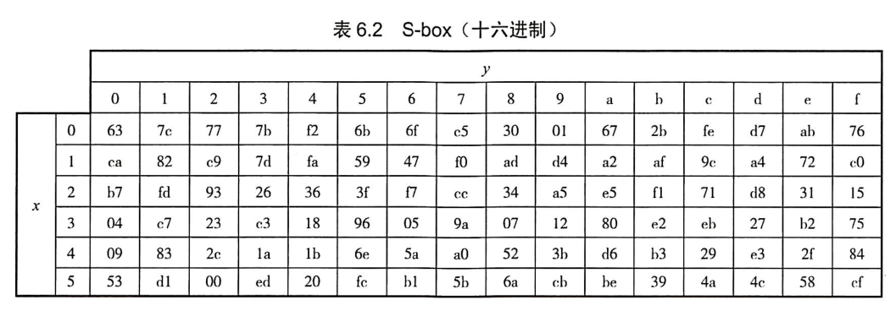

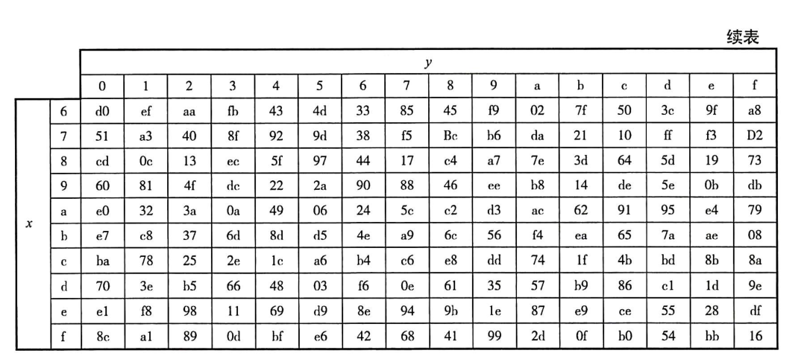

~~网上的解密网站都只能解自己的，解不了别人的。~~

解密网站：http://tool.chacuo.net/cryptaes

### SM4

https://zhuanlan.zhihu.com/p/363900323

S盒：


系统参数$FK_i$的取值：


32个固定参数$CK_i$的具体值：


解密工具见SM2处链接。

## 公钥加密算法——3/1/2022

### RSA

- 公私钥的产生：
  1. 我们先随意选择两个质数$p$与$q$，这里取$p=33333331$,$q=998244353$，计算 $N=pq=33274809437429843$.
  1. 根据欧拉函数$\varphi(x)$（小于或等于x的正整数中与x互质的数的数目），求得$r=\varphi(N)=\varphi(p)\varphi(q)=(p-1)(q-1)=33274808405852160$.
  1. 选一个小于r的整数$e$，使得$e$与$r$互质。并求得e关于r的逆元$d$，即 $ed≡1\pmod r$。这里我们取$e=65537$，求得$d=17217187752050689$
  1. 销毁$p$与$q$.


​	由此，我们得到了公钥$(N,e)$与私钥$(N,d)$。

- 加密信息：

  假设B想给A传送信息$m$，他知道A产生的$N$与$e$。他使用先前约定好的格式（如Unicode，下有介绍）将$m$转换为一个小于$N$的正整数$n$，使用下列公式将$n$加密为$c$：

  $$c\equiv n^e\pmod N$$

  $c$不难计算，使用快速幂即可。

- 解密信息：

  A得到B的消息后可以利用他的私钥$d$来解码，他使用下列公式将$c$还原成$n$。

  $$n\equiv c^d\pmod N$$

关于对RSA攻击是密码学的专门内容，可以参考[这篇文章](https://blog.csdn.net/vhkjhwbs/article/details/101160822)。

### ElGamal

- 密钥对生成：
  1. 取一个大素数$p$,随机数$g$与随机数$x$,满足$x \leq p-2$且$g< p$.
  2. 计算$y \equiv g^x \pmod p$.
  3. 公钥为$y$,$g$,$p$,私钥为$x$.
- 加解密：
  1. 取随机数$k$,满足$k \leq p-2$,且$\gcd(k,p-1)=1$.
  2. 计算$a \equiv g^k \pmod p$.
  3. 计算$b \equiv y^k M \pmod p$,$(a,b)$即为密文.
  4. 解密时计算$M \equiv b/a^x \pmod p$.
- 签名：
  1. 取随机数$k$,满足$k \leq p-2$,且$\gcd(k,p-1)=1$.
  2. 计算$a \equiv g^k \pmod p$.
  3. 设明文为$M$,找到满足$xa+kb\equiv M \pmod {p-1}$的解$b$.可证明满足条件的$b$唯一,签名即为$(a,b)$.
  4. 验证签名时,需要满足$y^aa^b\equiv g^M \pmod p$且$a < p$.

对离散对数的攻击：BSGS、Pollard-Rho、Index-Calculus Algorithm、Pohlig-Hellman Algorithm等等。

如果用于不同明文加密的$k$和私钥$x$相同，那么有特殊的攻击方法。

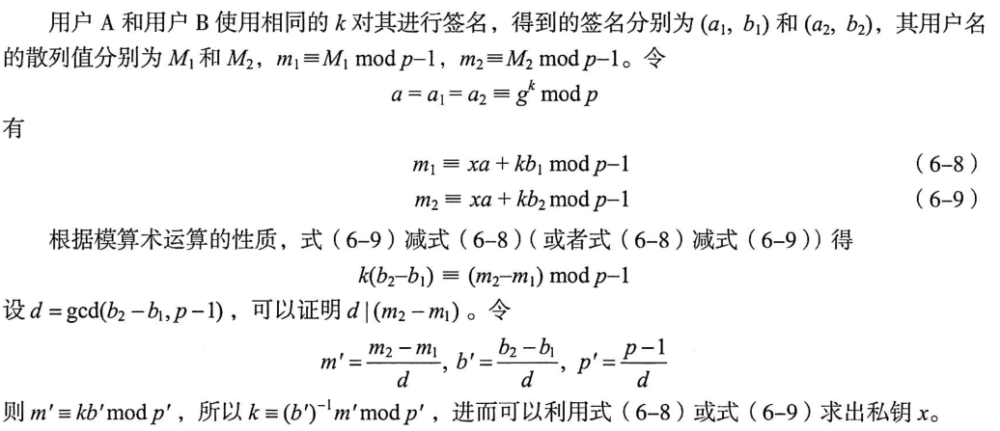

### DSA——3/2/2022

**用于签名，不能用于加解密。**

- 密钥对生成：
  1. $p$是$L$位长的素数. $64|L$ 且 $512 \leq L \leq 1024$,$2^{L-1}<p<2^L$.
  2. $q$是 $p-1$的素因子,$2^{159}<q<2^{160}$.
  3. $g \equiv h^{(p-1)/q} \pmod p$,且有$h < p-1,g > 1$.
  4. $x$为私钥,$0<x<q$.
  5. $y \equiv g^x \pmod p$.$p$、$q$、$g$、$y$为公钥.
  6. $k$为随机数,$0<k<q$,用后即丢弃.
- 签名生成：
  1. 输入明文$M$,公钥$p$、$g$、$q$,私钥$x$,随机数$k$.
  2. `r = g**k % p % q`
  3. `s = inv(k) * (SHA-1(M) + x*r) % q`,其中`inv(k)`是$k$模$q$的乘法逆元.
  4. 签名即为$(r,s)$.
- 验证签名：
  1. 输入明文$M'$,公钥$p$、$g$、$q$、$y$,签名$r'$、$s'$.
  2. 首先满足$r'<q$且$s'<q$.
  3. `w=inv(s') % q`
  4. `u1=((SHA-1(M')) * w) % q`
  5. `u2=(r'w) % q`
  6. `v=(g**u1*y**u2) % p % q`
  7. 若$v = r'$,则签名验证成功.

$x$与$y$需要定期更新，原因同ElGamal.

### ECC with GF(p)——3/3/2022

由于对数学知识要求较高,主要用于Crypto出题,在Re遇到的可能性较低,这里不给出具体原理.

算法原理 from wikipedia: https://en.wikipedia.org/wiki/Elliptic-curve_cryptography

算法原理 + py实现 from zhihu: https://zhuanlan.zhihu.com/p/101907402

可能有用的ECC模版:

```python
import collections
import random

EllipticCurve = collections.namedtuple('EllipticCurve', 'name p a b g n h')

curve = EllipticCurve(
   'secp256k1',
   # Field characteristic.
   p=int(input('p=')),
   # Curve coefficients.
   a=int(input('a=')),
   b=int(input('b=')),
   # Base point.
   g=(int(input('Gx=')),
      int(input('Gy='))),
   # Subgroup order.
   n=int(input('k=')),
   # Subgroup cofactor.
   h=1,
)
# Modular arithmetic ##########################################################

def inverse_mod(k, p):
   """Returns the inverse of k modulo p.
  This function returns the only integer x such that (x * k) % p == 1.
  k must be non-zero and p must be a prime.
  """
   if k == 0:
       raise ZeroDivisionError('division by zero')
   if k < 0:
       # k ** -1 = p - (-k) ** -1 (mod p)
       return p - inverse_mod(-k, p)
   # Extended Euclidean algorithm.
   s, old_s = 0, 1
   t, old_t = 1, 0
   r, old_r = p, k

   while r != 0:
       quotient = old_r // r
       old_r, r = r, old_r - quotient * r
       old_s, s = s, old_s - quotient * s
       old_t, t = t, old_t - quotient * t
   gcd, x, y = old_r, old_s, old_t

   assert gcd == 1
   assert (k * x) % p == 1
   return x % p

# Functions that work on curve points #########################################

def is_on_curve(point):
   """Returns True if the given point lies on the elliptic curve."""
   if point is None:
       # None represents the point at infinity.
       return True
   x, y = point
   return (y * y - x * x * x - curve.a * x - curve.b) % curve.p == 0

def point_neg(point):
   """Returns -point."""
   assert is_on_curve(point)
   if point is None:
       # -0 = 0
       return None
   x, y = point
   result = (x, -y % curve.p)
   assert is_on_curve(result)
   return result

def point_add(point1, point2):
   """Returns the result of point1 + point2 according to the group law."""
   assert is_on_curve(point1)
   assert is_on_curve(point2)
   if point1 is None:
       # 0 + point2 = point2
       return point2
   if point2 is None:
       # point1 + 0 = point1
       return point1
   x1, y1 = point1
   x2, y2 = point2

   if x1 == x2 and y1 != y2:
       # point1 + (-point1) = 0
       return None
   if x1 == x2:
       # This is the case point1 == point2.
       m = (3 * x1 * x1 + curve.a) * inverse_mod(2 * y1, curve.p)
   else:
       # This is the case point1 != point2.
       m = (y1 - y2) * inverse_mod(x1 - x2, curve.p)

   x3 = m * m - x1 - x2
   y3 = y1 + m * (x3 - x1)
   result = (x3 % curve.p, -y3 % curve.p)
   assert is_on_curve(result)
   return result

def scalar_mult(k, point):
   """Returns k * point computed using the double and point_add algorithm."""
   assert is_on_curve(point)
   if k < 0:
       # k * point = -k * (-point)
       return scalar_mult(-k, point_neg(point))
   result = None
   addend = point
   while k:
       if k & 1:
           # Add.
           result = point_add(result, addend)
       # Double.
       addend = point_add(addend, addend)
       k >>= 1
   assert is_on_curve(result)
   return result

# Keypair generation and ECDHE ################################################
def make_keypair():
   """Generates a random private-public key pair."""
   private_key = curve.n
   public_key = scalar_mult(private_key, curve.g)
   return private_key, public_key

private_key, public_key = make_keypair()
print("private key:", hex(private_key))
print("public key: (0x{:x}, 0x{:x})".format(*public_key))

```


### SM2

[基于ECC的一种国密算法。](http://www.sca.gov.cn/sca/xwdt/2010-12/17/1002386/files/b791a9f908bb4803875ab6aeeb7b4e03.pdf)

SM2~SM4加解密工具：https://github.com/ASTARCHEN/snowland-smx-python

## 其它算法——3/1/2022

### CRC32

只能用于校验文件，不能用来加密。

**重点在于初始化生成的`crctab`表的识别。**

算法就几行代码的事：

```c
#include <stdio.h>
int crctab[256]; 
void gentable() {
    for(int i = 0; i < len; i++) {
        int crc = i;
        for(int j = 0; j < 8; j++) {
            if(crc & 1)
                crc = (crc >> 1) ^ 0xedb88320; // or 04c11db7h
            else
                crc >>= 1;
        }
        crctab[i] = crc;
    }
}
int main()
{
    gentable();
    int dwCRC = 0xffffffff;
    for(int i = 0; i < Len; i++) {
        dwCRC = crctab[(dwCRC ^ Data[i]) & 0xff] ^ (dwCRC >> 8); // Data is the bytevalue of your file. 
    }
    dwCRC = ~dwCRC;
    return 0;
}
```

### base64

因为比赛中可能会换表，甚至会修改算法的一些逻辑，因此了解一下其实现过程是很有必要的。

因为$3\times8=4\times6$,而且$64=2^6$,因此base64的核心就是将三字节的数据对应到四字节的码表中。

对应方式很简单，就是列出3字节，24bit的01串（big endian）。然后每组6bit，分成四组。

每6个bit只能表示0~63这64个数，对应到base64的表（数组）中，替换成这64个字符。

为了保证转换后的串长是4的倍数，如果有6bit没有填充（注意这个跟值为0不同），就替换成`=`作为paddling。

举例如下图：

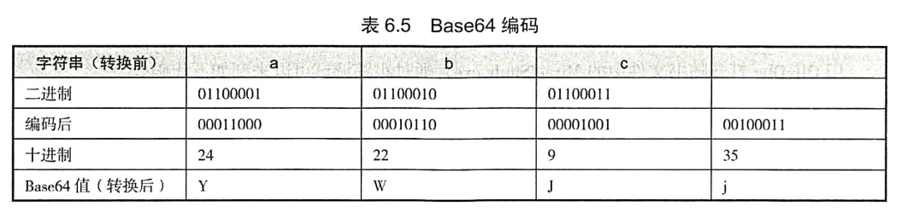

核心代码：

```c
for(i=0,j=0;i<len-2;j+=3,i+=4)  
{  
    res[i]=base64_table[str[j]>>2]; //取出第一个字符的前6位并找出对应的结果字符  
    res[i+1]=base64_table[(str[j]&0x3)<<4 | (str[j+1]>>4)]; //将第一个字符的后位与第二个字符的前4位进行组合并找到对应的结果字符  
    res[i+2]=base64_table[(str[j+1]&0xf)<<2 | (str[j+2]>>6)]; //将第二个字符的后4位与第三个字符的前2位组合并找出对应的结果字符  
    res[i+3]=base64_table[str[j+2]&0x3f]; //取出第三个字符的后6位并找出结果字符  
}  
```

## 常见加密库接口及其识别——3/3/2022

Miracl、FGInt、Crypto++、OpenSSL等等。

## 加密算法在软件保护中的应用——3/3/2022

~~许多软件证明安全和体验是矛盾的.~~

- 不要依赖自己设计的算法。
- 尽可能采用成熟的、安全性高的密码学算法。
- 定期更新密钥。
- 在成本允许的情况下，定期更新算法或安全机制。
- 严格按照标准建议的安全参数执行，使用标准化的安全算法或协议。
- 从攻击者的角度审视自己设计的安全机制。
- 在使用开源的密码箱算法库时，去掉对攻击者有用的信息提示。
- 时常关注密码学算法的最新进展。
