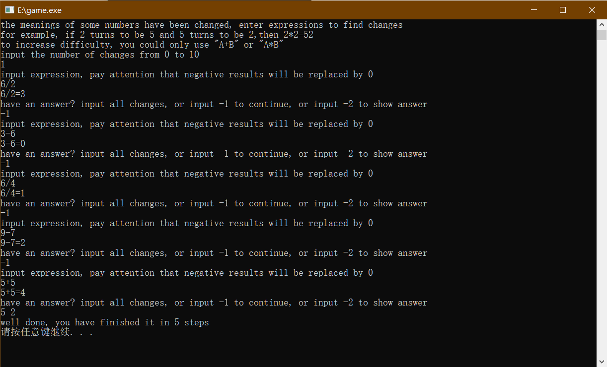

layout: post
title: 猜数游戏
author: junyu33
categories: 

  - OI

tags:

  - c++

date: 2021-8-27 20:00:00

---

又是闲来无事，我扒出了竞赛时自己亲手编写的猜数游戏代码，并未对其进行改良，将网上流行的版本与小学数学结合起来，形成了如下代码。

<!-- more -->

```c++
//created by junyu33 in Feb. 3rd, 2020
#include <bits/stdc++.h>
using namespace std;
int ipt[10];
bool used[10];
void f(int a, char b, int c)
{
    int x = 0, z = 0, pa = a, pc = c;
    if (a == 0)
        x = ipt[a];
    else
        while (a)
        {
            int t = a % 10;
            x += ipt[t] * pow(10, z);
            z++;
            a /= 10;
        }

    cout << pa;

    int y = 0;
    z = 0;
    if (c == 0)
        y = ipt[a];
    while (c)
    {
        int t = c % 10;
        y += ipt[t] * pow(10, z);
        z++;
        c /= 10;
    }
    int preans;
    if (b == '+')
        preans = x + y;
    if (b == '*')
        preans = x * y;
    if (b == '-')
        preans = x - y;
    if (b == '/')
        preans = x / y;

    cout << b;
    cout << pc;

    int ans = 0;
    z = 0;
    if (preans == 0)
        y = ipt[a];
    while (preans)
    {
        int t = preans % 10;
        ans += ipt[t] * pow(10, z);
        z++;
        preans /= 10;
    }
    cout << "=" << ans << endl;
}
void show()
{
    for (int i = 0; i <= 9; i++)
        if (ipt[i] != i)
            cout << i << " " << ipt[i] << endl;
    system("pause");
    exit(0);
}
int main()
{
    srand((unsigned)time(NULL));
    cout << "the meanings of some numbers have been changed, enter expressions to find changes" << endl;
    cout << "for example, if 2 turns to be 5 and 5 turns to be 2,then 2*2=52" << endl;
    cout << "to increase difficulty, you could only use \"A+B\" or \"A*B\"" << endl;
    int n;
    cout << "input the number of changes from 0 to 10" << endl;
    cin >> n;
    memset(ipt, -1, sizeof(ipt));
    for (int p = 0; p < n;)
    {
        int a = rand()%10, b = rand()%10;
        if (a != b && !used[a])
        {
            p++;
            used[a] = 1;
            ipt[a] = b;
        }
    }
    for (int i = 0; i <= 9; i++)
        if (ipt[i] == -1)
            ipt[i] = i;
    int cnt=0;
    while (1)
    {
        again:;
        cnt++;
        cout << "input expression, pay attention that negative results will be replaced by 0" << endl;
        int a, c;char b;
        cin>>a>>b>>c;
        f(a, b, c);
        cout << "have an answer? input all changes, or input -1 to continue, or input -2 to show answer" << endl;
        int flag = 0;
        for (int i = 1; i <= n; i++)
        {
            int in, out;
            cin >> in;
            if (in == -1)
                goto again;
            if (in == -2)
                show();
            cin >> out;
            if (ipt[in] == out)
                flag++;
        }
        if (flag == n)
        {
            cout << "well done, you have finished it in " << cnt << " steps" <<endl; 
            system("pause");
            return 0;
        }
        else
            cout << "WA" << endl;
    }
}
```

游戏的规则嘤文说得很清楚，这里简要阐述一下：

> 变化规则：2 -> 5,5 -> 2
>
> 原式：2*2
>
> 第一次变：5*5
>
> 结果为：25
>
> 第二次变：52

其实我是编写了加减乘除四种函数，但减法会有负数变为0的__特性__，除法只有取整，在实际猜数的过程中应用价值不高。于是我就吓唬没拿到源码的人，让他们只用加与乘来规避bug的出现。

操作示例：（再按任意键继续就关了）



希望各位能享受这款有点小烧脑的原创作品！