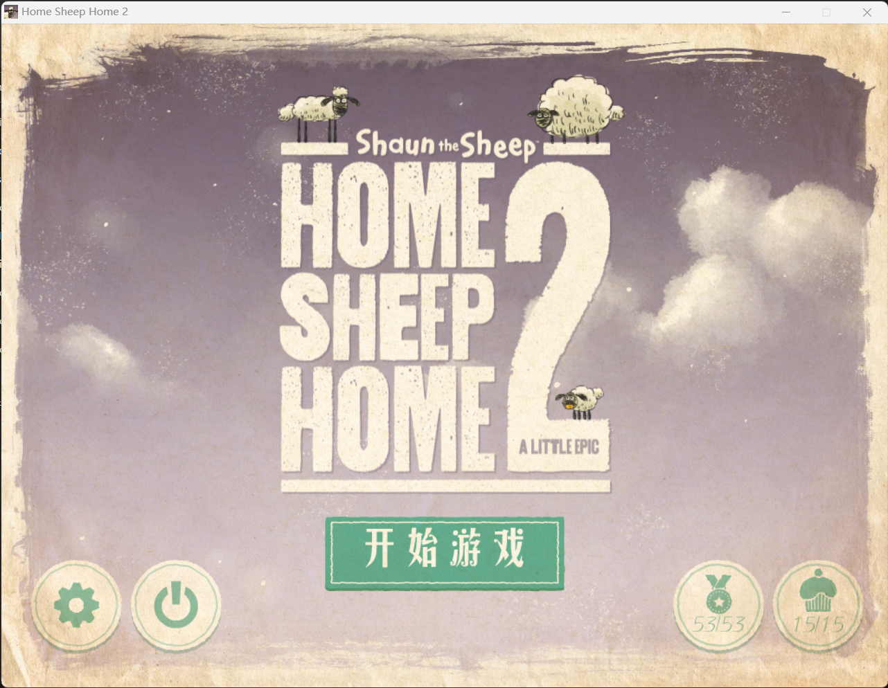
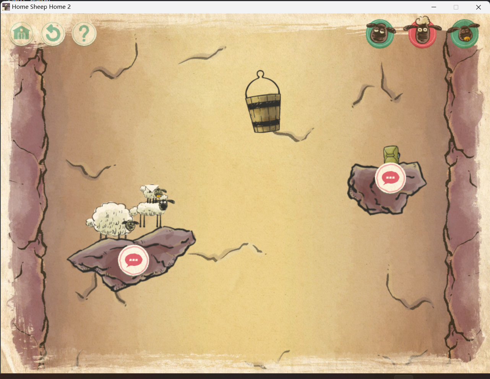
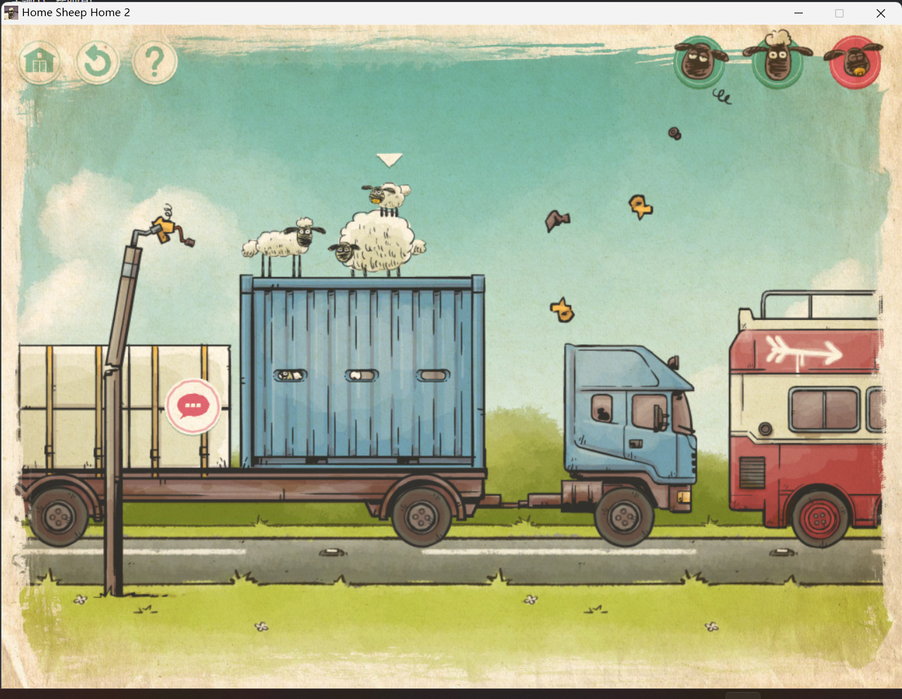
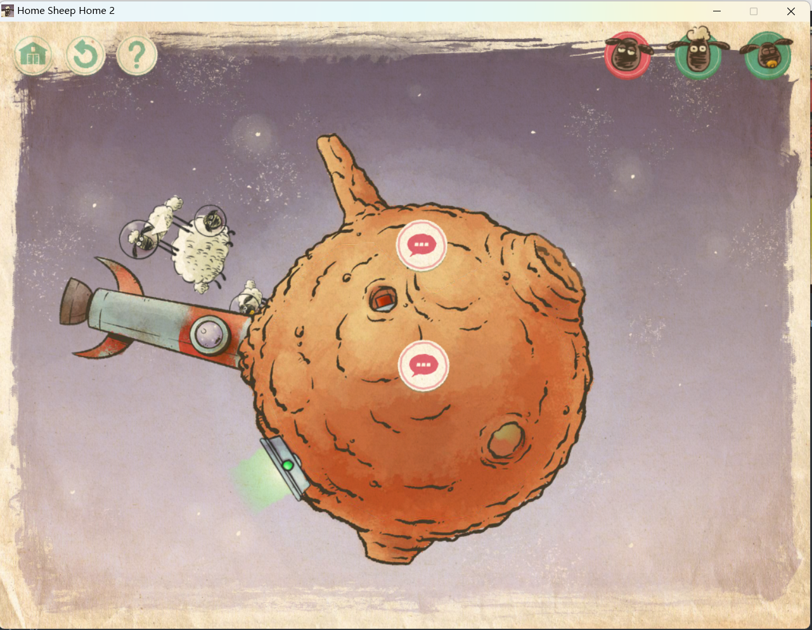
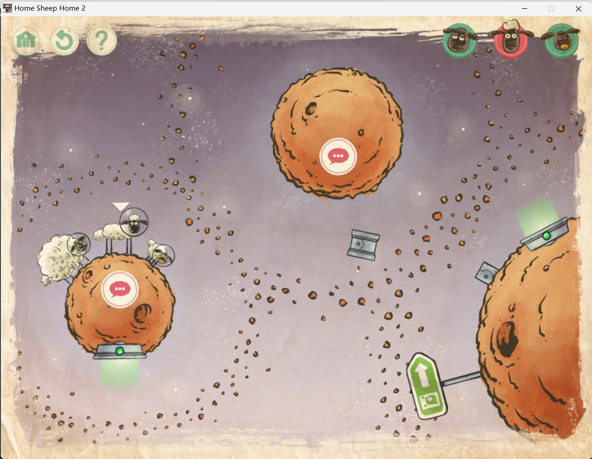
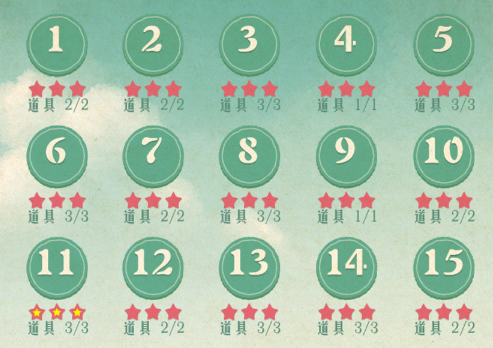
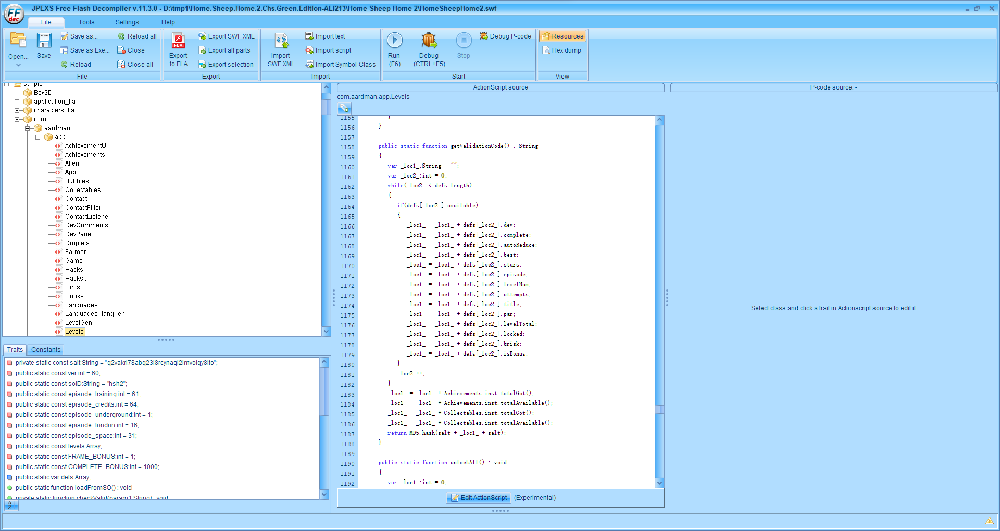

layout: post
title: 二八——重温《小羊肖恩之绵羊回家2》
author: junyu33
mathjax: true

tags:

- reverse
- games

categories:

  - 随笔

date: 2022-10-7 23:15:00

---

追寻童年那三只小羊的回忆——那可是十年前的事情啊。

~~不要问我是不是因为《羊了个羊》火了才想起来这个游戏的。~~



<!-- more -->

# 三星通关+全物品收集

这个游戏如果想把所有物品（袜子、蛋糕、游戏机）收集齐的话，有一点思维难度。并且通常情况下，你不能一边冲三星，一边拿到所有物品。（手速大佬与游戏开发者请忽略这段话，~~毕竟游戏开发者的记录无人能敌~~）

但是游戏中如果你收集了物品的话，重玩就不需要再收集了。所以最有效率的玩法是第一遍先慢慢玩，理清通关的思路同时，找到所有的物品，然后第二遍速通（我平均也要三遍左右才能三星）。

什么，你过不了关？那你还是洗洗睡吧。毕竟后面的操作都很硬核。

# 刷全成就

如果说单纯通关游戏的难度是1，那么三星通关+全物品收集的难度是3，刷全成就的难度可能就是10了。

## 60%的低难度成就

做到三星通关+全物品收集的话，这一部分的成就应该都有了，下面来说一下那些比较tricky的成就。

## 30%的中难度成就

主要是涉及到关卡的一些骚操作，举几个有代表性的例子。

### 降落伞在哪（只使用两个降落伞）



> 体积从大到小分别为雪莉(Shirley)、肖恩(Shaun)与蒂米(Timmy).

Shaun跳到右边的石块拿降落伞，Shirley拿到上方的降落伞后一跃而下。由于Shirley上升速度较慢，Timmy有足够的时间跳到Shirley的背上，与Shirley一起上去。

### 高速特写（让测速相机拍到他们仨）



Shaun直接在卡车顶上跨栏即可。Timmy踩在Shirley背上，跳的时候靠前一些（想象测速相机从下往上拍）。Shirley踩在Timmy背上，跳一下就行。

> 完成此成就不需要通关，建议拿了成就赶快退出关卡。~~难道你不心疼Shirley做为挡箭牌吗~~

### 烤羊（让Shaun跳到火箭尾部）



（理论上能让他们仨跳得最高的方法）

Shirley踩在Timmy上面，在Shirley跳的一瞬间，角色切换成Shaun然后纵身一跃上火箭。

这个有点考手速，但不是太难。~~但是如果把Shaun起跳后，两只羊都在空中的那一瞬间截下来就有点难顶了~~

> 我小时候可能做到这一步就打不过其它的成就了。

## 10%的高难度成就

我用三天打完了这个游戏，剩下的这四个成就就折磨了我两天。

### 废物利用（在太空漫步关卡14中只使用一次传送）



我一开始心想，这个成就难道不简单？让Shirley和Shaun一起跳到终点不就完事了？事实上确实只需要一次传送，让Timmy和右边那个小方块交换就可以。但是，我通关后，成就并没有解锁。即使我又重复了两次，但依然没有奏效。

于是我开始怀疑自己对成就的理解是否存在偏差，我打开了[这个网站](https://rawg.io/games/home-sheep-home-2/achievements)，发现它对这个成就的叙述如下：


它的意思是「只切换一次羊的选择」，而不是「只使用一次传送」。这翻译得也太不负责了吧@-}(|&;_;-%!$+:_.{~:

所以正确的做法是先让Shuan跳着Shirley先终点（Shaun推Shirley有点费劲，但还是能推动的），与Timmy交换。然后再跳着Shirley到终点，把小方块推到传送门。最后切换到Shirley，与小方块交换即可。

### 极限运动（打破一次开发商时间）

这个开发商时间是真的离谱，我感觉我的手速足够快了，大多数关卡通关时间却还是比开发商慢30%左右。

在经过多次尝试仍然无果的情况下，我打开了B站。结果因为这个游戏过于冷门，连攻略都找不到几个。就那几个仅有的攻略都还停留在三星通关+全物品收集的层面。

我的目光转向了YouTube，结果有所发现：https://www.youtube.com/watch?v=hSL0vngdDBc

> 视频中开发商时间是10s，我这儿是9s，好家伙随着时间推移越来越难是吧——

我开始模仿视频的做法，由于我的操作过于拙劣，我开启了变速齿轮来增加我的反应时间。在经过二十多次的尝试过后，我终于以8.4s的时间打破了开发商的记录。



### 得分递交（递交得分到官方排行榜）

这是个盗版单机游戏，因此这个成就理论上是无法完成的（steam版删除了这个成就，但是它的另外一个成就也有bug无法完成）。

所以我们要使用一些非常规方法达成这个成就。

既然是单机游戏，那么游戏数据应该保存在电脑的某个位置（具体而言，是用户目录AppData下的Roaming文件夹），everything扫一下就出来了。

我们只需要关注`savedata.txt`与`savedata.old`两个文件。按照我的经验，游戏启动应该是读取`savedata.old`，然后把修改写入`savedata.txt`。最后游戏关闭时再把`savedata.txt`copy到`savedata.old`.

这两个文件实质上是json文件，具体有关成就的部分如下：

```json
    "achievements": [
        {"got": true, "id": "miscRoastLamb"},
        {"got": true, "id": "miscBringLuggage"},
        {"got": true, "id": "miscCameraDestroy"},
        {"got": true, "id": "miscCameraJump"},
        {"got": true, "id": "miscUndamagedChimneys"},
        {"got": true, "id": "miscTwoParachutes"},
        {"got": true, "id": "progressAllEpisodes"},
        {"got": true, "id": "miscNoExplosives"},
        {"got": true, "id": "miscSaveExplosives"},
        {"got": true, "id": "miscTwoTeleports"},
        {"got": true, "id": "miscSingleSwap"},
        {"got": true, "id": "miscSurfTheVan"},
        {"got": true, "id": "miscUnchangedTime"},
        {"got": true, "id": "miscSheepJuggling"},
        {"got": true, "id": "miscNoFootball"},
        {"got": false, "id": "miscCrossPromo"},
        {"got": false, "id": "miscSubmitScore"},
        {"got": true, "id": "stars1"},
        {"got": true, "id": "collect12Socks"},
        {"got": true, "id": "stars5"},
        {"got": true, "id": "collect24Socks"},
        {"got": true, "id": "stars30"},
        {"got": true, "id": "starsAll"},
        {"got": true, "id": "starsDev"},
        {"got": true, "id": "collect2Socks"},
        {"got": false, "id": "collect12SocksWeb"},
        {"got": true, "id": "progressUnderground_1"},
        {"got": true, "id": "collect50Socks"},
        {"got": true, "id": "progressUnderground_5"},
        {"got": true, "id": "collect75Socks"},
        {"got": true, "id": "progressUnderground_10"},
        {"got": true, "id": "collectAllSocks"},
        {"got": true, "id": "progressUnderground_15"},
        {"got": true, "id": "collect1Cake"},
        {"got": true, "id": "progressLondon_1"},
        {"got": false, "id": "collect1Secret"},
        {"got": true, "id": "progressLondon_5"},
        {"got": true, "id": "collect1Joystick"},
        {"got": true, "id": "progressLondon_10"},
        {"got": true, "id": "collectAllCakes"},
        {"got": true, "id": "progressLondon_15"},
        {"got": false, "id": "collectAllSecrets"},
        {"got": true, "id": "progressSpace_1"},
        {"got": true, "id": "collectAllJoysticks"},
        {"got": true, "id": "progressSpace_5"},
        {"got": true, "id": "collectAllCollectables"},
        {"got": true, "id": "progressSpace_10"},
        {"got": false, "id": "miscOneHundredPercent"},
        {"got": true, "id": "progressSpace_15"},
        {"got": true, "id": "progressTraining1"},
        {"got": true, "id": "progressTraining2"},
        {"got": true, "id": "progressTraining3"},
        {"got": true, "id": "progressBonus1"},
        {"got": true, "id": "progressBonus5"},
        {"got": true, "id": "progressBonus10"},
        {"got": true, "id": "progressBonusAll"},
        {"got": true, "id": "miscCredits"}
    ],
```

我尝试把`miscSubmitScore`从`false`改成`true`。结果重启游戏一看，喔嚯，我之前的存档全没了。幸好notepad++在文件被修改时会有用户确认提示，不然我两天的心血就白费咯。

为什么会有这种情况发生呢？我询问mxy后得知json中有一个`val`对象：

```json
    "val": "76b44f37329e3de81ce86f2874a7ea1d",
```

长度32位，只有0~9，a~f这些字符。盲猜程序可能把用户的一些信息做了个MD5哈希存在`val`里，启动的时候比对一下，如果不相同就删除所有存档重开一波。

怎么来验证呢？那自然只有去逆向程序了呗。

程序的主体是个swf文件，所以这是一个flash游戏，ffdec可以用来反汇编flash。打开软件之后搜索MD5，选择Levels这个script，定位到生成`val`的这个函数：



```javascript
      public static function getValidationCode() : String
      {
         var _loc1_:String = "";
         var _loc2_:int = 0;
         while(_loc2_ < defs.length)
         {
            if(defs[_loc2_].available)
            {
               _loc1_ = _loc1_ + defs[_loc2_].dev;
               _loc1_ = _loc1_ + defs[_loc2_].complete;
               _loc1_ = _loc1_ + defs[_loc2_].autoReduce;
               _loc1_ = _loc1_ + defs[_loc2_].best;
               _loc1_ = _loc1_ + defs[_loc2_].stars;
               _loc1_ = _loc1_ + defs[_loc2_].episode;
               _loc1_ = _loc1_ + defs[_loc2_].levelNum;
               _loc1_ = _loc1_ + defs[_loc2_].attempts;
               _loc1_ = _loc1_ + defs[_loc2_].title;
               _loc1_ = _loc1_ + defs[_loc2_].par;
               _loc1_ = _loc1_ + defs[_loc2_].levelTotal;
               _loc1_ = _loc1_ + defs[_loc2_].locked;
               _loc1_ = _loc1_ + defs[_loc2_].brisk;
               _loc1_ = _loc1_ + defs[_loc2_].isBonus;
            }
            _loc2_++;
         }
         _loc1_ = _loc1_ + Achievements.inst.totalGot();
         _loc1_ = _loc1_ + Achievements.inst.totalAvailable();
         _loc1_ = _loc1_ + Collectables.inst.totalGot();
         _loc1_ = _loc1_ + Collectables.inst.totalAvailable();
         return MD5.hash(salt + _loc1_ + salt);
      }
```

程序的逻辑很清晰，把`defs`里面的所有关卡按照代码给的顺序拼接起来，再拼接获得成就的个数、总成就个数、获得物品个数、总物品个数。然后把得到的字符串前后加盐，MD5一下即可。

其中盐在代码里面直接给了，关卡的数据在json中都有，因此我写出了以下python脚本：

```python
import ijson
import hashlib
file_name = 'D:/tmp1/savedata.txt'
with open(file_name, 'r') as f:
   obj = list(ijson.items(f, 'defs'))
_loc1_ = ''
flag = 0
salt = 'q2vakri78abq23i8rcynaql2irnvolqy8ito'
for item in obj:
   for level in item:
      if level['available'] != True:
         continue
      _loc1_ = _loc1_ + str(level['dev'])
      _loc1_ = _loc1_ + str(level['complete']).lower()
      _loc1_ = _loc1_ + str(level['autoReduce']).lower()
      _loc1_ = _loc1_ + str(level['best'])
      _loc1_ = _loc1_ + str(level['stars'])
      _loc1_ = _loc1_ + str(level['episode'])
      _loc1_ = _loc1_ + str(level['levelNum'])
      _loc1_ = _loc1_ + str(level['attempts'])
      _loc1_ = _loc1_ + str(level['title'])
      _loc1_ = _loc1_ + str(level['par'])
      _loc1_ = _loc1_ + str(level['levelTotal'])
      _loc1_ = _loc1_ + str(level['locked']).lower()
      _loc1_ = _loc1_ + str(level['brisk'])
      _loc1_ = _loc1_ + str(level['isBonus']).lower()
      # 355truefalse5453Underground111Level01185415false927false
      if flag != 2:
         print(level)
         print(_loc1_)
         flag += 1

with open(file_name, 'r') as f:
   obj = list(ijson.items(f, 'achievements'))

# print(obj)
for item in obj:
   achieve_cnt = 0
   achieve_total = 0
   for achieve in item:
      if achieve['got'] == True:
         achieve_cnt += 1
      achieve_total += 1
   print('achieve_cnt: ' + str(achieve_cnt))
   print('achieve_total: ' + str(achieve_total))


with open(file_name, 'r') as f:
   obj = list(ijson.items(f, 'collectables'))

for item in obj:
   collection_cnt = 0
   collection_total = 0
   for collection in item:
      if collection['got'] == True:
         collection_cnt += 1
      collection_total += 1
   print('collection_cnt: ' + str(collection_cnt))
   print('collection_total: ' + str(collection_total))

_loc1_ += str(achieve_cnt)
_loc1_ += str(achieve_total)
_loc1_ += str(collection_cnt)
_loc1_ += str(collection_total)

# print(_loc1_)
val = hashlib.md5((salt+_loc1_+salt).encode('utf-8')).hexdigest()
print(val)
```

可惜的是，这个代码算出来的MD5值与`val`并不相同，原因未知。

---

于是我退而求其次，打算直接修改代码来绕过检测。

```javascript
      public static function fromString(param1:String) : void
      {
         var param1:String = param1;
         var obj:Object = null;
         var str:String = param1;
         try
         {
            obj = JSONPretty.decode(str);
            if(obj.ver != ver)
            {
               initialiseSO();
               return;
            }
            defs = obj.defs.slice();
            Achievements.inst.loadFromArray(obj.achievements);
            Collectables.inst.loadFromArray(obj.collectables);
            Hacks.tried = obj.hacksTried.slice();
            DevComments.seenComments = obj.seenComments.slice();
         }
         catch(e:Error)
         {
            DevPanel.log("Error decoding saved data: " + e.message);
            initialiseSO();
            return;
         }
         checkValid(obj.val);
      }
```

在github上面找个版本30的`playerglobal.swc`来启用编辑源代码功能，把倒数第二行注释掉即可。

注意，一定要记得左上角的保存，看到swf的修改时间变了再关ffdec。

然后再改之前的`savedata.txt`和`savedata.old`（我是都改得一样）。

没想到——这就成功了！

### 休息时间（完成所有成就）

很遗憾，之前暴力修改了得分递交并没有让这个成就自动解锁。

于是如法炮制，将json中的`miscOneHundredPercent`的值改为`true`即可。