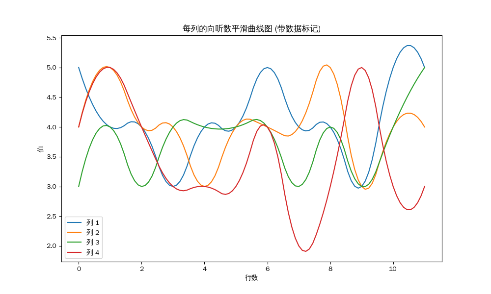
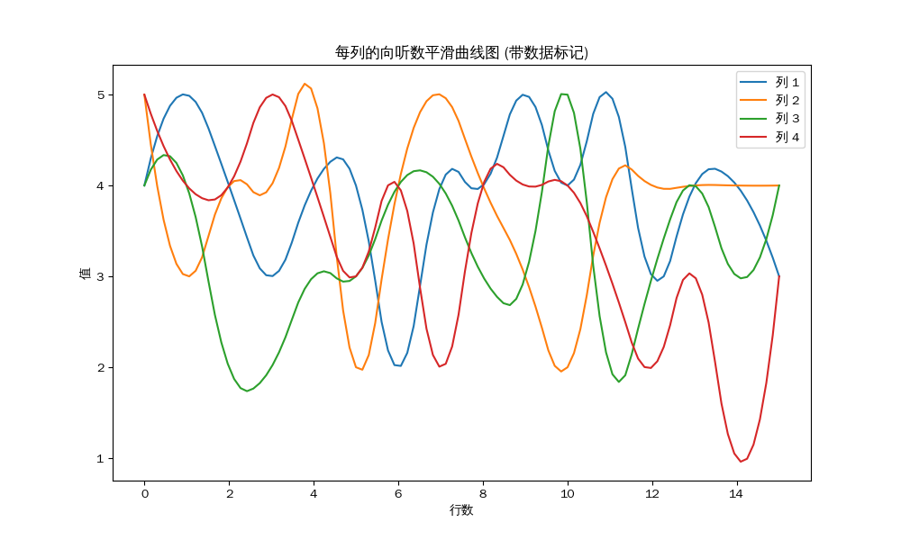
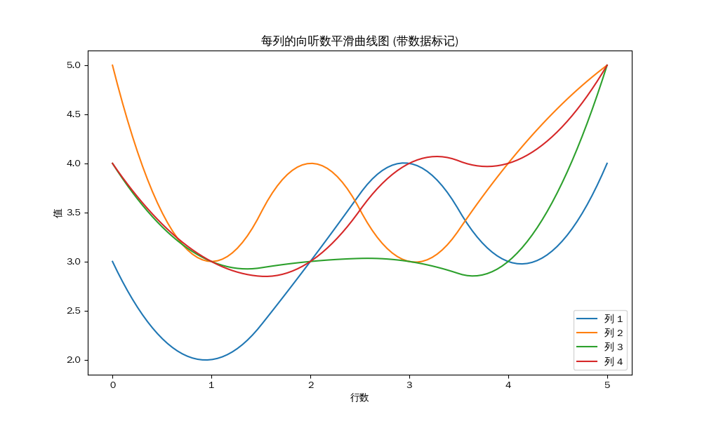
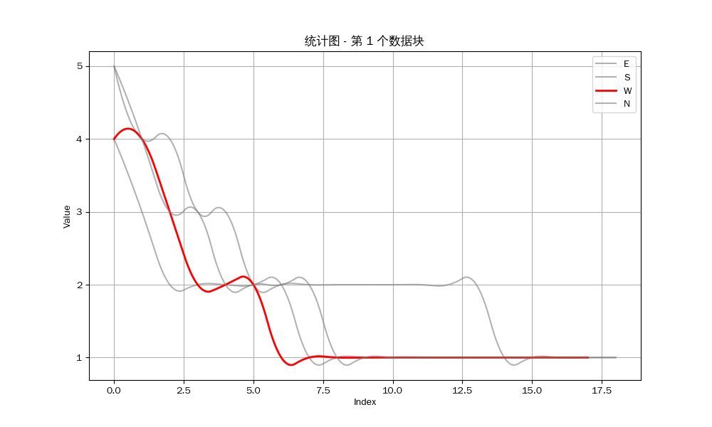
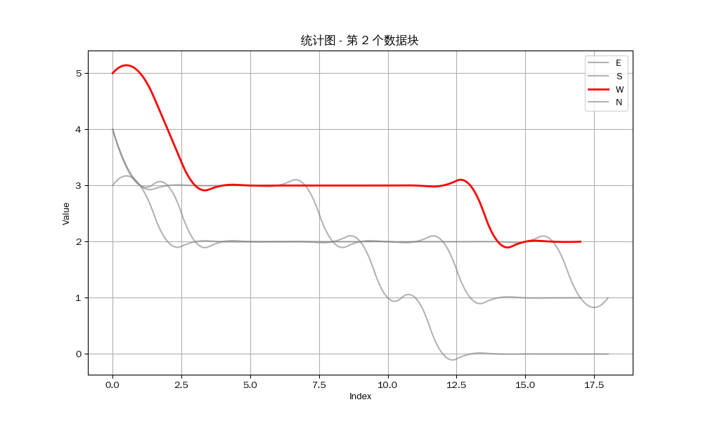
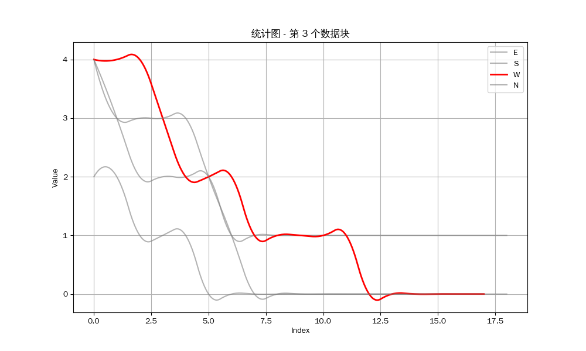
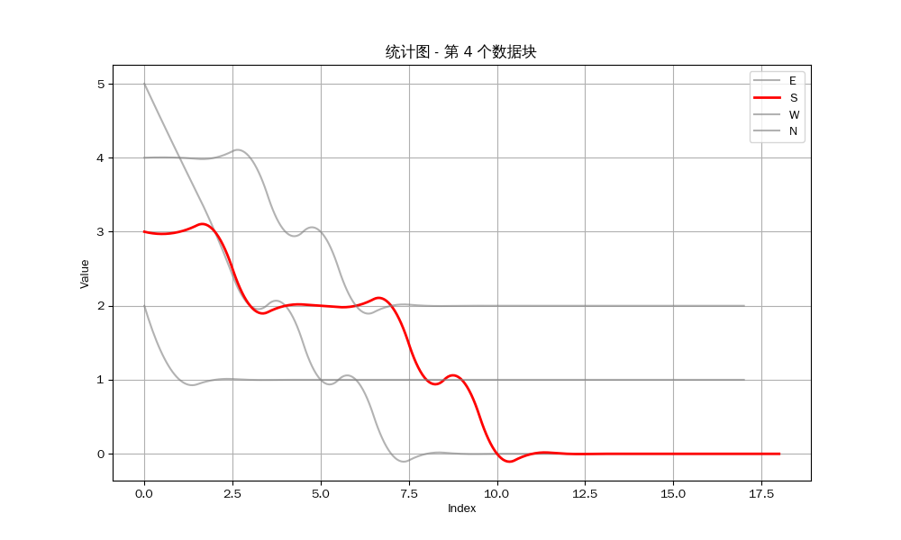
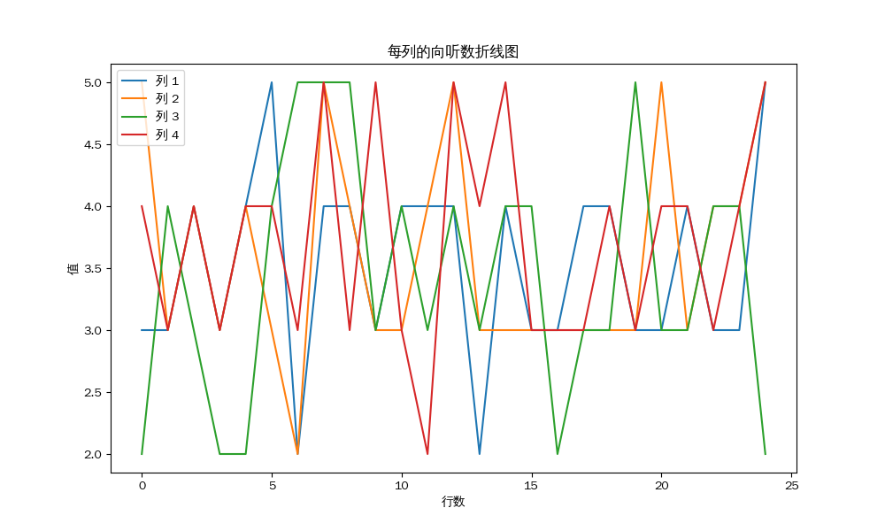
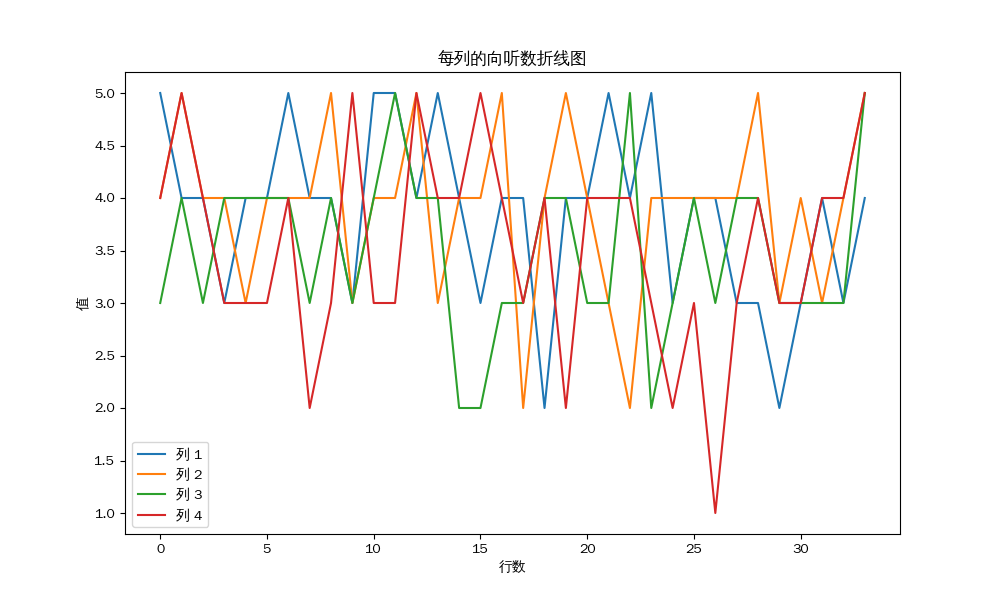

layout: post

title: 雀魂麻将真的有恶调吗？

author: junyu33

tags: 

- cpp
- python
- games

categories: 

- develop

mathjax: true

date: 2024-8-25 13:00:00

---

这篇文章将通过几个小实验来验证雀魂的随机性与公平性。

<!-- more -->

# 问题分析

雀魂麻将由于没有强制的收费项目，所以它不像天凤（凤凰桌）一样有着稳定的收入来源。作为一家商业公司，雀魂的开发商猫粮的目标是通过吸引用户来获取收入。因此，通过篡改牌山来控制用户的输赢是一种常见的商业手段，因为这样可以在某种程度上操纵用户的情绪，从而增加用户的粘性，以及带来冲动消费的可能。这种"篡改牌山来控制用户的输赢"的行为被众多玩家称为“恶调”。

> 雀魂在其公告中声明“雀魂麻将保证游戏牌局生成完全随机，在牌局开始之时牌山序列已经固定，不会针对性地发牌，不会在牌局中篡改牌山”。为了证明此声明，雀魂在2023年5月24日之前引入了MD5加密，5月24日之后引入了SHA256加密，并在2024年2月28日升级为加盐SHA256加密。

根据大二下学期的密码学知识，MD5/SHA256就目前而言可以保证：给出了一个特定的牌山和对应的哈希值，你无法通过篡改牌山来获得一个相同的哈希值，加盐的SHA256也只是增加了篡改的难度而已（因为没有彩虹表可以借鉴）。

> 顺便说一句，这种攻击方式被称为第二原像攻击（second pre-image attack），尽管王小云等人在2004年提出了对MD5的碰撞攻击方法<sup>[3]</sup>，但目前还没有相关文献提出对MD5的第二原像攻击方法<sup>[4]</sup>。因此，其实MD5在这种场景下也是暂时安全的。

因此，雀魂升级为加盐SHA256加密后，只可以佐证**在牌局开始之时牌山序列已经固定**以及**不会在牌局中篡改牌山**，但是无法证明**游戏牌局生成完全随机**和**不会针对性地发牌**。

本文接下来的内容将着重于验证“游戏牌局生成完全随机”（随机性）和“不会针对性地发牌”（公平性）这两个声明。

# 实验设计 

笔者猜测，“恶调”行为可能是通过在发牌时对牌山进行篡改来实现的。主要有两种可能的方式：

- 使每一位玩家发牌时的手牌向听数有明显差距。
- 将某些玩家所需要的牌放在牌山的最后，使得玩家在摸牌时很难摸到。

我们可以通过以下几个实验来验证雀魂的**公平性**：

- 验证每一局发牌结束时，计算每一位玩家的向听数，看是否有明显差距。
- 假设每一位玩家按照纯牌效打牌，计算每一巡四位玩家的向听数，做出条形统计图，看是否有明显差距。
- 计算几局之后，每一位玩家的听牌率，看是否有明显差距。

我们可以通过以下一个实验来验证雀魂的**随机性**：

- 将这些数据和公开牌山生成算法的天凤进行对比，看两者之间是否有明显差距。

# 数据收集

笔者从自己的在雀魂和天凤的牌谱中，抽取了一些记录，列举如下（为了保证抽样公平，两边我都抽取了一个二位的半庄，一个四位的半庄和一个四位的东风）：

> https://tenhou.net/0/log/find.cgi?log=2024081216gm-0009-0000-bfc28ebf&tw=x
>
> https://tenhou.net/0/log/find.cgi?log=2024081415gm-0009-0000-22c53785&tw=x
>
> https://tenhou.net/0/log/find.cgi?log=2024081914gm-0001-0000-f25dab62&tw=x
 
> https://game.maj-soul.com/1/?paipu=jmjsmq-v4x15u70-xd4c-69hi-h8cn-lfnuplvsqzpr_a229216253_2
>
> https://game.maj-soul.com/1/?paipu=jmjsmq-2ty0y7z7-3db5-6gag-gihp-iomhjkrnryry_a229216253_2
>
> https://game.maj-soul.com/1/?paipu=jmjsmp-r4wt5744-3cbe-6g5c-hmbi-gqhsqliloqpo_a229216253_2

为了方便处理数据，我使用了相关代码<sup>[2]</sup>，略作修改，将天凤的牌山转换为雀魂的牌山。

```python
#!/usr/bin/python3
import hashlib
import base64
import re
import gzip
import random
import sys

def _get_seed_from_plaintext_file(file):
    text = file.read()
    match_str = re.search('seed=.* ref', text).group()
    begin_pos = match_str.find(',') + 1
    end_pos = match_str.rfind('"')
    return match_str[begin_pos:end_pos]

def get_seed_from_file(filename):
    GZIP_MAGIC_NUMBER = b'\x1f\x8b'
    f = open(filename, 'rb')
    if f.read(2) == GZIP_MAGIC_NUMBER:
        f.close()
        f = gzip.open(filename, 'rt')
    else:
        f.close()
        f = open(filename, 'r')
    return _get_seed_from_plaintext_file(f)

def seed_to_array(seed_str):
    seed_bytes = base64.b64decode(seed_str)
    result = []
    for i in range(len(seed_bytes) // 4):
        result.append(int.from_bytes(seed_bytes[i*4:i*4+4], byteorder='little'))
    return result

N = 624
mt = [0] * N
mti = N + 1
def init_genrand(s):
    global mt
    global mti
    mt[0] = s & 0xffffffff
    mti = 1
    while mti < N:
        mt[mti] = (1812433253 * (mt[mti-1] ^ (mt[mti-1] >> 30)) + mti)
        mt[mti] &= 0xffffffff
        mti += 1

def init_by_array(init_key, key_length):
    global mt
    init_genrand(19650218)
    i = 1
    j = 0
    k = (N if N > key_length else key_length)
    while k != 0:
        mt[i] = (mt[i] ^ ((mt[i-1] ^ (mt[i-1] >> 30)) * 1664525)) + init_key[j] + j # non linear
        mt[i] &= 0xffffffff
        i += 1
        j += 1
        if i >= N:
            mt[0] = mt[N-1]
            i = 1
        if j >= key_length:
            j = 0
        k -= 1
    k = N - 1
    while k != 0:
        mt[i] = (mt[i] ^ ((mt[i-1] ^ (mt[i-1] >> 30)) * 1566083941)) - i # non linear
        mt[i] &= 0xffffffff
        i += 1
        if i>=N:
            mt[0] = mt[N-1]
            i = 1
        k -= 1
    mt[0] = 0x80000000

haiDisp = ["1m", "2m", "3m", "4m", "5m", "6m", "7m", "8m", "9m", "1p", "2p", "3p", "4p", "5p", "6p", "7p", "8p", "9p", "1s", "2s", "3s", "4s", "5s", "6s", "7s", "8s", "9s", "1z", "2z", "3z", "4z", "5z", "6z", "7z"]

def gen_yama_from_seed(seed_str):
    seed_array = seed_to_array(seed_str)
    init_by_array(seed_array, 2496/4)
    #print(mt[623])
    mt_state = tuple(mt + [624])
    random.setstate((3, mt_state, None))
    for nKyoku in range(10):
        rnd = [0] * 144
        rnd_bytes = b''
        src = [random.getrandbits(32) for _ in range(288)]
        #print(src[0])
        for i in range(9):
            hash_source = b''
            for j in range(32):
                hash_source += src[i*32+j].to_bytes(4, byteorder='little')
            rnd_bytes += hashlib.sha512(hash_source).digest()
        for i in range(144):
            rnd[i] = int.from_bytes(rnd_bytes[i*4:i*4+4], byteorder='little')
        # till here, rnd[] has been generated
        yama = [i for i in range(136)]
        for i in range(136 - 1):
            temp = yama[i]
            yama[i] = yama[i + (rnd[i]%(136-i))]
            yama[i + (rnd[i]%(136-i))] = temp
        # print('nKyoku=' + str(nKyoku) + ' yama=')
        for i in range(135, -1, -1):
            print(haiDisp[yama[i] // 4], end='')
        print('')

def test_mt_init():
    init_genrand(19650218)
    mt_state = tuple(mt + [624])
    random.setstate((3, mt_state, None))
    print(random.getrandbits(32))


if __name__ == "__main__":
    #test_mt_init()
    filename = sys.argv[1]
    seed_str = get_seed_from_file(filename)
    gen_yama_from_seed(seed_str)

```

然后我们在牌山代码前加上自己所在的方位，就可以得到类似这样的实验数据：

```
W 4z1z9m2m0s6m2s1z9p8s7p7z2s1p6m7p8p0p1s4z7s7z8p3p9m4s4z2z4s7m3z1m9m6z3s8m3m2m4p5p7m1s1m3m5z2p4p2p3s2z6m6p4m1s5p7z7p4p4m6z1p6m8p8m5z6s9p1m9s9p6s7s4m5s6p3z9p3z2m1p4m3s2s6p1z7s9m4s8p9s2p5z4p6z2z3p3s7s6z8m8s1p3p5z4s7m6s5p5s3m7z0m2m3p2z9s8s8s6s1m1z2s2p1s4z8m5m7p7m3m6p3z9s5s5m5m
S 7s5z1p4s1z4z9s8p6s9p3m1z5z8m7z1m4z9m3z6p4m7p2s5m5p7s8s1s1s7s4p8m9m3p3m1m1p8s6s9s6p6z8s3z3s9s4m4s1z6s2z5s6m4p9m2p7z2s2z5p9m9p2z7m2m2m6z1s5p2p8p6p6s3s4p1p5m3p7m7z2m0p0s3m0m6m9p7p3m7s4s2p5m1m3z3z6m1m4z2s2p6m8p7m2s5z3p8m9s3p2z9p4m3s7p6z8p6z7z1s5s6p4p5z2m1z3s4s7p7m4m8s1p5s4z8m
E 5p0s2z7s2z8m7m9p3s6m5z1z3p5p2m5z3m3s7m9p4s6s8p8p1z2s3s3z6z9m4m1m5s4s8s9p1z1s1p2p6p3z8s0m2s4s6z9s2p8m4m8p7s1s1p1m6s6s7p4p2s5m3p5s5p8m6m7z8m8s4p6p9s7m6p3z4p2s1p2m7p1s2m3z4z2p6s6z6p1s8p8s9s7z1z7z7s5m9m7p3p5s5z2z5z1m7z3m3p4m0p2m1p9p6m4m2p5m9m9m6z2z4z4z3m4p1m9s4s7m7p6m3s3m7s4z
...
```

# 实验过程

## 实验一：验证起始向听数是否存在差距

计算已知手牌的向听数有现成的轮子<sup>[1]</sup>，我们可以直接使用。

以下是笔者的参考代码：

```cpp
#include <iostream>
#include <vector>
#include <assert.h>
#include <fstream>
#include "calsht.hpp"

// 函数用于将字符转换为数字
int charToIndex(char ch) {
    if (ch >= '1' && ch <= '9') return ch - '1';
    if (ch == '0') return 4;
    std::cout << "Error: invalid character" << std::endl;
    exit(0);
}

// 先给每家发连续四张牌，三轮之后，给东南西北各发一张牌
int cal_offset(char player_position, int seq) {
    int offset = 0;
    if (player_position == 'S') {
        offset = 1;
    } else if (player_position == 'W') {
        offset = 2;
    } else if (player_position == 'N') {
        offset = 3;
    }

    if (seq < 12) {
        int round = seq / 4;
        return round * 16 + offset * 4 + seq % 4;
    } else if (seq == 12) {
        return 48 + offset;
    }
    assert(-1);
    return -1;
}

// 函数根据输入的牌山字符串和玩家方位，返回该玩家的手牌向量
std::vector<int> parseHand(const std::string& tiles, char player_position) {
    std::vector<int> hand(34, 0);  // 34个元素，初始化为0（9万+9筒+9索+7字牌）
    
    for (int i = 0; i < 13; ++i) {
        char ch1 = tiles[cal_offset(player_position, i) * 2];   // 第一个字符是数字
        char ch2 = tiles[cal_offset(player_position, i) * 2 + 1]; // 第二个字符是字母 m/p/s/z

        int index = charToIndex(ch1);
        if (ch2 == 'm') hand[index]++;         // 万子
        else if (ch2 == 'p') hand[9 + index]++; // 筒子
        else if (ch2 == 's') hand[18 + index]++; // 索子
        else if (ch2 == 'z') hand[27 + index]++; // 字牌
    }

    return hand;
}

int main(int argc, char* argv[])
{
    Calsht calsht;

    // Set the location of shanten tables
    calsht.initialize(".");


    std::ifstream file(argv[1]); // 打开文件
    std::string line;

    if (file.is_open()) {
        while (std::getline(file, line)) {  // 逐行读取
            if (!line.empty()) {            // 检查是否是空行
                // std::cout << line << std::endl;
                std::vector<char> player_position = {'E', 'S', 'W', 'N'};
                char direction = line[0];
                std::string tiles = line.substr(2);

                for (auto p : player_position) {
                    std::vector<int> hand = parseHand(tiles, p);

                    auto [sht, mode] = calsht(hand, 4, 7);

                    // std::cout << "Player position: " << p << std::endl;
                    std::cout << sht - 1 << " ";
                }
                std::cout << " " << direction;
                std::cout << std::endl;
            }
            else {
                std::cout << std::endl;
            }
        }
        file.close();  // 关闭文件
    } else {
        std::cerr << "无法打开文件" << std::endl;
        return 1;
    }
    return 0;
}
```

将先前得到了雀魂输入代入，我们可以得到这样的结果：

```
3 4 5 4  W
5 4 5 4  S
4 4 3 4  E
3 4 4 3  E
3 4 3 4  N
4 3 4 4  W
4 4 5 4  W
3 2 4 4  W
3 4 5 4  S
5 3 3 3  S
5 4 4 3  E
4 5 3 5  N

4 5 4 5  W
4 4 5 3  W
2 4 4 4  W
5 3 4 2  S
4 4 5 3  S
3 4 2 3  S
4 2 4 4  S
2 4 5 4  S
4 4 3 4  E
3 3 4 5  N
2 5 4 4  N
4 2 3 5  N
3 2 3 4  W
3 4 4 4  S
4 4 3 1  E
4 4 3 3  N

4 3 5 4  S
3 2 3 3  S
3 4 3 3  E
3 3 4 4  N
4 3 4 3  N
5 5 4 5  W
```

为了方便进行向听数平均值的计算，我将每一列进行了一些平移，使得每个玩家都对应了一个固定的列，笔者自身对应第一列。

使用 `python` 的 `matplotlib` 库，我们可以得到这样的折线统计图：

> 以下示例代码的没有进行插值，因此图像可能不够平滑，但是不影响结果。

```python
import numpy as np
import matplotlib.pyplot as plt
from scipy.interpolate import make_interp_spline

plt.rcParams['font.family'] = 'WenQuanYi Zen Hei'

# 读取数据并处理
data = []
with open('problem1-1.txt', 'r') as file:
    for line in file:
        parts = line.strip().split()
        numbers = list(map(int, parts[:-1]))  # 取前四个数字
        direction = parts[-1]  # 最后一个字母表示方向

        # 根据方向进行循环移位
        if direction == 'S':
            numbers = numbers[1:] + [numbers[0]]  # 向左循环1位
        elif direction == 'W':
            numbers = numbers[2:] + numbers[:2]  # 向左循环2位
        elif direction == 'N':
            numbers = numbers[3:] + numbers[:3]  # 向左循环3位
        # 如果是 'E'，不做任何操作，保持原状

        data.append(numbers)  # 保存处理后的数字

# 输出最后的数字矩阵
for row in data:
    print(row)

# 转换为 NumPy 数组便于计算
matrix = np.array(data)

# 计算每列的平均值
column_means = matrix.mean(axis=0)

# 输出每列的平均值
print("每列的平均值：")
for i, mean in enumerate(column_means, start=1):
    print(f"第 {i} 列的平均值: {mean:.2f}")

# 生成条形统计图
num_rows = matrix.shape[0]
x = np.arange(num_rows)  # 创建 X 轴的索引

# 绘制每一列的数据作为一条线
plt.figure(figsize=(10, 6))
for i in range(matrix.shape[1]):
    plt.plot(x, matrix[:, i], label=f'列 {i+1}')

# 设置图形标签和标题
plt.xlabel('行数')
plt.ylabel('值')
plt.title('每列的向听数折线图')
plt.legend()

# 显示图形
plt.show()
```

二位的南场：

```
每列的平均值：
第 1 列的平均值: 4.17
第 2 列的平均值: 4.00
第 3 列的平均值: 3.75
第 4 列的平均值: 3.50
```





四位的南场：

```
每列的平均值：
第 1 列的平均值: 3.88
第 2 列的平均值: 3.81
第 3 列的平均值: 3.31
第 4 列的平均值: 3.44
```



二位的东场：

```
每列的平均值：
第 1 列的平均值: 3.17
第 2 列的平均值: 4.00
第 3 列的平均值: 3.50
第 4 列的平均值: 3.83
```



结论：虽然每一位玩家的向听数有所差距，但是差距并不明显，我认为不能在统计意义上构成显著差距，因此**并不能证明配牌阶段的不公平性**。

## 实验二：验证纯牌效打法，每一巡四位玩家的向听数是否存在差距

我的设计思路是这样的，如果雀魂真的将一位玩家需要的牌放在了牌山的最后，那么即使这位玩家可以“看到之后几巡的牌”，做出比我们正常玩家更好的决策，TA的向听数依旧会比其他玩家高。

另外为了代码编写方便，再假设游戏中不会出现吃碰杠的情况，这样在可以简化代码的情况下不影响结果（因为想要摸的牌在最后，你吃碰杠也还是摸不到）。

因此，我们可以设计一套基于深度优先搜索（DFS）的算法，来模拟玩家在能预知后三巡的进张并且纯牌效的打法下，每一巡的向听数。

以下是笔者的参考代码：

```cpp
#include <iostream>
#include <vector>
#include <assert.h>
#include <fstream>
#include <cmath>
#include "calsht.hpp"
#define CONFIG_SEARCH_DEPTH 3

Calsht calsht;
std::string tiles;
int curChange, bestChange;

// 函数用于将字符转换为数字
int charToIndex(char ch) {
    if (ch >= '1' && ch <= '9') return ch - '1';
    if (ch == '0') return 4;
    std::cout << "Error: invalid character" << std::endl;
    exit(0);
}

int positionToIndex(char player_position) {
    if (player_position == 'E') return 0;
    if (player_position == 'S') return 1;
    if (player_position == 'W') return 2;
    if (player_position == 'N') return 3;
    std::cout << "Error: invalid position" << std::endl;
    exit(0);
}

// 先给每家发连续四张牌，三轮之后，给东南西北各发一张牌
int cal_offset(char player_position, int seq) {
    int offset = positionToIndex(player_position);

    if (seq < 12) {
        int round = seq / 4;
        return round * 16 + offset * 4 + seq % 4;
    } else if (seq == 12) {
        return 48 + offset;
    }
    assert(-1);
    return -1;
}

// 发牌后牌山的第53张开始为摸牌，前52张是发牌使用的
int calcDrawIndex(char player_position, int turn) {
    int baseDraw = 52 + (turn - 1) * 4; // 每轮摸4张牌
    int drawIndex = baseDraw + positionToIndex(player_position);
    
    return drawIndex;
}

int tilePositionTohandPosition(char number, char type) {
    int index = charToIndex(number);
    if (type == 'm') return index;
    if (type == 'p') return 9 + index;
    if (type == 's') return 18 + index;
    if (type == 'z') return 27 + index;
    assert(-1);
    return -1;
}

// 函数根据输入的牌山字符串和玩家方位，返回该玩家的手牌向量
std::vector<int> parseHand(const std::string& tiles, char player_position) {
    std::vector<int> hand(34, 0);  // 34个元素，初始化为0（9万+9筒+9索+7字牌）
    
    for (int i = 0; i < 13; ++i) {
        char ch1 = tiles[cal_offset(player_position, i) * 2];   // 第一个字符是数字
        char ch2 = tiles[cal_offset(player_position, i) * 2 + 1]; // 第二个字符是字母 m/p/s/z
        hand[tilePositionTohandPosition(ch1, ch2)]++;
    }

    return hand;
}

int getNewHandPosition(char player_position, int turn) {
    char ch1 = tiles[calcDrawIndex(player_position, turn) * 2];   // 第一个字符是数字
    char ch2 = tiles[calcDrawIndex(player_position, turn) * 2 + 1]; // 第二个字符是字母 m/p/s/z
    int newHandPosition = tilePositionTohandPosition(ch1, ch2);
    return newHandPosition;
}

void dfsChangeHand(std::vector<int> curHand, int depth, int turn, 
        int& bestSht, std::vector<int>& bestHand, char player_position) {
    if (depth == 0) {
        return;  // 达到最大深度，结束搜索
    }

    auto [sht, mode] = calsht(curHand, 4, 7);

    if (sht <= bestSht) {
        bestSht = sht;
        bestHand = curHand;
        bestChange = curChange;
    }

    for (int i = 0; i < 34; i++) {
        if (curHand[i] > 0) {
            std::vector<int> newHand = curHand;
            newHand[i]--;  // 减少当前牌
            newHand[getNewHandPosition(player_position, turn)]++;  // 增加新牌

            auto [newSht, newMode] = calsht(newHand, 4, 7);
            
            // 如果新手牌比当前更好，继续深入搜索
            if (newSht <= sht) {
                if (depth == CONFIG_SEARCH_DEPTH) {
                    curChange = i;
                }
                dfsChangeHand(newHand, depth - 1, turn + 1, bestSht, bestHand, player_position);
            }
        }
    }
}

// 修改后的changeHand函数，增加了递归搜索
std::vector<int> changeHand(std::vector<int>& curHand, int turn, char player_position) {
    std::vector<int> bestHand = curHand;
    auto [bestSht, mode] = calsht(curHand, 4, 7);
    int curSht = bestSht;

    int searchDepth = CONFIG_SEARCH_DEPTH;  // 假设搜索深度为3，你可以根据需要调整
    dfsChangeHand(curHand, searchDepth, turn, bestSht, bestHand, player_position);

    if (bestSht < curSht) { 
        curHand[bestChange]--;
        curHand[getNewHandPosition(player_position, turn)]++;
    }
    return curHand;
}


int main(int argc, char* argv[])
{
    // Set the location of shanten tables
    calsht.initialize(".");


    std::ifstream file(argv[1]); // 打开文件
    std::string line;

    if (file.is_open()) {
        while (std::getline(file, line)) {  // 逐行读取
            if (!line.empty()) {            // 检查是否是空行
                // std::cout << line << std::endl;
                std::vector<char> player_position = {'E', 'S', 'W', 'N'};
                char direction = line[0];
                tiles = line.substr(2);

                for (auto p : player_position) {
                    std::vector<int> hand = parseHand(tiles, p);

                    auto [sht, mode] = calsht(hand, 4, 7);

                    std::cout << sht - 1 << " ";

                    for (int i = 1; i <= std::ceil((70 - positionToIndex(p)) / 4.0); i++) {
                        hand = changeHand(hand, i, p);  // 使用修改后的搜索算法
                        auto [sht, mode] = calsht(hand, 4, 7);
                        std::cout << sht - 1 << " ";
                    }
                    std::cout << p << " " << std::endl;

                }
                std::cout << direction << std::endl;
            }
            else {
                std::cout << std::endl;
            }
        }
        file.close();  // 关闭文件
    } else {
        std::cerr << "无法打开文件" << std::endl;
        return 1;
    }
    return 0;
}
```

将先前得到了雀魂输入代入（这里以我四位的南场为例），我们可以得到类似这样的结果：

> 第一到四行是东南西北每一巡的向听数，第五行是自家的方位。

```
4 3 2 2 2 2 2 1 1 1 1 1 1 1 1 1 1 1 1 E 
5 4 4 3 3 2 2 2 2 2 2 2 2 2 1 1 1 1 1 S 
4 4 3 2 2 2 1 1 1 1 1 1 1 1 1 1 1 1 W 
5 4 3 3 2 2 2 2 1 1 1 1 1 1 1 1 1 1 N 
W
4 3 3 2 2 2 2 2 2 2 1 1 0 0 0 0 0 0 0 E 
4 3 3 3 3 3 3 3 2 2 2 2 2 2 2 2 2 1 1 S 
5 5 4 3 3 3 3 3 3 3 3 3 3 3 2 2 2 2 W 
3 3 2 2 2 2 2 2 2 2 2 2 2 1 1 1 1 1 N 
W
2 2 1 1 1 0 0 0 0 0 0 0 0 0 0 0 0 0 0 E 
4 3 2 2 2 2 1 1 1 1 1 1 1 1 1 1 1 1 1 S 
4 4 4 3 2 2 2 1 1 1 1 1 0 0 0 0 0 0 W 
4 3 3 3 3 2 1 0 0 0 0 0 0 0 0 0 0 0 N 
W
5 4 3 2 2 1 1 0 0 0 0 0 0 0 0 0 0 0 0 E 
3 3 3 2 2 2 2 2 1 1 0 0 0 0 0 0 0 0 0 S 
4 4 4 4 3 3 2 2 2 2 2 2 2 2 2 2 2 2 W 
2 1 1 1 1 1 1 1 1 1 1 1 1 1 1 1 1 1 N 
S
4 3 3 2 1 0 0 0 0 0 0 0 0 0 0 0 0 0 0 E 
4 4 4 3 3 3 3 2 1 1 1 1 1 1 1 0 0 0 0 S 
5 5 4 3 3 3 3 2 1 1 1 0 0 0 0 0 0 0 W 
3 2 2 2 2 2 2 1 1 0 0 0 0 0 0 0 0 0 N 
S
3 2 1 1 1 1 0 0 0 0 0 0 0 0 0 0 0 0 0 E 
4 3 2 2 2 1 1 1 1 1 1 1 1 1 1 1 1 1 0 S 
2 2 2 2 2 2 2 1 1 1 1 0 0 0 0 0 0 0 W 
3 3 3 3 3 2 1 1 1 0 0 0 0 0 0 0 0 0 N 
S
4 4 4 3 2 1 0 0 0 0 0 0 0 0 0 0 0 0 0 E 
2 2 2 2 1 1 1 0 0 0 0 0 0 0 0 0 0 0 0 S 
4 4 3 2 2 2 2 2 2 2 2 2 2 2 2 2 2 2 W 
4 4 3 2 1 1 0 0 0 0 0 0 0 0 0 0 0 0 N 
S
2 2 2 2 1 1 1 1 1 1 1 1 1 1 0 0 0 0 0 E 
4 4 3 3 3 2 2 2 2 2 2 2 2 2 1 1 1 1 1 S 
5 4 3 3 3 3 2 2 2 1 1 1 0 0 0 0 0 0 W 
4 3 2 2 1 1 1 1 1 0 0 0 0 0 0 0 0 0 N 
S
4 4 4 4 3 2 2 2 2 2 2 2 1 1 1 1 1 1 1 E 
4 4 3 3 3 2 2 2 2 2 2 2 1 1 1 1 1 1 1 S 
3 3 2 2 2 1 1 1 1 0 0 0 0 0 0 0 0 0 W 
4 3 3 2 1 1 0 0 0 0 0 0 0 0 0 0 0 0 N 
E
3 3 2 2 2 2 2 2 2 2 2 2 2 2 2 1 1 1 1 E 
3 2 2 2 2 2 2 1 1 1 1 1 1 1 1 0 0 0 0 S 
4 4 4 3 3 3 3 3 3 3 3 3 3 3 3 3 3 3 W 
5 5 5 4 4 4 3 3 2 2 1 1 1 1 1 1 1 1 N 
N
2 2 2 2 2 1 1 1 1 1 1 1 1 0 0 0 0 0 0 E 
5 4 3 3 3 3 2 2 2 2 2 2 2 1 1 0 0 0 0 S 
4 4 3 3 3 3 3 3 2 2 2 2 1 1 1 1 1 1 W 
4 4 4 3 3 2 2 2 2 2 2 1 1 0 0 0 0 0 N 
N
4 3 2 2 2 2 2 2 2 2 1 1 1 1 1 1 1 1 1 E 
2 2 2 2 2 2 2 2 2 2 2 2 2 1 1 0 0 0 0 S 
3 3 3 2 2 2 2 2 1 1 1 0 0 0 0 0 0 0 W 
5 5 4 3 3 2 2 2 2 2 1 1 1 1 1 1 0 0 N 
N
3 2 2 2 2 2 2 2 2 2 2 2 2 2 2 2 2 2 2 E 
2 1 1 1 1 1 1 1 1 1 1 1 1 1 1 1 1 1 1 S 
3 3 2 1 1 1 1 1 1 1 1 1 1 1 1 1 1 1 W 
4 4 3 2 2 1 1 1 1 1 1 1 1 1 1 1 1 1 N 
W
3 3 2 2 1 1 1 1 1 1 1 1 1 1 0 0 0 0 0 E 
4 3 3 2 1 1 1 1 1 1 1 1 1 1 1 1 0 0 0 S 
4 3 3 3 3 3 3 2 2 2 2 2 1 1 1 1 1 0 W 
4 4 4 4 3 3 3 3 2 2 2 2 2 1 1 1 1 1 N 
S
4 4 4 3 3 2 2 2 2 2 2 2 2 2 2 2 2 2 2 E 
4 3 2 1 0 0 0 0 0 0 0 0 0 0 0 0 0 0 0 S 
3 3 2 2 2 2 2 2 2 2 2 2 2 2 2 2 2 2 W 
1 1 1 1 1 1 1 1 1 1 1 1 1 1 1 1 1 1 N 
E
4 3 3 3 3 3 3 2 2 1 1 1 1 1 1 1 1 1 1 E 
4 4 3 3 2 2 2 2 2 2 1 1 1 1 1 1 1 1 1 S 
3 3 2 2 2 2 2 1 0 0 0 0 0 0 0 0 0 0 W 
3 3 2 2 2 2 2 2 1 1 0 0 0 0 0 0 0 0 N 
N
```

然后照样使用 `python` 的 `matplotlib` 库，我们可以得到这样的折线统计图：

```python
import numpy as np
import matplotlib.pyplot as plt
from scipy.interpolate import make_interp_spline

plt.rcParams['font.family'] = 'WenQuanYi Zen Hei'

tenpai_cnt = 0
tot_cnt = 0

# 模拟从文件中读取数据的函数
def read_data_from_file(file_path):
    with open(file_path, 'r') as file:
        data_block = []
        while True:
            lines = [file.readline().strip() for _ in range(5)]
            if lines[0] == '':  # 遇到空行结束
                break
            data_block.append(lines)
        return data_block

# 解析每个数据块并生成统计图
def plot_data_blocks(data_blocks):
    global tot_cnt, tenpai_cnt
    for block_index, block in enumerate(data_blocks):
        tot_cnt += 1
        data = []
        labels = []

        # 解析数据块中的每行数据
        for line in block[:-1]:  # 最后一行是方位字母，不包含数值
            values = list(map(int, line.split()[:-1]))  # 去掉方位字母，保留数值
            labels.append(line.split()[-1])  # 保存方位字母
            data.append(values)

        highlight_label = block[-1].strip()  # 最后一行表示需要highlight的方位

        # 绘制每个数据块的统计图
        plt.figure(figsize=(10, 6))
        for i, row in enumerate(data):
            x = np.arange(len(row))
            x_smooth = np.linspace(x.min(), x.max(), 300)
            spl = make_interp_spline(x, row, k=2)
            y_smooth = spl(x_smooth)
    
            # 如果是需要highlight的方位，使用红色，否则使用灰色
            if labels[i] == highlight_label:
                if 0 in row:
                    tenpai_cnt += 1
                plt.plot(x_smooth, y_smooth, label=labels[i], color='red', linewidth=2)
            else:
                plt.plot(x_smooth, y_smooth, label=labels[i], color='gray', alpha=0.6)

        plt.title(f'统计图 - 第 {block_index + 1} 个数据块')
        plt.xlabel('Index')
        plt.ylabel('Value')
        plt.legend()
        plt.grid(True)
        plt.show()

# 测试代码（使用从文件读取的数据）
file_path = '../build/problem3.txt' 
blocks = read_data_from_file(file_path)
plot_data_blocks(blocks)
```

我们可以得到以下的结果：









众所周知，立直麻将注重防守，如果你察觉到对方听牌，如果你对自己手牌没有十足的把握，那么你应该选择弃和来防止自己打点的损失。因此，**是否能经常做到第一个听牌是决定你是否能赢得牌局的关键**。

然而从统计图中可以看出，我方要么就是不能听牌，要么就是不能成为听牌的第一个玩家。我目测了剩下的12组数据，发现只有唯一一组我作为北家与东家在同一巡听牌，但因为我是北家，所以我并不能成为第一个听牌的玩家。也就是说，**至少在这一组数据中，我一次也没有做到第一个听牌**。

那我们如何计算这个数据是否合理呢？我们可以先计算在绝对公平的情况下，每一位玩家成为第一个听牌的概率。我们可以做以下粗略的估计：

> 根据统计数据<sup>[5]</sup>，我们知道一局麻将和牌的概率是84\%，而听牌是和牌的必要条件，因此每一位玩家成为第一个听牌的概率大约是21\%。

接下来，我们可以计算我这种情况发生的概率：

$$P = (1 - 0.21)^{16} = 0.023 < 0.05$$

显然是一个非常小的概率，因此我们可以认为这种情况是不合理的。

结论：雀魂的确有可能通过操纵牌山的方式（例如将玩家需要的牌放在牌山的最后）来影响玩家的向听数。**雀魂的发牌在短期内应该是不公平的**。

## 实验三：计算每一位玩家的听牌概率的平均值

将原来的 python 代码稍作修改即可：

```python
import numpy as np
import matplotlib.pyplot as plt
from scipy.interpolate import make_interp_spline

plt.rcParams['font.family'] = 'WenQuanYi Zen Hei'

tenpai_cnt = 0
tot_cnt = 0

# 模拟从文件中读取数据的函数
def read_data_from_file(file_path):
    with open(file_path, 'r') as file:
        data_block = []
        while True:
            lines = [file.readline().strip() for _ in range(5)]
            if lines[0] == '':  # 遇到空行结束
                break
            data_block.append(lines)
        return data_block

# 解析每个数据块并生成统计图
def plot_data_blocks(data_blocks):
    global tot_cnt, tenpai_cnt
    for block_index, block in enumerate(data_blocks):
        tot_cnt += 1
        data = []
        labels = []

        # 解析数据块中的每行数据
        for line in block[:-1]:  # 最后一行是方位字母，不包含数值
            values = list(map(int, line.split()[:-1]))  # 去掉方位字母，保留数值
            labels.append(line.split()[-1])  # 保存方位字母
            data.append(values)

        highlight_label = block[-1].strip()  # 最后一行表示需要highlight的方位

        # 绘制每个数据块的统计图
        plt.figure(figsize=(10, 6))
        for i, row in enumerate(data):
            x = np.arange(len(row))
            x_smooth = np.linspace(x.min(), x.max(), 300)
            spl = make_interp_spline(x, row, k=2)
            y_smooth = spl(x_smooth)
    
            # 如果是需要highlight的方位，使用红色，否则使用灰色
            if labels[i] == highlight_label:
                if 0 in row:
                    tenpai_cnt += 1
                plt.plot(x_smooth, y_smooth, label=labels[i], color='red', linewidth=2)
            else:
                plt.plot(x_smooth, y_smooth, label=labels[i], color='gray', alpha=0.6)

        plt.title(f'统计图 - 第 {block_index + 1} 个数据块')
        plt.xlabel('Index')
        plt.ylabel('Value')
        plt.legend()
        plt.grid(True)
        # plt.show()

# 测试代码（使用从文件读取的数据）
file_path = '../build/problem3.txt'
blocks = read_data_from_file(file_path)
plot_data_blocks(blocks)
print(tot_cnt, tenpai_cnt)
print(tenpai_cnt / tot_cnt)
```

在雀魂样本的 34 局中，我成功听牌的次数是 17 次，因此听牌概率的平均值是 0.5。

另外其余三位玩家的听牌概率的平均值是 0.441, 0.588, 0.588。

结论：虽然听牌概率的平均值有所差距，但是差距并不明显，我认为不能在统计意义上构成显著差距，因此**并不能证明听牌概率的不公平性**。

## 实验四：将这些数据与天凤进行对比

### 起手

我认为既然天凤公开了牌山的生成代码，参考资料<sup>[2]</sup>也对其进行了验证。因为天凤的牌山代码是基于mt19937的伪随机数生成器，因此我们可以认为天凤的牌山是随机的。

对于起手平均向听数的25组天凤数据，结果如下：

```
每列的平均值：
第 1 列的平均值: 3.52
第 2 列的平均值: 3.60
第 3 列的平均值: 3.44
第 4 列的平均值: 3.72
```



然后这是雀魂34组数据：

```
每列的平均值：
第 1 列的平均值: 3.85
第 2 列的平均值: 3.91
第 3 列的平均值: 3.50
第 4 列的平均值: 3.53
```



从直觉来看，雀魂的四位玩家的起手平均向听数比天凤更高，极差比天凤更大（并且是在雀魂样本量比天凤更大的情况下）。因此，我们可以认为雀魂的手牌生成**有可能不随机**。

### 盘中

先前那一节已经证明，雀魂的发牌在短期内应该是不公平的。而随机是公平的必要条件，因此我们可以认为雀魂的**盘中牌山是不随机的**。

### 听牌概率

我们将同样计算听牌概率的代码代入了天凤数据，结果在天凤的25场对局中，我能够听牌的概率是19次。而前文说过，雀魂34场对局中我只有17次可以听牌。

在大二上期的概率论与数理统计我们学过假设检验相关的知识，我们在这里可以使用单侧的两样本比例检验来判断雀魂的听牌率是否显著小于天凤的听牌率：

要判断 A （雀魂）的成功率是否显著小于 B（天凤），我们可以进行 **单侧的两样本比例检验**，而不是双侧检验。该检验用于判断 A 的成功率是否显著小于 B 的成功率。

- A 样本：成功 17 次，样本量 34 次，成功率 $p_A = \frac{17}{34} = 0.5$
- B 样本：成功 19 次，样本量 25 次，成功率 $p_B = \frac{19}{25} = 0.76$

1. **设定假设**：
   - **原假设（$H_0$）**：A 和 B 的成功率相等，即 $p_A = p_B$。
   - **备择假设（$H_1$）**：A 的成功率小于 B 的成功率，即 $p_A < p_B$。

2. **计算总体成功率**（合并的成功率 $p_{\text{pool}}$）：
   $$p_{\text{pool}} = \frac{\text{A 成功次数 + B 成功次数}}{\text{A 样本量 + B 样本量}} = \frac{17 + 19}{34 + 25} = \frac{36}{59} \approx 0.6102$$

3. **计算标准误差**：
   $$SE = \sqrt{p_{\text{pool}} \cdot (1 - p_{\text{pool}}) \cdot \left( \frac{1}{n_A} + \frac{1}{n_B} \right)}$$
   其中 $n_A = 34$，$n_B = 25$，代入得：
   $$SE = \sqrt{0.6102 \cdot (1 - 0.6102) \cdot \left( \frac{1}{34} + \frac{1}{25} \right)} \approx 0.1289$$

4. **计算 z 值**：
   $$z = \frac{p_A - p_B}{SE} = \frac{0.5 - 0.76}{0.1289} \approx -2.016$$

5. **查找 p 值**（单侧检验）：
   根据标准正态分布表，z 值为 -2.016 对应的单侧 p 值大约为 0.022。

6. **结论**：
   - 如果 p 值小于显著性水平（通常 α = 0.05），则我们拒绝原假设，认为 A 的成功率显著小于 B。
   - 在这里，p 值为 0.022，明显小于 0.05，因此我们可以拒绝原假设，**A 的成功率显著小于 B**。

在显著性水平 0.05 下，A 的成功率（50%）与 B 的成功率（76%）存在显著差异，且 A 的成功率显著小于 B 的成功率。因此，**从听牌概率的角度来看，雀魂的发牌肯定不是随机的**。

# 实验总结

1. 雀魂的起手牌平均向听数更大，方差也更大。符合一些人认为“雀魂配牌比较夸张”的看法。
2. 雀魂很有可能通过将一位玩家需要的牌放在牌山的末尾，来降低一个玩家胜率。因此雀魂在**较短的时间尺度**不具备**公平性**。
3. 雀魂的发牌不具备**随机性**。可以认为，雀魂的每一位玩家都有恶调，只是恶调的程度不同。

[1]: https://github.com/tomohxx/shanten-number
[2]: https://81100118.github.io/2021/01/01/%E5%A4%A9%E5%87%A4%E7%89%8C%E5%B1%B1%E7%94%9F%E6%88%90%E7%AE%97%E6%B3%95%E5%8F%8A%E5%85%B6%E9%AA%8C%E8%AF%81/
[3]: https://eprint.iacr.org/2004/199.pdf
[4]: https://crypto.stackexchange.com/questions/3441/is-a-second-preimage-attack-on-md5-feasible
[5]: https://note.com/hagure_melon/n/nbc0ae46c3004
