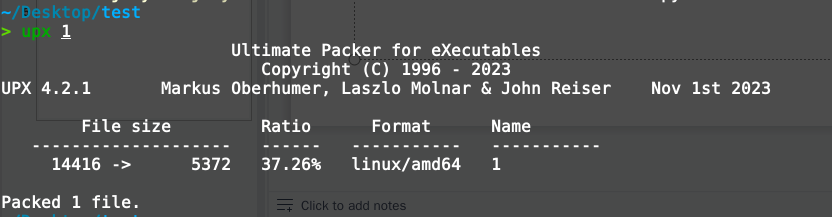
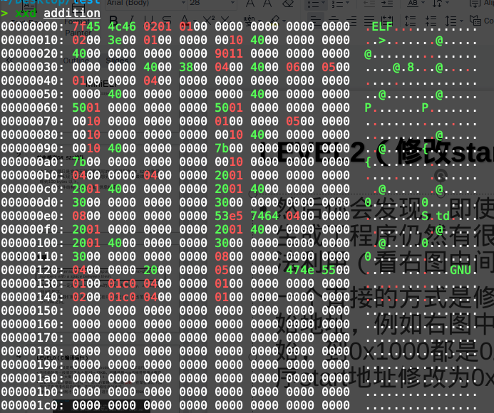
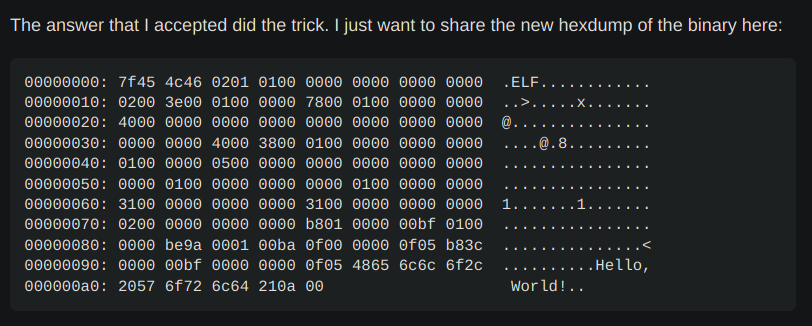
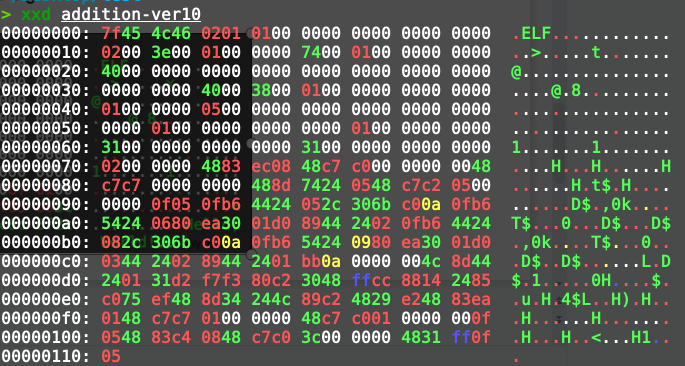
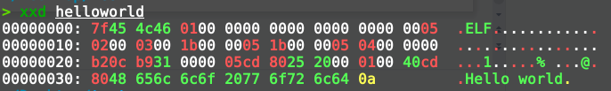
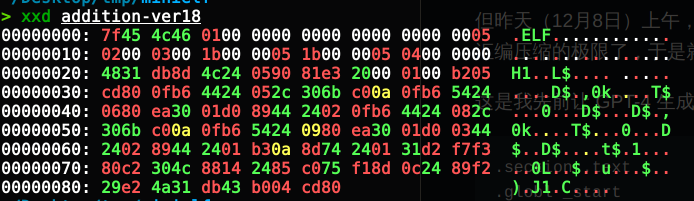
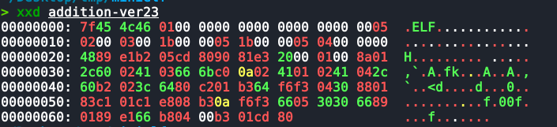
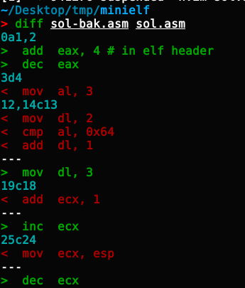
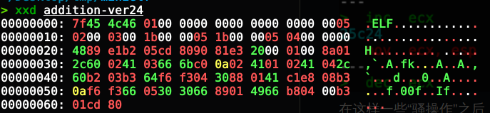

layout: post

title: MiniELF

author: junyu33

mathjax: true

tags: 

- assembly
- misc

categories: 

- ctf

date: 2023-12-10 00:00:00

---

尝试编写一个尽量小的ELF文件来完成 A + B problem，其中输入为`XX YY`的形式（`X`和`Y`都是0到9的数字），输出不含LF/CRLF。

经过几天的努力，我成功把程序压缩到了 99 bytes。

```
> xxd addition-ver24
00000000: 7f45 4c46 0100 0000 0000 0000 0000 0005  .ELF............
00000010: 0200 0300 1b00 0005 1b00 0005 0400 0000  ................
00000020: 4889 e1b2 05cd 8090 81e3 2000 0100 8a01  H......... .....
00000030: 2c60 0241 0366 6bc0 0a02 4101 0241 042c  ,`.A.fk...A..A.,
00000040: 60b2 03b3 64f6 f304 3088 0141 c1e8 08b3  `...d...0..A....
00000050: 0af6 f366 0530 3066 8901 4966 b804 00b3  ...f.00f..If....
00000060: 01cd 80                                  ...
```

<!-- more -->

# MiniELF

## A + B Problem

You need to read the two numbers from STDIN, and output them to STDOUT.

The dataset ensures that both input integers are two-digit numbers with a space between them.

Output number shoud **not** have extra CR/LF/CRLF.

## Context

* Linux v5.8+ kernel
* glibc v2.33+
* Support dynamic linking
* x86_64 architecure

## score compute

You get a guaranteed score as long as the metrics you get are higher than a certain BASELINE ($4096$ bytes). Otherwise, you get a score strictly equal to the following formula: ($r$ indicates your ranking, $s$ indicates your final score, $s_o$ indicates the tasks overall core)

$$ s = \frac{2}{2^r}s_o $$

## solution

### Level 0（C编译运行）

一个显然的做法是用C语言写个A+B problem，然后gcc编译运行。这样做的话一般情况下大小在15～17KB，如果使用strip去掉符号表大概在14KB左右。

其实在C代码的基础上还有一个优化的策略，那就是加壳，在某些情况下加壳除了有混淆代码的作用，还可以压缩程序的体积。例如使用upx对刚才去掉符号表的程序进行加壳，可以压缩到5KB左右。



### Level 1（直接写汇编）

当然，由于C语言在编译时会链接glibc的相关库（即使是动态链接，符号表、PLT、GOT等也会占据一定的空间），而我们用到的`scanf`和`printf`可以用`syscall read/write`代替，这点做二进制的同学应该都知道。

因此，还不如直接写汇编来抛弃glibc带来的空间消耗。我当时直接让GPT4生成了相应的汇编代码，然后稍微做了点修改就跑通了题目。大小在4～5 KB之间，但离 baseline 还差了一点。

### Level 2（修改start地址）

然后你会发现，即使使用汇编，生成了程序仍然有很多的空间没法利用。比如下图中从`0x150`开始的一堆零字节。



一个直接的方式是修改程序的起始地址，例如右图中从`0x150`开始，到`0x1000`都是0。可以把程序start地址修改为`0x400150`即可。具体的修改方式可以参考man elf，当然你瞎蒙，把所有的`0x401000`改完似乎也没问题。（其中一个在`0x18`处）

我最后的大小是 652 byte，已经可以进 baseline 了。

### Level 3（裁剪ELF header 和 footer）

然后这个时候，我看到了 stackoverflow 的[这篇回答](https://stackoverflow.com/questions/72930779/what-is-the-smallest-x86-64-hello-world-elf-binary)，发现其实 ELF 的 header 仍然有裁剪的空间，并且 footer 是完全可以去掉的。



因此，我 copy 了回答的 header，把start地址从`0x78`修改到`0x74`，然后把自己的机器码覆盖到`0x74`的位置，跑一跑，居然真的可以运行！

于是，我的程序大小缩减到了273 byte。



### LEVEL 4（进一步裁剪header）

之后，我做了一些较为细碎的裁剪工作，从273 byte 裁剪到了235 byte。此时，有人交了一发205 byte，这下没法了，ELF header还是得继续看。

我又找到了[这篇回答](https://codegolf.stackexchange.com/questions/5696/shortest-elf-for-hello-world-n)，它把一个 helloworld 压倒了惊人的 61 byte 的大小！



我仔细看了好一会儿，才理解了ELF读取文件时，哪些参数是不可或缺的，具体解释如下:

- 读取文件开头的魔数`0x464c457f`，来判断是否为ELF文件。不能修改。
- `0x4`是位数、`0x5`是alignment，`0x6`是version，`0x7`是OS/ABI，这些没办法修改。
- `0x10`指示文件类型（可执行），`0x12`字节指示架构（x86），无法修改。
- `0x18`~`0x1b` 指示entrypoint
- `0x1c`~`0x1f` 指示 program 段的起始地址，`0x2a`~`0x2b`指示 program 段的大小，`0x2c`~`0x2d`指示 program 段的个数。

在program段中：

- 前4字节是offset，`0x4`～`0x7`是虚拟地址，然后`0x8`～`0xb`是物理地址，`0xc`~`0xf`是文件大小，`0x10`～`0x13`是内存大小，剩下8字节是flag和align，不用管。
- 需要保证虚拟地址加上代码段在文件的偏移对应的是entrypoint的地址。例如virt = `0x500000`, offset(code) = `0x1b`，那么 entrypoint = `0x50001b`

总的来说，header中只有`0x20`到`0x29`，以及`0x2e`以后的字节是可以控制的。（当然上图通过构造一些指令，也成功利用上了`0x1b`到`0x1f`的空间，当然这是后话）

为了处理 `0x2a` 到 `0x2d` 这四个字节无法利用的问题，我选择了构造相关指令（或者选择使用跳转指令）。这两者都是充分利用了空间的选择。

经过这样的操作后，我的程序压缩到了 138 byte。



### LEVEL5（修改算法）

当然，故事仍然没有结束，我又裁剪了一下，把 138 byte 剪到了 131 byte，然后刷了一下榜。

但昨天（12月8日）上午，对手把这个数据更新到了 119 byte，其实当时我是有 117 byte 的存货。而当时我快到我汇编压缩的极限了，于是就没急着交。

这是我先前让 GPT-4 生成的汇编代码（其实经过了一些优化）：

```asm
.section .text
.globl _start

_start:
    # Read the input string "xy zw"
    add $3, %al           # syscall number for read
    lea (%esp), %ecx     # buffer to store the input string
    mov $5, %dl           # number of bytes to read ("xy zw")
    int $0x80             # syscall

    # Convert first number from ASCII to integer
    movzbl (%ecx), %eax  # load first digit (x)
    sub $'0', %al         # convert from ASCII to integer
    imul $10, %eax        # multiply by 10
    inc %ecx              # move to next digit
    movzbl (%ecx), %edx  # load second digit (y)
    sub $'0', %dl         # convert from ASCII to integer
    add %edx, %eax        # add second digit to first digit
    mov %eax, %esi

    # Convert second number from ASCII to integer
    inc %ecx              # move to next digit
    inc %ecx              # move to next digit
    movzbl (%ecx), %eax  # load third digit (z)
    sub $'0', %al         # convert from ASCII to integer
    imul $10, %eax          # multiply by 10
    inc %ecx              # move to next digit
    movzbl (%ecx), %edx  # load fourth digit (w)
    sub $'0', %dl         # convert from ASCII to integer
    add %edx, %eax        # add second digit to first digit
    
    # Add the two numbers
    add %esi, %eax    # add num1 and num2

    # Convert result to ASCII (max 3 digits)
    mov $10, %bl          # divisor for conversion
convert_loop:
    xor %edx, %edx        # clear edx
    div %ebx              # divide eax by 10, result in eax, remainder in edx
    add $'0', %dl         # convert remainder to ASCII
    dec %esp              # move stack pointer for next digit
    inc %edi
    mov %dl, (%esp)       # store ASCII character on stack
    test %eax, %eax       # check if number is fully converted
    jnz convert_loop      # if not zero, continue loop

    # Prepare for write syscall
    lea (%esp), %ecx      # pointer to the sum (on the stack)
    mov %edi, %edx
    mov $1, %bl
    mov $4, %al          # syscall number for write
    int $0x80             # syscall
```

然后感觉从代码层面的优化的空间已经不多了，于是重写了一下算法：

```asm
 mov  ecx, esp
 mov  dl, 8
 mov  al, 3
 int  0x80
 mov  al, byte ptr [ecx]
 sub  al, 0x60
 add  al, byte ptr [ecx + 3]
 imul ax, ax, 0xa
 add  al, byte ptr [ecx + 1]
 add  al, byte ptr [ecx + 4]
 sub  al, 0x60
 mov  dl, 2
 cmp  al, 0x64
 add  dl, 1
 mov  bl, 0x64
 div  bl
 add  al, 0x30
 mov  byte ptr [ecx], al
 add  ecx, 1
 shr  eax, 8
 mov  bl, 0xa
 div  bl
 add  ax, 0x3030
 mov  word ptr [ecx], ax
 mov  ecx, esp
 mov  ax, 4
 mov  bl, 1
 int  0x80
```

这段代码前面很容易理解，就是低位加低位，高位加高位，然后通过减去0x30把ascii转成raw number。

中间div指令稍微有点巧妙，通过gdb调试可以得知 div al 会将商放在低8位，余数放在高8位。知道这一点后，代码就不难看懂了。

有趣的一点是，之前代码是有用于循环的跳转指令的，但我在调试代码时不小心删掉了一条，导致输出的代码总是3位（如果位数不够会带前导零），但也能通过测试。于是就干脆把循环逻辑给去掉了。

这样下来，程序已经压缩到了107 byte。



### LEVEL6（指令替换）

这是x86汇编比较有趣的地方，由于x86汇编是不等长指令，一些语义相同的指令，用不同的方法实现，生成的机器码长度也不同。

- 例如，加载立即数时，因为题目保证数据范围<256，如果目的寄存器用的是al而不是eax，那么立即数可以省下3 byte。
- 例如，将 add eax, 1 替换成 inc eax，可以省下2 byte。
- 例如，如果有多余的空闲寄存器，可以把存栈读栈的指令改成读寄存器，又可以省下至少2 byte。
- 例如，之前header中 05 04 00 00 00 其实反汇编是 add eax, 4，然后 dec eax 就可以实现 mov al, 3 的功能，又可以省下1 byte。

在这道题上，我的操作如下，读者可以自行查询这些汇编指令的替换，可以节省多少字节的空间：



在这样一些“骚操作”之后，程序的大小从 107 byte 下降到了 99 byte。这便是我的最终成果。



