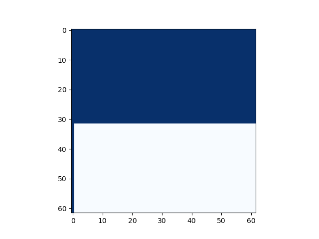
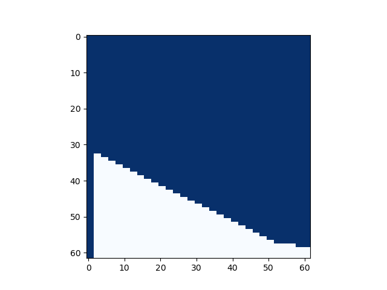

layout: post

title: multimod_fast 真的是对的吗？

author: junyu33

mathjax: true

tags: 

- c
- python
- assembly

categories: 

- 笔记

date: 2024-3-20 13:30:00

---

事情要从这段代码说起：

```c
// gcc test.c -o test -fwrapv
int64_t multimod_fast(int64_t a, int64_t b, int64_t m) {
    int64_t t = (a * b - (int64_t)((double)a * b / m) * m) % m;
    return t < 0 ? t + m : t;
}
```

昨天晚上，有人给我发了这段据说可以替代快速乘的代码，让我解释这段代码的正确性。这段代码可以把时间复杂度从$O(\log(n))$降到$O(1)$。显然，我们都知道`int64_t`与`double`之间的强制转换会丢失精度，因此我对这段代码的正确性产生了怀疑。

<!--more-->

# preliminaries

首先，我们得知道浮点数在C语言中的表示。IEEE 754标准规定了浮点数的表示方法，其中`double`类型的浮点数占用64位，其中1位是符号位，11位是指数位，剩下的52位是尾数位。我们可以参考[这篇文章](https://tiger1218.com/2023/02/12/deep-dive-into-ieee-754/)来了解更多关于浮点数的知识，我这里就不赘述了。

然后，我们得知道`-fwrapv`编译选项的作用。根据gcc的[官方文档](https://gcc.gnu.org/onlinedocs/gcc/Code-Gen-Options.html)，`-fwrapv`选项的作用是：当有符号整数溢出时，结果是对2的补码取模。这意味着，当有符号整数溢出时，结果会被截断为一个合法的值。例如，`INT_MAX + 1`的结果是`INT_MIN`。

# error analysis

## (double)a

根据前置知识中学到的内容可以推断，64位浮点数的相对精度为$2^{-52-1}$（为什么？）。那么，理论上`int64_t`强转`double`的话的绝对精度会是多少呢？我们可以使用简单的数学推导来得到答案。

我们知道，`int64_t`的范围是$[-2^{63}, 2^{63}-1]$，因此，最大的绝对精度可以粗略地估计为$2^{63} \times 2^{-53} = 2^{10}$。这意味着，`int64_t`强转`double`的话，最大的绝对误差大约是$2^{10}$。

接下来，我们可以尝试构造一个测试用例来验证这个结论：

```c
#include <stdio.h>
#include <stdint.h>
#include <math.h>

int64_t a = 9223372036854775807;
double b;


int equal(double x, double y) {
  return fabs(x - y) < 0.0000001;
}

int judge(int64_t offset) {
  double c = (double)(a - offset);
  return equal(c, b);
}

int64_t bisect(int64_t low, int64_t high) {
  if (low == high) {
    return low - 1;
  }
  int64_t mid = (low + high) / 2;
  if (judge(mid)) {
    return bisect(mid + 1, high);
  } else {
    return bisect(low, mid);
  }
}

int main() {
  b = (double)a;
  printf("%ld\n", bisect(1, 1000000000));
  double c = (double)(a - 512);
  printf("%lf %lf\n", b, c);
  //printf("%d\n", equal(b, c));
  //printf("%d\n", judge(200000000));
  return 0;
}
```

实际测试告诉我们，当`a = INT64_MIN`时，二分的合法区间`offset`为$[0, 512]$；当`a = INT64_MAX`时，二分的合法区间`offset`为$[-511, 0]$，合起来$a$的取值范围就是$[-511, 512]$。如果超过这个合法区间，转换`double`值就从$\pm 9223372036854775808$ 跳变到 $\pm 9223372036854774784$，刚好差了$1024$,也就是$2^{10}$。


## (double)a * b

### asm

我们先分析一个`double`是如何和`int64_t`相乘的，看一段简单的代码：

```c
int main() {
  int64_t a = 3;
  int64_t b = 4;
  double c = (double)a * b;
  return 0;
}
```

在 `x86_64` 环境下的反汇编如下： 

```asm
0000000000001119 <main>:
    1119:       55                      push   rbp
    111a:       48 89 e5                mov    rbp,rsp
    111d:       48 c7 45 e8 03 00 00    mov    QWORD PTR [rbp-0x18],0x3
    1124:       00 
    1125:       48 c7 45 f0 04 00 00    mov    QWORD PTR [rbp-0x10],0x4
    112c:       00 
    112d:       66 0f ef c9             pxor   xmm1,xmm1
    1131:       f2 48 0f 2a 4d e8       cvtsi2sd xmm1,QWORD PTR [rbp-0x18]
    1137:       66 0f ef c0             pxor   xmm0,xmm0
    113b:       f2 48 0f 2a 45 f0       cvtsi2sd xmm0,QWORD PTR [rbp-0x10]
    1141:       f2 0f 59 c1             mulsd  xmm0,xmm1
    1145:       f2 0f 11 45 f8          movsd  QWORD PTR [rbp-0x8],xmm0
    114a:       b8 00 00 00 00          mov    eax,0x0
    114f:       5d                      pop    rbp
    1150:       c3                      ret
```

显然，并不是所有人都知道`pxor`,`cvtsi2sd`,`mulsd`和`movsd`指令的含义，这里我们得翻一下 intel 的 manual：

- pxor：对浮点寄存器（`xmm?`）的异或操作。
- cvtsi2sd：将`int64_t` 转成 `double`，存到浮点寄存器。
- mulsd：`double` 与 `double` 乘，存在第一个（目的）操作数。
- movsd：将源操作数复制给目的操作数。

我们在gdb中`b 0x114a`，然后`continue`，断下来后`xmm0`的状态如下：

```
(gdb) p $xmm0
$4 = {v8_bfloat16 = {0, 0, 0, 2.625, 0, 0, 0, 0}, v8_half = {0, 0, 0, 2.0781, 0, 0, 
    0, 0}, v4_float = {0, 2.625, 0, 0}, v2_double = {12, 0}, v16_int8 = {0, 0, 0, 0, 
    0, 0, 40, 64, 0, 0, 0, 0, 0, 0, 0, 0}, v8_int16 = {0, 0, 0, 16424, 0, 0, 0, 0}, 
  v4_int32 = {0, 1076363264, 0, 0}, v2_int64 = {4622945017495814144, 0}, 
  uint128 = 4622945017495814144}
```

上网查询相关数据得知，`double` 的 `4622945017495814144` 转回 `int64_t` 就是正确的结果12。

### actual analysis

从上文可以得知，`(double)a * b` 的计算方法是将`a`和`b`同时转换成浮点形式，然后再执行`mulsd`指令。

接下来，我们来分析`(double)a * b`的结果。我们已经知道，`int64_t`强转`double`的话，乘数的误差范围为$[-511, 512]$。这里由于IEEE 754浮点乘原理较为复杂，这里我打算直接以先前累积的算术误差$[(2^{63}-1)(-2^{63}) - (2^{63}-512)(-2^{63}+512), (2^{63})^2 - (2^{63} - 512)^2]$来估计。

对于最大值而言：

$$(2^{63})^2 - (2^{63} - 512)^2 = 2 \times 2^{63} \times 2^9 - 512^2 = 2^{73} - 2^{18}$$

对于最小值而言:

$$(2^{63} - 512)^2 - (2^{63})^2 + 2^{63} = ((2^{63})^2 - 2 \times 2^{63} \times 512 + {512}^2) - (2^{63})^2 + 2^{63} = -2^{73} + 2^{18} + 2^{63}$$

我们来再写份代码验证自己的猜想是否正确：

```c
#include <stdio.h>
#include <stdint.h>
#include <math.h>

int64_t a = -9223372036854775808;
double b;


int equal(double x, double y) {
  printf("fabs(%lf - %lf) = %lf\n", x, y, fabs(x - y));
  return fabs(x - y) < 0.0000001;
}

int judge(int64_t offset) {
  double c = (double)(a + offset)*(a + offset);
  // should be (double)(a + offset)*(-a + offset) when getting the minimum
  return equal(c, b);
}

int64_t bisect(int64_t low, int64_t high) {
  if (low == high) {
    return low - 1;
  }
  int64_t mid = (low + high) / 2;
  if (judge(mid)) {
    return bisect(mid + 1, high);
  } else {
    return bisect(low, mid);
  }
}

int main() {
  // the "b" in context is another a in next line of code, 
  // instead of the result on the left
  // should be (double)a*(-a) when getting the minimum
  b = (double)a*a;
  printf("%ld\n", bisect(1, 1000000000));
  //double c = (double)(a - 512);
  //printf("%lf %lf\n", b, c);
  //printf("%d\n", equal(b, c));
  //printf("%d\n", judge(200000000));
  return 0;
}
```
验证结果表明，$a$和$b$的合法取值范围没有变化，当`a = b = INT64_MIN`，`offset = 512`时，我们可以求得绝对误差最大值为$18889465931478580854784$，也就是$2^{74}$；同理，当`a = INT64_MAX, b = -INT64_MAX`，`offset = -511`时，我们可以求得绝对误差最小值为$-2^{74}$。

综上，我们得到先前的推测比实际绝对误差少了一半左右，还是可以接受的。

## (double)a * b / m

除法的话比较玄学。根据相对误差公式，若$c = \frac{a}{b}$，则有：

$$\frac{\Delta c}{c} = \frac{\Delta a}{a} + \frac{\Delta b}{b}$$

$\Delta{c}$ 和 $\Delta{a}$ 有较为简单的正相关关系，因此为了取极值，还是取$a = 2^{63} - 1$，因此$\frac{\Delta a}{a} = 2^{-53}$。

$b$的话，因为浮点运算的特性，$\frac{\Delta b}{b}$在$b < 2^{53}$ 之前恒为$0$，在$[2^{53}, 2^{63}-1]$这个区间会跳变为$2^{-53}$。我们稍微对式子变形一下：

$$ \Delta c = \frac{\Delta a}{a}c + \frac{\Delta b}{b}c = \frac{\Delta a}{b} + \frac{a\Delta b}{b^2}$$

$$
\begin{align*}
= \begin{cases}
2^{-53} \frac{a}{b} & \text{if } b<2^{53} \\
2^{-52} \frac{a}{b} & \text{if } b \in [2^{53}, 2^{63}-1]
\end{cases}
\end{align*}
$$

我们可以发现，$\Delta c$总体上是一个减函数，只在$b = 2^{53}$ 处不单调。而显然$\Delta c$的极值不会出现在$b = 2^{53}$处，因此我们可以确定，仍然是$b = 1$时，商的绝对误差最大。

代入回原来的式子`(double)a * b / m`，可以确认当`a = b = INT64_MIN, m = 1`时，和`a = b = INT64_MIN, m = -1`时，求得的绝对误差范围为$[-2^{74}, 2^{74}]$。

## (int64_t)((double)a * b / m) * m

先前`(double)a * b / m`的绝对误差已经大于`int64_t`本身的范围了，所以理论来说转成`int64_t`之后最坏情况下没有任何精度。

因此，从数学的角度而言，这个函数不是恒成立的。已经没有什么接着分析下去的必要了。

# when it will satisfy

那我们接着来看看，$a,b,m$分别在什么数量级上，`(int64_t)((double)a * b / m) * m`这个式子会能被$m$整除。

```python
import random
import subprocess

matrix = [[1 for _ in range(62)] for _ in range(62)]


# try this multiple times to reduce the chance of false positive   
for _ in range (10):

    A = []
    B = []
    C = []

    for i in range(0, 62):
        A.append(2**i + random.randint(max(-2**i+1, -10), min(2**i-1, 10)))

    for i in range(0, 62):
        B.append(2**i + random.randint(max(-2**i+1, -10), min(2**i-1, 10)))

    for i in range(0, 62):
        C.append(2**i + random.randint(max(-2**i+1, -10), min(2**i-1, 10)))

    lenA = len(A)
    lenC = len(C)


    for i in range(lenA):
        for j in range(lenC):
            command = ["./test", str(A[i]), str(B[i]), str(C[j])]
            result = subprocess.run(command, stdout=subprocess.PIPE)
            output = int(result.stdout.strip())
            if output % C[j] != 0:
                matrix[i][j] = 0 # invalid

import numpy as np
import matplotlib.pyplot as plt

colored_matrix = np.array(matrix)
plt.imshow(colored_matrix, cmap='Blues', interpolation='nearest')
plt.show()

```

```c
#include <stdio.h>
#include <stdint.h>
#include <stdlib.h>
#include <math.h>


double f(int64_t x, int64_t y, int64_t z) {
  return (int64_t)((double)x * y / z) * z;
}

double g(int64_t x, int64_t y, int64_t z) {
  return (double)x * y / z;
}

int64_t h(int64_t x, int64_t y, int64_t z) {
  return (int64_t)((double)x * y / z) * z;
}

int64_t multimod_fast(int64_t a, int64_t b, int64_t m) {
    int64_t t = (a * b - (int64_t)((double)a * b / m) * m) % m;
    return t < 0 ? t + m : t;
}


int main(int argc, char *argv[]) {
  if (argc != 4) {
    return 1;
  }

  int64_t a = atol(argv[1]);
  int64_t b = atol(argv[2]);
  int64_t c = atol(argv[3]);

  printf("%ld\n", h(a, b, c));
  return 0;
}
```

绘图结果如下（横轴为$\log_2 m$，纵轴为$\log_2 a$与$\log_2 b$，蓝色为结果正确）。可以发现，当$a,b < 2^{31}$或者$m=1$时，结果才是正确的。




我们再略微修改一下代码，理论上讲，如果`(int64_t)((double)a * b / m) * m`是$m$的倍数，那么`(a * b - (int64_t)((double)a * b / m) * m) % m`本身应该可以化简为`(a * b) % m`。也就是整个`multimod_fast`成立与上一个命题等价，画出来的图也应该是一致的：

```python
import random
import subprocess

matrix = [[1 for _ in range(62)] for _ in range(62)]


# try this multiple times to reduce the chance of false positive   
for _ in range (10):

    A = []
    B = []
    C = []

    for i in range(0, 62):
        A.append(2**i + random.randint(max(-2**i+1, -10), min(2**i-1, 10)))

    for i in range(0, 62):
        B.append(2**i + random.randint(max(-2**i+1, -10), min(2**i-1, 10)))

    for i in range(0, 62):
        C.append(2**i + random.randint(max(-2**i+1, -10), min(2**i-1, 10)))

    lenA = len(A)
    lenC = len(C)


    for i in range(lenA):
        for j in range(lenC):
            command = ["./test", str(A[i]), str(B[i]), str(C[j])]
            result = subprocess.run(command, stdout=subprocess.PIPE)
            output = int(result.stdout.strip())
            if output != A[i] * B[i] % C[j]:
                matrix[i][j] = 0 # invalid

import numpy as np
import matplotlib.pyplot as plt

colored_matrix = np.array(matrix)
plt.imshow(colored_matrix, cmap='Blues', interpolation='nearest')
plt.show()

```

```c
#include <stdio.h>
#include <stdint.h>
#include <stdlib.h>
#include <math.h>


double f(int64_t x, int64_t y, int64_t z) {
  return (int64_t)((double)x * y / z) * z;
}

double g(int64_t x, int64_t y, int64_t z) {
  return (double)x * y / z;
}

int64_t h(int64_t x, int64_t y, int64_t z) {
  return (int64_t)((double)x * y / z) * z;
}

int64_t multimod_fast(int64_t a, int64_t b, int64_t m) {
    int64_t t = (a * b - (int64_t)((double)a * b / m) * m) % m;
    return t < 0 ? t + m : t;
}


int main(int argc, char *argv[]) {
  if (argc != 4) {
    return 1;
  }

  int64_t a = atol(argv[1]);
  int64_t b = atol(argv[2]);
  int64_t c = atol(argv[3]);

  printf("%ld\n", multimod_fast(a, b, c));
  return 0;
}
```

然而，实际上的图长这样。我们发现之前那个式子是一个**充分条件**，并不等价。同时，当$m \ge 2^{31}$后，$m$越大，符合条件的$a,b$也就越多，这也符合我们的直觉。

我们也可以举一个实实在在的反例：$a = 2^{61} + 1, b = 2^{46} + 3, m = 23$。`multimod_fast`的结果是$12$，但正确结果是$18$，看一下图大该也落在了图中的白色区域。




总的来说，我们至少可以说明当$a,b < 2^{31}$时，这个式子是恒成立的了，接下来让我们尝试证明它。

# proof

我们先前说过“`(int64_t)((double)a * b / m) * m`是$m$的倍数”是这个函数返回正确结果的充分条件，因此我们只需证明`(int64_t)((double)a * b / m) * m`在$a,b < 2^{31}$时该式是$m$的倍数这个条件即可。

有些人可能会有疑问，`(int64_t)((double)a * b / m)`肯定是一个整数，那现在欲证的式子肯定是$m$的倍数啊。其实这些人忽略了一个问题：64位的整数有符号溢出。即使我们开启了`-fwrapv`选项，如果$m \nmid 2^{64}$，那么这个欲证式子在溢出之后仍然不会是$m$的倍数。

因此，只要$a \times b$本身不溢出,那么`(int64_t)((double)a * b / m) * m`就一定是$m$的倍数。而$a,b < 2^{31}$是上式的充分条件（更硬的结论是$a \times b < 2^{63}$），`multimod_fast`就能正确实现它的功能，**跟浮点误差没有任何关系**。

# summary

`multimod_fast` 这个式子仅在$a \times b$ 本身不溢出`int64_t`的情况是正确的，它无法完全替代$a,b$均为`int64_t`的$O(\log n)$的快速乘。
