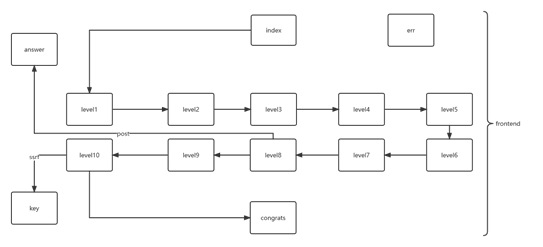
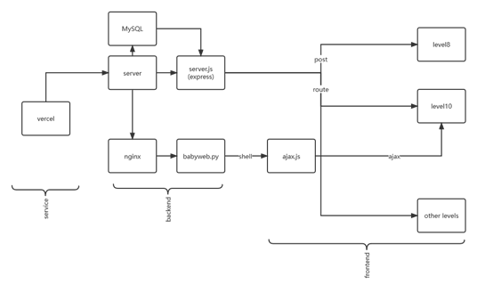
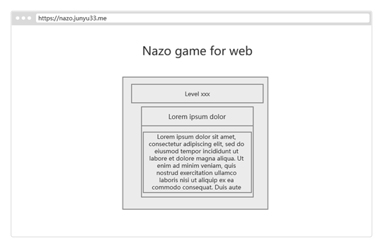
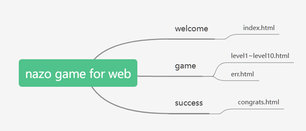

layout: post
title: web项目之nazo game for web
author: junyu33
mathjax: true
categories: 

  - develop

tags:

- web
- javascript
- python
- linux
- docker

date: 2022-12-24 10:00:00

---

web项目报告的截取，时机合适时开源。

为了保证安全性，在2022年12月23日，我将`babyweb.py`重新用docker部署，替换了原来的nginx服务器。

<!-- more -->

# 项目简介

本项目是一个简单的网页解谜游戏，玩家通过阅读关卡的要求，得出相应的答案并输入到网址，跳转到下一关。如果通过了所有的关卡，就会跳转到成功的页面。选择这个项目的原因是：

**1、**     **作为个人主页的一个重要组成部分。**

**2、**     **让玩家在解谜的同时复习本学期web知识。**

**3、**     **体验从构思题目、设计前端、开发后端、部署到服务器与维护的全过程。**

**4、**     **做一个从零开始，100%手写的项目。**

# 系统分析

## 业务分析

前端：使用了bootstrap框架，在第10关使用了jQuery与ajax用于提交用户的输入。

后端：网页的路由和第8关的post请求后端用node.js的express框架写成，第10关的后端是flask，用mysql储存路由数据。

部署：将源码同步到github，使用vercel进行部署与反代，在服务器本地使用nginx进行反代。

## 业务流程

### 前端



### 后端及部署



> 现在nginx应该换成docker

## 系统设计

### 总体设计

项目的主题是一个需要web知识的闯关游戏，搭建在自己服务器上，并使用bootstrap,jQuery,ajax,flask,node.js,mysql,nginx,vercel等技术。

### 界面设计



### 输入/输出设计

1-7关与9关将答案填写到网址，在第8关会使用post请求，在第10关会与shell进行交互。

### 模块设计



游戏分为三个部分，首先是欢迎界面，给出游戏规则与游戏简介；然后是游戏界面，有1到10关的内容和错误内容；最后是成功界面，给出成功提示语与关于信息。

# 具体实现

## 个人主页模块——junyu33.me

静态网页，纯html+css实现：

用bootstrap把中间1/2的区域留出来填写内容。高度为90vh时将内容沿高度居中正好合适。上半部分写标题，中间图片用下boder-radius: 50%属性。然后`<hr>`分割，下半部分用bootstrap按钮写4个href子域名即可。

## 解谜游戏模块——nazo.junyu33.me

> 以下内容涉及部分思路解析，请谨慎观看！！

Nazo game的含义是通过解决页面上的一个问题，将答案输入到域名后面来跳转到下一关，当完成了作者所有的关卡后可以访问到一个恭喜通关的页面。

完整的前后端结合项目，也是本课程设计的主体，运用了html，css，javascript，bootstrap，jQuery，ajax，node.js，flask，nginx，mysql等技术。

### 欢迎界面

主要介绍游戏规则，页面布局与个人主页面差不多，bootstrap写的button用路由实现到第一关的链接。

### 第一关

简单考察html5的历史与玩家的Google能力，没有什么特殊的地方。这里采用了bootstrap中的card元素用于区分关卡名与内容。之后的问题都将按照这个为模板创建。

### 第二关

对玩家基本html5关键字的考察。这里使用了bootstrap中的list元素表示提供的四个选项，使用了code元素来展示行间代码。

### 第三关

简单地考察了玩家对css内容的了解，需要查看css源代码以获得使用的字体。

### 第四关

考察对css hex RGB的理解~~以及肉眼分辨颜色的能力~~，可以使用开发者工具中的取色器来完成本题。这里采用了JavaScript弹窗的方式给出相应的提示。

### 第五关

考察玩家对css定位的理解，仍旧采用了4选1的形式，没有什么特殊的地方。 

### 第六关

考察用户的javascript数据类型的理解。为了限制可能的答案，题干规定了开头的字符（同时为了降低难度，也提示了字符长度~~方便爆破~~）。

这里的答案有三个，通过将答案储存到数据库，规避了url编码带来的答案不一致的问题，使得多个路由指向一个文件得以实现。

### 第七关

考察javascript的语法糖`reduce`与bootstrap的响应式图片功能。正确的解法是暴力循环求解。

### 第八关

考察对基本后端操作的理解。首先，这4门语言肯定是都可以做后端的，于是把这四个选项输进去肯定都不对。查看网页源代码后发现给了一句注释，要求post其中一个选项。可以使用curl、hackbar、postman乃至burpsuite达成目的。

### 第九关

考察玩家对web技术的了解以及信息搜集的能力。首先查看网页源码发现每个页面都使用了bootstrap5，进一步查看bootstrap5的css发现有大量flex的字样，由此C项即可排除。

同时，查看第八关答案的源代码，可以看到有一句注释`my_server: node.js`。由此B项即可排除。

由于response header的server是vercel，并且ping的结果也是vercel的ip地址，由此可以判断网站使用了反代技术，D项排除。

### 第十关

考察玩家基础的渗透测试能力，如果没有公网ip应该会比较麻烦。（具体过程在flask后端部分）

这里的输入框使用了ajax与jQuery技术，将用户的命令与域名结合起来形成一个GET请求发送到服务器，并用alert函数接受服务器的范围内容。

### 答案错误页面

若答案不在数据库的RUOTE字段之中，后端就会在header中写404并返回`err.html`

### 通关页面

若答案不在数据库的RUOTE字段之中，后端就会在header中写404并返回err.html

### node.js后端

采用express框架编写，将用户的输入路由通过中间件`body-parser`取出，通过连接到储存路由及对应文件的数据库来判断用户的输入是否为正确答案。如果在，就取出对应的html并写入到res，否则在header中写入404并返回`err.html`。对于第八关的post请求则专门用一个路由来处理。

```javascript
const { readFileSync } = require("fs");
const http = require("http");
const url = require("url");

var express = require('express');
var app = express();

var bodyParser = require('body-parser');
app.use(bodyParser());

var mysql      = require('mysql');
var connection = mysql.createConnection({
  host     : '47.114.45.27',
  user     : 'root',
  password : '******',
  database : 'nazo_answer'
});

connection.connect();

app.post('/31337', function(req, res) {
   if ( req.body.Go != undefined) {
      var data = readFileSync("./answer.html");
      res.end(data);
   } else {
      var data = readFileSync("./level8.html");
      res.end(data);
   }
});

app.get('*', function(req, res) {
   var route = req.params[0];
   connection.query('SELECT `PATH` FROM `ANSWER` WHERE `ROUTE` = "' + route + '"', function (error, results, fields) {
      if (error) throw error;
      if (results.length > 0) {
         var data = readFileSync("./" + results[0].PATH);
         res.end(data);
      } else {
         res.writeHead(404, {'Content-Type': 'text/html'})
         var data = readFileSync("./err.html");
         res.end(data);
      }
   });
});


app.listen("80",()=>{
    console.log("serv running on http://127.0.0.1:80");
});

```

### flask后端

这里演示了一个ssrf vuln的应用，首先查看源码可以发现用户的输入没有过滤，因此可以构造特定的字符串拿到服务器的shell。然后可以发现date命令的特性会导致shell输出会过滤长度小于3的字母和数字，因此通过cat命令不能得到key。即使尝试转换成base64等其它编码并结合head、tail命令也很难拼凑出完整的编码串。

与此同时，shell的用户不是root，没有足够的权限来修改html文件，因此将key追加到html后面也不可行。

> 现在放docker了，html根本不在docker里面，这个方法彻底失效。

可行的方式之一是反弹shell到公网ip（一般需要有自己的服务器），具体的过程这里就省略了。

```python
import os
import pathlib
import tempfile
import contextlib
import urllib
import subprocess
import ctypes

from flask import Flask, request, session, redirect
from flask_cors import CORS

level = 10
challenge_host = "localhost"
hacker_host = "localhost"
app = Flask(__name__)
CORS(app)

def level10():
    timezone = request.args.get("timezone", "UTC")
    return subprocess.check_output(f"TZ={timezone} date", shell=True, encoding="latin")

@app.route("/", methods=["GET", "POST"])
@app.route("/<path:path>", methods=["GET", "POST"])
def catch_all(path=""):
    challenge = globals()[f"level{level}"]
    return challenge()

def challenge():
    app.run(challenge_host, 8080)

challenge()

```

## 部署到服务器并实现域名与https

首先将代码上传到GitHub的私有仓库，在服务器pull下来，对于nodejs后端，由于先前执行了npm install xxx –save命令，服务器端只需npm install即可。而python后端也只需要安装flask flask-cors。最后使用sudo chmod对所有文件设为只读权限防止将key写入html，由于Python flask后端启动不需要 root权限，这样不会影响之后玩家的游戏体验。

域名的部署与https相对比较困难。由于我的域名是凭github学生包在namecheap上免费获得的（一年），没有对域名进行备案，因此不能通过直接把dns的A记录映射到服务器的IP。这里只能使用反代的方式解决这个问题。

反代的方式有两种，其一是nginx，但nginx需要有一个中间服务器，中间服务器必须备过案或者在国外（然而这就成了一个套娃的问题，因此不可行）；其二是通过第三方服务进行反代（比如说vercel），具体步骤如下：

1. 在本地使用npm安装vercel的客户端并登录。

2. 编写反代的nazo.json文件：

```json
{
    "version": 2,
    "routes": [
      {"src": "/(.*)","dest": "http://<server ip>"}
    ]
}
```

3. vercel -A nazo.json –prod

通过这样的方式就可以实现免备案访问在境内服务器搭建的网站，缺点是由于国内会对vercel的dns进行污染，访问速度是肯定不如国内网站的。

~~为了保险起见，最后我还是在自己的服务器中搭建了一个nginx服务器，反代了一下flask的端口。~~

至于子域名的添加方面，vercel允许你给自己的前端添加一个顶级域名下自定义的子域名，甚至还会给你分配一个免费的ssl证书以升级为https。我本身是想用nginx+certbot+crontab来申请ssl证书并定期更新的，vercel的操作实在是太贴心了。

## docker环境的配置

学校正课上完之后，我便有了时间进一步优化我的项目。在copilot的帮助下，我成功编写了第一个dockerfile：

```dockerfile
# python with flask and flask-cors
FROM python:3.10.7
RUN pip install flask flask-cors
COPY ./babyweb.py /
COPY ./key /
WORKDIR /
EXPOSE 5000
CMD ["python", "babyweb.py"]
```

然而这个dockerfile在windows端的docker下运行失败，错误跟路径有关。或许是docker下载了windows的python环境？

出于方便，我在ubuntu环境下重新运行了这个命令，不仅运行成功了，而且导出的镜像大小从5个G缩减到了900M，linux确实香啊。

最后在服务器端启动了容器，进行了exp的测试，没有问题后把反代的json换了个端口，vercel部署了一下，就把原来的端口销毁了。

# 课程设计心得体会

作为一个从零开始，100%手写的项目，走完一套从构思、前端、后端到部署和维护的过程还是颇费周折的。尤其是部署部分，开始我想把flask后端与node.js后端放在一个域名的不同端口，花费了一两天的时间都因为跨域与https的问题而毫无进展。不得已我只好将两个服务拆成两个域名，随着时间的推移，加在网站上的技术也越来越多。从先前简单的bootstrap+nodejs+本地服务器，到现在的bootstrap+express+flask+nginx+mysql+全站https+服务器权限管理，可以见得web开发是一个精心打磨的过程。希望游玩nazo game的同学能够玩得开心，巩固自己学到的web知识。

# 项目完善说明

1. ~~没有将服务部署到docker，移植困难且带有一定的安全隐患。~~

2. 没有设计cookie，用于防止跳关和记录答错的次数。

3. 国内访问速度较慢。