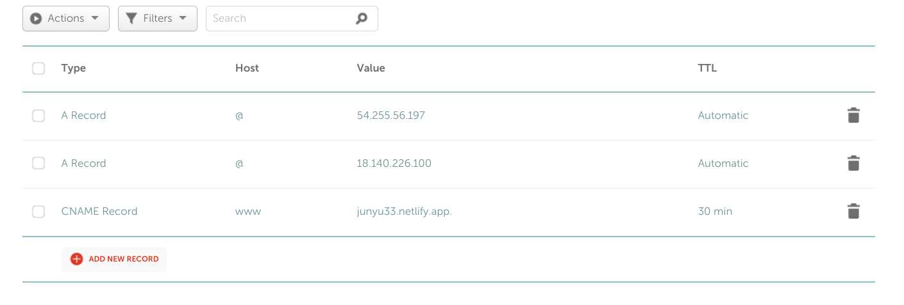

layout: post
title: 博客域名变更小记
author: junyu33
mathjax: true
categories: 

  - test

date: 2022-7-26 14:40:00

---

因为原先博客域名过长，并且国内解析速度较慢，我决定用利用github学生包白嫖一个域名，并解析到netlify的dns上。最后域名成功由`junyu33.github.io`变更为`junyu33.me`.

<!-- more -->

# 申请github学生包

见https://junyu33.github.io/2022/07/06/anniversary.html

# 原博客部署到netlify

打开https://www.netlify.com/

然后start building for free

然后无脑绑定github，授权仓库，填入相关信息（netlify能够识别hexo博客，只需直接确定即可），然后deploy。这个时候netlify应该会给你随机分配一个二级域名，我把它改成了https://junyu33.netlify.app/.

此时访问这个域名就可以看到自己的博客了。

# 使用学生包白嫖域名

## name.com ×

我开始使用[name.com](https://www.name.com)尝试白嫖的，在搜索引擎上搜索了域名商对`github student developer pack`的优惠信息。

> name.com对
>
> - .rocks
> - .ninja
> - .games
> - .codes
> - .systems
> - .studio
> - .email
> - .works
> - .software
> - .engineer
> - .live
>
> 这11个域名提供一年的免费使用权，并提供Privacy Protection、Domain Lock Plus、SSL Certificate这三项安全保护。

然而各项信息填完，到了最后的支付环节，居然失败了，价格又回到了完全没有优惠的状态。我尝试修改自己的国家地区并重新登录，无果。然后我也找不到注销帐户的链接，只好作罢。

## nc.me √

之后我在student pack的各项优惠中闲逛，意外地发现[namecheap.com](https://namecheap.com)也提供针对学生的免费域名活动。

> Get a .me domain and 1 SSL Certificate FREE for 1 year with your GitHub Student Developer Pack.

然后点开标题链接，注意填邮箱的时候**一定要填github注册的邮箱**（我就是开始填的学生邮箱，显示网站不认识我的大学，搞得我还填了一张大学申请表，泄露了自己的姓名呜呜呜。然后改成自己的qq邮箱就一下过了）。

一路确定，并等待几分钟过后，我的新域名[junyu33.me](https://junyu33.me)也可以访问了。

# 将新域名的dns解析到netlify

## 网上找到的方法

在netlify的`Domain management`添加刚才的域名，然后netlify会给你4个域名服务器`nameserver`用于cdn解析。

在[namecheap.com](https://namecheap.com)找到自己的个人界面，选择`Domain List`，找到自己的域名点击`Manage`。

找到`Advanced DNS`修改自己的`Host Records`，我的做法是将`CHAME`改成自己的netlify网址，再把`A Record`给成ip查询查到的ip。类似于这样：

 

然后等一段时间就可以测试了。

```bash
# junyu33 @ zjy in ~/Desktop [14:21:33] 
$ ping junyu33.github.io
PING junyu33.github.io(2606:50c0:8000::153 (2606:50c0:8000::153)) 56 data bytes
64 字节，来自 2606:50c0:8000::153 (2606:50c0:8000::153): icmp_seq=2 ttl=53 时间=121 毫秒
64 字节，来自 2606:50c0:8000::153 (2606:50c0:8000::153): icmp_seq=3 ttl=53 时间=216 毫秒
64 字节，来自 2606:50c0:8000::153 (2606:50c0:8000::153): icmp_seq=4 ttl=53 时间=158 毫秒
64 字节，来自 2606:50c0:8000::153 (2606:50c0:8000::153): icmp_seq=5 ttl=53 时间=116 毫秒
^C
--- junyu33.github.io ping 统计 ---
已发送 5 个包， 已接收 4 个包, 20% 包丢失, 耗时 4037 毫秒
rtt min/avg/max/mdev = 116.011/152.788/216.261/39.972 ms

# junyu33 @ zjy in ~/Desktop [16:19:53] 
$ ping junyu33.me         
PING junyu33.me (18.140.226.100) 56(84) bytes of data.
64 字节，来自 ec2-18-140-226-100.ap-southeast-1.compute.amazonaws.com (18.140.226.100): icmp_seq=1 ttl=46 时间=135 毫秒
64 字节，来自 ec2-18-140-226-100.ap-southeast-1.compute.amazonaws.com (18.140.226.100): icmp_seq=2 ttl=46 时间=222 毫秒
64 字节，来自 ec2-18-140-226-100.ap-southeast-1.compute.amazonaws.com (18.140.226.100): icmp_seq=3 ttl=46 时间=141 毫秒
64 字节，来自 ec2-18-140-226-100.ap-southeast-1.compute.amazonaws.com (18.140.226.100): icmp_seq=4 ttl=46 时间=121 毫秒
^C
--- junyu33.me ping 统计 ---
已发送 4 个包， 已接收 4 个包, 0% 包丢失, 耗时 3001 毫秒
rtt min/avg/max/mdev = 121.155/154.795/221.652/39.282 ms

```

然后我惊奇地发现速度并没有提升，甚至还略微变慢了。

没办法，我只好乖乖的把`CHAME`加上netlify开始提供的那四个域名服务器，结果如下：

```bash
# junyu33 @ zjy in ~/Desktop [16:24:37] 
$ ping junyu33.me        
PING junyu33.me(dns1.p04.nsone.net (2620:4d:4000:6259:7:4:0:1)) 56 data bytes
64 字节，来自 dns1.p04.nsone.net (2620:4d:4000:6259:7:4:0:1): icmp_seq=1 ttl=53 时间=245 毫秒
64 字节，来自 dns1.p04.nsone.net (2620:4d:4000:6259:7:4:0:1): icmp_seq=2 ttl=53 时间=304 毫秒
64 字节，来自 dns1.p04.nsone.net (2620:4d:4000:6259:7:4:0:1): icmp_seq=3 ttl=53 时间=225 毫秒
64 字节，来自 dns1.p04.nsone.net (2620:4d:4000:6259:7:4:0:1): icmp_seq=4 ttl=53 时间=243 毫秒
^C
--- junyu33.me ping 统计 ---
已发送 5 个包， 已接收 4 个包, 20% 包丢失, 耗时 4005 毫秒
rtt min/avg/max/mdev = 224.650/254.204/304.193/29.931 ms

```

甚至比之前变得更慢了。

## 自己的尝试

然而我在ping https://junyu33.netlify.app/ 时，速度却比较快，我发现dns将其解析到了一个ipv6地址。而且由于ipv6地址较多，域名可以和ipv6一一映射，因此这个ip应该不会变化。

```bash
# junyu33 @ zjy in ~/Desktop [16:31:18] 
$ ping junyu33.netlify.app
PING junyu33.netlify.app(2406:da18:880:3800:3cf7:d90b:9468:f4a6 (2406:da18:880:3800:3cf7:d90b:9468:f4a6)) 56 data bytes
64 字节，来自 2406:da18:880:3800:3cf7:d90b:9468:f4a6 (2406:da18:880:3800:3cf7:d90b:9468:f4a6): icmp_seq=1 ttl=46 时间=92.9 毫秒
64 字节，来自 2406:da18:880:3800:3cf7:d90b:9468:f4a6 (2406:da18:880:3800:3cf7:d90b:9468:f4a6): icmp_seq=2 ttl=46 时间=85.3 毫秒
64 字节，来自 2406:da18:880:3800:3cf7:d90b:9468:f4a6 (2406:da18:880:3800:3cf7:d90b:9468:f4a6): icmp_seq=3 ttl=46 时间=85.7 毫秒
64 字节，来自 2406:da18:880:3800:3cf7:d90b:9468:f4a6 (2406:da18:880:3800:3cf7:d90b:9468:f4a6): icmp_seq=4 ttl=46 时间=131 毫秒
^C
--- junyu33.netlify.app ping 统计 ---
已发送 4 个包， 已接收 4 个包, 0% 包丢失, 耗时 3005 毫秒
rtt min/avg/max/mdev = 85.273/98.665/130.809/18.805 ms

```

于是我将先前的`A Record`改成了`AAAA Record`，填入了这个ipv6地址，再进行了测试：

```bash
# junyu33 @ zjy in ~/Desktop [16:33:58] 
$ ping junyu33.me
PING junyu33.me (54.255.56.197) 56(84) bytes of data.
64 字节，来自 ec2-54-255-56-197.ap-southeast-1.compute.amazonaws.com (54.255.56.197): icmp_seq=2 ttl=46 时间=91.9 毫秒
64 字节，来自 ec2-54-255-56-197.ap-southeast-1.compute.amazonaws.com (54.255.56.197): icmp_seq=3 ttl=46 时间=84.5 毫秒
64 字节，来自 ec2-54-255-56-197.ap-southeast-1.compute.amazonaws.com (54.255.56.197): icmp_seq=4 ttl=46 时间=85.5 毫秒
64 字节，来自 ec2-54-255-56-197.ap-southeast-1.compute.amazonaws.com (54.255.56.197): icmp_seq=5 ttl=46 时间=88.0 毫秒
^C
--- junyu33.me ping 统计 ---
已发送 5 个包， 已接收 4 个包, 20% 包丢失, 耗时 4031 毫秒
rtt min/avg/max/mdev = 84.479/87.482/91.940/2.873 ms

```

从而实现了访问加速。

## 更加简单的方法

其实`Domain`上面就有一个 `NAMESERVERS`，直接把netlify的四个域名服务器填上即可。

```bash
# junyu33 @ zjy in ~/Desktop [17:17:54] 
$ ping junyu33.me

PING junyu33.me(2406:da18:880:3802:371c:4bf1:923b:fc30 (2406:da18:880:3802:371c:4bf1:923b:fc30)) 56 data bytes
64 字节，来自 2406:da18:880:3802:371c:4bf1:923b:fc30 (2406:da18:880:3802:371c:4bf1:923b:fc30): icmp_seq=1 ttl=46 时间=81.6 毫秒
64 字节，来自 2406:da18:880:3802:371c:4bf1:923b:fc30 (2406:da18:880:3802:371c:4bf1:923b:fc30): icmp_seq=2 ttl=46 时间=84.9 毫秒
64 字节，来自 2406:da18:880:3802:371c:4bf1:923b:fc30 (2406:da18:880:3802:371c:4bf1:923b:fc30): icmp_seq=3 ttl=46 时间=76.6 毫秒
64 字节，来自 2406:da18:880:3802:371c:4bf1:923b:fc30 (2406:da18:880:3802:371c:4bf1:923b:fc30): icmp_seq=4 ttl=46 时间=83.8 毫秒
^C
--- junyu33.me ping 统计 ---
已发送 4 个包， 已接收 4 个包, 0% 包丢失, 耗时 3005 毫秒
rtt min/avg/max/mdev = 76.587/81.721/84.858/3.181 ms

```

此时可能会报SSL证书相关的错误，只需把自己的域名删除，再重新添加即可。