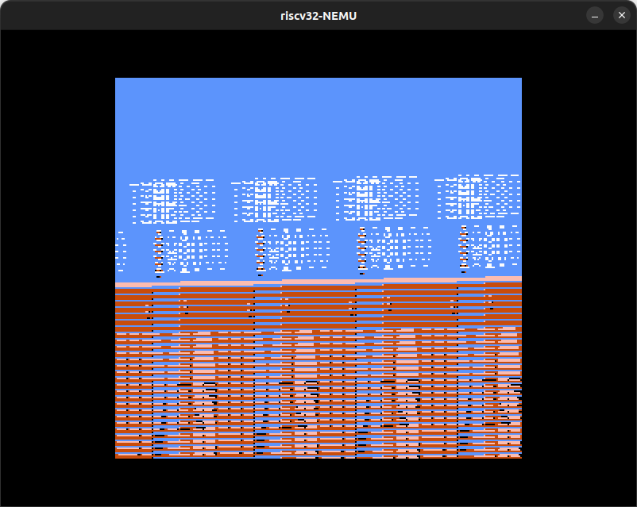

layout: post
title: （近期不更新）nju-pa 心得
author: junyu33
mathjax: true
categories: 

  - develop

tags:

  - c
  - linux

date: 2023-5-13 12:30:00

---

TODO: 其它专业课有思路再写。

<!-- more -->

# 背景（个人吐槽，可skip）

鉴于本校的专业课并不能让我学到多少东西，我开始思索自己与非科班的同学的技术水平是否还存在着区别（抑或是他们可能已经通过报班的方式已经超越了我们？例如`Java`），而我自己的优势又在哪里。

回想起一年前秦院对我说过，从用人单位的角度来看，本院的学子的编程水平不如隔壁电科。当时我还对这句话半信半疑，但从现在的课程设计角度来看，这的确是不争的事实（或者说是必然的结果）。学院也确实作出了一些改进，比如说`C`的在线OJ（只不过因为较为 aggressive 与排版问题饱受诟病），当然这还远远不够。

从提升个人能力的角度来看，留给我的时间已经不多了，我必须摒弃一切与这个目标相悖的杂事（按优先级看依次是综测、大创、各种竞赛（包括低质量的 CTF ），最后是 GPA（自己的优势有时也是弱点）），以给自己留出尽可能多的时间来学习真正与我的方向相关的，或者是 fundamental 的东西（比如说 OS —— by `lotus`）。

关于 OS 这门课，学院的理论课只能说不算差，以应试为主。与此相比，实验课就处在一个十分尴尬的地位，具体理由如下：

- 没有先导课程：缺少对 `linux` 基础的讲授和 `git` 的使用教程，这些东西在我完成 `nachOS` 实验的过程中极大地提升了工作效率。为什么这么说呢，因为肯定有同学还是在通过注释之前几个 lab 代码的方式（或者重新 copy 原始的 source ）来写当前 lab 的代码，懂的都懂。
- 过分降低了难度：目前 OS 实验课的方式是结合了 PPT 讲义与演示视频的形式，其中演示视频不可避免的会展示一些 `source code`，而同学用手机拍摄/录制这段内容是无法避免的，从而实验的难度降格为在不同的 source 中补全部分代码，我们便丧失了 `RTFSC` 的能力。这样做的后果就是：轻则不理解 `nachOS` 的整体架构，重则无法回答梁刚老师在 `lab8` 提出的那几个稍微 `RTFSC` 就能回答的问题。
- 抄袭问题严重：人都是有惰性的，`nachOS` 是一个陈旧的项目，其中许多 lab 的答案随便一搜就能找到，我其实也抄过。

# why do I want to be a masochist (by doing PA)

~~simple, because I enjoy this~~

- Being introduced by `Tiger1218`, `nju_pa` is absolutely a great course. In compare with `nand2tetris` I previously finished, it is more hard-core but a more smooth learning curve.

- I have no more time, I need to acquire more information in a rather short period of time. High information density means high difficulty. Therefore, keeping in touch with something challenging is unavoidable.

- In academia, having a deeper understanding of ISA & OS benefits to further research. In engineering, praticing coding skills makes me more competent in both major or non-major students in CS field.

# pa0

I've already used Linux and built workflow for some time. So I just installed `neovim` and clone the source.

Learned some useful git commands like `git branch`, `git checkout`.

[The Missing Semester of Your CS Education](https://missing.csail.mit.edu/) is a good course, bookmarked.

# pa1

## 1.1

At first I was dumbfounded. Copilot gives some code suggestions, which makes me quickly understand what I need to do. Actually, it is quite easy.

## 1.2

Several months ago I learned regex and I forgot it. It took me 30min to learn it again. Actually the `tokenize` step is much easier than compiler section of `nand2tetris`.

Copilot helped me quickly finished the structure of `eval` function, but it made a mistake when finding the dominant operator and I spent several hours debugging this.

When it comes to modifying `sdb.c` to test a batch of expressions. I mistyped the path to my input file (btw, copilot suggested the path of `yzh`'s project, which is a privacy issue). At first I don't know I can enable debug info in `menuconfig`, and `static` functions increased the difficulty analyzing the assembly instructions when using `gdb`. Therefore, it took me nearly an hour to debug this.

Also, I had a hard time tackling the floating point exception (div by 0) in expression generator. My idea is compile and run it, while redirecting exceptions to stderr. If `grep exception stderr_file` doesn't return `0`, we think the expression is valid. However there are still some exceptions printed in my `stdout_file`, finally I've to use another command to filter the output.

```bash
perl -pe 's/Floating\ point\ exception\n//g' stdout_file > final_input
```

## 1.3

Expanding the `eval` function is not very hard, one important point is to change a condition to tackle unary operator (like `*` and `-`).

Implementing watchpoint pool is just some basic linklist operations, copilot did a good job.

However, copilot made a big mistake implementing watchpoint itself, it messed the return value of `check_wp`. I spent several hours again debugging this.

# pa2

## 2.1

Understanding the design of risc-v is tough at first, copilot even decreased my proficiency by 20%, but when I found a book named `RISC-V-Reader-Chinese-v2p1.pdf`, things got better. It is actually just some repetitive work.

However there are still something requires patiece and you need to be careful especially when tackling opcodes which entail type conversion. It took me about an hour to debug again.

## 2.2

It's all about fundamental utilities again.

`iringbuf`, `mtrace` is quite easy, but `ftrace` takes a very long time, including these steps:

- spend a little time to parse args, but failed to find a way to add this new feature to `Makefile`
- spend some time to RTFM  `man 5 elf`
- spend a lot of time to distinguish `call` and `ret` step from `jal` and `jalr` opcodes, especially to acertain if I did it correctly because difftesting this is not a easy task. (finally I think it is not very important, maybe a waste of time?)

Successfully find some bugs in `strcpy` and `sprintf` by testcases from `Copilot X`.

Writing differential testing is easy and returns a lot, not quite understand why it isn't compulsory.

There is a correspondence in **batch tests** from a chapter ago:

>  通过批处理模式运行NEMU
>
> 我们知道, 大部分同学很可能会这么想: 反正我不阅读Makefile, 老师助教也不知道, 总觉得不看也无所谓.
>
> 所以在这里我们加一道必做题: 我们之前启动NEMU的时候, 每次都需要手动键入c才能运行客户程序. 但如果不是为了使用NEMU中的sdb, 我们其实可以节省c的键入. NEMU中实现了一个批处理模式, 可以在启动NEMU之后直接运行客户程序. 请你阅读NEMU的代码并合适地修改Makefile, 使得通过AM的Makefile可以默认启动批处理模式的NEMU.
>
> 你现在仍然可以跳过这道必做题, 但很快你就会感到不那么方便了.

Actually I found it not convenient here, so I get back to this chapter and add it :(

## 2.3

The most painful step is debug the problem of system clock. After finishing `AM_TIMER_UPTIME`, first I use my laptop `i7-6700HQ @ 2.60GHz` to run performance test. However, it runs extremely slow (for `microbench`, it took **over an hour** to finish and only got 12 points). So first I try to find out why it runs in such a low efficiency for 2 or 3 days without success.

Occasionally I copied my code to another desktop `i7-6700 @ 3.40GHz` and run the performance test again. This time there is a floating point exception. I checked the formula for performance score and found the problem is `AM_TIMER_UPTIME` register hasn't been updated for each iteration. With knowing this, I quickly fixed the bug puzzled me for serveral days. 

The next problem is `AM_GPU_FBDRAW` module. First I finished it and it seems no problem in video test. However in `fceux-am` the graphics cannot display properly, just like this:



To solve this problem, I enabled `differential testing`(difftest) and `ftrace`. The debug information shows the differs start at `memcpy` in my `AM_GPU_FBDRAW` function. However, the diff position varies when I run each time, which bothers me a lot. Occasionally, I deleted my original `memcpy` function

```c
memcpy(&fb[(y + i) * W + x], ctl->pixels + i * w, w * 4);
```

to this:


```c
memcpy(&fb[(y + i) * W + x], ctl->pixels, w * 4);
```

The graphics turn to whole blue. This assures me this bug relies on the second argument of this function. With the help of `tiger1218` (I feel so sorry about that, I could solve this problem all by myself), I realized that `ctl->pixels` is a `void` pointer, it should address in **bytes**, not in **DWORD**, which solves it.

This story hasn't come to an end. After fixing this bug, the `difftest` problem still exists. I tried to run other tests in order to find some information helpful for debugging. During this period, I also fixed some other minor bugs such as blackscreen of `slider` (due to the boundary isn't set properly in `AM_GPU_FBDRAW`), program crashes when showing help message in `am-tests` (because `%c` is not implemented in my own library).

The real solution comes when I give up to work on pa3. I run `nanos-lite` and the program crashes again. This time I manually set `panic` breakpoint in different parts of `main.c` and found it crashes when printing the logo. I quickly realized the problem lies that the buffer is not big enough (1024 failed, 16384 is maybe enough), which also solves `difftest` problem.

I also wanted to work on sound driver. However, this requires cross-compilation of SDL2 library. I spent half an afternoon on this and failed. `Tiger1218` tried to help me but quickly lost interest. He thinks this part is not very essential to whole PA. Maybe I'll finish sound driver when I have more time.

However, `difftest` failed to work after adjusting the buffer of `print` several days later, and I haven't fixed it again till now.

# pa3

## 3.1

After the final exam, I continued to work out pa3.1.

I stuck at `yield()` for some days, for I have to read RISCV-manual, figure out execption trace and where to implement `isa_raise_intr()`. However if you did it, the rest tasks are much easier.

Although initialized `mstatus` to `0x1800`, `difftest` still not able to work. I feel like giving up using it. 

## 3.2

Because I've RTFSC for several days in 3.1, finishing 3.2 is just a piece of cake. I just stuck at `printf` output for several hours (it only prints `H` for each line). Finally I found that I forgot to make the whole directory of `navy-apps`.