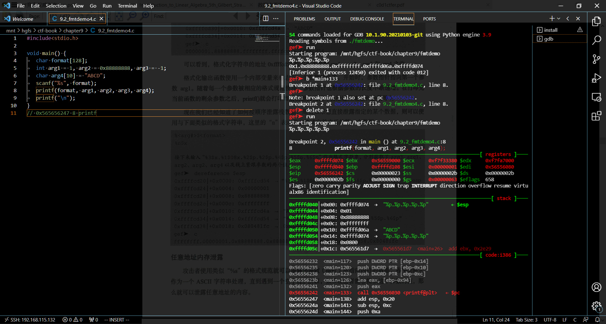
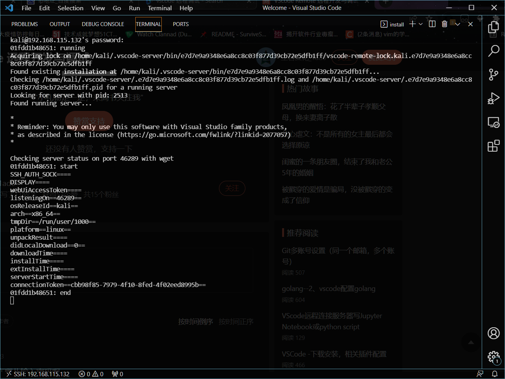

layout: post

title: 如何打造一个究极舒适的pwn环境

author: junyu33

tags: 

- pwn
- linux

categories: 

- develop

date: 2022-3-7 9:00:00

---

如果能把精力集中在shellcode的编写上，而不是一遍又一遍地在虚拟机和vscode中来回横跳，那是多么惬意的事情。

我们假设读者刚刚装好了vscode，里面什么插件也没有，从零开始。

整个过程大概需要花费半天到一天的时间。

成果图：



<!-- more -->

# linux系统的搭建与shell美化

## 方法一：使用虚拟机（推荐）

个人推荐从kali官网上下载虚拟机版本，这样安装就是导入几分钟的事情，可以少走许多弯路。

并且安装好后，系统本身安装的包就基本够用了，什么python3、pip、gdb、ssh都是预置好的的，非常方便。

系统自带的终端zsh颜值还不错，也不需要过多的配置。

## 方法二：使用wsl/wsl2

如果你的windows内部版本小于18362，那么我并不推荐你选择这种方法，因为之前的版本只能安装wsl，而且wsl不是真正的linux内核。具体一点，你不能运行32位程序。

如果你的windows内部版本小于19041，那么安装wsl2会开启Hyper-V，会导致与Vmware虚拟机产生冲突，因此个人也不推荐。

> for experienced: 如果你之前装了wsl，可以参考这篇升级指南：https://zhuanlan.zhihu.com/p/356397851 

我的系统内部版本是18363，因此安装了wsl，这里以安装wsl为例进行介绍。

### 启用wsl并下载linux子系统

win10设置——更新与安全——开发者选项——开发人员模式

win+q——启用或关闭windows功能——重启

去微软应用商店自行下载一个linux发行版即可，我选择的是ubuntu18.04

**记得装好后第一件事就是换源。**

学会在vim中生存下来。

如果你有魔法，建议装一个proxychains以免去git clone时的痛苦。

### 更改并美化linux终端（可选）

主要分为以下三步：

1. 安装zsh

2. 安装oh-my-zsh

3. 在oh-my-zsh中配置Powerlevel9k主题

（这几步够你喝一壶了）

参考链接：

https://www.thisfaner.com/p/powerlevel9k-zsh/#powerlevel9k-%E7%AE%80%E4%BB%8B

https://www.sysgeek.cn/install-zsh-shell-ubuntu-18-04/

## 设置共享文件夹

### vmware

右键虚拟机——设置——选项——共享文件夹——总是启用——添加路径

在kali中：共享文件的路径是`/mnt/hgfs`

如果是直接导入的kali，那么就不需要挂载操作。

否则参考这篇文章：https://www.cnblogs.com/wuhongbin/p/14052984.html

### wsl

直接在`/mnt/`中就可以看到主机的所有盘符，无需共享。

# 在linux中配置pwn环境

## 在 linux 中使用 IDA pro (updated on 4/29/2023)

> 如果有钱买 linux 正版可以略过此节。
>
> ref: https://www.debugwar.com/article/activate-IDAPython-with-wine-IDA-under-linux

相信大部分读者应该有 IDA pro 7.7 的学习版，只不过是 Windows 版本。让 linux 环境跑起 IDA pro 的步骤如下（以 ubuntu 22.04.2 LTS为例）：

1. 下载 `winehq`，选择`stable-branch`即可： https://wiki.winehq.org/Ubuntu
2. 使用 `wine` 运行一次 `ida.exe/ida64.exe`，此时 ida 会提示没有 python 环境。
3. 建议下载 `python3.8.10`的绿色包：`wget https://www.python.org/ftp/python/3.8.10/python-3.8.10-embed-amd64.zip`，并放置于 wine 对应 windows 分区的 `C:\Program Files\Python3`（即 linux 分区的 `~/.wine/drive_c/Program Files/Python3`）。
4. 在 windows 注册表中将3中路径添加到`PATH`中，即`HKEY_LOCAL_MACHINE\System\CurrentControlSet\Control\Session Manager\Environment`中的`PATH`键值。
5. 将`C:\Program Files\Python3\python38.dll`添加至`HKEY_CURRENT_USER\Software\Hex-Rays`中的`Python3TargetDLL`键值（如果没有就创建）
6. 此时打开`IDA`应该可以用`IDAPython`，但是`yara keystone`相关插件仍会报错。这是因为我们没有用`pip`安装相关模块。
7. 执行 `pip` 安装脚本：`wine python https://bootstrap.pypa.io/get-pip.py`并在`Python3`目录中的`python38._pth`文件中添加一行`./Lib/site-packages`，此时执行`wine python.exe -m pip --version`应回显`pip`版本。
8. `wine python -m pip install yara-python keystone-engine six`
9. （可选）将`pip`加入`PATH`（`C:\Program Files\Python3\Scripts`），加入chatGPT插件`gepetto.py`（需安装`openai`模块），配置主题文件等。
10. 不要运行`idapyswitch.exe`，容易前功尽弃。

## 编写shellcode所需工具

1. 安装python，版本建议在3.6~3.10之间。
2. 安装最新版的pip。
3. 安装pwntools。

## 调试工具

1. 安装gdb。（建议把gcc和g++也装上）

2. 安装gdb的插件peda、gef与pwndbg。(我是用gdbplugins项目打包安装的)

3. 因为这三个插件不能共存，因此需要写一个启选择脚本或者记住这三个插件的启动方式。

   >选择脚本：https://www.jianshu.com/p/94a71af2022a
   >
   >或者在~/.gdbinit中编辑:
   >
   ```bash
   source ~/GdbPlugins/gef/gef.py
   #source ~/GdbPlugins/pwndbg/gdbinit.py
   #source ~/GdbPlugins/peda/peda.py
   ```
   >
   >想用哪个去掉哪个注释即可。

# 配置vscode远程链接

比较麻烦而且坑比较多，请务必做好心理准备。

## 在linux下配置ssh

kali应该自带的，不必额外安装。

`sudo apt-get install ssh`

`vim /etc/ssh/sshd_config`中`PermitRootLogin`改为`yes`

`service ssh start`

### 配置端口（可选）

`vim /etc/ssh/sshd_config`

> vim的find命令是在normal模式中输入`/`，然后输入`#port`，因为vim默认是完全匹配并区分大小写。
>
> （如果你不知道什么是normal模式，请你多按几次esc键）

默认端口22，想改就把注释去掉。

## 在windows下配置ssh

建议装个git，自带ssh。

其余配置与linux相仿。

### windows环境测试

打开你的终端，输入：

`ssh kali@<your outer ip in kali> -p <your modified port>`（对于kali虚拟机）

`ssh <your name>@localhost -p <your modified port>`（对于wsl）

如果输入密码正确，进入了linux的终端，就代表配置成功了。

### 配置SSH key（可选）

如果你不想输密码，可以通过部署一对SSH key解决问题。（原理跟部署博客是一样的）

可以参考这篇文章：https://blog.csdn.net/andriodhahaha/article/details/104809303

## vscode ssh插件配置

搜索`remote - SSH`，安装后点击边上多出的`Remote Explorer`菜单。

点击加号，把之前输入终端的ssh命令再输一遍，就可以坐等vscode在远端安卓vscode server了。

### 坑点一——bad owner or permissions on /.ssh/config

https://blog.csdn.net/chaoenhu/article/details/103698804

### 坑点二——vscode server安装过程中好像卡住不动了

类似于这样：



其实它并没有卡死，它早就安装完了。我们只需要点击右上角的加号，新建一个终端即可。

### 在vscode server上安装插件（可选）

跟在本地安插件的过程相仿，只是你需要点击的是`install on 192.168.xxx.xxx/127.0.0.1`，别安到本地去了。

### 常见问题——updated on 3/25/2022

vscode的pylance插件可能识别不出pwntools中的一些函数而产生警告，可以采用以下步骤忽略警告：

1. Ctrl+Shift+P，输入settings.json

2. 你会来到一个settings界面，不要管里面有什么内容。在你的**远端ip**的设置中找到`edit in setting.json`这个选项，点进去。

3. 在最后一个大括号的上一行添加如下代码：

   ```json
      "python.analysis.diagnosticSeverityOverrides": {
           "reportUndefinedVariable": "none"
      }
   ```

vscode的pylance插件还可能会因为`sendline`系列函数，大段大段地报`code is unreachable`这个错误，修改方法如下：

查看sendline的源码，修改以下部分

```python
    def send_raw(self, data):
        """send_raw(data) Should not be called directly. Sends data to the tube. Should return ``exceptions.EOFError``, if it is unable to send any more, because of a close tube. """

        raise EOFError('Not implemented')
```

将`raise EOFError('Not implemented')`改为`raise NotImplementedError`即可。

## vscode界面微调

在**非编辑区域**右键即可调整。

**做完这些事情后，我们就可以开始愉快地coding啦！**