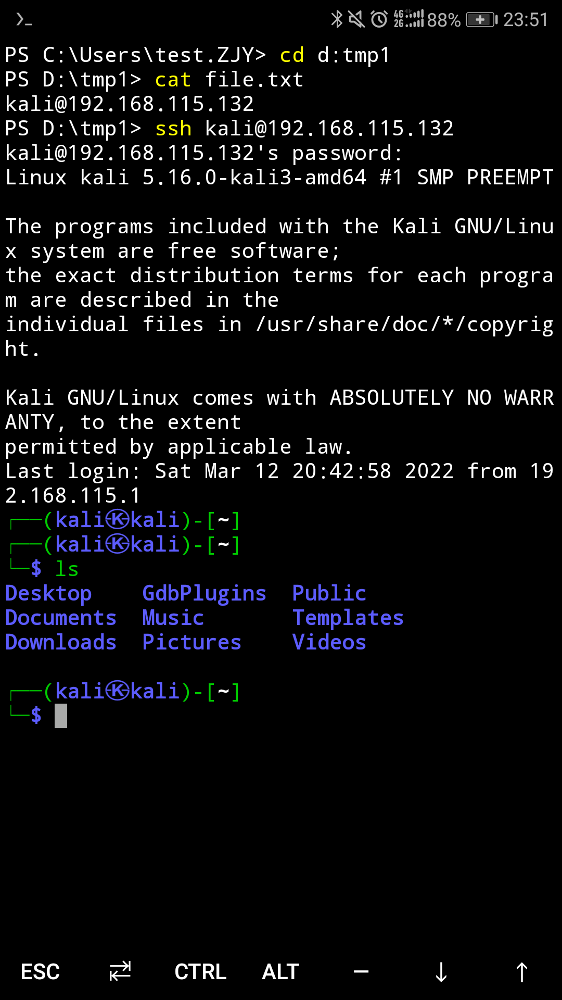
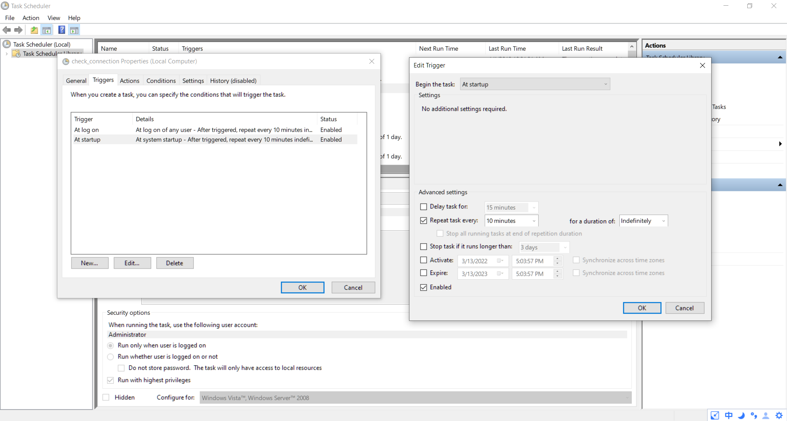

layout: post

title: 如何打造一个究极舒适的pwn环境（第二季）

author: junyu33

tags: 

- web
- python

categories: 

- develop

date: 2022-3-13 17:30:00

---

现在的问题是，如果你临时回家，没有带电脑。但你又想操纵位于学校的电脑，又该怎么办呢？

成果图：



我们假设读者已经完成的上一季的配置，并确保自己拥有公网ip。

<!-- more -->

# 方法一——使用ddns

每一个设备，都拥有自己唯一的ip地址。理论上如果你要访问一个设备，你只需要访问它的ip地址就可以了。

然而，在当今ipv4资源稀缺的情况下（世界人口大于70亿，而理论可用的ipv4地址只有$2^{32}$个），部分运营商会将一个公网ip通过NAT转换成多个内网ip，以缓解资源不足的压力。**而只有公网里的ip，才可以互相访问。**

> 如何查看自己是不是公网ip呢，在命令行中输入`ipconfig`查看ip，并和搜索引擎的结果进行对比，如果相同便是公网ip，反之就是内网ip。

即便你的设备很幸运，是公网ip，但对于访问该设备来说，仍然存在一个问题——一般情况下，设备的ISP分配的ip地址是动态变化的。短则几小时，长则半个月。如果你连接断线或者重启设备，相应的ip也会变化。

而ddns就解决的是后一个问题——它将设备变化的ip映射到一个固定的域名。用户只需要访问这个域名就可以连接到该设备。

我使用的是花生壳ddns，在[官网](https://hsk.oray.com/)下载并注册后，系统会自动给你分配一个域名。你在其他设备上用ssh访问这个域名就可以连接了。

存在的问题：

- 开机启动的应用又增加了一个。
- 不能使用代理。
- 某些情况下使用ddns会导致宽带断线，且无法重连。

# 方法二——使用ip检测脚本，并发送到邮箱

另外一种思路是使用脚本在ip查询网站，查询自己的ip地址。如果脚本发现ip发生了变化，就向自己的邮箱发送新的ip地址。

这个思路看上去简单明了，但是实际操作并非如此。

首先，我复制了一份实现以上功能的python脚本（还是有点长的）：

```python
import json
from urllib.request import urlopen

import os
import time

import smtplib
from email.header import Header
from email.mime.text import MIMEText

# 两个获取ip地址的网站
ip_url_1 = 'https://api.ipify.org/?format=json'
ip_url_2 = 'http://jsonip.com'

# 配置文件名
config_file_name = '.global_ip.json'

# 第三方 SMTP 服务
mail_host = "smtp.qq.com"      # SMTP服务器
mail_user = "2658799217"      # 用户名
mail_pass = "<thisisasecret>"  # 授权密码，非登录密码，相信大家都知道怎么获取授权码吧，要给腾讯发短信。

sender = '2658799217@qq.com'    		# 发件人邮箱(最好写全, 不然会失败)
receivers = ['2658799217@qq.com']  	# 接收邮件，可设置为你的QQ邮箱或者其他邮箱

title = 'update_addr'  			# 邮件主题
content = ''    				# 邮件内容

# 检查配置文件及其权限
def check_configfile_exist():
    file_exist = os.access(config_file_name, os.F_OK)
    file_read  = os.access(config_file_name, os.R_OK)
    file_write = os.access(config_file_name, os.W_OK)
    return{'file_exist':file_exist,'file_read':file_read,'file_write':file_write}

def generate_configfile(ip_addr):
    config_construct = {
        "ip_addr": ip_addr
    }
    with open(config_file_name, "w", encoding='utf8') as fp:
        fp.write(json.dumps(config_construct,indent=4, ensure_ascii=False))
    fp.close()

def sendEmail():

    message = MIMEText(content, 'plain', 'utf-8')  # 内容, 格式, 编码
    message['From'] = "{}".format(sender)
    message['To'] = ",".join(receivers)
    message['Subject'] = title

    try:
        smtpObj = smtplib.SMTP_SSL(mail_host, 465)  # 启用SSL发信, 端口一般是465
        smtpObj.login(mail_user, mail_pass)  # 登录验证
        smtpObj.sendmail(sender, receivers, message.as_string())  # 发送
        print("mail has been send successfully.")
    except smtplib.SMTPException as e:
        print(e)

def send_email2(SMTP_host, from_account, from_passwd, to_account, subject, content):
    email_client = smtplib.SMTP(SMTP_host)
    email_client.login(from_account, from_passwd)
    # create msg
    msg = MIMEText(content, 'plain', 'utf-8')
    msg['Subject'] = Header(subject, 'utf-8')  # subject
    msg['From'] = from_account
    msg['To'] = to_account
    email_client.sendmail(from_account, to_account, msg.as_string())
    email_client.quit()


localtime = time.localtime(time.time()) # 打印本地时间
print("\n" + time.asctime(localtime))

# 通过两个网站获取ip地址
my_ip_1 = str(json.load(urlopen(ip_url_1))['ip'])
my_ip_2 = str(json.load(urlopen(ip_url_2))['ip'])

if (my_ip_1 == my_ip_2):
    ip_addr = my_ip_1
else:
    ip_addr = "ip_1 :" + my_ip_1 + "\n" + "ip_2 :" + my_ip_2

if(check_configfile_exist()['file_exist'] & check_configfile_exist()['file_write']):
    config_file = open(config_file_name,'r')
    read_context = json.load(config_file)
    old_ip = read_context['ip_addr']
    config_file.close()
    if (old_ip == ip_addr):
        print("ip address is up-to-date")
    else:
        content = "old ip address is : " + old_ip + '\n' + "new ip address is : " + ip_addr
        sendEmail()
        generate_configfile(ip_addr)
else:
    generate_configfile(ip_addr)
    content = "new ip address is : " + ip_addr
    sendEmail()


```

当然，只凭借这个脚本，确实可以实现上述功能。但是要是在无人值守的情况下，我们又该怎么办呢？

凭借高中写对拍脚本学到的微不足道的语法，我写了一个bat，它首先检测设备有没有联网，如果没有联网就间隔10秒再检测，否则就调用这个脚本并暂停10分钟。

```bat
@echo off
    
:start
ping -n 2 114.114.114.114 | find "TTL=" >nul
if errorlevel 1 (
TIMEOUT 10
goto:start
) else (
pythonw D:/tmp1/tmp/test.py ::这里使用pythonw是为了防止弹出窗口，这在打游戏的时候非常重要。
)
TIMEOUT 600
goto:start
```

但是又存在一个新问题——这个脚本本身也要弹出窗口啊？是不是很套娃呢？

于是，我上网查阅资料发现：vbs脚本在运行的时候不会有任何提示（除了命令出错的时候），可以解决这个问题。

我又从网上嫖到了使用vbs脚本运行命令和bat文件的代码：

```vbscript
CreateObject("WScript.Shell").run"Rasdial 123 <telephone> <passwd>",0
set ws=wscript.createobject("wscript.shell") 
   ws.run "D:/tmp1/tmp/start.bat /start",0
```

这个vbs做了两件事，一是自动拨号上网，二是调用之前的bat文件。

我亲自断网，并实际运行了一下，发现拨号成功了，也收到了梦寐以求的ip更换的邮件。

还剩下最后一个问题——如何定时运行这个脚本？

## 子方法一——在vbs脚本里写代码，让其定时运行

~~还没学会vbs语法呢ლ(╹◡╹ლ)——暂时填坑。~~

## 子方法二——使用任务计划程序

我在任务计划里添加了这个vbs脚本，设置了系统启动和用户登录时运行它，甚至让他每隔十分钟触发一次，如图所示：



然而，在系统启动时，系统确实可以帮我自动拨号，但是我没有收到更改ip的邮件。只有当我手动运行了这个vbs后，它才能做到发邮件的功能。

存在的问题：

- 开机只能拨号，不能发邮件。
- 不能使用代理。
- 操作略显麻烦。

# windows默认终端设置

老朽的cmd用着非常不方便，没有语法高亮，cd不同盘符的路径还得多敲一句命令，太麻烦了。

在powershell中运行下面这句命令，可以将设备的默认终端更换为powershell：

```powershell
New-ItemProperty -Path "HKLM:\SOFTWARE\OpenSSH" -Name DefaultShell -Value "C:\Windows\System32\WindowsPowerShell\v1.0\powershell.exe" -PropertyType String -Force
```

我为什么不用cmder呢？我试了，ssh调用cmder要闪退，具体不知道什么原因。
