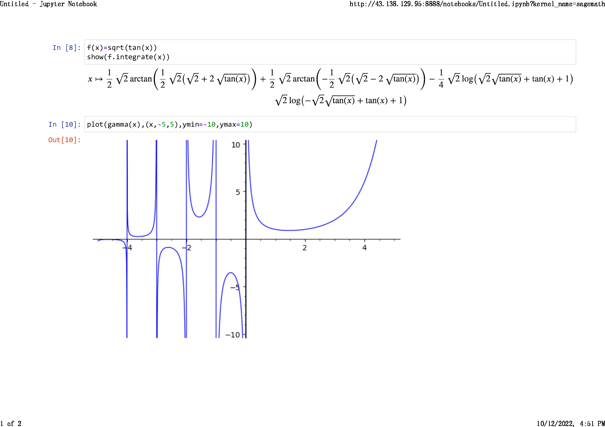
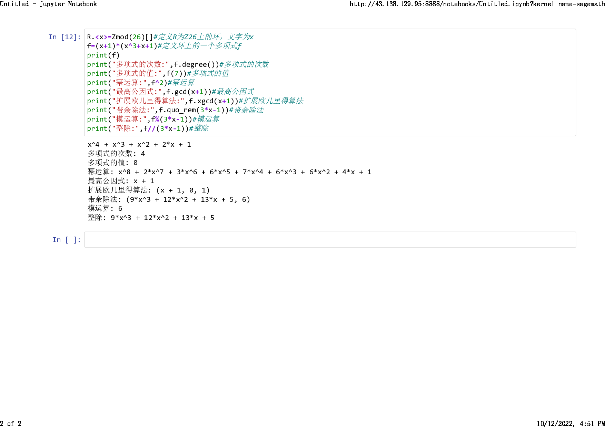

layout: post
title: 子域名calc.junyu33.me开张了
author: junyu33
mathjax: true
categories: 

  - develop

date: 2022-10-12 16:30:00

---

是一个sagemath的客户端，部署在腾讯云服务器的docker上。

密码见正文。

<!-- more -->

# 啥是sagemath？

> **SageMath** (previously **Sage** or **SAGE**, "System for Algebra and Geometry Experimentation"[[3\]](https://en.wikipedia.org/wiki/SageMath#cite_note-3)) is a [computer algebra system](https://en.wikipedia.org/wiki/Computer_algebra_system) (CAS) with features covering many aspects of [mathematics](https://en.wikipedia.org/wiki/Mathematics), including [algebra](https://en.wikipedia.org/wiki/Algebra), [combinatorics](https://en.wikipedia.org/wiki/Combinatorics), [graph theory](https://en.wikipedia.org/wiki/Graph_theory), [numerical analysis](https://en.wikipedia.org/wiki/Numerical_analysis), [number theory](https://en.wikipedia.org/wiki/Number_theory), [calculus](https://en.wikipedia.org/wiki/Calculus) and [statistics](https://en.wikipedia.org/wiki/Statistics).
>
> The first version of SageMath was released on 24 February 2005 as [free and open-source software](https://en.wikipedia.org/wiki/Free_and_open-source_software) under the terms of the [GNU General Public License](https://en.wikipedia.org/wiki/GNU_General_Public_License) version 2, with the initial goals of creating an "open source alternative to [Magma](https://en.wikipedia.org/wiki/Magma_computer_algebra_system), [Maple](https://en.wikipedia.org/wiki/Maple_(software)), [Mathematica](https://en.wikipedia.org/wiki/Mathematica), and [MATLAB](https://en.wikipedia.org/wiki/MATLAB)".[[4\]](https://en.wikipedia.org/wiki/SageMath#cite_note-4) The originator and leader of the SageMath project, [William Stein](https://en.wikipedia.org/wiki/William_A._Stein), was a [mathematician](https://en.wikipedia.org/wiki/Mathematician) at the [University of Washington](https://en.wikipedia.org/wiki/University_of_Washington).
>
> SageMath uses a [syntax](https://en.wikipedia.org/wiki/Syntax_(programming_languages)) resembling [Python](https://en.wikipedia.org/wiki/Python_(programming_language))'s,[[5\]](https://en.wikipedia.org/wiki/SageMath#cite_note-5) supporting [procedural](https://en.wikipedia.org/wiki/Procedural_programming), [functional](https://en.wikipedia.org/wiki/Functional_programming) and [object-oriented](https://en.wikipedia.org/wiki/Object-oriented_programming) constructs.
>
> https://en.wikipedia.org/wiki/SageMath

简单来说是开源的mathematica、matlab。由于其密码学功能比较强大，经常被CTF Cryptoer拿来出题（解题）。

# 效果





# 环境

- ubuntu 20.04
- docker 20.10.18
- python 3.9.9
- jupyter 4.1
- sagemath 9.5

# 密码

为了规避潜在的风险与提高使用者的平均素质，这里不直接给出密码，而是使用AES加密的密码。

```python
mode: CBC
iv: Gem/pcwHSYjWQakOktVEXg==
ciphertext: cU8LHI24FtZFVm37sJAEIg==
key: Y2FsYy5qdW55dTMzLm1lAA==
```

密码只含有数字与大小写字母。