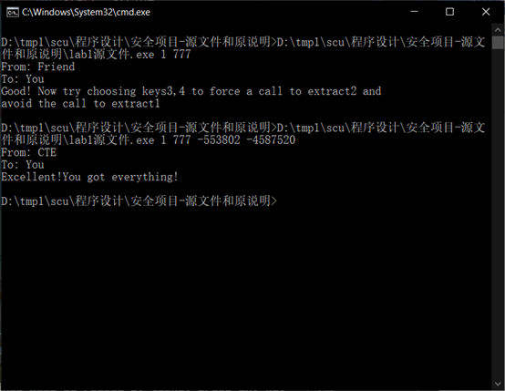
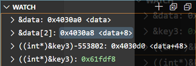

layout: post
title: 安全项目第一题解答及思路分析
author: junyu33
mathjax: false
tags: 

  - pwn
  - crypto

categories:

  - ctf

date: 2021-10-29 12:25:00

---

# 解答（四个key及message）：

           

（注意：这个key在不同的系统，甚至同一个系统的不同IDE得到的结果都不同，因此答案仅供参考）。

<!-- more -->

 

# 思路分析：

​    先贴上源代码:

```C
#include <stdio.h>
#include <stdlib.h>

int prologue [] = {
   0x5920453A, 0x54756F0A, 0x6F6F470A, 0x21643A6F,
   0x6E617920, 0x680A6474, 0x6F697661, 0x20646E69,
   0x63636363, 0x63636363, 0x72464663, 0x6F6D6F72,
   0x63636363, 0x63636363, 0x72464663, 0x6F6D6F72,
   0x2C336573, 0x7420346E, 0x20216F74, 0x726F5966,
   0x7565636F, 0x20206120, 0x6C616763, 0x74206C6F,
   0x20206F74, 0x74786565, 0x65617276, 0x32727463,
   0x594E2020, 0x206F776F, 0x79727574, 0x4563200A
};

int data [] = {
   0x63636363, 0x63636363, 0x72464663, 0x6F6D6F72,
   0x466D203A, 0x65693A72, 0x43646E20, 0x6F54540A,
   0x5920453A, 0x54756F0A, 0x6F6F470A, 0x21643A6F,
   0x594E2020, 0x206F776F, 0x79727574, 0x4563200A,
   0x6F786F68, 0x6E696373, 0x6C206765, 0x796C656B,
   0x2C336573, 0x7420346E, 0x20216F74, 0x726F5966,
   0x7565636F, 0x20206120, 0x6C616763, 0x74206C6F,
   0x20206F74, 0x74786565, 0x65617276, 0x32727463,
   0x6E617920, 0x680A6474, 0x6F697661, 0x20646E69,
   0x21687467, 0x63002065, 0x6C6C7861, 0x78742078,
   0x6578206F, 0x72747878, 0x78636178, 0x00783174
};

int epilogue [] = {
   0x594E2020, 0x206F776F, 0x79727574, 0x4563200A,
   0x6E617920, 0x680A6474, 0x6F697661, 0x20646E69,
   0x7565636F, 0x20206120, 0x6C616763, 0x74206C6F,
   0x2C336573, 0x7420346E, 0x20216F74, 0x726F5966,
   0x20206F74, 0x74786565, 0x65617276, 0x32727463
};

char message[100];

void usage_and_exit(char * program_name) {
   fprintf(stderr, "USAGE: %s key1 key2 key3 key4\n", program_name);
   exit(1);
}

void process_keys12 (int * key1, int * key2) {
   
   *((int *) (key1 + *key1)) = *key2;
}

void process_keys34 (int * key3, int * key4) {

   *(((int *)&key3) + *key3) += *key4;
}

char * extract_message1(int start, int stride) {
   int i, j, k;
   int done = 0;

   for (i = 0, j = start + 1; ! done; j++) {
      for (k = 1; k < stride; k++, j++, i++) {

         if (*(((char *) data) + j) == '\0') {
            done = 1;
            break;
         }
                      
         message[i] = *(((char *) data) + j);
      }
   }
   message[i] = '\0';
   return message;
}

char * extract_message2(int start, int stride) {
   int i, j;

   for (i = 0, j = start; 
       *(((char *) data) + j) != '\0';
       i++, j += stride) 
       {
          message[i] = *(((char *) data) + j);
       }
   message[i] = '\0';
   return message;
}

int main (int argc, char *argv[])
{
   int dummy = 1;
   int start, stride;
   int key1, key2, key3, key4;
   char * msg1, * msg2;

   key3 = key4 = 0;
   if (argc < 3) {
      usage_and_exit(argv[0]);
   }
   key1 = strtol(argv[1], NULL, 0);
   key2 = strtol(argv[2], NULL, 0);
   if (argc > 3) key3 = strtol(argv[3], NULL, 0);
   if (argc > 4) key4 = strtol(argv[4], NULL, 0);

   process_keys12(&key1, &key2);

   start = (int)(*(((char *) &dummy)));
   stride = (int)(*(((char *) &dummy) + 1));

   if (key3 != 0 && key4 != 0) {
      process_keys34(&key3, &key4);
   }

   msg1 = extract_message1(start, stride);

   if (*msg1 == '\0') {
      process_keys34(&key3, &key4);
      msg2 = extract_message2(start, stride);
      printf("%s\n", msg2);
   }
   else {
      printf("%s\n", msg1);
   }

   return 0;
}


```


程序并没有用到prologue和epilogue这两个数组,因此我们忽略它.

对data里面的数值转成字符串，得到：

```C
cccccccccFFrromo
: mFr:ie ndC.TTo
:E Y.ouT.Gooo:d!
  NYowo tury. cE
hoxoscineg lkely
se3,n4 tto! fYor
oceu a  cgalol t
to  eextvraectr2
 yantd.havioind 
gth!e .caxllx tx
o xexxtrxacxt1x.

```


我们可以隐隐约约地看到明文的影子(比如说from,friend,good之类的单词)，但是我们还需要观察解密函数来确定它。

先看extract_message1:

```C
char * extract_message1(int start, int stride) {
   int i, j, k;
   int done = 0;

   for (i = 0, j = start + 1; ! done; j++) {
      for (k = 1; k < stride; k++, j++, i++) {

         if (*(((char *) data) + j) == '\0') {
            done = 1;
            break;
         }
                      
         message[i] = *(((char *) data) + j);
      }
   }
   message[i] = '\0';
   return message;
}

```


程序的含义是从start+1(包括)处开始，每将stride-1个数据转成字符串存到message后，跳过1个数据，一直循环，直到读到ASCII码为0结束。

我们可以肉眼观察到，程序从第10个字符（注意我们数数是从0开始的）开始,每读2个跳一个刚好合适，组成了(From: Friend To: You…)这样的英语句子。因此我们可以确定start=9,stride=3.

将代码改装一下，再运行，就得到了我们的第一个message.

 

**可是,这才只是我们的第一步，我们还要把key1跟key2弄出来才行。**

 

然后你会惊奇的发现：

**我们输入的key1,key2跟start,stride这两个变量没有半毛钱关系是不是?**

start，stride这两个变量都跟dummy这个变量有关系，我们必须设法通过输入来改变dummy的值，进而改变start和stride。

**这就是C语言指针的妙用之处了。**

关注process_keys12这个函数：

```C
void process_keys12 (int * key1, int * key2) {

  

  *((int *) (key1 + *key1)) = *key2;

}
```


代码的意思是将储存在（**地址**key1+key1的值）作为一个新的地址，把key2的值赋值到这个新地址的值里。（这个没点指针功底还真玩不转）

通过调试,我们可以发现dummy的地址是0x61fe04，而key1的地址是0x61fe00，而学过计导的同学都知道，一个int类型占据四个字节的空间所以key1的值应该取1才正确。

我们的下一个问题是dummy应该赋什么值。看过csapp的同学都知道，我们的数据是小段存放的，也就是小地址存放低位，大地址存放高位。显然start属于低地址，而stride输入高地址，且相差一个sizeof(char)也就是一字节，一字节对应两个16进制位。因此key2是0x309，转化成十进制是777.

 

然后key3和key4就比较恼火了，先看message1给出的提示是：

**“选择一组key3，key4来绕过extract1，并强制调用extract2.”**

先来分析extract2这个函数：

```C
char * extract_message2(int start, int stride) {
   int i, j;

   for (i = 0, j = start; 
       *(((char *) data) + j) != '\0';
       i++, j += stride) 
       {
          message[i] = *(((char *) data) + j);
       }
   message[i] = '\0';
   return message;
}

```


意思是从start开始，步长为stride去读字符。碰到ASCII码为0就结束。

我们仍然可以肉眼观察到，当start=9，stride=3时可以解密出运行截图中的message2.

现在的问题又回到的传参上面，当时我一直不明白为什么要**绕过**extract1.待我仔细分析程序结构后，才发现：

首先，你不能改变start和stride的值，否则你咋解密？

但是如果你不改变，那么就一定能解出开头不为0的message1，这似乎很矛盾，我们得换个思路。

*网上为数不多的题解的思路是通过修改返回地址，来跳转到那个恼人的判断里面去。而因为一些不明原因，我即使按照它的思路成功跳转，绕过了if判断，然而main程序的返回值却不为0（可能是因为栈溢出触发了编译器的安全机制，因此有时候安全也是件坏事），从而无法回显message2。*

我的想法是尝试**在process_key34中修改data的值**，我们来查看一下这个函数：

```C
void process_keys34 (int * key3, int * key4) {

   *(((int *)&key3) + *key3) += *key4;
}

```


其实跟process_keys12差不多，只是中间的“+”变成了"+="。

因为message1读取的第一个字符是(\*char)data[10]（data[2]=0x72**46**4663中加粗的部分，永远不要忘了小端序），我们只需要把data[2]变成0x72004663就可以使message1为空串。

接下来的事情就是要将(int*)&key3的地址通过key3的值偏移到data[2]中。



（注意这些地址每次启动程序都会有变化，因此截图仅供参考）

通过调试我们可以看到(int*)&key3是0x61fdd0，而data[2]的地址是0x4030a8，这些数据都占四个字节的空间，因此偏移为(0x4030a8-0x61fdd0)/4=-553802，这就是key3的值。

key4就很好说了，我们要把0x72464663变为0x72004663，因此只需加上-0x460000即可，转换成十进制就是-4587520，也就是key4的值。

**解题完毕**

 

# 评价：

作为一个pwn手，完成这道题并写完这篇思路也花费了我三个晚上的时间。在我看来，这道题涉及的知识点有一点超出了教材的范围（毕竟C语言的精华之所在哪里是教材三言两语说得清的）。如果让一个才学完课程，勉强搞得清&与\*这两个符号的同学去做这道题，实在是强人所难。**但是我也不得不承认，如果是自己独立完成了这道题的解答**（其实我也借鉴了求解key1、key2的思路）**，那么你的C语言的水平就迈上了一个新的台阶（甚至比普通的OIer都还要强），也可以去朝着CTF的二进制方向发展了。**