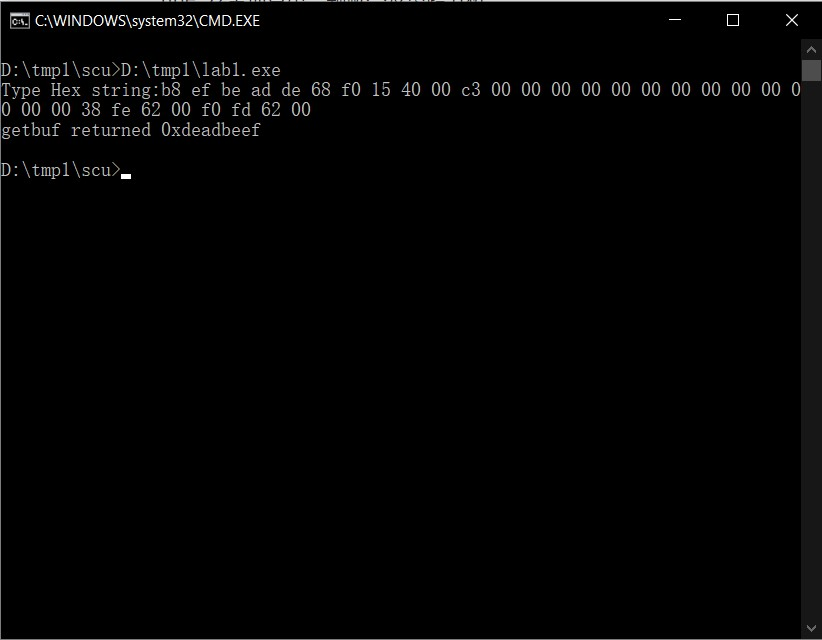
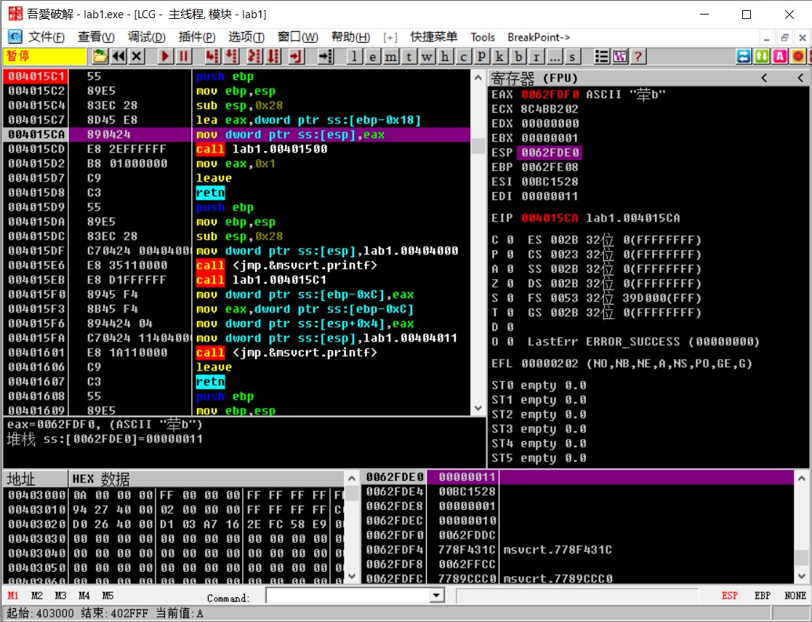
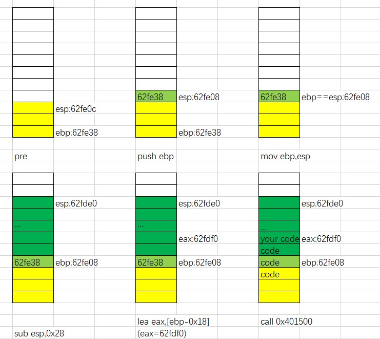
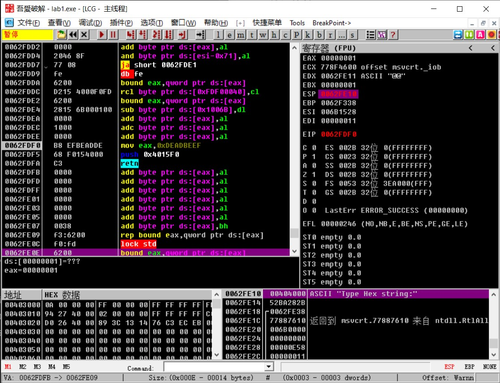
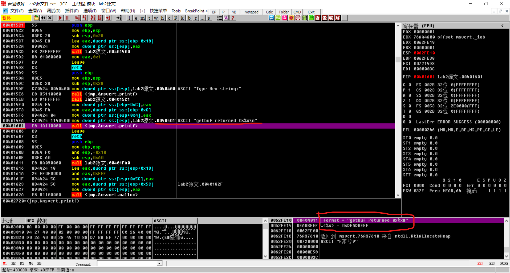
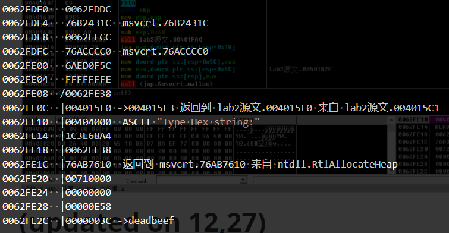

layout: post
title: 安全项目第二题解答及思路分析
author: junyu33
mathjax: false
tags: 

  - pwn
  - reverse

categories:

  - ctf

date: 2021-11-6 12:30:00

---

# 解答



使用的是dev c++中TDM-GCC 4.9.2 32-bit Debug编译器，其他新版本的编译器做了安全优化，我智商斗不过它们，就放弃了。

<!-- more -->


# 思路分析：

## 一句话总结：

> 汇编知识是逃不脱的，一辈子也逃不脱的。

## 需要用到的工具：

- devc++/vs
- ollydbg（或者吾爱破解特供版）

## 源代码：

```C
	/* bufbomb.c
 *
 * Bomb program that is solved using a buffer overflow attack
 *
 * program for CS:APP problem 3.38
 *
 * used for CS 202 HW 8 part 2
 *
 * compile using
 *   gcc -g -O2 -Os -o bufbomb bufbomb.c
 */

#include <stdio.h>
#include <stdlib.h>
#include <ctype.h>

/* Like gets, except that characters are typed as pairs of hex digits.
   Nondigit characters are ignored.  Stops when encounters newline */
char *getxs(char *dest)
{
  int c;
  int even = 1; /* Have read even number of digits */
  int otherd = 0; /* Other hex digit of pair */
  char *sp = dest;
  while ((c = getchar()) != EOF && c != '\n') {
    if (isxdigit(c)) {
      int val;
      if ('0' <= c && c <= '9')
	val = c - '0';
      else if ('A' <= c && c <= 'F')
	val = c - 'A' + 10;
      else
	val = c - 'a' + 10;
      if (even) {
	otherd = val;
	even = 0;
      } else {
	*sp++ = otherd * 16 + val;
	even = 1;
      }
    }
  }
  *sp++ = '\0';
  return dest;
}

int getbuf()
{
  char buf[16];
  getxs(buf);
  return 1;
}

void test()
{
  int val;
  printf("Type Hex string:");
  val = getbuf();
  printf("getbuf returned 0x%x\n", val);
}

int main()
{
  int buf[16];
  /* This little hack is an attempt to get the stack to be in a
     stable position
  */
  int offset = (((int) buf) & 0xFFF);   
  int *space = (int *) malloc(offset);  
  *space = 0; /* So that don't get complaint of unused variable */
  test();
  return 0;
}
```

相比于上一题来说，这道题的代码友好多了。即使看上去冗长的getxs函数，也只是简单地将你输入的16进制字符串转化为16进制数，然后存放到buf这个缓冲区里。

但是，这跟getbuf的返回值又有什么关系呢？我猛然发现getxs这个函数没有限制输入长度，意识到这是个简单的缓冲区溢出。然而我在强网杯比赛的时候就是直接复制的python代码，哪里知道溢出的原理？所以，我进入了漫长的学习过程。

## 前置知识1——汇编

### 寄存器

eax~edx：通用寄存器，变量的临时储存点，也可以用来寻址。

esp：栈顶指针。

ebp：栈底指针。

eip：指令的地址（通俗理解为代码的行数）。

### 指令（以intel语法为例）

mov：复制指令，在将后者的值赋值给前者。

add：前面的数加后面的数（sub，mul同理）

push：将储存器的值加到栈顶中，同时esp-=sizeof(type)

pop：取出栈顶的值给寄存器，同时esp+=sizeof(type)

lea：将后者的地址取出来给前者。

ptr：类型强制转换。

ss：汇编代码有四个段（segment）寄存器，分为cs（code），ds（data），ss（stack），es（extra），不同段中的寄存器相互独立，因此需要加以区别。

更多知识请参考：[汇编语言程序设计](https://www.icourse163.org/learn/ZZU-1001796025#/learn/announce)

## 前置知识2——堆栈图

**注意，堆栈不是一块独立的区域，而是程序运行时，内存中实际存在的一部分！因此你可以在内存窗口中找到堆栈数据。**

堆栈遵循栈底地址高，栈顶地址低的原则。由于小段存储，我们输入的数据都是由低到高堆积而成。

一个堆栈图需要包含当前的状态（命令），堆栈储存的情况，esp与ebp指针。最好可以用不同的颜色来表示不同操作对堆栈的影响，使程序的流程更清晰。

在分析汇编代码的过程中顺手画堆栈图是一个良好的习惯。

更多知识请参考：[堆栈图1](https://www.bilibili.com/video/BV1w54y1y7Di?p=12)

## 解法

经过了一周的漫长学习，我终于有了解决这道题所需的能力。

类似于ret2shellcode，我们需要通过getbuf函数中，缓冲区溢出的漏洞，将buf中的字符串写到return的值里，从而返回字符串的起始地址，让cpu执行字符串中的十六进制指令再返回到test函数中，从而输出想要的值。

("eax=deadbeef"+return test+"00"+ebp+head address)

### 找到函数地址

先用devc++调试源文件，将断点设置在getbuf函数中，按F5调试再查看CPU窗口，显示的就是汇编代码。在我的电脑中该函数的起始地址是0x4015c1，这就是getbuf函数的起始地址。

在ollydbg中打开这个程序，Ctrl+G定位到这个地址，我们的准备工作就算完成了。



### 分析汇编代码——updated on 1/17/2022

> updated on 1/17/2022: 本节堆栈图的画法不是很标准，堆栈图的绘制应遵循**高地址在上，低地址在下**的原则。

可以发现，getbuf这个函数在内存的地址是从0x4015c1~0x4015d8，接下来我们结合堆栈图来理解这段代码。

4015c1：将当前栈底的地址复制到栈顶，esp指针-4，可以理解为备份入栈前状态。

4015c2：ebp和esp指针在同一高度。

4015c4：esp-40，可以理解为中间写入数据做准备。

4015c7：将eax赋值为ebp-24的地址，准备写入字符串。

4015ca：把eax的值赋值给栈顶。

4015cd：调用getxs函数，在eax处写入字符串。

4015d2：将eax赋值为1。

4015d7：离开（等价于mov esp,ebp和pop ebp），取回入栈前状态。

4015d8：返回（等价于pop eip）。



（都栈溢出了，程序运行逻辑改变，再画也没有意义）

### 撰写exp

（你可以理解成手写简单汇编）......

#### 执行的命令

由于程序返回值在eax中，我们要改变eax的值，命令是：

```assembly
mov eax,0xdeadbeef
```

然后我们要在最后一步跳出getbuf函数，需要知道getbuf返回后的地址是什么。我们再次使用devc++调试test函数，得知他的起始地址为4015d9。观察汇编代码，可以看到4015eb的地址上调用了4015c1地址（即getbuf），因此合适的返回值就是它的下一行4015f0.

我们知道retn是在栈顶中取值，因此要push这个修改后的返回地址，再返回。

```assembly
push 0x4015f0
retn
```

然后每一个汇编指令都是其机器代码对应的简写，我们还需要把它转换为16进制数。你可以选择使用gcc命令，也可以在ollydbg的汇编代码中寻找，主窗口的第二列就是右侧汇编代码翻译过来的。总之，转换后的结果是：

>b8 ef be ad de 68 f0 15 40 00 c3

#### 偷梁换柱

我们做的第二步就是将程序从正常的return环节中，试图转移到前一步编写的代码上。

在栈底指针esp中，保存着test函数的栈帧基址，而这个数据不能改动，否则程序将会崩溃。

（其实就是返回前有个pop ebp的操作，这个值不能出现错误，有始有终，如果看了那个B站视频会更明白一点）

紧接着在基址后面，填上字符串的起始地址，使eip跳转到这个位置去执行代码。

（就是retn命令中的pop eip的eip被人为修改了）

显然ebp的值在堆栈图里已经提到了，是62fe38；而eip则应该是中间的eax值62fdf0。

> 38 fe 62 00 f0 fd 62 00

#### 确定长度

首先buf的起点是62fdf0，这个很容易可以得到。

有些同学可能会认为既然buf数组的长度为16，而我们的命令用了11个字节，只需要再填充5个字节的00即可。其实并不是这样，编译器预留的空间总会比你想象得更多一点，这就是做OI题有些该RE，实际上却WA的原因。同理，将esp减少的值（此处为40）理解成exp的长度也不对。

正确的长度是最后堆栈图中“code”的长度，具体做法是将程序调试到0x4015ca处（也就是第五个堆栈图），查看ebp，为62fe08。

剩下的两个地址每个4字节，因此长度为62fe08-62fdf0+8=32。因此一共要填充32-8-11=13个字节的00。

#### 最终答案

通过上述过程，我们得到了最终的答案为：

> b8 ef be ad de 68 f0 15 40 00 c3 00 00 00 00 00 00 00 00 00 00 00 00 00 38 fe 62 00 f0 fd 62 00

我们成功改变了程序的走向，且没有出错。



# 总结

系统级编程果然并非易事，我要开始担心自己的头发了。

~~第三个安全项目，再（也不）见。~~

我，学籍在高三，上着大一的课，学着大二的知识点，却在做以前大三的作业——川大真不错，课程难度都可以和C9高校比肩了！

# (updated on 12,12)

（容易想到且较为主流的方法，类似于ret2libc）

学长的另外一种思路是("00"+ebp+return test.printf+address of string+"deadbeef") 。这种方式思路更加简单，但是你得知道printf的传参方式是先取地址，再直接append一个立即数。

> 00 00 00 00 00 00 00 00 00 00 00 00 00 00 00 00 CC CC CC CC CC CC CC CC 38 FE 62 00 01 16 40 00 11 40 40 00 EF BE AD DE 



# (updated on 12,28)

程序设计课上老师的思路是：将输入地址到test函数中val地址之间的内存数据都导出来，我们只需要修改getbuf函数的返回地址到0x4015f3，来避开上一行eax对ebp-0xC（也就是val的地址）处的赋值，然后在输入中将val地址的值修改为0xdeadbeef即可。



因此答案是：

> DC FD 62 00 1C 43 B2 76 CC FF 62 00 C0 CC AC 76 5C 0F ED 6A FE FF FF FF 38 FE 62 00 F3 15 40 00 00 40 40 00 A4 68 3E 1C 38 FE 62 00 10 76 AB 76 00 00 71 00 00 00 00 00 58 0E 00 00 ef be ad de 