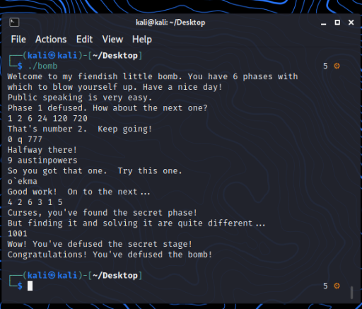
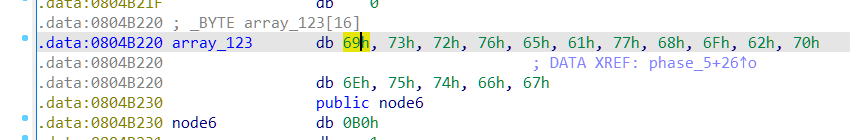
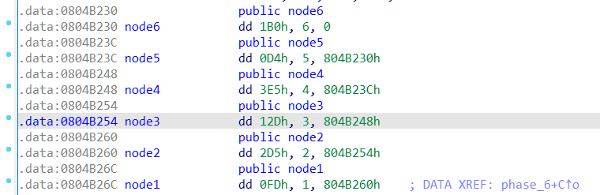
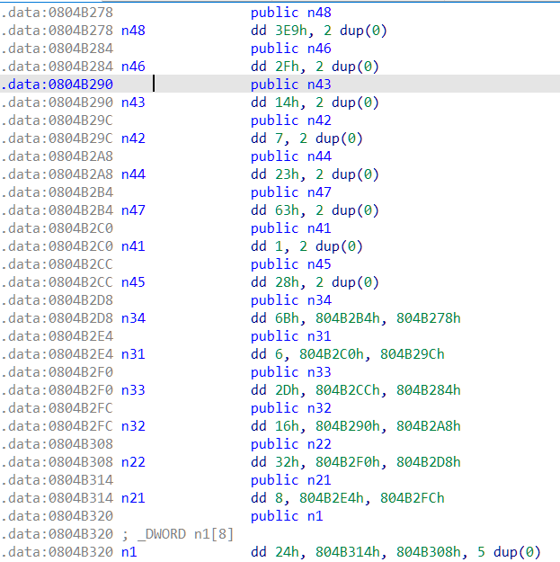
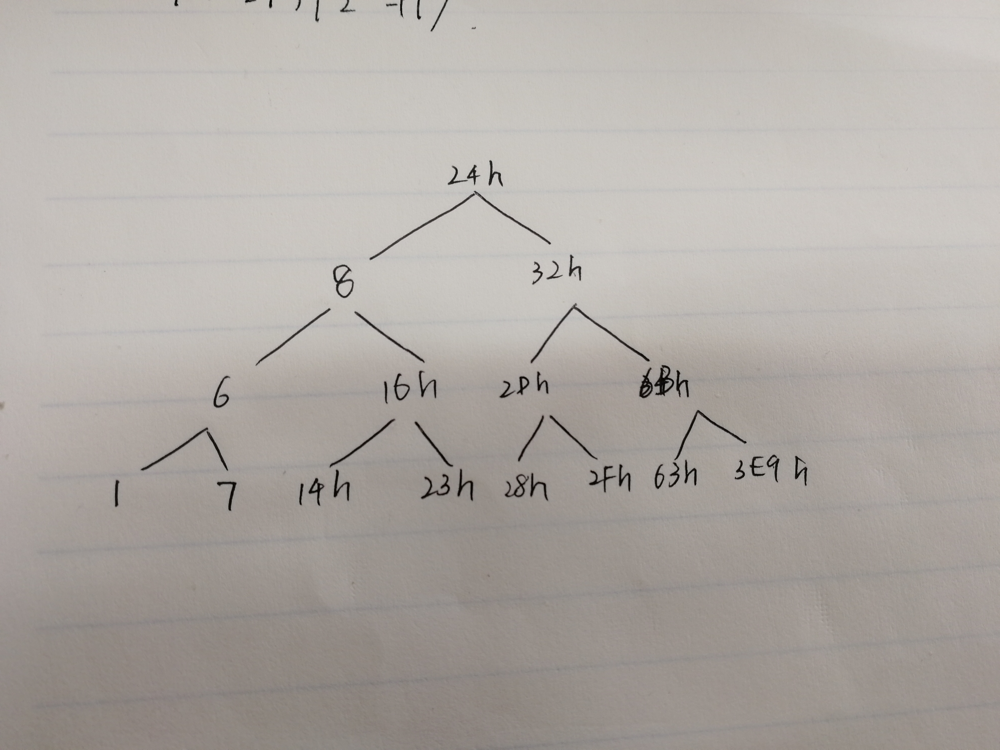

layout: post
title: 安全项目第三题解答及思路分析
author: junyu33
mathjax: false
tags: 

- reverse

categories:

  - ctf

date: 2021-12-11 9:30:00

---

# 解答



一道不错的逆向题，7个小题的难度是逐渐攀升的，很适合新手。

<!-- more -->

# 思路分析

以下过程均基于IDA 7.5完成，相信有兴趣看这道题的手头都有IDA吧。

（当然作者的原意是想让你看汇编，gdb调试，那就很秃头了）

main函数的逻辑很简单，程序提供了文件输入功能（带参数1）和标准输入（参数为空）。接下来你需要回答6个问题（phase），任何一个问题回答错误，炸弹都会爆。

下面我将逐phase进行分析。

## phase_1

```c
int __cdecl phase_1(int a1)
{
  int result; // eax

  result = strings_not_equal((_BYTE *)a1, "Public speaking is very easy.");
  if ( result )
    explode_bomb();
  return result;
}
```

字符串比较，直接输入`Public speaking is very easy.`即可。

## phase_2

```c
int __cdecl phase_2(char *s)
{
  int i; // ebx
  int result; // eax
  int v3[6]; // [esp+10h] [ebp-18h] BYREF

  read_six_numbers(s, (int)v3);
  if ( v3[0] != 1 )
    explode_bomb();
  for ( i = 1; i <= 5; ++i )
  {
    result = v3[i - 1] * (i + 1);
    if ( v3[i] != result )
      explode_bomb();
  }
  return result;
}
```

读入六个数，然后判断` v3[i] == v3[i - 1] * (i + 1)` ，即简单的阶乘函数。

## phase_3

```c
int __cdecl phase_3(char *s)
{
  int result; // eax
  char v2; // bl
  int v3; // [esp+Ch] [ebp-Ch] BYREF
  char v4; // [esp+13h] [ebp-5h] BYREF
  int v5; // [esp+14h] [ebp-4h] BYREF

  if ( sscanf(s, "%d %c %d", &v3, &v4, &v5) <= 2 )
    explode_bomb();
  result = v3;
  switch ( v3 )
  {
    case 0:
      v2 = 'q';
      if ( v5 != 777 )
        explode_bomb();
      return result;
    case 1:
      v2 = 'b';
      if ( v5 != 214 )
        explode_bomb();
      return result;
    case 2:
      v2 = 'b';
      if ( v5 != 755 )
        explode_bomb();
      return result;
    case 3:
      v2 = 'k';
      if ( v5 != 251 )
        explode_bomb();
      return result;
    case 4:
      v2 = 'o';
      if ( v5 != 160 )
        explode_bomb();
      return result;
    case 5:
      v2 = 't';
      if ( v5 != 458 )
        explode_bomb();
      return result;
    case 6:
      v2 = 'v';
      if ( v5 != 780 )
        explode_bomb();
      return result;
    case 7:
      v2 = 'b';
      if ( v5 != 524 )
        explode_bomb();
      return result;
    default:
      explode_bomb();
  }
  if ( v2 != v4 )
    explode_bomb();
  return result;
}
```

这里有8个选项供你选择，选择任何一个选项都是可以defuse的。

（提示：如果你的v2显示的是数字，你可以右键这个数字或者按r把它转成ASCII字符）

以case 0为例，有`v3 == 0`,`v2 == v4`,`v5 == 777`这三个条件，因此输入0、q、777即可。

剩下的case同理。

## phase_4

```c
int __cdecl func4(int a1)
{
  int v1; // esi

  if ( a1 <= 1 )
    return 1;
  v1 = func4(a1 - 1);
  return v1 + func4(a1 - 2);
}


int __cdecl phase_4(char *s)
{
  int result; // eax
  int v2; // [esp+14h] [ebp-4h] BYREF

  if ( sscanf(s, "%d", &v2) != 1 || v2 <= 0 )
    explode_bomb();
  result = func4(v2);
  if ( result != 55 )
    explode_bomb();
  return result;
}
```

学过一点递归的同学都知道，`func4` 实现了求兔子数列的第n项（但是这种递归算法效率很低，复杂度是指数级的）。

这里定义的兔子数列是`1 2 3 5 8 13 21 34 55 89 144 ...`，因此答案是9.

另外，下发的说明中有这样一段话：

> ```
> Phases get progressively harder. There is also a "secret phase" that
> only appears if students append a certain string to the solution to
> Phase 4. 
> ```

我们打开`phase_defused`函数：

```c
void phase_defused()
{
  char v0; // [esp+14h] [ebp-54h] BYREF
  char v1[80]; // [esp+18h] [ebp-50h] BYREF

  if ( num_input_strings == 6 )
  {
    if ( sscanf(s, "%d %s", &v0, v1) == 2 && !strings_not_equal(v1, "austinpowers") )
    {
      printf("Curses, you've found the secret phase!\n");
      printf("But finding it and solving it are quite different...\n");
      secret_phase();
    }
    printf("Congratulations! You've defused the bomb!\n");
  }
}
```

因此我们需要在9后面追加一句`austinpowers`，然后到`num_input_strings == 6`，即六题都答对后才能看到隐藏关卡。

## phase_5

```c
int __cdecl phase_5(_BYTE *a1)
{
  int i; // edx
  int result; // eax
  char v3[8]; // [esp+10h] [ebp-8h] BYREF

  if ( string_length(a1) != 6 )
    explode_bomb();
  for ( i = 0; i <= 5; ++i )
    v3[i] = array_123[a1[i] & 0xF];
  v3[6] = 0;
  result = strings_not_equal(v3, "giants");
  if ( result )
    explode_bomb();
  return result;
}
```

题目逐渐开始有了一点难度，这道题的难度相当于新生赛reverse的第二题。

我们对输入的字符串按字节与15进行与运算（相当于mod 16），带入到`array_123`这个“字典”，生成的值与`giants`进行比较。

查看`array_123`的值，发现它是一组ASCII串，我们可以编写脚本求解a1数组。



```C
#include <bits/stdc++.h>
using namespace std;
unsigned char array_123[] =
{
  0x69, 0x73, 0x72, 0x76, 0x65, 0x61, 0x77, 0x68, 0x6F, 0x62, 
  0x70, 0x6E, 0x75, 0x74, 0x66, 0x67
};
char s[]="giants";
int sol[10];
int main(){
   for(int i=0;i<6;i++)
   {
      for(int j=0;j<16;j++)
         if(array_123[j]==s[i])
         {
            sol[i]=j;
            break;
         }
   }
   for(int i=0;i<6;i++)
      printf("%d ",sol[i]);
   return 0;
}
```

输出的结果是`15 0 5 11 13 1`.

但是题目要求我们输入字符串，而小于16的输入都是不可见的字符，我们需要把它们都加上16的倍数。我这里选择加上96，得到的答案是o`ekma

## phase_6

```c
int __cdecl phase_6(char *s)
{
  int i; // edi
  int j; // ebx
  int k; // edi
  _DWORD *v4; // esi
  int l; // ebx
  int *v6; // esi
  int m; // edi
  int *v8; // eax
  int *v9; // esi
  int n; // edi
  int result; // eax
  int *v12; // [esp+24h] [ebp-34h]
  int v13[6]; // [esp+28h] [ebp-30h]
  int input[6]; // [esp+40h] [ebp-18h] BYREF

  read_six_numbers(s, (int)input);
  for ( i = 0; i <= 5; ++i )
  {
    if ( (unsigned int)(input[i] - 1) > 5 )
      explode_bomb();
    for ( j = i + 1; j <= 5; ++j )
    {
      if ( input[i] == input[j] )
        explode_bomb();
    }
  }
  for ( k = 0; k <= 5; ++k )
  {
    v4 = &node1;
    for ( l = 1; l < input[k]; ++l )
      v4 = (_DWORD *)v4[2];
    v13[k] = (int)v4;
  }
  v6 = (int *)v13[0];
  v12 = (int *)v13[0];
  for ( m = 1; m <= 5; ++m )
  {
    v8 = (int *)v13[m];
    v6[2] = (int)v8;
    v6 = v8;
  }
  v8[2] = 0;
  v9 = v12;
  for ( n = 0; n <= 4; ++n )
  {
    result = *v9;
    if ( *v9 < *(_DWORD *)v9[2] )
      explode_bomb();
    v9 = (int *)v9[2];
  }
  return result;
}
```

比较麻烦的一道题，涉及到链表的操作与修改，而且指针的运用也比较多，代码和数据可读性也一般。

题目的大致意思是输入1~6的一种排列，然后用这个排列给`node`结构体进行排序，重建了一个叫做`v13`的结构体，然后用`v9`遍历这个结构体，看看里面的关键字是不是降序的。

查看node1这个地址，发现是一堆raw data（IDA还没能强大到识别结构体的程度）。根据说明文件的描述：

> ```
> Each bomb phase tests a different aspect of machine language programs:
>   Phase 1: string comparison
>   Phase 2: loops
>   Phase 3: conditionals/switches
>   Phase 4: recursive calls and the stack discipline
>   Phase 5: pointers
>   Phase 6: linked lists/pointers/structs
> ```

我们可以猜想`node`结构体是链表，通过对那堆raw data进行处理，转成int后：



`node`的第一个值是关键字，第二个值是链表中的位置，第三个是next数组。因此我们可以确信它是个链表。

对关键字按照从大到小排序后，得到的顺序就是`4 2 6 3 1 5`.

当然，如果你没有读懂这个结构体，你也可以使用暴力解决这个问题（出题人表示：”每一次错误的尝试，将会从你的总成绩中扣除0.5分。“但因为我们是离线做题，因此暴力也是可以滴！）。这里附上暴力求解的代码，有兴趣的同学可以尝试一下：

```python
from pwn import *
import itertools
num = ['1','2','3','4','5','6']
for num in itertools.permutations(num,6):
	io = process('./bomb')
	io.sendline('Public speaking is very easy.')
	io.sendline('1 2 6 24 120 720')
	io.sendline('0 q 777')
	io.sendline('9')
	io.sendline('o`ekma')
	a = num[0] + ' ' + num[1] + ' ' + num[2] + ' ' + num[3] + ' ' + num[4] + ' ' + num[5]
	print(a)
	io.sendline(a)
	for i in range (10):
		s = io.recvline()
		print(s)
	io.close()
# 4 2 6 3 1 5
```

## secret_phase

```c
int __cdecl fun7(_DWORD *a1, int a2)
{
  if ( !a1 )
    return -1;
  if ( a2 < *a1 )
    return 2 * fun7((_DWORD *)a1[1], a2);
  if ( a2 == *a1 )
    return 0;
  return 2 * fun7((_DWORD *)a1[2], a2) + 1;
}

void secret_phase()
{
  const char *v0; // eax
  int v1; // ebx

  v0 = (const char *)read_line();
  v1 = __strtol_internal(v0, 0, 10, 0);
  if ( (unsigned int)(v1 - 1) > 0x3E8 )
    explode_bomb();
  if ( fun7(n1, v1) != 7 )
    explode_bomb();
  printf("Wow! You've defused the secret stage!\n");
  phase_defused();
}
```

很不幸，代码中的`n1`又是raw data，我们又得手动解码一下。



学过数据结构的同学可以敏锐地发现这像一颗binary tree，如果动动手把它画出来，你还会发现它是棵BST。



`fun7`的意思是如果你是从右子树回溯的，那么值×2+1；反之×2，而任何一个叶节点的值是0。

手推一下就可以得知只有最右下角的数3E9h，也就是1001才能使树根的值为7。

# 总结

lab3确实比lab2简单（从10号晚上9点开始到11号早上9点半做完secret_phase），但是也不是我之前想象得那么简单，随便开开IDA就能做出来的。

建议给下一届同学安全项目必做lab1、lab3，选做lab2。lab2的前置知识太多了，同学们吃不消，穿插在学期中的过于碎片化的提示势必会对将来堆栈的系统学习带来影响。