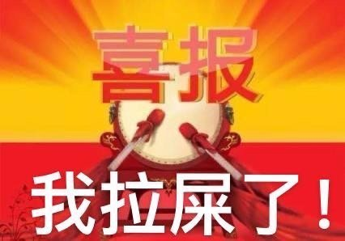

layout: post

title: 二六——一份价值5万元的成人礼

author: junyu33

date: 2022-4-23 21:00:00

mathjax: true

categories: 

  - 随笔

tags: 

  - encrypted
    

---

> “故天将降大任于斯人也，必先苦其心志，劳其筋骨，饿其体肤，空乏其身，行拂乱其所为，所以动心忍性，曾益其所不能。”——孟子《生于忧患，死于安乐》
>
> “同学们， 18岁，毛利人的少年必须接受三名成年男子的挑战；18岁，秘鲁的少年必须跳过一座悬崖；18岁，墨西哥的少年必须负巨石泅渡海峡。”——易校长在母校成人礼上的讲话

而我的18岁，却收获了一份价值5万元的成人礼......

<!-- more -->

# Day -20:

在几周前的星期四，我被频繁打搅我的华医通验证码惹得不耐烦了，在英语课上质问父母：你们在用我的账号做什么？

父母没有立马回答我，过了一会儿，手机上又多了一条赫然在目的挂号信息——什么，难道我年纪轻轻还得病了不成？我继续询问父母挂号的原因，父母却告诉我：“清明节回家再说。”

回想起一周前的体检复查，再想到父母神秘兮兮的样子，我惊得一身冷汗。但是几秒之后我冷静下来了——毕竟无论是什么疾病，最后都得面对，不是吗？

“是什么问题，快说！无论严重不严重。”

“你的肺部结节，由半年前的6mm，变成现在的8mm了。满足了手术指征，你需要做好手术的准备。”

“那——那我有多少天不能到学校呢？要请假多少天？”我心头一颤，毕竟在大学中课业负担最重的两个学期之一，一旦落下课程，补起来是很麻烦的。

“在医院只需要待一周左右的时间，但是在家里还是需要相当长一段时间的康复。如果你恢复得快，可以早一点返校。”

“......”

随后的那个清明节，心灰意冷的我和父母一同去医院门诊，专门向医生确认了是否手术。结果医生也毫不迟疑地说需要手术，随后我们办理了入院手续，缴纳了一定的押金——我仅存的那点希望也不复存在了。

剩下的事情，也就是等着入院通知的来临。如果入院太早，会错过期中考试和某些学科的期末考试；如果入院太晚，又会错过更多学科的期末考试。期中考试的时间在5月中上旬，而期末由于大运会的原因提前到6月15日以前，也就是我无论怎么请假，想要两边不缓考，都是鱼和熊掌不可兼得的事情了。

# Day -6:

最终，我们得知了入院时间是4月19日，这个时间早得大大超出了我的预计，我与父母商量后的返校时间初步定在了5月底。这就意味者我会错过所有学科的期中考试和4月23日军事理论的期末考试。父母考虑到了这一点，他们说：“军事理论考试你在住院，自然是不可能参加了。而期中考试是在5月中上旬，这个时候你出院了，可以临时到学校参加考试然后回家继续修养。”

我长舒了一口气——看来缓考的科目只有一科，今年暑假也不会太累，但是介于缓考考的是B卷——唉......

然后就是向军事理论提交缓考申请，并陆陆续续向14位老师递交请假条。其中也有一些波折，比如说工程训练因为达不到工时，可能需要下学期重修所有项目；再比如说大物实验有75%的时间都不在校，回来可能需要填一大摞的实验报告等等。

光写了请假条还不行，辅导员还要让我一个个的联系科任老师。关键又不是所有的科任老师都愿意留电话（或者说即使留了电话，但也是一闪而过，根本没有记下来），再想要就很难找了。父亲三番五次联系辅导员，她却说我是个成年人了，这些事情应该自己做。可是，辅导员您有没有设身处地地考虑过一个焦急的病人的真实感受呢？也许您不屑一顾的事情，可是关系到别人的学业成绩啊！

总之，向科任老师请假这件事做得相当糟心，直到手术前一天，这一堆破事才总算有了个了结。

# Day -2:

今天是高中成人礼的日子，也是我与室友、与大学暂时告别的日子。

班上的男生们都西装革履，没太多不同（或许有点~~资本家~~成功人士的感觉）。女生们确实穿得花枝招展的，当她们洁白的裙子旋转起来时，~~我在想如何用直角坐标（也许用柱坐标简单些？）表示裙子边缘形成的空间曲面，并尝试考虑计算它的三重积分~~，我意识到我们都已经不是小孩子了，需要自己去面对人生的磨难。

在九班和七班的串门中，我的出现并不是很引人注目，只有我的老朋友、同班的oier和我打了招呼，只不过想见到的人基本上都见到了。我和小吴谈了自己在学校的生活情况、未来的打算以及对人生的看法等等。他说他__想在未来干一番事业__，虽然我和他觉得未来是多么虚无缥缈的一样东西，但他决心__不甘于平庸__。我告诉了小吴自己患病的事实，他并没有太意外并鼓励我安心养病。最后我们做了一个总结：

> 人生其实大多数时候，都是踽踽独行，在将来孤独会是一种常态。真正能够理解你的，只有你自己。

校长在演讲中说，“18岁，毛利人的少年必须接受三名成年男子的挑战；18岁，秘鲁的少年必须跳过一座悬崖；18岁，墨西哥的少年必须负巨石泅渡海峡。而我们的18岁， 不需要跳悬崖，不需要渡海峡，那我们需要做什么呢？”我很庆幸校长没有马上提到“决胜高考”这几个字，因为连我也觉得，这么说——境界太低了点。我想，这接下来的手术，兴许可以作为我的“挑战”吧。

~~在临走之前我见到了hash，我和她交流了服务器的一些问题，并获得了她和cyz的合影。~~

# Day -1:

下午两点入院，在几分钟前我才处理完学校的那堆杂事。入院的时候先是拍了心电图（？），然后交了5万的住院费（点题），上了13楼B区的胸外科单元（怎么又是这个不吉利的数）。由于疫情，家属不能陪同，~~我必须自己把生活用品搬到自己的病床~~，父亲通过某些关系进入了病区，结果父亲被那个熟人批评了，说我再这样下去除了学习啥都不会了。

其实我自己还是会的，只是父母操心太多了，这反而是一种麻烦。

父母为了我晚上的休息，嘱咐我一定申请更换到二人间，在办理手续的同时，护士问了我一系列与常规、心理、VTE(Venous Thromboembolism, 静脉血栓栓塞症)相关的问题，我当然是一路都回答“否”，我甚至都能想象护士在问这些不得不问的问题时的一脸黑线......填完了一长串的入院手续后，我来到了51床。这个房间里有7张病床，大多数都是六七十岁的病人（所以我年纪轻轻怎么就会得病呢？大概还是因为母亲这边遗传的原因吧）。

病房收拾妥当，与周围的病人和陪护寒暄之后，我就开始跟着学校的进度上课了。下午大概4点半去听了科室的规章制度，也没什么深刻的印象。

病员们都睡得比较早，大概10点过就熄灯了，其他人看到我还在学习，还特意延迟了熄灯时间。我已经很久都没睡这么早了——换句话说，甚至现在这个年代睡得最早的可能也就是医院的这一批患者了。

# Day 0:

早上还没起床就被抽了好几管血。上午写线代作业（向量空间这部分又无聊，篇幅又多，给我写吐了），中途又抽了管血，说是明天手术备用。然后就是去测试肺功能（我以为肺功能就是简单地像体测一样吹个气就完事，结果还需要患者按医生的比划行事，像音乐会演奏一样，比较费时间）。这边肺功能才测完，那边做CT的电话又打过来了（因为离上次检查又过了一个月，有必要复查），父亲嫌中央运输的人动作太慢，埋怨了半天。

（CT的报告在5天之后出来了，仍然是8mm，没有什么意外的事情发生。只不过肺功能的报告到现在都没有拿到。）

下午写微积分，我拿起了之前从来没有翻过的教材，预习了第二类曲线积分，感觉这教材确实如同其序言所说，“通俗易懂，便于自学”，看了大概半个小时书就可以开始写作业了。接着参加手术前的讲座，知道了当晚22点禁食、24点禁饮，术后要多咳嗽、做呼吸训练和活动术侧肢体。

晚上的java课没有体验，我所期待的yyx对线也没发生（但是据yyx说有客串数据库的名场面？），10点下课以后就早早睡觉了。

# Day 1——4/21/2022:

起床后不能吃早饭，有工作人员给我右手手背盖了一个手术的章（其实是给自己看的，医生怎么可能不知道）。大概9点钟的时候护士开始给我的右手输液，不能愉快地写作业了qwq......

整个上午就在等待、无聊与不能进食使胃酸翻江倒海的煎熬中度过。我翻弄者手边的《高等数学》，又看了一节格林公式，玩了一会儿《Threes!》，一个上午就这样过去了。

中午也是只能眼馋地看着父亲吃饭，然后继续玩游戏。大概一点左右，有一名护工推着盖着绿色被子的小床，叫我上车，我就大概知道是要上战场了。这床比睡觉的病床高一些，垫子比我想象的软，被子也厚一些。我的视线从病房的天花板，逐渐移动到了充满阳光的电梯间，直到进入了银色的电梯，父亲的目光才从我的眼角消失。

电梯下到了11层，运输车从这栋楼运到了那栋楼（矮一点），进入了手术区域。一阵凉意铺面而来，空气中夹杂着各种药物的气息，就像是刚从户外进入到医院的大厅一样（这说明手术室的消毒更加严格），护工把我推到一个房间的门边，走了。房间的大门开了又关了，开了又关了，又隐隐约约地听到了我的名字。大概过了十几分钟，我终于被另外一个护士推进了手术室。

手术室里没有见到主治医生的影子，却有数位护士和一位稍微年长的阿姨。他们确认我的信息，让我躺到手术台后，开始在我的左右手绑上血压计和测量脉搏、血氧饱和度的装置，并在我的嘴里套上了一个面罩（呼吸器？）。我努力后眺，身旁是一系列的显示屏，可能是用来展示我心率、血压、血氧的，其中那个最大的也许是“肺镜”？各种工作准备妥当后，开始放麻药了，护士让我闭眼深呼吸，不知不觉我就睡着了。我听到了最后一句话好像是“我长得挺精干的”？

待我醒来之后，我没有问现在的时间，我也没看到哪儿有时钟。我只知道护士第一句话是让我吹气，然后我朝左右望了望，觉得头有点晕，索性呆呆地望着天花板。过了一会儿，护士把我送回了13楼B区，只不过是到了一个双人间（多了一台电视和饮水机），序号变成了35。从父亲的对话中了解到，此时应该是下午3点多的样子。

按照术后先进流食的原则，晚饭吃了一点点稀饭。经过了接近一天饥饿的我，从来没有觉得稀饭是如此的甘甜——甚至以往的恶心症状也没有！只不过我没多少胃口，只吃了一点。晚上也不知道多早就睡了。

# Day 2:

待我醒来之后，我知道了自己的右侧肋骨插了一根导管。这根导管一段连着我的手术区域，另一端连着床边的一个引流管。这个引流管似乎是一个连通器，一侧可以装1500ml的体液，另一侧装生理盐水，并开了一大一小两个孔。我的左手大臂连着血压计，食指上夹着脉搏血氧计，他们连接我右侧床头柜的一个仪器，用来显示我的生命体征。右手自然是用来输液的，除了用来化痰的药外，出于胸外科“超前镇痛”的宗旨，还有三种用来止痛的麻醉药（一种药每天注射三次，一种是输液用药之一，一种是臀部注射，而且好像有阿片类的药物）。鼻子还戴着一个吸氧的装置，连接着床边的电解瓶。

护工见我醒了过来，尝试让我咳痰，但是每一次我想努力咳嗽，胸口和右肩就会有难以忍受的疼痛。再加上先前从来没有咳嗽吐痰过，因此我一直没有成功。护工告诫我说，你不努力把痰咳出来，肺就不能张开，而且积聚的痰液会有肺部感染的风险。当时我想：就单纯一个小结节，怎么要让我经受这么多的痛苦？我的母亲为什么就没告诉我咳嗽会这么疼？（其实当时我已经在心中咒骂了母亲很多遍了）

为了强忍疼痛咳痰，我按下了短时加量麻醉药的按键。霎时间，“咔哒”“咔哒”的给药声变得频繁了起来。经过几分钟的等待之后，我尝试再次咳嗽，依旧还是疼痛难忍，咳痰无果。

午饭是我最爱吃的清蒸鲈鱼，然而当时我不知道什么原因，我的胃口并不好，只吃了一点。主要还是吃了一大堆冬瓜，喝了一些汤就躺下睡午觉了。在此期间母亲几次想要与我视频，但我觉得看手机很累，再加上之前对母亲的怨恨，不想跟她视频。

下午先打了屁股，然后有注射了止痛药，紧接着就是X光的检查。我上了护工的轮椅，还是觉得十分疲倦。在检查室外等待时，我干脆就躺在的父亲的手臂上继续睡觉。最后进入检查室后，我强忍着头晕的不适站了起来完成了检查。在回病房的途中，我把早上和中午吃的东西全部都吐了出来，之前的输送了营养全部都付诸东流了。

过了两三个小时，检查报告出来了——右侧气胸，体积压缩50%。也就是我的咳嗽做得还不够，肺还没有完全张开。当时我看到这个报告十分难受，再加上母亲晚上打电话说明天中午要送饭菜好好补一补，我心态立马就崩了。因为，

> 我现在要过三关，一是头晕的关，二是疼痛的关，三是老妈的关。我——太——难——了......

我和父亲商量了一下，决定把除了手部注射的止痛药保留之外，剩下的麻醉药都先停了。因为阿片类药物很有可能导致头晕、呕吐这样的副作用发生。我的身体可以忍受一定程度的疼痛，但是如果不吃饭，那是绝对不行的啊！当天晚上，我终于有了一些食欲，能吃下白米饭。当然由于麻醉药的遗留作用，我还是很早就睡着了。

# Day 3:

上午醒来之后，我觉得自己的头没有那么晕了，而且呼吸也不困难，于是我撤掉了氧气。接着护工还是叫我咳嗽，因为没有麻醉，每一次咳嗽我需要忍受更大的痛苦（我当时做了个比喻，说咳出黄痰的难度跟高考考680分的难度相当），尽管我做了充分的努力，进行了反复的尝试，到头来我还是没有咳出痰，而且我的胸口和右肩一直隐隐作痛。

虽然戒除了麻醉药的日子不好受，但精神状态的确是好了一些，我可以开始拿起手机在家人群里跟母亲和姐姐对话了。护士见我精神状态还不错，就测走了我的一堆检测装置，和床头柜上的显示仪器。

现在我的主要任务就是——忍受疼痛和尝试咳痰。

还有一个好消息：我在当天下午放屁了。尽管我这手术后的第一屁量很小，也没有异味，也代表了我的消化系统终于开始正常工作了，我的身体接收到了营养。只不过我还暂时没有便意。

由于27床和28床名字只有一字之差，医院要求我们35床和28床调换位置——巧合的事情是母亲一年前生病的时候也是在28床！只不过28床跟35床都在双人间，仍然在靠门的位置，而且父亲经常会将两个床位之前的窗帘拉上，让我看不到开阔的窗外世界，这一点有些郁闷。

到了当天晚上睡觉时，麻醉药的效果已经消失殆尽。我躺在病床上，就连呼吸也会给我的胸部、腰部和右肩带来痛苦，无论是用鼻子还是用嘴呼吸都不能缓解（除了不呼吸就不会痛，当然这是做不到的）。我甚至连辗转反侧也做不到——想象一下一根管子插在自己身体里，擅自移动身体只会加重自己的痛感。我唯一能做的就是小声地呻吟，以转移我的注意力。这种难受的感觉直到后半夜才有所减轻，让我迷迷糊糊地睡着了。

# Day 4~7:

第四天我的精神状态完全恢复正常了，上午我的主治医师查房，让我咳嗽。结果林医生说我的肺有些漏气，需要打4针高糖然后观察，顺便我的引流管被加上了负压。过了一段时间后，一位温婉的女医生来到病房。她语气温柔，让我侧躺，她先给我的伤口换药（我是生性怕痒之人，她给我用棉签给伤口周围消毒时，我忍不住地发笑，她也忍不住笑了——这也算是治疗过程中一些美好瞬间吧）。

打高糖就是另外一回事了，我虽然看不见自己的伤口长什么样（包括到现在我也不知道），但是我明显感觉到自己胸闷、气短、心慌，而且胸口和右肩的疼痛加重了。才打了两针，我大口喘气，满身是汗，话也说不出来，实在是忍不住了，我不得不让父亲把病床升起来以缓解疼痛。又过了几分钟，经过了父亲和医生的安抚，我才感觉好受了一些，只不过之前打的高糖几乎全都流了出来。然后医生又让我躺平（虽然没有之前那么平，也没有让我侧身），重新把剩下的两个高糖打进了导管。虽然我仍感觉到心慌与疼痛，但这次是我勉强能忍受的程度。在这几分钟内我度日如年，但最终还是完成的与医生的配合。医生见我打高糖如此痛苦，她说以后就只给我打3针了，怕我承受不住。

这还没有完，打完高糖后，需要在床上再躺半个小时，让高糖促进漏气部位的愈合。我没有采取马上恢复到先前的躺平程度，而是放平一点，再忍痛，再放平一点，再忍痛，再放平一点......这样循环下去。到了最后10分钟，我终于放到了180°，而此时的疼痛，我也能够忍受了。30分钟到后，医生调节导管，让我坐起来，放出了高糖。如释重负的我此时感到十分困倦，闭上眼一觉睡到了中午。

> 世界上最痛苦的事，莫过于躺平了——在打高糖的时候。

除了高糖，剩下的事情就是一天两次的雾化和输液，一天三次的注射止痛药了。雾化剂的气味有一些臭，每一次雾化后我几乎都会咳嗽半天，然后艰难地做着反刍的动作，吐出一些口水和少量的白痰（至于先前提到的黄痰，我到现在都没咳出来过）。接着我会喝些水，第一口吐出来，剩下的喝下去，此时我的喉咙会有些痒，会再次尝试咳嗽，吐出些似痰非痰的东西，接着又喝水......这样重复一两次，直到喉咙不痒后，我这痛苦的动作才会停止。

至于输液和止痛药，没什么可以叙述的。从第四天下午开始，我开始恢复正常的学习，把先前落下的功课赶回来。在晚上，我成功的拉屎了——解决了康复的最后一个短期问题。（我还是想把这个表情包搬上来，太经典了）

接下来的三天，都是同样无聊的routine——早上林医生观察是否漏气，然后打高糖。上午打3针高糖、止痛药、输液、雾化，下午打止痛药、输液、雾化，晚上打止痛药。在此期间，我的痛感逐渐减轻，看起了病房的电视，玩起了手机上的《Threes!》，也开始见（sui）缝（xing）插（er）针（wei）地学习。

值得一提的是，手术过后前三天，我的引流管的积液量并不多，大概只有100多毫升。自从打高糖开始，我的积液量开始每天**两三百毫升**地猛增——到第七天的时候，我居然把那个1500毫升的引流管装满了，护士还给我换了一个新的！然而，即使是4针高糖全部都计算到积液里面，每天也只有80毫升，所以这多出来的一两百毫升是从哪来的呢？这个问题我一直不解。

# Day 8:

今天早上的查房，林医生说可以拔管了——这意味者之前的循环终于被画上了句号。接着之前的女医生来给我拔管，她今天给我换了第二道药（还是那么熟悉的痒痒的感觉和愉快的笑声）。拔管的过程很迅速，而且没什么痛苦（父亲还给我录了视频，然后我两周之内并不打算看）。拔管过后，她告诫我：“一两个小时后，看看自己的右胸是否积气（摸起来有踩在雪地上或者摸头发的感觉？），如果积气比较多，而且有胸闷气短的症状，就要考虑重新插管。”

我倒吸了一口凉气，在床上跟父亲摆了一两个小时的龙门阵，期间，父亲时不时地摸着我的右胸，看看有没有明显的胀气。中午一个助手回来检查，他说肺部有少量积气，属于正常现象，出院应该没问题。

其余的治疗与之前相同，在当天下午，我做完了第二类曲面积分的作业，补完了先前的所有功课。在晚上，护士给我输完了最后一针止痛药后，她说暂时不拔掉留置针，以防意外发生。

我想：“都到现在这种情况了，还会有什么意外发生吗？”

# Day 9:

早上林医生确认了我可以出院的事实，我心中悬着的石头终于放下了。

上午我一直在听课，中途护士取走了我的留置针，把口服止痛药给了我——我的诊疗终于画上了句号。

父亲在大概十点半的时候听了出院的讲座，回来告诫我一定要**坚持咳嗽和做呼吸训练**。

办理出院手续的时候社保卡密码又记错了，幸好在最后一次尝试的时候输入了正确的密码，好险。

医药费和生活费实际只有三万多，再加上大学生医保，其实只花了一万多。

吃了午饭，收拾好病房的行李，与27床道别后，我和父亲正式出院了。在13楼B区的门外，守候已久的母亲给了我一个大大的拥抱。

午后时分的阳光很明媚，华西医院的风景像过度曝光的照片一样灿烂。我们一家子行走在这灿烂的照片里，迈向了新的人生历程。

（完）
