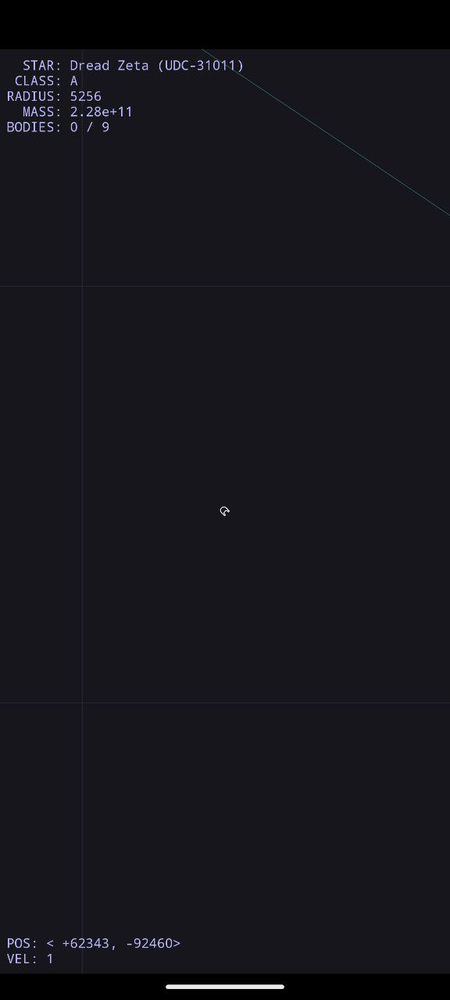
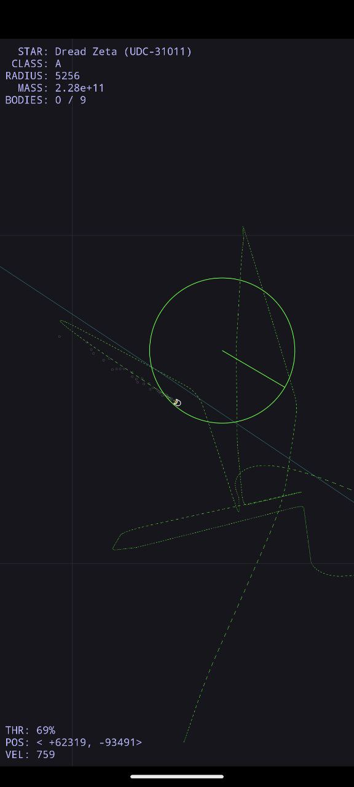
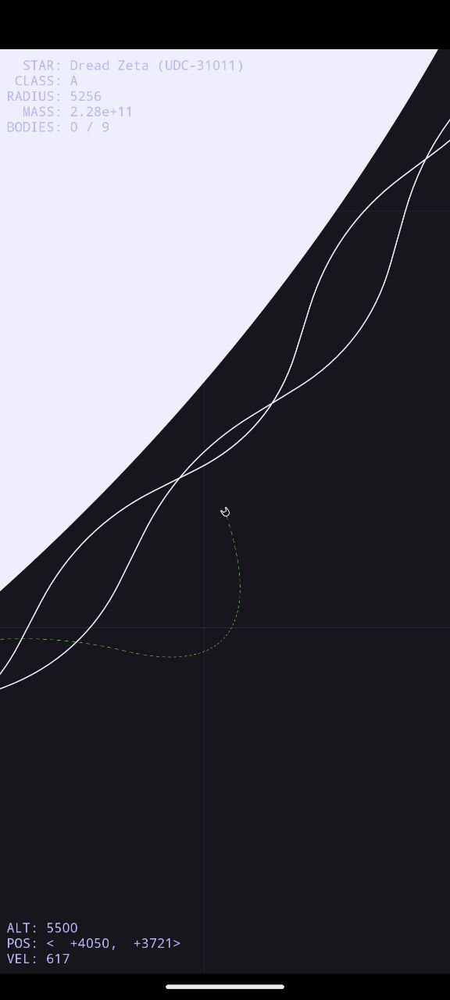
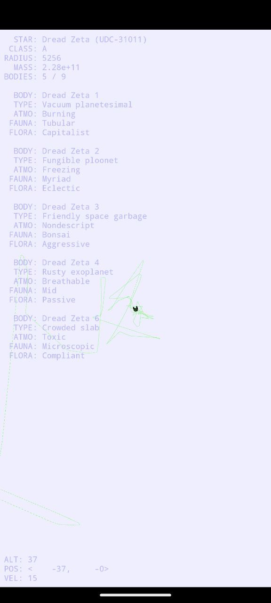
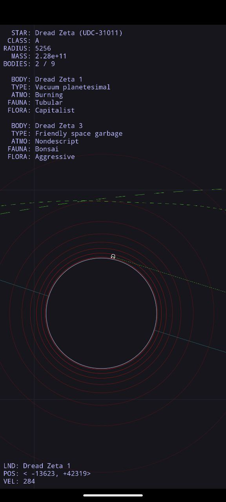
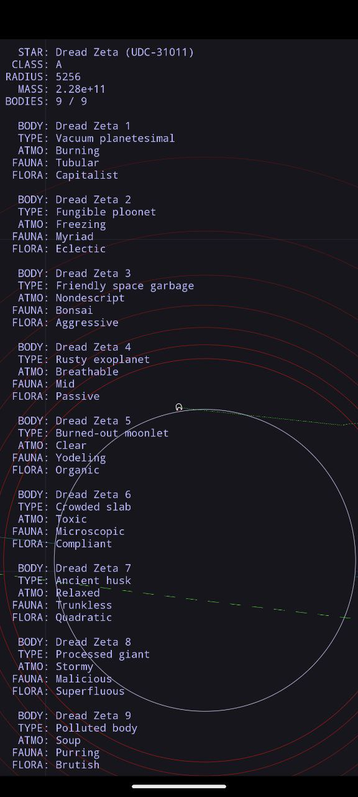

layout: post
title: 三五——Android 14 彩蛋试玩
author: junyu33
mathjax: true
categories:

  - 随笔

tags:

  - android
  - python

date: 2023-11-11 21:30:00

---

上篇随笔提到我在 sgp 买了一部谷歌亲儿子 pixel 7a，前段时间 Android 14 出了，我的手机也收到了更新推送，就升级了。

当然，升级过后的第一件事就是去看看彩蛋，~~以确认升级是不是只换了个版本号~~。（其实手机已经升级快一个月了，百无聊赖之际，我才想起可以玩玩彩蛋这件事）

<!-- more -->

# 流程

## 进入彩蛋

众所周知，进入彩蛋的第一步永远都是找到“关于手机”，然后疯狂点击 Android 版本号数次。

这一次也不失所望，我来到了这个页面（然而这个页面并不是全屏，不知道是故意的还是懒得修的bug）：


我们来欣赏一下这个logo，上方是一个倒置的 Android 机器人的轮廓，同时也可以把它理解成一个星球。中间的绿色物体可以理解成着陆的飞船，那么周围的白色小点就自然是其余的星星了。由此可见，这个彩蛋的主题应该与宇宙航行有关。

尝试长按中间的logo，你会发现你的手机在震动，并且logo外部的星星也开始加速移动（想一想，当飞船起飞的时候，舱内的震动也是挺明显的，这样的设计也符合其物理意义）。


大概6秒之后，你就会进入这个彩蛋游戏的主体页面了。

## 彩蛋主体

似乎每次进入彩蛋后都会出生到这个固定坐标：



然后当你尝试滑动屏幕，游戏界面会变成这样：



这里有一些比较专业的术语，这里给出相关的解释：

- STAR: 指恒星
- CLASS: 我的理解是光谱的分类，例如太阳的光谱是G2V，这里的分类就是G。常见的分类按照表面温度从高到低（半径从大到小）为O、B、A、F、G、K、M（Oh, Be A Fine Gal, Kiss Me）。


> 摘自 https://en.wikipedia.org/wiki/Stellar_classification

- RADIUS: 指恒星的半径，A型主序星的半径大约是太阳半径的$1.4$到$1.8$倍，而太阳半径约为$696,340$公里，这意味着A型主序星的半径通常在大约$976,000$公里到$1,253,000$公里之间。而图中的数值为 `5256`， 因此这个数值的单位我一时无从知道。
- MASS: 指恒星的质量。A型主序星的质量范围通常在约$1.4$到$2.1$太阳质量之间。而太阳的质量是$1.989\times 10^{30}$ 千克，因此A型主序星的质量范围为 $[2.78 \times 10^{30}, 4.177 \times 10^{30}]$，而图中的数值为 `2.28e+11`，因此单位可能为 $10^{19}$ 千克（虽然我也不知道这个单位有什么意义）。
- BODIES: 指恒星捕获的行星数量。
- THR: 问了下 chatGPT 才知道这个单词是 thrust，也就推力的意思。按照牛顿第二定律，可以变相理解为加速度。
- POS: 即坐标，单位与RADIUS的单位相同。目前暂时不知道它是以什么来作为参照系的，但可以猜想原来是恒星的质心。
- VEL: 飞船的速度，单位懒得管了。

说回刚才那个图片，你会发现右上角有一条青色的细线，如果你绕着这条细线，你会发现它略微有一点弯曲。因此又可以猜想这是行星的轨道，为了验证这个猜想，我让 chatGPT 用 python 编写了一个给出三点求圆心的程序：

```python
import numpy as np

def find_circle_center(x1, y1, x2, y2, x3, y3):
    """
    Find the center of a circle passing through three points (x1, y1), (x2, y2), and (x3, y3).
    """

    # Calculating the midpoints of lines joining points
    x12_mid = (x1 + x2) / 2
    y12_mid = (y1 + y2) / 2
    x23_mid = (x2 + x3) / 2
    y23_mid = (y2 + y3) / 2

    # Calculating the slopes of lines joining points
    m1 = (y2 - y1) / (x2 - x1) if x2 != x1 else float('inf')
    m2 = (y3 - y2) / (x3 - x2) if x3 != x2 else float('inf')

    # Calculating the slopes of perpendicular bisectors
    if m1 != 0:
        m1_perp = -1 / m1
    else:
        m1_perp = float('inf')

    if m2 != 0:
        m2_perp = -1 / m2
    else:
        m2_perp = float('inf')

    # Handling the case of vertical lines
    if m1_perp == float('inf'):
        x_center = x12_mid
        y_center = m2_perp * (x_center - x23_mid) + y23_mid
    elif m2_perp == float('inf'):
        x_center = x23_mid
        y_center = m1_perp * (x_center - x12_mid) + y12_mid
    else:
        # Solving linear equations to find the intersection point of the perpendicular bisectors
        A = np.array([[1, -m1_perp], [1, -m2_perp]])
        B = np.array([y12_mid - m1_perp * x12_mid, y23_mid - m2_perp * x23_mid])
        center = np.linalg.solve(A, B)

        x_center, y_center = center

    return x_center, y_center

# Example coordinates
x1, y1 = (1, 1)
x2, y2 = (4, 5)
x3, y3 = (7, 4)

# Find the circle center
circle_center = find_circle_center(x1, y1, x2, y2, x3, y3)
circle_center
```

我在这条青色的轨道上任意选择了三点（让飞船完全停住挺难的，所以误差大概有 $\pm 200$），分别是$(45223, 77614), (46619, 76765), (48420, 75616)$，算出来大概是$(2193, 310)$，的确是在恒星内部。

因此这个游戏（我能想出来的）的主要任务是找到恒星与9个行星。具体的方法都很简单，恒星的话往$(0,0)$开就可以；行星的话首先找到一条青色轨道，然后绕着轨道走，总能相遇的。

### 恒星部分

先说恒星部分，恒星长这个样子，颜色白色，符合A类恒星的特征。在恒星外部会有较强的引力，但在恒星内部则会匀速运动（恒星内部没有引力我是不太信的）。~~还有，围绕在恒星周围的白色线条不会是日珥吧~~



我本以为在恒星质心附近（坐标原点）会有一些特殊的事情发生，然并卵。



在恒星外部会有一些由浅到深的红色轨道，不太清楚它的作用。

### 行星部分

行星与恒星不同，它的内部是实心的。飞船无法进入，但可以在其表面着陆（如果着陆成功，会在左上角显示相应信息）。行星周围的红色轨道个人猜想应该是卫星的轨道（但实际上并没有任何卫星出现）

按照相关物理原理，离恒星距离越近，行星的环行速度就越快。图中的行星是从里到外第一个，这里可以看出我尝试登陆多次（这里绿色线条的长度代表飞船行驶的速度），最终以一个相对较低的速度才得以成功登陆。

另外，我也尝试通过调整速度与轨道来尝试成为一些较大行星的卫星，但并未成功。



以下是对左上角一些有关行星的术语解释（具体的内容~~专业词汇过多，我也不认识~~请自行查询）：

- BODY: 行星命名，数字表示从里到外第几个。
- TYPE: 行星类型。
- ATMO: 大气类型。
- FAUNA: 动物群系。
- FLORA: 植物群系。

总之，当你遍历完九大行星之后，你会发现左下角有关于飞船的信息消失了，个人认为这个彩蛋就玩完了。



# 杂项

1. 这个地图是有边界的，大概半径为$199,988$，也是以红线为界，飞船无法跨越。
2. 项目源码在 [github](https://github.com/hushenghao/AndroidEasterEggs/tree/main/eggs/U)，并且全部由 kotlin 编写。 
3. （updated on 11/14/2023）似乎地图每天都会变一下，今天我去看就变成 `Upsidedowncake Alfredo Grotesque` 了，分类是G，飞到恒星附近一看果然是黄色的。
4. （updated on 11/14/2023）这个UDC编号似乎也跟当前的日期有关，我猜测“3”代表2023年，“10”代表11月（从0开始计数？参见[这里](https://stackoverflow.com/questions/344380/why-is-january-month-0-in-java-calendar)），“14”代表日期。具体实现可在[这里](https://github.com/hushenghao/AndroidEasterEggs/blob/957080fcf0245c65ed9c4e834997028f97ecfec7/eggs/U/src/main/java/com/android_u/egg/landroid/MainActivity.kt)的 104 行看到。
