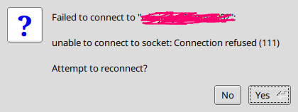
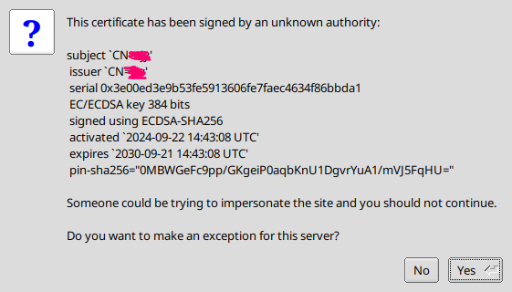
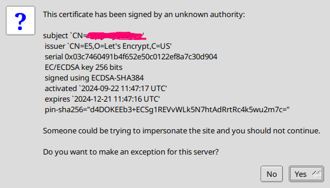
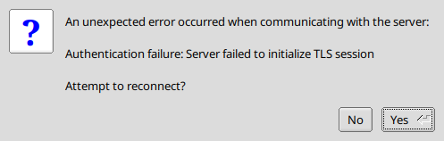

layout: post

title: 从零搭建一个又快又安全的 VNC 服务

author: junyu33

tags: 

- linux
- crypto

categories: 

- develop

date: 2024-9-22 23:30:00

---

因为笔者的寝室电脑有公网 IP，而市面上的远程桌面软件因为使用中继服务器延迟较高，并且个人不信任它们的安全性，所以决定自己搭建一个 VNC 服务。

这样就可以从实验室低延迟的连回寝室电脑，并且保证一定的安全性。

至少让 TigerVNC 觉得 “Connection is secure” without any exemption.

<!-- more -->

# Prerequisites

- 你自己的域名。
- 公网 IP（理论上 IPv4 和 IPv6 均可，本文以 IPv4 为例）。

# Steps

## 申请 DDNS

我的域名是在 [Namecheap](https://www.namecheap.com/) 买的，但我把自己的 DNS 服务托管给了 [Netlify](https://www.netlify.com)。如果你也是这样，那么你可以使用 [Netlify Dynamic DNS](https://github.com/oscartbeaumont/netlify-dynamic-dns) 来自动化 DDNS 的流程。当然，如果你是 [Cloudflare](https://www.cloudflare.com/) 的用户，网上的教程应该更多，这里就不赘述了。以下是自己的代码：

```sh
#!/bin/bash

# Configuration
ACCESSTOKEN="<access_token>"                 # Netlify API access token
ZONE="example.com"                           # Domain name (Netlify DNS zone)
RECORD="subdomain"                           # Subdomain (subdomain.example.com)

# Get the current public IPv4 (without using proxy)
IP=$(curl --noproxy '*' -s http://ipv4.icanhazip.com)

# Disable IPv6 updates and ensure no proxy for Netlify requests
NDDNS_IPv6_ENABLED=false no_proxy="*.netlify.com" nddns_linux -accesstoken "$ACCESSTOKEN" -zone "$ZONE" -record "$RECORD"

# Log the update
echo "$(date): Updated $RECORD.$ZONE to IP $IP"
```

然后在 systemd 启用定时任务：

```sh
~/Desktop/tmp                                                                                                                                                                 10m 8s 22:12:16
> cat /etc/systemd/system/ddns-update.service
[Unit]
Description=Run DDNS update script

[Service]
Type=oneshot
Environment="http_proxy=<http_proxy>"                 # If you need proxy
Environment="https_proxy=<https_proxy>"               # If you need proxy
ExecStart=/bin/bash /home/junyu33/Desktop/tmp/ddns.sh

~/Desktop/tmp                                                                                                                                                                        22:12:42
> cat /etc/systemd/system/ddns-update.timer  
[Unit]
Description=Run DDNS update script every 30 minutes

[Timer]
OnBootSec=5min
OnUnitActiveSec=30min
Persistent=true

[Install]
WantedBy=timers.target
```

这样，你的域名就会多一条 TXT 记录，记录着你电脑的公网 IP。

如果你的电脑此时开启了 sshd，你应该可以使用 `ssh user@subdomain.example.com` 连上自己电脑了。

## 安装 TigerVNC 服务

参考这篇文章：https://www.digitalocean.com/community/tutorials/how-to-install-and-configure-vnc-on-ubuntu-20-04

> 看到 Step 2 为止，虽然 Step 3 确实可以达到实际上的安全性，但是 TigerVNC 的客户端会认为连接不安全。

然后这篇文章只提到的 TigerVNC 的服务端安装，客户端在 xubuntu 的安装命令为：

```sh
sudo apt install tigervnc-viewer
```

## 完成 certbot DNS-01 challenge 以获得证书

xubuntu 的 certbot 包似乎有问题，我选择 conda 虚拟环境下的 certbot pip 包：

```sh
pip3 install certbot
certbot certonly --manual --preferred-challenges dns --config-dir ~/Desktop/tmp --work-dir ~/Desktop/tmp --logs-dir ~/Desktop/tmp -d subdomain.example.com
```

然后按照提示添加 TXT 记录即可。

完成后你会在 `~/Desktop/tmp/archive/subdomain.example.com/` 下看到证书文件。

```sh
> /bin/ls -al           
total 16
drwxrwxr-x 1 junyu33 junyu33   90 Sep 22 20:45 .
drwx------ 1 junyu33 junyu33   48 Sep 22 20:45 ..
-rw-rw-r-- 1 junyu33 junyu33 1273 Sep 22 20:45 cert1.pem
-rw-rw-r-- 1 junyu33 junyu33 1566 Sep 22 20:45 chain1.pem
-rw-rw-r-- 1 junyu33 junyu33 2839 Sep 22 20:45 fullchain1.pem
-rw------- 1 junyu33 junyu33  241 Sep 22 20:45 privkey1.pem
```

## 配置 TigerVNC 安全连接

将你的 certbot 证书复制到 `~/.vnc/` 下：

```sh
# 服务器证书和私钥
cp ~/Desktop/tmp/archive/subdomain.example.com/cert1.pem ~/.vnc/subdomain.example.com-SrvCert.pem
cp ~/Desktop/tmp/archive/subdomain.example.com/privkey1.pem ~/.vnc/subdomain.example.com-SrvKey.pem
```

> 这里的 pem 文件前缀不一定是 `subdomain.example.com`，但是之后 TigerVNC启动时，必须要指定正确的 pem 文件。

然后重启 TigerVNC 服务：

```sh
vncserver -kill :2
vncserver -SecurityTypes=X509Vnc -X509Cert=/home/junyu33/.vnc/subdomain.example.com-SrvCert.pem \
          -X509Key=/home/junyu33/.vnc/subdomain.example.com-SrvKey.pem -localhost=no -geometry=1920x1080 :2
```

然后将 `chain1.pem` 复制到**客户机**的 `~/.vnc/` 下：

```sh
# 客户机证书链
scp ~/Desktop/tmp/archive/subdomain.example.com/chain1.pem user@client.com:~/.vnc/chain1.pem
```

并修改**客户机**的 `~/.vnc/default.tigervnc`，确保这一行的值正确（没有就加一行）：

```sh
X509CA=/home/junyu33/.vnc/chain1.pem
```

这个时候启动 TigerVNC，应该会直接看到 “Connection is secure” 的字样并让你输入密码，大功告成。

# FAQ

## 问题零（无法连接）：



- 看看你的 DDNS 挂了没。
- 看看你的防火墙关了没。
- 看看你的 TigerVNC 服务启动了没。

## 问题一（unknown authority，无 Let's Encrypt）：



TigerVNC 使用了你系统的自签名证书，而不是 Let's Encrypt 的证书。你可以在启动 log 中找到如下字段：

```
You will require a certificate to use X509None, X509Vnc, or X509Plain.
I will generate a self signed certificate for you in /home/junyu33/.vnc/<hostname>-SrvCert.pem.
```

可能是因为你敲重启 TigerVNC 命令的时候没有加 `-X509Key` 和 `-X509Cert` 参数。

## 问题二（域名和证书不匹配）：


原因大概跟上一个问题相同，敲重启 TigerVNC 命令的时候没有加 `-X509Key` 和 `-X509Cert` 参数。从而使用了你自签的证书，你电脑的 hostname 自然和你连接的服务器不同。

另一种原因是，你 certbot 申请的域名和你的 hostname 不匹配。**必须是完全一致的域名，父域名和子域名都要一致。**

## 问题三（unknown authority，有 Let's Encrypt）：



你的 `.vnc` 目录下的 `chain1.pem` 文件没有复制正确（或者在**客户机**不存在），或者你的 `default.tigervnc` 文件没有配置正确。

## 问题四（TLS初始化错误）：



检查一下拷贝证书和私钥的路径是否正确，是不是拷了两个证书或者两个私钥。

## 问题五（TigerVNC 启动问题）：

```sh
> vncserver                                

New Xtigervnc server '<hostname>:3 (junyu33)' on port 5903 for display :3.
Use xtigervncviewer -SecurityTypes VncAuth -passwd /tmp/tigervnc.E2491i/passwd :3 to connect to the VNC server.


=================== tail /home/junyu33/.vnc/<hostname>:3.log ===================
The XKEYBOARD keymap compiler (xkbcomp) reports:
> Warning:          Could not resolve keysym XF86CameraAccessEnable
> Warning:          Could not resolve keysym XF86CameraAccessDisable
> Warning:          Could not resolve keysym XF86CameraAccessToggle
> Warning:          Could not resolve keysym XF86NextElement
> Warning:          Could not resolve keysym XF86PreviousElement
> Warning:          Could not resolve keysym XF86AutopilotEngageToggle
> Warning:          Could not resolve keysym XF86MarkWaypoint
> Warning:          Could not resolve keysym XF86Sos
> Warning:          Could not resolve keysym XF86NavChart
> Warning:          Could not resolve keysym XF86FishingChart
> Warning:          Could not resolve keysym XF86SingleRangeRadar
> Warning:          Could not resolve keysym XF86DualRangeRadar
> Warning:          Could not resolve keysym XF86RadarOverlay
> Warning:          Could not resolve keysym XF86TraditionalSonar
> Warning:          Could not resolve keysym XF86ClearvuSonar
> Warning:          Could not resolve keysym XF86SidevuSonar
> Warning:          Could not resolve keysym XF86NavInfo
Errors from xkbcomp are not fatal to the X server
X connection to :3 broken (explicit kill or server shutdown).
 ComparingUpdateTracker: 0 pixels in / 0 pixels out
 ComparingUpdateTracker: (1:-nan ratio)
Killing Xtigervnc process ID 8172... success!
=========================================================================

Session startup via '/etc/X11/Xtigervnc-session' cleanly exited too early (< 3 seconds)!

Maybe try something simple first, e.g.,
	tigervncserver -xstartup /usr/bin/xterm
The X session cleanly exited!
The Xtigervnc server cleanly exited!
```

这个错误比较棘手，我也没找到根本原因。

我的情况是 `/usr/bin/xterm` 可以正常运行，然后我在 debug 的时候尝试让 TigerVNC 在 `:0` 上启动（一般是 `:1` 和 `:2`)，导致 xfce4 界面报错。我没有仔细看错误框，导致系统删除了任务栏的一些图标，而我并不会还原这些图标，干脆用 btrfs 把 `/home` 回滚了。

神奇的是，回滚 `/home` 后，这个问题就消失了。

## 问题六（The authentication mechanism requested cannot be provided by the computer）：

这是在手机的 RVNC Viewer 客户端中出现的错误。奇怪的是，如果不使用加密，手机客户端是可以连接的（当然也会报连接不安全的错误）。

但其实，我基本上也不会在手机上使用 VNC，所以这个问题就不管了。
