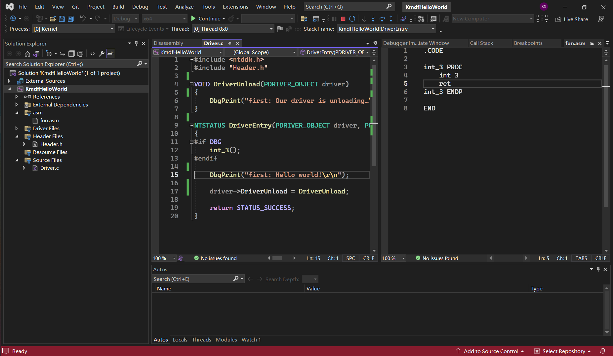

layout: post
title: windows 驱动开发环境搭建
author: junyu33
mathjax: true
tags: 

- windows

categories:

  - develop

date: 2023-1-10 16:30:00

---

在大创的压力下，开始学习 windows 驱动开发~~的环境配置~~。只能说：

- 因为时效性，看网上的教程，不如老老实实看 MSDN（机翻的也行）。
- ~~因为开源，做 windows 驱动开发，不如做 linux 。~~



<!-- more -->

# Prerequisite

- host: win11.
- disk space: at least 20GB, SSD recommended.

# Steps

## install vs2022

Ensure **Desktop development with C++** and **MSVC v143 - VS 2022 C++ x64/x86 build tools (Latest)** are ticked.

## install win11 SDK&WDK for 22H2

Use default, just install.

## install win10 on your vm

Quite easy.

## install WDK  for vm

The avg download speed is 200KB/s, although the proxy/VPN is turned on, time for touching fish.

## run the WDK Test Target Setup

Easy, search `WDK Test Target Setup x64-x64_en-us.msi`. Copy&paste.

## ensure host&guest can ping each other

If you use vmware, I suggest using NAT so the host IP is the item of `vmnet8` when running `ipconfig`, the guest IP is the only one IPv4 when running `ipconfig`. Usually the network segment is the same (i.e. the first three numbers).

## Write&build your first driver

### create a project

Follow steps from MSDN directly.

https://learn.microsoft.com/en-us/windows-hardware/drivers/gettingstarted/writing-a-very-small-kmdf--driver#create-and-build-a-driver

### write a sample code

- because inline asm is deprecated on x64 platform, we use this tutorial instead: https://exp-blog.com/re/qu-dong-kai-fa-ru-men-2/#toc-heading-19

#### Driver.c

```c
// https://bbs.kanxue.com/thread-254041.htm
#include <ntddk.h>
#include "Header.h"

VOID DriverUnload(PDRIVER_OBJECT driver)
{
    DbgPrint("first: Our driver is unloading…\r\n");
}

NTSTATUS DriverEntry(PDRIVER_OBJECT driver, PUNICODE_STRING reg_path)
{
#if DBG
    int_3();
#endif

    DbgPrint("first: Hello world!\r\n");

    driver->DriverUnload = DriverUnload;

    return STATUS_SUCCESS;
}
```

#### fun.asm

```assembly
.CODE

int_3 PROC
	int 3
	ret
int_3 ENDP

END
```

#### Header.h

```c
#pragma once
void int_3(void);
```

### build project

Before compiling the program, you also need to set the project properties:
     

- Right click - Properties - C/C++

  - Set warning level to level 3 (/W3)

  - Change Warnings as errors to No (/WX-)

  - Code Generation - Security Checks changed to Disable Security Checks (/GS-)
  - Code Generation - Spectre Mitigation to Disabled

- Right click - properties - linker
  - Treat linker warnings as errors to No (/WX:NO)

- Right-click-Properties-Driver Settings

  - Change Target OS Version to Windows 10 or higher

  - Change Target Platform to Desktop

- Right-click-Properties-Inf2Cat
  - Change Use local time to Yes (/uselocaltime)

> https://bbs.kanxue.com/thread-254041.htm

## Provision test computer

Extensions > Driver > Test > Configure Devices > Add a new device

Enter your IP of **test computer** as `host name` and choose `Provision device and choose debugger settings`

In the next page, choose `Network`, the `Host IP` should be IP of **host computer (vmnet8)**.

Wait for provisioning. Maybe the `TAEF service` will fail to install, just ignore it.

## install the driver

Just follow the MSDN

https://learn.microsoft.com/en-us/windows-hardware/drivers/gettingstarted/writing-a-very-small-kmdf--driver#install-the-driver

## debug the driver

here are two ways: 

### using winDbg/winDbg preview (more steps)

- if the deploy (right click your project > deploy) process is successful, then your driver will be placed in your system drive in your test computer. Otherwise you need to copy the output file in your host computer to the test computer.

- Download `INSTDRV.EXE` and copy to your test computer.

- Open `INSTDRV.EXE` **as Administrator** and it's time to open your winDbg/winDbg preview, attach the kernel as the step shown in **Provision test computer**.

- Create a snapshot in your vm. (IMPORTANT)

- First **install** the driver `kmdfHelloWorld.sys` then **start** it. If everything works, your winDbg instance will stuck at `fun.asm` finally. Then you can restore to your snapshot if something unpleasant happened (e.g. bluescreen). 

### using VS2022 (not always works)

- Restore to your (successfully configured) snapshot.
- Right-click-Properties > Configuration Properties > Debugging > Debugger to launch > Kernel Debugger
- F5. If everything works, your VS2022 instance will stuck at `fun.asm` finally, but there would be no highlights when debugging, just like the picture I placed in preface.

# References

- https://learn.microsoft.com/en-us/windows-hardware/drivers/gettingstarted/writing-a-very-small-kmdf--driver
- https://bbs.kanxue.com/thread-254041.htm
- https://exp-blog.com/re/qu-dong-kai-fa-ru-men-2/
- 《加密与解密》（第四版）