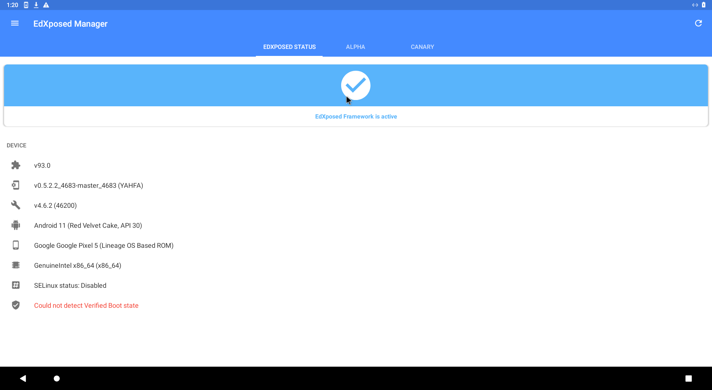
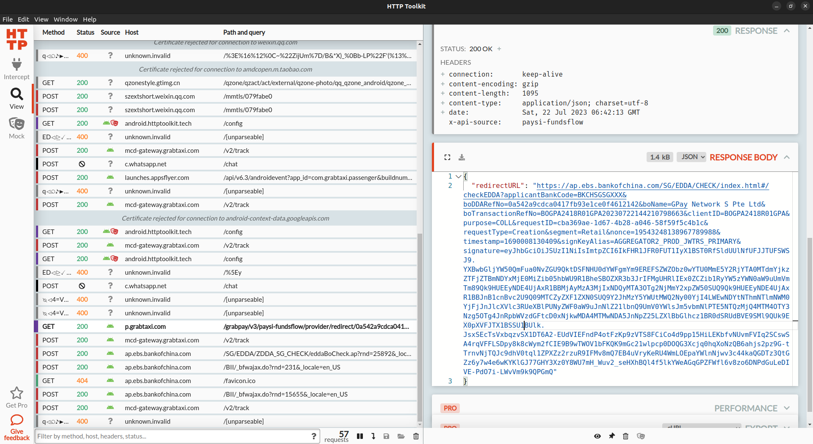
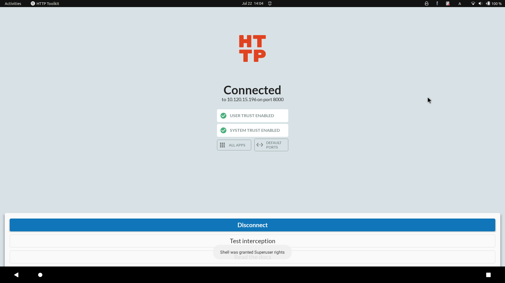

layout: post
title: 一次给 grab app 抓包的经历
author: junyu33
categories: 

  - develop


tags:

  - linux
  - android
  - web

date: 2023-7-22 11:00:00

---

在 Singapore 的那段时间，为了实现不用纸币，但我的全币种信用卡并不支持云闪付功能，我只能使用第三方平台对自己的银行卡进行绑定。

然后 grab 提供的大陆第三方平台只有 BOC，并且打开链接之后发现 BOC 的登录页面无法显示验证码。

我的任务就是尝试排查验证码无法显示的原因，最起码要把这个 URL 在电脑上复现出来。

<!-- more -->

# grab desktop

根本找不到

# android + httptoolkit(user)

burpsuite 似乎对安卓端没有什么特别的支持，fiddler 我现在才知道居然是商业软件，于是我选择了 httptoolkit

https://github.com/httptoolkit/httptoolkit-desktop

以及对应的安卓端：

https://github.com/httptoolkit/httptoolkit-android

httptoolkit在 Android 可以安装两种证书，一个 user 一个 system，显然后者是需要 root 权限的。

试了一下只用 user cert，可以抓到 chrome 的 http/https 的 packet，然而对于 grab 的内置浏览器无能为力。

在 Nova 的提示下，知道可能是 ssl-pinning 导致的，google 搜到这篇文章

https://www.secpulse.com/archives/134061.html

需要使用 Xposed 的 JustTrustMe 模块来解决，这下铁定要 root 了

刚买的新手机我是肯定不想 root 的，于是我选择

# waydroid + magisk

Linux 系统肯定得和 WSA 与各大安卓模拟器说再见了，目前比较好的选择是 waydroid

waydroid 的官方 Android 11 镜像肯定是没有 magisk 的，虽然在 shell 中运行 su 可以切换到 root，但为了省事，还是使用一下仓库 build 包含 GApps 和 magisk 的镜像

https://github.com/pagkly/MagiskOnWaydroid

随后又下载了 RootExplorer，尝试挂载根目录和 /system 为 rw，确实可以。只不过主机上的 shell 似乎没有办法做到这一点。

但是作为用惯了 shell 的同学，寻思只能用 GUI 来进行诸多操作实属不便。既然 RootExplorer 能拿到这两个路径的读写权限，那为什么 shell 不能拿呢？

于是又 google 一番后，发现众多问题的回答（包括 xda）

https://forum.xda-developers.com/t/closed-universal-systemrw-superrw-feat-makerw-ro2rw-read-only-2-read-write-super-partition-converter.4247311/

https://androidforums.com/threads/the-one-and-only-official-system-rw-for-samsung-galaxy-s23-ultra-and-other-devices-by-lebigmac.1346815/

都指向了这个网站：

https://www.systemrw.com/download.php

虽然这个作者五颜六色、花里胡哨的字体，以及一些神奇的表情包让我觉得很恼火，但按照他的步骤，确实解决了我的燃眉之急

另外，这个回答也解决了主机和 Waydroid 的通信问题

https://www.reddit.com/r/waydroid/comments/13e619n/how_do_i_write_to_waydroid_files_from_arch_linux/

好了，目前所做的所有工作，就相当于在 Android 4 时代，随便下个一键 root 工具就能达到的效果。看来 Android 的安全门槛还是提高了不少啊

## waydroid + magisk + Xposed

从网上找了个 Xposed installer，但是它 fetch resource 的网址 repo.xposed.info 在一年前已经寄了

https://forum.xda-developers.com/t/is-there-a-problem-in-xposed-website.4472673/

## waydroid + magisk + EdXposed

因此又找了个 alternative，EdXposed

https://github.com/ElderDrivers/EdXposed

开始不知道 EdXposed framework 需要在 magisk 里面安，自闭了一会儿。然后从 magisk load zip的时候又遇到 unzip error，找到这个 forum

https://forum.xda-developers.com/t/magisk-module-unzip-error.4503395/

原因是下载的压缩包外面不能再套一层文件夹（想起尘封于记忆中的 nand2tetris 的提交方式）

终于把 EdXposed 的安装搞定了，此时是凌晨2点，离我开始已经过去4个小时了。



### waydroid + magisk + EdXposed + ProxyDroid + burpsuite

由于 httptoolkit Android 端只提供了扫码方式，然后 Waydroid 并不支持摄像头，因此暂时不考虑

同时 Waydroid 不支持 wifi，也没有办法设置代理。即使在 shell 中设置 `http_proxy` 之类，也只对 shell 中的 `curl` `wget` 有效，且不支持 https

于是我尝试使用 ProxyDroid 把所有 App 都通过 burpsuite 的代理地址，然而并没有效果

google 下可能的原因是某些 App 本身就不支持代理，即使在 root 层面上设定了全局代理也依然不会奏效

### waydroid + magisk + EdXposed + PCAPdroid

在翻上述问题的回答时，有一个回答猜想我们可能是想找 Android 平台的抓包工具（你是真能猜啊），推荐了 PCAPDroid

但是这个 PCAPDroid 对 https 抓包是实验性功能，似乎并不稳定。按照它的 guide 安了 PCAPDroid mitm 和安装相关 cert 之后，还是抓不了 https 包

于是我想起来之前提到的 Xposed 插件 JustTrustMe，安了之后并没有任何改变

在 google 上搜了一下 alternative，找到了 TrustMeAlready

https://github.com/ViRb3/TrustMeAlready

这回测试浏览器访问 google，抓到了部分的 https 包

但是有个坏消息，grab app 打不开了，虽然说可能的解决方法是 MagiskHide，但是我感觉这条路快走到头了，于是我决定换条路

# android + apk-mitm + httptoolkit(user)

为什么不直接对 apk 进行插桩呢，于是有了这个解决方案

https://github.com/shroudedcode/apk-mitm

因为 Waydroid 这边已经用不了 grab 了，于是我直接在自己的手机上装了 patch 过后的 grab，我本来会认为 self-signed app 在安装过程中会遇到一些阻碍，没想到居然还装上了

接下来重新使用 httptoolkit，确实能抓到的https包比之前多多了，但这里遇到一点小问题：

- 从 grab 的网站跳转到 BOC时，如果检测到抓包（mitm）会跳转失败
- 但如果进入了 BOC 的网站，就可以自由地抓包，但页面不能刷新，也就没办法获取 URL

这个问题最后是这么解决的

## android + apk-mitm + httptoolkit(user) + a bit of luck

先断开 httptoolkit 的 intercept，然后打开进入 BOC 的链接，等待 0.5 ~ 1s 的时间再打开 intercept

运气好的话就可以进到 BOC 的页面，这个时候就可以从某个获取跳转链接的 GET 请求的 response 中拿到 BOC 的登录页面，只能使用手机的 UA 打开：



这个时候已经凌晨4点了，下班

# 后记

- 上次接触 Xposed 还是在[两年前](https://blog.junyu33.me/2021/08/10/xp.html)，那篇文章已经进了历史的垃圾堆了。本来是想把挖坟的，但毕竟不是实体机，等到哪天需要搞软路由再说吧
- 通过向 httptoolkit 的作者提 [issue](https://github.com/httptoolkit/httptoolkit-android/issues/13) 后得知 waydroid 其实也是可以使用 ADB 的，于是我成功看到了梦寐已求的两个绿勾勾



- 即使装了 magiskhide，似乎 grab 还是有问题

```shell
:/ # magisk --denylist ls                                                                                                                                                            
com.google.android.gms|com.google.android.gms.unstable
com.grabtaxi.passenger|com.grabtaxi.passenger
:/ # pm list | grep grab
1|:/ # pm list packages -f | grep grab                                                                                                                                               
package:/data/app/~~oaJzpweAfnANsOwMdRVm8g==/com.grabtaxi.passenger-8U-wrhDH8uhWC6LSRS11cg==/base.apk=com.grabtaxi.passenger
:/ # 
```