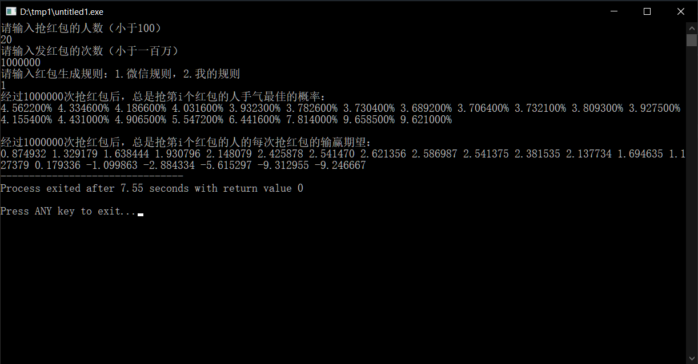
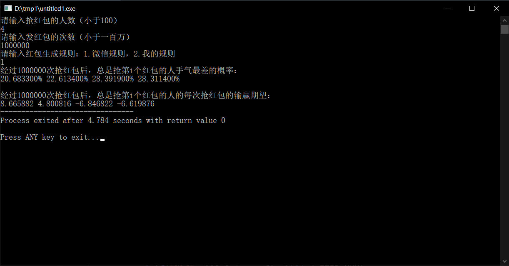
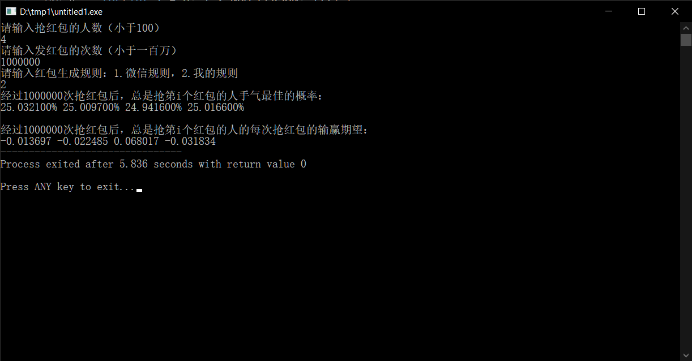
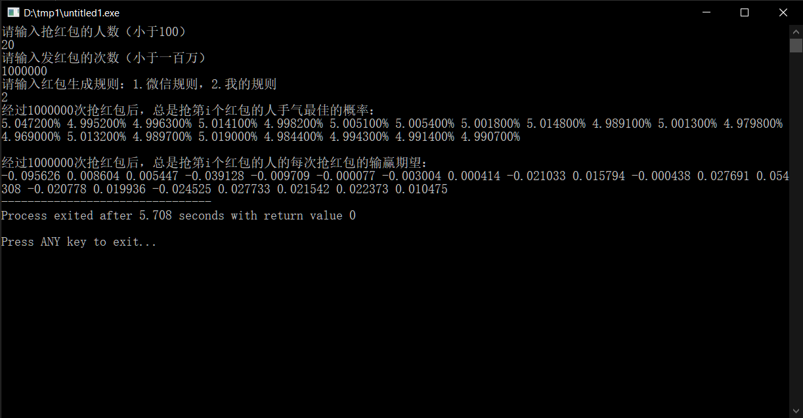

layout: post
title: 如何正确的抢拼手气红包
author: junyu33
mathjax: true
tags: 

- c++

categories:

  - develop

date: 2022-2-4 15:00:00

---

注意：本文仅对微信拼手气红包的算法进行分析，指出最佳的抢红包位置，并不能帮助读者从微信红包中盈利。

<!-- more -->

# 背景

春节期间，我与家人共4人组建了一个红包群，约定每天中午饭后和晚上黄金时间开展抢红包活动，规则如下：

> 1. 发出一个总面值200元，份数为4的拼手气红包。
> 2. 手气最佳者，接着发下一个红包。
> 3. 每轮进行20分钟，最后一个手气最佳者发明天的第一个红包。（第一天的第一个红包由群主发）

然后由于我的手速较快，每次几乎总能抢到第一个。于是在某一天，我连续五次手气最佳，在那轮不出意外地输掉了800+。于是我第二天改变了策略，等红包出来后5秒钟再抢，这一天两轮我都赢了200+——看来我的策略是正确的，我每天的输赢确实跟抢红包的位置有一定的关系。

于是，有一点编程基础的我，决定用计算机模拟一下抢红包的过程，计算一下当抢红包次数**足够多**的情况下：

> 1. 每个位置手气最佳的概率。
> 2. 每个位置输赢的期望。

# 实现

## 拼手气红包算法

经上网查阅，微信的拼手气红包金额分配是这样实现的。

> 我们假设总金额为$W$，抢红包人数为$N$，那么：
>
> 第一个红包金额$x_1$的范围是$[0.01, \frac{W}{N}*2]$
>
> 第二个红包金额$x_2$的范围是$[0.01, \frac{W-x_1}{N-1}*2]$
>
> 第三个红包金额$x_3$的范围是$[0.01, \frac{W-x_1-x_2}{N-2}*2]$
>
> ......
>
> 倒数第二个红包$x_{N-1}$和最后一个红包$x_N$的范围都是$[0.01, W-\displaystyle\sum_{i=1}^{N-2}x_i]$
>
> 其中$x_i$在以上范围内均匀随机。

由此可见，后面的红包都是基于前面抢过红包的金额之和来进行**即时计算**的，这样做不需要预处理红包内部的金额。这对于微信这种容纳数十亿人的交流平台，节省了一大笔时间与空间的开销。

当然，这样做的后果就是：虽然在哪个位置，抢到红包的金额的数学期望是相等的（然而我并不会证），但是每个位置可能的金额的方差却不相同。一般来说，可能金额的方差随着次序的靠后而逐渐增大（这就是为什么大红包大多都出在后面的原因）。

我在查阅微信算法之前，自己也构思了一个**需要预处理**的金额分配算法，思路如下：

> 我们假设总金额为$W$，抢红包人数为$N$，那么：
>
> 想象一条长为$W$的线段，在这上面随机取$N-1$个点，我们将其从左到右命名为$p_1$~$p_{N-1}$.
>
> 于是分配到的金额为：
>
> $x_1 = p_1$
>
> $x_i = p_i-p_{i-1}$，且$i \in [2, n-1]$
>
> $x_n = W - p_{N-1}$

编者认为，这种做法可以保证人人公平。

## 编写代码与测试

根据以上思想，我编写了如下c++代码。

（为什么不用python？因为python生成$10^6$个随机数太慢了）

```c++
#include <iostream>
#include <random>
#include <ctime>
#include <algorithm>
#define PERSON_MAX 100
#define INI_BALANCE 0
//#define NUM_PERSON 4
int NUM_PERSON;
#define NUM_ENV 200
//#define ITER_NUM 1000000
int ITER_NUM;
int MODE;
using namespace std;
double balance[PERSON_MAX], money[PERSON_MAX];
int num_first[PERSON_MAX];
default_random_engine f(time(NULL));
uniform_real_distribution<double> rnd(0, 1);
void init() {
	//	for(int i = 0; i < 4; i++)
	//		cout << rnd(f) << endl;
	cout << "请输入抢红包的人数（小于100）" << endl;
	cin >> NUM_PERSON;
	cout << "请输入发红包的次数（小于一百万）" << endl;
	cin >> ITER_NUM;
	cout << "请输入红包生成规则：1.微信规则，2.我的规则" << endl;
	cin >> MODE;
	for(int i = 0; i < NUM_PERSON; i++) {
		balance[i] = INI_BALANCE;
	}
}
void rand1() {
	double money_left = NUM_ENV;
	for(int i = 0; i < NUM_PERSON - 1; i++) {
		money[i] = rnd(f) * money_left / (NUM_PERSON - i) * 2;
		money_left -= money[i];
	}
	money[NUM_PERSON - 1] = money_left;
}
double pin[PERSON_MAX];
void rand2() {
	for(int i = 0; i < NUM_PERSON - 1; i++) {
		pin[i] = rnd(f) * NUM_ENV;
	}
	sort(pin, pin + NUM_PERSON - 1);

	money[0] = pin[0];
	for(int i = 1; i < NUM_PERSON - 1; i++) {
		money[i] = pin[i] - pin[i - 1];
	}
	money[NUM_PERSON - 1] = NUM_ENV - pin[NUM_PERSON - 2];
}
int gen(int who_first, int mode) {
	balance[who_first] -= NUM_ENV;

	if(mode == 1) rand1();
	else rand2();

	double max_money = -1.0;
//	double min_money = 10000.0;
	for(int i = 0; i < NUM_PERSON; i++) {
		balance[i] += money[i];
		if(money[i] > max_money) {
			max_money = money[i];
			who_first = i;
		}
//		if(money[i] < min_money) {
//			min_money = money[i];
//			who_first = i;
//		}		
	}
	num_first[who_first]++;
	return who_first;
}
void out() {
	printf("经过%d次抢红包后，总是抢第i个红包的人手气最佳的概率：\n", ITER_NUM);
	for(int i = 0; i < NUM_PERSON; i++) {
		printf("%lf", 100.0 * num_first[i] / ITER_NUM);
		cout<<"% ";
	}
	printf("\n\n");
	//who is the luckiest
	printf("经过%d次抢红包后，总是抢第i个红包的人的每次抢红包的输赢期望：\n", ITER_NUM);
	for(int i = 0; i < NUM_PERSON; i++) {
		printf("%lf ", balance[i] / ITER_NUM);
	}
	//who is the richest
}
int main()
{
	init();
	int who_first = 0;
	for(int i = 0; i < ITER_NUM; i++) {
		who_first = gen(who_first, MODE);
	}
	out();
	return 0;
}
```

首先，我针对我们家的情况进行的实验，结果如下：


由此可见，最先抢红包的人有约27.4%的概率手气最佳，这一数据比最后两位高出了大约3.9%。别看这个数字很小，可20分钟至少也能发30个红包，也能积攒出一个红包200元的差距了。

再来看期望，最先抢红包的人平均每一局将近输掉了5元，再乘上一轮红包雨的红包数量，大概是150~200元之间，跟算概率的结果相仿。

而最后两个抢红包的，无论是从手气最佳的概率上，还是从赢钱的期望上，都是最低（佳）的，而且地位相同。

## 拓展思考

### 增加人数

那么，如果抢红包的人数不是4人，而是一个大家族（比如说20人），又会怎么样呢？

结果出乎我的意料。



我们可以看到，手气最佳的概率先是从第一个抢红包的4.65%，下降到第8个的3.69%，然后又迅速上升至最后两位的9.64%（均值），是平均值5%的几乎两倍。

同时赢钱期望也是先增后减，只不过到最后5个人才开始输钱。

即使是100个人抢红包，最后两个人手气最佳的概率也有8%，而且输钱的期望增加到了14元。

### 改进规则

那么，如果是抢的最少的人发红包，又会怎么样呢？

对于人数较少的时候，先抢红包的人不容易手气最差，而且赢得比之前的4号更多，这符合我们的直觉。



对于人数较多的时候，手气最差的增减性与输赢的期望与人数较少的情况一致，只不过最后两位输得比之前的$9.2$~$9.3$少了许多。


### 调整算法

最后，我们来看看我的算法究竟是否公平。

这是人数较少的情况：



这是人数较多的情况：



由此可见，每轮红包的输赢期望稳定在了几分钱以内，可以说是做到了基本公平。

# 后记

程序编写好后，我把结论分享给了父母，于是父亲在当天午后的抢红包活动中始终赖到最后一位，而我只能则随机在前三位游走，无可奈何。

最后，父亲赚了249元，而我输了253元。看来算清楚赢钱的套路并不能帮助我赢钱啊qwq。

