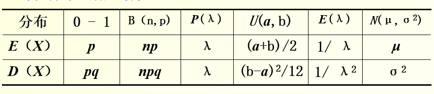

layout: post
title: （已完结）概统笔记
author: junyu33
mathjax: true
categories: 

  - 笔记

date: 2022-9-26 20:30:00

---

顺便用作$\LaTeX$练习.

<!-- more -->

# 成绩分布

卷面成绩：50%

平时成绩：50%

- 平时作业
- 期中+小测
- 非标
- 随堂表现

# 特点

- 理解性、记忆性

- 微积分功底

- 题型固定

# 概率部分

## 概率论基础

用$A,B,C$等表示事件

$\overline{A}$表示A的对立事件（对立是互斥的充分条件）

$AB=A\cap B$

$A-B=A\overline{B}=A-AB$

$\overline{A\cap B}=\overline{A}\cup\overline{B}$

$\overline{A\cup B}=\overline{A}\cap\overline{B}$

发生B后再发生A的概率$P(A|B)=\frac{P(AB)}{P(B)}$，其中$P(B)>0$

全概率公式：设$B_1, ... ,B_m$为完备事件组，则$P(A)=\sum_{i=1}^m{P(A|B_i)P(B_i)}$

贝叶斯公式：设$B_1,B_2 ... B_m$为完备事件组，则$P(B_i|A)=\frac{P(B_iA)}{P(A)}=\frac{P(B_i)P(A|B_i)}{\sum_{i=1}^m{P(A|B_i)P(B_i)}}$，即贝叶斯公式是乘法公式与全概率公式的组合。

若$P(AB)=P(A)P(B)$，则$A,B$独立，同时$A,\overline{B}$、$\overline{A},\overline{B}$、$\overline{A},B$也独立。

二项分布概率：$P(k)=\mathrm{C}_{n}^{k}p^k(1-p)^{n-k}$

> 多项分布：某随机实验如果有$k$种可能的结果$C_1 \sim C_k$，它们出现的概率是$p_1 \sim p_k$。在N随机试验的结果中，分别将$C_1 \sim C_k$的出现次数记为随机变量$x_1 \sim x_k$，那么$C_1$出现$x_1$次、$C_2$出现$x_2$次……$C_k$出现$x_k$次这种事件发生的概率是
>
> $\frac{N!}{x_1!x_2! ... x_k!}p_1^{x_1}p_2^{x_2} ... p_k^{x_k}，其中\sum_{i=1}^k x_i=N, \sum_{i=1}^k p_i=1$

## 随机变量及其分布（背）

随机变量$X(\omega)$是一个函数，其中$\omega$是样本空间，$X$是样本空间到实数的映射。

分布函数$F(x)=P(X \leq x)$，其定义域为$\mathbb{R}$，非严格单增（左极限为0，右极限为1），右连续。

密度函数$f(x)$ 满足 $F(x) = \int_{-\infty}^x f(x)\mathrm{d}x$

当$f(x)$连续时，可简化为$F'(x) = f(x)$。有$f(x)\ge0$且$\int_{-\infty}^\infty f(x)\mathrm{d}x = 1$.

求概率的问题可以转化为概率密度函数的积分：$P(X \in G)=\int_Gf(x)\mathrm{d}x$.

### 非连续分布

几何分布与超几何分布略去.

二项分布:$X \sim \mathrm{B}(n,p)$,$P(X=k)=\mathrm{C}_{n}^{k}p^k(1-p)^{n-k}$

>二项分布的图像是单峰的,由于
>
>$\frac{P\{X=k\}}{P\{X=k-1\}}=1+\frac{(n+1)p-k}{kq}$,故$k$最靠近$(n+1)p$时易得最值.

泊松分布:$X \sim \mathrm{P}(\lambda)$,$P(X=k)=\frac{\lambda^k}{k!}e^{-\lambda}$

> 泊松分布相当于对$e^x$的泰勒展开各项之和归一化.
>
> 泊松定理:二项分布以泊松分布为极限分布.具体而言, 对于$X \sim \mathrm{B}(n,p)$,当n足够大时(>=100),我们可以近似把它看作$X \sim \mathrm{P} (\lambda)$,其中$\lambda=np$

### 连续分布

均匀分布(uniform distribution)  

$$ f(x)=\left\{
\begin{array}{}
\frac{1}{b-a}       &      & {x \in [a,b]}\\
0     &      & {others}
\end{array} \right. ,  x \sim U(a,b)$$

指数分布(exponential)  

$$ f(x)=\left\{
\begin{array}{}
\lambda e^{-\lambda x}       &      & {x > 0}\\
0     &      & {others}
\end{array} \right. , x \sim e(\lambda)$$

伽马分布(gamma distribution) 

$$ f(x)=\left\{
\begin{array}{}
\frac{\beta^\alpha}{\Gamma(\alpha)}x^{\alpha-1}\mathrm{e}^{-\beta x}       &      & {x > 0}\\
0     &      & {others}
\end{array} \right. , x \sim \Gamma(\alpha, \beta)$$

> $\Gamma(x) = \int_0^{\infty}t^{x-1}\mathrm{e}^{-t}\mathrm{d}t$

### 随机变量函数的分布Y=f(X)型题目的做法

以求密度函数$f(x)$为例:

- 求出$Y$对应的值域
- 将$X$用$Y$解出,把$F(X)$替换成$F(Y)$
- 对$F(Y)$求导得到$f(y)$

对于某些需要分类讨论的题目:

- 求出$Y$对应的值域,并找到分段点
- 在该区间内解不等式,解得$X \in g(Y)$,解$F(Y)=\int_{x \in g(Y)}f(x)\mathrm{d}x$
- 对$F(Y)$求导得到$f(y)$,汇总结果

注意求积分$+C$时需要注意一下分布函数的连续性.

## 多（二）维随机变量及其分布

### 二维离散型随机变量分布

就是一个所有项和为1的表，没啥说的，求概率就是把对应位置的概率加起来就行。

边缘分布：

- $p_{i\bullet}=\sum_j p_{ij}$

- $p_{\bullet j}=\sum_i p_{ij}$

条件分布律：

- $P(Y=y_j|X=x_i)=\frac{p_{ij}}{p_{i \bullet}}$

- $P(X=x_i|Y=y_j)=\frac{p_{ij}}{p_{\bullet j}}$

### 二维连续型随机变量分布

相当于求二重积分，需要注意积分的定义域。

通常会利用定义域内积分和为1的性质求参数，然后重新求指定区域的二重积分来求概率。

二维分布函数与密度函数：$F(x,y)=P(X\le x, Y\le y)=\int_{-\infty}^{x} \int_{-\infty}^{y} f(u,v)\mathrm{d}u\mathrm{d}v$

$ P(x_1<X\le x_2, y_1<Y\le y_2) = F(x_2,y_2)-F(x_1,y_2)-F(x_2,y_1)+F(x_1,y_1)$

边缘密度：

- $f_X(x)=f(x,+\infty)=\int_{-\infty}^\infty f(x,y)\mathrm{d}y$
- $f_Y(y)=f(+\infty,y)=\int_{-\infty}^\infty f(x,y)\mathrm{d}x$

条件分布函数：

- $F_{X|Y}(x|y)=\int_{-\infty}^x \frac{f(u,y)}{f_Y(y)}\mathrm{d}u$（另一半懒得写了）

- $f_{X|Y}(x|y)= \frac{f(x,y)}{f_Y(y)}, f_{Y|X}(y|x)= \frac{f(x,y)}{f_X(x)}$

> 常见题型：
>
> 一个密度、两个条件、两个边缘
>
> - 已知一个密度，求剩下四个。
> - 已知一个条件与对应的边缘，求剩下三个。
>
> 已知二维密度函数$f(x,y)$，$Z=g(X,Y)$，求$Z$的密度函数$f_Z(z)$
>
> - 确定$f(x,y)$的有效区间$R$
> - 计算$F_Z(z)=\iint_{(x,y)\in R}f(x,y)\mathrm{d}x\mathrm{d}y$，注意分类讨论
> - 对$z$求导得到密度函数$f_Z(z)$
>
> ~~卷积再见~~
>
> 若$Z=\max(X,Y)$且$X,Y$独立，则$F_Z(z)=F_{X}(z)F_{Y}(z)$
>
> 若$Z=\min(X,Y)$且$X,Y$独立，则$F_Z(z)=1-(1-F_{X}(z))(1-F_{Y}(z))$

## 数学期望

### 数学期望的定义

离散变量的期望：$E(X)=\Sigma_{k=1}^\infty x_k P_k$

连续变量的期望：$E(X)=\int_{-\infty}^\infty xf(x)\mathrm{d}x$

当级数的和（或积分）绝对收敛时，数学期望存在。

> 对于二维的情况，还可以这样算:
>
> $E(X)=\int_{-\infty}^\infty xf_X(x)\mathrm{d}x$
>
> $E(Y)=\int_{-\infty}^\infty yf_Y(y)\mathrm{d}y$

### 随机变量函数的期望

$E(g(x))=\Sigma_{k=1}^\infty g(x_k)P_k=\int_{-\infty}^{\infty}g(x)f(x)\mathrm{d}x$

$E(g(x,y))=\Sigma\Sigma g(x_i,y_j)P_{ij}=\int_{-\infty}^{\infty} \int_{-\infty}^{\infty} g(x,y)f(x,y)\mathrm{d}x\mathrm{d}y$

### 数学期望的性质

$E(C)=C$

$E(C_1X+C_2Y)=C_1E(X)+C_2E(Y)$

若$X$与$Y$独立，则$E(XY)=E(X)E(Y)$

## 方差

### 方差的定义

$D(X)=E(X-E(X))^2=E(X^2)-E(X)^2$

> 设$E(X)=c$，
>
> $=E(X-c)^2=E(X^2-2cX+c^2)$
>
> $=E(X^2)-2cE(x)+c^2$
>
> $=E(X^2)-c^2=E(X^2)-E(X)^2$

标准差为$\sqrt{D(X)}$

### 方差的性质

$D(C)=0$

$D(aX)=a^2D(X)$

当$X,Y$独立时，$D(X \pm Y)=D(X)+D(Y)$

当$X,Y$独立时，$D(\Sigma_{i=1}^n c_iX_i)=\Sigma_{i=1}^nc_i^2D(X_i)$

$D(X)=0 \iff \exists c, P(X=c)=1$，但这不意味着$X=c$（同：概率为1的事件不一定是必然事件）

变异系数：$C_v=\frac{\sqrt{D(X)}}{|E(X)|}$

### 常见分布的期望与方差（背）

$E(\Gamma(\alpha, \beta))=\frac{\alpha}{\beta}, D(\Gamma(\alpha, \beta))=\frac{\alpha}{\beta^2}$

### 原点矩与中心矩

$m_k=E(X^k)$

$\mu_k=E(X-E(X))^k$

因此方差是二阶中心矩。

## 协方差与相关系数

### 协方差的定义

$\mathrm{Cov}(X,Y)=E((X-EX)(Y-EY))=E(XY)-E(X)E(Y)$

> 证明与方差类似，此略

### 协方差的性质

$\mathrm{Cov}(X,X)=D(X)$

$\mathrm{Cov}(X,Y)=\mathrm{Cov}(Y,X)$

$\mathrm{Cov}(X,a)=0$

$\mathrm{Cov}(aX,bY)=ab\mathrm{Cov}(X,Y)$

$\mathrm{Cov}(X+Y,Z)=\mathrm{Cov}(X,Z)+\mathrm{Cov}(Y,Z)$

$D(X\pm Y)=D(X)+D(Y)\pm 2\mathrm{Cov}(X,Y)$

若$X$与$Y$独立，则$\mathrm{Cov}(X,Y)=0$

> 证明：显然由期望的性质可得。
>
> 由此可证若$X$与$Y$独立，$D(X \pm Y)=D(X)+D(Y)$

### 随机变量的标准化

$X^*=\frac{X-E(X)}{\sqrt{D(X)}}$

其期望为0，方差为1，没有量纲。

### 相关系数的定义（背）

相关系数$(X,Y)=\mathrm{Cov}(X^*,Y^*)=\frac{1}{\sqrt{D(X)}}\frac{1}{\sqrt{D(Y)}}\mathrm{Cov}(X,Y)$

显然$X,Y$不能为常数

相关系数需要计算五个期望：$E(X),E(Y),E(X^2),E(Y^2),E(XY)$

即$R(X,Y)=\frac{E(XY)-E(X)E(Y)}{\sqrt{E(X^2)-E(X)^2}\sqrt{E(Y^2)-E(Y)^2}}$

### 相关系数的性质

$0\le |{R(X,Y)}| \le 1$

当$R(X,Y)=1$时，$\exists t_0>0, P(Y=t_0 X)=1$，即$X,Y$正相关。

当$R(X,Y)=-1$时，$\exists t_0<0, P(Y=t_0 X)=1$，即$X,Y$负相关。

$R(X,Y)=0$表明$X,Y$不相关，是$X,Y$独立的必要条件。

如果要证明$X,Y$不独立，应选取合适的区间，使$P(X,Y)\ne P(X)P(Y)$

## 正态分布

### 标准正态分布

$\mathrm{N}(0,1)=\varphi(x)=\frac{1}{\sqrt{2\pi}}e^{-\frac{x^2}{2}},x \in \mathbb{R}$

> 偶函数，钟形曲线。

$\Phi(x)=\int_{-\infty}^x\varphi(x)\mathrm{d}x$

> $\Phi(0)=\frac{1}{2}$
>
> $\Phi(x)+\Phi(-x)=1$
>
> 考试算概率时经常用这两个性质，并且应保留$\Phi(x)$而不是$\Phi(-x)$作为答案（或查表）。

### 正态分布

因$\frac{X-\mu}{\sigma}\sim \mathrm{N}(0,1)$，则$X \sim \mathrm{N}(\mu, \sigma^2)$，故$F(x)=\Phi(\frac{x-\mu}{\sigma})$

求导可得$\mathrm{N}(\mu, \sigma^2)=\frac{1}{\sigma\sqrt{2\pi}}e^{-\frac{(x-\mu)^2}{2\sigma^2}},x \in \mathbb{R}$

> $\mu$关系到图象的左右平移（期望），$\sigma$关系到图象“尖”的程度（标准差）。

多个**独立**正态分布的线性组合还是正态分布。

>  特别的，如果它们都是$\mathrm{N}(\mu, \sigma^2)$，其平均值为$\mathrm{N}(\mu, \frac{\sigma^2}{n})$

### 二维正态分布

特殊情况：

$(X,Y)\sim(\mu_1,\mu_2;\sigma_1^2,\sigma_2^2)=\mathrm{N}(\mu_1, \sigma_1^2)\mathrm{N}(\mu_2, \sigma_2^2)$

一般情况（含相关系数）：

$(X,Y)\sim(\mu_1,\mu_2;\sigma_1^2,\sigma_2^2;r)$

$=\frac{1}{\sigma_1\sigma_2 2\pi\sqrt{1-r^2}} e^{-\frac{1}{2(1-r^2)}((\frac{x-\mu_1}{\sigma_1})^2+(\frac{y-\mu_2}{\sigma_2})^2-2(\frac{x-\mu_1}{\sigma_1})(\frac{y-\mu_2}{\sigma_2})r)}$

对二维正态分布而言，其边缘分布与条件分布是正态分布。同时，不相关与独立性是等价的。

### 自然指数分布族

$f(x,\theta)=e^{\theta x-\varphi(\theta)}h(x)$

常见分布中除了均匀分布均可化成这种形式。

其均值参数（期望$m$）为$\varphi'(\theta)$,方差函数为$\varphi^{(2)}(\theta)$

## 极限定理

### 切比雪夫不等式

$P(|X-E(X)| \ge \varepsilon) \le \frac{D(x)}{\varepsilon^2}$

$P(|X-E(X)| < \varepsilon) \ge 1- \frac{D(x)}{\varepsilon^2}$

### 大数律

随机变量序列$\{X_n\}$，考虑均值$\overline{X}$，

若$\overline{X}-E(\overline{X}) \stackrel{P}{\longrightarrow} 0$ ，则$\{X_n\}$服从大数律。

- 切比雪夫大数律：

充要条件是随机变量的方差**一致有界**，即有常数$C$，使$D(X_k)\le C$ 即可满足符合大数律。

- 独立同分布大数律：

只要$X_k$独立同分布，且$E(X_k)=\mu$，$D(X_k)=\sigma^2$即可保证符合大数律。

- 伯努利大数律：

$X_k \sim \mathrm{B}(n,p)$，则$\frac{n_A}{n} \stackrel{P}{\longrightarrow} p$

### 中心极限定理

$X_i$独立同分布，则 $Z_n=\Sigma_{i=1}^n X_i$ 近似服从正态分布。

$E(X_k)=\mu, D(X_k)=\sigma^2\rightarrow P(\frac{n\overline{X} - nu}{\sigma \sqrt{n}} \le x)=\Phi(x)$

可得$Z$近似服从$\mathrm{N}(n\mu, n\sigma^2)$，$\overline{X}$近似服从$N(\mu, \frac{\sigma^2}{n})$

> 设$X \sim \mathrm{B}(n,p)$，若$Z_n=\Sigma_{i=1}^n X_i$
>
> $\lim_{n\to \infty} P(\frac{X_n - np}{\sqrt{npq}}\le x)=\Phi(x)$
>
> 即$Z$近似服从$\mathrm{N}(np, npq)$

# 统计部分

## 常见分布

### 卡方分布——正态平方和

正态分布$X_i \sim \mathrm{N}(0,1)$的平方和。

$\chi^2=\Sigma_{i=1}^n X_i^2$服从自由度为$n$的$\chi^2$分布，即$\chi^2(n)$

$\chi^2(n)=\Gamma(\frac{n}{2}, \frac{1}{2})$，故$E(\chi^2)=n, D(\chi^2)=2n$

卡方分布满足可加性。

### t分布——正态比一个数

$X \sim \mathrm{N}(0,1), Y \sim \chi^2(n)$

$t(n) = \frac{X}{\sqrt{\frac{Y}{n}}}$

分布与正态分布相似，但尾巴比正态分布更厚。

### F分布——正态平方和相比

$X \sim \chi^2(n), Y \sim \chi^2(m)$

$F(n,m)=\frac{X/n}{Y/m}$

$\frac{1}{F}=F(m,n)$

## 常见统计量

### 样本均值

$\overline{X}=\frac{1}{n} \Sigma_{i=1}^n X_i$

### 样本方差

$S^2=\frac{1}{n-1} \Sigma_{i=1}^n (X_i-\overline{X})^2$（注意是n-1，不是n）

## 抽样分布定理

### 其一（已知方差）

样本$X_1,X_2,...,X_n$来自$\mathrm{N}(\mu, \sigma^2)$，则

$\chi^2=\frac{(n-1) S^2}{\sigma^2}=\frac{1}{\sigma^2} \Sigma(X_i-\overline{X})^2 \sim \chi^2(n-1)$

且$\overline{X}$与$\chi^2$独立。

### 其二（已知均值）

样本$X_1,X_2,...,X_n$来自$\mathrm{N}(\mu, \sigma^2)$，则

$t=\frac{\overline{X}-\mu}{S\sqrt{\frac{1}{n}}} \sim t(n-1)$

### 其三（多个整体）

> 概统成功变成了文科

若$X \sim \mathrm{N}(\mu_1, \sigma^2), Y \sim \mathrm{N}(\mu_2, \sigma^2)$则，

$\overline{X}-\overline{Y} \sim \mathrm{N}(\mu_1 - \mu_2, \frac{\sigma_1^2}{n_1}+\frac{\sigma_2^2}{n_2})$

$\frac{(n_1-1) S_1^2 + (n_2-1) S_2^2}{\sigma^2} =\chi^2(n_1+n_2-2)$

$\frac{(\overline{X}-\overline{Y})-(\mu_1-\mu_2)}{S_w\sqrt{\frac{1}{n_1}+\frac{1}{n_2}}} \sim t(n_1+n_2-2)$ 
> 其中$S_w^2=\frac{(n_1-1)S_1^2+(n_2-1)S_2^2}{n_1+n_2-2}$

若$X \sim \mathrm{N}(\mu_1, \sigma_1^2), Y \sim \mathrm{N}(\mu_2, \sigma_2^2)$则，

$\frac{S_1^2/\sigma_1^2}{S_2^2/\sigma_2^2} \sim F(n_1-1,n_2-1)$

## 点估计

### 矩估计

设样本均值与期望函数（也可以是平方期望）相等，把期望函数的参数$\theta$用期望值$m$表示得到$\theta(m)$，然后将$m$代入$\overline{x}$得到$\hat{\theta}=\theta(\overline{x})$。

### 极大似然估计

离散型：写出观测事件发生概率关于参数$\theta$的函数（通常是某种离散分布的乘积），假设该函数为函数的最大值。通过求解对数极大似然方程$\frac{\mathrm{d}L(x)}{\mathrm{d}(\theta)}=0$的解得到对应的参数$\hat{\theta}$.

连续型：取的函数应为$\prod_{i=1}^n f(x_i, \theta)$，注意这里把$x_i$按常数看待，以下步骤相同。

极大似然估计值是$x_i$的最大值，极大似然估计量是$X_i$的最大值。

### 估计量评选标准

无偏估计量：估计值的平均值$E(\hat{\theta})=\theta$，反之为有偏估计量。

渐进无偏估计量：$\lim_{n \to \infty} E(\hat\theta)-\theta=0$

有效性标准：若$D(\hat\theta_1)\le D(\hat\theta_2)$则$\hat\theta_1$比$\hat\theta_2$更有效。

一致性标准：$\hat\theta_n \stackrel{P}{\longrightarrow} \theta$ 则称为$\hat\theta_n$是$\theta$的一致估计量。

均方误差标准：$E(\hat\theta_1-\theta)^2 \le E(\hat\theta_2-\theta)^2$则$\hat\theta_1$在均方误差下比$\hat\theta_2$更有效。

> 具体而言，$B_2$在均方误差下比$S^2$更有效。

## 区间估计（背）

> 只针对正态分布

### 双侧置信 

估计$\mu$的$(1-\alpha)$的置信区间。

若$\sigma^2$已知，则为$(\overline{X}-\frac{\sigma}{\sqrt{n}}u_{1-\frac{\alpha}{2}}, \overline{X}+\frac{\sigma}{\sqrt{n}}u_{1-\frac{\alpha}{2}})$

若$\sigma^2$未知，则为$(\overline{X}-\frac{S}{\sqrt{n}}t_{1-\frac{\alpha}{2}}(n-1), \overline{X}+\frac{S}{\sqrt{n}}u_{1-\frac{\alpha}{2}}(n-1))$

估计$\sigma^2$的$(1-\alpha)$的置信区间。

$(\frac{(n-1)s^2}{\chi^2_{1-\frac{\alpha}{2}}(n-1)}, \frac{(n-1)s^2}{\chi^2_\frac{\alpha}{2}(n-1)})$

### 单侧置信

估计$\mu$的$(1-\alpha)$的置信区间。

若$\sigma^2$已知，则单侧置信下限为$\overline{X}-\frac{\sigma}{\sqrt{n}}u_{1-\alpha}$，上限为$\overline{X}+\frac{\sigma}{\sqrt{n}}u_{1-\alpha}$

若$\sigma^2$未知，则单侧置信下限为$\overline{X}-\frac{S}{\sqrt{n}}t_{1-\alpha}(n-1)$，上限为$\overline{X}+\frac{S}{\sqrt{n}}t_{1-\alpha}(n-1)$

估计$\sigma^2$的$(1-\alpha)$的置信区间。

单侧置信下限为$\frac{(n-1)s^2}{\chi^2_{1-\alpha}(n-1)}$，上限为$\frac{(n-1)s^2}{\chi^2_\alpha(n-1)}$

## 假设检验

### 过程

> 带有概率性质的反证法

1. 先写出原假设$H_0$和备择假设$H_1$。
2. 在$H_0$成立的前提下，构造样本满足的分布。
3. 通过$\alpha$的值求出对应的拒绝域$W$。
3. 代入观测值$u$，如果$u \in W$，就拒绝原假设。

### 弃真取伪及概率计算

- 弃真：$H_0$成立时，样本值$u \in W$。
- 取伪：$H_1$成立时，样本值$ u \notin W$。

第一类错误的概率$P_1=P(W)$小于等于$\alpha$。

第二类错误的概率为$P_2=P(\overline{W})$。

$P_1$与$P_2$不能同时减小。但可以通过固定其中一个，增加样本量$n$，减小另一个。具体减小哪一个取决于后果的严重程度。