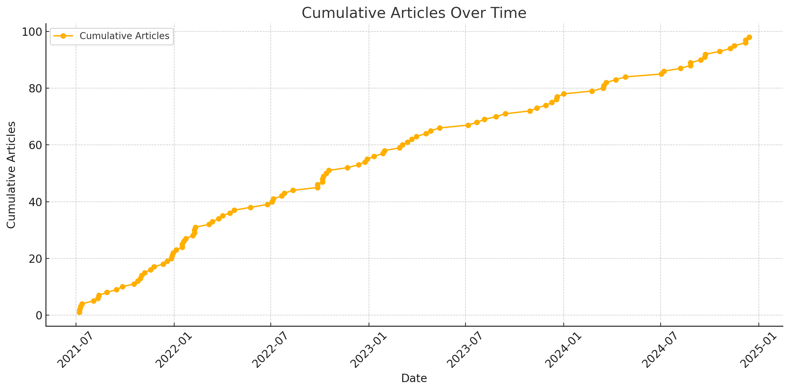
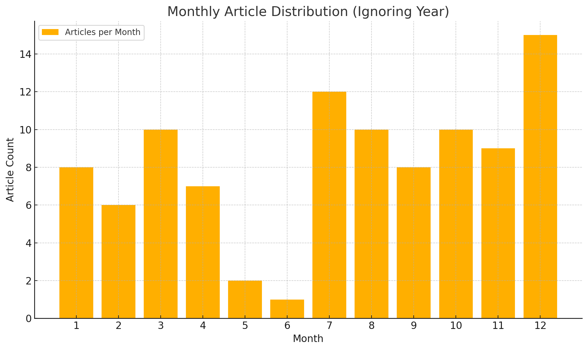
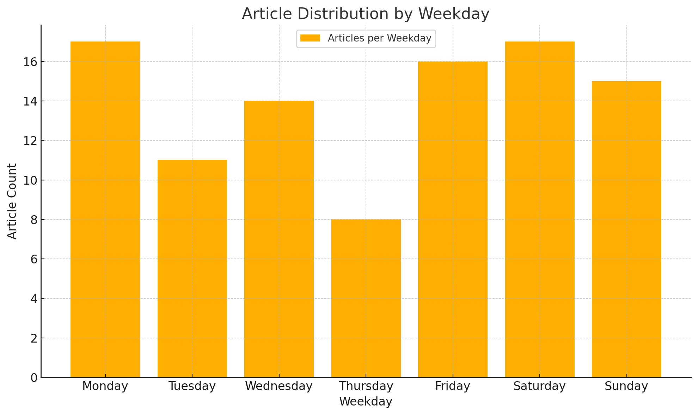
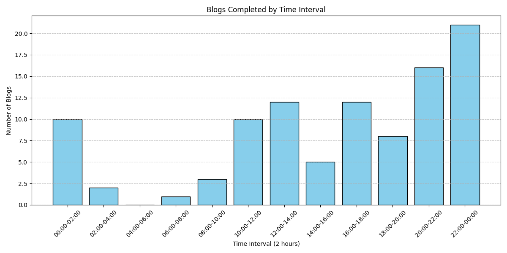
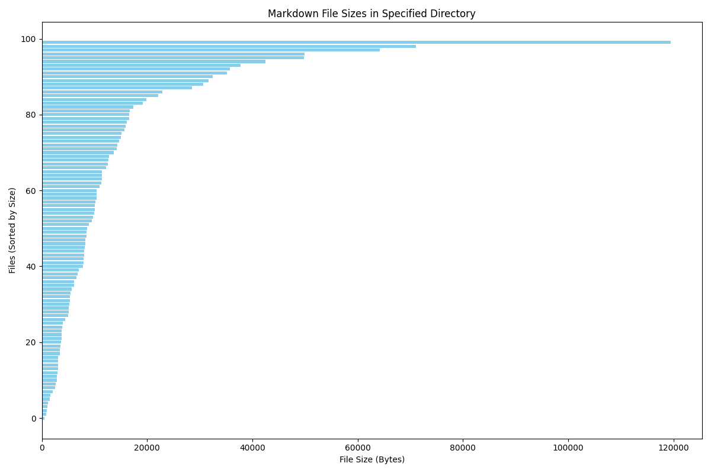
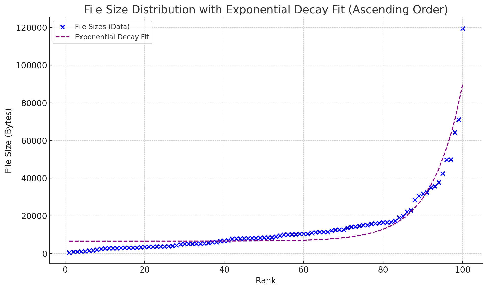
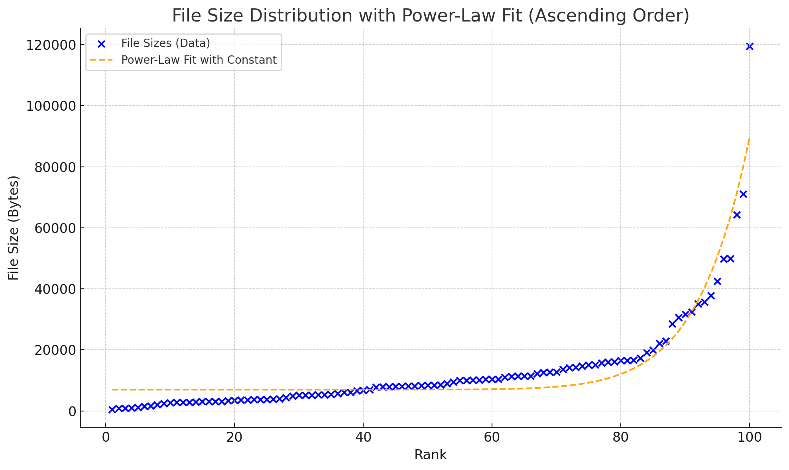
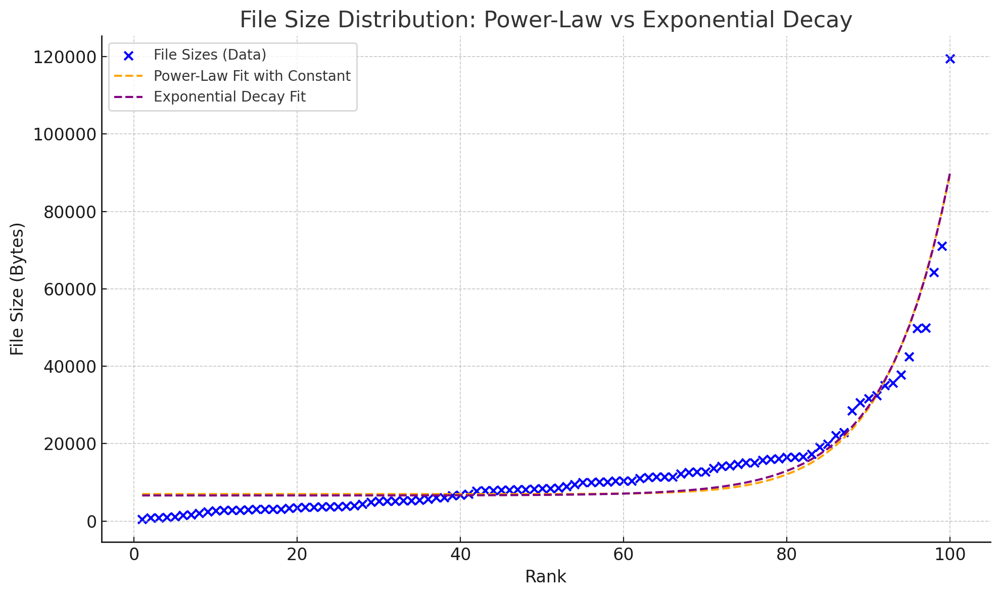
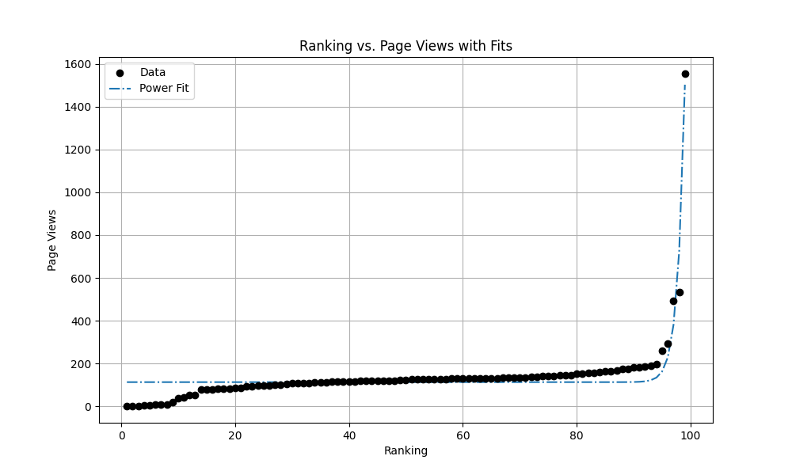

layout: post
title: 第一百篇博客
author: junyu33
mathjax: true
categories: 

  - test

tags:

  - python
  - web

date: 2024-12-13 21:00:00

---

在三年前的七月份，我写下第一篇博客开始。我立下了希望能在本科结束之前，写下 100 篇文章的目标。没想到我居然提前大概半年的时间，完成了这个目标。

既然“一百”算是一个特殊的数字，那么我觉得这个博客的内容也应该是与博客本身相关的，不然就不能体现出这篇文章的“特殊”程度了。

<!-- more -->

## 引言

在三年前的七月份，我写下第一篇博客开始。我立下了希望能在本科结束之前，写下 100 篇文章的目标。没想到我居然提前大概半年的时间，完成了这个目标。

既然“一百”算是一个特殊的数字，那么我觉得这个博客的内容也应该是与博客本身相关的，不然就不能体现出这篇文章的“特殊”程度了。

关于 meta-blog 的内容，我都习惯分类于 `test` 中，这个分类之前的内容主要有：

- 博客元信息相关内容
- 博客维护记录
- 博客功能测试

但唯独没有一篇是关于博客文章本身的——这便是这篇博客的内容。我将从以下几个方面来分析本博客文章有关的 feature：

- 文章撰写时间统计
- 文章长度统计
- 文章标签分布统计
- 文章分类分布统计
- 文章访问量统计

## 文章撰写时间统计

我们可以提取`_posts`路径下的所有 md 文件，并使用正则表达式`date:\s*(\d{4}-\d{1,2}-\d{1,2}\s+\d{1,2}:\d{2}:\d{2})`提取。修改一篇手动置顶文章的真实日期，并删除一头一尾两篇文章，总计有效文章篇数98篇，结果如下：

```
2021-07-06 21:50:00
2021-07-07 20:10:00
2021-07-09 20:30:00
......
2024-12-07 02:00:00
2024-12-13 17:30:00
```

我们可以根据这98篇文章的时间数据，结合 python 的 `pandas` 和 `matplotlib` 来做以下事情：

### 列出累计文章篇数于时间的关系



由图片可以得知，博客的前半年多还是更得比较勤的，之后呢频率有所降低，但频率的导数也基本上为零。比我预期想象的 sqrt 型甚至 log 型好很多。

### 列出在 1-12 月分别写了多少篇文章



因为博客是从7月份开始写的，现在才12月份，6月份我们学校一定有实训/军训，12月份我一定会写年终总结，所以这个统计符合预期。

### 列出文章数量与星期的关系



不太理解为什么周四会少，可能这就是 randomness 吧。

### 列出每天在哪个时间段把文章写完



晚上和午后算是写作高峰期。

## 文章长度统计

这里我选取 md 文件的大小作为长度的标准，还是先列出最大和最小的数据：

```
             file    size
0      bin_ctf.md  119478
1        零——十七.md   71098
2         ACGN.md   64258
3        canmv.md   49881
4   en_decrypt.md   49787
..            ...     ...
95     asmmath.md    1120
96       第一篇博客.md    1007
97       exgcd.md     892
98         碎碎念.md     811
99   unlock-bl.md     527
```

绘图结果如下：



### 排名与长度的函数关系

然后我们尝试用两种函数来拟合这个曲线：

1. 幂律分布
2. 指数分布

分别得到的结果如下：



> $y = 0.2119 \times e^{0.1288x} + 6625.57$



> $y = (8.5334 \times 10^{-21}) \times x^{12.4931} + 6969.62$

两者看不出差别？放在一起就能看出来了



通过图片观察和残差计算，结论是指数分布稍微要准确一点。

## 文章标签分布统计

虽然博客页面已经展示了所有标签，并用大小直观展示了其出现的频率，但我更加关心每一年出现的标签频率变化。

首先还是通过正则表达式搜索标签和日期，前者可以用，后者前文已经提到，结果如下：

```
Tags: ['mma'], Date: 2021-8-2 18:20:00
Tags: ['encrypted'], Date: 2024-7-6 21:45:00
Tags: ['touhou', 'repost'], Date: 2023-3-14 10:00:00
Tags: ['touhou', 'javascript', 'linux', 'games'], Date: 2024-8-7 00:00:00
Tags: ['linux'], Date: 2023-8-5 15:15:00
......
Tags: ['repost'], Date: 2022-10-17 13:00:00
Tags: ['repost'], Date: 2021-7-11 22:50:00
Tags: ['encrypted'], Date: 2021-7-6 21:50:00
```

一共 68 行，也就是差不多 2/3 的博客是带了标签的，符合我的预期。

首先给出总排名：

```
[('linux', 14),
 ('crypto', 13),
 ('python', 12),
 ('pwn', 11),
 ('repost', 9),
 ('reverse', 8),
 ('cpp', 7),
 ('web', 7),
 ('misc', 6),
 ('encrypted', 5),
 ('games', 5),
 ('assembly', 5),
 ('c', 4),
 ('android', 4),
 ('touhou', 3),
 ('windows', 3),
 ('javascript', 2),
 ('mma', 1),
 ('cmake', 1),
 ('docker', 1),
 ('verilog', 1)]
```

然后我们按年来分类，可以得到每一年的排名（这里只展示前五）：

### 2021

```
cpp: 4 次
reverse: 4 次
crypto: 4 次
pwn: 4 次
python: 3 次
```

刚学 CTF 和 python，密码、逆向和二进制都在接触。

### 2022 

```
pwn: 6 次
linux: 4 次
reverse: 4 次
crypto: 4 次
python: 4 次
```

开始大量刷二进制的题目，同时开始使用 Linux。

### 2023

```
repost: 3 次
linux: 3 次
touhou: 2 次
python: 2 次
android: 2 次
```

继续使用 Linux，基本上不打 CTF 了。

### 2024

```
linux: 6 次
crypto: 5 次
assembly: 3 次
python: 3 次
c: 2 次
```

继续使用 Linux，开始正式接触密码和系统相关的学术方向。

> python 是唯一一个四年都上榜的哦~

## 文章分类分布统计

写分类的时候遇到了一些奇奇怪怪的错误，比较考验代码的健壮性，例如：

- categories 的后面并没有跟上 tags，导致正则表达式匹配到 `---` 并将 `--` 作为分类的一部分。
- date 不是 4-2-2 的格式，导致正则表达式匹配不到。
- 忘记处理 year 是 2033, 2038 和 2021 这种情况。

最后我还是通过脚本加手动编辑 outlier 的方式得到了以下结果：

### 2021

```
2021年分类频率：
  随笔: 9
  ctf: 7
  develop: 3
  OI: 3
```

一边写碎碎念，一边学 CTF。

### 2022

```
2022年分类频率：
  随笔: 10
  笔记: 7
  ctf: 6
  develop: 6
  test: 2
  OI: 2
```

继续学习 CTF，学校理论课压力开始增加，也逐渐开始学会“配环境”。

### 2023

```
2023年分类频率：
  随笔: 7
  笔记: 7
  develop: 6
  ctf: 2
  test: 1
```

学校理论课与课程设计的压力仍然存在，CTF 与 OI 逐渐淡出。

### 2024

```
2024年分类频率：
  笔记: 7
  develop: 6
  随笔: 5
  test: 2
```

开始接触科研项目，然后有一些给自己或给别人看的笔记，以及自己的一些 project。

## 文章访问量统计

现在到了抽奖环节，其实我也不知道各位读者会对什么文章感兴趣（这毕竟是page rank算法与时间发生的化学反应），我们来看看最终结果会是什么样的吧。

因为卜算子是 js 脚本获取的数据，这里不能直接使用 requests 进行爬虫，需要使用类似 selenium 的工具

```python
from selenium import webdriver
from selenium.webdriver.common.by import By
from selenium.webdriver.chrome.service import Service
from selenium.webdriver.chrome.options import Options
from selenium.webdriver.common.keys import Keys
from selenium.webdriver.support.ui import WebDriverWait
from selenium.webdriver.support import expected_conditions as EC
import time

# 配置 ChromeDriver 和选项
chrome_options = Options()
chrome_options.add_argument("--headless")  # 无头模式
chrome_options.add_argument("--disable-gpu")
chrome_options.add_argument("--no-sandbox")

# 初始化 WebDriver
service = Service('path/to/chromedriver')  # 替换为你的 chromedriver 路径
driver = webdriver.Chrome(service=service, options=chrome_options)

# URLs 列表
urls = [
    "https://example.com/page1",
    "https://example.com/page2",
    # 添加更多链接
]

# 存储爬取结果
results = []

# 遍历 URL 列表
for url in urls:
    try:
        driver.get(url)

        # 等待指定元素加载
        wait = WebDriverWait(driver, 10)
        page_pv_element = wait.until(
            EC.presence_of_element_located((By.ID, "busuanzi_value_page_pv"))
        )
        title_element = wait.until(
            EC.presence_of_element_located((By.XPATH, '/html/body/main/div[2]/div[1]/article/header/h1'))
        )

        # 确保 page_pv_element.text 不为空
        page_pv = None
        retries = 5  # 尝试 5 次
        while not page_pv and retries > 0:
            page_pv = page_pv_element.text.strip()
            if not page_pv:
                time.sleep(1)  # 等待 1 秒重试
                retries -= 1

        # 获取标题内容
        title = title_element.text

        # 保存结果
        results.append({"url": url, "page_pv": page_pv, "title": title})
        print(f"URL: {url}, Page PV: {page_pv}, Title: {title}")

    except Exception as e:
        print(f"Error processing {url}: {e}")

# 关闭浏览器
driver.quit()

# 打印所有结果
for result in results:
    print(result)
```

——然后结果揭晓，这里贴出前10名：

```
如何打造一个究极舒适的pwn环境, 1554
三五——Android 14 彩蛋试玩, 535
（置顶，已完结）nju-pa 心得, 493
（置顶）博客元信息一览, 294
如何打造一个究极舒适的pwn环境（第三季）, 258
雀魂麻将真的有恶调吗？, 198
pwncollege部分通关记录, 189
scuctf新生赛——幽篁终见天战队wp, 187
一次给 grab app 抓包的经历, 184
广义mt19937随机数逆向, 184
```

看来配环境果然是一枝独秀，成为了各位读者最为关心的内容（

按照惯例我决定还是绘图，然后拟合一下：



> $y = ax^b + c$, `a=1.2790748646693612e-158, b=80.69403536136282, c=113.09706403263824`.

感觉这个常数项 $c$ 应该是爬虫的功劳（

指数拟合的结果太离谱，这里就不放了哈——
