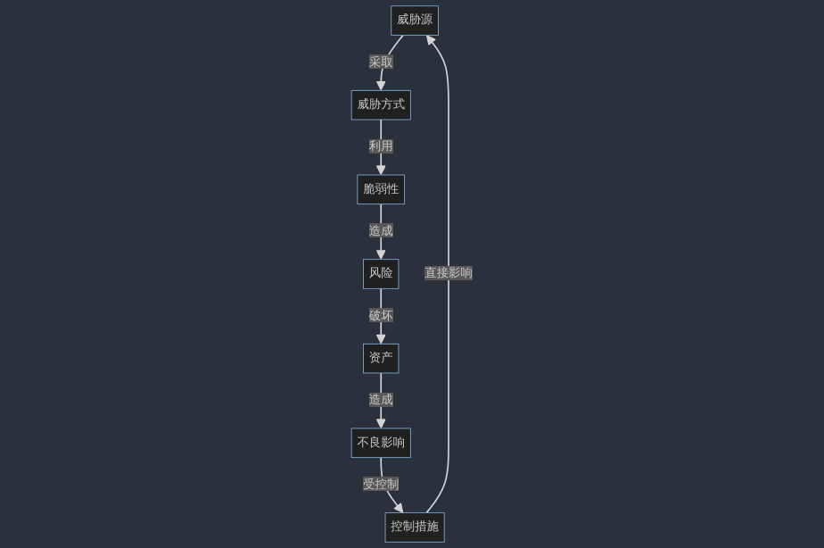

layout: post

title: 网络空间安全技术笔记

author: junyu33

mathjax: true

categories: 

- 笔记

date: 2023-12-18 11:30:00

---

期末考试自用。

<!-- more -->

# 网络空间安全概述

基本目标：CIA

四层次模型：电磁设备、电子信息系统、运行数据、应用

基础模块：信息、应用、网络、因特网

关键信息基础设施保护（CIIP）

# 风险管理

资产：是任何对组织有价值的东西，是要保护的对象

威胁：是可能导致信息安全事故和组织信息资产损失的活动

脆弱性：与信息资产有关的弱点或安全隐患

> 脆弱性本身并不对资产构成危害

控制措施：根据安全需求部署，用来弥补脆弱性，防范威胁，降低风险的措施

可能性：威胁源利用脆弱性，威胁方式，造成不良后果可能性

影响：威胁源利用脆弱性，造成不良后果的程度大小

风险：威胁源、威胁方式、脆弱性、不良后果

风险评估：手段方法、分析威胁脆弱性、发生后测出危害程度、整改措施以控制风险。

> 特点：动态变化、长期持续，确定风险的过程。

风险处置办法：减低、转移、规避、接受

资产识别与评估：资产对组织关键业务的顺利、重要，定性（CIA + 可审计 + 不可抵赖）

风险术语之间的关系：

# 网络空间安全保障及安全运维

PDR：保护、检测、响应

- 时间关系（基于时间、可以攻破）
- 核心与分支：给出攻防时间表
- 缺点：难以适应网络安全环境的快速变化

PPDR：中间加个策略（policy）

$$safe == (P_t > (D_t + R_t))$$

$$E_t = (D_t + R_t) - P_t$$

IATF：信息保障技术框架（三个核心：人、技术、操作）

> 三保护一支撑：（本地计算环境、区域边界、网络和基础设施） <- 支撑性基础设施

# 网络空间安全技术

五个服务、八个安全机制及其它安全机制

- 安全服务：鉴别、访问控制、CI、抗抵赖（行为、内容）
- 安全机制：加密、数字签名、访问控制、I、鉴别交换、通信业务流填充、路由选择控制、公证
- 其他安全机制：可信功能模块、安全标记、事件检测、安全审计跟踪、安全恢复

网络安全体系框架：

- 总需求：物理、网络、信息内容、应用系统、安全管理
- 最终目标：CIA、可控性、抗抵赖
- 框架：技术体系、组织机构体系、管理体系（管理与技术并重）

数字签名：附加数据单元的数据、作变换，接收者确认来源与完整性，防止伪造（不可伪造、抗抵赖、完整性）

> 基于RSA的数字签名（记住流程图）

完整性检测：防止（或可以检测）增删改替

抗抵赖机制：防止**发送者或接收者**对**行为或内容**的抵赖

# 鉴别技术

概念：声称者提交一个主体的身份并声称它是那个主体，使验证者获得对声称者所声称的事实的信任。

- 与访问控制的关系：加起来达到CIA
- 审计机制：作为对责任原则的一种直接支持

要求：

- 验证者正确识别概率极大化
- 不具有传递性
- 攻击者伪装成功概率极小化
- 计算有效性
- 通信有效性
- 鉴别的密钥能安全储存

途径：你所知道的、你所拥有的、个人特征、双（多）因素认证

保护等级：

- 0：无保护
- 1：抗泄露
- 2：对不同验证者的重放 + 抗泄露
- 3：对同一验证者的重放 + 抗泄露
- 4：对相同和不同验证者的重放 + 抗泄露

重放攻击形式有：

- 简单重放
- 可被日志记录的复制品
- 不能被检测到的复制品
- 反向重放（不做修改，向消息发送者重放）

重放对抗方式：序列号、时间戳、质询响应

质询响应的安全性取决于：

- 散列函数的安全性
- 接收者的伪造与重放（可以通过双向鉴别和时间戳解决）

# 访问控制技术

作用：CIA

访问控制表（ACL）、能力表（CL）

自主访问控制（DAC)：允许客体的创建者决定主体对客体的访问权限

- 根据主体的身份和访问权限进行决策
- 具有某种访问能力的主体能够将访问权的某个子集自主授予其它个体
- 灵活性高，被大量采用
- 缺点：信息在传递过程中其访问权限关系会被改变

强制访问控制（MAC)：按照强制访问控制策略进行控制，客体的创建者无权控制客体的访问权限

- 下读/上写（机密性）
- 上读/下写（完整性）

RBAC：使用角色决定用户在系统的访问权限（扮演 + 激活 才能操作）

用户、角色、许可的关系：

- 用户、角色多对多
- 角色、许可多对多
- 许可 = 操作 + 客体，操作、客体多对多

# 防火墙技术

一种高级访问控制设备，置于不同安全域之间，通过相关访问策略控制进出网络的访问行为

包过滤防火墙：

- 处理速度快
- 配置容易
- 对用户透明
- 检查只在网络层，不能识应用层协议或位置连接状态
- 容易IP欺骗
- 静态策略可能成为漏洞

防火墙性能五大指标：

- 吞吐量
- 时延
- 丢包率
- 背靠背
- 并发连接数

WAF：web防火墙

# 入侵检测系统

入侵：非法或未经授权的情况下，试图存取信息或破坏系统和网络正常运行，致使CIA受破坏的故意行为。

入侵检测：对入侵行为的发掘。

入侵检测系统：实施入侵监测功能的软件和硬件的集合。

模型：denning模型

- 假设可以通过检查系统的审计记录识别入侵
- 基于规则的模式匹配系统
- 未包含系统漏洞和攻击方法的知识

IDS 两个指标：误报率、漏报率

典型部署方式：以旁路的方式接入到网络中，且部署在需要的关键位置（DMZ隔离区、路由器与边界防火墙之间、网络中枢、安全级别高的子网等）。

## 主机入侵监测系统：

（网络连接监测 + 主机文件监测）

优点：

- 长期监测谁访问什么
- 问题映射具体ID
- 跟踪滥用行为变化
- 使用与加密环境
- 可以运行在交换环境中
- 监控分布在多台主机，上传有关数据到中央控制台

缺点：

- 无法监测网络活动
- 加大OS负载
- 占用大量存储空间
- OS漏洞破坏代理有效性
- 不同OS需要不同代理
- 升级的问题
- 更高部署维护成本

## 网络入侵监测系统：

优点：

- 不需重新配置或重定向日志机制即可快速获取信息
- 其部署不影响现有网络架构和数据源
- 实时监测网络攻击
- 与OS无关
- 不会增加OS开销

缺点：

- 无法分析加密数据
- 从流量可以推断发生什么，但不能判断结果
- 对全交换网络需要配置交换机端口镜像
- 较高带宽要求

# 入侵防御系统

入侵防御系统（IPS）：集入侵监测和防御于一体的安全产品（IPS = IDS + firewall）

网闸：在两个不同安全域之间，通过协议转换手段，以信息摆渡的方式实现数据交换，系统明确要求传输的信息才能通过。

- 内端机
- 外端机
- 隔离系统

网闸协议不能使用TCP/IP协议（因为是双向的）

**网络准入控制（NAC）的功能需求：**

- 身份鉴别（非法用户拒绝入网）
- 安全认证（不合格进入隔离区，强制加固）
- 动态授权（不同用户享受不同网络使用权限）

NAC主要功能：认证与授权、扫描与评估、隔离与实施、更新与修复。

# IPSec + SSL

IP鉴别头 AH 机制：（IP header + AH header + TCP Header + data）

- 无连接完整性
- 数据完整性
- 抗重放
- 提供鉴别机制

ESP 机制：（IP header + ESP header + TCP Header + data + ESP trailer + ESP auth）

- 提供加密机制

隧道模式（例如AH机制）：（New IP header + AH header + Raw IP header + TCP header + data）

VPN的建立方式：

- 主机对主机
- 网关对网关
- 主机对网关
- 远程用户对网关

